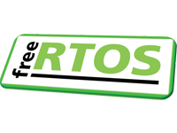

 
 

# 精通 FreeRTOS™[^1][^2] 实时内核

## 实战教程指南 ##

### Richard Barry -与- FreeRTOS 团队 ###

**发布版本 - 1.0**

 
 

 
 
 
 
 
 
 
 
 
 
 
 
 
 
 
 
 
 
 
 
 
 
 

  
[^1]: FreeRTOS™、FreeRTOS.org™ 以及 FreeRTOS 徽标是亚马逊网络服务的商标。
[^2]: OPEN**RTOS**® 和 SAFE**RTOS**® 是 WITTENSTEIN High Integrity Systems Ltd. 的注册商标。所有其他品牌或产品名称均为其各自持有者的财产。

