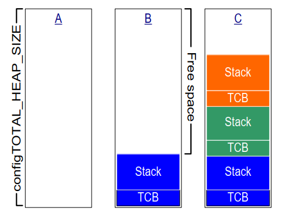

# 3 堆内存管理

## 3.1 引言

### 3.1.1 前提条件

掌握C编程是使用FreeRTOS的前提，因此本章假设读者熟悉以下概念：

- C项目构建的不同编译和链接阶段。
- 栈和堆的概念。
- 标准C库中的`malloc()`和`free()`函数。

### 3.1.2 范围

本章涵盖以下内容：

- FreeRTOS何时分配RAM。
- FreeRTOS附带的五种示例内存分配方案。
- 选择哪种内存分配方案。

### 3.1.3 在静态和动态内存分配之间切换

接下来的章节将介绍内核对象，如任务、队列、信号量和事件组。用于保存这些对象的RAM可以在编译时静态分配，也可以在运行时动态分配。动态分配减少了设计和规划的工作量，简化了API，并最小化了RAM占用。静态分配更加确定性，消除了处理内存分配失败的需求，并消除了堆碎片化的风险（即堆中有足够的可用内存，但不是一个可用的连续块）。

使用静态分配内存创建内核对象的FreeRTOS API函数仅在`configSUPPORT_STATIC_ALLOCATION`在FreeRTOSConfig.h中设置为1时可用。使用动态分配内存创建内核对象的FreeRTOS API函数仅在`configSUPPORT_DYNAMIC_ALLOCATION`在FreeRTOSConfig.h中设置为1或保持未定义时可用。同时将两个常量设置为1是有效的。

有关`configSUPPORT_STATIC_ALLOCATION`的更多信息，请参阅第3.4节使用静态内存分配。

### 3.1.4 使用动态内存分配

动态内存分配是C编程的一个概念，而不是FreeRTOS或多任务处理特有的概念。它对FreeRTOS具有相关性，因为内核对象可以选择使用动态分配的内存创建，而通用的C库函数`malloc()`和`free()`可能不适用于以下一个或多个原因：

- 它们在小型嵌入式系统上并不总是可用。
- 它们的实现可能相对较大，占用宝贵的代码空间。
- 它们很少是线程安全的。
- 它们不是确定性的；执行这些函数所需的时间会从一次调用到另一次调用有所不同。
- 它们可能会受到碎片化的影响（堆中有足够的免费内存，但没有一个可用的连续块）。
- 它们可能会使链接器配置变得复杂。
- 如果允许堆空间增长到其他变量使用的内存中，它们可能会成为难以调试的错误的来源。

### 3.1.5 动态内存分配的选项

早期版本的FreeRTOS使用了内存池分配方案，其中在编译时预分配不同大小的内存块池，然后由内存分配函数返回。虽然块分配在实时系统中很常见，但由于其在非常小的嵌入式系统中对RAM的低效使用导致了许多支持请求，因此从FreeRTOS中移除了。

FreeRTOS现在将内存分配视为可移植层的一部分（而不是核心代码库的一部分）。这是因为不同的嵌入式系统具有不同的动态内存分配和时间要求，因此单个动态内存分配算法只会适用于应用程序的子集。此外，从核心代码库中移除动态内存分配使应用程序编写者在适当时提供自己的特定实现。

当FreeRTOS需要RAM时，它调用`pvPortMalloc()`而不是`malloc()`。同样，当FreeRTOS释放先前分配的RAM时，它调用`vPortFree()`而不是`free()`。`pvPortMalloc()`具有与标准C库`malloc()`函数相同的原型，`vPortFree()`具有与标准C库`free()`函数相同的原型。

`pvPortMalloc()`和`vPortFree()`是公共函数，因此也可以从应用程序代码中调用。

FreeRTOS附带了五个`pvPortMalloc()`和`vPortFree()`的示例实现，所有这些实现都在本章中有文档说明。FreeRTOS应用程序可以使用示例实现之一，也可以提供自己的实现。

这五个示例分别定义在heap_1.c、heap_2.c、heap_3.c、heap_4.c和heap_5.c源文件中，所有这些文件都位于FreeRTOS/Source/portable/MemMang目录中。


## 3.2 示例内存分配方案

### 3.2.1 Heap_1

对于小型、专用的嵌入式系统，通常只在启动FreeRTOS调度程序之前创建任务和其他内核对象。在这种情况下，内存只在应用程序开始执行实时功能之前由内核（动态）分配，并且内存在应用程序的生命周期内保持分配状态。这意味着选择的分配方案不必考虑更复杂的内存分配问题，如确定性和碎片化，而是可以优先考虑代码大小和简单性等属性。

Heap_1.c实现了一个非常基本的`pvPortMalloc()`版本，并且没有实现`vPortFree()`。从不删除任务或其他内核对象的应用程序有可能使用heap_1。一些商业关键和安全关键系统，否则会禁止使用动态内存分配，也有可能使用heap_1。关键系统通常禁止动态内存分配，因为与非确定性、内存碎片化和分配失败相关的不确定性。Heap_1总是确定性的，并且不能碎片化内存。

Heap_1对`pvPortMalloc()`的实现只是将一个简单的`uint8_t`数组称为FreeRTOS堆分成较小的块，每次调用时。FreeRTOSConfig.h常量`configTOTAL_HEAP_SIZE`设置数组的大小（以字节为单位）。将堆实现为静态分配的数组使FreeRTOS看起来消耗了大量RAM，因为堆成为FreeRTOS数据的一部分。

每个动态分配的任务都会导致对`pvPortMalloc()`的两次调用。第一次分配任务控制块（TCB），第二次分配任务的堆栈。图3.1演示了heap_1如何在创建任务时将简单数组分成较小的块。

参考图3.1：

- **A**显示了在创建任何任务之前的数组——整个数组都是免费的。

- **B**显示了创建一个任务后的数组。

- **C**显示了创建三个任务后的数组。

<a name="fig3.1" title="图3.1 每次创建任务时从heap_1数组分配RAM"></a>

* * *

***图3.1*** *每次创建任务时从heap_1数组分配RAM*
* * *


### 3.2.2 Heap_2

Heap_2 已被 heap_4 取代，后者包含增强功能。
Heap_2 保留在 FreeRTOS 发行版中以保持向后兼容性，不建议用于新设计。

Heap_2.c 通过将一个由 `configTOTAL_HEAP_SIZE` 常量维度的数组分割来工作。它使用最佳适配算法来分配内存，并且与 heap_1 不同，它确实实现了 `vPortFree()`。同样，将堆实现为静态分配的数组使得 FreeRTOS 看起来消耗了大量 RAM，因为堆成为 FreeRTOS 数据的一部分。

最佳适配算法确保 `pvPortMalloc()` 使用与请求的字节数最接近的大小的空闲内存块。例如，考虑以下情况：

- 堆包含三个大小分别为 5 字节、25 字节和 100 字节的空闲内存块。
- `pvPortMalloc()` 请求 20 字节的 RAM。

最小的可以容纳请求字节数的空闲 RAM 块是 25 字节块，因此 `pvPortMalloc()` 在返回指向 20 字节块的指针之前，将 25 字节块拆分为一个 20 字节块和一个 5 字节块[^2]。新的 5 字节块将保持可用于未来对 `pvPortMalloc()` 的调用。

[^2]: 这是一种过于简化的说法，因为heap_2在堆区域内存储块大小的信息，因此两个分割块的总和实际上会小于25。

与heap_4不同，heap_2不会将相邻的空闲块合并成一个较大的块，因此比heap_4更容易受到碎片化的影响。然而，如果分配和随后释放的块始终是相同大小，碎片化就不是问题。

<a name="fig3.2" title="图3.2 从heap_2数组中分配和释放RAM，任务被创建和删除"></a>

* * *

***图3.2*** *从heap_2数组中分配和释放RAM，任务被创建和删除*
* * *

图3.2演示了当任务被创建、删除并再次创建时，最佳适配算法的工作原理。参考图3.2：

- **A** 显示了分配三个任务后的数组。数组顶部仍然有一个大的空闲块。

- **B** 显示了删除一个任务后的数组。数组顶部的大空闲块保持不变。现在还有两个较小的空闲块，它们之前保存了被删除任务的TCB和堆栈。

- **C** 显示了创建另一个任务后的情况。创建任务导致在 `xTaskCreate()` API 函数内部调用了两次 `pvPortMalloc()`，一次用于分配新的TCB，另一次用于分配任务栈。本书的第3.4节描述了 `xTaskCreate()`。

  每个TCB的大小相同，因此最佳适配算法重用了保存已删除任务的TCB的RAM块来保存创建任务的TCB。

  如果分配给新创建任务的栈的大小与分配给先前删除任务的栈的大小相同，那么最佳适配算法将重用保存已删除任务的栈的RAM块来保存创建任务的栈。

  数组顶部的较大未分配块保持不变。

Heap\_2 不是确定性的，但比大多数标准库实现的 `malloc()` 和 `free()` 更快。

### 3.2.3 Heap\_3

Heap\_3.c 使用标准库的 `malloc()` 和 `free()` 函数，因此链接器配置定义了堆大小，`configTOTAL_HEAP_SIZE` 常量未使用。

Heap\_3 通过在其执行期间暂时挂起 FreeRTOS 调度器来使 `malloc()` 和 `free()` 线程安全。第8章，资源管理，涵盖了线程安全和调度器挂起。


### 3.2.4 Heap_4

与heap_1和heap_2类似，heap_4通过将数组分割成较小的块来工作。同样，数组是静态分配的，并由`configTOTAL_HEAP_SIZE`确定其尺寸，这使得FreeRTOS看起来使用了大量的RAM，因为堆成为FreeRTOS数据的一部分。

Heap_4使用首次适配算法来分配内存。与heap_2不同，heap_4将相邻的空闲内存块合并（整合）成一个较大的块，从而最小化内存碎片的风险。

首次适配算法确保`pvPortMalloc()`使用第一个足够大的空闲内存块来容纳请求的字节数。例如，考虑以下情况：

- 堆包含三个空闲内存块，按它们在数组中的顺序分别是5字节、200字节和100字节。
- `pvPortMalloc()`请求20字节的RAM。

请求的字节数可以容纳的第一个空闲RAM块是200字节块，因此`pvPortMalloc()`将200字节块分割成一个20字节块和一个180字节块[^3]，然后返回指向20字节块的指针。新的180字节块仍然可供未来对`pvPortMalloc()`的调用使用。

[^3]: 这是一种过于简化的说法，因为heap_4在堆区域内存储块大小的信息，因此两个分割块的总和实际上会小于200字节。

Heap_4将相邻的空闲块合并（合并）成一个较大的块，最小化碎片风险，并使其适用于反复分配和释放不同大小的RAM块的应用程序。

<a name="fig3.3" title="图3.3 从heap_4数组中分配和释放RAM"></a>

* * *

***图3.3*** *从heap_4数组中分配和释放RAM*
* * *

图3.3演示了带有内存合并的heap_4首次适配算法的工作原理。参考图3.3：

- **A** 显示了创建三个任务后的数组。数组顶部仍然有一个大的空闲块。

- **B** 显示了删除一个任务后的数组。数组顶部的大空闲块保持不变。现在，删除的任务的TCB和堆栈曾经所在的地方又有一个空闲块。与heap_2示例不同，heap_4将之前分别保存删除任务的TCB和堆栈的两个内存块合并成一个较大的单个空闲块。

- **C** 显示了创建FreeRTOS队列后的情况。本书的第5.3节描述了用于动态分配队列的`xQueueCreate()` API函数。`xQueueCreate()` 调用 `pvPortMalloc()` 来分配队列使用的RAM。由于heap_4使用的是首次适配算法，`pvPortMalloc()` 从第一个足够大的空闲RAM块中分配RAM，而在图3.3中，这是由删除任务释放的RAM。队列并未消耗掉空闲块中的所有RAM，因此该块被分成两部分，未使用的部分仍然可供未来对`pvPortMalloc()`的调用使用。

- **D** 显示了直接从应用程序代码中调用`pvPortMalloc()`，而不是间接通过调用FreeRTOS API函数后的情况。用户分配的块足够小，可以放入第一个空闲块中，该块位于队列分配的内存和其后的TCB分配的内存之间。

  删除任务释放的内存现在分成了三个单独的块；第一个块保存队列，第二个块保存用户分配的内存，第三个块仍然是空闲的。

- **E** 显示了删除队列后的情况，这会自动释放分配给删除队列的内存。现在用户分配的块两侧都有空闲内存。

- **F** 显示了释放用户分配内存后的情况。之前由用户分配块使用的内存已经与两侧的空闲内存合并，形成一个更大的单一空闲块。

Heap\_4 不是确定性的，但比大多数标准库实现的 `malloc()` 和 `free()` 更快。

### 3.2.5 Heap\_5

Heap\_5 使用与 heap\_4 相同的分配算法。与 heap\_4 不同，heap\_4 仅限于从单个数组分配内存，heap\_5 可以将来自多个分离内存空间的内存合并为一个堆。当系统提供的RAM在系统的内存映射中不显示为一个单一的连续块时，heap\_5 非常有用。

### 3.2.6 初始化 heap\_5: vPortDefineHeapRegions() API 函数

`vPortDefineHeapRegions()` 通过指定构成由 heap\_5 管理的堆的每个单独内存区域的起始地址和大小来初始化 heap\_5。Heap\_5 是唯一需要显式初始化的提供的堆分配方案，在调用 `vPortDefineHeapRegions()` 之前不能使用。这意味着在调用 `vPortDefineHeapRegions()` 之前，不能动态创建内核对象，如任务、队列和信号量。

<a name="list3.1" title="Listing 3.1 The vPortDefineHeapRegions() API function prototype"></a>

```c
void vPortDefineHeapRegions( const HeapRegion_t * const pxHeapRegions );
```
***Listing 3.1*** *The vPortDefineHeapRegions() API function prototype*

`vPortDefineHeapRegions()` 以一个 `HeapRegion_t` 结构数组作为其唯一参数。每个结构定义了一个内存块的起始地址和大小，该内存块将成为堆的一部分——整个结构数组定义了整个堆空间。

<a name="list3.2" title="Listing 3.2 The HeapRegion_t structure"></a>

```c
typedef struct HeapRegion
{
    /* The start address of a block of memory that will be part of the heap.*/
    uint8_t *pucStartAddress;

    /* The size of the block of memory in bytes. */
    size_t xSizeInBytes;

} HeapRegion_t;
```
***Listing 3.2*** *The HeapRegion_t structure*

**参数:**

- `pxHeapRegions`

  指向 `HeapRegion_t` 结构数组起始位置的指针。每个结构定义了一个内存块的起始地址和大小，该内存块将成为堆的一部分。

数组中的 `HeapRegion_t` 结构必须按起始地址排序；描述起始地址最低的内存区域的 `HeapRegion_t` 结构必须是数组中的第一个结构，描述起始地址最高的内存区域的 `HeapRegion_t` 结构必须是数组中的最后一个结构。

使用 `pucStartAddress` 成员设置为 `NULL` 的 `HeapRegion_t` 结构标记数组的结束。

例如，考虑图 3.4 **A** 中显示的假设内存映射，其中包含三个单独的 RAM 块：RAM1、RAM2 和 RAM3。假设可执行代码放置在只读内存中，未显示。

<a name="fig3.4" title="图 3.4 内存映射"></a>

* * *

***图 3.4*** *内存映射*
* * *

清单 3.3 显示了一个 `HeapRegion_t` 结构的数组，这些结构共同描述了三个 RAM 块的全部内容。

<a name="list3.3" title="清单 3.3 一个描述三个 RAM 区域的 HeapRegion_t 结构数组"></a>

```c
/* 定义三个 RAM 区域的起始地址和大小。 */
#define RAM1_START_ADDRESS ( ( uint8_t * ) 0x00010000 )
#define RAM1_SIZE ( 64 * 1024 )

#define RAM2_START_ADDRESS ( ( uint8_t * ) 0x00020000 )
#define RAM2_SIZE ( 32 * 1024 )

#define RAM3_START_ADDRESS ( ( uint8_t * ) 0x00030000 )
#define RAM3_SIZE ( 32 * 1024 )

/* 创建一个 HeapRegion_t 定义的数组，每个 RAM 区域一个索引，并用包含 NULL 地址的 HeapRegion_t 结构终止数组。HeapRegion_t 结构必须按起始地址顺序出现，起始地址最低的结构应首先出现。 */
const HeapRegion_t xHeapRegions[] =
{
    { RAM1_START_ADDRESS, RAM1_SIZE },
    { RAM2_START_ADDRESS, RAM2_SIZE },
    { RAM3_START_ADDRESS, RAM3_SIZE },
    { NULL,               0         } /* 标记数组的结束。 */
};

int main( void )
{
    /* 初始化 heap_5。 */
    vPortDefineHeapRegions( xHeapRegions );

    /* 在此添加应用程序代码。 */
}
```
***清单 3.3*** *一个描述三个 RAM 区域的 HeapRegion_t 结构数组*

虽然清单 3.3 正确描述了 RAM，但它并不是一个可用的示例，因为它将所有 RAM 都分配给了堆，没有为其他变量留下任何 RAM。

构建过程的链接阶段为每个变量分配一个RAM地址。链接器可用的RAM通常由链接器配置文件描述，例如链接脚本。在图3.4 **B**中，假设链接脚本包含了关于RAM1的信息，但没有包含关于RAM2或RAM3的信息。因此，链接器将变量放置在RAM1中，只留下RAM1中地址0x0001nnnn以上的部分供heap_5使用。0x0001nnnn的实际值取决于应用程序中包含的所有变量的总大小。链接器留下了所有的RAM2和所有的RAM3未使用，使得整个RAM2和整个RAM3都可供heap_5使用。

清单3.3中的代码将导致分配给heap_5的RAM地址0x0001nnnn以下的部分与用于存储变量的RAM重叠。如果将`xHeapRegions[]`数组中第一个`HeapRegion_t`结构的起始地址设置为0x0001nnnn，而不是起始地址0x00010000，堆将不会与链接器使用的RAM重叠。然而，这不是一个推荐的解决方案，因为：

- 起始地址可能不容易确定。
- 链接器使用的RAM量可能会在未来的构建中发生变化，这将需要更新`HeapRegion_t`结构中使用的起始地址。
- 构建工具将无法知道，因此也无法警告应用程序编写者，如果链接器使用的RAM和heap_5使用的RAM重叠。

Listing 3.4展示了一个更方便和易于维护的示例。它声明了一个名为`ucHeap`的数组。`ucHeap`是一个普通变量，因此它成为链接器分配给RAM1的数据的一部分。`xHeapRegions`数组中的第一个`HeapRegion_t`结构描述了`ucHeap`的起始地址和大小，因此`ucHeap`成为由heap_5管理的内存的一部分。`ucHeap`的大小可以增加，直到链接器使用的RAM消耗了所有的RAM1，如图3.4 **C**所示。

<a name="list3.4" title="Listing 3.4 An array of HeapRegion\_t structures that describe all of RAM2, all of RAM3, but only part of RAM1"></a>

```c
/* 定义两个不由链接器使用的RAM区域的起始地址和大小。 */
#define RAM2_START_ADDRESS ( ( uint8_t * ) 0x00020000 )
#define RAM2_SIZE ( 32 * 1024 )

#define RAM3_START_ADDRESS ( ( uint8_t * ) 0x00030000 )
#define RAM3_SIZE ( 32 * 1024 )

/* 声明一个将成为heap_5使用的堆的一部分的数组。该数组将由链接器放置在RAM1中。 */
#define RAM1_HEAP_SIZE ( 30 * 1024 )
static uint8_t ucHeap[ RAM1_HEAP_SIZE ];

/* 创建一个HeapRegion_t定义的数组。与Listing 3.3不同，第一个条目描述了所有的RAM1，因此heap_5将使用所有的RAM1，这次第一个条目只描述了ucHeap数组，因此heap_5只会使用包含ucHeap数组的RAM1部分。HeapRegion_t结构必须仍然按起始地址顺序出现，包含最低起始地址的结构首先出现。 */

const HeapRegion_t xHeapRegions[] =
{
    { ucHeap,             RAM1_HEAP_SIZE },
    { RAM2_START_ADDRESS, RAM2_SIZE },
    { RAM3_START_ADDRESS, RAM3_SIZE },
    { NULL,               0 }           /* 标记数组的结束。 */
};
```
***Listing 3.4*** *An array of HeapRegion\_t structures that describe all of RAM2, all of RAM3, but only part of RAM1*


Listing 3.4中展示的技术的优点包括：

- 不需要使用硬编码的起始地址。
- `HeapRegion_t`结构中使用的地址将由链接器自动设置，因此即使链接器在未来的构建中使用的RAM量发生变化，它也总是正确的。
- 分配给heap_5的RAM不可能与链接器放置在RAM1中的数据重叠。
- 如果`ucHeap`太大，应用程序将无法链接。

## 3.3 堆相关的实用函数和宏

### 3.3.1 定义堆的起始地址

heap\_1、heap\_2 和 heap\_4 从一个由 `configTOTAL_HEAP_SIZE` 维度的静态分配数组中分配内存。本节将这些分配方案统称为 heap\_n。

有时需要将堆放置在特定的内存地址。例如，动态创建的任务分配的堆栈来自堆，因此可能需要将堆放置在快速的内部内存中，而不是慢速的外部内存中。（请参阅下面的子节“将任务堆栈放置在快速内存”中，了解另一种在快速内存中分配任务堆栈的方法）。编译时配置常量 `configAPPLICATION_ALLOCATED_HEAP` 使应用程序能够声明数组，而不是在 heap\_n.c 源文件中声明。在应用程序代码中声明数组使应用程序编写者能够指定其起始地址。

如果在 FreeRTOSConfig.h 中将 `configAPPLICATION_ALLOCATED_HEAP` 设置为 1，则使用 FreeRTOS 的应用程序必须分配一个名为 `ucHeap` 的 `uint8_t` 数组，并由常量 `configTOTAL_HEAP_SIZE` 维度。

将变量放置在特定内存地址的语法取决于使用的编译器，因此请参考您的编译器文档。以下是两个编译器的示例：

- 列表 3.5 显示了 GCC 编译器声明数组并将数组放置在名为 `.my_heap` 的内存部分所需的语法。
- 列表 3.6 显示了 IAR 编译器声明数组并将数组放置在绝对内存地址 0x20000000 所需的语法。

<a name="list3.5" title="列表 3.5 使用 GCC 语法声明将由 heap\_4 使用的数组，并将数组放置在名为 .my\_heap 的内存部分"></a>

```c
uint8_t ucHeap[ configTOTAL_HEAP_SIZE ] __attribute__ ( ( section( ".my_heap" ) ) );
```
***列表 3.5*** *使用 GCC 语法声明将由 heap\_4 使用的数组，并将数组放置在名为 .my\_heap 的内存部分*

<a name="list3.6" title="列表 3.6 使用 IAR 语法声明将由 heap\_4 使用的数组，并将数组放置在绝对地址 0x20000000"></a>

```c
uint8_t ucHeap[ configTOTAL_HEAP_SIZE ] @ 0x20000000;
```
***列表 3.6*** *使用 IAR 语法声明将由 heap\_4 使用的数组，并将数组放置在绝对地址 0x20000000*


### 3.3.2 xPortGetFreeHeapSize() API 函数

`xPortGetFreeHeapSize()` API 函数返回在调用函数时堆中可用的字节数。它不提供堆碎片信息。

`xPortGetFreeHeapSize()` 不是为 heap_3 实现的。

<a name="list3.7" title="Listing 3.7 The xPortGetFreeHeapSize() API function prototype"></a>

```c
size_t xPortGetFreeHeapSize( void );
```
***Listing 3.7*** *xPortGetFreeHeapSize() API 函数原型*

**返回值：**

- `xPortGetFreeHeapSize()` 返回在调用时堆中未分配的字节数。

### 3.3.3 xPortGetMinimumEverFreeHeapSize() API 函数

`xPortGetMinimumEverFreeHeapSize()` API 函数返回自 FreeRTOS 应用程序开始执行以来堆中曾经存在的最小未分配字节数。

`xPortGetMinimumEverFreeHeapSize()` 返回的值表示应用程序曾经接近耗尽堆空间的程度。例如，如果 `xPortGetMinimumEverFreeHeapSize()` 返回 200，那么自应用程序开始执行以来，某个时刻它曾经接近耗尽 200 字节的堆空间。

`xPortGetMinimumEverFreeHeapSize()` 也可以用于优化堆大小。例如，如果在执行已知堆使用量最高的代码后，`xPortGetMinimumEverFreeHeapSize()` 返回 2000，则可以将 `configTOTAL_HEAP_SIZE` 减少至多 2000 字节。

`xPortGetMinimumEverFreeHeapSize()` 仅在 heap_4 和 heap_5 中实现。

<a name="list3.8" title="Listing 3.8 The xPortGetMinimumEverFreeHeapSize() API function prototype"></a>

```c
size_t xPortGetMinimumEverFreeHeapSize( void );
```
***Listing 3.8*** *xPortGetMinimumEverFreeHeapSize() API 函数原型*

**返回值：**

- `xPortGetMinimumEverFreeHeapSize()` 返回自 FreeRTOS 应用程序开始执行以来堆中曾经存在的最小未分配字节数。


### 3.3.4 vPortGetHeapStats() API 函数

Heap_4 和 heap_5 实现了 `vPortGetHeapStats()`，该函数通过引用完成 `HeapStats_t` 结构体，作为函数的唯一参数。

清单 3.9 显示了 `vPortGetHeapStats()` 函数原型。清单 3.10 显示了 `HeapStats_t` 结构体成员。

<a name="list3.9" title="清单 3.9 vPortGetHeapStatus() API 函数原型"></a>

```c
void vPortGetHeapStats( HeapStats_t *xHeapStats );
```
***清单 3.9*** *vPortGetHeapStatus() API 函数原型*

<a name="list3.10" title="清单 3.10 HeapStatus_t() 结构"></a>

```c
/* vPortGetHeapStats() 函数的原型。 */
void vPortGetHeapStats( HeapStats_t *xHeapStats );

/* HeapStats_t 结构体的定义。所有大小以字节为单位。 */
typedef struct xHeapStats
{
    /* 当前可用的总堆大小 - 这是所有自由块的总和，而不是最大可用块。 */
    size_t xAvailableHeapSpaceInBytes;

    /* 在调用 vPortGetHeapStats() 时堆中最大的自由块的大小。 */
    size_t xSizeOfLargestFreeBlockInBytes;

    /* 在调用 vPortGetHeapStats() 时堆中最小的自由块的大小。 */
    size_t xSizeOfSmallestFreeBlockInBytes;

    /* 在调用 vPortGetHeapStats() 时堆中自由内存块的数量。 */
    size_t xNumberOfFreeBlocks;

    /* 自系统启动以来堆中总自由内存（所有自由块的总和）的最小量。 */
    size_t xMinimumEverFreeBytesRemaining;

    /* 返回有效内存块的 pvPortMalloc() 调用次数。 */
    size_t xNumberOfSuccessfulAllocations;

    /* 成功释放内存块的 vPortFree() 调用次数。 */
    size_t xNumberOfSuccessfulFrees;
} HeapStats_t;
```
***清单 3.10*** *HeapStatus_t() 结构*


### 3.3.5 收集每任务堆使用统计

应用程序开发者可以使用以下跟踪宏来收集每任务堆使用统计：
- `traceMALLOC`
- `traceFREE`

清单 3.11 显示了这些跟踪宏的一个示例实现，用于收集每任务堆使用统计。

<a name="list3.11" title="清单 3.11 收集每任务堆使用统计"></a>


```c
#define mainNUM_ALLOCATION_ENTRIES          512
#define mainNUM_PER_TASK_ALLOCATION_ENTRIES 32

/*-----------------------------------------------------------*/

/*
 * +-----------------+--------------+----------------+-------------------+
 * | Allocating Task | Entry in use | Allocated Size | Allocated Pointer |
 * +-----------------+--------------+----------------+-------------------+
 * |                 |              |                |                   |
 * +-----------------+--------------+----------------+-------------------+
 * |                 |              |                |                   |
 * +-----------------+--------------+----------------+-------------------+
 */
typedef struct AllocationEntry
{
    BaseType_t xInUse;
    TaskHandle_t xAllocatingTaskHandle;
    size_t uxAllocatedSize;
    void * pvAllocatedPointer;
} AllocationEntry_t;

AllocationEntry_t xAllocationEntries[ mainNUM_ALLOCATION_ENTRIES ];

/*
 * +------+-----------------------+----------------------+
 * | Task | Memory Currently Held | Max Memory Ever Held |
 * +------+-----------------------+----------------------+
 * |      |                       |                      |
 * +------+-----------------------+----------------------+
 * |      |                       |                      |
 * +------+-----------------------+----------------------+
 */
typedef struct PerTaskAllocationEntry
{
    TaskHandle_t xTask;
    size_t uxMemoryCurrentlyHeld;
    size_t uxMaxMemoryEverHeld;
} PerTaskAllocationEntry_t;

PerTaskAllocationEntry_t xPerTaskAllocationEntries[ mainNUM_PER_TASK_ALLOCATION_ENTRIES ];

/*-----------------------------------------------------------*/

void TracepvPortMalloc( size_t uxAllocatedSize, void * pv )
{
    size_t i;
    TaskHandle_t xAllocatingTaskHandle;
    AllocationEntry_t * pxAllocationEntry = NULL;
    PerTaskAllocationEntry_t * pxPerTaskAllocationEntry = NULL;

    if( xTaskGetSchedulerState() != taskSCHEDULER_NOT_STARTED )
    {
        xAllocatingTaskHandle = xTaskGetCurrentTaskHandle();

        for( i = 0; i < mainNUM_ALLOCATION_ENTRIES; i++ )
        {
            if( xAllocationEntries[ i ].xInUse == pdFALSE )
            {
                pxAllocationEntry = &( xAllocationEntries[ i ] );
                break;
            }
        }

        /* Do we already have an entry in the per task table? */
        for( i = 0; i < mainNUM_PER_TASK_ALLOCATION_ENTRIES; i++ )
        {
            if( xPerTaskAllocationEntries[ i ].xTask == xAllocatingTaskHandle )
            {
                pxPerTaskAllocationEntry = &( xPerTaskAllocationEntries[ i ] );
                break;
            }
        }

        /* We do not have an entry in the per task table. Find an empty slot. */
        if( pxPerTaskAllocationEntry == NULL )
        {
            for( i = 0; i < mainNUM_PER_TASK_ALLOCATION_ENTRIES; i++ )
            {
                if( xPerTaskAllocationEntries[ i ].xTask == NULL )
                {
```
```c
                    pxPerTaskAllocationEntry = &( xPerTaskAllocationEntries[ i ] );
                    break;
                }
            }
        }

        /* 确保两个表中都有空间。 */
        configASSERT( pxAllocationEntry != NULL );
        configASSERT( pxPerTaskAllocationEntry != NULL );

        pxAllocationEntry->xAllocatingTaskHandle = xAllocatingTaskHandle;
        pxAllocationEntry->xInUse = pdTRUE;
        pxAllocationEntry->uxAllocatedSize = uxAllocatedSize;
        pxAllocationEntry->pvAllocatedPointer = pv;

        pxPerTaskAllocationEntry->xTask = xAllocatingTaskHandle;
        pxPerTaskAllocationEntry->uxMemoryCurrentlyHeld += uxAllocatedSize;
        if( pxPerTaskAllocationEntry->uxMaxMemoryEverHeld < pxPerTaskAllocationEntry->uxMemoryCurrentlyHeld )
        {
            pxPerTaskAllocationEntry->uxMaxMemoryEverHeld = pxPerTaskAllocationEntry->uxMemoryCurrentlyHeld;
        }
    }
}
/*-----------------------------------------------------------*/

void TracevPortFree( void * pv )
{
    size_t i;
    AllocationEntry_t * pxAllocationEntry = NULL;
    PerTaskAllocationEntry_t * pxPerTaskAllocationEntry = NULL;

    for( i = 0; i < mainNUM_ALLOCATION_ENTRIES; i++ )
    {
        if( ( xAllocationEntries[ i ].xInUse == pdTRUE ) &&
            ( xAllocationEntries[ i ].pvAllocatedPointer == pv ) )
        {
            pxAllocationEntry = &( xAllocationEntries [ i ] );
            break;
        }
    }

    /* 尝试释放一个从未分配的块。 */
    configASSERT( pxAllocationEntry != NULL );

    for( i = 0; i < mainNUM_PER_TASK_ALLOCATION_ENTRIES; i++ )
    {
        if( xPerTaskAllocationEntries[ i ].xTask == pxAllocationEntry->xAllocatingTaskHandle )
        {
            pxPerTaskAllocationEntry = &( xPerTaskAllocationEntries[ i ] );
            break;
        }
    }

    /* 任务表中必须存在一个条目。 */
    configASSERT( pxPerTaskAllocationEntry != NULL );

    pxPerTaskAllocationEntry->uxMemoryCurrentlyHeld -= pxAllocationEntry->uxAllocatedSize;

    pxAllocationEntry->xInUse = pdFALSE;
    pxAllocationEntry->xAllocatingTaskHandle = NULL;
    pxAllocationEntry->uxAllocatedSize = 0;
    pxAllocationEntry->pvAllocatedPointer = NULL;
}
/*-----------------------------------------------------------*/

/* 以下内容放在FreeRTOSConfig.h中： */
extern void TracepvPortMalloc( size_t uxAllocatedSize, void * pv );
extern void TracevPortFree( void * pv );

#define traceMALLOC( pvReturn, xAllocatedBlockSize ) \
TracepvPortMalloc( xAllocatedBlockSize, pvReturn )

#define traceFREE( pv, xAllocatedBlockSize ) \
TracevPortFree( pv )
```
***清单 3.11*** *收集每任务堆使用统计*

### 3.3.6 内存分配失败钩子函数

与标准库的 `malloc()` 函数类似，`pvPortMalloc()` 如果无法分配请求的RAM数量，则返回NULL。内存分配失败钩子（或回调）是一个应用程序提供的函数，当 `pvPortMalloc()` 返回NULL时会被调用。必须在 FreeRTOSConfig.h 中将 `configUSE_MALLOC_FAILED_HOOK` 设置为 1，以便回调发生。如果在使用动态内存分配创建内核对象的 FreeRTOS API 函数内部调用了内存分配失败钩子，则不会创建该对象。

如果在 FreeRTOSConfig.h 中将 `configUSE_MALLOC_FAILED_HOOK` 设置为 1，则应用程序必须提供一个内存分配失败钩子函数，其名称和原型如清单 3.12 所示。应用程序可以以适合应用程序的任何方式实现该函数。许多提供的 FreeRTOS 演示应用程序将分配失败视为致命错误，但这并不是生产系统的最佳实践，生产系统应从分配失败中优雅恢复。

<a name="list3.12" title="清单 3.12 内存分配失败钩子函数名称和原型"></a>

```c
void vApplicationMallocFailedHook( void );
```
***清单 3.12*** *内存分配失败钩子函数名称和原型*


### 3.3.7 将任务栈放置在快速内存中

由于栈的写入和读取频率很高，因此应将其放置在快速内存中，但这可能不是您希望堆所在的位置。FreeRTOS使用`pvPortMallocStack()`和`vPortFreeStack()`宏来可选地启用在FreeRTOS API代码中分配的栈，使其具有自己的内存分配器。如果希望栈来自由`pvPortMalloc()`管理的堆，则保持`pvPortMallocStack()`和`vPortFreeStack()`未定义，因为它们默认调用`pvPortMalloc()`和`vPortFree()`。否则，定义宏以调用应用程序提供的函数，如清单3.13所示。

<a name="list3.13" title="清单3.13 将pvPortMallocStack()和vPortFreeStack()宏映射到应用程序定义的内存分配器"></a>

```c
/* 由应用程序编写器提供的函数，从快速RAM区域分配和释放内存。 */

void *pvMallocFastMemory( size_t xWantedSize );

void vPortFreeFastMemory( void *pvBlockToFree );

/* 将以下内容添加到FreeRTOSConfig.h，以将pvPortMallocStack()和vPortFreeStack()宏映射到使用快速内存的函数。 */

#define pvPortMallocStack( x ) pvMallocFastMemory( x )

#define vPortFreeStack( x ) vPortFreeFastMemory( x )
```
***清单3.13*** *将pvPortMallocStack()和vPortFreeStack()宏映射到应用程序定义的内存分配器*


## 3.4 使用静态内存分配

第3.1.4节列出了一些动态内存分配带来的缺点。为了避免这些问题，静态内存分配允许开发者显式创建应用程序所需的每个内存块。这有以下优点：

- 所有所需的内存在编译时已知。
- 所有内存都是确定性的。

还有其他优点，但这些优点也带来了一些复杂性。主要的复杂性是增加了一些额外的用户函数来管理一些内核内存，第二个复杂性是确保所有静态内存都在适当的作用域中声明。

### 3.4.1 启用静态内存分配

通过在FreeRTOSConfig.h中将`configSUPPORT_STATIC_ALLOCATION`设置为1，可以启用静态内存分配。 当启用此配置时，内核启用了所有`static`版本的内核函数。这些函数是：

- `xTaskCreateStatic`
- `xEventGroupCreateStatic`
- `xEventGroupGetStaticBuffer`
- `xQueueGenericCreateStatic`
- `xQueueGenericGetStaticBuffers`
- `xQueueCreateMutexStatic`
  - *如果 `configUSE_MUTEXES` 是 1*
- `xQueueCreateCountingSemaphoreStatic`
  - *如果 `configUSE_COUNTING_SEMAPHORES` 是 1*
- `xStreamBufferGenericCreateStatic`
- `xStreamBufferGetStaticBuffers`
- `xTimerCreateStatic`
  - *如果 `configUSE_TIMERS` 是 1*
- `xTimerGetStaticBuffer`
  - *如果 `configUSE_TIMERS` 是 1*

这些函数将在本书的相应章节中解释。

### 3.4.2 静态内核内存

当启用静态内存分配器时，空闲任务和定时器任务（如果启用）将使用用户函数提供的静态内存。这些用户函数是：

- `vApplicationGetTimerTaskMemory`
  - *如果 `configUSE_TIMERS` 为 1*
- `vApplicationGetIdleTaskMemory`

#### 3.4.2.1 vApplicationGetTimerTaskMemory

如果 `configSUPPORT_STATIC_ALLOCATION` 和 `configUSE_TIMERS` 都启用，内核将调用 `vApplicationGetTimerTaskMemory()`，以允许应用程序创建并返回定时器任务TCB和定时器任务堆栈的内存缓冲区。该函数还将返回定时器任务堆栈的大小。定时器任务内存函数的建议实现如清单 3.14 所示。

<a name="list3.14" title="清单 3.14 vApplicationGetTimerTaskMemory 的典型实现"></a>

```c
void vApplicationGetTimerTaskMemory( StaticTask_t **ppxTimerTaskTCBBuffer,
                                     StackType_t **ppxTimerTaskStackBuffer,
                                     uint32_t *pulTimerTaskStackSize )
{
  /* 如果要提供给定时器任务的缓冲区在该函数内声明，则必须声明为静态的，否则它们将在堆栈上分配，因此在该函数退出后将不再存在。 */
  static StaticTask_t xTimerTaskTCB;
  static StackType_t uxTimerTaskStack[ configMINIMAL_STACK_SIZE ];

  /* 传出一个指向 StaticTask_t 结构的指针，其中将存储定时器任务的状态。 */
  *ppxTimerTaskTCBBuffer = &xTimerTaskTCB;

  /* 传出将用作定时器任务堆栈的数组。 */
  *ppxTimerTaskStackBuffer = uxTimerTaskStack;

  /* 传出指向由 *ppxTimerTaskStackBuffer 指向的数组的堆栈大小。请注意，堆栈大小是 StackType_t 的计数 */
  *pulTimerTaskStackSize = sizeof(uxTimerTaskStack) / sizeof(*uxTimerTaskStack);
}
```
***清单 3.14*** *vApplicationGetTimerTaskMemory 的典型实现*

由于任何系统（包括 SMP）中只有一个定时器任务，因此解决定时器任务内存问题的有效方法是在 `vApplicationGetTimeTaskMemory()` 函数中分配静态缓冲区，并将缓冲区指针返回给内核。


#### 3.4.2.2 vApplicationGetIdleTaskMemory

空闲任务在核心没有安排的工作时运行。空闲任务执行一些维护工作，并且如果启用了，可以触发用户的 `vTaskIdleHook()`。在对称多处理系统（SMP）中，每个剩余的核心也有非维护的空闲任务，但这些任务在内部静态分配为 `configMINIMAL_STACK_SIZE` 字节。

`vApplicationGetIdleTaskMemory` 函数被调用以允许应用程序为“主”空闲任务创建所需的缓冲区。清单 3.15 显示了使用静态局部变量创建所需缓冲区的 `vApplicationIdleTaskMemory()` 函数的典型实现。

<a name="list3.15" title="清单 3.15 vApplicationGetIdleTaskMemory 的典型实现"></a>

```c
void vApplicationGetIdleTaskMemory( StaticTask_t **ppxIdleTaskTCBBuffer,
                                    StackType_t **ppxIdleTaskStackBuffer,
                                    uint32_t *pulIdleTaskStackSize )
{
  static StaticTask_t xIdleTaskTCB;
  static StackType_t uxIdleTaskStack[ configMINIMAL_STACK_SIZE ];

  *ppxIdleTaskTCBBuffer = &xIdleTaskTCB;
  *ppxIdleTaskStackBuffer = uxIdleTaskStack;
  *pulIdleTaskStackSize = configMINIMAL_STACK_SIZE;
}
```
***清单 3.15*** *vApplicationGetIdleTaskMemory 的典型实现*


