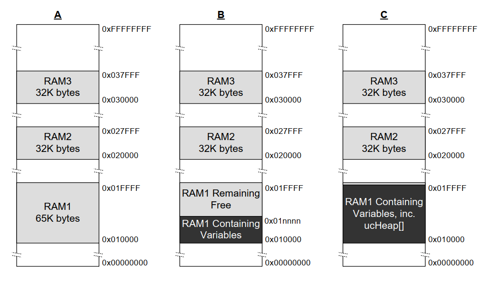

# 3 堆内存管理

## 3.1 简介

### 3.1.1 前提条件

熟练使用C语言是使用FreeRTOS的前提条件，因此本章假设读者熟悉以下概念：

- C项目构建的不同编译和链接阶段
- 什么是栈和堆
- 标准C库中的`malloc()`和`free()`函数

### 3.1.2 范围

本章内容包括：

- FreeRTOS何时分配RAM
- FreeRTOS提供的五种示例内存分配方案
- 如何选择内存分配方案

### 3.1.3 静态与动态内存分配之间的切换

接下来的章节将介绍诸如任务、队列、信号量和事件组等内核对象。这些对象所需的RAM可以在编译时静态分配或在运行时动态分配。动态分配减少了设计和规划的工作量，简化了API，并最小化了RAM占用空间。静态分配更具确定性，无需处理内存分配失败，并消除了堆碎片化（堆中有足够的空闲内存但没有一个可用的连续块）的风险。

使用静态分配内存创建内核对象的FreeRTOS API函数仅在`configSUPPORT_STATIC_ALLOCATION`在FreeRTOSConfig.h中设置为1时可用。使用动态分配内存创建内核对象的FreeRTOS API函数仅在`configSUPPORT_DYNAMIC_ALLOCATION`设置为1或在FreeRTOSConfig.h中未定义时可用。同时将这两个常量设置为1是有效的。

更多关于`configSUPPORT_STATIC_ALLOCATION`的信息，请参见第3.4节“使用静态内存分配”。

### 3.1.4 使用动态内存分配

动态内存分配是C语言编程中的一个概念，而非FreeRTOS或多任务处理特有的概念。它与FreeRTOS相关，因为内核对象可以选择使用动态分配的内存来创建，而通用的C库函数`malloc()`和`free()`可能由于以下一个或多个原因而不适合使用：

- 它们在小型嵌入式系统上并不总是可用。
- 它们的实现可能相对较大，占用宝贵的代码空间。
- 它们通常不是线程安全的。
- 它们不具备确定性；函数执行所需的时间每次调用都可能不同。
- 它们可能会产生内存碎片（即堆中有足够的空闲内存，但没有一个可用的连续块）。
- 它们可能会使链接器配置复杂化。
- 如果堆空间被允许扩展到其他变量使用的内存中，它们可能会成为难以调试的错误来源。

### 3.1.5 动态内存分配的选项

早期版本的FreeRTOS使用了内存池分配方案，即在编译时预分配不同大小的内存块池，然后由内存分配函数返回。尽管块分配在实时系统中很常见，但由于其在非常小的嵌入式系统中对RAM的低效使用导致了许多支持请求，FreeRTOS中已移除了该方案。

FreeRTOS现在将内存分配视为可移植层的一部分（而不是核心代码库的一部分）。这是因为不同的嵌入式系统有不同的动态内存分配和时间要求，所以单一的动态内存分配算法只能适用于一部分应用。此外，将动态内存分配从核心代码库中移除，使得应用开发人员可以在适当的时候提供自己的特定实现。

当FreeRTOS需要RAM时，它会调用`pvPortMalloc()`而不是`malloc()`。同样，当FreeRTOS释放先前分配的RAM时，它会调用`vPortFree()`而不是`free()`。`pvPortMalloc()`与标准C库函数`malloc()`具有相同的原型，`vPortFree()`与标准C库函数`free()`具有相同的原型。

`pvPortMalloc()`和`vPortFree()`是公共函数，因此它们也可以从应用程序代码中调用。

FreeRTOS提供了五个`pvPortMalloc()`和`vPortFree()`的示例实现，本章将对这些实现进行文档说明。FreeRTOS应用程序可以使用其中一个示例实现，或者提供自己的实现。

这五个示例分别定义在heap\_1.c、heap\_2.c、heap\_3.c、heap\_4.c和heap\_5.c源文件中，这些文件都位于FreeRTOS/Source/portable/MemMang目录中。


## 3.2 内存分配方案示例

### 3.2.1 Heap\_1

在小型专用嵌入式系统中，通常只在启动 FreeRTOS 调度器之前创建任务和其他内核对象。在这种情况下，内核仅在应用程序开始执行任何实时功能之前（动态）分配内存，并且这些内存在应用程序的整个生命周期内都保持分配状态。这意味着所选择的分配方案无需考虑更复杂的内存分配问题，例如确定性和碎片化，而是可以优先考虑代码大小和简单性等属性。

Heap\_1.c 实现了 `pvPortMalloc()` 的一个非常基础的版本，但未实现 `vPortFree()`。从不删除任务或其他内核对象的应用程序有可能使用 heap\_1。一些原本禁止使用动态内存分配的商业关键系统和安全关键系统也有可能使用 heap\_1。关键系统通常禁止动态内存分配，因为与非确定性、内存碎片和分配失败相关的不确定性。Heap\_1 始终是确定性的，并且不会导致内存碎片。

Heap\_1 的 `pvPortMalloc()` 实现简单地将一个名为 FreeRTOS 堆的 `uint8_t` 数组在每次调用时细分为更小的块。FreeRTOSConfig.h 中的常量 `configTOTAL_HEAP_SIZE` 以字节为单位设置该数组的大小。将堆实现为静态分配的数组会使 FreeRTOS 看起来消耗大量 RAM，因为堆成为 FreeRTOS 数据的一部分。

每个动态分配的任务会导致两次对 `pvPortMalloc()` 的调用。第一次分配任务控制块 (TCB)，第二次分配任务的堆栈。图 3.1 展示了 heap\_1 如何随着任务的创建将简单数组细分。

参考图 3.1：

- **A** 显示在创建任何任务之前的数组——整个数组都是空闲的。

- **B** 显示在创建一个任务之后的数组。

- **C** 显示在创建三个任务之后的数组。

<a name="fig3.1" title="图 3.1 每次创建任务时从 heap\_1 数组分配 RAM"></a>

* * *

***图 3.1*** *每次创建任务时从 heap\_1 数组分配 RAM*
* * *


### 3.2.2 Heap\_2

Heap\_2 已被 heap\_4 取代，后者包含了增强的功能。为了向后兼容，FreeRTOS 发行版中保留了 Heap\_2，但不建议在新设计中使用。

Heap\_2.c 同样通过划分由 `configTOTAL_HEAP_SIZE` 常量定义的数组来工作。它使用最佳适应算法（best-fit）来分配内存，并且与 heap\_1 不同，它实现了 `vPortFree()`。同样，由于将堆实现为静态分配的数组，FreeRTOS 看起来会消耗大量 RAM，因为堆成为了 FreeRTOS 数据的一部分。

最佳适应算法确保 `pvPortMalloc()` 使用与请求字节数最接近的空闲内存块。例如，考虑以下场景：

- 堆中包含三个空闲内存块，大小分别为 5 字节、25 字节和 100 字节。
- `pvPortMalloc()` 请求 20 字节的 RAM。

满足请求字节数的最小空闲内存块是 25 字节的块，因此 `pvPortMalloc()` 将 25 字节的块分割为一个 20 字节的块和一个 5 字节的块，然后返回指向 20 字节块的指针[^2]。新的 5 字节块仍然可供未来的 `pvPortMalloc()` 调用使用。

[^2]: 这是一个简化的描述，因为 heap\_2 会在堆区域内存储块大小的信息，因此分割后的两个块的总和实际上会小于 25。

与 heap\_4 不同，heap\_2 不会将相邻的空闲块合并为一个更大的块，因此它比 heap\_4 更容易产生碎片化。然而，如果分配和随后释放的块大小始终相同，则碎片化不会成为问题。

<a name="fig3.2" title="图 3.2 在任务创建和删除时，从 heap\_2 数组分配和释放 RAM"></a>

* * *

***图 3.2*** *在任务创建和删除时，从 heap\_2 数组分配和释放 RAM*
* * *

图 3.2 展示了在任务创建、删除和重新创建时，最佳适应算法的工作原理。参考图 3.2：

- **A** 显示了分配三个任务后的数组。数组顶部仍有一个较大的空闲块。

- **B** 显示了删除其中一个任务后的数组。数组顶部的较大空闲块仍然存在。现在还有两个较小的空闲块，它们之前存储了被删除任务的 TCB 和堆栈。

- **C** 显示了创建另一个任务后的情况。创建任务时，`xTaskCreate()` API 函数内部会调用两次 `pvPortMalloc()`，一次用于分配新的 TCB，另一次用于分配任务堆栈。本书的 3.4 节将描述 `xTaskCreate()`。

  每个 TCB 的大小相同，因此最佳适应算法会重用存储已删除任务 TCB 的内存块来存储新创建任务的 TCB。

  如果新创建任务分配的堆栈大小与之前删除任务分配的堆栈大小相同，则最佳适应算法会重用存储已删除任务堆栈的内存块来存储新创建任务的堆栈。

  数组顶部的较大未分配块保持不变。

Heap\_2 不具备确定性，但比大多数标准库实现的 `malloc()` 和 `free()` 更快。


### 3.2.3 Heap\_3

Heap\_3.c 使用了标准库中的 `malloc()` 和 `free()` 函数，因此堆大小由链接器配置定义，且不使用 `configTOTAL_HEAP_SIZE` 常量。

Heap\_3 通过在执行 `malloc()` 和 `free()` 期间暂时挂起 FreeRTOS 调度器来确保线程安全。第 8 章“资源管理”将详细介绍线程安全性和调度器挂起。

### 3.2.4 Heap\_4

与 heap\_1 和 heap\_2 类似，heap\_4 通过将数组细分为更小的块来工作。数组仍然是静态分配的，并通过 `configTOTAL_HEAP_SIZE` 定义大小，这使得 FreeRTOS 看起来使用了大量 RAM，因为堆成为 FreeRTOS 数据的一部分。

Heap\_4 使用首次适应算法来分配内存。与 heap\_2 不同，heap\_4 将相邻的空闲内存块合并（合并）为更大的单个块，从而减少了内存碎片的风险。

首次适应算法确保 `pvPortMalloc()` 使用第一个足够大的空闲内存块来满足请求的字节数。例如，考虑以下场景：

- 堆包含三个空闲内存块，按它们在数组中的顺序分别为 5 字节、200 字节和 100 字节。
- `pvPortMalloc()` 请求 20 字节的 RAM。

请求的字节数适合的第一个空闲 RAM 块是 200 字节的块，因此 `pvPortMalloc()` 将 200 字节的块拆分为一个 20 字节的块和一个 180 字节的块[^3]，然后返回指向 20 字节块的指针。新的 180 字节块仍然可供未来的 `pvPortMalloc()` 调用使用。

[^3]: 这是一个简化描述，因为 heap\_4 在堆区域中存储了块大小的信息，所以拆分后的两个块的总和实际上会小于 200 字节。

Heap\_4 将相邻的空闲块合并为更大的单个块，最大限度地减少了碎片的风险，因此适合需要反复分配和释放不同大小 RAM 块的应用。

<a name="fig3.3" title="图 3.3 从 heap\_4 数组中分配和释放 RAM"></a>

* * *

***图 3.3*** *从 heap\_4 数组中分配和释放 RAM*
* * *

图 3.3 展示了 heap\_4 的首次适应算法与内存合并的工作原理。参考图 3.3：

- **A** 显示了创建三个任务后的数组。数组顶部仍然有一个大的空闲块。
- **B** 显示了删除其中一个任务后的数组。数组顶部的大空闲块仍然存在。现在，被删除任务的 TCB 和堆栈所在的位置出现了另一个空闲块。与 heap\_2 示例不同，heap\_4 将被删除任务的 TCB 和堆栈所在的两个内存块合并为一个更大的空闲块。
- **C** 显示了创建 FreeRTOS 队列后的情况。本书第 5.3 节描述了用于动态分配队列的 `xQueueCreate()` API 函数。`xQueueCreate()` 调用 `pvPortMalloc()` 来分配队列使用的 RAM。由于 heap\_4 使用首次适应算法，`pvPortMalloc()` 从第一个足够大的空闲 RAM 块中分配 RAM，在图 3.3 中，即删除任务后释放的 RAM。队列并未消耗空闲块中的所有 RAM，因此该块被拆分为两部分，未使用的部分仍然可供未来的 `pvPortMalloc()` 调用使用。
- **D** 显示了直接从应用程序代码调用 `pvPortMalloc()` 后的情况，而不是通过调用 FreeRTOS API 函数间接调用。用户分配的块足够小，可以放入第一个空闲块中，即队列分配的内存和其后 TCB 分配的内存之间的块。
  删除任务后释放的内存现在被拆分为三个独立的块：第一个块存储队列，第二个块存储用户分配的内存，第三个块仍然空闲。
- **E** 显示了删除队列后的情况，删除队列会自动释放分配给该队列的内存。现在，用户分配的内存块两侧都有空闲内存。
- **F** 显示了释放用户分配的内存后的情况。之前用于用户分配的内存块与两侧的空闲内存合并，形成了一个更大的单个空闲块。

Heap\_4 不是确定性的，但比大多数标准库实现的 `malloc()` 和 `free()` 更快。


### 3.2.5 Heap\_5

Heap\_5 使用与 heap\_4 相同的分配算法。与 heap\_4 不同的是，heap\_4 仅限于从单个数组中分配内存，而 heap\_5 可以将多个分离的内存空间组合成一个堆。当运行 FreeRTOS 的系统提供的 RAM 在内存映射中不是以单个连续（无间隙）块的形式出现时，heap\_5 非常有用。

### 3.2.6 初始化 heap\_5：vPortDefineHeapRegions() API 函数

`vPortDefineHeapRegions()` 通过指定每个组成 heap\_5 管理的堆的独立内存区域的起始地址和大小来初始化 heap\_5。heap\_5 是唯一需要显式初始化的堆分配方案，在调用 `vPortDefineHeapRegions()` 之前不能使用。这意味着在调用 `vPortDefineHeapRegions()` 之前，无法动态创建任务、队列和信号量等内核对象。

<a name="list3.1" title="Listing 3.1 The vPortDefineHeapRegions() API function prototype"></a>

```c
void vPortDefineHeapRegions( const HeapRegion_t * const pxHeapRegions );
```
***Listing 3.1*** *vPortDefineHeapRegions() API 函数原型*

`vPortDefineHeapRegions()` 接受一个 `HeapRegion_t` 结构体数组作为其唯一参数。每个结构体定义了一个将成为堆的一部分的内存块的起始地址和大小——整个结构体数组定义了完整的堆空间。

<a name="list3.2" title="Listing 3.2 The HeapRegion\_t structure"></a>

```c
typedef struct HeapRegion
{
    /* 将成为堆的一部分的内存块的起始地址。*/
    uint8_t *pucStartAddress;

    /* 内存块的大小（以字节为单位）。 */
    size_t xSizeInBytes;

} HeapRegion_t;
```
***Listing 3.2*** *HeapRegion\_t 结构体*

**参数：**

- `pxHeapRegions`

  指向 `HeapRegion_t` 结构体数组起始位置的指针。每个结构体定义了一个将成为堆的一部分的内存块的起始地址和大小。

  `HeapRegion_t` 结构体数组必须按起始地址排序；描述具有最低起始地址的内存区域的 `HeapRegion_t` 结构体必须是数组中的第一个结构体，而描述具有最高起始地址的内存区域的 `HeapRegion_t` 结构体必须是数组中的最后一个结构体。

  用一个 `pucStartAddress` 成员设置为 `NULL` 的 `HeapRegion_t` 结构体标记数组的结束。

举个例子，考虑图 3.4 **A** 中所示的假设内存映射，其中包含三个独立的 RAM 块：RAM1、RAM2 和 RAM3。假设可执行代码放置在未显示的只读存储器中。

<a name="fig3.4" title="Figure 3.4 Memory Map"></a>

* * *

***Figure 3.4*** *内存映射*
* * *

Listing 3.3 展示了一个 `HeapRegion_t` 结构体数组，该数组共同描述了三个 RAM 块的完整信息。

<a name="list3.3" title="Listing 3.3 An array of HeapRegion\_t structures that together describe the 3 regions of RAM in their entirety"></a>

```c
/* 定义三个 RAM 区域的起始地址和大小。 */
#define RAM1_START_ADDRESS ( ( uint8_t * ) 0x00010000 )
#define RAM1_SIZE ( 64 * 1024 )

#define RAM2_START_ADDRESS ( ( uint8_t * ) 0x00020000 )
#define RAM2_SIZE ( 32 * 1024 )

#define RAM3_START_ADDRESS ( ( uint8_t * ) 0x00030000 )
#define RAM3_SIZE ( 32 * 1024 )

/* 创建一个 HeapRegion_t 定义数组，每个 RAM 区域对应一个索引，并用一个包含 NULL 地址的 HeapRegion_t 结构体终止数组。HeapRegion_t 结构体必须按起始地址顺序排列，包含最低起始地址的结构体必须排在第一位。 */
const HeapRegion_t xHeapRegions[] =
{
    { RAM1_START_ADDRESS, RAM1_SIZE },
    { RAM2_START_ADDRESS, RAM2_SIZE },
    { RAM3_START_ADDRESS, RAM3_SIZE },
    { NULL,               0         } /* 标记数组的结束。 */
};

int main( void )
{
    /* 初始化 heap_5。 */
    vPortDefineHeapRegions( xHeapRegions );

    /* 在此处添加应用程序代码。 */
}
```
***Listing 3.3*** *一个共同描述三个 RAM 区域的 HeapRegion\_t 结构体数组*

尽管 Listing 3.3 正确地描述了 RAM，但它并未展示一个可用的示例，因为它将所有 RAM 分配给堆，没有为其他变量留下可用的 RAM。

构建过程的链接阶段为每个变量分配一个 RAM 地址。链接器可用的 RAM 通常由链接器配置文件（如链接器脚本）描述。在图 3.4 **B** 中，假设链接器脚本包含有关 RAM1 的信息，但不包含有关 RAM2 或 RAM3 的信息。因此，链接器将变量放置在 RAM1 中，只留下地址 0x0001nnnn 以上的 RAM1 部分供 heap\_5 使用。0x0001nnnn 的实际值取决于应用程序中包含的所有变量的总大小。链接器未使用 RAM2 和 RAM3，因此整个 RAM2 和整个 RAM3 可供 heap\_5 使用。

Listing 3.3 中的代码会导致分配给 heap\_5 的 RAM 在地址 0x0001nnnn 以下与用于存储变量的 RAM 重叠。如果将 `xHeapRegions[]` 数组中第一个 `HeapRegion_t` 结构体的起始地址设置为 0x0001nnnn，而不是 0x00010000，堆将不会与链接器使用的 RAM 重叠。然而，这并不是一个推荐的解决方案，因为：

- 起始地址可能不易确定。
- 链接器使用的 RAM 量可能会在未来的构建中发生变化，这将需要对 `HeapRegion_t` 结构体中使用的起始地址进行更新。
- 如果链接器使用的 RAM 和 heap\_5 使用的 RAM 重叠，构建工具将无法知道，因此无法警告应用程序编写者。

Listing 3.4 展示了一个更方便和可维护的示例。它声明了一个名为 `ucHeap` 的数组。`ucHeap` 是一个普通变量，因此它成为链接器分配给 RAM1 的数据的一部分。`xHeapRegions` 数组中的第一个 `HeapRegion_t` 结构体描述了 `ucHeap` 的起始地址和大小，因此 `ucHeap` 成为 heap\_5 管理的内存的一部分。可以增加 `ucHeap` 的大小，直到链接器使用的 RAM 消耗完所有 RAM1，如图 3.4 **C** 所示。

<a name="list3.4" title="Listing 3.4 An array of HeapRegion\_t structures that describe all of RAM2, all of RAM3, but only part of RAM1"></a>

```c
/* 定义链接器未使用的两个 RAM 区域的起始地址和大小。 */
#define RAM2_START_ADDRESS ( ( uint8_t * ) 0x00020000 )
#define RAM2_SIZE ( 32 * 1024 )

#define RAM3_START_ADDRESS ( ( uint8_t * ) 0x00030000 )
#define RAM3_SIZE ( 32 * 1024 )

/* 声明一个将成为 heap_5 使用的堆的一部分的数组。该数组将由链接器放置在 RAM1 中。 */
#define RAM1_HEAP_SIZE ( 30 * 1024 )
static uint8_t ucHeap[ RAM1_HEAP_SIZE ];

/* 创建一个 HeapRegion_t 定义数组。与 Listing 3.3 中第一个条目描述所有 RAM1 不同，这次第一个条目只描述了 ucHeap 数组，因此 heap_5 将只使用包含 ucHeap 数组的 RAM1 部分。HeapRegion_t 结构体仍必须按起始地址顺序排列，包含最低起始地址的结构体必须排在第一位。 */

const HeapRegion_t xHeapRegions[] =
{
    { ucHeap,             RAM1_HEAP_SIZE },
    { RAM2_START_ADDRESS, RAM2_SIZE },
    { RAM3_START_ADDRESS, RAM3_SIZE },
    { NULL,               0 }           /* 标记数组的结束。 */
};
```
***Listing 3.4*** *一个描述所有 RAM2、所有 RAM3 但仅部分 RAM1 的 HeapRegion\_t 结构体数组*

Listing 3.4 中展示的技术的优势包括：

- 不需要使用硬编码的起始地址。
- `HeapRegion_t` 结构体中使用的地址将由链接器自动设置，因此即使链接器使用的 RAM 量在未来的构建中发生变化，它也始终是正确的。
- 不可能出现 heap\_5 分配的 RAM 与链接器放置在 RAM1 中的数据重叠的情况。
- 如果 `ucHeap` 太大，应用程序将无法链接。


## 3.3 堆相关工具函数与宏

### 3.3.1 定义堆起始地址

Heap\_1、heap\_2 和 heap\_4 从静态分配的数组中分配内存，数组的大小由 `configTOTAL_HEAP_SIZE` 定义。本节将这些分配方案统称为 heap\_n。

有时需要将堆放置在特定的内存地址。例如，动态创建的任务的栈从堆中分配，因此可能需要将堆放置在快速的内部内存中，而非缓慢的外部内存中。（关于将任务栈分配到快速内存的另一种方法，请参阅下文中的“将任务栈放置在快速内存中”小节）。编译时配置常量 `configAPPLICATION_ALLOCATED_HEAP` 允许应用程序声明该数组，以替代原本在 heap\_n.c 源文件中的声明。通过在应用程序代码中声明数组，应用程序开发者可以指定其起始地址。

如果在 FreeRTOSConfig.h 中将 `configAPPLICATION_ALLOCATED_HEAP` 设置为 1，使用 FreeRTOS 的应用程序必须分配一个名为 `ucHeap` 的 `uint8_t` 数组，其大小由 `configTOTAL_HEAP_SIZE` 常量定义。

将变量放置在特定内存地址所需的语法取决于所使用的编译器，因此请参考编译器的文档。以下是两种编译器的示例：

- 清单 3.5 展示了 GCC 编译器声明数组并将数组放置在名为 `.my_heap` 的内存段中所需的语法。
- 清单 3.6 展示了 IAR 编译器声明数组并将数组放置在绝对内存地址 0x20000000 所需的语法。


<a name="list3.5" title="清单 3.5 使用 GCC 语法声明将被 heap\_4 使用的数组，并将数组放置在名为 .my\_heap 的内存段中"></a>


```c
uint8_t ucHeap[ configTOTAL_HEAP_SIZE ] __attribute__ ( ( section( ".my_heap" ) ) );
```
***清单 3.5*** *使用 GCC 语法声明将被 heap\_4 使用的数组，并将数组放置在名为 .my\_heap 的内存段中*


<a name="list3.6" title="清单 3.6 使用 IAR 语法声明将被 heap\_4 使用的数组，并将数组放置在绝对地址 0x20000000"></a>


```c
uint8_t ucHeap[ configTOTAL_HEAP_SIZE ] @ 0x20000000;
```
***清单 3.6*** *使用 IAR 语法声明将被 heap\_4 使用的数组，并将数组放置在绝对地址 0x20000000*


### 3.3.2 xPortGetFreeHeapSize() API 函数

`xPortGetFreeHeapSize()` API 函数返回调用该函数时堆中剩余的未分配字节数。它不会提供有关堆碎片化的信息。

`xPortGetFreeHeapSize()` 在 heap\_3 中未实现。


<a name="list3.7" title="Listing 3.7 The xPortGetFreeHeapSize() API function prototype"></a>


```c
size_t xPortGetFreeHeapSize( void );
```
***代码清单 3.7*** *xPortGetFreeHeapSize() API 函数原型*


**返回值：**

- `xPortGetFreeHeapSize()` 返回调用时堆中剩余的未分配字节数。


### 3.3.3 xPortGetMinimumEverFreeHeapSize() API 函数

`xPortGetMinimumEverFreeHeapSize()` API 函数返回自 FreeRTOS 应用程序开始执行以来，堆中曾经存在的最小未分配字节数。

`xPortGetMinimumEverFreeHeapSize()` 返回的值表示应用程序曾经接近耗尽堆空间的程度。例如，如果 `xPortGetMinimumEverFreeHeapSize()` 返回 200，则表示自应用程序开始执行以来，它曾一度仅剩 200 字节的堆空间。

`xPortGetMinimumEverFreeHeapSize()` 还可用于优化堆大小。例如，如果在执行已知堆使用量最高的代码后，`xPortGetMinimumEverFreeHeapSize()` 返回 2000，则可以将 `configTOTAL_HEAP_SIZE` 减少最多 2000 字节。

`xPortGetMinimumEverFreeHeapSize()` 仅在 heap\_4 和 heap\_5 中实现。


<a name="list3.8" title="Listing 3.8 The xPortGetMinimumEverFreeHeapSize() API function prototype"></a>


```c
size_t xPortGetMinimumEverFreeHeapSize( void );
```
***代码清单 3.8*** *xPortGetMinimumEverFreeHeapSize() API 函数原型*


**返回值：**

- `xPortGetMinimumEverFreeHeapSize()` 返回自 FreeRTOS 应用程序开始执行以来，堆中曾经存在的最小未分配字节数。


### 3.3.4 vPortGetHeapStats() API 函数

Heap\_4 和 heap\_5 实现了 `vPortGetHeapStats()` 函数，该函数会填充通过引用传递的 `HeapStats_t` 结构体，这是该函数的唯一参数。

清单 3.9 展示了 `vPortGetHeapStats()` 函数的原型。清单 3.10 展示了 `HeapStats_t` 结构体的成员。


<a name="list3.9" title="清单 3.9 vPortGetHeapStatus() API 函数原型"></a>


```c
void vPortGetHeapStats( HeapStats_t *xHeapStats );
```
***清单 3.9*** *vPortGetHeapStatus() API 函数原型*


<a name="list3.10" title="清单 3.10 HeapStatus\_t() 结构体"></a>


```c
/* vPortGetHeapStats() 函数的原型。 */
void vPortGetHeapStats( HeapStats_t *xHeapStats );

/* HeapStats_t 结构体的定义。所有大小以字节为单位。 */
typedef struct xHeapStats
{
    /* 当前可用的总堆大小——这是所有空闲块的总和，而不是最大可用块的大小。 */
    size_t xAvailableHeapSpaceInBytes;

    /* 在调用 vPortGetHeapStats() 时，堆中最大空闲块的大小。 */
    size_t xSizeOfLargestFreeBlockInBytes;

    /* 在调用 vPortGetHeapStats() 时，堆中最小空闲块的大小。 */
    size_t xSizeOfSmallestFreeBlockInBytes;

    /* 在调用 vPortGetHeapStats() 时，堆中空闲内存块的数量。 */
    size_t xNumberOfFreeBlocks;

    /* 自系统启动以来，堆中总空闲内存的最小值（所有空闲块的总和）。 */
    size_t xMinimumEverFreeBytesRemaining;

    /* 成功返回有效内存块的 pvPortMalloc() 调用次数。 */
    size_t xNumberOfSuccessfulAllocations;

    /* 成功释放内存块的 vPortFree() 调用次数。 */
    size_t xNumberOfSuccessfulFrees;
} HeapStats_t;
```
***清单 3.10*** *HeapStatus\_t() 结构体*


### 3.3.5 收集每个任务的堆内存使用统计信息

应用程序开发者可以使用以下跟踪宏来收集每个任务的堆内存使用统计信息：
- `traceMALLOC`
- `traceFREE`

清单3.11展示了这些跟踪宏的实现示例，用于收集每个任务的堆内存使用统计信息。

<a name="list3.11" title="清单3.11 收集每个任务的堆内存使用统计信息"></a>

```c
#define mainNUM_ALLOCATION_ENTRIES          512
#define mainNUM_PER_TASK_ALLOCATION_ENTRIES 32

/*-----------------------------------------------------------*/

/*
 * +-----------------+--------------+----------------+-------------------+
 * | 分配任务        | 正在使用      | 分配大小        | 分配指针          |
 * +-----------------+--------------+----------------+-------------------+
 * |                 |              |                |                   |
 * +-----------------+--------------+----------------+-------------------+
 * |                 |              |                |                   |
 * +-----------------+--------------+----------------+-------------------+
 */
typedef struct AllocationEntry
{
    BaseType_t xInUse;
    TaskHandle_t xAllocatingTaskHandle;
    size_t uxAllocatedSize;
    void * pvAllocatedPointer;
} AllocationEntry_t;

AllocationEntry_t xAllocationEntries[ mainNUM_ALLOCATION_ENTRIES ];

/*
 * +------+-----------------------+----------------------+
 * | 任务 | 当前持有的内存        | 曾经持有的最大内存   |
 * +------+-----------------------+----------------------+
 * |      |                       |                      |
 * +------+-----------------------+----------------------+
 * |      |                       |                      |
 * +------+-----------------------+----------------------+
 */
typedef struct PerTaskAllocationEntry
{
    TaskHandle_t xTask;
    size_t uxMemoryCurrentlyHeld;
    size_t uxMaxMemoryEverHeld;
} PerTaskAllocationEntry_t;

PerTaskAllocationEntry_t xPerTaskAllocationEntries[ mainNUM_PER_TASK_ALLOCATION_ENTRIES ];

/*-----------------------------------------------------------*/

void TracepvPortMalloc( size_t uxAllocatedSize, void * pv )
{
    size_t i;
    TaskHandle_t xAllocatingTaskHandle;
    AllocationEntry_t * pxAllocationEntry = NULL;
    PerTaskAllocationEntry_t * pxPerTaskAllocationEntry = NULL;

    if( xTaskGetSchedulerState() != taskSCHEDULER_NOT_STARTED )
    {
        xAllocatingTaskHandle = xTaskGetCurrentTaskHandle();

        for( i = 0; i < mainNUM_ALLOCATION_ENTRIES; i++ )
        {
            if( xAllocationEntries[ i ].xInUse == pdFALSE )
            {
                pxAllocationEntry = &( xAllocationEntries[ i ] );
                break;
            }
        }

        /* 我们是否已经在每个任务表中有一个条目？ */
        for( i = 0; i < mainNUM_PER_TASK_ALLOCATION_ENTRIES; i++ )
        {
            if( xPerTaskAllocationEntries[ i ].xTask == xAllocatingTaskHandle )
            {
                pxPerTaskAllocationEntry = &( xPerTaskAllocationEntries[ i ] );
                break;
            }
        }

        /* 我们没有在每个任务表中找到条目。找一个空槽。 */
        if( pxPerTaskAllocationEntry == NULL )
        {
            for( i = 0; i < mainNUM_PER_TASK_ALLOCATION_ENTRIES; i++ )
            {
                if( xPerTaskAllocationEntries[ i ].xTask == NULL )
                {
                    pxPerTaskAllocationEntry = &( xPerTaskAllocationEntries[ i ] );
                    break;
            }
        }

        /* 确保我们在两个表中都有空间。 */
        configASSERT( pxAllocationEntry != NULL );
        configASSERT( pxPerTaskAllocationEntry != NULL );

        pxAllocationEntry->xAllocatingTaskHandle = xAllocatingTaskHandle;
        pxAllocationEntry->xInUse = pdTRUE;
        pxAllocationEntry->uxAllocatedSize = uxAllocatedSize;
        pxAllocationEntry->pvAllocatedPointer = pv;

        pxPerTaskAllocationEntry->xTask = xAllocatingTaskHandle;
        pxPerTaskAllocationEntry->uxMemoryCurrentlyHeld += uxAllocatedSize;
        if( pxPerTaskAllocationEntry->uxMaxMemoryEverHeld < pxPerTaskAllocationEntry->uxMemoryCurrentlyHeld )
        {
            pxPerTaskAllocationEntry->uxMaxMemoryEverHeld = pxPerTaskAllocationEntry->uxMemoryCurrentlyHeld;
        }
    }
}
/*-----------------------------------------------------------*/

void TracevPortFree( void * pv )
{
    size_t i;
    AllocationEntry_t * pxAllocationEntry = NULL;
    PerTaskAllocationEntry_t * pxPerTaskAllocationEntry = NULL;

    for( i = 0; i < mainNUM_ALLOCATION_ENTRIES; i++ )
    {
        if( ( xAllocationEntries[ i ].xInUse == pdTRUE ) &&
            ( xAllocationEntries[ i ].pvAllocatedPointer == pv ) )
        {
            pxAllocationEntry = &( xAllocationEntries [ i ] );
            break;
        }
    }

    /* 试图释放一个从未分配的块。 */
    configASSERT( pxAllocationEntry != NULL );

    for( i = 0; i < mainNUM_PER_TASK_ALLOCATION_ENTRIES; i++ )
    {
        if( xPerTaskAllocationEntries[ i ].xTask == pxAllocationEntry->xAllocatingTaskHandle )
        {
            pxPerTaskAllocationEntry = &( xPerTaskAllocationEntries[ i ] );
            break;
        }
    }

    /* 每个任务表中必须存在一个条目。 */
    configASSERT( pxPerTaskAllocationEntry != NULL );

    pxPerTaskAllocationEntry->uxMemoryCurrentlyHeld -= pxAllocationEntry->uxAllocatedSize;

    pxAllocationEntry->xInUse = pdFALSE;
    pxAllocationEntry->xAllocatingTaskHandle = NULL;
    pxAllocationEntry->uxAllocatedSize = 0;
    pxAllocationEntry->pvAllocatedPointer = NULL;
}
/*-----------------------------------------------------------*/

/* 以下内容放在FreeRTOSConfig.h中： */
extern void TracepvPortMalloc( size_t uxAllocatedSize, void * pv );
extern void TracevPortFree( void * pv );

#define traceMALLOC( pvReturn, xAllocatedBlockSize ) \
TracepvPortMalloc( xAllocatedBlockSize, pvReturn )

#define traceFREE( pv, xAllocatedBlockSize ) \
TracevPortFree( pv )
```
***清单3.11*** *收集每个任务的堆内存使用统计信息*

### 3.3.6 内存分配失败钩子函数

与标准库中的 `malloc()` 函数类似，如果 `pvPortMalloc()` 无法分配请求的内存大小，它将返回 NULL。内存分配失败钩子（或回调）是一个由应用程序提供的函数，当 `pvPortMalloc()` 返回 NULL 时，该函数会被调用。为了使回调生效，你必须在 FreeRTOSConfig.h 中将 `configUSE_MALLOC_FAILED_HOOK` 设置为 1。如果内存分配失败钩子在 FreeRTOS API 函数中被调用，而该函数使用动态内存分配来创建内核对象，则该对象不会被创建。

如果 `configUSE_MALLOC_FAILED_HOOK` 在 FreeRTOSConfig.h 中设置为 1，则应用程序必须提供如代码清单 3.12 所示名称和原型的 malloc 失败钩子函数。应用程序可以根据需要以任何合适的方式实现该函数。许多提供的 FreeRTOS 示例应用程序将分配失败视为致命错误，但这并不是生产系统的最佳实践，生产系统应优雅地从分配失败中恢复。


<a name="list3.12" title="代码清单 3.12 内存分配失败钩子函数名称和原型"></a>

```c
void vApplicationMallocFailedHook( void );
```
***代码清单 3.12*** *内存分配失败钩子函数名称和原型*


### 3.3.7 将任务栈放置在快速内存中

由于栈的读写频率较高，因此应将其放置在快速内存中，但堆可能并不需要位于同一位置。FreeRTOS 使用 `pvPortMallocStack()` 和 `vPortFreeStack()` 宏，可选项地使在 FreeRTOS API 代码中分配的栈拥有自己的内存分配器。如果你希望栈来自由 `pvPortMalloc()` 管理的堆，则无需定义 `pvPortMallocStack()` 和 `vPortFreeStack()`，因为它们默认分别调用 `pvPortMalloc()` 和 `vPortFree()`。否则，可以将这些宏定义为调用应用程序提供的函数，如代码清单 3.13 所示。

<a name="list3.13" title="代码清单 3.13 将 pvPortMallocStack() 和 vPortFreeStack() 宏映射到应用程序定义的内存分配器"></a>

```c
/* 由应用程序开发者提供的函数，用于从快速 RAM 区域分配和释放内存。 */

void *pvMallocFastMemory( size_t xWantedSize );

void vPortFreeFastMemory( void *pvBlockToFree );

/* 在 FreeRTOSConfig.h 中添加以下内容，将 pvPortMallocStack()
   和 vPortFreeStack() 宏映射到使用快速内存的函数。 */

#define pvPortMallocStack( x ) pvMallocFastMemory( x )

#define vPortFreeStack( x ) vPortFreeFastMemory( x )
```
***代码清单 3.13*** *将 pvPortMallocStack() 和 vPortFreeStack() 宏映射到应用程序定义的内存分配器*


## 3.4 使用静态内存分配

3.1.4 节列出了动态内存分配带来的一些缺点。为了避免这些问题，静态内存分配允许开发者显式地创建应用程序所需的每个内存块。这具有以下优势：

- 所有所需内存在编译时已知。
- 所有内存都是确定性的。

还有其他一些优势，但伴随着这些优势也带来了一些复杂性。主要的复杂性在于需要添加一些额外的用户函数来管理部分内核内存，第二个复杂性是需要确保所有静态内存在合适的范围内声明。

### 3.4.1 启用静态内存分配

在 FreeRTOSConfig.h 中将 `configSUPPORT_STATIC_ALLOCATION` 设置为 1 即可启用静态内存分配。启用此配置后，内核将启用所有内核函数的 `static` 版本。这些函数包括：

- `xTaskCreateStatic`
- `xEventGroupCreateStatic`
- `xEventGroupGetStaticBuffer`
- `xQueueGenericCreateStatic`
- `xQueueGenericGetStaticBuffers`
- `xQueueCreateMutexStatic`
  - *如果 `configUSE_MUTEXES` 为 1*
- `xQueueCreateCountingSemaphoreStatic`
  - *如果 `configUSE_COUNTING_SEMAPHORES` 为 1*
- `xStreamBufferGenericCreateStatic`
- `xStreamBufferGetStaticBuffers`
- `xTimerCreateStatic`
  - *如果 `configUSE_TIMERS` 为 1*
- `xTimerGetStaticBuffer`
  - *如果 `configUSE_TIMERS` 为 1*

这些函数将在本书的相应章节中进行解释。

### 3.4.2 静态内部内核内存

当启用静态内存分配器时，空闲任务和定时器任务（如果启用）将使用由用户函数提供的静态内存。这些用户函数包括：

- `vApplicationGetTimerTaskMemory`
  - *如果 `configUSE_TIMERS` 为 1*
- `vApplicationGetIdleTaskMemory`

#### 3.4.2.1 vApplicationGetTimerTaskMemory

如果同时启用了 `configSUPPORT_STATIC_ALLOCATION` 和 `configUSE_TIMERS`，内核将调用 `vApplicationGetTimerTaskMemory()`，以允许应用程序创建并返回用于定时器任务 TCB 和定时器任务栈的内存缓冲区。该函数还将返回定时器任务栈的大小。清单 3.14 展示了定时器任务内存函数的典型实现。

<a name="list3.14" title="清单 3.14 vApplicationGetTimerTaskMemory 的典型实现"></a>

```c
void vApplicationGetTimerTaskMemory( StaticTask_t **ppxTimerTaskTCBBuffer,
                                     StackType_t **ppxTimerTaskStackBuffer,
                                     uint32_t *pulTimerTaskStackSize )
{
  /* 如果要提供给定时器任务的缓冲区在此函数内部声明，则必须声明为静态的 —— 
  否则它们将在栈上分配，因此在此函数退出后将不再存在。 */
  static StaticTask_t xTimerTaskTCB;
  static StackType_t uxTimerTaskStack[ configMINIMAL_STACK_SIZE ];

  /* 传递指向 StaticTask_t 结构的指针，定时器任务的状态将存储在该结构中。 */
  *ppxTimerTaskTCBBuffer = &xTimerTaskTCB;

  /* 传递将用作定时器任务栈的数组。 */
  *ppxTimerTaskStackBuffer = uxTimerTaskStack;

  /* 传递由 *ppxTimerTaskStackBuffer 指向的数组的栈大小。
  注意栈大小是以 StackType_t 为单位计数的。 */
  *pulTimerTaskStackSize = sizeof(uxTimerTaskStack) / sizeof(*uxTimerTaskStack);
}
```
***清单 3.14*** *vApplicationGetTimerTaskMemory 的典型实现*

由于在任何系统（包括 SMP）中只有一个定时器任务，因此解决定时器任务内存问题的有效方法是在 `vApplicationGetTimeTaskMemory()` 函数中分配静态缓冲区，并将缓冲区指针返回给内核。


#### 3.4.2.2 vApplicationGetIdleTaskMemory

当核心没有可调度的工作时，会运行空闲任务。空闲任务执行一些内务处理，如果启用，还可以触发用户的 `vTaskIdleHook()` 函数。在对称多处理系统（SMP）中，每个剩余核心还有非内务处理的空闲任务，但这些任务在内部静态分配为 `configMINIMAL_STACK_SIZE` 字节。

调用 `vApplicationGetIdleTaskMemory` 函数是为了允许应用程序为“主”空闲任务创建所需的缓冲区。清单 3.15 展示了 `vApplicationIdleTaskMemory()` 函数的典型实现，使用静态局部变量来创建所需的缓冲区。

<a name="list3.15" title="Listing 3.15 Typical implementation of vApplicationGetIdleTaskMemory"></a>

```c
void vApplicationGetIdleTaskMemory( StaticTask_t **ppxIdleTaskTCBBuffer,
                                    StackType_t **ppxIdleTaskStackBuffer,
                                    uint32_t *pulIdleTaskStackSize )
{
  static StaticTask_t xIdleTaskTCB;
  static StackType_t uxIdleTaskStack[ configMINIMAL_STACK_SIZE ];

  *ppxIdleTaskTCBBuffer = &xIdleTaskTCB;
  *ppxIdleTaskStackBuffer = uxIdleTaskStack;
  *pulIdleTaskStackSize = configMINIMAL_STACK_SIZE;
}
```
***清单 3.15*** *vApplicationGetIdleTaskMemory的典型实现*


