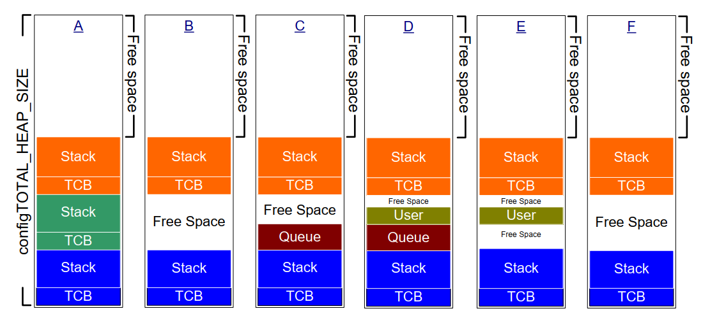

# 3 堆内存管理

## 3.1 简介

### 3.1.1 前置条件

成为一名熟练的C语言程序员是使用FreeRTOS的前提，因此本章假定读者熟悉以下概念：

- 构建C项目时的不同编译和链接阶段。
- 栈和堆的概念。
- 标准C库中的`malloc()`和`free()`函数。

### 3.1.2 范围

本章涵盖以下内容：

- FreeRTOS何时分配RAM。
- FreeRTOS提供的五种示例内存分配方案。
- 应选择哪种内存分配方案。

### 3.1.3 静态与动态内存分配之间的切换

接下来的章节将介绍诸如任务、队列、信号量和事件组等内核对象。存储这些对象所需的RAM可以在编译时静态分配，也可以在运行时动态分配。动态分配减少了设计和规划的工作量，简化了API，并最小化了RAM占用。静态分配更具确定性，消除了处理内存分配失败的需求，并避免了堆碎片化（即堆有足够的空闲内存但不是一块可用的连续块）的风险。

只有当`configSUPPORT_STATIC_ALLOCATION`在FreeRTOSConfig.h中设置为1时，创建使用静态分配内存的内核对象的FreeRTOS API函数才可用。只有当`configSUPPORT_DYNAMIC_ALLOCATION`在FreeRTOSConfig.h中设置为1或未定义时，创建使用动态分配内存的内核对象的FreeRTOS API函数才可用。可以同时将这两个常量设置为1。

有关`configSUPPORT_STATIC_ALLOCATION`的更多信息，请参阅第3.4节“使用静态内存分配”。

### 3.1.4 使用动态内存分配

动态内存分配是一个C编程概念，而不是特定于FreeRTOS或多任务处理的概念。它与FreeRTOS相关，因为可以选择使用动态分配的内存来创建内核对象，而通用C库中的`malloc()`和`free()`函数可能由于以下一个或多个原因而不适合使用：

- 在小型嵌入式系统中它们并不总是可用。
- 它们的实现可能相对较大，占用宝贵的代码空间。
- 它们很少是线程安全的。
- 它们不是确定性的；执行这些函数所需的时间会因调用而异。
- 它们可能会遭受碎片化问题（即堆有足够的空闲内存但不是一块可用的连续块）。
- 它们可能会使链接器配置复杂化。
- 如果允许堆空间扩展到其他变量使用的内存中，它们可能会成为难以调试错误的根源。

### 3.1.5 动态内存分配的选项

早期版本的FreeRTOS使用了一种内存池分配方案，其中不同大小的内存块池在编译时预先分配，然后由内存分配函数返回。尽管块分配在实时系统中很常见，但由于其在非常小的嵌入式系统中对RAM的低效使用导致了许多支持请求，因此从FreeRTOS中移除了该功能。

FreeRTOS现在将内存分配视为可移植层的一部分（而不是核心代码库的一部分）。这是因为不同的嵌入式系统有不同的动态内存分配和时间要求，因此单一的动态内存分配算法只能适用于一部分应用。此外，从核心代码库中移除动态内存分配使得应用程序开发人员可以在适当的情况下提供自己的特定实现。

当FreeRTOS需要RAM时，它调用`pvPortMalloc()`而不是`malloc()`。同样，当FreeRTOS释放先前分配的RAM时，它调用`vPortFree()`而不是`free()`。`pvPortMalloc()`具有与标准C库`malloc()`函数相同的原型，而`vPortFree()`具有与标准C库`free()`函数相同的原型。

`pvPortMalloc()`和`vPortFree()`是公共函数，因此也可以从应用程序代码中调用它们。

FreeRTOS提供了五个`pvPortMalloc()`和`vPortFree()`的示例实现，所有这些实现在本章中都有文档说明。FreeRTOS应用程序可以使用其中一个示例实现，也可以提供自己的实现。

这五个示例分别定义在heap\_1.c、heap\_2.c、heap\_3.c、heap\_4.c和heap\_5.c源文件中，所有这些文件都位于FreeRTOS/Source/portable/MemMang目录中。


## 3.2 示例内存分配方案

### 3.2.1 Heap\_1

小型专用嵌入式系统通常只会在启动FreeRTOS调度器之前创建任务和其他内核对象。在这种情况下，内核仅在应用程序开始执行任何实时功能之前（动态）分配内存，并且该内存在应用程序的整个生命周期中保持分配状态。这意味着所选择的分配方案无需考虑更复杂的内存分配问题，例如确定性和碎片化，而是可以优先考虑代码大小和简单性等属性。

Heap\_1.c 实现了一个非常基础版本的 `pvPortMalloc()`，并且未实现 `vPortFree()`。从不删除任务或其他内核对象的应用程序有可能使用 heap\_1。一些商业关键型和安全关键型系统，原本会禁止使用动态内存分配，也有可能使用 heap\_1。关键系统通常禁止动态内存分配，因为与非确定性、内存碎片化和分配失败相关的不确定性。Heap\_1 始终是确定性的，并且不会导致内存碎片化。

Heap\_1 的 `pvPortMalloc()` 实现每次调用时都会将一个简单的 `uint8_t` 数组（称为 FreeRTOS 堆）细分为更小的块。FreeRTOSConfig.h 中的常量 `configTOTAL_HEAP_SIZE` 设置了数组的大小（以字节为单位）。将堆实现为静态分配的数组会使 FreeRTOS 看起来消耗了大量的 RAM，因为堆成为了 FreeRTOS 数据的一部分。

每个动态分配的任务会导致两次调用 `pvPortMalloc()`。第一次分配任务控制块（TCB），第二次分配任务的栈。图 3.1 演示了随着任务的创建，heap\_1 如何将简单数组细分。

参考图 3.1：

- **A** 显示了在创建任何任务之前的数组——整个数组都是空闲的。
- **B** 显示了在创建一个任务之后的数组。
- **C** 显示了在创建三个任务之后的数组。


<a name="fig3.1" title="图 3.1 每次创建任务时从 heap\_1 数组分配的 RAM"></a>

* * *

***图 3.1*** *每次创建任务时从 heap\_1 数组分配的 RAM*
* * *


### 3.2.2 Heap\_2

Heap\_2 已被 heap\_4 取代，后者包含了增强功能。Heap\_2 保留在 FreeRTOS 发行版中是为了向后兼容，但不推荐用于新设计。

Heap\_2.c 也通过细分由 `configTOTAL_HEAP_SIZE` 常量定义大小的数组来工作。它使用最佳适配算法来分配内存，并且与 heap\_1 不同的是，它确实实现了 `vPortFree()`。同样，将堆实现为静态分配的数组会使 FreeRTOS 看起来消耗了大量的 RAM，因为堆成为了 FreeRTOS 数据的一部分。

最佳适配算法确保 `pvPortMalloc()` 使用最接近请求字节数的空闲内存块。例如，考虑以下场景：

- 堆包含三个分别为 5 字节、25 字节和 100 字节的空闲内存块。
- `pvPortMalloc()` 请求 20 字节的 RAM。

最适合请求字节数的最小空闲内存块是 25 字节的块，因此 `pvPortMalloc()` 将 25 字节的块拆分为一个 20 字节的块和一个 5 字节的块，然后返回指向 20 字节块的指针[^2]。新的 5 字节块仍然可供未来的 `pvPortMalloc()` 调用使用。

[^2]: 这是一个简化说明，因为 heap\_2 在堆区域内存储有关块大小的信息，所以两个拆分块的总和实际上小于 25。

与 heap\_4 不同，heap\_2 不会将相邻的空闲块合并成一个更大的块，因此它比 heap\_4 更容易受到碎片化的影响。然而，如果分配和随后释放的块始终是相同大小，则碎片化不是问题。

<a name="fig3.2" title="图 3.2 随着任务的创建和删除，从 heap\_2 数组分配和释放 RAM"></a>

* * *

***图 3.2*** *随着任务的创建和删除，从 heap\_2 数组分配和释放 RAM*
* * *

图 3.2 演示了当任务创建、删除并再次创建时，最佳适配算法的工作方式。参考图 3.2：

- **A** 显示了分配三个任务后的数组。数组顶部仍有一个较大的空闲块。
- **B** 显示了删除其中一个任务后的数组。数组顶部的较大空闲块仍然存在。现在还有两个较小的空闲块，它们之前保存了已删除任务的 TCB 和栈。
- **C** 显示了创建另一个任务后的情况。创建任务导致 `xTaskCreate()` API 函数内部两次调用 `pvPortMalloc()`，一次用于分配新的 TCB，另一次用于分配任务栈。本书第 3.4 节描述了 `xTaskCreate()`。

  每个 TCB 大小相同，因此最佳适配算法重用了保存已删除任务 TCB 的内存块来保存新创建任务的 TCB。

  如果分配给新创建任务的栈大小与分配给先前删除任务的栈大小相同，则最佳适配算法会重用保存已删除任务栈的内存块来保存新创建任务的栈。

  数组顶部的较大未分配块保持不变。

Heap\_2 不是确定性的，但比大多数标准库实现的 `malloc()` 和 `free()` 更快。


### 3.2.3 Heap\_3

Heap\_3.c 使用标准库的 `malloc()` 和 `free()` 函数，因此链接器配置定义了堆的大小，并且不使用 `configTOTAL_HEAP_SIZE` 常量。

Heap\_3 通过在执行期间临时挂起 FreeRTOS 调度器，使 `malloc()` 和 `free()` 线程安全。第 8 章《资源管理》涵盖了线程安全和调度器挂起的内容。


### 3.2.4 Heap\_4

与 heap\_1 和 heap\_2 类似，heap\_4 通过将数组细分为更小的块来工作。如前所述，该数组是静态分配的，并由 `configTOTAL_HEAP_SIZE` 定义大小，这使得 FreeRTOS 看起来消耗了大量的 RAM，因为堆成为了 FreeRTOS 数据的一部分。

Heap\_4 使用首次适配算法来分配内存。与 heap\_2 不同的是，heap\_4 将相邻的空闲内存块合并（合并）成一个更大的块，从而最小化内存碎片化的风险。

首次适配算法确保 `pvPortMalloc()` 使用第一个足够大的空闲内存块来容纳请求的字节数。例如，考虑以下场景：

- 堆包含三个空闲内存块，它们在数组中出现的顺序分别为 5 字节、200 字节和 100 字节。
- `pvPortMalloc()` 请求 20 字节的 RAM。

第一个适合请求字节数的空闲内存块是 200 字节的块，因此 `pvPortMalloc()` 将 200 字节的块拆分为一个 20 字节的块和一个 180 字节的块[^3]，然后返回指向 20 字节块的指针。新的 180 字节块仍然可供未来的 `pvPortMalloc()` 调用使用。

[^3]: 这是一个简化说明，因为 heap\_4 在堆区域内存储有关块大小的信息，所以两个拆分块的总和实际上小于 200 字节。

Heap\_4 将相邻的空闲块合并（合并）成一个更大的块，从而最小化碎片化的风险，使其适用于反复分配和释放不同大小 RAM 块的应用程序。


<a name="fig3.3" title="图 3.3 从 heap\_4 数组分配和释放 RAM"></a>

* * *

***图 3.3*** *从 heap\_4 数组分配和释放 RAM*
* * *

图 3.3 演示了带有内存合并功能的 heap\_4 首次适配算法的工作方式。参考图 3.3：

- **A** 显示了创建三个任务后的数组。数组顶部仍有一个较大的空闲块。
- **B** 显示了删除其中一个任务后的数组。数组顶部的较大空闲块仍然存在。现在还有另一个空闲块，它之前保存了已删除任务的 TCB 和栈的位置。与 heap\_2 示例不同，heap\_4 将先前分别保存已删除任务 TCB 和栈的两个内存块合并为一个更大的单一空闲块。
- **C** 显示了创建 FreeRTOS 队列后的情况。本书第 5.3 节描述了用于动态分配队列的 `xQueueCreate()` API 函数。`xQueueCreate()` 调用 `pvPortMalloc()` 来分配队列使用的 RAM。由于 heap\_4 使用首次适配算法，`pvPortMalloc()` 从第一个足够大的空闲 RAM 块中分配 RAM，在图 3.3 中，这是通过删除任务释放的 RAM。队列并未消耗空闲块中的所有 RAM，因此该块被拆分为两部分，未使用的部分仍然可供未来的 `pvPortMalloc()` 调用使用。
- **D** 显示了直接从应用程序代码调用 `pvPortMalloc()` 的情况，而不是通过调用 FreeRTOS API 函数间接调用。用户分配的块足够小，可以放入第一个空闲块，即分配给队列的内存和其后分配给 TCB 的内存之间的块。

  删除任务释放的内存现在已经分裂为三个独立的块；第一个块保存队列，第二个块保存用户分配的内存，第三个块保持空闲状态。

- **E** 显示了删除队列后的情况，这会自动释放分配给已删除队列的内存。现在用户分配块的两侧都有空闲内存。

- **F** 显示了释放用户分配的内存后的情况。之前由用户分配块使用的内存已与其两侧的空闲内存合并，形成了一个更大的单一空闲块。

Heap\_4 不是确定性的，但比大多数标准库实现的 `malloc()` 和 `free()` 更快。


### 3.2.5 Heap\_5

Heap\_5 使用与 heap\_4 相同的分配算法。与 heap\_4 不同的是，heap\_4 只能从单一数组中分配内存，而 Heap\_5 可以将多个分离的内存空间组合成一个堆。当 FreeRTOS 运行所在的系统提供的 RAM 在系统的内存映射中未显示为单一连续块时，Heap\_5 非常有用。


### 3.2.6 初始化 Heap\_5：vPortDefineHeapRegions() API 函数

`vPortDefineHeapRegions()` 通过指定组成由 Heap\_5 管理的堆的每个单独内存区域的起始地址和大小来初始化 Heap\_5。Heap\_5 是唯一需要显式初始化的堆分配方案，在调用 `vPortDefineHeapRegions()` 之前无法使用。这意味着内核对象（如任务、队列和信号量）在调用 `vPortDefineHeapRegions()` 之后才能动态创建。


<a name="list3.1" title="代码清单 3.1 vPortDefineHeapRegions() API 函数原型"></a>


```c
void vPortDefineHeapRegions( const HeapRegion_t * const pxHeapRegions );
```
***代码清单 3.1*** *vPortDefineHeapRegions() API 函数原型*


`vPortDefineHeapRegions()` 接收一个 `HeapRegion_t` 结构数组作为其唯一参数。每个结构定义了将成为堆的一部分的内存块的起始地址和大小——整个结构数组定义了整个堆空间。


<a name="list3.2" title="代码清单 3.2 HeapRegion\_t 结构"></a>


```c
typedef struct HeapRegion
{
    /* 将成为堆的一部分的内存块的起始地址 */
    uint8_t *pucStartAddress;

    /* 内存块的大小（以字节为单位） */
    size_t xSizeInBytes;

} HeapRegion_t;
```
***代码清单 3.2*** *HeapRegion\_t 结构*


**参数：**

- `pxHeapRegions`

  指向 `HeapRegion_t` 结构数组的指针。
  每个结构定义了将成为堆的一部分的内存块的起始地址和大小。

  数组中的 `HeapRegion_t` 结构必须按起始地址排序；描述最低起始地址内存区域的 `HeapRegion_t` 结构必须是数组中的第一个结构，描述最高起始地址内存区域的 `HeapRegion_t` 结构必须是数组中的最后一个结构。

  使用 `pucStartAddress` 成员设置为 `NULL` 的 `HeapRegion_t` 结构标记数组的结束。

例如，考虑图 3.4 **A** 中所示的假设内存映射，其中包含三个独立的 RAM 块：RAM1、RAM2 和 RAM3。假定可执行代码被放置在只读存储器中，此处未显示。


<a name="fig3.4" title="图 3.4 内存映射"></a>

* * *

***图 3.4*** *内存映射*
* * *

代码清单 3.3 显示了一个 `HeapRegion_t` 结构数组，它们共同完整描述了三个 RAM 块。


<a name="list3.3" title="代码清单 3.3 一个完整描述三个 RAM 区域的 HeapRegion\_t 结构数组"></a>


```c
/* 定义三个 RAM 区域的起始地址和大小 */
#define RAM1_START_ADDRESS ( ( uint8_t * ) 0x00010000 )
#define RAM1_SIZE ( 64 * 1024 )

#define RAM2_START_ADDRESS ( ( uint8_t * ) 0x00020000 )
#define RAM2_SIZE ( 32 * 1024 )

#define RAM3_START_ADDRESS ( ( uint8_t * ) 0x00030000 )
#define RAM3_SIZE ( 32 * 1024 )

/* 创建一个 HeapRegion_t 定义的数组，为三个 RAM 区域分别提供索引，并使用包含 NULL 地址的 HeapRegion_t 结构终止数组。HeapRegion_t 结构必须按起始地址顺序排列，起始地址最低的结构必须排在第一位。 */
const HeapRegion_t xHeapRegions[] =
{
    { RAM1_START_ADDRESS, RAM1_SIZE },
    { RAM2_START_ADDRESS, RAM2_SIZE },
    { RAM3_START_ADDRESS, RAM3_SIZE },
    { NULL,               0         } /* 标记数组的结束 */
};

int main( void )
{
    /* 初始化 Heap_5 */
    vPortDefineHeapRegions( xHeapRegions );

    /* 在此处添加应用程序代码 */
}
```
***代码清单 3.3*** *一个完整描述三个 RAM 区域的 HeapRegion\_t 结构数组*


尽管代码清单 3.3 正确描述了 RAM，但它并未展示一个可用的示例，因为它将所有 RAM 分配给了堆，没有留下其他变量可用的 RAM。

构建过程的链接阶段为每个变量分配一个 RAM 地址。链接器可用的 RAM 通常由链接器配置文件（如链接脚本）描述。在图 3.4 **B** 中，假定链接脚本包含了关于 RAM1 的信息，但未包含关于 RAM2 或 RAM3 的信息。因此，链接器将变量放置在 RAM1 中，仅留下地址 0x0001nnnn 以上的 RAM1 部分供 heap\_5 使用。0x0001nnnn 的实际值取决于应用程序中所有变量的总大小。链接器未使用 RAM2 和 RAM3 的全部空间，因此整个 RAM2 和整个 RAM3 可供 heap\_5 使用。

代码清单 3.3 所示的代码会导致分配给 heap\_5 的 RAM 在地址 0x0001nnnn 以下与用于存储变量的 RAM 重叠。
如果将 `xHeapRegions[]` 数组中第一个 `HeapRegion_t` 结构的起始地址设置为 0x0001nnnn，而不是 0x00010000，则堆不会与链接器使用的 RAM 重叠。然而，这不是推荐的解决方案，原因如下：

- 起始地址可能不易确定。
- 链接器在未来的构建中使用的 RAM 量可能会发生变化，这将使 `HeapRegion_t` 结构中使用的起始地址需要更新。
- 如果链接器使用的 RAM 和 heap\_5 使用的 RAM 重叠，构建工具无法知道，也无法警告应用程序开发者。

代码清单 3.4 展示了一个更方便且更易于维护的示例。它声明了一个名为 `ucHeap` 的数组。`ucHeap` 是一个普通变量，因此它成为链接器分配给 RAM1 的数据的一部分。`xHeapRegions` 数组中的第一个 `HeapRegion_t` 结构描述了 `ucHeap` 的起始地址和大小，因此 `ucHeap` 成为由 heap\_5 管理的内存的一部分。可以增加 `ucHeap` 的大小，直到链接器使用的 RAM 占用整个 RAM1，如图 3.4 **C** 所示。


<a name="list3.4" title="代码清单 3.4 描述所有 RAM2、所有 RAM3，但仅部分 RAM1 的 HeapRegion\_t 结构数组"></a>

```c
/* 定义未被链接器使用的两个 RAM 区域的起始地址和大小 */
#define RAM2_START_ADDRESS ( ( uint8_t * ) 0x00020000 )
#define RAM2_SIZE ( 32 * 1024 )

#define RAM3_START_ADDRESS ( ( uint8_t * ) 0x00030000 )
#define RAM3_SIZE ( 32 * 1024 )

/* 声明一个数组，该数组将成为 heap_5 使用的堆的一部分。该数组将由链接器放置在 RAM1 中 */
#define RAM1_HEAP_SIZE ( 30 * 1024 )
static uint8_t ucHeap[ RAM1_HEAP_SIZE ];

/* 创建一个 HeapRegion_t 定义的数组。在代码清单 3.3 中，第一个条目描述了整个 RAM1，因此 heap_5 将使用整个 RAM1；这次，第一个条目仅描述了 ucHeap 数组，因此 heap_5 将仅使用包含 ucHeap 数组的 RAM1 部分。HeapRegion_t 结构仍必须按起始地址顺序排列，起始地址最低的结构必须排在第一位 */

const HeapRegion_t xHeapRegions[] =
{
    { ucHeap,             RAM1_HEAP_SIZE },
    { RAM2_START_ADDRESS, RAM2_SIZE },
    { RAM3_START_ADDRESS, RAM3_SIZE },
    { NULL,               0 }           /* 标记数组的结束 */
};
```
***代码清单 3.4*** *描述所有 RAM2、所有 RAM3，但仅部分 RAM1 的 HeapRegion\_t 结构数组*


代码清单 3.4 所展示的技术的优点包括：

- 不需要使用硬编码的起始地址。
- `HeapRegion_t` 结构中使用的地址将由链接器自动设置，因此即使链接器在未来的构建中使用的 RAM 量发生变化，地址也始终是正确的。
- 分配给 heap\_5 的 RAM 不可能与链接器放置到 RAM1 中的数据重叠。
- 如果 `ucHeap` 过大，应用程序将无法链接。

## 3.3 堆相关的实用函数和宏

### 3.3.1 定义堆的起始地址

Heap\_1、heap\_2 和 heap\_4 从由 `configTOTAL_HEAP_SIZE` 定义的静态分配数组中分配内存。本节将这些分配方案统称为 heap\_n。

有时需要将堆放置在特定的内存地址。例如，动态创建任务所分配的栈来自堆，因此可能需要将堆放置在快速内部存储器中，而不是慢速外部存储器。（有关在快速存储器中分配任务栈的另一种方法，请参见下面的子节“将任务栈放置在快速存储器中”）。`configAPPLICATION_ALLOCATED_HEAP` 编译时配置常量允许应用程序声明该数组，以替代原本在 heap\_n.c 源文件中的声明。在应用程序代码中声明该数组使应用程序开发者能够指定其起始地址。

如果在 FreeRTOSConfig.h 中将 `configAPPLICATION_ALLOCATED_HEAP` 设置为 1，则使用 FreeRTOS 的应用程序必须分配一个名为 `ucHeap` 的 `uint8_t` 数组，并由 `configTOTAL_HEAP_SIZE` 常量定义其大小。

将变量放置在特定内存地址所需的语法取决于所使用的编译器，因此请参阅编译器的文档。以下是两个编译器的示例：

- 代码清单 3.5 显示了 GCC 编译器所需的语法，用于声明该数组并将其放置在名为 `.my_heap` 的内存段中。
- 代码清单 3.6 显示了 IAR 编译器所需的语法，用于声明该数组并将其放置在绝对内存地址 0x20000000。


<a name="list3.5" title="代码清单 3.5 使用 GCC 语法声明 heap\_4 将使用的数组，并将该数组放置在名为 .my\_heap 的内存段中"></a>


```c
uint8_t ucHeap[ configTOTAL_HEAP_SIZE ] __attribute__ ( ( section( ".my_heap" ) ) );
```
***代码清单 3.5*** *使用 GCC 语法声明 heap\_4 将使用的数组，并将该数组放置在名为 .my\_heap 的内存段中*


<a name="list3.6" title="代码清单 3.6 使用 IAR 语法声明 heap\_4 将使用的数组，并将该数组放置在绝对地址 0x20000000"></a>


```c
uint8_t ucHeap[ configTOTAL_HEAP_SIZE ] @ 0x20000000;
```
***代码清单 3.6*** *使用 IAR 语法声明 heap\_4 将使用的数组，并将该数组放置在绝对地址 0x20000000*


### 3.3.2 xPortGetFreeHeapSize() API 函数

`xPortGetFreeHeapSize()` API 函数返回调用该函数时堆中剩余可用字节数。它不提供关于堆碎片的信息。

`xPortGetFreeHeapSize()` 在 heap\_3 中未实现。


<a name="list3.7" title="代码清单 3.7 xPortGetFreeHeapSize() API 函数原型"></a>


```c
size_t xPortGetFreeHeapSize( void );
```
***代码清单 3.7*** *xPortGetFreeHeapSize() API 函数原型*


**返回值：**

- `xPortGetFreeHeapSize()` 返回调用时堆中尚未分配的字节数。


### 3.3.3 xPortGetMinimumEverFreeHeapSize() API 函数

`xPortGetMinimumEverFreeHeapSize()` API 函数返回自 FreeRTOS 应用程序开始执行以来堆中曾经存在的最小未分配字节数。

`xPortGetMinimumEverFreeHeapSize()` 返回的值表示应用程序曾经距离耗尽堆空间有多近。例如，如果 `xPortGetMinimumEverFreeHeapSize()` 返回 200，则在应用程序运行期间某个时间点，它距离耗尽堆空间仅剩 200 字节。

`xPortGetMinimumEverFreeHeapSize()` 还可用于优化堆大小。例如，如果您知道代码在执行过程中具有最高的堆使用率，并且 `xPortGetMinimumEverFreeHeapSize()` 返回了 2000，则可以将 `configTOTAL_HEAP_SIZE` 最多减少 2000 字节。

`xPortGetMinimumEverFreeHeapSize()` 仅在 heap\_4 和 heap\_5 中实现。


<a name="list3.8" title="代码清单 3.8 xPortGetMinimumEverFreeHeapSize() API 函数原型"></a>


```c
size_t xPortGetMinimumEverFreeHeapSize( void );
```
***代码清单 3.8*** *xPortGetMinimumEverFreeHeapSize() API 函数原型*


**返回值：**

- `xPortGetMinimumEverFreeHeapSize()` 返回自 FreeRTOS 应用程序开始执行以来堆中曾经存在的最小未分配字节数。


### 3.3.4 vPortGetHeapStats() API 函数

heap\_4 和 heap\_5 实现了 `vPortGetHeapStats()`，该函数通过引用传递一个 `HeapStats_t` 结构体作为其唯一参数来填充该结构体。

代码清单 3.9 显示了 `vPortGetHeapStats()` 函数原型。代码清单 3.10 显示了 `HeapStats_t` 结构体成员。


<a name="list3.9" title="代码清单 3.9 vPortGetHeapStatus() API 函数原型"></a>


```c
void vPortGetHeapStats( HeapStats_t *xHeapStats );
```
***代码清单 3.9*** *vPortGetHeapStatus() API 函数原型*


<a name="list3.10" title="代码清单 3.10 HeapStatus\_t() 结构体"></a>


```c
/* vPortGetHeapStats() 函数的原型 */
void vPortGetHeapStats( HeapStats_t *xHeapStats );

/* HeapStats_t 结构体的定义。所有大小均以字节为单位 */
typedef struct xHeapStats
{
    /* 当前可用的总堆大小——这是所有空闲块的总和，而不是最大可用块的大小 */
    size_t xAvailableHeapSpaceInBytes;

    /* 调用 vPortGetHeapStats() 时堆中最大的空闲块的大小 */
    size_t xSizeOfLargestFreeBlockInBytes;

    /* 调用 vPortGetHeapStats() 时堆中最小的空闲块的大小 */
    size_t xSizeOfSmallestFreeBlockInBytes;

    /* 调用 vPortGetHeapStats() 时堆中的空闲内存块数量 */
    size_t xNumberOfFreeBlocks;

    /* 自系统启动以来堆中曾有过的最小总空闲内存（所有空闲块的总和） */
    size_t xMinimumEverFreeBytesRemaining;

    /* 返回有效内存块的 pvPortMalloc() 调用次数 */
    size_t xNumberOfSuccessfulAllocations;

    /* 成功释放内存块的 vPortFree() 调用次数 */
    size_t xNumberOfSuccessfulFrees;
} HeapStats_t;
```
***代码清单 3.10*** *HeapStatus\_t() 结构体*


### 3.3.5 收集每个任务的堆使用统计信息

应用程序开发者可以使用以下跟踪宏来收集每个任务的堆使用统计信息：
- `traceMALLOC`
- `traceFREE`

代码清单 3.11 展示了这些跟踪宏的一种示例实现，用于收集每个任务的堆使用统计信息。

<a name="list3.11" title="代码清单 3.11 收集每个任务的堆使用统计信息"></a>


```c
#define mainNUM_ALLOCATION_ENTRIES          512
#define mainNUM_PER_TASK_ALLOCATION_ENTRIES 32

/*-----------------------------------------------------------*/

/*
 * +-----------------+--------------+----------------+-------------------+
 * | 分配任务        | 条目是否在用 | 已分配大小     | 已分配指针        |
 * +-----------------+--------------+----------------+-------------------+
 * |                 |              |                |                   |
 * +-----------------+--------------+----------------+-------------------+
 * |                 |              |                |                   |
 * +-----------------+--------------+----------------+-------------------+
 */
typedef struct AllocationEntry
{
    BaseType_t xInUse;
    TaskHandle_t xAllocatingTaskHandle;
    size_t uxAllocatedSize;
    void * pvAllocatedPointer;
} AllocationEntry_t;

AllocationEntry_t xAllocationEntries[ mainNUM_ALLOCATION_ENTRIES ];

/*
 * +------+-----------------------+----------------------+
 * | 任务 | 当前持有的内存        | 历史最大内存持有量   |
 * +------+-----------------------+----------------------+
 * |      |                       |                      |
 * +------+-----------------------+----------------------+
 * |      |                       |                      |
 * +------+-----------------------+----------------------+
 */
typedef struct PerTaskAllocationEntry
{
    TaskHandle_t xTask;
    size_t uxMemoryCurrentlyHeld;
    size_t uxMaxMemoryEverHeld;
} PerTaskAllocationEntry_t;

PerTaskAllocationEntry_t xPerTaskAllocationEntries[ mainNUM_PER_TASK_ALLOCATION_ENTRIES ];

/*-----------------------------------------------------------*/

void TracepvPortMalloc( size_t uxAllocatedSize, void * pv )
{
    size_t i;
    TaskHandle_t xAllocatingTaskHandle;
    AllocationEntry_t * pxAllocationEntry = NULL;
    PerTaskAllocationEntry_t * pxPerTaskAllocationEntry = NULL;

    if( xTaskGetSchedulerState() != taskSCHEDULER_NOT_STARTED )
    {
        xAllocatingTaskHandle = xTaskGetCurrentTaskHandle();

        for( i = 0; i < mainNUM_ALLOCATION_ENTRIES; i++ )
        {
            if( xAllocationEntries[ i ].xInUse == pdFALSE )
            {
                pxAllocationEntry = &( xAllocationEntries[ i ] );
                break;
            }
        }

        /* 我们是否已经在每任务表中有了条目？ */
        for( i = 0; i < mainNUM_PER_TASK_ALLOCATION_ENTRIES; i++ )
        {
            if( xPerTaskAllocationEntries[ i ].xTask == xAllocatingTaskHandle )
            {
                pxPerTaskAllocationEntry = &( xPerTaskAllocationEntries[ i ] );
                break;
            }
        }

        /* 我们尚未在每任务表中拥有条目。寻找一个空槽位。 */
        if( pxPerTaskAllocationEntry == NULL )
        {
            for( i = 0; i < mainNUM_PER_TASK_ALLOCATION_ENTRIES; i++ )
            {
                if( xPerTaskAllocationEntries[ i ].xTask == NULL )
                {
                    pxPerTaskAllocationEntry = &( xPerTaskAllocationEntries[ i ] );
                    break;
                }
            }
        }

        /* 确保两个表中都有空间可用。 */
        configASSERT( pxAllocationEntry != NULL );
        configASSERT( pxPerTaskAllocationEntry != NULL );

        pxAllocationEntry->xAllocatingTaskHandle = xAllocatingTaskHandle;
        pxAllocationEntry->xInUse = pdTRUE;
        pxAllocationEntry->uxAllocatedSize = uxAllocatedSize;
        pxAllocationEntry->pvAllocatedPointer = pv;

        pxPerTaskAllocationEntry->xTask = xAllocatingTaskHandle;
        pxPerTaskAllocationEntry->uxMemoryCurrentlyHeld += uxAllocatedSize;
        if( pxPerTaskAllocationEntry->uxMaxMemoryEverHeld < pxPerTaskAllocationEntry->uxMemoryCurrentlyHeld )
        {
            pxPerTaskAllocationEntry->uxMaxMemoryEverHeld = pxPerTaskAllocationEntry->uxMemoryCurrentlyHeld;
        }
    }
}
/*-----------------------------------------------------------*/

void TracevPortFree( void * pv )
{
    size_t i;
    AllocationEntry_t * pxAllocationEntry = NULL;
    PerTaskAllocationEntry_t * pxPerTaskAllocationEntry = NULL;

    for( i = 0; i < mainNUM_ALLOCATION_ENTRIES; i++ )
    {
        if( ( xAllocationEntries[ i ].xInUse == pdTRUE ) &&
            ( xAllocationEntries[ i ].pvAllocatedPointer == pv ) )
        {
            pxAllocationEntry = &( xAllocationEntries [ i ] );
            break;
        }
    }

    /* 尝试释放从未分配过的块。 */
    configASSERT( pxAllocationEntry != NULL );

    for( i = 0; i < mainNUM_PER_TASK_ALLOCATION_ENTRIES; i++ )
    {
        if( xPerTaskAllocationEntries[ i ].xTask == pxAllocationEntry->xAllocatingTaskHandle )
        {
            pxPerTaskAllocationEntry = &( xPerTaskAllocationEntries[ i ] );
            break;
        }
    }

    /* 每任务表中必须存在一个条目。 */
    configASSERT( pxPerTaskAllocationEntry != NULL );

    pxPerTaskAllocationEntry->uxMemoryCurrentlyHeld -= pxAllocationEntry->uxAllocatedSize;

    pxAllocationEntry->xInUse = pdFALSE;
    pxAllocationEntry->xAllocatingTaskHandle = NULL;
    pxAllocationEntry->uxAllocatedSize = 0;
    pxAllocationEntry->pvAllocatedPointer = NULL;
}
/*-----------------------------------------------------------*/

/* 以下内容放在 FreeRTOSConfig.h 中： */
extern void TracepvPortMalloc( size_t uxAllocatedSize, void * pv );
extern void TracevPortFree( void * pv );

#define traceMALLOC( pvReturn, xAllocatedBlockSize ) \
TracepvPortMalloc( xAllocatedBlockSize, pvReturn )

#define traceFREE( pv, xAllocatedBlockSize ) \
TracevPortFree( pv )
```
***代码清单 3.11*** *收集每个任务的堆使用统计信息*


### 3.3.6 Malloc失败钩子函数

与标准库的`malloc()`函数类似，如果`pvPortMalloc()`无法分配请求的RAM数量，则会返回NULL。Malloc失败钩子（或回调）是由应用程序提供的函数，在`pvPortMalloc()`返回NULL时会被调用。为了使回调生效，必须在FreeRTOSConfig.h中将`configUSE_MALLOC_FAILED_HOOK`设置为1。如果Malloc失败钩子在一个使用动态内存分配创建内核对象的FreeRTOS API函数内部被调用，则该对象不会被创建。

如果在FreeRTOSConfig.h中将`configUSE_MALLOC_FAILED_HOOK`设置为1，则应用程序必须提供一个名称和原型如代码清单3.12所示的Malloc失败钩子函数。应用程序可以以适合其需求的方式实现该函数。许多提供的FreeRTOS演示应用程序将分配失败视为致命错误，但这并不是生产系统的最佳实践，生产系统应能够从分配失败中优雅恢复。


<a name="list3.12" title="代码清单 3.12 Malloc失败钩子函数的名称和原型"></a>


```c
void vApplicationMallocFailedHook( void );
```
***代码清单 3.12*** *Malloc失败钩子函数的名称和原型*


### 3.3.7 将任务堆栈放置在快速内存中

由于堆栈的读写频率很高，它们应放置在快速内存中，但这可能不是你希望堆所在的区域。FreeRTOS使用`pvPortMallocStack()`和`vPortFreeStack()`宏来选择性地启用在FreeRTOS API代码中分配的堆栈拥有自己的内存分配器。如果你希望堆栈来自由`pvPortMalloc()`管理的堆，则保持`pvPortMallocStack()`和`vPortFreeStack()`未定义，因为它们默认分别调用`pvPortMalloc()`和`vPortFree()`。否则，按照代码清单3.13所示定义这些宏以调用应用程序提供的函数。


<a name="list3.13" title="代码清单 3.13 将pvPortMallocStack()和vPortFreeStack()宏映射到应用程序定义的内存分配器"></a>


```c
/* 应用程序开发者提供的从快速RAM区域分配和释放内存的函数。 */

void *pvMallocFastMemory( size_t xWantedSize );

void vPortFreeFastMemory( void *pvBlockToFree );

/* 在FreeRTOSConfig.h中添加以下内容，将pvPortMallocStack()
   和vPortFreeStack()宏映射到使用快速内存的函数。 */

#define pvPortMallocStack( x ) pvMallocFastMemory( x )

#define vPortFreeStack( x ) vPortFreeFastMemory( x )
```
***代码清单 3.13*** *将pvPortMallocStack()和vPortFreeStack()宏映射到应用程序定义的内存分配器*


## 3.4 使用静态内存分配

第3.1.4节列出了一些与动态内存分配相关的缺点。为了避免这些问题，静态内存分配允许开发人员显式创建应用程序所需的所有内存块。这具有以下优点：

- 所有需要的内存都在编译时已知。
- 所有内存操作都是确定性的。

尽管还有其他优点，但随之而来的也有一些复杂性。主要复杂性在于增加了一些额外的用户函数来管理某些内核内存，第二个复杂性在于需要确保所有静态内存都在适当的范围内声明。


### 3.4.1 启用静态内存分配

通过在FreeRTOSConfig.h中将`configSUPPORT_STATIC_ALLOCATION`设置为1来启用静态内存分配。启用此配置后，内核将启用所有内核函数的`static`版本。这些函数包括：

- `xTaskCreateStatic`
- `xEventGroupCreateStatic`
- `xEventGroupGetStaticBuffer`
- `xQueueGenericCreateStatic`
- `xQueueGenericGetStaticBuffers`
- `xQueueCreateMutexStatic`
  - *如果`configUSE_MUTEXES`为1*
- `xQueueCreateCountingSemaphoreStatic`
  - *如果`configUSE_COUNTING_SEMAPHORES`为1*
- `xStreamBufferGenericCreateStatic`
- `xStreamBufferGetStaticBuffers`
- `xTimerCreateStatic`
  - *如果`configUSE_TIMERS`为1*
- `xTimerGetStaticBuffer`
  - *如果`configUSE_TIMERS`为1*

这些函数将在本书的相关章节中进行详细说明。

### 3.4.2 静态内部内核内存

当启用静态内存分配器时，空闲任务和定时器任务（如果已启用）将使用用户函数提供的静态内存。这些用户函数包括：

- `vApplicationGetTimerTaskMemory`
  - *如果`configUSE_TIMERS`为1*
- `vApplicationGetIdleTaskMemory`


#### 3.4.2.1 vApplicationGetTimerTaskMemory

如果同时启用了`configSUPPORT_STATIC_ALLOCATION`和`configUSE_TIMERS`，内核将调用`vApplicationGetTimerTaskMemory()`，以便应用程序创建并返回一个用于定时器任务TCB（任务控制块）和定时器任务堆栈的内存缓冲区。该函数还将返回定时器任务堆栈的大小。代码清单3.14展示了一个典型的定时器任务内存函数实现。


<a name="list3.14" title="代码清单 3.14 vApplicationGetTimerTaskMemory 的典型实现"></a>


```c
void vApplicationGetTimerTaskMemory( StaticTask_t **ppxTimerTaskTCBBuffer,
                                     StackType_t **ppxTimerTaskStackBuffer,
                                     uint32_t *pulTimerTaskStackSize )
{
  /* 如果提供给定时器任务的缓冲区在此函数内部声明，则它们必须声明为 static，
     否则它们将被分配在栈上，因此在函数退出后将不再存在。 */
  static StaticTask_t xTimerTaskTCB;
  static StackType_t uxTimerTaskStack[ configMINIMAL_STACK_SIZE ];

  /* 返回一个指向 StaticTask_t 结构的指针，该结构将存储定时器任务的状态。 */
  *ppxTimerTaskTCBBuffer = &xTimerTaskTCB;

  /* 返回将用作定时器任务堆栈的数组。 */
  *ppxTimerTaskStackBuffer = uxTimerTaskStack;

  /* 返回 *ppxTimerTaskStackBuffer 指向的数组的堆栈大小。
     注意堆栈大小是 StackType_t 的计数单位。 */
  *pulTimerTaskStackSize = sizeof(uxTimerTaskStack) / sizeof(*uxTimerTaskStack);
}
```
***代码清单 3.14*** *vApplicationGetTimerTaskMemory 的典型实现*


由于任何系统（包括SMP）中都只有一个定时器任务，因此解决定时器任务内存问题的一个有效方法是在`vApplicationGetTimerTaskMemory()`函数中分配静态缓冲区，并将缓冲区指针返回给内核。


#### 3.4.2.2 vApplicationGetIdleTaskMemory

当某个核心没有可调度的工作时，将运行空闲任务。空闲任务会执行一些清理工作，并且如果启用了用户定义的`vTaskIdleHook()`，还可以触发该钩子函数。在对称多处理系统（SMP）中，其他核心也有非清理性质的空闲任务，但这些任务内部会静态分配`configMINIMAL_STACK_SIZE`字节的内存。

`vApplicationGetIdleTaskMemory`函数被调用时，允许应用程序为“主”空闲任务创建所需的缓冲区。代码清单3.15展示了一个典型的`vApplicationGetIdleTaskMemory()`函数实现，使用静态局部变量来创建所需的缓冲区。


<a name="list3.15" title="代码清单 3.15 vApplicationGetIdleTaskMemory 的典型实现"></a>

```c
void vApplicationGetIdleTaskMemory( StaticTask_t **ppxIdleTaskTCBBuffer,
                                    StackType_t **ppxIdleTaskStackBuffer,
                                    uint32_t *pulIdleTaskStackSize )
{
  static StaticTask_t xIdleTaskTCB;
  static StackType_t uxIdleTaskStack[ configMINIMAL_STACK_SIZE ];

  *ppxIdleTaskTCBBuffer = &xIdleTaskTCB;
  *ppxIdleTaskStackBuffer = uxIdleTaskStack;
  *pulIdleTaskStackSize = configMINIMAL_STACK_SIZE;
}
```
***代码清单 3.15*** *vApplicationGetIdleTaskMemory 的典型实现*


