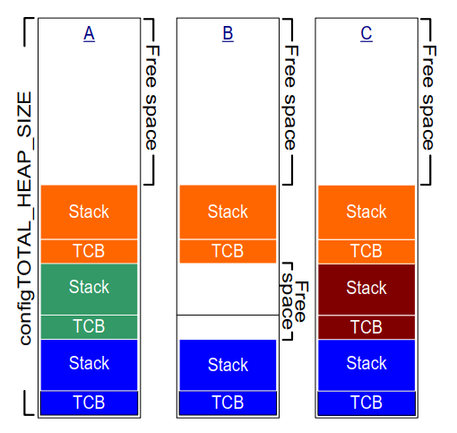

# 3 堆内存管理

## 3.1 简介

### 3.1.1 前置条件

使用 FreeRTOS 需要具备熟练的 C 语言编程能力，因此本章假设读者熟悉以下概念：

- 构建 C 项目的不同编译和链接阶段。
- 堆栈和堆是什么。
- 标准 C 库的 `malloc()` 和 `free()` 函数。

### 3.1.2 范围

本章涵盖：

- FreeRTOS 何时分配 RAM。
- FreeRTOS 提供的五个示例内存分配方案。
- 如何选择内存分配方案。

### 3.1.3 静态和动态内存分配之间的切换

后续章节将介绍内核对象，例如任务、队列、信号量和事件组。 这些对象所需的 RAM 可以静态地在编译时分配，也可以动态地在运行时分配。 动态分配减少了设计和规划工作量，简化了 API，并最大限度地减少了 RAM 占用空间。 静态分配更具确定性，消除了处理内存分配失败的需求，并消除了堆碎片化（堆具有足够的可用内存，但不是一个可用的连续块）的风险。

使用静态分配内存创建内核对象的 FreeRTOS API 函数仅在 `configSUPPORT_STATIC_ALLOCATION` 在 FreeRTOSConfig.h 中设置为 1 时可用。 使用动态分配内存创建内核对象的 FreeRTOS API 函数仅在 `configSUPPORT_DYNAMIC_ALLOCATION` 在 FreeRTOSConfig.h 中设置为 1 或未定义时可用。 同时将这两个常量设置为 1 是有效的。

有关 `configSUPPORT_STATIC_ALLOCATION` 的更多信息请参见第 3.4 节 使用静态内存分配。

### 3.1.4 使用动态内存分配

动态内存分配是 C 语言编程的概念，而不是 FreeRTOS 或多任务处理特有的概念。 它与 FreeRTOS 相关，因为内核对象可以选择使用动态分配的内存创建，并且通用的 C 库 `malloc()` 和 `free()` 函数可能由于以下一个或多个原因而不适用：

- 它们在小型嵌入式系统中并不总是可用。
- 它们的实现可能相对较大，占用宝贵的代码空间。
- 它们很少是线程安全的。
- 它们不确定；执行这些函数所需的时间将因调用而异。
- 它们可能会出现碎片化（堆具有足够的可用内存，但不是一个可用的连续块）。
- 它们会使链接器配置复杂化。
- 如果允许堆空间扩展到其他变量使用的内存，它们可能会成为难以调试的错误的来源。

### 3.1.5 动态内存分配选项

FreeRTOS 的早期版本使用内存池分配方案，其中预先分配不同大小的内存块，然后由内存分配函数返回。 虽然块分配在实时系统中很常见，但由于在非常小的嵌入式系统中对 RAM 的效率低下导致了许多支持请求，因此已将其从 FreeRTOS 中删除。

现在，FreeRTOS 将内存分配视为可移植层的一部分（而不是核心代码库的一部分）。 这是因为不同的嵌入式系统具有不同的动态内存分配和计时要求，因此单个动态内存分配算法仅适用于一小部分应用程序。 此外，将动态内存分配从核心代码库中删除，使应用程序编写者能够在适当的情况下提供自己的特定实现。

当 FreeRTOS 需要 RAM 时，它会调用 `pvPortMalloc()` 而不是 `malloc()`。 同样，当 FreeRTOS 释放先前分配的 RAM 时，它会调用 `vPortFree()` 而不是 `free()`。 `pvPortMalloc()` 具有与标准 C 库 `malloc()` 函数相同的原型，`vPortFree()` 具有与标准 C 库 `free()` 函数相同的原型。

`pvPortMalloc()` 和 `vPortFree()` 是公共函数，因此也可以从应用程序代码中调用它们。

FreeRTOS 提供了五个示例 `pvPortMalloc()` 和 `vPortFree()` 实现，它们都在本章中进行了记录。 FreeRTOS 应用程序可以使用其中一种示例实现或提供自己的实现。

这五个示例分别定义在 heap_1.c、heap_2.c、heap_3.c、heap_4.c 和 heap_5.c 源文件中，所有这些文件都位于 FreeRTOS/Source/portable/MemMang 目录中。


## 3.2 示例内存分配方案

### 3.2.1 Heap_1

在小型、专用嵌入式系统中，通常只创建任务和其他内核对象，然后才启动 FreeRTOS 调度器。 在这种情况下，内核仅在应用程序开始执行任何实时功能之前动态分配内存，并且内存在应用程序的整个生命周期内保持分配状态。 这意味着所选的分配方案不必考虑更复杂的内存分配问题，例如确定性和碎片化，而是可以优先考虑代码大小和简单性等属性。

Heap_1.c 实现了一个非常基本的 `pvPortMalloc()` 版本，而不实现 `vPortFree()`。 从不删除任务或其他内核对象的应用程序有可能使用 heap_1。 一些原本会禁止使用动态内存分配的商业关键型和安全关键型系统也有可能使用 heap_1。 关键系统通常禁止动态内存分配，因为它们与非确定性、内存碎片化和分配失败相关的风险。 Heap_1 始终是确定的，并且不能导致内存碎片化。

Heap_1 的 `pvPortMalloc()` 实现只是每次调用时将名为 FreeRTOS 堆的简单 `uint8_t` 数组划分为更小的块。 FreeRTOSConfig.h 常量 `configTOTAL_HEAP_SIZE` 设置了数组的大小（以字节为单位）。 将堆实现为静态分配的数组会使 FreeRTOS 看起来消耗了大量的 RAM，因为堆成为 FreeRTOS 数据的一部分。

每个动态分配的任务会导致 `pvPortMalloc()` 被调用两次。 第一个分配任务控制块 (TCB)，第二个分配任务的堆栈。 图 3.1 演示了 heap_1 如何在创建任务时细分该数组。

参考图 3.1：

- **A** 显示了在创建任何任务之前数组的状态——整个数组都是空闲的。

- **B** 显示了创建了一个任务后数组的状态。

- **C** 显示了创建了三个任务后数组的状态。

<a name="fig3.1" title="图 3.1 每次创建任务时，从 heap_1 数组分配的 RAM"></a>

* * *

***图 3.1*** *每次创建任务时，从 heap_1 数组分配的 RAM*
* * *


### 3.2.2 Heap_2

Heap_2 已被 heap_4 所取代，后者包含增强的功能。
Heap_2 保留在 FreeRTOS 分发包中以实现向后兼容，不建议用于新设计。

Heap_2.c 同样通过细分由 `configTOTAL_HEAP_SIZE` 常量定义的数组维度来工作。 它使用最佳匹配算法来分配内存，并且，与 heap_1 不同，它实现了 `vPortFree()`。 同样，将堆实现为静态分配的数组会使 FreeRTOS 看起来消耗了大量的 RAM，因为堆成为 FreeRTOS 数据的一部分。

最佳匹配算法确保 `pvPortMalloc()` 使用与请求的字节数最接近的可用内存块。 例如，考虑以下场景：

- 堆包含三个可用内存块，分别有 5 字节、25 字节和 100 字节。
- `pvPortMalloc()` 请求 20 字节的 RAM。

能够容纳请求的字节数的最小可用内存块是 25 字节的块，因此 `pvPortMalloc()` 在返回指向 20 字节块的指针之前，将 25 字节的块拆分为一个 20 字节的块和一个 5 字节的块[^2]。 新的 5 字节块可用于将来的 `pvPortMalloc()` 调用。

[^2]: 这是一个过度简化，因为 heap_2 存储有关堆区域内块大小的信息，因此两个拆分块的总和实际上会小于 25。

与 heap_4 不同，heap_2 不会将相邻的可用块合并成单个更大的块，因此比 heap_4 更容易出现碎片化。 但是，如果分配和随后释放的块始终是相同的尺寸，则碎片化将不是问题。

<a name="fig3.2" title="图 3.2 任务创建和删除时，从 heap_2 数组分配和释放的 RAM"></a>

* * *

***图 3.2*** *任务创建和删除时，从 heap_2 数组分配和释放的 RAM*
* * *

图 3.2 演示了任务创建、删除和重新创建时，最佳匹配算法的工作方式。 参照图 3.2：

- **A** 显示了分配了三个任务后的数组。 数组顶部仍然有一个大的可用块。

- **B** 显示了删除其中一个任务后的数组。 数组顶部的大可用块仍然存在。 现在，还有两个较小的可用块，它们之前包含已删除任务的 TCB 和堆栈。

- **C** 显示了创建另一个任务后的情况。 创建任务导致 `xTaskCreate()` API 函数内部对 `pvPortMalloc()` 进行了两次调用，一次用于分配新的 TCB，另一次用于分配任务堆栈。 本书第 3.4 节描述了 `xTaskCreate()`。

每个 TCB 具有相同的尺寸，因此最佳匹配算法会重用包含已删除任务 TCB 的 RAM 块来包含新创建任务的 TCB。

如果新创建的任务分配的堆栈大小与先前删除的任务分配的堆栈大小相同，则最佳匹配算法会重用包含已删除任务堆栈的 RAM 块来包含新创建任务的堆栈。

数组顶部的较大未分配块保持不变。

Heap_2 不是确定的，但比大多数标准库 `malloc()` 和 `free()` 实现更快。

### 3.2.3 Heap_3

Heap_3.c 使用标准库 `malloc()` 和 `free()` 函数，因此链接器配置定义了堆的大小，并且不使用 `configTOTAL_HEAP_SIZE` 常量。

Heap_3 通过在 `malloc()` 和 `free()` 执行期间暂时挂起 FreeRTOS 调度器，使 `malloc()` 和 `free()` 线程安全。 第 8 章，资源管理，涵盖了线程安全和调度器挂起。


### 3.2.4 Heap_4

与 heap_1 和 heap_2 一样，heap_4 的工作方式是将数组划分为更小的块。 就像之前一样，该数组是静态分配的，并由 `configTOTAL_HEAP_SIZE` 确定尺寸，这使得 FreeRTOS 看起来会使用大量的 RAM，因为堆成为 FreeRTOS 数据的一部分。

Heap_4 使用最适合算法来分配内存。 与 heap_2 不同，heap_4 将相邻的空闲内存块合并（合并）成一个更大的块，从而最大限度地降低了内存碎片化的风险。

最适合算法确保 `pvPortMalloc()` 使用第一个足够容纳请求的字节数大小的空闲内存块。 例如，考虑以下场景：

- 堆包含三个空闲内存块，按它们在数组中出现的顺序，分别是 5 字节、200 字节和 100 字节。
- `pvPortMalloc()` 请求 20 字节的 RAM。

请求的字节数可以容纳的第一个空闲内存块是 200 字节的块，因此 `pvPortMalloc()` 将 200 字节的块拆分为一个 20 字节的块和一个 180 字节的块[^3]，然后再返回指向 20 字节块的指针。 新的 180 字节块仍然可用于将来的 `pvPortMalloc()` 调用。

[^3]: 这是一个过度简化，因为 heap_4 在堆区域内存储有关块大小的信息，因此两个拆分块的总和实际上会小于 200 字节。

Heap_4 将相邻的空闲内存块合并（合并）成一个更大的块，从而最大限度地降低了碎片化的风险，使其适用于反复分配和释放不同大小的 RAM 块的应用程序。

<a name="fig3.3" title="图 3.3 从 heap_4 数组分配和释放 RAM"></a>

* * *

***图 3.3*** *从 heap_4 数组分配和释放 RAM*
* * *

图 3.3 演示了带有内存合并的 heap_4 最适合算法的工作方式。 参照图 3.3：

- **A** 显示了创建三个任务后的数组。 数组顶部仍然有一个大的空闲块。

- **B** 显示了删除其中一个任务后的数组。 数组顶部的大空闲块仍然存在。 现在，在之前删除的任务的 TCB 和堆栈所在的位置，还有一个空闲块。 与 heap_2 示例不同，heap_4 将之前分别包含删除的任务的 TCB 和堆栈的两个内存块合并为一个更大的单个空闲块。

- **C** 显示了创建 FreeRTOS 队列后的情况。本书第 5.3 节描述了用于动态分配队列的 `xQueueCreate()` API 函数。`xQueueCreate()` 调用 `pvPortMalloc()` 来分配队列使用的 RAM。由于 heap_4 使用最适合算法，`pvPortMalloc()` 从第一个足够大以容纳队列的空闲 RAM 块中分配 RAM，在图 3.3 中，该 RAM 块是由删除任务释放的。队列没有消耗空闲块中的所有 RAM，因此该块被拆分为两个，未使用的部分仍然可用于将来的 `pvPortMalloc()` 调用。

- **D** 显示了直接从应用程序代码调用 `pvPortMalloc()` 而不是通过调用 FreeRTOS API 函数间接调用的情况。用户分配的块足够小，可以放入第一个空闲块中，该块位于分配给队列的内存和其后分配的 TCB 内存之间。

  由删除任务释放的内存现在被拆分为三个单独的块；第一个块包含队列，第二个块包含用户分配的内存，第三个块仍然是空闲的。

- **E** 显示了删除队列后的情况，这会自动释放分配给已删除队列的内存。现在在用户分配的块的两侧都有空闲内存。

- **F** 显示了释放用户分配的内存后的情况。用户分配的块先前使用的内存已与两侧的空闲内存合并，从而创建一个更大的单个空闲块。

Heap\_4 不是确定的，但比大多数标准库的 `malloc()` 和 `free()` 实现更快。

### 3.2.5 Heap\_5

Heap\_5 使用与 heap\_4 相同的分配算法。与受限于从单个数组分配内存的 heap\_4 不同，heap\_5 可以将来自多个分离的内存空间中的内存合并成一个堆。当 FreeRTOS 运行的系统提供的 RAM 不在系统的内存图中显示为单个连续块时，Heap\_5 非常有用。

### 3.2.6 初始化 heap\_5：`vPortDefineHeapRegions()` API 函数

`vPortDefineHeapRegions()` 通过指定构成 heap\_5 管理的堆的每个单独内存区域的起始地址和大小来初始化 heap\_5。Heap\_5 是唯一提供的需要显式初始化的堆分配方案，并且在调用 `vPortDefineHeapRegions()` 之前无法使用。这意味着内核对象，例如任务、队列和信号量，不能在调用 `vPortDefineHeapRegions()` 之后动态创建。

<a name="list3.1" title="列表 3.1 vPortDefineHeapRegions() API 函数原型"></a>


```c
void vPortDefineHeapRegions( const HeapRegion_t * const pxHeapRegions );
```
***列表 3.1*** *vPortDefineHeapRegions() API 函数原型*


`vPortDefineHeapRegions()` 仅接受一个 `HeapRegion_t` 结构体的数组作为参数。每个结构体定义了将成为堆的一部分的内存块的起始地址和大小——整个结构体数组定义了整个堆空间。


<a name="list3.2" title="列表 3.2 HeapRegion_t 结构体"></a>


```c
typedef struct HeapRegion
{
    /* 一个内存块的起始地址，该内存块将成为堆的一部分。*/
    uint8_t *pucStartAddress;

    /* 内存块的大小，以字节为单位。 */
    size_t xSizeInBytes;

} HeapRegion_t;
```
***列表 3.2*** *HeapRegion_t 结构体*


**参数：**

- `pxHeapRegions`

  指向 `HeapRegion_t` 结构体数组的起始位置的指针。每个结构体定义了将成为堆的一部分的内存块的起始地址和大小。

`HeapRegion_t` 结构体在数组中必须按起始地址排序；描述起始地址最低的内存区域的 `HeapRegion_t` 结构体必须是数组中的第一个结构体，描述起始地址最高的内存区域的 `HeapRegion_t` 结构体必须是数组中的最后一个结构体。

通过将 `pucStartAddress` 成员设置为 `NULL` 的 `HeapRegion_t` 结构体来标记数组的结束。

例如，考虑图 3.4 **A** 中所示的假设内存映射，其中包含三个独立的 RAM 块：RAM1、RAM2 和 RAM3。假设可执行代码放置在只读内存中，未显示。

<a name="fig3.4" title="图 3.4 内存映射"></a>

* * *

***图 3.4*** *内存映射*
* * *

列表 3.3 显示了一个 `HeapRegion_t` 结构体数组，这些结构体共同描述了这三个 RAM 块的全部内容。

<a name="list3.3" title="列表 3.3 描述三个 RAM 区域的完整内容的 HeapRegion_t 结构体数组"></a>

```c
/* 定义三个 RAM 区域的起始地址和大小。 */
#define RAM1_START_ADDRESS ( ( uint8_t * ) 0x00010000 )
#define RAM1_SIZE ( 64 * 1024 )

#define RAM2_START_ADDRESS ( ( uint8_t * ) 0x00020000 )
#define RAM2_SIZE ( 32 * 1024 )

#define RAM3_START_ADDRESS ( ( uint8_t * ) 0x00030000 )
#define RAM3_SIZE ( 32 * 1024 )

/* 创建一个 HeapRegion_t 定义数组，为三个 RAM 区域中的每一个定义一个索引，并用包含 NULL 地址的 HeapRegion_t 结构体终止该数组。HeapRegion_t 结构体必须按起始地址顺序出现，起始地址最低的结构体排在最前面。 */
const HeapRegion_t xHeapRegions[] =
{
    { RAM1_START_ADDRESS, RAM1_SIZE },
    { RAM2_START_ADDRESS, RAM2_SIZE },
    { RAM3_START_ADDRESS, RAM3_SIZE },
    { NULL,               0         } /* 标记数组的结束。 */
};

int main( void )
{
    /* 初始化 heap_5。 */
    vPortDefineHeapRegions( xHeapRegions );

    /* 在此处添加应用程序代码。 */
}
```
***列表 3.3*** *描述三个 RAM 区域的完整内容的 HeapRegion_t 结构体数组*

虽然列表 3.3 正确地描述了 RAM，但它没有演示一个可用的示例，因为它将所有 RAM 分配给堆，没有 RAM 可供其他变量使用。

链接阶段的构建过程会为每个变量分配一个RAM地址。链接器可用的RAM通常由链接器配置文件描述，例如链接脚本。在图 3.4 **B** 中，假设链接脚本包含了关于 RAM1 的信息，但没有包含关于 RAM2 或 RAM3 的信息。因此，链接器将变量放置在 RAM1 中，只留下地址 0x0001nnnn 以上的部分供 heap\_5 使用。0x0001nnnn 的实际值取决于应用程序中包含的所有变量的组合大小。链接器已经将 RAM2 和 RAM3 的全部空间都留空，从而使 RAM2 和 RAM3 的全部空间都可供 heap\_5 使用。

列表 3.3 中所示的代码会导致分配给 heap\_5 的 RAM 在地址 0x0001nnnn 以下与链接器用于存储变量的 RAM 发生重叠。如果你将 `xHeapRegions[]` 数组中第一个 `HeapRegion_t` 结构体的起始地址设置为 0x0001nnnn，而不是 0x00010000，那么堆就不会与链接器使用的 RAM 重叠。但是，这并不是一个推荐的解决方案，因为：

- 起始地址可能不容易确定。
- 链接器使用的 RAM 数量可能在未来的构建中发生变化，这需要更新 `HeapRegion_t` 结构体中使用的起始地址。
- 构建工具将不知道，因此无法向应用程序编写者发出警告，如果链接器使用的 RAM 和 heap\_5 使用的 RAM 发生重叠。

列表 3.4 演示了一个更方便且可维护的示例。它声明了一个名为 `ucHeap` 的数组。`ucHeap` 是一个普通变量，因此它成为链接器分配给 RAM1 的数据的一部分。`xHeapRegions` 数组中的第一个 `HeapRegion_t` 结构体描述了 `ucHeap` 的起始地址和大小，因此 `ucHeap` 成为 heap\_5 管理的内存的一部分。`ucHeap` 的大小可以增加，直到链接器使用的 RAM 消耗完 RAM1 的所有空间，如图 3.4 **C** 所示。

<a name="list3.4" title="Listing 3.4 An array of HeapRegion\_t structures that describe all of RAM2, all of RAM3, but only part of RAM1"></a>

```c
/* 定义两个未由链接器使用的 RAM 区域的起始地址和大小。 */
#define RAM2_START_ADDRESS ( ( uint8_t * ) 0x00020000 )
#define RAM2_SIZE ( 32 * 1024 )

#define RAM3_START_ADDRESS ( ( uint8_t * ) 0x00030000 )
#define RAM3_SIZE ( 32 * 1024 )

/* 声明一个将成为 heap_5 使用的堆的一部分的数组。该数组将由链接器放置在 RAM1 中。 */
#define RAM1_HEAP_SIZE ( 30 * 1024 )
static uint8_t ucHeap[ RAM1_HEAP_SIZE ];

/* 创建一个 HeapRegion_t 定义的数组。在列表 3.3 中，第一个条目描述了 RAM1 的全部，因此 heap_5 将使用 RAM1 的全部，而这次第一个条目仅描述 ucHeap 数组，因此 heap_5 将仅使用包含 ucHeap 数组的 RAM1 的一部分。HeapRegion_t 结构体仍然必须按起始地址顺序出现，起始地址最低的结构体排在第一位。 */

const HeapRegion_t xHeapRegions[] =
{
    { ucHeap,             RAM1_HEAP_SIZE },
    { RAM2_START_ADDRESS, RAM2_SIZE },
    { RAM3_START_ADDRESS, RAM3_SIZE },
    { NULL,               0 }           /* 标记数组的结尾。 */
};
```
***列表 3.4*** *一个描述 RAM2 的全部、RAM3 的全部，但仅描述 RAM1 的一部分的 HeapRegion\_t 结构体数组*

列表 3.4 中演示的技术的优点包括：

- 不需要使用硬编码的起始地址。
- `HeapRegion_t` 结构体中使用的地址将由链接器自动设置，因此即使链接器使用的 RAM 在未来的构建中发生变化，它也将始终正确。
- 无法发生 heap\_5 分配的 RAM 与链接器放置到 RAM1 中的数据重叠的情况。
- 如果 `ucHeap` 太大，则应用程序将无法链接。

## 3.3 堆相关实用函数和宏

### 3.3.1 定义堆起始地址

Heap\_1、heap\_2 和 heap\_4 从静态分配的、维度为 `configTOTAL_HEAP_SIZE` 的数组中分配内存。本节统称这些分配方案为 heap\_n。

有时需要将堆放置在特定的内存地址。例如，动态创建的任务分配的堆栈来自堆，因此可能需要在快速内部存储器中而不是慢速外部存储器中定位堆。 (有关在快速内存中分配任务堆栈的另一种方法，请参见下面的“在快速内存中放置任务堆栈”子节)。编译时配置常量 `configAPPLICATION_ALLOCATED_HEAP` 允许应用程序声明数组，代替在 heap\_n.c 源文件中声明的数组。在应用程序代码中声明数组，使应用程序编写者能够指定其起始地址。

如果 `configAPPLICATION_ALLOCATED_HEAP` 在 FreeRTOSConfig.h 中设置为 1，则使用 FreeRTOS 的应用程序必须分配一个名为 `ucHeap` 的 `uint8_t` 数组，并将其维度设置为 `configTOTAL_HEAP_SIZE` 常量。

将变量放置在特定内存地址所需的语法取决于所使用的编译器，因此请参考您的编译器的文档。以下是两个编译器的示例：

- 列表 3.5 显示了 GCC 编译器声明数组并将其放置在名为 `.my_heap` 的内存区所需的语法。
- 列表 3.6 显示了 IAR 编译器声明数组并将数组放置在绝对内存地址 0x20000000 处的语法。

<a name="list3.5" title="Listing 3.5 Using GCC syntax to declare the array that will be used by heap\_4, and place the array in a memory section named .my\_heap"></a>

```c
uint8_t ucHeap[ configTOTAL_HEAP_SIZE ] __attribute__ ( ( section( ".my_heap" ) ) );
```
***列表 3.5*** *使用 GCC 语法声明将由 heap\_4 使用的数组，并将数组放置在名为 .my\_heap 的内存区*

<a name="list3.6" title="Listing 3.6 Using IAR syntax to declare the array that will be used by heap\_4, and place the array at the absolute address 0x20000000"></a>

```c
uint8_t ucHeap[ configTOTAL_HEAP_SIZE ] @ 0x20000000;
```
***列表 3.6*** *使用 IAR 语法声明将由 heap\_4 使用的数组，并将数组放置在绝对地址 0x20000000 处*


### 3.3.2 `xPortGetFreeHeapSize()` API 函数

`xPortGetFreeHeapSize()` API 函数返回在调用该函数时堆中剩余的空闲字节数。 它不提供有关堆碎片的信息。

`xPortGetFreeHeapSize()` 未实现到 heap\_3。

<a name="list3.7" title="Listing 3.7 The xPortGetFreeHeapSize() API function prototype"></a>

```c
size_t xPortGetFreeHeapSize( void );
```
***列表 3.7*** *The xPortGetFreeHeapSize() API 函数原型*

**返回值：**

- `xPortGetFreeHeapSize()` 返回在调用时堆中剩余的未分配字节数。

### 3.3.3 `xPortGetMinimumEverFreeHeapSize()` API 函数

`xPortGetMinimumEverFreeHeapSize()` API 函数返回自 FreeRTOS 应用程序开始执行以来，堆中曾经存在的最小未分配字节数。

`xPortGetMinimumEverFreeHeapSize()` 返回的值指示应用程序离耗尽堆空间有多近。 例如，如果 `xPortGetMinimumEverFreeHeapSize()` 返回 200，则自应用程序开始执行以来，它离耗尽堆空间只有 200 字节。

`xPortGetMinimumEverFreeHeapSize()` 还可以用于优化堆大小。 例如，如果执行已知具有最高堆使用量的代码后，`xPortGetMinimumEverFreeHeapSize()` 返回 2000，则可以将 `configTOTAL_HEAP_SIZE` 减少高达 2000 字节。

`xPortGetMinimumEverFreeHeapSize()` 仅在 heap\_4 和 heap\_5 中实现。

<a name="list3.8" title="Listing 3.8 The xPortGetMinimumEverFreeHeapSize() API function prototype"></a>

```c
size_t xPortGetMinimumEverFreeHeapSize( void );
```
***列表 3.8*** *The xPortGetMinimumEverFreeHeapSize() API 函数原型*

**返回值：**

- `xPortGetMinimumEverFreeHeapSize()` 返回自 FreeRTOS 应用程序开始执行以来，堆中曾经存在的最小未分配字节数。


### 3.3.4 `vPortGetHeapStats()` API 函数

heap\_4 和 heap\_5 实现 `vPortGetHeapStats()`，该函数通过引用传递 `HeapStats_t` 结构体作为其唯一的参数。

列表 3.9 显示了 `vPortGetHeapStats()` 函数原型。 列表 3.10 显示了 `HeapStats_t` 结构体成员。

<a name="list3.9" title="Listing 3.9 The vPortGetHeapStatus() API function prototype"></a>

```c
void vPortGetHeapStats( HeapStats_t *xHeapStats );
```
***列表 3.9*** *The vPortGetHeapStatus() API 函数原型*

<a name="list3.10" title="Listing 3.10 The HeapStatus\_t() structure"></a>

```c
/* vPortGetHeapStats() 函数的原型。 */
void vPortGetHeapStats( HeapStats_t *xHeapStats );

/* HeapStats_t 结构体的定义。 所有尺寸均以字节为单位指定。 */
typedef struct xHeapStats
{
    /* 当前可用堆大小 - 这是所有自由块的总和，而不是最大的可用块。 */
    size_t xAvailableHeapSpaceInBytes;

    /* 在调用 vPortGetHeapStats() 时，堆中最大的自由块的大小。 */
    size_t xSizeOfLargestFreeBlockInBytes;

    /* 在调用 vPortGetHeapStats() 时，堆中最小的自由块的大小。 */
    size_t xSizeOfSmallestFreeBlockInBytes;

    /* 在调用 vPortGetHeapStats() 时，堆中自由内存块的数量。 */
    size_t xNumberOfFreeBlocks;

    /* 自系统启动以来，堆中存在的最小总自由内存量（所有自由块的总和）。 */
    size_t xMinimumEverFreeBytesRemaining;

    /* 调用 pvPortMalloc() 并返回有效内存块的次数。 */
    size_t xNumberOfSuccessfulAllocations;

    /* 成功释放内存块的 vPortFree() 调用次数。 */
    size_t xNumberOfSuccessfulFrees;
} HeapStats_t;
```
***列表 3.10*** *The HeapStatus\_t() structure*


### 3.3.5 收集任务级别的堆使用统计信息

应用程序编写者可以使用以下跟踪宏来收集任务级别的堆使用统计信息：
- `traceMALLOC`
- `traceFREE`

列表 3.11 显示了收集任务级别堆使用统计信息的这些跟踪宏的一个示例实现。

<a name="list3.11" title="Listing 3.11 Collecting Per-task Heap Usage Statistics"></a>


```c
#define mainNUM_ALLOCATION_ENTRIES          512
#define mainNUM_PER_TASK_ALLOCATION_ENTRIES 32

/*-----------------------------------------------------------*/

/*
 * +-----------------+--------------+----------------+-------------------+
 * | 分配任务 | 条目在使用中 | 已分配大小 | 已分配指针 |
 * +-----------------+--------------+----------------+-------------------+
 * |                 |              |                |                   |
 * +-----------------+--------------+----------------+-------------------+
 * |                 |              |                |                   |
 * +-----------------+--------------+----------------+-------------------+
 */
typedef struct AllocationEntry
{
    BaseType_t xInUse;
    TaskHandle_t xAllocatingTaskHandle;
    size_t uxAllocatedSize;
    void * pvAllocatedPointer;
} AllocationEntry_t;

AllocationEntry_t xAllocationEntries[ mainNUM_ALLOCATION_ENTRIES ];

/*
 * +------+-----------------------+----------------------+
 * | 任务 | 当前持有的内存 | 曾经持有的最大内存 |
 * +------+-----------------------+----------------------+
 * |      |                       |                      |
 * +------+-----------------------+----------------------+
 * |      |                       |                      |
 * +------+-----------------------+----------------------+
 */
typedef struct PerTaskAllocationEntry
{
    TaskHandle_t xTask;
    size_t uxMemoryCurrentlyHeld;
    size_t uxMaxMemoryEverHeld;
} PerTaskAllocationEntry_t;

PerTaskAllocationEntry_t xPerTaskAllocationEntries[ mainNUM_PER_TASK_ALLOCATION_ENTRIES ];

/*-----------------------------------------------------------*/

void TracepvPortMalloc( size_t uxAllocatedSize, void * pv )
{
    size_t i;
    TaskHandle_t xAllocatingTaskHandle;
    AllocationEntry_t * pxAllocationEntry = NULL;
    PerTaskAllocationEntry_t * pxPerTaskAllocationEntry = NULL;

    if( xTaskGetSchedulerState() != taskSCHEDULER_NOT_STARTED )
    {
        xAllocatingTaskHandle = xTaskGetCurrentTaskHandle();

        for( i = 0; i < mainNUM_ALLOCATION_ENTRIES; i++ )
        {
            if( xAllocationEntries[ i ].xInUse == pdFALSE )
            {
                pxAllocationEntry = &( xAllocationEntries[ i ] );
                break;
            }
        }

        /* 已经在任务表中有条目吗？ */
        for( i = 0; i < mainNUM_PER_TASK_ALLOCATION_ENTRIES; i++ )
        {
            if( xPerTaskAllocationEntries[ i ].xTask == xAllocatingTaskHandle )
            {
                pxPerTaskAllocationEntry = &( xPerTaskAllocationEntries[ i ] );
                break;
            }
        }

        /* 任务表中没有条目。 找到一个空闲槽。 */
        if( pxPerTaskAllocationEntry == NULL )
        {
            for( i = 0; i < mainNUM_PER_TASK_ALLOCATION_ENTRIES; i++ )
            {
                if( xPerTaskAllocationEntries[ i ].xTask == NULL )
```
```c
                    pxPerTaskAllocationEntry = &( xPerTaskAllocationEntries[ i ] );
                    break;
                }
            }
        }

        /* 确保两个表都有空间。 */
        configASSERT( pxAllocationEntry != NULL );
        configASSERT( pxPerTaskAllocationEntry != NULL );

        pxAllocationEntry->xAllocatingTaskHandle = xAllocatingTaskHandle;
        pxAllocationEntry->xInUse = pdTRUE;
        pxAllocationEntry->uxAllocatedSize = uxAllocatedSize;
        pxAllocationEntry->pvAllocatedPointer = pv;

        pxPerTaskAllocationEntry->xTask = xAllocatingTaskHandle;
        pxPerTaskAllocationEntry->uxMemoryCurrentlyHeld += uxAllocatedSize;
        if( pxPerTaskAllocationEntry->uxMaxMemoryEverHeld < pxPerTaskAllocationEntry->uxMemoryCurrentlyHeld )
        {
            pxPerTaskAllocationEntry->uxMaxMemoryEverHeld = pxPerTaskAllocationEntry->uxMemoryCurrentlyHeld;
        }
    }
}
/*-----------------------------------------------------------*/

void TracevPortFree( void * pv )
{
    size_t i;
    AllocationEntry_t * pxAllocationEntry = NULL;
    PerTaskAllocationEntry_t * pxPerTaskAllocationEntry = NULL;

    for( i = 0; i < mainNUM_ALLOCATION_ENTRIES; i++ )
    {
        if( ( xAllocationEntries[ i ].xInUse == pdTRUE ) &&
            ( xAllocationEntries[ i ].pvAllocatedPointer == pv ) )
        {
            pxAllocationEntry = &( xAllocationEntries [ i ] );
            break;
        }
    }

    /* 尝试释放一个从未分配的块。 */
    configASSERT( pxAllocationEntry != NULL );

    for( i = 0; i < mainNUM_PER_TASK_ALLOCATION_ENTRIES; i++ )
    {
        if( xPerTaskAllocationEntries[ i ].xTask == pxAllocationEntry->xAllocatingTaskHandle )
        {
            pxPerTaskAllocationEntry = &( xPerTaskAllocationEntries[ i ] );
            break;
        }
    }

    /* 必须在每个任务表中存在一个条目。 */
    configASSERT( pxPerTaskAllocationEntry != NULL );

    pxPerTaskAllocationEntry->uxMemoryCurrentlyHeld -= pxAllocationEntry->uxAllocatedSize;

    pxAllocationEntry->xInUse = pdFALSE;
    pxAllocationEntry->xAllocatingTaskHandle = NULL;
    pxAllocationEntry->uxAllocatedSize = 0;
    pxAllocationEntry->pvAllocatedPointer = NULL;
}
/*-----------------------------------------------------------*/

/* 以下内容应放在 FreeRTOSConfig.h 中： */
extern void TracepvPortMalloc( size_t uxAllocatedSize, void * pv );
extern void TracevPortFree( void * pv );

#define traceMALLOC( pvReturn, xAllocatedBlockSize ) \
TracepvPortMalloc( xAllocatedBlockSize, pvReturn )

#define traceFREE( pv, xAllocatedBlockSize ) \
TracevPortFree( pv )
```
***列表 3.11*** *收集每个任务的堆内存使用统计信息*


### 3.3.6 内存分配失败钩子函数

与标准库的 `malloc()` 函数一样，如果 `pvPortMalloc()` 无法分配请求的 RAM 数量，则会返回 NULL。
内存分配失败钩子（或回调）是一个应用程序提供的函数，如果 `pvPortMalloc()` 返回 NULL，则会调用该函数。
要使回调函数生效，必须在 FreeRTOSConfig.h 中将 `configUSE_MALLOC_FAILED_HOOK` 设置为 1。
如果内存分配失败钩子在调用 FreeRTOS API 函数时被调用，而该 API 函数使用动态内存分配来创建内核对象，则该对象将不会被创建。

如果 FreeRTOSConfig.h 中将 `configUSE_MALLOC_FAILED_HOOK` 设置为 1，则应用程序必须提供一个具有名称和原型（如下所示）的内存分配失败钩子函数。
应用程序可以以任何适合其应用程序的方式实现该函数。许多提供的 FreeRTOS 演示应用程序将内存分配失败视为致命错误，但这对于应能从内存分配失败中优雅恢复的生产系统来说并不是最佳实践。


<a name="list3.12" title="列表 3.12 内存分配失败钩子函数的名称和原型"></a>


```c
void vApplicationMallocFailedHook( void );
```
***列表 3.12*** *内存分配失败钩子函数的名称和原型*


### 3.3.7 将任务堆栈放置在快速内存中

由于堆栈以高频率地读写，因此应将其放置在快速内存中，但可能并非您希望堆内存所在的区域。FreeRTOS 使用 `pvPortMallocStack()` 和 `vPortFreeStack()` 宏，可以选择启用在 FreeRTOS API 代码中分配的堆栈，使其拥有自己的内存分配器。如果您希望堆栈来自由 `pvPortMalloc()` 管理的堆，则保持 `pvPortMallocStack()` 和 `vPortFreeStack()` 未定义，因为它们默认调用 `pvPortMalloc()` 和 `vPortFree()`。否则，请定义宏以调用应用程序提供的函数，如列表 3.13 所示。


<a name="list3.13" title="列表 3.13 将 pvPortMallocStack() 和 vPortFreeStack() 宏映射到应用程序定义的内存分配器"></a>


```c
/* 由应用程序编写器提供的函数，用于从 RAM 的快速区域分配和释放
   内存。 */

void *pvMallocFastMemory( size_t xWantedSize );

void vPortFreeFastMemory( void *pvBlockToFree );

/* 要将 pvPortMallocStack()
   和 vPortFreeStack() 宏映射到使用快速内存的函数，请将以下代码添加到 FreeRTOSConfig.h 中。 */

#define pvPortMallocStack( x ) pvMallocFastMemory( x )

#define vPortFreeStack( x ) vPortFreeFastMemory( x )
```
***列表 3.13*** *将 pvPortMallocStack() 和 vPortFreeStack() 宏映射到应用程序定义的内存分配器*


## 3.4 使用静态内存分配

第 3.1.4 节列出了一些动态内存分配带来的缺点。为了避免这些问题，静态内存分配允许开发人员显式创建应用程序所需的每个内存块。这具有以下优点：

- 所需的所有内存在编译时已知。
- 所有内存都是确定的。

虽然有这些优点，但也带来了一些复杂性。主要的复杂性是需要添加一些额外的用户函数来管理一些内核内存，第二个复杂性是需要确保所有静态内存都声明在合适的范围内。

### 3.4.1 启用静态内存分配

通过在 FreeRTOSConfig.h 中将 `configSUPPORT_STATIC_ALLOCATION` 设置为 1 来启用静态内存分配。当启用此配置时，内核将启用所有内核函数的 `static` 版本。这些函数包括：

- `xTaskCreateStatic`
- `xEventGroupCreateStatic`
- `xEventGroupGetStaticBuffer`
- `xQueueGenericCreateStatic`
- `xQueueGenericGetStaticBuffers`
- `xQueueCreateMutexStatic`
  - *如果 `configUSE_MUTEXES` 为 1*
- `xQueueCreateCountingSemaphoreStatic`
  - *如果 `configUSE_COUNTING_SEMAPHORES` 为 1*
- `xStreamBufferGenericCreateStatic`
- `xStreamBufferGetStaticBuffers`
- `xTimerCreateStatic`
  - *如果 `configUSE_TIMERS` 为 1*
- `xTimerGetStaticBuffer`
  - *如果 `configUSE_TIMERS` 为 1*

这些函数将在本书的相应章节中进行解释。

### 3.4.2 静态内部内核内存

当启用静态内存分配器时，空闲任务和定时器任务（如果启用）将使用用户函数提供的静态内存。这些用户函数是：

- `vApplicationGetTimerTaskMemory`
  - *如果 `configUSE_TIMERS` 为 1*
- `vApplicationGetIdleTaskMemory`

#### 3.4.2.1 vApplicationGetTimerTaskMemory

如果 `configSUPPORT_STATIC_ALLOCATION` 和 `configUSE_TIMERS` 都启用，内核将调用 `vApplicationGetTimerTaskMemory()`，允许应用程序创建并返回一个内存缓冲区用于定时器任务 TCB 和定时器任务堆栈。该函数还将返回定时器任务堆栈的大小。定时器任务内存函数的建议实现方式见清单 3.14。

<a name="list3.14" title="清单 3.14 vApplicationGetTimerTaskMemory 的典型实现"></a>

```c
void vApplicationGetTimerTaskMemory( StaticTask_t **ppxTimerTaskTCBBuffer,
                                     StackType_t **ppxTimerTaskStackBuffer,
                                     uint32_t *pulTimerTaskStackSize )
{
  /* 如果要提供给定时器任务的缓冲区在
  此函数内部声明，则必须声明这些缓冲区是静态的 - 否则它们将在
  堆栈上分配，因此在函数退出后将不再存在。 */
  static StaticTask_t xTimerTaskTCB;
  static StackType_t uxTimerTaskStack[ configMINIMAL_STACK_SIZE ];

  /* 将指向 StaticTask_t 结构的指针传递出去，定时器任务的
  状态将存储在该结构中。 */
  *ppxTimerTaskTCBBuffer = &xTimerTaskTCB;

  /* 将用作定时器任务堆栈的数组传递出去。 */
  *ppxTimerTaskStackBuffer = uxTimerTaskStack;

  /* 传递由 *ppxTimerTaskStackBuffer 指向的数组的堆栈大小。
  注意堆栈大小是 StackType_t 类型的计数 */
  *pulTimerTaskStackSize = sizeof(uxTimerTaskStack) / sizeof(*uxTimerTaskStack);
}
```
***清单 3.14*** *vApplicationGetTimerTaskMemory 的典型实现*

由于在任何系统中（包括 SMP 系统）都只有一个定时器任务，因此解决定时器任务内存问题的有效方法是在 `vApplicationGetTimeTaskMemory()` 函数中分配静态缓冲区并将缓冲区指针返回给内核。


#### 3.4.2.2 vApplicationGetIdleTaskMemory

当一个核心耗尽了已安排的任务时，将运行空闲任务。空闲任务执行一些维护工作，还可以触发用户的 `vTaskIdleHook()`（如果已启用）。在对称多处理系统 (SMP) 中，还为每个剩余核心提供非维护空闲任务，这些任务内部静态分配了 `configMINIMAL_STACK_SIZE` 字节。

`vApplicationGetIdleTaskMemory` 函数被调用，允许应用程序创建“主”空闲任务所需的缓冲区。清单 3.15 显示了使用静态局部变量创建所需缓冲区的 `vApplicationIdleTaskMemory()` 函数的典型实现。

<a name="list3.15" title="清单 3.15 vApplicationGetIdleTaskMemory 的典型实现"></a>

```c
void vApplicationGetIdleTaskMemory( StaticTask_t **ppxIdleTaskTCBBuffer,
                                    StackType_t **ppxIdleTaskStackBuffer,
                                    uint32_t *pulIdleTaskStackSize )
{
  static StaticTask_t xIdleTaskTCB;
  static StackType_t uxIdleTaskStack[ configMINIMAL_STACK_SIZE ];

  *ppxIdleTaskTCBBuffer = &xIdleTaskTCB;
  *ppxIdleTaskStackBuffer = uxIdleTaskStack;
  *pulIdleTaskStackSize = configMINIMAL_STACK_SIZE;
}
```
***清单 3.15*** *vApplicationGetIdleTaskMemory 的典型实现*


