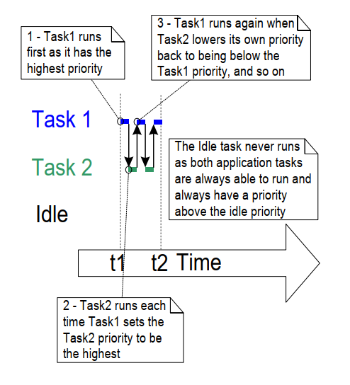

# 4 任务管理

## 4.1 简介

### 4.1.1 范围

本章涵盖以下内容：

- FreeRTOS 如何为应用程序中的每个任务分配处理时间。
- FreeRTOS 如何选择在任何给定时间执行哪个任务。
- 每个任务的相对优先级如何影响系统行为。
- 任务可以存在的状态。

本章还讨论了以下内容：

- 如何实现任务。
- 如何创建一个或多个任务实例。
- 如何使用任务参数。
- 如何更改已创建任务的优先级。
- 如何删除任务。
- 如何使用任务实现周期性处理。（后续章节将描述如何使用软件定时器实现相同功能。）
- 空闲任务何时执行以及如何使用它。

本章介绍的概念对于理解如何使用 FreeRTOS 以及 FreeRTOS 应用程序的行为至关重要。因此，这是本书中最详细的章节。

## 4.2 任务函数

任务以 C 函数的形式实现。任务必须实现如代码清单 4.1 所示的预期函数原型，该原型接受一个 void 指针参数并返回 void。

<a name="list4.1" title="代码清单 4.1 任务函数原型"></a>

```c
void vATaskFunction( void * pvParameters );
```

***代码清单 4.1*** *任务函数原型*

每个任务本身就是一个小型程序。它有一个入口点，通常会在一个无限循环中永远运行，并且不会退出。
代码清单 4.2 展示了一个典型任务的结构。

FreeRTOS 任务不得以任何方式从实现它的函数中返回。它不得包含 `return` 语句，也不得允许执行到其实现函数的末尾。如果某个任务不再需要，应按照代码清单 4.2 中的演示显式删除。

单个任务函数定义可用于创建任意数量的任务，其中每个创建的任务都是一个独立的执行实例。每个实例都有自己的堆栈，因此拥有在任务本身内定义的任何自动（堆栈）变量的副本。

<a name="list4.2" title="代码清单 4.2 典型任务函数的结构"></a>

```c
void vATaskFunction( void * pvParameters )
{
    /*
     * 在函数内部时，可以像平常一样声明堆栈分配的变量。
     * 使用此示例函数创建的每个任务实例都将在任务的堆栈上
     * 分配其自己独立的 lStackVariable 实例。
     */
    long lStackVariable = 0;

    /*
     * 与堆栈分配的变量不同，使用 `static` 关键字声明的变量
     * 由链接器分配到内存中的特定位置。
     * 这意味着所有调用 vATaskFunction 的任务都将共享同一
     * lStaticVariable 实例。
     */
    static long lStaticVariable = 0;

    for( ;; )
    {
        /* 实现任务功能的代码将放在这里。 */
    }

    /*
     * 如果任务实现一旦退出上述循环，
     * 则必须在到达其实现函数末尾之前删除任务。
     * 当将 NULL 作为参数传递给 vTaskDelete() API 函数时，
     * 这表示要删除的任务是调用此函数的任务（即当前任务）。
     */
    vTaskDelete( NULL );
}
```

***代码清单 4.2*** *典型任务函数的结构*

## 4.3 任务的顶层状态

一个应用程序可能包含多个任务。如果运行该应用程序的处理器只有一个核心，那么在任何给定时间只能有一个任务正在执行。这意味着一个任务可能处于两种状态之一：*运行中（Running）* 和 *未运行（Not Running）*。本章首先讨论这种简化的模型，稍后将详细描述 *未运行* 状态的若干子状态。

当处理器正在执行某个任务的代码时，该任务处于 *运行中* 状态。当任务处于 *未运行* 状态时，该任务被暂停，并且其状态已被保存，以便下次调度器决定将其切换到 *运行中* 状态时可以继续执行。当任务恢复执行时，它会从离开 *运行中* 状态之前即将执行的指令处继续执行。

<a name="fig4.1" title="图 4.1 顶层任务状态和转换"></a>

***

***图 4.1*** *顶层任务状态和转换*
***

当任务从 *未运行* 状态切换到 *运行中* 状态时，称为“切入”或“换入”。相反，当任务从 *运行中* 状态切换到 *未运行* 状态时，称为“切出”或“换出”。FreeRTOS 调度器是唯一能够将任务切入或切出 *运行中* 状态的实体。

## 4.4 任务创建

可以使用六个 API 函数来创建任务：
`xTaskCreate()`、
`xTaskCreateStatic()`、
`xTaskCreateRestricted()`、
`xTaskCreateRestrictedStatic()`、
`xTaskCreateAffinitySet()` 和
`xTaskCreateStaticAffinitySet()`

每个任务需要两块 RAM：一块用于存储其任务控制块（Task Control Block，TCB），另一块用于存储其堆栈。名字中包含 "Static" 的 FreeRTOS API 函数使用作为参数传入函数的预先分配的 RAM 块。而名字中不包含 "Static" 的 API 函数则在运行时从系统堆中动态分配所需的 RAM。

某些 FreeRTOS 移植版本支持在“受限”或“非特权”模式下运行的任务。名字中包含 "Restricted" 的 FreeRTOS API 函数创建的任务对系统的内存访问权限有限。而名字中不包含 "Restricted" 的 API 函数创建的任务则以“特权模式”运行，并具有对系统整个内存映射的访问权限。

支持对称多处理（Symmetric Multi Processing，SMP）的 FreeRTOS 移植版本允许不同的任务在同一 CPU 的多个核心上同时运行。对于这些移植版本，您可以使用名字中包含 "Affinity" 的函数指定任务将在哪个核心上运行。

FreeRTOS 任务创建的 API 函数相当复杂。本文档中的大多数示例使用 `xTaskCreate()`，因为它是这些函数中最简单的。

### 4.4.1 xTaskCreate() API 函数

代码清单 4.3 展示了 `xTaskCreate()` API 函数的原型。
`xTaskCreateStatic()` 有两个额外的参数，分别指向为保存任务数据结构和堆栈而预先分配的内存。
[第 2.5 节：数据类型与编码风格指南](ch02.md#25-data-types-and-coding-style-guide) 描述了所使用的数据类型和命名约定。

<a name="list4.3" title="代码清单 4.3 xTaskCreate() API 函数原型"></a>


```c
BaseType_t xTaskCreate( TaskFunction_t pvTaskCode,
                        const char * const pcName,
                        configSTACK_DEPTH_TYPE usStackDepth,
                        void * pvParameters,
                        UBaseType_t uxPriority,
                        TaskHandle_t * pxCreatedTask );
```

***代码清单 4.3*** *xTaskCreate() API 函数原型*

**xTaskCreate() 参数和返回值：**

- `pvTaskCode`

  任务本质上是永不退出的 C 函数，因此通常实现为无限循环。`pvTaskCode` 参数是指向实现任务的函数的指针（实际上就是函数名）。

- `pcName`

  任务的描述性名称。FreeRTOS 不会以任何方式使用此名称，它纯粹是为了方便调试而提供的。通过人类可读的名称来标识任务比通过其句柄要简单得多。

  应用程序定义的常量 `configMAX_TASK_NAME_LEN` 定义了任务名称的最大长度（包括 NULL 终止符）。如果提供了更长的字符串，字符串将被截断。

- `usStackDepth`

  指定为任务分配的堆栈大小。如果需要使用预先分配的内存而不是动态分配的内存，请使用 `xTaskCreateStatic()` 而不是 `xTaskCreate()`。

  注意，该值指定的是堆栈可以容纳的字数，而不是字节数。例如，如果堆栈宽度为 32 位且 `usStackDepth` 为 128，则 `xTaskCreate()` 将分配 512 字节的堆栈空间（128 * 4 字节）。

  `configSTACK_DEPTH_TYPE` 是一个宏，允许应用程序开发者指定用于保存堆栈大小的数据类型。如果未定义，`configSTACK_DEPTH_TYPE` 默认为 `uint16_t`。如果堆栈深度乘以堆栈宽度大于 65535（最大的 16 位数），请在 `FreeRTOSConfig.h` 中将 `configSTACK_DEPTH_TYPE` 定义为 `unsigned long` 或 `size_t`。

  [第 13.3 节 堆栈溢出](ch13.md#133-stack-overflow) 描述了一种选择最佳堆栈大小的实际方法。

- `pvParameters`

  实现任务的函数接受一个单独的空指针（`void *`）参数。`pvParameters` 是通过该参数传递到任务中的值。

- `uxPriority`

  定义任务的优先级。0 是最低优先级，`(configMAX_PRIORITIES – 1)` 是最高优先级。[第 4.5 节](#45-task-priorities) 描述了用户定义的 `configMAX_PRIORITIES` 常量。

  如果定义的 `uxPriority` 大于 `(configMAX_PRIORITIES – 1)`，它将被限制为 `(configMAX_PRIORITIES – 1)`。

- `pxCreatedTask`

  指向存储创建的任务句柄的位置的指针。该句柄可用于未来的 API 调用中，例如更改任务的优先级或删除任务。

  `pxCreatedTask` 是一个可选参数，如果不需任务句柄，可以将其设置为 NULL。

- 返回值

  可能的返回值有两种：

  - `pdPASS`

    表示任务已成功创建。

  - `pdFAIL`

    表示没有足够的堆内存来创建任务。[第 3 章](ch03.md#3-heap-memory-management) 提供了关于堆内存管理的更多信息。


<a name="example4.1" title="示例 4.1 创建任务"></a>
---
***示例 4.1*** *创建任务*

---

以下示例演示了创建两个简单任务所需的步骤，然后启动新创建的任务。这些任务通过使用一个简陋的忙等待循环来周期性地打印一条字符串，从而实现周期延迟。这两个任务的优先级相同，且实现完全一致，唯一的区别是它们打印的字符串不同——请参见代码清单 4.4 和代码清单 4.5 中的各自实现。有关在任务中使用 `printf()` 的警告，请参阅第 8 章。

<a name="list4.4" title="代码清单 4.4 示例 4.1 中第一个任务的实现"></a>


```c
void vTask1( void * pvParameters )
{
    /* ulCount 被声明为 volatile 以确保它不会被优化掉。 */
    volatile unsigned long ulCount;

    for( ;; )
    {
        /* 打印当前任务的名称。 */
        vPrintLine( "任务 1 正在运行" );

        /* 延迟一段时间。 */
        for( ulCount = 0; ulCount < mainDELAY_LOOP_COUNT; ulCount++ )
        {
            /*
             * 这个循环只是一个非常简陋的延迟实现。这里没有任何操作。
             * 后续示例将用正确的延迟/睡眠函数替换这个简陋的循环。
             */
        }
    }
}
```

***代码清单 4.4*** *示例 4.1 中第一个任务的实现*


<a name="list4.5" title="代码清单 4.5 示例 4.1 中第二个任务的实现"></a>


```c
void vTask2( void * pvParameters )
{
    /* ulCount 被声明为 volatile 以确保它不会被优化掉。 */
    volatile unsigned long ulCount;

    /* 与大多数任务一样，该任务实现为无限循环。 */
    for( ;; )
    {
        /* 打印此任务的名称。 */
        vPrintLine( "任务 2 正在运行" );

        /* 延迟一段时间。 */
        for( ulCount = 0; ulCount < mainDELAY_LOOP_COUNT; ulCount++ )
        {
            /*
             * 这个循环只是一个非常简陋的延迟实现。这里没有任何操作。
             * 后续示例将用正确的延迟/睡眠函数替换这个简陋的循环。
             */
        }
    }
}
```

***代码清单 4.5*** *示例 4.1 中第二个任务的实现*

`main()` 函数在启动调度器之前创建任务——请参见代码清单 4.6 中的实现。


<a name="list4.6" title="代码清单 4.6 启动示例 4.1 的任务"></a>


```c
int main( void )
{
    /*
     * 在此处声明的变量在启动 FreeRTOS 调度器后可能不再存在。
     * 不要尝试从任务中访问在 main() 栈上声明的变量。
     */

    /*
     * 创建两个任务中的一个。注意，实际应用中应检查 xTaskCreate() 
     * 调用的返回值以确保任务成功创建。
     */
    xTaskCreate( vTask1,  /* 指向实现任务的函数的指针。*/
                 "任务 1",/* 任务的文本名称。 */
                 1000,    /* 堆栈深度（以字为单位）。 */
                 NULL,    /* 本示例未使用任务参数。 */
                 1,       /* 该任务将在优先级 1 上运行。 */
                 NULL );  /* 本示例未使用任务句柄。 */

    /* 以完全相同的方式和相同的优先级创建另一个任务。 */
    xTaskCreate( vTask2, "任务 2", 1000, NULL, 1, NULL );

    /* 启动调度器以使任务开始执行。 */
    vTaskStartScheduler();

    /*
     * 如果一切正常，main() 将不会到达此处，因为调度器现在正在运行
     * 已创建的任务。如果 main() 到达此处，则表示没有足够的堆内存来
     * 创建空闲任务或定时器任务（本书后面会描述）。第 3 章提供了更多
     * 关于堆内存管理的信息。
     */
    for( ;; );
}
```

***代码清单 4.6*** *启动示例 4.1 的任务*

执行该示例会产生如图 4.2 所示的输出。

<a name="fig4.2" title="图 4.2 执行示例 4.1 时产生的输出"></a>

***

```console
C:\Temp>rtosdemo
任务 1 正在运行
任务 2 正在运行
任务 1 正在运行
任务 2 正在运行
任务 1 正在运行
任务 2 正在运行
任务 1 正在运行
任务 2 正在运行
任务 1 正在运行
任务 2 正在运行
任务 1 正在运行
任务 2 正在运行
任务 1 正在运行
任务 2 正在运行
```

***图 4.2*** *执行示例 4.1 时产生的输出[^4]*

***

[^4]: 截图显示每个任务在其消息打印一次后切换到下一个任务。这是使用 FreeRTOS Windows 模拟器导致的人为场景。Windows 模拟器并非真正的实时系统。此外，向 Windows 控制台写入数据需要相对较长的时间，并触发一系列 Windows 系统调用。在真实的嵌入式目标设备上运行相同的代码并使用快速且非阻塞的打印函数时，可能会导致每个任务在其字符串被打印多次后才会被切换出去以允许其他任务运行。

图 4.2 显示两个任务看似同时执行；然而，两个任务都在同一个处理器核心上运行，因此这不可能是事实。实际上，两个任务正在快速地进入和退出*运行*状态。由于两个任务具有相同的优先级，因此它们共享同一处理器核心上的时间片。图 4.3 展示了它们的实际执行模式。

图 4.3 底部的箭头表示时间从 t1 开始流逝。彩色线条显示了每个时刻正在执行的任务——例如，任务 1 在 t1 和 t2 之间执行。

任何时刻只能有一个任务处于*运行*状态。因此，当一个任务进入*运行*状态（任务被切换进来）时，另一个任务则进入*未运行*状态（任务被切换出去）。


<a name="fig4.3" title="图 4.3 示例 4.1 中两个任务的实际执行模式"></a>

***

***图 4.3*** *示例 4.1 中两个任务的实际执行模式*
***

示例 4.1 从 `main()` 中创建了两个任务，调度器启动之前完成。也可以从另一个任务中创建任务。例如，任务 2 可以从任务 1 内部创建，如代码清单 4.7 所示。


<a name="list4.7" title="代码清单 4.7 调度器启动后从另一个任务中创建任务"></a>


```c
void vTask1( void * pvParameters )
{
    const char *pcTaskName = "任务 1 正在运行\r\n";
    volatile unsigned long ul; /* 使用 volatile 确保 ul 不会被优化掉。 */

    /*
     * 如果此任务代码正在执行，则调度器肯定已经启动。
     * 在进入无限循环之前，创建另一个任务。
     */
    xTaskCreate( vTask2, "任务 2", 1000, NULL, 1, NULL );

    for( ;; )
    {
        /* 打印此任务的名称。 */
        vPrintLine( pcTaskName );

        /* 延迟一段时间。 */
        for( ul = 0; ul < mainDELAY_LOOP_COUNT; ul++ )
        {
            /*
             * 这个循环只是一个非常简陋的延迟实现。这里没有任何操作。
             * 后续示例将用正确的延迟/睡眠函数替换这个简陋的循环。
             */
        }
    }
}
```

***代码清单 4.7*** *调度器启动后从另一个任务中创建任务*

<a name="example4.2" title="示例 4.2 使用任务参数"></a>
---
***示例 4.2*** *使用任务参数*

---

在示例 4.1 中创建的两个任务几乎完全相同，唯一的区别是它们打印的文本字符串。如果通过创建单个任务实现的两个实例，并使用任务参数将字符串传递给每个实例，就可以避免重复代码。

示例 4.2 用名为 `vTaskFunction()` 的单一任务函数替换了示例 4.1 中使用的两个任务函数，如代码清单 4.8 所示。注意如何将任务参数转换为 `char *` 类型以获取任务应打印的字符串。


<a name="list4.8" title="代码清单 4.8 示例 4.2 中用于创建两个任务的单一任务函数"></a>

```c
void vTaskFunction( void * pvParameters )
{

    char *pcTaskName;
    volatile unsigned long ul; /* 使用 volatile 确保 ul 不会被优化掉。 */

    /*
     * 要打印的字符串通过参数传递。将其转换为字符指针。
     */
    pcTaskName = ( char * ) pvParameters;

    /* 与大多数任务一样，此任务是在无限循环中实现的。 */
    for( ;; )
    {
        /* 打印此任务的名称。 */
        vPrintLine( pcTaskName );

        /* 延迟一段时间。 */
        for( ul = 0; ul < mainDELAY_LOOP_COUNT; ul++ )
        {
            /*
             * 这个循环只是一个非常简陋的延迟实现。这里没有任何操作。
             * 后续练习将用正确的延迟/睡眠函数替换这个简陋的循环。
             */
        }
    }
}
```

***代码清单 4.8*** *示例 4.2 中用于创建两个任务的单一任务函数*

代码清单 4.9 创建了由 `vTaskFunction()` 实现的任务的两个实例，使用任务参数向每个实例传递不同的字符串。两个任务在 FreeRTOS 调度器的控制下独立执行，并且拥有各自的堆栈，因此也拥有各自独立的 `pcTaskName` 和 `ul` 变量副本。


<a name="list4.9" title="代码清单 4.9 示例 2 的 main() 函数"></a>


```c
/*
 * 定义将作为任务参数传递的字符串。这些字符串定义为 const 并且不在 main() 使用的堆栈上，
 * 以确保在任务执行时它们仍然有效。
 */
static const char * pcTextForTask1 = "任务 1 正在运行";
static const char * pcTextForTask2 = "任务 2 正在运行";

int main( void )
{
    /*
     * 在启动 FreeRTOS 调度器后，此处声明的变量可能不再存在。
     * 不要尝试从任务中访问 main() 使用的堆栈上声明的变量。
     */

    /* 创建第一个任务。 */
    xTaskCreate( vTaskFunction,             /* 指向实现任务的函数的指针。 */
                 "任务 1",                  /* 任务的文本名称。仅用于调试目的。 */
                 1000,                      /* 堆栈深度 - 小型微控制器将使用比这少得多的堆栈。*/
                 ( void * ) pcTextForTask1, /* 使用任务参数将要打印的文本传递到任务中。 */
                 1,                         /* 此任务将在优先级 1 上运行。 */
                 NULL );                    /* 本示例中不使用任务句柄。 */

    /*
     * 以完全相同的方式创建另一个任务。请注意，这次多个任务是从同一个任务实现
     * （vTaskFunction）创建的。唯一的区别是传递给参数的值不同。
     * 同一个任务定义的两个实例被创建。
     */
    xTaskCreate( vTaskFunction,
                 "任务 2",
                 1000,
                 ( void * ) pcTextForTask2,
                 1,
                 NULL );

    /* 启动调度器以使任务开始执行。 */
    vTaskStartScheduler();

    /*
     * 如果一切正常，main() 不会到达此处，因为此时调度器已经在运行所创建的任务。
     * 如果 main() 确实到达此处，则说明没有足够的堆内存来创建空闲任务或定时器任务
     * （本书后面章节会描述）。第 3 章提供了更多关于堆内存管理的信息。
     */
    for( ;; )
    {
    }
}
```

***代码清单 4.9*** *示例 2 的 main() 函数*


示例 4.2 的输出与图 4.2 中显示的示例 1 的输出完全一致。

## 4.5 任务优先级

FreeRTOS 调度器始终确保能够运行的最高优先级任务被选中进入*运行*状态。具有相同优先级的任务会依次进入和退出*运行*状态。

用于创建任务的 API 函数的 `uxPriority` 参数为任务指定了初始优先级。API 函数 `vTaskPrioritySet()` 可在任务创建后更改其优先级。

用户定义的编译时配置常量 `configMAX_PRIORITIES` 设置了可用优先级的数量。较低的数值表示低优先级任务，其中优先级 0 是最低的可能优先级——因此有效优先级范围为 0 到 `(configMAX_PRIORITIES – 1)`。任意数量的任务可以共享相同的优先级。

FreeRTOS 调度器有两种选择*运行*状态任务的算法实现，`configMAX_PRIORITIES` 的最大允许值取决于所使用的实现方式：

### 4.5.1 通用调度器

通用调度器使用 C 语言编写，可与所有 FreeRTOS 架构移植一起使用。它对 `configMAX_PRIORITIES` 没有强制上限。通常建议尽量减少 `configMAX_PRIORITIES` 的值，因为更多的优先级需要更多的 RAM，并会导致最坏情况下的执行时间变长。

### 4.5.2 架构优化调度器

架构优化实现使用特定架构的汇编代码编写，比通用 C 实现性能更高，且所有 `configMAX_PRIORITIES` 值的最坏情况执行时间相同。

架构优化实现在 32 位架构上对 `configMAX_PRIORITIES` 的最大值限制为 32，在 64 位架构上限制为 64。与通用方法一样，建议将 `configMAX_PRIORITIES` 保持在尽可能低的值，因为更高的值需要更多的 RAM。

在 FreeRTOSConfig.h 中将 `configUSE_PORT_OPTIMIZED_TASK_SELECTION` 设置为 1 以使用架构优化实现，或设置为 0 以使用通用实现。并非所有 FreeRTOS 移植都有架构优化实现。对于支持架构优化的移植，如果未定义该选项，默认将 `configUSE_PORT_OPTIMIZED_TASK_SELECTION` 设置为 1；对于不支持架构优化的移植，默认将其设置为 0。

## 4.6 时间测量与滴答中断

[第 4.12 节，调度算法](#412-scheduling-algorithms) 描述了一种名为“时间片”的可选功能。到目前为止，示例中使用了时间片，这也是它们产生的输出中观察到的行为。在这些示例中，两个任务都以相同的优先级创建，并且两个任务始终都能运行。因此，每个任务执行一个“时间片”，在时间片开始时进入*运行*状态，在时间片结束时退出*运行*状态。在图 4.3 中，t1 和 t2 之间的时间等于一个时间片。

调度器在每个时间片结束时执行以选择下一个要运行的任务[^5]。为此目的使用了一个周期性中断，称为“滴答中断”。编译时配置常量 `configTICK_RATE_HZ` 设置了滴答中断的频率，从而也设置了每个时间片的长度。例如，将 `configTICK_RATE_HZ` 设置为 100（Hz）会导致每个时间片持续 10 毫秒。两次滴答中断之间的时间称为“滴答周期”——因此一个时间片等于一个滴答周期。

[^5]: 需要注意的是，时间片的结束并不是调度器选择新任务运行的唯一时机。正如我们将在本书中展示的那样，调度器还会在当前正在执行的任务进入*阻塞*状态后，或者当中断将更高优先级的任务移入*就绪*状态时，立即选择一个新任务运行。

图 4.4 在图 4.3 的基础上扩展，展示了调度器的执行情况。在图 4.4 中，顶部线条显示了调度器何时执行，细箭头则显示了从任务到滴答中断的执行顺序，然后从滴答中断返回到另一个不同的任务。

`configTICK_RATE_HZ` 的最佳值取决于具体应用，但通常为 100。


<a name="fig4.4" title="图 4.4 执行顺序扩展以显示滴答中断的执行"></a>

***

***图 4.4*** *执行顺序扩展以显示滴答中断的执行*
***

FreeRTOS API 调用以滴答周期的倍数指定时间，通常简称为“滴答”。宏 `pdMS_TO_TICKS()` 将以毫秒为单位的时间转换为以滴答为单位的时间。可用的分辨率取决于定义的滴答频率，如果滴答频率高于 1KHz（即 `configTICK_RATE_HZ` 大于 1000），则无法使用 `pdMS_TO_TICKS()`。代码清单 4.10 展示了如何使用 `pdMS_TO_TICKS()` 将 200 毫秒的时间转换为等效的以滴答为单位的时间。


<a name="list4.10" title="代码清单 4.10 使用 pdMS\_TO\_TICKS() 宏将 200 毫秒..."></a>

```c
/*
 * pdMS_TO_TICKS() 接收以毫秒为单位的时间作为其唯一参数，
 * 并计算出等效的以滴答周期为单位的时间。此示例展示了
 * 将 xTimeInTicks 设置为等效于 200 毫秒的滴答周期数量。
 */
TickType_t xTimeInTicks = pdMS_TO_TICKS( 200 );
```

***代码清单 4.10*** *使用 pdMS\_TO\_TICKS() 宏将 200 毫秒转换为等效的以滴答周期为单位的时间*

使用 `pdMS_TO_TICKS()` 以毫秒为单位指定时间，而不是直接以滴答为单位，可以确保即使滴答频率发生变化，应用程序内指定的时间也不会改变。

“滴答计数”是自调度器启动以来发生的滴答中断总数，前提是滴答计数未溢出。用户应用程序在指定延迟时间时无需考虑溢出问题，因为 FreeRTOS 会在内部管理时间一致性。

[第 4.12 节：调度算法](#412-scheduling-algorithms) 描述了影响调度器何时选择新任务运行以及何时执行滴答中断的配置常量。

<a name="example4.3" title="示例 4.3 试验优先级"></a>
---
***示例 4.3*** *试验优先级*

---

调度器始终确保能够运行的最高优先级任务被选中进入*运行*状态。之前的示例创建了两个具有相同优先级的任务，因此它们轮流进入和退出*运行*状态。本示例探讨了当任务具有不同优先级时会发生什么。代码清单 4.11 展示了用于创建任务的代码，第一个任务的优先级为 1，第二个任务的优先级为 2。实现这两个任务的单一函数没有变化；它仍然定期打印字符串，并使用空循环来创建延迟。

<a name="list4.11" title="代码清单 4.11. 创建两个具有不同优先级的任务"></a>


```c
/*
 * 定义将作为任务参数传递的字符串。
 * 这些字符串定义为 const 并且不在栈上，以确保在任务执行时它们仍然有效。
 */
static const char * pcTextForTask1 = "Task 1 is running";
static const char * pcTextForTask2 = "Task 2 is running";

int main( void )
{
    /* 创建第一个优先级为 1 的任务。 */
    xTaskCreate( vTaskFunction,             /* 任务函数    */
                 "Task 1",                  /* 任务名称    */
                 1000,                      /* 任务堆栈深度 */
                 ( void * ) pcTextForTask1, /* 任务参数    */
                 1,                         /* 任务优先级  */
                 NULL );

    /* 创建第二个优先级更高的任务，优先级为 2。 */
    xTaskCreate( vTaskFunction,             /* 任务函数    */
                 "Task 2",                  /* 任务名称    */
                 1000,                      /* 任务堆栈深度 */
                 ( void * ) pcTextForTask2, /* 任务参数    */
                 2,                         /* 任务优先级  */
                 NULL );

    /* 启动调度器以使任务开始执行。 */
    vTaskStartScheduler();

    /* 不会到达此处。 */
    return 0;
}
```

***代码清单 4.11*** *创建两个具有不同优先级的任务*

图 4.5 显示了示例 4.3 产生的输出。

调度器始终会选择可以运行的最高优先级任务。任务 2 的优先级高于任务 1，并且始终可以运行；因此，调度器总是选择任务 2，而任务 1 永远不会执行。任务 1 被认为是被任务 2“剥夺”了处理时间——由于它从未进入*运行*状态，因此无法打印其字符串。


<a name="fig4.5" title="图 4.5 在不同优先级下运行两个任务"></a>

***
```console
C:\Temp>rtosdemo
Task 2 is running
Task 2 is running
Task 2 is running
Task 2 is running
Task 2 is running
Task 2 is running
Task 2 is running
Task 2 is running
Task 2 is running
Task 2 is running
Task 2 is running
Task 2 is running
Task 2 is running
Task 2 is running
Task 2 is running
```

***图 4.5*** *在不同优先级下运行两个任务*
***

任务 2 始终可以运行，因为它无需等待任何内容——它要么在空循环中循环，要么向终端打印内容。


<a name="fig4.6" title="图 4.6 当一个任务优先级高于另一个任务时的执行模式（来自示例 4.3）"></a>

***

***图 4.6*** *当一个任务优先级高于另一个任务时的执行模式（来自示例 4.3）*


## 4.7 扩展*非运行*状态

到目前为止，所创建的任务始终有需要处理的工作，并且从未需要等待任何内容——由于它们从未需要等待任何内容，因此始终能够进入*运行*状态。这种“持续处理”的任务用途有限，因为它们只能在最低优先级下创建。如果它们在任何其他优先级下运行，将会阻止所有较低优先级的任务运行。

为了使这些任务变得有用，必须将其改写为事件驱动型任务。事件驱动型任务只有在某个事件触发后才有工作（处理）要执行，并且在此之前无法进入*运行*状态。调度器始终选择可以运行的最高优先级任务。如果高优先级任务因等待事件而无法被选中，则调度器必须选择一个可以运行的较低优先级任务。因此，编写事件驱动型任务意味着可以在不同优先级下创建任务，而不会导致最高优先级任务剥夺所有低优先级任务的处理时间。

### 4.7.1 *阻塞*状态

等待事件的任务被称为处于“阻塞”状态，这是*非运行*状态的一个子状态。

任务可以进入*阻塞*状态以等待两种不同类型的事件：

1. 时间相关事件——这些事件在延迟期结束或到达绝对时间时发生。例如，某个任务可能进入*阻塞*状态以等待10毫秒的流逝。

2. 同步事件——这些事件源自另一个任务或中断。例如，某个任务可能进入*阻塞*状态以等待队列上的数据到达。同步事件涵盖了许多类型的事件。

FreeRTOS 队列、二进制信号量、计数信号量、互斥锁、递归互斥锁、事件组、流缓冲区、消息缓冲区以及直接到任务通知都可以创建同步事件。后续章节将涵盖这些功能中的大部分。

任务可以在同步事件上设置超时进行阻塞，从而同时阻塞在这两种事件上。例如，任务可以选择最多等待10毫秒以让数据到达队列。如果在10毫秒内数据到达，或者10毫秒过去而没有数据到达，任务都会退出*阻塞*状态。

### 4.7.2 *挂起*状态

*挂起*也是*非运行*状态的一个子状态。处于挂起状态的任务对调度器不可用。进入挂起状态的唯一方法是通过调用 `vTaskSuspend()` API 函数，而出挂起状态的唯一方法是通过调用 `vTaskResume()` 或 `xTaskResumeFromISR()` API 函数。大多数应用程序并不使用挂起状态。

### 4.7.3 就绪状态

处于*非运行*状态且未处于*阻塞*或*挂起*状态的任务被称为处于*就绪*状态。它们可以运行，因此“准备”运行，但当前并不处于*运行*状态。

### 4.7.4 完成状态转换图

图 4.7 扩展了简化版的状态图，包含了本节中描述的所有*非运行*子状态。到目前为止，示例中创建的任务并未使用*阻塞*或*挂起*状态。它们仅在*就绪*状态和*运行*状态之间切换，如图 4.7 中的粗线所示。


<a name="fig4.7" title="图 4.7 完整的任务状态机"></a>

***

***图 4.7*** *完整任务状态机*
***

<a name="example4.4" title="示例 4.4 使用阻塞状态创建延迟"></a>
---
***示例 4.4*** *使用*阻塞*状态创建延迟</i></h3>

---

到目前为止，所有示例中创建的任务都是“周期性”的——它们会延迟一段时间，然后打印出其字符串，接着再次延迟，依此类推。延迟是通过一个非常粗糙的空循环生成的——任务轮询一个递增的循环计数器，直到达到固定值。示例 4.3 明确展示了这种方法的缺点。高优先级任务在执行空循环期间始终保持在*运行*状态，从而“剥夺”了低优先级任务的任何处理时间。

任何形式的轮询都有若干缺点，其中效率低下尤为突出。在轮询期间，任务实际上并没有任何工作要做，但它仍然占用最大的处理时间，从而浪费了处理器周期。示例 4.4 通过用调用 `vTaskDelay()` API 函数替代轮询空循环来纠正这种行为，其原型如代码清单 4.12 所示。新的任务定义如代码清单 4.13 所示。请注意，只有在 FreeRTOSConfig.h 中将 `INCLUDE_vTaskDelay` 设置为 1 时，`vTaskDelay()` API 函数才可用。

`vTaskDelay()` 将调用任务置于*阻塞*状态一段固定的滴答中断次数。任务在处于*阻塞*状态时不会使用任何处理时间，因此任务仅在实际有工作需要完成时才占用处理时间。


<a name="list4.12" title="代码清单 4.12 vTaskDelay() API 函数原型"></a>


```c
void vTaskDelay( TickType_t xTicksToDelay );
```

***代码清单 4.12*** *vTaskDelay() API 函数原型*

**vTaskDelay 参数：**

- `xTicksToDelay`

  调用任务保持在*阻塞*状态的滴答中断次数，之后它将被转换回就绪状态。

  例如，如果某个任务在滴答计数为 10,000 时调用了 `vTaskDelay( 100 )`，则它会立即进入*阻塞*状态，并保持在*阻塞*状态，直到滴答计数达到 10,100。

  宏 `pdMS_TO_TICKS()` 可用于将以毫秒为单位的时间转换为以滴答为单位的时间。例如，调用 `vTaskDelay( pdMS_TO_TICKS( 100 ) )` 会使调用任务保持在*阻塞*状态 100 毫秒。


<a name="list4.13" title="代码清单 4.13 示例任务的源代码，在用对 vTaskDelay() 的调用替换空循环延迟后..."></a>


```c
void vTaskFunction( void * pvParameters )
{
    char * pcTaskName;
    const TickType_t xDelay250ms = pdMS_TO_TICKS( 250 );

    /*
     * 要打印的字符串通过参数传递进来。将其强制转换为字符指针。
     */
    pcTaskName = ( char * ) pvParameters;

    /* 像大多数任务一样，该任务在一个无限循环中实现。 */
    for( ;; )
    {
        /* 打印此任务的名称。 */
        vPrintLine( pcTaskName );

        /*
         * 延迟一段时间。这次使用了对 vTaskDelay() 的调用，
         * 它将任务置于阻塞状态，直到延迟期结束。参数采用以“滴答”为单位的时间，
         * 并且使用 pdMS_TO_TICKS() 宏（其中声明了 xDelay250ms 常量）
         * 将 250 毫秒转换为等效的滴答时间。
         */
        vTaskDelay( xDelay250ms );
    }
}
```

***代码清单 4.13*** *示例任务的源代码，在用对 vTaskDelay() 的调用替换空循环延迟后*

尽管两个任务仍然以不同的优先级创建，但现在它们都会运行。示例 4.4 的输出如图 4.8 所示，确认了预期的行为。

<a name="fig4.8" title="图 4.8 执行示例 4.4 时产生的输出"></a>

***

```console
C:\Temp>rtosdemo
任务2正在运行
任务1正在运行
任务2正在运行
任务1正在运行
任务2正在运行
任务1正在运行
任务2正在运行
任务1正在运行
任务2正在运行
任务1正在运行
任务2正在运行
任务1正在运行
任务2正在运行
任务1正在运行
任务2正在运行
任务1正在运行
```

***图 4.8*** *执行示例 4.4 时产生的输出*
***

图 4.9 所示的执行顺序解释了为什么两个任务即使以不同的优先级创建，仍然都能运行。为简化起见，调度器本身的执行被省略。

当调度器启动时，会自动创建空闲任务（Idle Task），以确保始终至少有一个任务可以运行（至少有一个任务处于*就绪*状态）。[第 4.8 节：空闲任务与空闲任务钩子函数](#48-the-idle-task-and-the-idle-task-hook) 更详细地描述了空闲任务。


<a name="fig4.9" title="图 4.9 任务使用 vTaskDelay() 替代空循环时的执行顺序"></a>

***

***图 4.9*** *任务使用 vTaskDelay() 替代空循环时的执行顺序*
***

只有这两个任务的实现发生了变化，它们的功能并未改变。将图 4.9 与图 4.4 进行比较，可以清楚地看到这种功能的实现方式要高效得多。

图 4.4 显示了任务使用空循环来创建延迟时的执行模式，因此它们始终能够运行。结果是，它们共同占用了百分之百的可用处理器时间。图 4.9 显示了任务在延迟期间进入*阻塞*状态时的执行模式。它们仅在实际有需要执行的工作时（在本例中只是打印一条消息）占用处理器时间，因此只使用了极小部分的可用处理时间。

在图 4.9 所示的场景中，每次任务离开*阻塞*状态后，它们会在重新进入*阻塞*状态之前执行一小段滴答周期。大多数时候没有应用程序任务可以运行（没有应用程序任务处于*就绪*状态），因此也没有任务可以被选中进入*运行*状态。在此期间，空闲任务运行。分配给空闲任务的处理时间反映了系统中的剩余处理能力。使用实时操作系统（RTOS）可以通过让应用程序完全基于事件驱动的方式显著增加剩余处理能力。

图 4.10 中的粗线显示了示例 4.4 中任务的转换过程，每个任务现在都会在返回*就绪*状态之前经历*阻塞*状态。


<a name="fig4.10" title="图 4.10 粗线表示示例 4.4 中任务的状态转换..."></a>

***

***图 4.10*** *粗线表示示例 4.4 中任务的状态转换*
***


### 4.7.5 `vTaskDelayUntil()` API 函数

`vTaskDelayUntil()` 与 `vTaskDelay()` 类似。正如刚刚演示的那样，`vTaskDelay()` 的参数指定了任务调用 `vTaskDelay()` 和同一任务再次从*阻塞*状态转换出来之间应发生的滴答中断次数。任务保持在阻塞状态的时间长度由 `vTaskDelay()` 参数指定，但任务离开阻塞状态的时间是相对于调用 `vTaskDelay()` 的时间而言的。

而 `vTaskDelayUntil()` 的参数则指定了调用任务应该从阻塞状态转换到*就绪*状态的确切滴答计数值。当需要固定执行周期时（例如希望任务以固定的频率周期性执行），`vTaskDelayUntil()` 是要使用的API函数，因为调用任务解除阻塞的时间是绝对的，而不是相对于调用函数的时间（如 `vTaskDelay()` 的情况）。


<a name="list4.14" title="清单 4.14 vTaskDelayUntil() API 函数原型"></a>

```c
void vTaskDelayUntil( TickType_t * pxPreviousWakeTime,
                      TickType_t xTimeIncrement );
```

***清单 4.14*** *vTaskDelayUntil() API 函数原型*

**vTaskDelayUntil() 参数**

- `pxPreviousWakeTime`

  此参数基于假设 `vTaskDelayUntil()` 被用于实现一个以固定频率周期性执行的任务。在这种情况下，`pxPreviousWakeTime` 保存了任务上次离开*阻塞*状态（即“唤醒”）的时间。此时间用作参考点，以计算任务下次离开*阻塞*状态的时间。

  指向 `pxPreviousWakeTime` 的变量会在 `vTaskDelayUntil()` 函数中自动更新；通常不会被应用程序代码修改，但在首次使用之前必须初始化为当前的滴答计数值。清单 4.15 展示了如何初始化该变量。

- `xTimeIncrement`

  此参数同样基于假设 `vTaskDelayUntil()` 被用于实现一个以固定频率周期性执行的任务，其中频率由 `xTimeIncrement` 值设定。

  `xTimeIncrement` 以“滴答”为单位指定。宏 `pdMS_TO_TICKS()` 可用于将毫秒为单位的时间转换为以滴答为单位的时间。

<a name="example4.5" title="示例 4.5 将示例任务转换为使用 vTaskDelayUntil()"></a>
---
***示例 4.5*** *将示例任务转换为使用 vTaskDelayUntil()*

---

示例 4.4 中创建的两个任务是周期性任务，但使用 `vTaskDelay()` 并不能保证它们运行的频率是固定的，因为任务离开*阻塞*状态的时间是相对于它们调用 `vTaskDelay()` 的时间而言的。将这些任务转换为使用 `vTaskDelayUntil()` 而不是 `vTaskDelay()` 解决了这个潜在问题。

<a name="list4.15" title="清单 4.15 使用 vTaskDelayUntil() 实现的示例任务"></a>


```c
void vTaskFunction( void * pvParameters )
{
    char * pcTaskName;
    TickType_t xLastWakeTime;

    /*
     * 要打印的字符串通过参数传入。将其转换为字符指针。
     */
    pcTaskName = ( char * ) pvParameters;

    /*
     * xLastWakeTime 变量需要使用当前的滴答计数值进行初始化。注意，这是唯一一次显式写入该变量。
     * 之后，xLastWakeTime 会在 vTaskDelayUntil() 中自动更新。
     */
    xLastWakeTime = xTaskGetTickCount();

    /* 与大多数任务一样，此任务在一个无限循环中实现。 */
    for( ;; )
    {
        /* 打印此任务的名称。 */
        vPrintLine( pcTaskName );

        /*
         * 此任务应每 250 毫秒精确执行一次。正如 vTaskDelay() 函数一样，
         * 时间以滴答为单位测量，并且使用 pdMS_TO_TICKS() 宏将毫秒转换为滴答。
         * xLastWakeTime 在 vTaskDelayUntil() 中自动更新，因此任务不会显式更新它。
         */
        vTaskDelayUntil( &xLastWakeTime, pdMS_TO_TICKS( 250 ) );
    }
}
```

***清单 4.15*** *使用 vTaskDelayUntil() 实现的示例任务*

示例 4.5 产生的输出与图 4.8 中显示的示例 4.4 的输出完全一致。

<a name="example4.6" title="示例 4.6 结合阻塞和非阻塞任务"></a>
---
***示例 4.6*** *结合阻塞和非阻塞任务*

---

前面的示例分别单独研究了轮询和阻塞任务的行为。本示例进一步巩固了我们之前关于预期系统行为的内容，并展示了当两种方案结合时的执行顺序，具体如下：

1. 创建两个优先级为 1 的任务。它们所做的只是不断地打印一个字符串。

   这些任务永远不会调用可能导致它们进入*阻塞*状态的 API 函数，因此始终处于就绪或*运行*状态。
   这种性质的任务被称为“连续处理”任务，因为它们总是有工作要做（尽管在本例中是相当琐碎的工作）。
   清单 4.16 显示了连续处理任务的源代码。

1. 然后创建第三个优先级为 2 的任务，其优先级高于其他两个任务。第三个任务也仅打印一个字符串，但它是周期性地执行的，因此它使用 `vTaskDelayUntil()` API 函数将自身置于*阻塞*状态，每次打印之间等待一段时间。

清单 4.17 显示了周期性任务的源代码。


<a name="list4.16" title="清单 4.16 示例 4.6 中使用的连续处理任务"></a>


```c
void vContinuousProcessingTask( void * pvParameters )
{
    char * pcTaskName;

    /*
     * 要打印的字符串通过参数传入。将其转换为字符指针。
     */
    pcTaskName = ( char * ) pvParameters;

    /* 与大多数任务一样，此任务在一个无限循环中实现。 */
    for( ;; )
    {
        /*
         * 打印此任务的名称。此任务只是重复执行这一操作，
         * 从不阻塞或延迟。
         */
        vPrintLine( pcTaskName );
    }
}
```

***清单 4.16*** *示例 4.6 中使用的连续处理任务*


<a name="list4.17" title="清单 4.17 示例 4.6 中使用的周期性任务"></a>


```c
void vPeriodicTask( void * pvParameters )
{
    TickType_t xLastWakeTime;

    const TickType_t xDelay3ms = pdMS_TO_TICKS( 3 );

    /*
     * xLastWakeTime 变量需要使用当前的滴答计数值进行初始化。注意，这是唯一一次显式写入该变量。
     * 之后，xLastWakeTime 会由 vTaskDelayUntil() API 函数自动管理。
     */
    xLastWakeTime = xTaskGetTickCount();

    /* 与大多数任务一样，此任务在一个无限循环中实现。 */
    for( ;; )
    {
        /* 打印此任务的名称。 */
        vPrintLine( "周期性任务正在运行" );

        /*
         * 该任务应每 3 毫秒精确执行一次——请参见此函数中的 xDelay3ms 声明。
         */
        vTaskDelayUntil( &xLastWakeTime, xDelay3ms );
    }
}
```

***清单 4.17*** *示例 4.6 中使用的周期性任务*

图 4.11 显示了示例 4.6 产生的输出，而图 4.12 中的执行顺序则对观察到的行为进行了说明。

<a name="fig4.11" title="图 4.11 执行示例 4.6 时产生的输出"></a>

***

```console
连续任务 2 正在运行
连续任务 2 正在运行
周期性任务正在运行
连续任务 1 正在运行
连续任务 1 正在运行
连续任务 1 正在运行
连续任务 1 正在运行
连续任务 1 正在运行
连续任务 2 正在运行
连续任务 2 正在运行
连续任务 2 正在运行
连续任务 2 正在运行
连续任务 2 正在运行
连续任务 1 正在运行
连续任务 1 正在运行
连续任务 1 正在运行
连续任务 1 正在运行
连续任务 1 正在运行
连续任务 1 正在运行
连续任务 1 正在运行
连续任务 1 正在运行
连续任务 1 正在运行
周期性任务正在运行
连续任务 2 正在运行
连续任务 2 正在运行
```

***图 4.11*** *执行示例 4.6 时产生的输出*
***


<a name="fig4.12" title="图 4.12 示例 4.6 的执行模式"></a>

***

***图 4.12*** *示例 4.6 的执行模式*
***


## 4.8 空闲任务与空闲任务钩子

在示例 4.4 中创建的任务大部分时间都处于*阻塞*状态。在此状态下，它们无法运行，因此调度器无法选择它们。

必须始终至少有一个任务能够进入*运行*状态[^6]。为确保这种情况，当调用 `vTaskStartScheduler()` 时，调度器会自动创建一个空闲任务。空闲任务除了在一个循环中运行外几乎不做其他事情，因此，与前面示例中的任务类似，它始终可以运行。

[^6]: 即使使用 FreeRTOS 的特殊低功耗功能也是如此，在这种情况下，如果没有应用程序创建的任务可以执行，运行 FreeRTOS 的微控制器将进入低功耗模式。

空闲任务具有最低的优先级（优先级零），以确保它永远不会阻止高优先级的应用程序任务进入*运行*状态。然而，如果需要，应用程序设计者也可以创建与空闲任务共享相同优先级的任务。`FreeRTOSConfig.h` 中的 `configIDLE_SHOULD_YIELD` 编译时配置常量可用于防止空闲任务消耗本应更高效分配给优先级同样为 0 的应用程序任务的处理时间。第 4.12 节“调度算法”描述了 `configIDLE_SHOULD_YIELD`。

以最低优先级运行确保了只要高优先级任务进入就绪状态，空闲任务就会立即退出*运行*状态。这可以在图 4.9 的时间点 **tn** 处看到，此时空闲任务立即被换出，以便让任务 2 在其离开*阻塞*状态的瞬间执行。任务 2 被认为抢占了空闲任务。抢占是自动发生的，并且被抢占的任务并不知情。

> *注意：如果任务使用 `vTaskDelete()` API 函数删除自身，则确保空闲任务不会缺乏处理时间至关重要。
> 这是因为空闲任务负责清理由自我删除的任务使用的内核资源。*

### 4.8.1 空闲任务钩子函数

通过使用空闲钩子（或空闲回调）函数，可以直接在空闲任务中添加特定于应用程序的功能。该函数由空闲任务在每次循环迭代时自动调用。

空闲任务钩子的常见用途包括：

- 在无需为创建应用程序任务而承担 RAM 开销的情况下，执行低优先级、后台或持续处理功能。
- 测量剩余的处理能力。（空闲任务仅在所有高优先级的应用程序任务无工作可执行时运行；因此，测量分配给空闲任务的处理时间可以清楚地指示剩余的处理能力。）
- 将处理器置于低功耗模式，提供一种简单且自动的方法，在没有应用程序处理需求时节省功耗（尽管实现的功耗节省低于无滴答空闲模式所能达到的效果）。

### 4.8.2 空闲任务钩子函数实现的限制

空闲任务钩子函数必须遵守以下规则：

- 空闲任务钩子函数绝不能尝试阻塞或挂起自身。

  *注意：以任何方式阻塞空闲任务可能会导致没有任务可用进入*运行*状态的情况。*

- 如果应用程序任务使用 `vTaskDelete()` API 函数删除自身，则空闲任务钩子必须始终在合理的时间内返回其调用者。这是因为空闲任务负责清理分配给自我删除任务的内核资源。如果空闲任务永久停留在空闲钩子函数中，那么这种清理操作将无法进行。

空闲任务钩子函数必须具有如清单 4.18 所示的名称和原型。

<a name="list4.18" title="清单 4.18 空闲任务钩子函数的名称和原型"></a>

```c
void vApplicationIdleHook( void );
```

***清单 4.18*** *空闲任务钩子函数的名称和原型*

<a name="example4.7" title="示例 4.7 定义空闲任务钩子函数"></a>
---
***示例 4.7*** *定义空闲任务钩子函数</i></h3>

---

示例 4.4 中使用阻塞 `vTaskDelay()` API 调用创建了大量的空闲时间，即当两个应用程序任务都处于*阻塞*状态时，空闲任务执行的时间。示例 4.7 利用这些空闲时间，通过添加一个空闲钩子函数来实现，其源代码如清单 4.19 所示。

<a name="list4.19" title="清单 4.19 一个非常简单的空闲钩子函数"></a>

```c
/* 声明一个将由钩子函数递增的变量。*/
volatile unsigned long ulIdleCycleCount = 0UL;

/*
 * 空闲钩子函数必须命名为 vApplicationIdleHook()，不接受任何参数，
 * 并返回 void。
 */
void vApplicationIdleHook( void )
{
    /* 此钩子函数除了递增计数器外不做其他操作。*/
    ulIdleCycleCount++;
}
```

***清单 4.19*** *一个非常简单的空闲钩子函数*

必须在 FreeRTOSConfig.h 中将 `configUSE_IDLE_HOOK` 设置为 1，空闲钩子函数才会被调用。

创建的任务的实现函数稍作修改，以打印出 `ulIdleCycleCount` 值，如清单 4.20 所示。

<a name="list4.20" title="清单 4.20 示例任务的源代码现在打印出 ulIdleCycleCount 值"></a>


```c
void vTaskFunction( void * pvParameters )
{
    char * pcTaskName;
    const TickType_t xDelay250ms = pdMS_TO_TICKS( 250 );

    /*
     * 通过参数传入要打印的字符串。将其转换为字符指针。
     */
    pcTaskName = ( char * ) pvParameters;

    /* 与大多数任务一样，此任务在一个无限循环中实现。*/
    for( ;; )
    {
        /*
         * 打印此任务的名称以及 ulIdleCycleCount 的递增次数。
         */
        vPrintLineAndNumber( pcTaskName, ulIdleCycleCount );

        /* 延迟 250 毫秒。*/
        vTaskDelay( xDelay250ms );
    }
}
```

***清单 4.20*** *示例任务的源代码现在打印出 ulIdleCycleCount 值*

图 4.13 显示了执行示例 4.7 时产生的输出。可以看出，空闲任务钩子函数在每次应用程序任务迭代之间大约执行 400 万次（迭代次数取决于硬件速度）。


<a name="fig4.13" title="图 4.13 执行示例 4.7 时产生的输出"></a>

***

```console
C:\Temp>rtosdemo
任务 2 正在运行
ulIdleCycleCount = 0
任务 1 正在运行
ulIdleCycleCount = 0
任务 2 正在运行
ulIdleCycleCount = 3869504
任务 1 正在运行
ulIdleCycleCount = 3869504
任务 2 正在运行
ulIdleCycleCount = 8564623
任务 1 正在运行
ulIdleCycleCount = 8564623
任务 2 正在运行
ulIdleCycleCount = 13181489
任务 1 正在运行
ulIdleCycleCount = 13181489
任务 2 正在运行
ulIdleCycleCount = 17838406
任务 1 正在运行
ulIdleCycleCount = 17838406
任务 2 正在运行
```

***图 4.13*** *执行示例 4.7 时产生的输出*
***


## 4.9 更改任务优先级

### 4.9.1 `vTaskPrioritySet()` API 函数

`vTaskPrioritySet()` API 函数用于在调度器启动后更改任务的优先级。`vTaskPrioritySet()` API 函数仅在 FreeRTOSConfig.h 中将 `INCLUDE_vTaskPrioritySet` 设置为 1 时可用。


<a name="list4.21" title="清单 4.21 vTaskPrioritySet() API 函数原型"></a>

```c
void vTaskPrioritySet( TaskHandle_t xTask,
                       UBaseType_t uxNewPriority );
```

***清单 4.21*** *`vTaskPrioritySet()` API 函数原型*

**`vTaskPrioritySet()` 参数**

- `pxTask`

  要修改优先级的任务句柄（目标任务）。有关如何获取任务句柄的信息，请参阅 `xTaskCreate()` API 函数的 `pxCreatedTask` 参数，或 `xTaskCreateStatic()` API 函数的返回值。

  任务可以通过传递 NULL 来更改自身的优先级，而无需提供有效的任务句柄。

- `uxNewPriority`

  目标任务要设置的新优先级。该值会自动限制为最大可用优先级 `(configMAX_PRIORITIES – 1)`，其中 `configMAX_PRIORITIES` 是在 FreeRTOSConfig.h 头文件中设置的编译时常量。


### 4.9.2 `uxTaskPriorityGet()` API 函数

`uxTaskPriorityGet()` API 函数返回任务的优先级。`uxTaskPriorityGet()` API 函数仅在 FreeRTOSConfig.h 中将 `INCLUDE_uxTaskPriorityGet` 设置为 1 时可用。


<a name="list4.22" title="清单 4.22 uxTaskPriorityGet() API 函数原型"></a>

```c
UBaseType_t uxTaskPriorityGet( TaskHandle_t xTask );
```

***清单 4.22*** *`uxTaskPriorityGet()` API 函数原型*

**`uxTaskPriorityGet()` 参数和返回值**

- `pxTask`

  要查询优先级的任务句柄（目标任务）。有关如何获取任务句柄的信息，请参阅 `xTaskCreate()` API 函数的 `pxCreatedTask` 参数，或 `xTaskCreateStatic()` API 函数的返回值。

  任务可以通过传递 NULL 来查询自身的优先级，而无需提供有效的任务句柄。

- 返回值

  当前分配给被查询任务的优先级。


<a name="example4.8" title="示例 4.8 更改任务优先级"></a>
---
***示例 4.8*** *更改任务优先级*

---

调度器总是选择优先级最高的*就绪*状态任务作为进入*运行*状态的任务。示例 4.8 通过使用 `vTaskPrioritySet()` API 函数更改两个任务之间的相对优先级来演示这一点。

示例 4.8 创建了两个具有不同优先级的任务。这两个任务都不会调用任何可能导致其进入阻塞状态的 API 函数，因此它们始终处于*就绪*状态或*运行*状态。因此，相对优先级较高的任务将始终被调度器选中进入*运行*状态。

示例 4.8 的行为如下：

1. 任务 1（清单 4.23）以最高优先级创建，因此可以保证它首先运行。任务 1 打印出一些字符串，然后将任务 2（清单 4.24）的优先级提升至高于其自身的优先级。

1. 任务 2 在拥有最高相对优先级时立即开始运行（进入*运行*状态）。任何时刻只能有一个任务处于运行状态，因此当任务 2 处于*运行*状态时，任务 1 将处于*就绪*状态。

1. 任务 2 打印出一条消息后将其自身的优先级重新设置为低于任务 1 的优先级。

1. 当任务 2 将其优先级降低后，任务 1 再次成为最高优先级任务，因此任务 1 重新进入*运行*状态，迫使任务 2 返回到*就绪*状态。


<a name="list4.23" title="清单 4.23 示例 4.8 中任务 1 的实现"></a>

```c
void vTask1( void * pvParameters )
{
    UBaseType_t uxPriority;

    /*
     * 此任务将始终在任务 2 之前运行，因为它创建时具有更高的优先级。
     * 任务 1 和任务 2 都不会阻塞，因此它们始终处于运行或就绪状态。
     */

    /*
     * 查询此任务的运行优先级——传递 NULL 表示“返回调用任务的优先级”。
     */
    uxPriority = uxTaskPriorityGet( NULL );

    for( ;; )
    {
        /* 打印此任务的名称。 */
        vPrintLine( "任务 1 正在运行" );

        /*
         * 将任务 2 的优先级设置为高于任务 1 的优先级会导致任务 2 立即开始运行
         * （因为此时任务 2 在两个创建的任务中具有更高的优先级）。
         * 注意对 vTaskPrioritySet() 调用中使用了任务 2 的句柄 (xTask2Handle)。
         * 清单 4.25 展示了如何获取该句柄。
         */
        vPrintLine( "即将提升任务 2 的优先级" );
        vTaskPrioritySet( xTask2Handle, ( uxPriority + 1 ) );

        /*
         * 只有当任务 1 的优先级高于任务 2 时才会运行。
         * 因此，当此任务运行到这里时，任务 2 必须已经执行并将其优先级重新设置为低于此任务的优先级。
         */
    }
}
```

***清单 4.23*** *示例 4.8 中任务 1 的实现*


<a name="list4.24" title="清单 4.24 示例 4.8 中任务 2 的实现"></a>


```c
void vTask2( void * pvParameters )
{
    UBaseType_t uxPriority;

    /*
     * 任务 1 将始终在此任务之前运行，因为任务 1 创建时具有更高的优先级。
     * 任务 1 和任务 2 都不会阻塞，因此它们始终处于运行或就绪状态。
     *
     * 查询此任务的运行优先级——传递 NULL 表示“返回调用任务的优先级”。
     */
    uxPriority = uxTaskPriorityGet( NULL );

    for( ;; )
    {
        /*
         * 此任务能够运行到这里，说明任务 1 必须已经运行并将此任务的优先级设置为高于其自身。
         */

         /* 打印此任务的名称。 */
        vPrintLine( "任务 2 正在运行" );

        /*
         * 将此任务的优先级重新设置为其原始值。
         * 传递 NULL 作为任务句柄表示“更改调用任务的优先级”。
         * 将优先级设置为低于任务 1 的优先级将导致任务 1 立即再次开始运行——抢占此任务。
         */
        vPrintLine( "即将降低任务 2 的优先级" );
        vTaskPrioritySet( NULL, ( uxPriority - 2 ) );
    }
}
```

***清单 4.24*** *示例 4.8 中任务 2 的实现*

每个任务都可以通过使用 NULL 来查询和设置其自身的优先级，而无需提供有效的任务句柄。只有当一个任务希望引用除自身以外的其他任务时才需要任务句柄，例如当任务 1 更改任务 2 的优先级时。为了允许任务 1 执行此操作，在任务 2 创建时会获取并保存任务 2 的句柄，如清单 4.25 中的注释所示。

<a name="list4.25" title="清单 4.25 示例 4.8 中 main() 的实现"></a>

```c
/* 声明一个变量，用于保存任务 2 的句柄。 */
TaskHandle_t xTask2Handle = NULL;

int main( void )
{
    /*
     * 在优先级 2 创建第一个任务。任务参数未使用，因此设置为 NULL。
     * 任务句柄也未使用，因此同样设置为 NULL。
     */
    xTaskCreate( vTask1, "任务 1", 1000, NULL, 2, NULL );
    /* 任务在优先级 2 创建 ______^。 */

    /*
     * 在优先级 1 创建第二个任务——该优先级低于任务 1 的优先级。
     * 同样，任务参数未使用，因此设置为 NULL——但这次需要任务句柄，
     * 因此在最后一个参数中传入了 xTask2Handle 的地址。
     */
    xTaskCreate( vTask2, "任务 2", 1000, NULL, 1, &xTask2Handle );
    /* 任务句柄是最后一个参数 _____^^^^^^^^^^^^^ */

    /* 启动调度器以使任务开始执行。 */
    vTaskStartScheduler();

    /*
     * 如果一切正常，main() 将不会运行到这里，因为此时调度器已经开始运行所创建的任务。
     * 如果 main() 运行到这里，则说明没有足够的堆内存来创建空闲任务或定时器任务
     * （本书后面会描述）。第 2 章提供了有关堆内存管理的更多信息。
     */
    for( ;; )
    {
    }
}
```

***清单 4.25*** *示例 4.8 中 main() 的实现*

图 4.14 展示了示例 4.8 中任务执行的顺序，其结果输出如图 4.15 所示。


<a name="fig4.14" title="图 4.14 运行示例 4.8 时的任务执行顺序"></a>

***

***图 4.14*** *运行示例 4.8 时的任务执行顺序*
***


<a name="fig4.15" title="图 4.15 执行示例 4.8 时生成的输出"></a>

***

```console
任务 1 正在运行
即将提升任务 2 的优先级
任务 2 正在运行
即将降低任务 2 的优先级
任务 1 正在运行
即将提升任务 2 的优先级
任务 2 正在运行
即将降低任务 2 的优先级
任务 1 正在运行
即将提升任务 2 的优先级
任务 2 正在运行
即将降低任务 2 的优先级
任务 1 正在运行
```

***图 4.15*** *执行示例 4.8 时生成的输出*
***

## 4.10 删除任务

### 4.10.1 vTaskDelete() API 函数

`vTaskDelete()` API 函数用于删除任务。`vTaskDelete()` API 函数仅在 FreeRTOSConfig.h 中将 `INCLUDE_vTaskDelete` 设置为 1 时可用。

在运行时持续创建和删除任务并不是良好的实践，因此如果发现自己需要使用此函数，请考虑其他设计选项，例如重用任务。

被删除的任务不再存在，也无法再次进入*运行*状态。

如果某个任务是通过动态内存分配创建的，并随后自行删除，则空闲任务负责释放为其分配的内存（如已删除任务的数据结构和堆栈）。因此，在这种情况下，确保应用程序不会完全剥夺空闲任务的所有处理时间是非常重要的。

> *注意：只有内核本身为任务分配的内存会在任务被删除时自动释放。任何在任务实现过程中分配的内存或其他资源，如果不再需要，必须显式释放。*


<a name="list4.26" title="清单 4.26 vTaskDelete() API 函数原型"></a>


```c
void vTaskDelete( TaskHandle_t xTaskToDelete );
```

***清单 4.26*** *vTaskDelete() API 函数原型*

**vTaskDelete() 参数**

- `pxTaskToDelete`

  要删除的任务（目标任务）的句柄。有关获取任务句柄的信息，请参阅 `xTaskCreate()` API 函数的 `pxCreatedTask` 参数以及 `xTaskCreateStatic()` API 函数的返回值。

  任务可以通过传递 NULL（而非有效的任务句柄）来删除自身。


<a name="example4.9" title="示例 4.9 删除任务"></a>
---
***示例 4.9*** *删除任务*

---

这是一个非常简单的示例，行为如下：

1. `main()` 创建优先级为 1 的任务 1。当任务 1 运行时，它会以优先级 2 创建任务 2。任务 2 现在是最高优先级任务，因此立即开始执行。清单 4.27 显示了 `main()` 的源代码。清单 4.28 显示了任务 1 的源代码。

1. 任务 2 除了删除自身之外不执行任何操作。它可以通过向 `vTaskDelete()` 传递 NULL 来删除自身，但为了演示目的，它使用了自己的任务句柄。清单 4.29 显示了任务 2 的源代码。

1. 当任务 2 被删除后，任务 1 再次成为最高优先级任务，因此继续执行——此时它调用 `vTaskDelay()` 阻塞一小段时间。

1. 当任务 1 处于阻塞状态时，空闲任务执行并释放分配给已删除任务 2 的内存。

1. 当任务 1 离开阻塞状态时，它再次成为最高优先级的*就绪*状态任务，因此抢占空闲任务。当它进入*运行*状态时，它再次创建任务 2，如此循环往复。


<a name="list4.27" title="清单 4.27 示例 4.9 中 main() 的实现"></a>

```c
int main( void )
{
    /* 在优先级 1 创建第一个任务。 */
    xTaskCreate( vTask1, "任务 1", 1000, NULL, 1, NULL );

    /* 启动调度器以使任务开始执行。 */
    vTaskStartScheduler();

    /* 如果调度器已经启动，main() 不应到达此处。 */
    for( ;; )
    {
    }
}
```

***清单 4.27*** *示例 4.9 中 main() 的实现*
***


<a name="list4.28" title="清单 4.28 示例 4.9 中任务 1 的实现"></a>

```c
TaskHandle_t xTask2Handle = NULL;

void vTask1( void * pvParameters )
{
    const TickType_t xDelay100ms = pdMS_TO_TICKS( 100UL );

    for( ;; )
    {
        /* 打印当前任务的名称。 */
        vPrintLine( "任务 1 正在运行" );

        /*
         * 以更高的优先级创建任务 2。
         * 将 xTask2Handle 的地址作为 pxCreatedTask 参数传入，
         * 以便 xTaskCreate 将生成的任务句柄写入该变量。
         */
        xTaskCreate( vTask2, "任务 2", 1000, NULL, 2, &xTask2Handle );

        /*
         * 任务 2 拥有更高的优先级。为了让任务 1 到达此处，
         * 任务 2 必须已经执行并删除了自身。
         */
        vTaskDelay( xDelay100ms );
    }
}
```

***清单 4.28*** *示例 4.9 中任务 1 的实现*


<a name="list4.29" title="清单 4.29 示例 4.9 中任务 2 的实现"></a>


```c
void vTask2( void * pvParameters )
{
    /*
     * 任务 2 在启动后立即删除自身。
     * 为此，它可以使用 NULL 作为参数调用 vTaskDelete()。
     * 为了演示目的，它改为使用自己的任务句柄调用 vTaskDelete()。
     */
    vPrintLine( "任务 2 正在运行并即将删除自身" );
    vTaskDelete( xTask2Handle );
}
```

***清单 4.29*** *示例 4.9 中任务 2 的实现*


<a name="fig4.16" title="图 4.16 执行示例 4.9 时生成的输出"></a>

***

```console
C:\Temp>rtosdemo
任务 1 正在运行
任务 2 正在运行并即将删除自身
任务 1 正在运行
任务 2 正在运行并即将删除自身
任务 1 正在运行
任务 2 正在运行并即将删除自身
任务 1 正在运行
任务 2 正在运行并即将删除自身
任务 1 正在运行
任务 2 正在运行并即将删除自身
任务 1 正在运行
任务 2 正在运行并即将删除自身
任务 1 正在运行
任务 2 正在运行并即将删除自身
任务 1 正在运行
任务 2 正在运行并即将删除自身
```

***图 4.16*** *执行示例 4.9 时生成的输出*
***


<a name="fig4.17" title="图 4.17 示例 4.9 的执行顺序"></a>

***

***图 4.17*** *示例 4.9 的执行顺序*
***


## 4.11 线程本地存储与可重入性

线程本地存储（Thread Local Storage）允许应用程序开发者在每个任务的任务控制块（Task Control Block）中存储任意数据。此功能最常用于存储通常由不可重入函数存储在全局变量中的数据。

可重入函数是指能够安全地从多个线程运行而不会产生任何副作用的函数。当不可重入函数在多线程环境中使用且未启用线程本地存储时，必须特别小心检查这些函数调用的结果，通常需要在临界区中进行操作。过度使用临界区会降低实时操作系统（RTOS）的性能，因此相较于使用临界区，线程本地存储通常更受青睐。

迄今为止，线程本地存储最常见的用途是 ISO C 标准中定义的 ```errno``` 全局变量，该变量被广泛用于 C 标准库和 POSIX 系统中。```errno``` 全局变量用于为常见的标准库函数（如 strtof 和 strtol）提供扩展结果或错误代码。

### 4.11.1 C 运行时线程本地存储实现

大多数嵌入式 libc 实现提供了确保非可重入函数能够在多线程环境中正确工作的 API。FreeRTOS 支持两种常用开源库的可重入性 API：
[newlib](https://sourceware.org/newlib/) 和
[picolibc](https://github.com/picolibc/picolibc)。
通过在其项目的 FreeRTOSConfig.h 文件中定义以下宏，可以启用这些预构建的 C 运行时线程本地存储实现：

- 定义 ```configUSE_NEWLIB_REENTRANT``` 以支持 [newlib](https://sourceware.org/newlib/)
- 定义 ```configUSE_PICOLIBC_TLS``` 以支持 [picolibc](https://github.com/picolibc/picolibc)

### 4.11.2 自定义 C 运行时线程本地存储

应用开发者可以通过在 FreeRTOSConfig.h 文件中定义以下宏来实现线程本地存储：

- 定义 ```configUSE_C_RUNTIME_TLS_SUPPORT``` 为 1 以启用 C 运行时线程本地存储支持。

- 定义 ```configTLS_BLOCK_TYPE``` 为用于存储 C 运行时线程本地存储数据的 C 类型。

- 定义 ```configINIT_TLS_BLOCK``` 为初始化 C 运行时线程本地存储块时应运行的 C 代码。

- 定义 ```configSET_TLS_BLOCK``` 为切换到新任务时应运行的 C 代码。

- 定义 ```configDEINIT_TLS_BLOCK``` 为反初始化 C 运行时线程本地存储块时应运行的 C 代码。

### 4.11.3 应用线程本地存储

除了 C 运行时线程本地存储外，应用开发者还可以定义一组特定于应用的指针，并将其包含在任务控制块中。此功能可通过在项目的 FreeRTOSConfig.h 文件中将 ```configNUM_THREAD_LOCAL_STORAGE_POINTERS``` 设置为非零值来启用。
清单 4.30 中定义的 ```vTaskSetThreadLocalStoragePointer``` 和 ```pvTaskGetThreadLocalStoragePointer``` 函数可用于分别设置和获取每个线程本地存储指针的值。


<a name="list4.30" title="清单 4.30 线程本地存储指针 API 函数的函数原型"></a>

```c
void * pvTaskGetThreadLocalStoragePointer( TaskHandle_t xTaskToQuery,
                                           BaseType_t xIndex )

void vTaskSetThreadLocalStoragePointer( TaskHandle_t xTaskToSet,
                                        BaseType_t xIndex,
                                        void * pvValue );
```

***清单 4.30*** *线程本地存储指针 API 函数的函数原型*


## 4.12 调度算法

### 4.12.1 任务状态与事件回顾

实际运行（使用处理时间）的任务处于*运行*状态。在单核处理器上，任何时刻只能有一个任务处于*运行*状态。也可以在多核处理器上运行 FreeRTOS（非对称多处理，即 AMP），或者让 FreeRTOS 在多个核心之间调度任务（对称多处理，即 SMP）。但这些场景不在本文讨论范围内。

未实际运行且既不处于*阻塞*状态也不处于*挂起*状态的任务则处于*就绪*状态。处于*就绪*状态的任务可供调度器选择成为进入*运行*状态的任务。调度器始终会选择优先级最高的*就绪*状态任务进入*运行*状态。

任务可以在*阻塞*状态下等待某个事件，并在事件发生时自动返回到*就绪*状态。时间性事件会在特定时间发生，例如，当阻塞时间到期时，通常用于实现周期性或超时行为。同步事件发生在任务或中断服务例程通过任务通知、队列、事件组、消息缓冲区、流缓冲区或某种类型的信号量发送信息时。它们通常用于表示异步活动，例如外设接收到数据。


### 4.12.2 选择调度算法

调度算法是决定将哪个*就绪*状态任务转换为*运行*状态的软件例程。

到目前为止的所有示例都使用了相同的调度算法，但可以通过 `configUSE_PREEMPTION` 和 `configUSE_TIME_SLICING` 配置常量更改该算法。这两个常量均定义在 FreeRTOSConfig.h 中。

第三个配置常量 `configUSE_TICKLESS_IDLE` 也会影响调度算法，因为它的使用可能导致滴答中断在较长时间内完全关闭。`configUSE_TICKLESS_IDLE` 是一个高级选项，专为必须最小化功耗的应用程序提供。本节中的描述假设 `configUSE_TICKLESS_IDLE` 设置为 0，这也是如果未定义该常量时的默认设置。

在所有可能的单核配置中，FreeRTOS 调度器会轮流选择共享相同优先级的任务。这种“轮流进行”的策略通常被称为“轮转调度”。轮转调度算法并不保证时间在同等优先级的任务之间平均分配，只是确保同等优先级的*就绪*状态任务依次进入*运行*状态。

<a name="tbl5" title="表 5 配置内核调度算法的 FreeRTOSConfig.h 设置"></a>

***
| 调度算法                     | 是否基于优先级 | `configUSE_PREEMPTION` | `configUSE_TIME_SLICING` |
|------------------------------|----------------|------------------------|--------------------------|
| 带时间片的抢占式调度         | 是             | 1                      | 1                        |
| 不带时间片的抢占式调度       | 是             | 1                      | 0                        |
| 协作式调度                   | 否             | 0                      | 任意值                   |

***表 5*** *配置内核调度算法的 FreeRTOSConfig.h 设置*
* * *

### 4.12.3 带时间片的优先级抢占式调度

表 5 中的配置将 FreeRTOS 调度器设置为使用一种名为“固定优先级抢占式调度带时间片”的调度算法，这是大多数小型实时操作系统（RTOS）应用程序所使用的调度算法，也是本书迄今为止所有示例中使用的算法。下表对算法名称中术语的含义进行了描述。

**用于描述调度策略的术语解释：**

- 固定优先级

  被描述为“固定优先级”的调度算法不会改变分配给被调度任务的优先级，但也不会阻止任务自身更改自己的优先级或其他任务的优先级。

- 抢占式

  抢占式调度算法会在一个优先级高于当前运行任务的任务进入*就绪*状态时，立即“抢占”当前处于*运行*状态的任务。被抢占意味着非自愿地从*运行*状态移出并进入*就绪*状态（无需显式让出或阻塞），以便让其他任务进入*运行*状态。任务抢占可以在任何时刻发生，而不仅仅是在 RTOS 滴答中断期间。

- 时间片

  即使任务未显式让出或进入*阻塞*状态，时间片也用于在同等优先级的任务之间共享处理时间。被描述为使用*时间片*的调度算法会在每个时间片结束时选择一个新任务进入*运行*状态，前提是存在与当前运行任务优先级相同的其他*就绪*状态任务。一个时间片等于两次 RTOS 滴答中断之间的时间间隔。

图 4.18 和图 4.19 展示了在使用固定优先级抢占式调度带时间片算法时任务是如何被调度的。图 4.18 展示了当应用程序中的所有任务都具有唯一优先级时，任务被选入*运行*状态的顺序。图 4.19 展示了当应用程序中有两个任务共享相同优先级时，任务被选入*运行*状态的顺序。


<a name="fig4.18" title="图 4.18 执行模式突出显示任务优先级和抢占..."></a>

***

***图 4.18*** *执行模式突出显示任务优先级和抢占，在一个假想的应用程序中，每个任务都被分配了唯一的优先级*
***

参考图 4.18：

- 空闲任务

  空闲任务以最低优先级运行，因此每当有更高优先级的任务进入*就绪*状态时，它都会被抢占，例如在 t3、t5 和 t9 时刻。

- 任务 3

  任务 3 是一个事件驱动型任务，其执行优先级相对较低，但高于空闲任务的优先级。它大部分时间处于*阻塞*状态，等待其感兴趣的事件发生，并在每次事件发生时从*阻塞*状态转换到*就绪*状态。所有 FreeRTOS 的任务间通信机制（任务通知、队列、信号量、事件组等）都可以用来以这种方式发出事件信号并解除任务阻塞。

事件在 t3 和 t5 时刻发生，并且在 t9 和 t12 之间的某个时间也发生了事件。
  在 t3 和 t5 时刻发生的事件被立即处理，因为在这两个时刻，任务 3 是能够运行的最高优先级任务。
  而在 t9 和 t12 之间发生的事件直到 t12 才被处理，因为在那之前，更高优先级的任务 1 和任务 2 仍在执行。只有在 t12 时，任务 1 和任务 2 都进入了*阻塞*状态，任务 3 才成为最高优先级的*就绪*状态任务。

- 任务 2

  任务 2 是一个周期性任务，其执行优先级高于任务 3，但低于任务 1。该任务的周期间隔意味着任务 2 希望在 t1、t6 和 t9 时刻执行。

  在 t6 时刻，任务 3 处于*运行*状态，但任务 2 具有更高的相对优先级，因此抢占了任务 3 并立即开始执行。
  任务 2 在 t7 时刻完成其处理并重新进入*阻塞*状态，此时任务 3 可以重新进入*运行*状态以完成其处理。任务 3 本身在 t8 时刻进入阻塞状态。

- 任务 1

  任务 1 也是一个事件驱动型任务。它以所有任务中最高的优先级执行，因此可以抢占系统中的任何其他任务。图中仅显示了一个任务 1 的事件，发生在 t10 时刻，此时任务 1 抢占了任务 2。任务 2 只有在任务 1 在 t11 时刻重新进入*阻塞*状态后才能完成其处理。


<a name="fig4.19" title="图 4.19 执行模式突出显示任务优先级和时间片..."></a>

***

***图 4.19*** *执行模式突出显示任务优先级和时间片，在一个假想的应用程序中，两个任务以相同优先级运行*
***

参考图 4.19：

- 空闲任务和任务 2

  空闲任务和任务 2 都是连续处理任务，且优先级均为 0（最低可能优先级）。调度器仅在没有更高优先级任务能够运行时才为优先级 0 的任务分配处理时间，并通过时间片共享分配给优先级 0 任务的时间。每次滴答中断都会启动一个新的时间片，在图 4.19 中，这发生在 t1、t2、t3、t4、t5、t8、t9、t10 和 t11 时刻。

  空闲任务和任务 2 轮流进入*运行*状态，这可能导致两个任务在同一个时间片的部分时间内都处于*运行*状态，例如在 t5 和 t8 之间发生的情况。

- 任务 1

  任务 1 的优先级高于空闲任务的优先级。任务 1 是一个事件驱动型任务，大部分时间处于*阻塞*状态，等待其感兴趣的事件发生，并在每次事件发生时从*阻塞*状态转换到*就绪*状态。

  感兴趣的事件在 t6 时刻发生。在 t6 时刻，任务 1 成为能够运行的最高优先级任务，因此任务 1 在时间片中途抢占了空闲任务。事件处理在 t7 时刻完成，此时任务 1 重新进入阻塞状态。

图 4.19 显示了空闲任务与应用程序编写者创建的任务共享处理时间的情况。
如果应用程序编写者创建的空闲优先级任务有工作要做，但空闲任务却没有，那么将如此多的处理时间分配给空闲任务可能并不理想。
`configIDLE_SHOULD_YIELD` 编译时配置常量可用于更改空闲任务的调度方式：

- 如果 `configIDLE_SHOULD_YIELD` 设置为 0，则空闲任务在其整个时间片内保持在*运行*状态，除非被更高优先级的任务抢占。

- 如果 `configIDLE_SHOULD_YIELD` 设置为 1，则空闲任务会在其循环的每次迭代中让出（自愿放弃其剩余的时间片），前提是存在其他处于*就绪*状态的空闲优先级任务。

图 4.19 中显示的执行模式是当 `configIDLE_SHOULD_YIELD` 设置为 0 时观察到的结果。
图 4.20 中显示的执行模式是在相同场景下，当 `configIDLE_SHOULD_YIELD` 设置为 1 时观察到的结果。


<a name="fig4.20" title="图 4.20 与图 4.19 所示相同场景下的执行模式..."></a>

***

***图 4.20*** *与图 4.19 所示相同场景下的执行模式，
但这次 `configIDLE_SHOULD_YIELD` 设置为 1*
***

图 4.20 还表明，当 `configIDLE_SHOULD_YIELD` 设置为 1 时，
在空闲任务之后被选中进入*运行*状态的任务不会执行整整一个时间片，
而是在空闲任务让出期间执行剩余的时间片。


### 4.12.4 无时间片的优先抢占式调度

无时间片的优先抢占式调度保留了上一节中描述的任务选择和抢占算法，
但不使用时间片来在同等优先级的任务之间共享处理时间。

表 5 显示了用于配置 FreeRTOS 调度器以使用无时间片的优先抢占式调度的 FreeRTOSConfig.h 设置。

如图 4.19 所示，如果使用时间片，并且在能够运行的最高优先级上有多个就绪状态任务，
则调度器会在每个 RTOS 滴答中断（标记时间片结束的滴答中断）时选择一个新任务进入*运行*状态。
如果不使用时间片，则调度器仅在以下情况下选择一个新任务进入*运行*状态：

- 更高优先级的任务进入*就绪*状态。

- 处于*运行*状态的任务进入*阻塞*或*挂起*状态。

不使用时间片时的任务上下文切换次数少于使用时间片时的次数。
因此，关闭时间片可以减少调度器的处理开销。
然而，关闭时间片也可能导致同等优先级的任务接收到的处理时间差异巨大，
这一情况由图 4.21 展示。出于这个原因，无时间片运行调度器被认为是一种高级技术，
只应由有经验的用户使用。


<a name="fig4.21" title="图 4.21 展示同等优先级任务在不使用时间片时可能..."></a>

***

***图 4.21*** *展示同等优先级任务在不使用时间片时可能接收到的处理时间的巨大差异的执行模式*
***

参考图 4.21，假设 `configIDLE_SHOULD_YIELD` 设置为 0：

- 滴答中断

  滴答中断发生在 t1、t2、t3、t4、t5、t8、t11、t12 和 t13 时刻。

- 任务 1

  任务 1 是一个高优先级的事件驱动型任务，大部分时间处于*阻塞*状态，等待其感兴趣的事件发生。
  每次事件发生时，任务 1 从*阻塞*状态转换到*就绪*状态（随后，由于它是最高优先级的*就绪*状态任务，直接进入*运行*状态）。
  图 4.21 显示了任务 1 在 t6 和 t7 之间处理一个事件，然后在 t9 和 t10 之间再次处理。

- 空闲任务和任务 2

  空闲任务和任务 2 都是连续处理任务，优先级均为 0（空闲优先级）。
  连续处理任务不会进入*阻塞*状态。

  由于没有使用时间片，因此处于*运行*状态的空闲优先级任务将一直保持在*运行*状态，直到被更高优先级的任务 1 抢占。

  在图 4.21 中，空闲任务在 t1 时刻开始运行，并保持在*运行*状态，直到在 t6 时刻被任务 1 抢占，这距离它进入*运行*状态已超过四个完整的滴答周期。

  任务 2 在 t7 时刻开始运行，这是任务 1 重新进入*阻塞*状态以等待另一个事件的时间点。
  任务 2 保持在运行状态，直到在 t9 时刻也被任务 1 抢占，这距离它进入*运行*状态不到一个滴答周期。

  在 t10 时刻，尽管空闲任务已经获得了比任务 2 多四倍以上的处理时间，它仍然重新进入*运行*状态。

### 4.12.5 协作式调度

本书重点讨论抢占式调度，但 FreeRTOS 也可以使用协作式调度。表 5 显示了用于配置 FreeRTOS 调度器以使用协作式调度的 FreeRTOSConfig.h 设置。

当使用协作式调度器时（因此假设应用程序提供的中断服务例程不会显式请求上下文切换），仅在运行状态任务进入*阻塞*状态或运行状态任务通过调用 `taskYIELD()` 显式让出（手动请求重新调度）时才会发生上下文切换。任务永远不会被抢占，因此无法使用时间片。

图 4.22 展示了协作式调度器的行为。图 4.22 中的水平虚线表示任务处于就绪状态的时间段。


<a name="fig4.22" title="图 4.22 展示协作式调度器行为的执行模式"></a>

***

***图 4.22*** *展示协作式调度器行为的执行模式*
***

参考图 4.22：

- 任务 1

  任务 1 拥有最高优先级。它最初处于*阻塞*状态，等待一个信号量。

  在 t3 时刻，一个中断释放了信号量，导致任务 1 离开*阻塞*状态并进入*就绪*状态（从中断中释放信号量的内容将在第 6 章讨论）。

  在 t3 时刻，任务 1 是最高优先级的*就绪*状态任务，如果使用抢占式调度器，任务 1 将成为运行状态任务。然而，由于使用了协作式调度器，任务 1 保持在*就绪*状态，直到 t4 时刻，这时运行状态任务调用了 `taskYIELD()`。

- 任务 2

  任务 2 的优先级介于任务 1 和任务 3 之间。它最初处于*阻塞*状态，等待由任务 3 在 t2 时刻发送的消息。

  在 t2 时刻，任务 2 是最高优先级的*就绪*状态任务，如果使用抢占式调度器，任务 2 将成为运行状态任务。然而，由于使用了协作式调度器，任务 2 保持在*就绪*状态，直到运行状态任务进入*阻塞*状态或调用 `taskYIELD()`。

  运行状态任务在 t4 时刻调用了 `taskYIELD()`，但此时任务 1 已是最高优先级的*就绪*状态任务，因此任务 2 实际上要到任务 1 在 t5 时刻重新进入*阻塞*状态时才会成为运行状态任务。

  在 t6 时刻，任务 2 重新进入*阻塞*状态以等待下一条消息，这时任务 3 再次成为最高优先级的*就绪*状态任务。

在多任务应用程序中，应用程序编写者必须注意确保资源不会被多个任务同时访问，因为同时访问可能会破坏资源。例如，考虑以下场景，其中被访问的资源是一个 UART（串口）。两个任务向 UART 写入字符串；任务 1 写入 "abcdefghijklmnop"，任务 2 写入 "123456789"：

1. 任务 1 处于*运行*状态并开始写入其字符串。它向 UART 写入了 "abcdefg"，但在写入更多字符之前离开了*运行*状态。

1. 任务 2 进入*运行*状态并将 "123456789" 写入 UART，然后离开*运行*状态。

1. 任务 1 重新进入*运行*状态并将其字符串的剩余字符写入 UART。

在这种情况下，实际写入 UART 的内容为 "abcdefg123456789hijklmnop"。任务 1 写入的字符串并未按预期完整连续地写入 UART，而是被任务 2 写入 UART 的字符串打断，从而导致数据损坏。

与使用抢占式调度相比，通常使用协作式调度更容易避免因同时访问而导致的问题[^7]：

[^7]: 后续章节将介绍在任务之间安全共享资源的方法。FreeRTOS 提供的资源（如队列和信号量）始终可以安全地在任务之间共享。

- 当使用抢占式调度器时，运行状态任务可能随时被抢占，包括当它与其他任务共享的资源处于不一致状态时。正如上述 UART 示例所示，使资源处于不一致状态可能导致数据损坏。

- 当使用协作式调度器时，您可以控制任务切换的时间点。因此，您可以确保在资源处于不一致状态时不会发生任务切换。

- 在上述 UART 示例中，您可以确保任务 1 在将其整个字符串写入 UART 之前不会离开*运行*状态，从而消除其他任务活动导致字符串损坏的可能性。

如图 4.22 所示，使用协作式调度器比使用抢占式调度器时系统的响应速度更低：

- 使用抢占式调度器时，一旦任务成为最高优先级的*就绪*状态任务，调度器会立即开始运行该任务。这对于必须在规定时间内响应高优先级事件的实时系统来说通常是至关重要的。

- 使用协作式调度器时，直到运行状态任务进入*阻塞*状态或调用 `taskYIELD()` 时，才会切换到已成为最高优先级*就绪*状态的任务。


