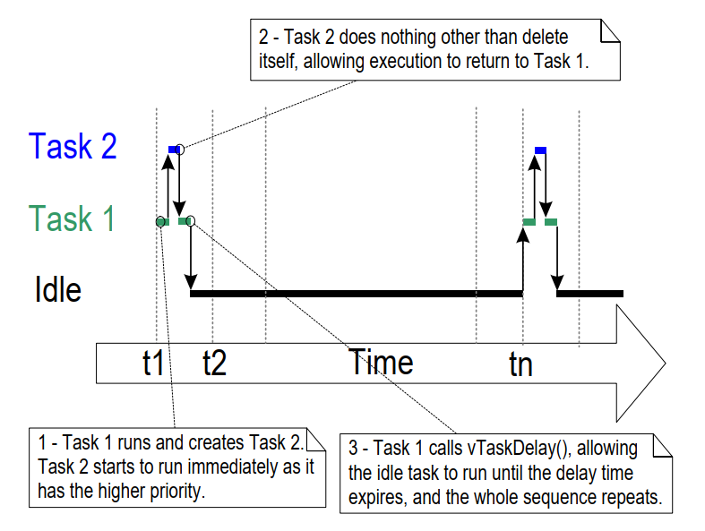

# 4 任务管理

## 4.1 引言

### 4.1.1 范围

本章涵盖以下内容：

- FreeRTOS如何为应用程序中的每个任务分配处理时间。
- FreeRTOS如何在任何给定时间选择应执行的任务。
- 每个任务的相对优先级如何影响系统行为。
- 任务可能存在的状态。

本章还讨论了以下内容：

- 如何实现任务。
- 如何创建一个或多个任务实例。
- 如何使用任务参数。
- 如何更改已创建任务的优先级。
- 如何删除任务。
- 如何使用任务实现周期性处理。（后续章节将介绍如何使用软件定时器实现相同的功能。）
- 空闲任务何时执行以及如何使用它。

本章介绍的概念是理解如何使用FreeRTOS以及FreeRTOS应用程序行为的基础。因此，这是本书中最详细的章节。

## 4.2 任务函数

任务以C函数的形式实现。任务必须实现如代码清单4.1所示的预期函数原型，该函数接受一个void指针参数并返回void。

<a name="list4.1" title="代码清单4.1 任务函数原型"></a>

```c
void vATaskFunction( void * pvParameters );
```

***代码清单4.1*** *任务函数原型*

每个任务本身都是一个小的程序。它有一个入口点，通常会在一个无限循环中永远运行，不会退出。代码清单4.2展示了一个典型任务的结构。

FreeRTOS任务绝不允许从其实现的函数中以任何方式返回。它不能包含`return`语句，也不能允许执行到其实现函数的末尾。如果任务不再需要，则应显式删除它，如代码清单4.2所示。

单个任务函数定义可用于创建任意数量的任务，其中每个创建的任务都是一个独立的执行实例。每个实例都有自己的栈，因此任务本身定义的任何自动（栈）变量都有自己的副本。

<a name="list4.2" title="代码清单4.2 典型任务函数的结构"></a>

```c
void vATaskFunction( void * pvParameters )
{
    /*
     * 栈分配的变量可以在函数内部正常声明。
     * 使用此示例函数创建的每个任务实例都将在任务栈上分配自己的lStackVariable实例。
     */
    long lStackVariable = 0;

    /*
     * 与栈分配的变量不同，使用`static`关键字声明的变量由链接器分配到内存中的特定位置。
     * 这意味着所有调用vATaskFunction的任务将共享同一个lStaticVariable实例。
     */
    static long lStaticVariable = 0;

    for( ;; )
    {
        /* 实现任务功能的代码将放在这里。 */
    }

    /*
     * 如果任务实现代码退出了上述循环，则必须在到达其实现函数的末尾之前删除该任务。
     * 当NULL作为参数传递给vTaskDelete() API函数时，表示要删除的任务是调用（当前）任务。
     */
    vTaskDelete( NULL );
}
```

***代码清单4.2*** *典型任务函数的结构*

## 4.3 顶层任务状态

一个应用程序可能包含多个任务。如果运行该应用程序的处理器是单核的，那么在任一时刻只能有一个任务在执行。这意味着任务可能处于以下两种状态之一：*运行中*和*未运行*。首先考虑这种简化的模型。本章后续部分将描述*未运行*状态的几个子状态。

当处理器正在执行某个任务的代码时，该任务处于*运行中*状态。当任务处于*未运行*状态时，任务会暂停，其状态会被保存，以便在调度器决定其应进入*运行中*状态时恢复执行。当任务恢复执行时，它将从离开*运行中*状态时即将执行的指令处继续执行。

<a name="fig4.1" title="图4.1 顶层任务状态及其转换"></a>

***

***图4.1*** *顶层任务状态及其转换*
***

任务从*未运行*状态转换到*运行中*状态被称为“切换入”或“交换入”。相反，任务从*运行中*状态转换到*未运行*状态被称为“切换出”或“交换出”。FreeRTOS调度器是唯一可以切换任务进出*运行中*状态的实体。

## 4.4 任务创建

有六个API函数可用于创建任务：
`xTaskCreate()`、
`xTaskCreateStatic()`、
`xTaskCreateRestricted()`、
`xTaskCreateRestrictedStatic()`、
`xTaskCreateAffinitySet()`和
`xTaskCreateStaticAffinitySet()`

每个任务需要两块RAM：一块用于存储其任务控制块（TCB），另一块用于存储其栈。名称中包含“Static”的FreeRTOS API函数使用作为参数传入的预分配RAM块。相反，名称中不包含“Static”的API函数在运行时从系统堆中动态分配所需的RAM。

某些FreeRTOS移植版本支持任务以“受限”或“非特权”模式运行。名称中包含“Restricted”的FreeRTOS API函数创建的任务在执行时对系统内存的访问受限。名称中不包含“Restricted”的API函数创建的任务以“特权模式”执行，并可以访问系统的整个内存映射。

支持对称多处理（SMP）的FreeRTOS移植版本允许不同的任务在同一CPU的多个核心上同时运行。对于这些移植版本，您可以使用名称中包含“Affinity”的函数指定任务将在哪个核心上运行。

FreeRTOS任务创建API函数相当复杂。本文档中的大多数示例使用`xTaskCreate()`，因为它是这些函数中最简单的一个。

### 4.4.1 xTaskCreate() API函数

代码清单4.3展示了`xTaskCreate()` API函数的原型。`xTaskCreateStatic()`有两个额外的参数，分别指向预分配的内存块，用于存储任务的数据结构和栈。[第2.5节：数据类型和编码风格指南](ch02.md#25-data-types-and-coding-style-guide)描述了所使用的数据类型和命名约定。

<a name="list4.3" title="代码清单4.3 xTaskCreate() API函数原型"></a>


```c
BaseType_t xTaskCreate( TaskFunction_t pvTaskCode,
                        const char * const pcName,
                        configSTACK_DEPTH_TYPE usStackDepth,
                        void * pvParameters,
                        UBaseType_t uxPriority,
                        TaskHandle_t * pxCreatedTask );
```

***代码清单4.3*** *xTaskCreate() API函数原型*

**xTaskCreate() 参数和返回值：**

- `pvTaskCode`

  任务实际上是一个永不退出的C函数，因此通常实现为一个无限循环。`pvTaskCode`参数是指向实现任务的函数的指针（实际上就是函数的名称）。

- `pcName`

  任务的描述性名称。FreeRTOS不会以任何方式使用该名称，它仅作为调试辅助工具包含在内。通过人类可读的名称来识别任务比通过其句柄识别要简单得多。

  应用程序定义的常量`configMAX_TASK_NAME_LEN`定义了任务名称的最大长度，包括NULL终止符。如果提供的字符串更长，则会被截断。

- `usStackDepth`

  指定为任务分配的栈的大小。使用`xTaskCreateStatic()`代替`xTaskCreate()`可以使用预分配的内存，而不是动态分配的内存。

  请注意，该值指定栈可以容纳的字数，而不是字节数。例如，如果栈宽度为32位，且`usStackDepth`为128，则`xTaskCreate()`会分配512字节的栈空间（128 * 4字节）。

  `configSTACK_DEPTH_TYPE`是一个宏，允许应用程序编写者指定用于存储栈大小的数据类型。如果未定义，`configSTACK_DEPTH_TYPE`默认为`uint16_t`，因此如果栈深度乘以栈宽度大于65535（最大的16位数），请在`FreeRTOSConfig.h`中#define `configSTACK_DEPTH_TYPE`为`unsigned long`或`size_t`。

  [第13.3节 栈溢出](ch13.md#133-stack-overflow)描述了选择最佳栈大小的实用方法。

- `pvParameters`

  实现任务的函数接受一个void指针（`void *`）参数。`pvParameters`是使用该参数传递给任务的值。

- `uxPriority`

  定义任务的优先级。0是最低优先级，`(configMAX_PRIORITIES – 1)`是最高优先级。[第4.5节](#45-task-priorities)描述了用户定义的`configMAX_PRIORITIES`常量。

  如果定义的`uxPriority`大于`(configMAX_PRIORITIES – 1)`，它将被限制为`(configMAX_PRIORITIES – 1)`。

- `pxCreatedTask`

  指向存储创建任务句柄的位置的指针。该句柄可用于未来的API调用，例如更改任务的优先级或删除任务。

  `pxCreatedTask`是一个可选参数，如果不需要任务的句柄，可以设置为NULL。

- 返回值

  有两种可能的返回值：

  - `pdPASS`

    表示任务创建成功。

  - `pdFAIL`

    表示没有足够的堆内存来创建任务。[第3章](ch03.md#3-heap-memory-management)提供了关于堆内存管理的更多信息。


<a name="example4.1" title="示例4.1 创建任务"></a>
---
***示例4.1*** *创建任务*

---

以下示例演示了创建两个简单任务并启动新创建任务所需的步骤。这些任务通过使用简单的忙循环来创建周期延迟，定期打印出一个字符串。这两个任务以相同的优先级创建，除了打印的字符串不同外，其他完全相同——参见代码清单4.4和代码清单4.5中它们各自的实现。关于在任务中使用`printf()`的警告，请参见第8章。

<a name="list4.4" title="代码清单4.4 示例4.1中第一个任务的实现"></a>


```c
void vTask1( void * pvParameters )
{
    /* ulCount被声明为volatile以确保它不会被优化掉。 */
    volatile unsigned long ulCount;

    for( ;; )
    {
        /* 打印出当前任务的名称。 */
        vPrintLine( "Task 1 is running" );

        /* 延迟一段时间。 */
        for( ulCount = 0; ulCount < mainDELAY_LOOP_COUNT; ulCount++ )
        {
            /*
             * 这个循环只是一个非常简单的延迟实现。
             * 这里没有其他操作。后面的示例将用适当的延迟/睡眠函数替换这个简单的循环。
             */
        }
    }
}
```

***代码清单4.4*** *示例4.1中第一个任务的实现*


<a name="list4.5" title="代码清单4.5 示例4.1中第二个任务的实现"></a>


```c
void vTask2( void * pvParameters )
{
    /* ulCount被声明为volatile以确保它不会被优化掉。 */
    volatile unsigned long ulCount;

    /* 像大多数任务一样，这个任务在一个无限循环中实现。 */
    for( ;; )
    {
        /* 打印出这个任务的名称。 */
        vPrintLine( "Task 2 is running" );

        /* 延迟一段时间。 */
        for( ulCount = 0; ulCount < mainDELAY_LOOP_COUNT; ulCount++ )
        {
            /*
             * 这个循环只是一个非常简单的延迟实现。
             * 这里没有其他操作。后面的示例将用适当的延迟/睡眠函数替换这个简单的循环。
             */
        }
    }
}
```

***代码清单4.5*** *示例4.1中第二个任务的实现*

main()函数在启动调度器之前创建任务——参见代码清单4.6中的实现。


<a name="list4.6" title="代码清单4.6 启动示例4.1中的任务"></a>


```c
int main( void )
{
    /*
     * 这里声明的变量在启动FreeRTOS调度器后可能不再存在。
     * 不要尝试从任务中访问在main()使用的栈上声明的变量。
     */

    /*
     * 创建两个任务中的一个。请注意，实际应用程序应检查xTaskCreate()调用的返回值，
     * 以确保任务创建成功。
     */
    xTaskCreate( vTask1,  /* 指向实现任务的函数的指针。 */
                 "Task 1",/* 任务的文本名称。 */
                 1000,    /* 栈深度（以字为单位）。 */
                 NULL,    /* 本示例未使用任务参数。 */
                 1,       /* 此任务将以优先级1运行。 */
                 NULL );  /* 本示例未使用任务句柄。 */

    /* 以完全相同的方式和相同的优先级创建另一个任务。 */
    xTaskCreate( vTask2, "Task 2", 1000, NULL, 1, NULL );

    /* 启动调度器以使任务开始执行。 */
    vTaskStartScheduler();

    /*
     * 如果一切正常，main()不会到达这里，因为调度器现在将运行创建的任务。
     * 如果main()确实到达了这里，则表示没有足够的堆内存来创建空闲任务或定时器任务
     * （本书后面会介绍）。第3章提供了关于堆内存管理的更多信息。
     */
    for( ;; );
}
```

***代码清单4.6*** *启动示例4.1中的任务*

执行该示例会产生如图4.2所示的输出。

<a name="fig4.2" title="图4.2 执行示例4.1时产生的输出"></a>

***

```console
C:\Temp>rtosdemo
Task 1 is running
Task 2 is running
Task 1 is running
Task 2 is running
Task 1 is running
Task 2 is running
Task 1 is running
Task 2 is running
Task 1 is running
Task 2 is running
Task 1 is running
Task 2 is running
Task 1 is running
Task 2 is running
```

***图4.2*** *执行示例4.1时产生的输出[^4]*

***

[^4]: 屏幕截图显示每个任务在下一次任务执行前恰好打印一次其消息。这是使用FreeRTOS Windows模拟器产生的人工场景。Windows模拟器并非真正的实时系统。此外，向Windows控制台写入需要相对较长的时间，并会导致一系列Windows系统调用。在具有快速且非阻塞打印功能的真实嵌入式目标上执行相同的代码，可能会导致每个任务在被切换到另一个任务之前多次打印其字符串。

图4.2显示两个任务似乎是同时执行的；然而，这两个任务在同一处理器核心上运行，因此不可能是这样。实际上，两个任务都在快速进入和退出*运行*状态。两个任务以相同的优先级运行，因此在同一处理器核心上共享时间。图4.3显示了它们实际的执行模式。

图4.3底部的箭头表示时间从t1开始流逝。彩色线条表示每个时间点正在执行的任务——例如，任务1在t1到t2之间执行。

任何时候只能有一个任务处于*运行*状态。因此，当一个任务进入*运行*状态（任务被切换进来）时，另一个任务进入*非运行*状态（任务被切换出去）。


<a name="fig4.3" title="图4.3 示例4.1中两个任务的实际执行模式"></a>

***

***图4.3*** *示例4.1中两个任务的实际执行模式*
***

示例4.1在启动调度器之前从`main()`中创建了两个任务。也可以从另一个任务中创建任务。例如，任务2可以从任务1中创建，如代码清单4.7所示。


<a name="list4.7" title="代码清单4.7 在调度器启动后从另一个任务中创建任务"></a>


```c
void vTask1( void * pvParameters )
{
    const char *pcTaskName = "Task 1 is running\r\n";
    volatile unsigned long ul; /* volatile确保ul不会被优化掉。 */

    /*
     * 如果此任务代码正在执行，则调度器必须已经启动。
     * 在进入无限循环之前创建另一个任务。
     */
    xTaskCreate( vTask2, "Task 2", 1000, NULL, 1, NULL );

    for( ;; )
    {
        /* 打印出此任务的名称。 */
        vPrintLine( pcTaskName );

        /* 延迟一段时间。 */
        for( ul = 0; ul < mainDELAY_LOOP_COUNT; ul++ )
        {
            /*
             * 这个循环只是一个非常简单的延迟实现。
             * 这里没有其他操作。后面的示例将用适当的延迟/睡眠函数替换这个简单的循环。
             */
        }
    }
}
```

***代码清单4.7*** *在调度器启动后从另一个任务中创建任务*

<a name="example4.2" title="示例4.2 使用任务参数"></a>
---
***示例4.2*** *使用任务参数*

---

示例4.1中创建的两个任务几乎完全相同，它们之间的唯一区别是打印的文本字符串。如果创建单个任务实现的两个实例，并使用任务参数将字符串传递给每个实例，则可以消除这种重复。

示例4.2将示例4.1中使用的两个任务函数替换为名为`vTaskFunction()`的单个任务函数，如代码清单4.8所示。请注意任务参数如何被强制转换为`char *`以获取任务应打印的字符串。


<a name="list4.8" title="代码清单4.8 用于在示例4.2中创建两个任务的单个任务函数"></a>

```c
void vTaskFunction( void * pvParameters )
{

    char *pcTaskName;
    volatile unsigned long ul; /* volatile确保ul不会被优化掉。 */

    /*
     * 要打印的字符串通过参数传入。将其强制转换为字符指针。
     */
    pcTaskName = ( char * ) pvParameters;

    /* 与大多数任务一样，此任务在无限循环中实现。 */
    for( ;; )
    {
        /* 打印出此任务的名称。 */
        vPrintLine( pcTaskName );

        /* 延迟一段时间。 */
        for( ul = 0; ul < mainDELAY_LOOP_COUNT; ul++ )
        {
            /*
             * 这个循环只是一个非常简单的延迟实现。
             * 这里没有其他操作。后面的练习将用适当的延迟/睡眠函数替换这个简单的循环。
             */
        }
    }
}
```

***代码清单4.8*** *用于在示例4.2中创建两个任务的单个任务函数*

代码清单4.9创建了`vTaskFunction()`实现的任务的两个实例，使用任务参数将不同的字符串传递给每个实例。两个任务在FreeRTOS调度器的控制下独立执行，并拥有自己的栈，因此拥有自己的`pcTaskName`和`ul`变量的副本。


<a name="list4.9" title="代码清单4.9 示例2的main()函数"></a>


```c
/*
 * 定义将作为任务参数传递的字符串。这些字符串定义为const且不在main()使用的栈上，
 * 以确保任务执行时它们仍然有效。
 */
static const char * pcTextForTask1 = "Task 1 is running";
static const char * pcTextForTask2 = "Task 2 is running";

int main( void )
{
    /*
     * 此处声明的变量在启动FreeRTOS调度器后可能不再存在。
     * 不要尝试从任务中访问在main()使用的栈上声明的变量。
     */

    /* 创建第一个任务。 */
    xTaskCreate( vTaskFunction,             /* 指向实现任务的函数的指针。 */
                 "Task 1",                  /* 任务的文本名称。这仅用于调试。 */
                 1000,                      /* 栈深度 - 小型微控制器使用的栈将远小于此。*/
                 ( void * ) pcTextForTask1, /* 使用任务参数将要打印的文本传递给任务。 */
                 1,                         /* 此任务将以优先级1运行。 */
                 NULL );                    /* 本例中未使用任务句柄。 */

    /*
     * 以完全相同的方式创建另一个任务。注意这次是从同一个任务实现（vTaskFunction）
     * 创建多个任务。只有参数中传递的值不同。正在创建同一任务定义的两个实例。
     */
    xTaskCreate( vTaskFunction,
                 "Task 2",
                 1000,
                 ( void * ) pcTextForTask2,
                 1,
                 NULL );

    /* 启动调度器以便任务开始执行。 */
    vTaskStartScheduler();

    /*
     * 如果一切正常，main()不会到达这里，因为调度器现在将运行创建的任务。
     * 如果main()确实到达这里，则表示没有足够的堆内存来创建空闲任务或定时器任务
     * （本书后面会描述）。第3章提供了有关堆内存管理的更多信息。
     */
    for( ;; )
    {
    }
}
```

***代码清单4.9*** *示例2的main()函数*


示例4.2的输出与图4.2中示例1的输出完全相同。

## 4.5 任务优先级

FreeRTOS调度器始终确保能够运行的最高优先级任务被选中进入*运行*状态。具有相同优先级的任务将轮流进入和退出*运行*状态。

用于创建任务的API函数的`uxPriority`参数为任务提供了初始优先级。`vTaskPrioritySet()` API函数可以在任务创建后更改其优先级。

应用程序定义的`configMAX_PRIORITIES`编译时配置常量设置了可用优先级的数量。低数值优先级表示低优先级任务，优先级0为最低优先级——因此有效优先级范围为0到`(configMAX_PRIORITIES – 1)`。任意数量的任务可以共享相同的优先级。

FreeRTOS调度器有两种实现算法，用于选择*运行*状态任务，并且`configMAX_PRIORITIES`的最大允许值取决于所使用的实现：

### 4.5.1 通用调度器

通用调度器用C语言编写，可用于所有FreeRTOS架构移植。它不对`configMAX_PRIORITIES`施加上限。通常，建议尽量减少`configMAX_PRIORITIES`，因为更多的值需要更多的RAM，并且会导致最坏情况下的执行时间更长。

### 4.5.2 架构优化调度器

架构优化的实现是用特定架构的汇编代码编写的，比通用C实现性能更高，并且对于所有`configMAX_PRIORITIES`值，最坏情况下的执行时间相同。

架构优化实现对`configMAX_PRIORITIES`施加了最大值，在32位架构上为32，在64位架构上为64。与通用方法一样，建议将`configMAX_PRIORITIES`保持在最低实用值，因为更高的值需要更多的RAM。

在FreeRTOSConfig.h中将`configUSE_PORT_optimized_TASK_SELECTION`设置为1以使用架构优化实现，或设置为0以使用通用实现。并非所有FreeRTOS移植都有架构优化实现。对于那些有的移植，如果`configUSE_PORT_optimized_TASK_SELECTION`未定义，则默认值为1。对于那些没有的移植，如果未定义，则默认值为0。

## 4.6 时间测量和滴答中断

[4.12节，调度算法](#412-scheduling-algorithms)描述了一个称为“时间片”的可选功能。时间片在到目前为止的示例中被使用，并且是它们在输出中观察到的行为。在示例中，两个任务以相同的优先级创建，并且两个任务始终能够运行。因此，每个任务执行一个“时间片”，在时间片开始时进入*运行*状态，在时间片结束时退出*运行*状态。在图4.3中，t1和t2之间的时间等于单个时间片。

调度器在每个时间片结束时执行，以选择下一个要运行的任务[^5]。为此使用了一个称为“滴答中断”的周期性中断。`configTICK_RATE_HZ`编译时配置常量设置了滴答中断的频率，因此也设置了每个时间片的长度。例如，将`configTICK_RATE_HZ`设置为100（Hz）会导致每个时间片持续10毫秒。两个滴答中断之间的时间称为“滴答周期”——因此一个时间片等于一个滴答周期。

[^5]: 需要注意的是，时间片的结束并不是调度器选择新任务运行的唯一时机。正如我们将在本书中展示的那样，当当前执行的任务进入*阻塞*状态时，或者当中断将更高优先级的任务移动到*就绪*状态时，调度器也会立即选择新任务运行。

图4.4在图4.3的基础上扩展，展示了调度器的执行。在图4.4中，顶部的线显示调度器的执行时间，细箭头显示了从任务到滴答中断，然后从滴答中断返回到不同任务的执行顺序。

`configTICK_RATE_HZ`的最佳值取决于应用程序，尽管100是一个典型值。


<a name="fig4.4" title="图4.4 扩展的执行顺序，显示滴答中断的执行"></a>

***

***图4.4*** *扩展的执行顺序，显示滴答中断的执行*
***

FreeRTOS API调用以滴答周期的倍数指定时间，通常简称为“滴答”。`pdMS_TO_TICKS()`宏将指定的毫秒时间转换为指定的滴答时间。可用的分辨率取决于定义的滴答频率，如果滴答频率高于1KHz（即`configTICK_RATE_HZ`大于1000），则不能使用`pdMS_TO_TICKS()`。清单4.10展示了如何使用`pdMS_TO_TICKS()`将指定的200毫秒时间转换为等效的滴答时间。


<a name="list4.10" title="清单4.10 使用pdMS\_TO\_TICKS()宏将200毫秒转换为等效的滴答时间"></a>

```c
/*
 * pdMS_TO_TICKS()以毫秒时间为唯一参数，并评估为等效的滴答周期时间。此示例显示了
 * xTimeInTicks被设置为与200毫秒等效的滴答周期数。
 */
TickType_t xTimeInTicks = pdMS_TO_TICKS( 200 );
```

***清单4.10*** *使用pdMS\_TO\_TICKS()宏将200毫秒转换为等效的滴答时间*

使用`pdMS_TO_TICKS()`以毫秒为单位指定时间，而不是直接以滴答为单位，确保应用程序中指定的时间在滴答频率更改时不会改变。

“滴答计数”是自调度器启动以来发生的滴答中断总数，假设滴答计数未溢出。用户应用程序在指定延迟时间时不必考虑溢出，因为FreeRTOS在内部管理时间一致性。

[4.12节：调度算法](#412-scheduling-algorithms)描述了影响调度器选择新任务运行和滴答中断执行时的配置常量。

<a name="example4.3" title="示例4.3 优先级实验"></a>
---
***示例4.3*** *优先级实验*

---

调度器始终确保能够运行的最高优先级任务被选中进入*运行*状态。到目前为止的示例中创建了两个具有相同优先级的任务，因此它们轮流进入和退出*运行*状态。本示例将探讨当任务具有不同优先级时会发生什么情况。清单4.11展示了用于创建任务的代码，第一个任务的优先级为1，第二个任务的优先级为2。实现这两个任务的单个函数没有改变；它仍然定期打印字符串，并使用空循环创建延迟。

<a name="list4.11" title="清单4.11 创建两个不同优先级的任务"></a>


```c
/*
 * 定义将作为任务参数传递的字符串。
 * 这些字符串定义为const且不在栈上，以确保任务执行时它们仍然有效。
 */
static const char * pcTextForTask1 = "Task 1 is running";
static const char * pcTextForTask2 = "Task 2 is running";

int main( void )
{
    /* 创建第一个任务，优先级为1。 */
    xTaskCreate( vTaskFunction,             /* 任务函数    */
                 "Task 1",                  /* 任务名称    */
                 1000,                      /* 任务栈深度  */
                 ( void * ) pcTextForTask1, /* 任务参数    */
                 1,                         /* 任务优先级  */
                 NULL );

    /* 创建第二个任务，优先级为2。 */
    xTaskCreate( vTaskFunction,             /* 任务函数    */
                 "Task 2",                  /* 任务名称    */
                 1000,                      /* 任务栈深度  */
                 ( void * ) pcTextForTask2, /* 任务参数    */
                 2,                         /* 任务优先级  */
                 NULL );

    /* 启动调度器，使任务开始执行。 */
    vTaskStartScheduler();

    /* 不会到达这里。 */
    return 0;
}
```

***清单4.11*** *创建两个不同优先级的任务*

图4.5显示了示例4.3的输出。

调度器始终选择能够运行的最高优先级任务。任务2的优先级高于任务1，并且始终能够运行；因此，调度器始终选择任务2，而任务1永远不会执行。可以说任务1被任务2“饿死”了处理时间——它无法打印其字符串，因为它从未进入*运行*状态。


<a name="fig4.5" title="图4.5 以不同优先级运行两个任务"></a>

***
```console
C:\Temp>rtosdemo
Task 2 is running
Task 2 is running
Task 2 is running
Task 2 is running
Task 2 is running
Task 2 is running
Task 2 is running
Task 2 is running
Task 2 is running
Task 2 is running
Task 2 is running
Task 2 is running
Task 2 is running
Task 2 is running
Task 2 is running
```

***图4.5*** *以不同优先级运行两个任务*
***

任务2始终能够运行，因为它从不需要等待任何东西——它要么在空循环中循环，要么向终端打印。


<a name="fig4.6" title="图4.6 当一个任务的优先级高于另一个任务时的执行模式"></a>

***

***图4.6*** *当一个任务的优先级高于另一个任务时的执行模式（来自示例4.3）*


## 4.7 扩展*非运行*状态

到目前为止，创建的任务始终有处理工作要执行，并且从不需要等待任何东西——由于它们从不需要等待任何东西，它们始终能够进入*运行*状态。这种“连续处理”任务的作用有限，因为它们只能在最低优先级下创建。如果它们以任何其他优先级运行，它们将阻止所有较低优先级的任务运行。

为了使这些任务有用，必须将它们重写为事件驱动的任务。事件驱动的任务只有在事件触发后才有工作（处理）要执行，并且在此之前不能进入*运行*状态。调度器始终选择能够运行的最高优先级任务。如果高优先级任务由于等待事件而无法被选择，调度器必须转而选择能够运行的较低优先级任务。因此，编写事件驱动的任务意味着可以在不同优先级下创建任务，而不会让最高优先级任务饿死所有较低优先级任务的处理时间。

### 4.7.1 *阻塞*状态

等待事件的任务被称为处于“阻塞”状态，这是*非运行*状态的一个子状态。

任务可以进入*阻塞*状态以等待两种不同类型的事件：

1. **时间相关事件**——这些事件在延迟时间到期或达到绝对时间时发生。例如，任务可能进入*阻塞*状态以等待10毫秒的时间过去。

2. **同步事件**——这些事件源自另一个任务或中断。例如，任务可能进入*阻塞*状态以等待数据到达队列。同步事件涵盖了广泛的事件类型。

FreeRTOS中的队列、二进制信号量、计数信号量、互斥锁、递归互斥锁、事件组、流缓冲区、消息缓冲区和直接任务通知都可以创建同步事件。后续章节将介绍这些特性中的大部分。

任务可以在同步事件上阻塞并设置超时，从而有效地同时阻塞在两种类型的事件上。例如，任务可以选择最多等待10毫秒以等待数据到达队列。如果数据在10毫秒内到达，或者10毫秒过去后数据仍未到达，任务将离开*阻塞*状态。

### 4.7.2 *挂起*状态

*挂起*状态也是*非运行*状态的一个子状态。处于挂起状态的任务对调度器不可用。进入挂起状态的唯一方法是调用`vTaskSuspend()` API函数，而退出的唯一方法是调用`vTaskResume()`或`xTaskResumeFromISR()` API函数。大多数应用程序不使用挂起状态。

### 4.7.3 *就绪*状态

处于*非运行*状态且未被*阻塞*或*挂起*的任务被称为处于*就绪*状态。它们可以运行，因此“准备”运行，但当前未处于*运行*状态。

### 4.7.4 完善状态转换图

图4.7在简化状态图的基础上扩展，包含了本节描述的所有*非运行*子状态。到目前为止，示例中创建的任务尚未使用*阻塞*或*挂起*状态。它们仅在*就绪*状态和*运行*状态之间转换，如图4.7中的粗线所示。


<a name="fig4.7" title="图4.7 完整的任务状态机"></a>

***

***图4.7*** *完整的任务状态机*
***

<a name="example4.4" title="示例4.4 使用阻塞状态创建延迟"></a>
---
***示例4.4*** *使用*阻塞*状态创建延迟</i></h3>

---

到目前为止，示例中创建的所有任务都是“周期性的”——它们延迟一段时间，然后打印出它们的字符串，再延迟一次，依此类推。延迟是通过一个空循环非常粗略地生成的——任务轮询一个递增的循环计数器，直到它达到一个固定值。示例4.3清楚地展示了这种方法的缺点。高优先级任务在执行空循环时保持在*运行*状态，“饿死”了低优先级任务的所有处理时间。

任何形式的轮询都有一些其他缺点，尤其是它的低效性。在轮询期间，任务实际上没有任何工作需要完成，但它仍然占用最大的处理时间，从而浪费处理器周期。示例4.4通过用`vTaskDelay()` API函数调用替换轮询空循环来纠正这种行为，其原型如代码清单4.12所示。新的任务定义如代码清单4.13所示。请注意，`vTaskDelay()` API函数仅在FreeRTOSConfig.h中将`INCLUDE_vTaskDelay`设置为1时可用。

`vTaskDelay()`将调用任务置于*阻塞*状态，持续固定数量的时钟中断。任务在*阻塞*状态下不会使用任何处理时间，因此任务只在实际有工作要做时才会占用处理时间。


<a name="list4.12" title="代码清单4.12 vTaskDelay() API函数原型"></a>


```c
void vTaskDelay( TickType_t xTicksToDelay );
```

***代码清单4.12*** *vTaskDelay() API函数原型*

**vTaskDelay参数：**

- `xTicksToDelay`

  调用任务在*阻塞*状态下保持的时钟中断次数，之后任务将转换回*就绪*状态。

  例如，如果一个任务在时钟计数为10,000时调用`vTaskDelay( 100 )`，那么它将立即进入*阻塞*状态，并保持在*阻塞*状态，直到时钟计数达到10,100。

  宏`pdMS_TO_TICKS()`可用于将以毫秒为单位的时间转换为以时钟滴答为单位的时间。例如，调用`vTaskDelay( pdMS_TO_TICKS( 100 ) )`将使调用任务保持在*阻塞*状态100毫秒。


<a name="list4.13" title="代码清单4.13 替换空循环延迟为vTaskDelay调用后的示例任务源代码"></a>


```c
void vTaskFunction( void * pvParameters )
{
    char * pcTaskName;
    const TickType_t xDelay250ms = pdMS_TO_TICKS( 250 );

    /*
     * 要打印的字符串通过参数传入。将其强制转换为字符指针。
     */
    pcTaskName = ( char * ) pvParameters;

    /* 与大多数任务一样，此任务在一个无限循环中实现。 */
    for( ;; )
    {
        /* 打印此任务的名称。 */
        vPrintLine( pcTaskName );

        /*
         * 延迟一段时间。这次使用了vTaskDelay()调用，它将任务置于阻塞状态，直到延迟时间到期。
         * 参数采用以“时钟滴答”为单位的时间，并且使用了pdMS_TO_TICKS()宏（在声明xDelay250ms常量时）
         * 将250毫秒转换为等效的时钟滴答数。
         */
        vTaskDelay( xDelay250ms );
    }
}
```

***代码清单4.13*** *替换空循环延迟为vTaskDelay调用后的示例任务源代码*

尽管这两个任务仍然以不同的优先级创建，但现在它们都会运行。图4.8中显示的示例4.4的输出证实了预期的行为。

<a name="fig4.8" title="图4.8 执行示例4.4时产生的输出"></a>

***

```console
C:\Temp>rtosdemo
Task 2 is running
Task 1 is running
Task 2 is running
Task 1 is running
Task 2 is running
Task 1 is running
Task 2 is running
Task 1 is running
Task 2 is running
Task 1 is running
Task 2 is running
Task 1 is running
Task 2 is running
Task 1 is running
Task 2 is running
Task 1 is running
```

***图4.8*** *执行示例4.4时产生的输出*
***

图4.9中显示的执行顺序解释了为什么即使两个任务以不同的优先级创建，它们仍然都能运行。为了简化，调度器本身的执行过程被省略。

当调度器启动时，空闲任务会自动创建，以确保始终至少有一个任务可以运行（即至少有一个任务处于*就绪*状态）。[4.8节：空闲任务和空闲任务钩子](#48-the-idle-task-and-the-idle-task-hook)将更详细地描述空闲任务。


<a name="fig4.9" title="图4.9 任务使用vTaskDelay()替换空循环时的执行顺序"></a>

***

***图4.9*** *任务使用vTaskDelay()替换空循环时的执行顺序*
***

只有两个任务的实现方式发生了变化，其功能并未改变。将图4.9与图4.4进行比较，可以清楚地看出，这种功能以一种更加高效的方式实现。

图4.4显示了任务使用空循环创建延迟时的执行模式，因此它们总是能够运行。结果，它们占用了所有可用的处理器时间。图4.9显示了任务在其整个延迟期间进入*阻塞*状态时的执行模式。它们只在实际需要完成工作时（在本例中仅需打印一条消息）才会占用处理器时间，因此只使用了可用处理时间的一小部分。

在图4.9所示的场景中，每次任务离开*阻塞*状态后，它们会执行一小部分时钟周期，然后重新进入阻塞状态。大多数时候，没有可以运行的应用程序任务（即没有应用程序任务处于*就绪*状态），因此也没有应用程序任务可以被选择进入*运行*状态。在这种情况下，空闲任务会运行。分配给空闲任务的处理时间是系统空闲处理能力的衡量标准。使用RTOS可以显著增加空闲处理能力，只需允许应用程序完全由事件驱动即可。

图4.10中的粗线显示了示例4.4中任务执行的状态转换，每个任务现在都会通过*阻塞*状态，然后返回到*就绪*状态。


<a name="fig4.10" title="图4.10 粗线表示示例4.4中任务执行的状态转换"></a>

***

***图4.10*** *粗线表示示例4.4中任务执行的状态转换*
***


### 4.7.5 vTaskDelayUntil() API 函数

`vTaskDelayUntil()` 与 `vTaskDelay()` 类似。如刚才所演示的，`vTaskDelay()` 的参数指定了任务调用 `vTaskDelay()` 后到该任务再次从*阻塞*状态转换出去之间应该发生的时钟中断次数。任务在阻塞状态停留的时间由 `vTaskDelay()` 参数指定，但任务离开阻塞状态的时间是相对于调用 `vTaskDelay()` 的时间而言的。

而 `vTaskDelayUntil()` 的参数则指定了调用任务应从阻塞状态转移到*就绪*状态的精确时钟计数值。当需要固定执行周期时（即希望任务以固定频率周期性执行），应使用 `vTaskDelayUntil()`，因为调用任务解除阻塞的时间是绝对的，而不是相对于函数调用时间的（如 `vTaskDelay()` 的情况）。


<a name="list4.14" title="代码清单4.14 vTaskDelayUntil() API函数原型"></a>

```c
void vTaskDelayUntil( TickType_t * pxPreviousWakeTime,
                      TickType_t xTimeIncrement );
```

***代码清单4.14*** *vTaskDelayUntil() API函数原型*

**vTaskDelayUntil() 参数**

- `pxPreviousWakeTime`

  该参数的命名基于 `vTaskDelayUntil()` 被用于实现一个以固定频率周期性执行的任务的假设。在这种情况下，`pxPreviousWakeTime` 保存了任务上次离开*阻塞*状态（被“唤醒”）的时间。该时间被用作计算任务下次应离开*阻塞*状态的参考点。

  `pxPreviousWakeTime` 所指向的变量会在 `vTaskDelayUntil()` 函数中自动更新；通常不会由应用程序代码修改，但在首次使用前必须初始化为当前的时钟计数值。代码清单4.15演示了如何初始化该变量。

- `xTimeIncrement`

  该参数的命名也基于 `vTaskDelayUntil()` 被用于实现一个以固定频率周期性执行的任务的假设，其频率由 `xTimeIncrement` 值设定。

  `xTimeIncrement` 以“时钟周期”为单位指定。宏 `pdMS_TO_TICKS()` 可用于将以毫秒为单位的时间转换为以时钟周期为单位的时间。

<a name="example4.5" title="示例4.5 将示例任务转换为使用vTaskDelayUntil()"></a>
---
***示例4.5*** *将示例任务转换为使用vTaskDelayUntil()*

---

示例4.4中创建的两个任务是周期性任务，但使用 `vTaskDelay()` 并不能保证它们运行的频率是固定的，因为任务离开*阻塞*状态的时间是相对于它们调用 `vTaskDelay()` 的时间而言的。将任务转换为使用 `vTaskDelayUntil()` 而不是 `vTaskDelay()` 可以解决这个潜在问题。

<a name="list4.15" title="代码清单4.15 使用vTaskDelayUntil()的示例任务实现"></a>


```c
void vTaskFunction( void * pvParameters )
{
    char * pcTaskName;
    TickType_t xLastWakeTime;

    /*
     * 要打印的字符串通过参数传入。将其转换为字符指针。
     */
    pcTaskName = ( char * ) pvParameters;

    /*
     * xLastWakeTime变量需要用当前的时钟计数值进行初始化。注意这是唯一一次显式写入该变量。
     * 之后xLastWakeTime会在vTaskDelayUntil()中自动更新。
     */
    xLastWakeTime = xTaskGetTickCount();

    /* 和大多数任务一样，此任务在无限循环中实现。 */
    for( ;; )
    {
        /* 打印此任务的名称。 */
        vPrintLine( pcTaskName );

        /*
         * 此任务应每250毫秒精确执行一次。与vTaskDelay()函数一样，时间以时钟周期为单位测量，
         * 并使用pdMS_TO_TICKS()宏将毫秒转换为时钟周期。xLastWakeTime会在vTaskDelayUntil()中自动更新，
         * 因此任务不会显式更新它。
         */
        vTaskDelayUntil( &xLastWakeTime, pdMS_TO_TICKS( 250 ) );
    }
}
```

***代码清单4.15*** *使用vTaskDelayUntil()的示例任务实现*

示例4.5的输出与图4.8中所示的示例4.4完全相同。

<a name="example4.6" title="示例4.6 结合阻塞和非阻塞任务"></a>
---
***示例4.6*** *结合阻塞和非阻塞任务*

---

之前的示例分别研究了轮询任务和阻塞任务的行为。本示例进一步强化了我们已经提到的关于预期系统行为的描述，并展示了当这两种方案结合时的执行顺序，如下所示：

1. 创建两个优先级为1的任务。这些任务除了连续打印字符串外什么都不做。

   这些任务从不调用可能导致它们进入*阻塞*状态的API函数，因此它们始终处于就绪或*运行*状态。这种性质的任务称为“连续处理”任务，因为它们始终有工作要做（尽管在此案例中是非常简单的工作）。
   代码清单4.16显示了连续处理任务的源代码。

1. 然后创建一个优先级为2的第三个任务，该优先级高于其他两个任务。第三个任务也仅打印字符串，但这次是周期性的，因此它使用`vTaskDelayUntil()` API函数在每次打印迭代之间将自己置于*阻塞*状态。

代码清单4.17显示了周期性任务的源代码。


<a name="list4.16" title="代码清单4.16 示例4.6中使用的连续处理任务"></a>


```c
void vContinuousProcessingTask( void * pvParameters )
{
    char * pcTaskName;

    /*
     * 要打印的字符串通过参数传入。将其转换为字符指针。
     */
    pcTaskName = ( char * ) pvParameters;

    /* 和大多数任务一样，此任务在无限循环中实现。 */
    for( ;; )
    {
        /*
         * 打印此任务的名称。此任务只是重复执行此操作，从不阻塞或延迟。
         */
        vPrintLine( pcTaskName );
    }
}
```

***代码清单4.16*** *示例4.6中使用的连续处理任务*


<a name="list4.17" title="代码清单4.17 示例4.6中使用的周期性任务"></a>


```c
void vPeriodicTask( void * pvParameters )
{
    TickType_t xLastWakeTime;

    const TickType_t xDelay3ms = pdMS_TO_TICKS( 3 );

    /*
     * xLastWakeTime变量需要用当前的时钟计数值进行初始化。注意这是唯一一次显式写入该变量。
     * 之后xLastWakeTime由vTaskDelayUntil() API函数自动管理。
     */
    xLastWakeTime = xTaskGetTickCount();

    /* 和大多数任务一样，此任务在无限循环中实现。 */
    for( ;; )
    {
        /* 打印此任务的名称。 */
        vPrintLine( "Periodic task is running" );

        /*
         * 此任务应每3毫秒精确执行一次——参见此函数中xDelay3ms的声明。
         */
        vTaskDelayUntil( &xLastWakeTime, xDelay3ms );
    }
}
```

***代码清单4.17*** *示例4.6中使用的周期性任务*

图4.11显示了示例4.6的输出，图4.12中的执行顺序解释了观察到的行为。

<a name="fig4.11" title="图4.11 示例4.6执行时的输出"></a>

***

```console
连续任务2运行
连续任务2运行
周期性任务运行
连续任务1运行
连续任务1运行
连续任务1运行
连续任务1运行
连续任务1运行
连续任务2运行
连续任务2运行
连续任务2运行
连续任务2运行
连续任务2运行
连续任务1运行
连续任务1运行
连续任务1运行
连续任务1运行
连续任务1运行
连续任务1运行
连续任务1运行
连续任务1运行
连续任务1运行
周期性任务运行
连续任务2运行
连续任务2运行
```

***图4.11*** *示例4.6执行时的输出*
***


<a name="fig4.12" title="图4.12 示例4.6的执行模式"></a>

***

***图4.12*** *示例4.6的执行模式*
***


## 4.8 空闲任务与空闲任务钩子函数

在示例4.4中创建的任务大部分时间都处于阻塞状态。在这种状态下，它们无法运行，因此不会被调度器选中。

必须始终至少有一个任务能够进入运行状态[^6]。为了确保这一点，调度器在调用`vTaskStartScheduler()`时自动创建一个空闲任务。空闲任务所做的仅仅是在一个循环中等待，因此，与第一个示例中的任务一样，它始终能够运行。

[^6]: 即使在使用FreeRTOS的特殊低功耗功能时也是如此，在这种情况下，如果应用程序创建的任务都无法执行，运行FreeRTOS的微控制器将进入低功耗模式。

空闲任务具有最低可能的优先级（优先级0），以确保它永远不会阻止更高优先级的应用程序任务进入*运行*状态。然而，如果应用程序设计者愿意，他们可以创建与空闲任务相同优先级的任务，从而与空闲任务共享优先级。`FreeRTOSConfig.h`中的编译时常量`configIDLE_SHOULD_YIELD`可用于防止空闲任务占用处理时间，这些时间可以更有效地分配给同样具有优先级0的应用程序任务。第4.12节“调度算法”中描述了`configIDLE_SHOULD_YIELD`。

以最低优先级运行确保空闲任务在更高优先级的任务进入就绪状态时立即从*运行*状态中切换出来。这可以在图4.9中的时间**tn**处看到，空闲任务立即被换出，以允许任务2在任务2离开*阻塞*状态的瞬间执行。可以说任务2抢占了空闲任务。抢占是自动发生的，且被抢占的任务并不知情。

> *注意：如果任务使用`vTaskDelete()` API函数删除自身，则必须确保空闲任务不会被剥夺处理时间。这是因为空闲任务负责清理被删除任务使用的内核资源。*

### 4.8.1 空闲任务钩子函数

可以通过使用空闲钩子（或空闲回调）函数将特定于应用程序的功能直接添加到空闲任务中。空闲钩子函数是一个在空闲任务循环的每次迭代中由空闲任务自动调用的函数。

空闲任务钩子的常见用途包括：

- 执行低优先级、后台或连续处理功能，而无需为此创建应用程序任务的内存开销。

- 测量剩余处理能力。（空闲任务仅在所有更高优先级的应用程序任务没有工作时运行；因此，测量分配给空闲任务的处理时间可以清晰地指示剩余处理时间。）

- 将处理器置于低功耗模式，提供一种简单且自动的方法，在没有应用程序处理要执行时节省电力（尽管实现的节电效果不如无嘀嗒空闲模式）。

### 4.8.2 空闲任务钩子函数实现的限制

空闲任务钩子函数必须遵守以下规则。

- 空闲任务钩子函数绝不能尝试阻塞或挂起自身。

  *注意：以任何方式阻塞空闲任务可能会导致没有任务能够进入*运行*状态的情况。*

- 如果应用程序任务使用`vTaskDelete()` API函数删除自身，则空闲任务钩子函数必须始终在合理的时间内返回到其调用者。这是因为空闲任务负责清理分配给已删除任务的内核资源。如果空闲任务永久停留在空闲钩子函数中，则无法进行此清理。

空闲任务钩子函数必须具有如代码清单4.18所示的名称和原型。

<a name="list4.18" title="代码清单4.18 空闲任务钩子函数的名称和原型"></a>

```c
void vApplicationIdleHook( void );
```

***代码清单4.18*** *空闲任务钩子函数的名称和原型*

<a name="example4.7" title="示例4.7 定义一个空闲任务钩子函数"></a>
---
***示例4.7*** *定义一个空闲任务钩子函数</i></h3>

---

在示例4.4中使用阻塞的`vTaskDelay()` API调用创建了大量空闲时间，即由于两个应用程序任务都处于*阻塞*状态而使空闲任务执行的时间。示例4.7通过添加一个空闲钩子函数来利用这些空闲时间，其源代码如代码清单4.19所示。

<a name="list4.19" title="代码清单4.19 一个非常简单的空闲钩子函数"></a>

```c
/* 声明一个将由钩子函数递增的变量。  */
volatile unsigned long ulIdleCycleCount = 0UL;

/*
 * 空闲钩子函数必须命名为vApplicationIdleHook()，不接受参数，并返回void。
 */
void vApplicationIdleHook( void )
{
    /* 此钩子函数仅递增计数器。 */
    ulIdleCycleCount++;
}
```

***代码清单4.19*** *一个非常简单的空闲钩子函数*

为了调用空闲钩子函数，必须在FreeRTOSConfig.h中将`configUSE_IDLE_HOOK`设置为1。

创建任务的函数稍作修改，以打印出`ulIdleCycleCount`值，如代码清单4.20所示。

<a name="list4.20" title="代码清单4.20 示例任务的源代码现在打印出ulIdleCycleCount值"></a>

```c
void vTaskFunction( void * pvParameters )
{
    char * pcTaskName;
    const TickType_t xDelay250ms = pdMS_TO_TICKS( 250 );

    /*
     * 要打印的字符串通过参数传入。将其转换为字符指针。
     */
    pcTaskName = ( char * ) pvParameters;

    /* 与大多数任务一样，此任务在无限循环中实现。 */
    for( ;; )
    {
        /*
         * 打印出此任务的名称以及ulIdleCycleCount的递增次数。
         */
        vPrintLineAndNumber( pcTaskName, ulIdleCycleCount );

        /* 延迟250毫秒。 */
        vTaskDelay( xDelay250ms );
    }
}
```

***代码清单4.20*** *示例任务的源代码现在打印出ulIdleCycleCount值*

图4.13显示了示例4.7的输出。可以看出，空闲任务钩子函数在应用程序任务的每次迭代之间执行了大约400万次（迭代次数取决于硬件速度）。

<a name="fig4.13" title="图4.13 示例4.7执行时的输出"></a>

***

```console
C:\Temp>rtosdemo
任务2正在运行
ulIdleCycleCount = 0
任务1正在运行
ulIdleCycleCount = 0
任务2正在运行
ulIdleCycleCount = 3869504
任务1正在运行
ulIdleCycleCount = 3869504
任务2正在运行
ulIdleCycleCount = 8564623
任务1正在运行
ulIdleCycleCount = 8564623
任务2正在运行
ulIdleCycleCount = 13181489
任务1正在运行
ulIdleCycleCount = 13181489
任务2正在运行
ulIdleCycleCount = 17838406
任务1正在运行
ulIdleCycleCount = 17838406
任务2正在运行
```

***图4.13*** *示例4.7执行时的输出*
***


## 4.9 更改任务优先级

### 4.9.1 vTaskPrioritySet() API函数

`vTaskPrioritySet()` API函数用于在调度器启动后更改任务的优先级。`vTaskPrioritySet()` API函数仅在FreeRTOSConfig.h中将`INCLUDE_vTaskPrioritySet`设置为1时可用。

<a name="list4.21" title="代码清单4.21 vTaskPrioritySet() API函数原型"></a>

```c
void vTaskPrioritySet( TaskHandle_t xTask,
                       UBaseType_t uxNewPriority );
```

***代码清单4.21*** *vTaskPrioritySet() API函数原型*

**vTaskPrioritySet() 参数**

- `pxTask`

  要修改优先级的任务的句柄（目标任务）。有关如何获取任务句柄的信息，请参阅`xTaskCreate()` API函数的`pxCreatedTask`参数，或`xTaskCreateStatic()` API函数的返回值。

  任务可以通过传递NULL来代替有效的任务句柄来更改自身的优先级。

- `uxNewPriority`

  目标任务要设置的新优先级。该值会自动被限制为最大可用优先级`(configMAX_PRIORITIES – 1)`，其中`configMAX_PRIORITIES`是在FreeRTOSConfig.h头文件中设置的编译时常量。

### 4.9.2 uxTaskPriorityGet() API函数

`uxTaskPriorityGet()` API函数用于获取任务的优先级。`uxTaskPriorityGet()` API函数仅在FreeRTOSConfig.h中将`INCLUDE_uxTaskPriorityGet`设置为1时可用。

<a name="list4.22" title="代码清单4.22 uxTaskPriorityGet() API函数原型"></a>

```c
UBaseType_t uxTaskPriorityGet( TaskHandle_t xTask );
```

***代码清单4.22*** *uxTaskPriorityGet() API函数原型*

**uxTaskPriorityGet() 参数和返回值**

- `pxTask`

  要查询优先级的任务的句柄（目标任务）。有关如何获取任务句柄的信息，请参阅`xTaskCreate()` API函数的`pxCreatedTask`参数，或`xTaskCreateStatic()` API函数的返回值。

  任务可以通过传递NULL来代替有效的任务句柄来查询自身的优先级。

- 返回值

  当前分配给被查询任务的优先级。

<a name="example4.8" title="示例4.8 更改任务优先级"></a>
---
***示例4.8*** *更改任务优先级*

---

调度器总是选择优先级最高的*就绪*状态任务作为进入*运行*状态的任务。示例4.8通过使用`vTaskPrioritySet()` API函数更改两个任务的相对优先级来演示这一点。

示例4.8创建了两个具有不同优先级的任务。这两个任务都没有调用任何可能导致其进入阻塞状态的API函数，因此它们始终处于*就绪*状态或*运行*状态。因此，相对优先级最高的任务将始终被调度器选择为*运行*状态的任务。

示例4.8的行为如下：

1. 任务1（代码清单4.23）以最高优先级创建，因此保证首先运行。任务1在将任务2（代码清单4.24）的优先级提升到自身优先级之前打印出几个字符串。

1. 一旦任务2具有最高的相对优先级，它就会开始运行（进入*运行*状态）。任何时候只能有一个任务处于运行状态，因此当任务2处于*运行*状态时，任务1处于*就绪*状态。

2. 任务2在将其优先级设置回到低于任务1之前，会打印一条消息。

3. 当任务2将其优先级设置回较低值时，任务1再次成为最高优先级的任务，因此任务1重新进入*运行*状态，迫使任务2回到*就绪*状态。

<a name="list4.23" title="代码清单4.23 示例4.8中任务1的实现"></a>

```c
void vTask1( void * pvParameters )
{
    UBaseType_t uxPriority;

    /*
     * 该任务将始终在任务2之前运行，因为它以更高的优先级创建。任务1和任务2都不会阻塞，因此它们始终处于运行或就绪状态。
     */

    /*
     * 查询当前任务的优先级——传递NULL表示“返回调用任务的优先级”。
     */
    uxPriority = uxTaskPriorityGet( NULL );

    for( ;; )
    {
        /* 打印该任务的名称。 */
        vPrintLine( "Task 1 is running" );

        /*
         * 将任务2的优先级设置为高于任务1的优先级，将导致任务2立即开始运行（因为任务2将具有两个创建任务中的更高优先级）。注意在调用vTaskPrioritySet()时使用了任务2的句柄（xTask2Handle）。
         * 代码清单4.25展示了如何获取该句柄。
         */
        vPrintLine( "About to raise the Task 2 priority" );
        vTaskPrioritySet( xTask2Handle, ( uxPriority + 1 ) );

        /*
         * 任务1仅在优先级高于任务2时才会运行。因此，该任务能够执行到此处时，任务2必须已经执行过并将其优先级设置回低于该任务的水平。
         */
    }
}
```

***代码清单4.23*** *示例4.8中任务1的实现*


<a name="list4.24" title="代码清单4.24 示例4.8中任务2的实现"></a>


```c
void vTask2( void * pvParameters )
{
    UBaseType_t uxPriority;

    /*
     * 任务1将始终在该任务之前运行，因为任务1以更高的优先级创建。任务1和任务2都不会阻塞，因此它们始终处于运行或就绪状态。
     *
     * 查询当前任务的优先级——传递NULL表示“返回调用任务的优先级”。
     */
    uxPriority = uxTaskPriorityGet( NULL );

    for( ;; )
    {
        /*
         * 该任务能够执行到此处时，任务1必须已经运行并将该任务的优先级设置为高于其自身。
         */

         /* 打印该任务的名称。 */
        vPrintLine( "Task 2 is running" );

        /*
         * 将该任务的优先级设置回其原始值。传递NULL作为任务句柄表示“更改调用任务的优先级”。将优先级设置为低于任务1将导致任务1立即再次开始运行——抢占该任务。
         */
        vPrintLine( "About to lower the Task 2 priority" );
        vTaskPrioritySet( NULL, ( uxPriority - 2 ) );
    }
}
```

***代码清单4.24*** *示例4.8中任务2的实现*

每个任务都可以通过使用NULL代替有效的任务句柄来查询和设置自身的优先级。任务句柄仅在任务希望引用自身以外的任务时才需要，例如当任务1更改任务2的优先级时。为了使任务1能够做到这一点，任务2的句柄在任务2创建时被获取并保存，如代码清单4.25中的注释所示。

<a name="list4.25" title="代码清单4.25 示例4.8中main()的实现"></a>

```c
/* 声明一个变量，用于保存任务2的句柄。 */
TaskHandle_t xTask2Handle = NULL;

int main( void )
{
    /*
     * 以优先级2创建第一个任务。任务参数未使用，设置为NULL。任务句柄也未使用，因此也设置为NULL。
     */
    xTaskCreate( vTask1, "Task 1", 1000, NULL, 2, NULL );
    /* 任务以优先级2创建 ______^. */

    /*
     * 以优先级1创建第二个任务——低于任务1的优先级。同样，任务参数未使用，设置为NULL，
     * 但这次需要任务句柄，因此将xTask2Handle的地址传递到最后一个参数。
     */
    xTaskCreate( vTask2, "Task 2", 1000, NULL, 1, &xTask2Handle );
    /* 任务句柄是最后一个参数 _____^^^^^^^^^^^^^ */

    /* 启动调度器，使任务开始执行。 */
    vTaskStartScheduler();

    /*
     * 如果一切正常，main()将不会执行到这里，因为调度器现在正在运行创建的任务。如果main()执行到这里，则说明没有足够的堆内存来创建空闲任务或定时器任务（本书后面会介绍）。第2章提供了更多关于堆内存管理的信息。
     */
    for( ;; )
    {
    }
}
```

***代码清单4.25*** *示例4.8中main()的实现*

图4.14展示了示例4.8中任务的执行顺序，图4.15显示了执行结果。


<a name="fig4.14" title="图4.14 运行示例4.8时的任务执行顺序"></a>

***

***图4.14*** *运行示例4.8时的任务执行顺序*
***


<a name="fig4.15" title="图4.15 执行示例4.8时产生的输出"></a>

***

```console
Task1 is running
About to raise the Task2 priority
Task2 is running
About to lower the Task2 priority
Task1 is running
About to raise the Task2 priority
Task2 is running
About to lower the Task2 priority
Task1 is running
About to raise the Task2 priority
Task2 is running
About to lower the Task2 priority
Task1 is running
```

***图4.15*** *执行示例4.8时产生的输出*
***


## 4.10 删除任务

### 4.10.1 vTaskDelete() API 函数

`vTaskDelete()` API 函数用于删除任务。`vTaskDelete()` API 函数仅在 FreeRTOSConfig.h 中设置 `INCLUDE_vTaskDelete` 为 1 时可用。

在运行时持续创建和删除任务并不是一种好的实践，因此如果你发现自己需要此功能，请考虑其他设计选项，例如重用任务。

被删除的任务将不再存在，并且无法再次进入*运行*状态。

如果使用动态内存分配创建的任务随后删除自身，则空闲任务负责释放为其分配的内存，例如被删除任务的数据结构和堆栈。因此，在这种情况下，应用程序必须确保空闲任务不会完全被剥夺所有处理时间。

> *注意：只有在任务删除时，内核自动释放为任务分配的内存。在任务实现期间分配的任何内存或其他资源如果不再需要，则必须显式释放。*


<a name="list4.26" title="代码清单4.26 vTaskDelete() API 函数原型"></a>


```c
void vTaskDelete( TaskHandle_t xTaskToDelete );
```

***代码清单4.26*** *vTaskDelete() API 函数原型*

**vTaskDelete() 参数**

- `pxTaskToDelete`

  要删除的任务（目标任务）的句柄。有关获取任务句柄的信息，请参阅 `xTaskCreate()` API 函数的 `pxCreatedTask` 参数以及 `xTaskCreateStatic()` API 函数的返回值。

  任务可以通过传递 NULL 代替有效的任务句柄来删除自身。


<a name="example4.9" title="示例4.9 删除任务"></a>
---
***示例4.9*** *删除任务*

---

这是一个非常简单的示例，其行为如下。

1. 任务 1 由 `main()` 以优先级 1 创建。当它运行时，它会以优先级 2 创建任务 2。任务 2 现在是最高优先级的任务，因此它会立即开始执行。代码清单4.27 展示了 `main()` 的源代码。代码清单4.28 展示了任务 1 的源代码。

1. 任务2除了删除自身外什么都不做。它可以通过传递NULL给`vTaskDelete()`来删除自身，但为了演示目的，它使用了自己的任务句柄。代码清单4.29展示了任务2的源代码。

1. 当任务2被删除后，任务1再次成为最高优先级的任务，因此它继续执行——此时它会调用`vTaskDelay()`以阻塞一小段时间。

1. 当任务1处于阻塞状态时，空闲任务会执行，并释放分配给已删除任务2的内存。

1. 当任务1离开阻塞状态时，它再次成为最高优先级的*就绪*状态任务，从而抢占空闲任务。当它进入*运行*状态时，它会再次创建任务2，如此循环往复。


<a name="list4.27" title="代码清单4.27 示例4.9中main()的实现"></a>

```c
int main( void )
{
    /* 以优先级1创建第一个任务。 */
    xTaskCreate( vTask1, "Task 1", 1000, NULL, 1, NULL );

    /* 启动调度器，使任务开始执行。 */
    vTaskStartScheduler();

    /* main()不应该执行到这里，因为调度器已经启动。 */
    for( ;; )
    {
    }
}
```

***代码清单4.27*** *示例4.9中main()的实现*
***


<a name="list4.28" title="代码清单4.28 示例4.9中任务1的实现"></a>

```c
TaskHandle_t xTask2Handle = NULL;

void vTask1( void * pvParameters )
{
    const TickType_t xDelay100ms = pdMS_TO_TICKS( 100UL );

    for( ;; )
    {
        /* 打印出此任务的名称。 */
        vPrintLine( "Task 1 is running" );

        /*
         * 以更高的优先级创建任务2。
         * 将xTask2Handle的地址作为pxCreatedTask参数传递，以便xTaskCreate将生成的任务句柄写入该变量。
         */
        xTaskCreate( vTask2, "Task 2", 1000, NULL, 2, &xTask2Handle );

        /*
         * 任务2拥有/曾经拥有更高的优先级。任务1要执行到这里，任务2必须已经执行并删除自身。
         */
        vTaskDelay( xDelay100ms );
    }
}
```

***代码清单4.28*** *示例4.9中任务1的实现*


<a name="list4.29" title="代码清单4.29 示例4.9中任务2的实现"></a>


```c
void vTask2( void * pvParameters )
{
    /*
     * 任务2在启动后立即删除自身。
     * 为此，它可以调用vTaskDelete()并使用NULL作为参数。
     * 为了演示目的，它改为调用vTaskDelete()并使用自身的任务句柄。
     */
    vPrintLine( "Task 2 is running and about to delete itself" );
    vTaskDelete( xTask2Handle );
}
```

***代码清单4.29*** *示例4.9中任务2的实现*


<a name="fig4.16" title="图4.16 执行示例4.9时产生的输出"></a>

***

```console
C:\Temp>rtosdemo
Task1 is running
Task2 is running and about to delete itself
Task1 is running
Task2 is running and about to delete itself
Task1 is running
Task2 is running and about to delete itself
Task1 is running
Task2 is running and about to delete itself
Task1 is running
Task2 is running and about to delete itself
Task1 is running
Task2 is running and about to delete itself
Task1 is running
Task2 is running and about to delete itself
Task1 is running
Task2 is running and about to delete itself
```

***图4.16*** *执行示例4.9时产生的输出*
***


<a name="fig4.17" title="图4.17 示例4.9的执行顺序"></a>

***

***图4.17*** *示例4.9的执行顺序*
***


## 4.11 线程本地存储与可重入性

线程本地存储（Thread Local Storage）允许应用程序开发者在每个任务的任务控制块中存储任意数据。此功能最常用于存储通常由非可重入函数存储在全局变量中的数据。

可重入函数是一种可以在多个线程中安全运行而不会产生任何副作用的函数。当在多线程环境中使用非可重入函数而没有线程本地存储时，必须特别小心地从临界区中检查这些函数调用的带外结果。过度使用临界区会降低RTOS的性能，因此线程本地存储通常比使用临界区更受青睐。

迄今为止，线程本地存储最常见的用途是用于C标准库和POSIX系统中使用的ISO C标准中的```errno```全局变量。```errno```全局变量用于为常见的标准库函数（如strtof和strtol）提供扩展结果或错误代码。

### 4.11.1 C运行时线程本地存储实现

大多数嵌入式libc实现提供了API，以确保非可重入函数可以在多线程环境中正常工作。FreeRTOS支持两种常用开源库的可重入API：[newlib](https://sourceware.org/newlib/)和[picolibc](https://github.com/picolibc/picolibc)。通过在其项目的FreeRTOSConfig.h文件中定义下面列出的相应宏，可以启用这些预构建的C运行时线程本地存储实现。

- ```configUSE_NEWLIB_REENTRANT```用于[newlib](https://sourceware.org/newlib/)
- ```configUSE_PICOLIBC_TLS```用于[picolibc](https://github.com/picolibc/picolibc)

### 4.11.2 自定义C运行时线程本地存储

应用程序开发者可以通过在其FreeRTOSConfig.h文件中定义以下宏来实现线程本地存储：

- 将```configUSE_C_RUNTIME_TLS_SUPPORT```定义为1以启用C运行时线程本地存储支持。

- 将```configTLS_BLOCK_TYPE```定义为用于存储C运行时线程本地存储数据的C类型。

- 将```configINIT_TLS_BLOCK```定义为初始化C运行时线程本地存储块时应运行的C代码。

- 将```configSET_TLS_BLOCK```定义为切换到新任务时应运行的C代码。

- 将```configDEINIT_TLS_BLOCK```定义为反初始化C运行时线程本地存储块时应运行的C代码。

### 4.11.3 应用程序线程本地存储

除了C运行时线程本地存储外，应用程序开发者还可以定义一组特定于应用程序的指针，以包含在任务控制块中。通过将项目FreeRTOSConfig.h文件中的```configNUM_THREAD_LOCAL_STORAGE_POINTERS```设置为非零值，可以启用此功能。代码清单4.30中定义的```vTaskSetThreadLocalStoragePointer```和```pvTaskGetThreadLocalStoragePointer```函数分别可用于在运行时设置和获取每个线程本地存储指针的值。


<a name="list4.30" title="代码清单4.30 线程本地存储指针API函数的函数原型"></a>

```c
void * pvTaskGetThreadLocalStoragePointer( TaskHandle_t xTaskToQuery,
                                           BaseType_t xIndex )

void vTaskSetThreadLocalStoragePointer( TaskHandle_t xTaskToSet,
                                        BaseType_t xIndex,
                                        void * pvValue );
```

***代码清单4.30*** *线程本地存储指针API函数的函数原型*


## 4.12 调度算法

### 4.12.1 任务状态与事件回顾

实际正在运行（占用处理时间）的任务处于*运行*状态。在单核处理器上，任何时候只能有一个任务处于*运行*状态。也可以在多核处理器上运行FreeRTOS（非对称多处理，即AMP），或者让FreeRTOS在多个核上调度任务（对称多处理，即SMP）。这些场景在此不做描述。

未实际运行但未处于阻塞状态或*挂起*状态的任务处于*就绪*状态。处于*就绪*状态的任务可以被调度程序选择进入*运行*状态。调度程序总是选择优先级最高的*就绪*状态任务进入*运行*状态。

任务可以在*阻塞*状态中等待事件，当事件发生时，它们会自动返回到*就绪*状态。时间事件在特定时间发生，例如，当阻塞时间到期时，通常用于实现周期性或超时行为。同步事件在任务或中断服务例程使用任务通知、队列、事件组、消息缓冲区、流缓冲区或某种信号量发送信息时发生，通常用于通知异步活动，例如数据到达外设。

### 4.12.2 选择调度算法

调度算法是决定将哪个*就绪*状态任务转换为*运行*状态的软件例程。

到目前为止，所有示例都使用了相同的调度算法，但可以通过`configUSE_PREEMPTION`和`configUSE_TIME_SLICING`配置常量来改变算法。这两个常量都在FreeRTOSConfig.h中定义。

第三个配置常量`configUSE_TICKLESS_IDLE`也会影响调度算法，因为它的使用可能导致滴答中断在较长时间内完全关闭。`configUSE_TICKLESS_IDLE`是一个高级选项，专门用于必须最小化功耗的应用程序。本节中的描述假设`configUSE_TICKLESS_IDLE`设置为0，如果未定义该常量，这是默认设置。

在所有可能的单核配置中，FreeRTOS调度程序轮流选择共享相同优先级的任务。这种“轮流”策略通常称为“轮转调度”（Round Robin Scheduling）。轮转调度算法不保证相同优先级的任务之间时间均等分配，只保证相同优先级的*就绪*状态任务轮流进入*运行*状态。

<a name="tbl5" title="表5 用于配置内核调度算法的FreeRTOSConfig.h设置"></a>

***
| 调度算法                        | 优先级调度 | `configUSE_PREEMPTION` | `configUSE_TIME_SLICING` |
|---------------------------------|-------------|------------------------|--------------------------|
| 带时间片的抢占式调度            | 是         | 1 | 1   |
| 不带时间片的抢占式调度          | 是         | 1 | 0   |
| 协作式调度                      | 否          | 0 | 任意 |

***表5*** *用于配置内核调度算法的FreeRTOSConfig.h设置*
* * *

### 4.12.3 带时间片的优先级抢占式调度

表5中的配置将FreeRTOS调度程序设置为使用一种称为“带时间片的固定优先级抢占式调度”的调度算法，这是大多数小型RTOS应用程序使用的调度算法，也是本书到目前为止所有示例中使用的算法。下表提供了该算法名称中所用术语的解释。

**调度策略术语解释：**

- 固定优先级

  被描述为“固定优先级”的调度算法不会改变分配给被调度任务的优先级，但也不阻止任务自身改变其优先级或其他任务的优先级。

- 抢占式

  抢占式调度算法会立即“抢占”*运行*状态的任务，如果一个优先级高于*运行*状态任务的任务进入*就绪*状态。被抢占意味着任务被强制移出*运行*状态并进入*就绪*状态（无需显式让出或阻塞），以允许其他任务进入*运行*状态。任务抢占可以随时发生，而不仅仅是在RTOS滴答中断期间。

- 时间片

  时间片用于在相同优先级的任务之间共享处理时间，即使任务没有显式让出或进入*阻塞*状态。被描述为使用*时间片*的调度算法在每个时间片结束时，如果有其他与运行任务优先级相同的*就绪*状态任务，则会选择一个新任务进入*运行*状态。一个时间片等于两次RTOS滴答中断之间的时间。

图4.18和图4.19展示了使用带时间片的固定优先级抢占式调度算法时任务的调度方式。图4.18显示了当应用程序中所有任务具有唯一优先级时，任务被选择进入*运行*状态的顺序。图4.19显示了当应用程序中有两个任务共享优先级时，任务被选择进入*运行*状态的顺序。

<a name="fig4.18" title="图4.18 执行模式，突出显示任务优先级和抢占..."></a>

***

***图4.18*** *执行模式，突出显示在一个假设的应用程序中任务优先级和抢占的行为，其中每个任务都被分配了唯一的优先级*
***

参考图4.18：

- 空闲任务

  空闲任务以最低优先级运行，因此每次有更高优先级的任务进入*就绪*状态时都会被抢占，例如，在时间t3、t5和t9。

- 任务3

  任务3是一个事件驱动任务，以相对较低的优先级运行，但高于空闲优先级。它大部分时间处于*阻塞*状态，等待其感兴趣的事件，每次事件发生时从*阻塞*状态转换到*就绪*状态。所有FreeRTOS任务间通信机制（任务通知、队列、信号量、事件组等）都可以用于以这种方式通知事件并解除任务的阻塞。

  事件在时间t3和t5发生，也在t9和t12之间的某个时间点发生。发生在t3和t5的事件被立即处理，因为在这些时间点，任务3是能够运行的最高优先级任务。发生在t9和t12之间的事件直到t12才被处理，因为在此之前，更高优先级的任务1和任务2仍在执行。只有在t12时，任务1和任务2都处于*阻塞*状态，使得任务3成为最高优先级的*就绪*状态任务。

- 任务2

  任务2是一个周期性任务，其执行优先级高于任务3，但低于任务1。任务的周期间隔意味着任务2希望在时间t1、t6和t9执行。

  在时间t6，任务3处于*运行*状态，但任务2具有更高的相对优先级，因此抢占任务3并立即开始执行。任务2在时间t7完成其处理并重新进入*阻塞*状态，此时任务3可以重新进入*运行*状态以完成其处理。任务3自己在时间t8进入阻塞状态。

- 任务1

  任务1也是一个事件驱动任务。它以所有任务中最高的优先级执行，因此可以抢占系统中的任何其他任务。图中显示的唯一任务1事件发生在时间t10，此时任务1抢占任务2。任务2只有在任务1在时间t11重新进入*阻塞*状态后才能完成其处理。


<a name="fig4.19" title="图4.19 执行模式，突出显示任务优先级和时间片..."></a>

***

***图4.19*** *执行模式，突出显示在一个假设的应用程序中任务优先级和时间片的行为，其中两个任务以相同优先级运行*
***

参考图4.19：

- 空闲任务和任务2

  空闲任务和任务2都是连续处理任务，且两者的优先级均为0（最低可能优先级）。调度程序仅在没有任何更高优先级任务能够运行时才为优先级0的任务分配处理时间，并通过时间片共享分配给优先级0任务的时间。每个滴答中断时开始一个新的时间片，在图4.19中，滴答中断发生在时间t1、t2、t3、t4、t5、t8、t9、t10和t11。

  空闲任务和任务2依次进入*运行*状态，这可能导致两个任务在同一时间片的部分时间内都处于*运行*状态，如时间t5和t8之间发生的情况。

- 任务1

  任务1的优先级高于空闲任务。任务1是一个事件驱动任务，它大部分时间处于*阻塞*状态，等待其感兴趣的事件，每次事件发生时从*阻塞*状态转换到*就绪*状态。

  感兴趣的事件发生在时间t6。在t6时，任务1成为能够运行的最高优先级任务，因此任务1在时间片中途抢占空闲任务。事件的处理在时间t7完成，此时任务1重新进入阻塞状态。

图4.19展示了空闲任务与应用程序编写者创建的任务共享处理时间的情况。如果应用程序编写者创建的空闲优先级任务有工作要做，而空闲任务没有，那么将如此多的处理时间分配给空闲任务可能并不理想。可以通过`configIDLE_SHOULD_YIELD`编译时配置常量来改变空闲任务的调度方式：

- 如果`configIDLE_SHOULD_YIELD`设置为0，则空闲任务在其整个时间片内保持*运行*状态，除非被更高优先级的任务抢占。

- 如果`configIDLE_SHOULD_YIELD`设置为1，则空闲任务在其循环的每次迭代中，如果有其他空闲优先级任务处于*就绪*状态，则会主动让出（自愿放弃其分配的时间片剩余部分）。

图4.19展示的执行模式是在`configIDLE_SHOULD_YIELD`设置为0时观察到的。图4.20展示的执行模式是在相同场景下，`configIDLE_SHOULD_YIELD`设置为1时观察到的。


<a name="fig4.20" title="图4.20 与图4.19相同的场景的执行模式..."></a>

***

***图4.20*** *与图4.19相同的场景的执行模式，但这次`configIDLE_SHOULD_YIELD`设置为1*
***

图4.20还展示了当`configIDLE_SHOULD_YIELD`设置为1时，空闲任务让出后选择进入*运行*状态的任务不会执行整个时间片，而是执行空闲任务让出时剩余的时间片部分。


### 4.12.4 无时间片的优先级抢占式调度

无时间片的优先级抢占式调度保持了与前文所述相同的任务选择和抢占算法，但不使用时间片来在相同优先级的任务之间共享处理时间。

表5展示了配置FreeRTOS调度器使用无时间片的优先级抢占式调度的FreeRTOSConfig.h设置。

如图4.19所示，如果使用时间片，并且有多个能够运行的最高优先级的就绪状态任务，则调度器在每个RTOS滴答中断（滴答中断标记时间片的结束）时选择一个新任务进入*运行*状态。如果不使用时间片，则调度器仅在以下情况下选择新任务进入*运行*状态：

- 一个更高优先级的任务进入*就绪*状态。

- 当前*运行*状态的任务进入*阻塞*或*挂起*状态。

不使用时间片时的任务上下文切换次数比使用时间片时少。因此，关闭时间片会减少调度器的处理开销。然而，关闭时间片也可能导致相同优先级的任务获得差异巨大的处理时间，图4.21展示了这种情况。因此，无时间片的调度被认为是一种高级技术，仅应由有经验的用户使用。


<a name="fig4.21" title="图4.21 展示了不使用时间片时，相同优先级的任务如何获得差异巨大的处理时间的执行模式..."></a>

***

***图4.21*** *展示了不使用时间片时，相同优先级的任务如何获得差异巨大的处理时间的执行模式*
***

参考图4.21，假设`configIDLE_SHOULD_YIELD`设置为0：

- 滴答中断

  滴答中断发生在时间t1、t2、t3、t4、t5、t8、t11、t12和t13。

- 任务1

  任务1是一个高优先级的事件驱动任务，它大部分时间处于*阻塞*状态，等待其感兴趣的事件。每次事件发生时，任务1从*阻塞*状态转换到*就绪*状态（随后，作为最高优先级的*就绪*状态任务，进入*运行*状态）。图4.21展示了任务1在时间t6和t7之间处理事件，然后在时间t9和t10之间再次处理事件。

- 空闲任务和任务2

  空闲任务和任务2都是连续处理任务，且两者的优先级均为0（空闲优先级）。连续处理任务不会进入*阻塞*状态。

  由于未使用时间片，处于*运行*状态的空闲优先级任务将保持*运行*状态，直到被更高优先级的任务1抢占。

  在图4.21中，空闲任务在时间t1开始运行，并保持*运行*状态，直到在时间t6被任务1抢占，此时距离它进入*运行*状态已经超过四个完整的滴答周期。

  任务2在时间t7开始运行，此时任务1重新进入*阻塞*状态等待另一个事件。任务2保持*运行*状态，直到在时间t9被任务1抢占，此时距离它进入*运行*状态不到一个滴答周期。

  在时间t10，空闲任务重新进入*运行*状态，尽管它已经获得了比任务2多四倍以上的处理时间。

### 4.12.5 协作式调度

本书主要关注抢占式调度，但FreeRTOS也可以使用协作式调度。表5展示了配置FreeRTOS调度器使用协作式调度的FreeRTOSConfig.h设置。

使用协作式调度器时（并假设应用程序提供的中断服务例程未显式请求上下文切换），上下文切换仅在以下情况下发生：*运行*状态的任务进入*阻塞*状态，或*运行*状态的任务通过调用`taskYIELD()`显式让出（手动请求重新调度）。任务永远不会被抢占，因此无法使用时间片。

图4.22展示了协作式调度器的行为。图4.22中的水平虚线表示任务处于*就绪*状态的时间。


<a name="fig4.22" title="图4.22 展示协作式调度器行为的执行模式"></a>

***

***图4.22*** *展示协作式调度器行为的执行模式*
***

参考图4.22：

- 任务1

  任务1具有最高优先级。它开始时处于*阻塞*状态，等待一个信号量。

  在时间t3，一个中断给出了信号量，导致任务1离开*阻塞*状态并进入*就绪*状态（从中断中给出信号量的内容在第6章中介绍）。

  在时间t3，任务1是最高优先级的*就绪*状态任务，如果使用抢占式调度器，任务1将成为*运行*状态任务。然而，由于使用的是协作式调度器，任务1保持在*就绪*状态，直到时间t4，此时*运行*状态的任务调用了`taskYIELD()`。

- 任务2

  任务2的优先级介于任务1和任务3之间。它开始时处于*阻塞*状态，等待任务3在时间t2发送给它的消息。

  在时间t2，任务2是最高优先级的*就绪*状态任务，如果使用抢占式调度器，任务2将成为*运行*状态任务。然而，由于使用的是协作式调度器，任务2保持在*就绪*状态，直到*运行*状态的任务进入*阻塞*状态或调用`taskYIELD()`。

在时间t4，*运行*状态的任务调用了`taskYIELD()`，但此时任务1是最高优先级的*就绪*状态任务，因此任务2直到任务1在时间t5重新进入*阻塞*状态时才真正成为*运行*状态任务。

在时间t6，任务2重新进入*阻塞*状态以等待下一条消息，此时任务3再次成为最高优先级的*就绪*状态任务。

在多任务应用程序中，应用程序编写者必须确保资源不被多个任务同时访问，因为同时访问可能会损坏资源。举个例子，假设访问的资源是一个UART（串口）。两个任务向UART写入字符串；任务1写入"abcdefghijklmnop"，任务2写入"123456789"：

1. 任务1处于*运行*状态并开始写入其字符串。它向UART写入"abcdefg"，但在写入更多字符之前离开了*运行*状态。

1. 任务2进入*运行*状态并向UART写入"123456789"，然后离开*运行*状态。

1. 任务1重新进入*运行*状态并将其字符串的剩余字符写入UART。

在这种情况下，实际写入UART的内容是"abcdefg123456789hijklmnop"。任务1写入的字符串并未按预期以连续的序列写入UART，而是被损坏了，因为任务2写入UART的字符串出现在其中。

使用协作调度器通常比使用抢占式调度器更容易避免由同时访问引起的问题[^7]：

[^7]: 本书后面会介绍在任务之间安全共享资源的方法。FreeRTOS本身提供的资源，如队列和信号量，始终可以安全地在任务之间共享。

- 当你使用抢占式调度器时，*运行*状态的任务随时可能被抢占，包括当它与其他任务共享的资源处于不一致状态时。正如UART示例所示，将资源留在不一致状态可能会导致数据损坏。

- 当使用协作式调度器时，你可以控制何时切换到另一个任务。因此，你可以确保在资源处于不一致状态时不会发生任务切换。

- 在上述UART示例中，你可以确保任务1在将其整个字符串写入UART之前不会离开*运行*状态，从而消除字符串被其他任务活动破坏的可能性。

如图4.22所示，使用协作式调度器会使系统的响应性低于使用抢占式调度器：

- 当使用抢占式调度器时，调度器会在任务成为最高优先级的*就绪*状态任务时立即开始运行该任务。这在实时系统中通常是必需的，因为实时系统必须在规定的时间内响应高优先级事件。

- 当使用协作式调度器时，切换到已成为最高优先级*就绪*状态任务的任务不会立即进行，直到*运行*状态任务进入*阻塞*状态或调用`taskYIELD()`。


