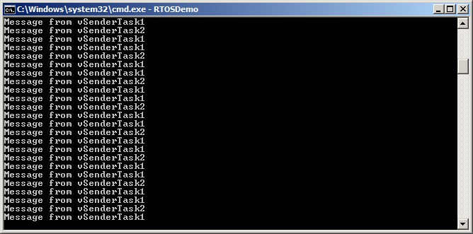

# 5 队列管理

## 5.1 引言

'队列' 提供了任务到任务、任务到中断和中断到任务的通信机制。

### 5.1.1 范围

本章涵盖以下内容：

- 如何创建一个队列。
- 队列如何管理其包含的数据。
- 如何向队列发送数据。
- 如何从队列接收数据。
- 队列阻塞的含义。
- 如何在多个队列上阻塞。
- 如何覆盖队列中的数据。
- 如何清除队列。
- 任务优先级在向队列写入和读取时的影响。

本章仅涵盖任务到任务的通信。第7章涵盖任务到中断和中断到任务的通信。

## 5.2 队列的特性

### 5.2.1 数据存储

队列可以容纳固定大小的有限数量的数据项[^8]。队列可以容纳的最大数据项数称为其“长度”。队列的长度和每个数据项的大小在创建队列时设置。

[^8]: FreeRTOS消息缓冲区，在第TBD章中描述，提供了一种比容纳可变长度消息的队列更轻量级的替代方案。

队列通常用作先进先出（FIFO）缓冲区，数据写入队列的末尾（尾部），并从队列的前面（头部）移除。图5.1演示了数据被写入和从作为FIFO使用的队列中读取。也可以将数据写入队列的前面，并覆盖队列前面已经存在的数据。

<a name="fig5.1" title="图5.1 一个写入和从队列中读取的示例序列"></a>

* * *

***图5.1*** *一个写入和从队列中读取的示例序列*
* * *

队列行为可以通过两种方式实现：

1. 通过复制队列

    通过复制队列意味着将数据发送到队列时，数据会逐字节复制到队列中。

1. 通过引用队列

    通过引用队列意味着队列只保存指向发送到队列的数据的指针，而不是数据本身。

FreeRTOS使用通过复制队列的方法，因为它比通过引用队列更强大和更简单，因为：

- 通过复制队列不会阻止队列也用于通过引用队列。例如，当要队列的数据大小使得将数据复制到队列中变得不切实际时，可以将指向数据的指针复制到队列中。

- 可以直接将堆栈变量发送到队列，即使在声明该变量的函数退出后该变量将不再存在。

- 可以在不首先分配缓冲区来保存数据的情况下将数据发送到队列，然后将数据复制到分配的缓冲区并引用缓冲区。

- 发送任务可以立即重用发送到队列的变量或缓冲区。

- 发送任务和接收任务完全脱钩；应用程序设计师不需要关心哪个任务“拥有”数据，或者哪个任务负责释放数据。

- RTOS完全负责分配用于存储数据的内存。

- 内存受保护的系统限制对RAM的访问，在这种情况下，只有在发送和接收任务都可以访问引用的数据时，才能通过引用队列。通过复制队列允许数据跨越内存保护边界传递。


### 5.2.2 多任务访问

队列是独立的对象，可以被任何知道其存在的任务或中断服务程序（ISR）访问。任意数量的任务可以向同一个队列写入数据，任意数量的任务可以从同一个队列读取数据。实际上，一个队列有多个写入者是非常常见的，但一个队列有多个读取者则相对少见。

### 5.2.3 队列读取阻塞

当一个任务尝试从队列读取数据时，可以选择指定一个“阻塞”时间。这是任务在阻塞状态下等待队列中数据可用的时间，如果队列已经为空。处于阻塞状态等待队列中数据可用的任务，当另一个任务或中断将数据放入队列时，会自动转换为就绪状态。如果指定的阻塞时间在数据可用之前到期，任务也会自动从阻塞状态转换为就绪状态。

队列可以有多个读取者，因此一个队列可能会有多个任务阻塞在等待数据。在这种情况下，只有当数据可用时，才会解除一个任务的阻塞。被解除阻塞的任务总是等待数据的最高优先级任务。如果两个或多个阻塞任务具有相等的优先级，则被解除阻塞的任务是等待时间最长的任务。


### 5.2.4 队列写入阻塞

与从队列读取时一样，任务在写入队列时也可以选择指定阻塞时间。在这种情况下，阻塞时间是任务在阻塞状态下等待队列空间可用的最大时间，如果队列已经满了。

队列可以有多个写入者，因此当队列已满时，可能会有多个任务阻塞在等待完成发送操作。在这种情况下，当队列上有空间可用时，只会解除一个任务的阻塞。解除阻塞的任务总是等待空间的最高优先级任务。如果两个或多个阻塞任务具有相等的优先级，则解除阻塞的任务是等待时间最长的任务。

### 5.2.5 多个队列阻塞

队列可以分组成集合，允许任务进入阻塞状态以等待集合中任何一个队列上的数据可用。第5.6节“从多个队列接收”演示了队列集合。


### 5.2.6 创建队列：静态分配和动态分配队列

队列通过句柄引用，这些句柄是`QueueHandle_t`类型的变量。在使用队列之前，必须显式创建队列。

有两个API函数用于创建队列：`xQueueCreate()` 和 `xQueueCreateStatic()`。

每个队列需要两块RAM，第一块用于保存其数据结构，第二块用于保存排队的数据。`xQueueCreate()` 从堆中分配所需的RAM（动态分配）。`xQueueCreateStatic()` 使用作为函数参数传入的预分配RAM。

## 5.3 使用队列

### 5.3.1 xQueueCreate() API 函数

清单 5.1 显示了 `xQueueCreate()` 函数原型。`xQueueCreateStatic()` 有两个额外的参数，分别指向预分配的内存，用于保存队列的数据结构和数据存储区。

<a name="list5.1" title="清单 5.1 xQueueCreate() API 函数原型"></a>

```c
QueueHandle_t xQueueCreate( UBaseType_t uxQueueLength, UBaseType_t uxItemSize );
```
***清单 5.1*** *xQueueCreate() API 函数原型*

**xQueueCreate() 参数和返回值：**

- `uxQueueLength`

  创建的队列在任何时候最多可以保存的项目数。

- `uxItemSize`

  可以存储在队列中的每个数据项的字节大小。

- 返回值

  如果返回 NULL，则无法创建队列，因为没有足够的堆内存可供 FreeRTOS 分配队列数据结构和存储区。第 2 章提供了有关 FreeRTOS 堆的更多信息。

  如果返回非 NULL 值，则队列创建成功，返回值是创建的队列的句柄。

`xQueueReset()` 是一个 API 函数，用于将先前创建的队列恢复到其原始的空状态。


### 5.3.2 xQueueSendToBack() 和 xQueueSendToFront() API 函数

如预期的那样，`xQueueSendToBack()` 将数据发送到队列的尾部，而 `xQueueSendToFront()` 将数据发送到队列的头部。

`xQueueSend()` 等同于 `xQueueSendToBack()`，并且完全相同。

> *注意：永远不要在中断服务例程中调用 `xQueueSendToFront()` 或 `xQueueSendToBack()`。应该使用中断安全版本 `xQueueSendToFrontFromISR()` 和 `xQueueSendToBackFromISR()`。这些在第7章中有描述。*

<a name="list5.2" title="Listing 5.2 The xQueueSendToFront() API function prototype"></a>

```c
BaseType_t xQueueSendToFront( QueueHandle_t xQueue,
                              const void * pvItemToQueue,
                              TickType_t xTicksToWait );
```
***Listing 5.2*** *The xQueueSendToFront() API function prototype*

<a name="list5.3" title="Listing 5.3 The xQueueSendToBack() API function prototype"></a>

```c
BaseType_t xQueueSendToBack( QueueHandle_t xQueue,
                             const void * pvItemToQueue,
                             TickType_t xTicksToWait );
```
***Listing 5.3*** *The xQueueSendToBack() API function prototype*

**xQueueSendToFront() 和 xQueueSendToBack() 函数参数和返回值**

- `xQueue`

  将数据发送（写入）到的队列的句柄。队列句柄将从调用 `xQueueCreate()` 或 `xQueueCreateStatic()` 返回，这些函数用于创建队列。

- `pvItemToQueue`

  指向要复制到队列中的数据的指针。

  队列可以容纳的每个项目的大小是在创建队列时设置的，因此从 `pvItemToQueue` 复制了许多字节到队列存储区。

- `xTicksToWait`

  任务在阻塞状态下等待队列中空间变得可用的最大时间，如果队列已经满了。

  无论是 `xQueueSendToFront()` 还是 `xQueueSendToBack()`，如果 `xTicksToWait` 为零且队列已经满了，都会立即返回。

  阻塞时间以滴答周期指定，因此它所代表的绝对时间取决于滴答频率。可以使用宏 `pdMS_TO_TICKS()` 将以毫秒指定的时间转换为以滴答指定的时间。

  将 `xTicksToWait` 设置为 `portMAX_DELAY` 将导致任务无限期等待（不会超时），前提是 `INCLUDE_vTaskSuspend` 在 FreeRTOSConfig.h 中设置为 1。

- 返回值

  有两种可能的返回值：

  - `pdPASS`

    当数据成功发送到队列时返回 `pdPASS`。

如果指定了阻塞时间（`xTicksToWait` 不为零），那么在函数返回之前，调用任务可能被放置到阻塞状态，以等待队列中有空间可用，但在阻塞时间到期之前，数据已经成功写入队列。

  - `errQUEUE_FULL`（与 `pdFAIL` 相同的值）

    如果数据无法写入队列，因为队列已经满了，则返回 `errQUEUE_FULL`。

    如果指定了阻塞时间（`xTicksToWait` 不为零），那么调用任务将被放置到阻塞状态，以等待另一个任务或中断在队列中创建空间，但在发生之前，指定的阻塞时间已过期。


### 5.3.3 xQueueReceive() API 函数

`xQueueReceive()` 从队列中接收（读取）一个项目。接收到的项目将从队列中删除。

> *注意：永远不要在中断服务例程中调用 `xQueueReceive()`。中断安全的 `xQueueReceiveFromISR()` API 函数在第7章中描述。*

<a name="list5.4" title="Listing 5.4 The xQueueReceive() API function prototype"></a>

```c
BaseType_t xQueueReceive( QueueHandle_t xQueue,
                          void * const pvBuffer,
                          TickType_t xTicksToWait );
```
***Listing 5.4*** *The xQueueReceive() API function prototype*

**xQueueReceive() 函数参数和返回值**

- `xQueue`

  从中接收（读取）数据的队列的句柄。队列句柄将由用于创建队列的 `xQueueCreate()` 或 `xQueueCreateStatic()` 调用返回。

- `pvBuffer`

  指向接收到的数据将被复制到的内存的指针。

  队列中每个数据项的大小是在创建队列时设置的。`pvBuffer` 指向的内存必须至少足够大，以容纳那么多字节。

- `xTicksToWait`

  任务在队列中没有数据可用时应保持在阻塞状态的最大时间。

  如果 `xTicksToWait` 为零，则如果队列已经为空，`xQueueReceive()` 将立即返回。

  阻塞时间以滴答周期指定，因此它所代表的绝对时间取决于滴答频率。可以使用宏 `pdMS_TO_TICKS()` 将以毫秒指定的时间转换为以滴答指定的时间。

  将 `xTicksToWait` 设置为 `portMAX_DELAY` 将导致任务无限期等待（不会超时），前提是 `INCLUDE_vTaskSuspend` 在 FreeRTOSConfig.h 中设置为 1。

- 返回值

  有两种可能的返回值：

  - `pdPASS`

    当数据成功从队列中读取时返回 `pdPASS`。

    如果指定了阻塞时间（`xTicksToWait` 不为零），则调用任务可能被放置到阻塞状态以等待队列中有数据可用，但在阻塞时间到期之前成功从队列中读取了数据。

  - `errQUEUE_EMPTY`（与 `pdFAIL` 相同的值）

    如果无法从队列中读取数据，因为队列已经为空，则返回 `errQUEUE_EMPTY`。

    如果指定了阻塞时间（`xTicksToWait` 不为零），则调用任务将被放置到阻塞状态以等待另一个任务或中断将数据发送到队列，但在发生之前阻塞时间到期。


### 5.3.4 uxQueueMessagesWaiting() API 函数

`uxQueueMessagesWaiting()` 查询队列中当前的项目数量。

> *注意：永远不要在中断服务例程中调用 `uxQueueMessagesWaiting()`。应该使用 `uxQueueMessagesWaitingFromISR()` 来替代。*

<a name="list5.5" title="Listing 5.5 The uxQueueMessagesWaiting() API function prototype"></a>

```c
UBaseType_t uxQueueMessagesWaiting( QueueHandle_t xQueue );
```
***Listing 5.5*** *The uxQueueMessagesWaiting() API function prototype*

**uxQueueMessagesWaiting() 函数参数和返回值**

- `xQueue`

  被查询的队列的句柄。队列句柄将从调用 `xQueueCreate()` 或 `xQueueCreateStatic()` 中返回，这些函数用于创建队列。

- 返回值

  被查询的队列中当前的项目数量。如果返回零，则队列为空。

<a name="example5.1" title="Example 5.1 Blocking when receiving from a queue"></a>
---
***Example 5.1*** *Blocking when receiving from a queue*

---

这个示例演示了创建一个队列，从多个任务向队列发送数据，并从队列接收数据。队列被创建以保存类型为 `int32_t` 的数据项。向队列发送数据的任务没有指定阻塞时间，而从队列接收数据的任务则有。

## 发送到队列的任务优先级低于从队列接收的任务。这意味着队列中永远不会包含超过一个项目，因为一旦数据发送到队列，接收任务将解锁，抢占发送任务（因为它具有更高的优先级），并删除数据，使队列再次变为空。

示例创建了两个任务实例，如清单 5.6 所示，一个任务不断将值 100 写入队列，另一个任务不断将值 200 写入同一个队列。任务参数用于将这些值传递给每个任务实例。

<a name="list5.6" title="清单 5.6 示例 5.1 中使用的发送任务实现"></a>

```c
static void vSenderTask( void *pvParameters )
{

    int32_t lValueToSend;

    BaseType_t xStatus;

    /* 创建了两个此任务的实例，因此通过任务参数发送到队列的值 - 这样每个实例都可以使用不同的值。队列是创建来保存类型为 int32_t 的值，因此将参数转换为所需的类型。 */
    lValueToSend = ( int32_t ) pvParameters;

    /* 与大多数任务一样，此任务在无限循环中实现。 */
    for( ;; )
    {

        /* 将值发送到队列。

           第一个参数是数据被发送到的队列。队列是在调度器启动之前创建的，因此在此任务开始执行之前。

           第二个参数是要发送的数据的地址，在这种情况下是 lValueToSend 的地址。

           第三个参数是阻塞时间 - 任务在阻塞状态下等待队列上空间可用的时间，如果队列已经满。在这种情况下，没有指定阻塞时间，因为队列永远不会包含超过一个项目，因此永远不会满。 */
        xStatus = xQueueSendToBack( xQueue, &lValueToSend, 0 );

        if( xStatus != pdPASS )
        {
            /* 发送操作无法完成，因为队列已满 - 这必须是一个错误，因为队列永远不会包含超过一个项目！ */
            vPrintString( "Could not send to the queue.\r\n" );
        }
    }
}
```
***清单 5.6*** *示例 5.1 中使用的发送任务实现*

清单 5.7 显示了从队列接收数据的任务的实现。接收任务指定了 100 毫秒的阻塞时间，然后进入阻塞状态以等待数据可用。它在数据在队列上可用或 100 毫秒内没有数据可用时离开阻塞状态。在这个示例中，有两个任务不断地写入队列，因此 100 毫秒的超时永远不会过期。

<a name="list5.7" title="清单 5.7  示例 5.1 的接收任务实现"></a>

```c
static void vReceiverTask( void *pvParameters )
{
    /* 声明将保存从队列接收到的值的变量。 */
    int32_t lReceivedValue;
    BaseType_t xStatus;
    const TickType_t xTicksToWait = pdMS_TO_TICKS( 100 );

    /* 该任务也在一个无限循环中定义。 */
    for( ;; )
    {
        /* 此调用应该总是发现队列为空，因为该任务将立即删除写入队列的任何数据。 */
        if( uxQueueMessagesWaiting( xQueue ) != 0 )
        {
            vPrintString( "队列应该是空的！\r\n" );
        }

        /* 从队列接收数据。

           第一个参数是要从中接收数据的队列。
           队列在调度程序启动之前创建，因此在该任务首次运行之前创建。

           第二个参数是接收到的数据将被放置的缓冲区。在这种情况下，缓冲区只是一个具有所需大小以保存接收到的数据的变量的地址。

           最后一个参数是阻塞时间——任务在等待数据可用时将保持在阻塞状态的最大时间，如果队列已经为空。 */
        xStatus = xQueueReceive( xQueue, &lReceivedValue, xTicksToWait );

        if( xStatus == pdPASS )
        {
            /* 数据已成功从队列接收，打印接收到的值。 */
            vPrintStringAndNumber( "接收到 = ", lReceivedValue );
        }
        else
        {
            /* 即使等待了100毫秒，也未从队列接收到数据。这必须是一个错误，因为发送任务是自由运行的，并且将不断地写入队列。 */
            vPrintString( "无法从队列接收。\r\n" );
        }
    }
}
```
***清单 5.7***  *示例 5.1 的接收任务实现*

清单 5.8 包含 `main()` 函数的定义。这只是在启动调度程序之前创建队列和三个任务。队列被创建以保存最多五个 `int32_t` 值，尽管相对任务优先级意味着队列将永远不会同时保存多个项目。

<a name="list5.8" title="Listing 5.8 Example 5.1 中 main() 的实现"></a>

```c
/* 声明一个 QueueHandle_t 类型的变量。这个变量用于存储所有三个任务都可以访问的队列的句柄。 */
QueueHandle_t xQueue;

int main( void )
{
    /* 创建一个队列，最多可以容纳 5 个值，每个值都足够大，可以容纳一个 int32_t 类型的变量。 */
    xQueue = xQueueCreate( 5, sizeof( int32_t ) );

    if( xQueue != NULL )
    {
        /* 创建两个实例的任务，这些任务将向队列发送数据。任务参数用于传递任务将写入队列的值，因此一个任务将不断地将 100 写入队列，而另一个任务将不断地将 200 写入队列。这两个任务都以优先级 1 创建。 */
        xTaskCreate( vSenderTask, "Sender1", 1000, ( void * ) 100, 1, NULL );
        xTaskCreate( vSenderTask, "Sender2", 1000, ( void * ) 200, 1, NULL );

        /* 创建将从队列读取的任务。该任务以优先级 2 创建，因此高于发送任务的优先级。 */
        xTaskCreate( vReceiverTask, "Receiver", 1000, NULL, 2, NULL );

        /* 启动调度程序，以便创建的任务开始执行。 */
        vTaskStartScheduler();
    }
    else
    {
        /* 无法创建队列。 */
    }

    /* 如果一切正常，main() 将永远不会到达这里，因为调度程序现在正在运行任务。如果 main() 到达这里，那么很可能是因为没有足够的 FreeRTOS 堆内存来创建空闲任务。第 3 章提供了有关堆内存管理的更多信息。 */
    for( ;; );
}
```
***Listing 5.8*** *Example 5.1 中 main() 的实现*

图 5.2 显示了 Example 5.1 生成的输出。

<a name="fig5.2" title="图 5.2 执行示例 5.1 时生成的输出"></a>

* * *

***图 5.2*** *执行示例 5.1 时生成的输出*
* * *

图 5.3 示范了执行的顺序。

<a name="fig5.3" title="图 5.3 示例 5.1 生成的执行顺序"></a>

* * *

***图 5.3*** *示例 5.1 生成的执行顺序*
* * *

## 5.4 从多个来源接收数据

在 FreeRTOS 设计中，任务从多个来源接收数据是很常见的。接收任务需要知道数据来自何处，以便确定如何处理它。一种简单的设计模式是使用单个队列传输包含数据值和数据来源的结构，如图 5.4 所示。

<a name="fig5.4" title="图 5.4 结构通过队列发送的示例场景"></a>

* * *

***图 5.4*** *结构通过队列发送的示例场景*
* * *

参考图 5.4：

- 创建的队列保存 `Data_t` 类型的结构。该结构允许将数据值和指示数据含义的枚举类型一起发送到队列中的一条消息。

- 一个中央控制器任务执行主要系统功能。它必须对输入和系统状态的变化做出反应，这些变化通过队列传递给它。

- 一个CAN总线任务用于封装CAN总线接口功能。当CAN总线任务接收并解码了一条消息后，它将已经解码的消息以`Data_t`结构发送给控制器任务。传输结构的`eDataID`成员告诉控制器任务数据的类型。在本例中，它是电机速度值。传输结构的`lDataValue`成员告诉控制器任务实际的电机速度值。

- 一个人机界面（HMI）任务用于封装所有HMI功能。机器操作员可能可以通过多种方式输入命令和查询值，这些都必须在HMI任务中检测和解释。当输入新命令时，HMI任务将命令以`Data_t`结构发送给控制器任务。传输结构的`eDataID`成员告诉控制器任务数据的类型。在本例中，它是一个新的设定点值。传输结构的`lDataValue`成员告诉控制器任务实际的设定点值。

第 (RB-TBD) 章节展示了如何扩展此设计模式，使控制器任务可以直接回复队列结构的任务。

<a name="example5.2" title="示例 5.2 阻塞发送到队列，并在队列上发送结构"></a>
---
***示例 5.2*** *阻塞发送到队列，并在队列上发送结构*

---

示例 5.2 与示例 5.1 类似，但任务优先级相反，因此接收任务的优先级低于发送任务。此外，创建的队列保存结构而不是整数。

清单 5.9 显示了示例 5.2 使用的结构定义。

<a name="list5.9" title="清单 5.9 要在队列上传递的结构的定义，以及两个变量的声明，用于示例"></a>

```c
/* 定义一个枚举类型，用于标识数据的来源。 */
typedef enum
{
    eSender1,
    eSender2
} DataSource_t;

/* 定义将在队列上传递的结构类型。 */
typedef struct
{
    uint8_t ucValue;
    DataSource_t eDataSource;
} Data_t;

/* 声明两个 Data_t 类型的变量，这些变量将在队列上传递。 */
static const Data_t xStructsToSend[ 2 ] =
{
    { 100, eSender1 }, /* 用于 Sender1。 */
    { 200, eSender2 }  /* 用于 Sender2。 */
};
```
***清单 5.9*** *要在队列上传递的结构的定义，以及两个变量的声明，用于示例*

在示例 5.1 中，接收任务具有最高优先级，因此队列中从不包含多个项目。这是因为接收任务在数据放入队列后立即抢占发送任务。在示例 5.2 中，发送任务具有较高的优先级，因此队列通常是满的。这是因为，一旦接收任务从队列中移除一个项目，它就会被一个发送任务抢占，该发送任务立即重新填充队列。然后，发送任务重新进入阻塞状态，等待队列上再次有空间可用。

Listing 5.10 显示了发送任务的实现。发送任务指定了100毫秒的阻塞时间，因此每次队列满时，它进入阻塞状态以等待空间可用。当队列上有空间可用或100毫秒内没有空间可用时，它会离开阻塞状态。在这个例子中，接收任务不断在队列中创建空间，因此100毫秒的超时从未过期。

<a name="list5.10" title="Listing 5.10 The implementation of the sending task for Example 5.2"></a>

```c
static void vSenderTask( void *pvParameters )
{
    BaseType_t xStatus;
    const TickType_t xTicksToWait = pdMS_TO_TICKS( 100 );

    /* As per most tasks, this task is implemented within an infinite loop. */
    for( ;; )
    {
        /* Send to the queue.

           The second parameter is the address of the structure being sent. The
           address is passed in as the task parameter so pvParameters is used
           directly.

           The third parameter is the Block time - the time the task should be
           kept in the Blocked state to wait for space to become available on
           the queue if the queue is already full. A block time is specified
           because the sending tasks have a higher priority than the receiving
           task so the queue is expected to become full. The receiving task
           will remove items from the queue when both sending tasks are in the
           Blocked state. */
        xStatus = xQueueSendToBack( xQueue, pvParameters, xTicksToWait );

        if( xStatus != pdPASS )
        {
            /* The send operation could not complete, even after waiting for
               100ms. This must be an error as the receiving task should make
               space in the queue as soon as both sending tasks are in the
               Blocked state. */
            vPrintString( "Could not send to the queue.\r\n" );
        }
    }
}
```
***Listing 5.10*** *The implementation of the sending task for Example 5.2*

接收任务具有最低优先级，因此只有在两个发送任务都处于阻塞状态时才会运行。发送任务只有在队列满时才会进入阻塞状态，因此接收任务只会在队列已满时执行。因此，即使它没有指定阻塞时间，它总是期望接收数据。

列表5.11展示了接收任务的实现。

<a name="list5.11" title="列表5.11 示例5.2的接收任务定义"></a>

```c
static void vReceiverTask( void *pvParameters )
{
    /* 声明将保存从队列接收到的值的结构。 */
    Data_t xReceivedStructure;
    BaseType_t xStatus;

    /* 该任务也在一个无限循环中定义。 */
    for( ;; )
    {
        /* 由于它具有最低优先级，因此该任务只在发送任务处于阻塞状态时才运行。发送任务只会在队列满时进入阻塞状态，因此该任务总是期望队列中的项目数等于队列长度，本例中为3。 */
        if( uxQueueMessagesWaiting( xQueue ) != 3 )
        {
            vPrintString( "队列应该已满!\r\n" );
        }

        /* 从队列接收。

           第二个参数是接收到的数据将被放置的缓冲区。在这种情况下，缓冲区只是一个具有所需大小以保存接收到的结构的变量的地址。

           最后一个参数是阻塞时间 - 任务在阻塞状态下等待数据可用的最大时间。在这种情况下，阻塞时间是不必要的，因为该任务只在队列满时才运行。 */
        xStatus = xQueueReceive( xQueue, &xReceivedStructure, 0 );

        if( xStatus == pdPASS )
        {
            /* 数据已成功从队列接收，打印接收到的值及其来源。 */
            if( xReceivedStructure.eDataSource == eSender1 )
            {
                vPrintStringAndNumber( "来自发送者1 = ",
                                       xReceivedStructure.ucValue );
            }
            else
            {
                vPrintStringAndNumber( "来自发送者2 = ",
                                       xReceivedStructure.ucValue );
            }
        }
        else
        {
            /* 队列中没有接收到任何内容。这必须是一个错误，因为该任务只在队列满时才运行。 */
            vPrintString( "无法从队列接收.\r\n" );
        }
    }
}
```
***列表5.11*** *示例5.2的接收任务定义*

`main()` 与前一个示例相比仅有轻微变化。队列被创建以保存三个 `Data_t` 结构，并且发送和接收任务的优先级被反转。列表5.12展示了 `main()` 的实现。

<a name="list5.12" title="Listing 5.12 示例 5.2 中 main() 的实现"></a>

```c
int main( void )
{
    /* 创建队列以容纳最多 3 个 Data_t 类型的结构体。 */
    xQueue = xQueueCreate( 3, sizeof( Data_t ) );

    if( xQueue != NULL )
    {
        /* 创建两个将写入队列的任务实例。参数用于传递任务将写入队列的结构体，
           因此一个任务将不断将 xStructsToSend[ 0 ] 发送到队列，而另一个任务将不断将
           xStructsToSend[ 1 ] 发送到队列。两个任务都以优先级 2 创建，高于接收者的优先级。 */
        xTaskCreate( vSenderTask, "Sender1", 1000, &( xStructsToSend[ 0 ] ),
                     2, NULL );
        xTaskCreate( vSenderTask, "Sender2", 1000, &( xStructsToSend[ 1 ] ),
                     2, NULL );

        /* 创建将从队列读取的任务。该任务以优先级 1 创建，低于发送任务的优先级。 */
        xTaskCreate( vReceiverTask, "Receiver", 1000, NULL, 1, NULL );

        /* 启动调度程序以开始执行创建的任务。 */
        vTaskStartScheduler();
    }
    else
    {
        /* 无法创建队列。 */
    }

    /* 如果一切正常，main() 将永远不会到达这里，因为调度程序现在正在运行任务。如果 main() 到达这里，那么很可能是因为没有足够的堆内存来创建空闲任务。第 3 章提供了更多关于堆内存管理的信息。 */
    for( ;; );
}
```
***Listing 5.12*** *示例 5.2 中 main() 的实现*

图 5.5 显示了示例 5.2 生成的输出。

<a name="fig5.5" title="图 5.5 示例 5.2 生成的输出"></a>

* * *

***图 5.5*** *示例 5.2 生成的输出*
* * *

图 5.6 示范了由于发送任务的优先级高于接收任务的优先级而产生的执行序列。下面是对图 5.6 的进一步解释，以及为什么前四条消息来自同一个任务的描述。

<a name="fig5.6" title="图 5.6 示例 5.2 生成的执行序列"></a>

* * *

***图 5.6*** *示例 5.2 生成的执行序列*
* * *

**图 5.6 的说明**

- t1

  任务发送者 1 执行并将 3 个数据项发送到队列。

- t2

  队列已满，因此发送者 1 进入阻塞状态以等待其下一次发送完成。任务发送者 2 现在是可以运行的最高优先级任务，因此它进入运行状态。

- t3

  任务发送者 2 发现队列已满，因此它进入阻塞状态以等待其第一次发送完成。任务接收者现在是可以运行的最高优先级任务，因此它进入运行状态。

- t4

  有两个任务的优先级高于接收任务的优先级，正在等待队列中有空间可用，结果是任务接收者在从队列中移除一个项目后立即被抢占。发送者1和发送者2具有相同的优先级，因此调度程序选择等待时间最长的任务作为进入运行状态的任务，在这种情况下是任务发送者1。

- t5

  任务发送者1将另一个数据项发送到队列。队列中只有一个空间，因此任务发送者1进入阻塞状态，以等待其下一次发送完成。任务接收者再次成为可以运行的最高优先级任务，因此它进入运行状态。

  任务发送者1现在已经向队列发送了四个项目，任务发送者2仍在等待将其第一个项目发送到队列。

- t6

  有两个任务的优先级高于接收任务的优先级，正在等待队列中有空间可用，因此任务接收者在从队列中移除一个项目后立即被抢占。这次发送者2等待的时间比发送者1长，因此发送者2进入运行状态。

- t7

  任务发送者2将一个数据项发送到队列中。队列中只有一个空间，因此发送者2进入阻塞状态，等待其下一次发送完成。发送者1和发送者2都在等待队列中有空间可用，因此只有任务接收者可以进入运行状态。

## 5.5 处理大型或可变大小的数据

### 5.5.1 队列指针

如果队列中存储的数据大小较大，则最好使用队列传输指向数据的指针，而不是将数据逐字节复制到队列中和从队列中复制出来。传输指针在处理时间和创建队列所需的RAM量方面都更高效。然而，在队列指针时，必须极其小心，以确保：

- 明确定义指向的RAM的所有者。

  通过指针在任务之间共享内存时，必须确保两个任务不会同时修改内存内容，或者采取任何其他可能导致内存内容无效或不一致的操作。理想情况下，只有在指针发送到队列之前，发送任务才被允许访问内存，只有在指针从队列中接收到之后，接收任务才被允许访问内存。

- 指向的RAM保持有效。

  如果指向的内存是动态分配的，或者从预分配的缓冲区池中获取的，那么应该有一个任务负责释放内存。在内存被释放后，没有任务应该尝试访问该内存。

  指针不应用于访问在任务堆栈上分配的数据。在堆栈框架更改后，数据将无效。

例如，清单5.13、5.14和5.15演示了如何使用队列从一个任务发送指向缓冲区的指针到另一个任务：

- 清单5.13创建了一个可以容纳最多5个指针的队列。

- 清单5.14分配一个缓冲区，将字符串写入缓冲区，然后将指向缓冲区的指针发送到队列。

- 清单5.15从队列接收指向缓冲区的指针，然后打印缓冲区中包含的字符串。

<a name="list5.13" title="Listing 5.13 Creating a queue that holds pointers"></a>

```c
/* Declare a variable of type QueueHandle_t to hold the handle of the
   queue being created. */
QueueHandle_t xPointerQueue;

/* Create a queue that can hold a maximum of 5 pointers, in this case
   character pointers. */
xPointerQueue = xQueueCreate( 5, sizeof( char * ) );
```
***Listing 5.13*** *Creating a queue that holds pointers*

<a name="list5.14" title="Listing 5.14 Using a queue to send a pointer to a buffer"></a>

```c
/* A task that obtains a buffer, writes a string to the buffer, then
   sends the address of the buffer to the queue created in Listing 5.13. */
void vStringSendingTask( void *pvParameters )
{
    char *pcStringToSend;
    const size_t xMaxStringLength = 50;
    BaseType_t xStringNumber = 0;

    for( ;; )
    {
        /* Obtain a buffer that is at least xMaxStringLength characters big.
           The implementation of prvGetBuffer() is not shown – it might obtain
           the buffer from a pool of pre-allocated buffers, or just allocate
           the buffer dynamically. */
        pcStringToSend = ( char * ) prvGetBuffer( xMaxStringLength );

        /* Write a string into the buffer. */
        snprintf( pcStringToSend, xMaxStringLength, "String number %d\r\n",
                  xStringNumber );

        /* Increment the counter so the string is different on each iteration
           of this task. */
        xStringNumber++;

        /* Send the address of the buffer to the queue that was created in
           Listing 5.13. The address of the buffer is stored in the
           pcStringToSend variable.*/
        xQueueSend( xPointerQueue,   /* The handle of the queue. */
                    &pcStringToSend, /* The address of the pointer that points
                                        to the buffer. */
                    portMAX_DELAY );
    }
}
```
***Listing 5.14*** *Using a queue to send a pointer to a buffer*

<a name="list5.15" title="Listing 5.15 Using a queue to receive a pointer to a buffer"></a>

```c
/* A task that receives the address of a buffer from the queue created
   in Listing 5.13, and written to in Listing 5.14. The buffer contains a
   string, which is printed out. */

void vStringReceivingTask( void *pvParameters )
{
    char *pcReceivedString;

    for( ;; )
    {
        /* Receive the address of a buffer. */
        xQueueReceive( xPointerQueue,     /* The handle of the queue. */
                       &pcReceivedString, /* Store the buffer's address in
                                             pcReceivedString. */
                       portMAX_DELAY );

        /* The buffer holds a string, print it out. */
        vPrintString( pcReceivedString );

        /* The buffer is not required any more - release it so it can be freed,
           or re-used. */
        prvReleaseBuffer( pcReceivedString );
    }
}
```
***Listing 5.15*** *Using a queue to receive a pointer to a buffer*


### 5.5.2 使用队列发送不同类型和长度的数据[^9]

[^9]: FreeRTOS消息缓冲区是一种更轻量级的替代方案，用于保存可变长度数据的队列。

本书的前几节展示了两种强大的设计模式：将结构体发送到队列，以及将指针发送到队列。结合这些技术，任务可以使用单个队列从任何数据源接收任何数据类型。FreeRTOS+TCP TCP/IP堆栈的实现提供了一个实际示例，说明了如何实现这一点。

TCP/IP堆栈在其自己的任务中运行，必须处理来自许多不同来源的事件。不同的事件类型与不同类型和长度的数据相关联。`IPStackEvent_t`结构描述了所有发生在TCP/IP任务之外的事件，并通过队列发送到TCP/IP任务。清单5.16显示了`IPStackEvent_t`结构。`IPStackEvent_t`结构的`pvData`成员是一个指针，可以用来直接保存一个值，或者指向一个缓冲区。

<a name="list5.16" title="FreeRTOS+TCP中用于向TCP/IP堆栈任务发送事件的结构"></a>

```c
/* TCP/IP堆栈中用于标识事件的枚举类型的子集。 */
typedef enum
{
    eNetworkDownEvent = 0, /* 网络接口已丢失，或需要（重新）连接。 */
    eNetworkRxEvent,       /* 从网络接收到数据包。 */
    eTCPAcceptEvent,       /* FreeRTOS_accept() 被调用以接受或等待新客户端。 */

/* 其他事件类型出现在这里，但未在此列表中显示。 */

} eIPEvent_t;

/* 描述事件的结构，并通过队列发送到TCP/IP任务。 */
typedef struct IP_TASK_COMMANDS
{
    /* 标识事件的枚举类型。请参阅上述eIPEvent_t定义。 */
    eIPEvent_t eEventType;

    /* 可以保存值或指向缓冲区的通用指针。 */
    void *pvData;

} IPStackEvent_t;
```
***列表5.16*** *FreeRTOS+TCP中用于向TCP/IP堆栈任务发送事件的结构*

示例TCP/IP事件及其关联数据包括：

- `eNetworkRxEvent`: 从网络接收到数据包。

网络接口通过一种类型为 `IPStackEvent_t` 的结构体将接收到的数据事件发送到TCP/IP任务。该结构体的 `eEventType` 成员被设置为 `eNetworkRxEvent`，而结构体的 `pvData` 成员则用于指向包含接收到的数据的缓冲区。清单 59 显示了一个伪代码示例。

<a name="list5.17" title="清单 5.17 显示如何使用 IPStackEvent_t 结构将从网络接收到的数据发送到 TCP/IP 任务的伪代码"></a>

```c
void vSendRxDataToTheTCPTask( NetworkBufferDescriptor_t *pxRxedData )
{
    IPStackEvent_t xEventStruct;

    /* 完成 IPStackEvent_t 结构体。接收到的数据存储在 pxRxedData 中。 */
    xEventStruct.eEventType = eNetworkRxEvent;
    xEventStruct.pvData = ( void * ) pxRxedData;

    /* 将 IPStackEvent_t 结构体发送到 TCP/IP 任务。 */
    xSendEventStructToIPTask( &xEventStruct );
}
```
***清单 5.17*** *显示如何使用 IPStackEvent_t 结构将从网络接收到的数据发送到 TCP/IP 任务的伪代码*

- `eTCPAcceptEvent`: 一个套接字将接受或等待来自客户端的连接。

调用 `FreeRTOS_accept()` 的任务通过 `IPStackEvent_t` 类型的结构向 TCP/IP 任务发送接受事件。结构的 `eEventType` 成员设置为 `eTCPAcceptEvent`，结构的 `pvData` 成员设置为正在接受连接的套接字的句柄。清单 5.18 显示了一个伪代码示例。

  <a name="list5.18" title="清单 5.18 显示如何使用 IPStackEvent_t 结构将正在接受连接的套接字的句柄发送到 TCP/IP 任务的伪代码"></a>

  ```c
  void vSendAcceptRequestToTheTCPTask( Socket_t xSocket )
  {
      IPStackEvent_t xEventStruct;

      /* 完成 IPStackEvent_t 结构。 */
      xEventStruct.eEventType = eTCPAcceptEvent;
      xEventStruct.pvData = ( void * ) xSocket;

      /* 将 IPStackEvent_t 结构发送到 TCP/IP 任务。 */
      xSendEventStructToIPTask( &xEventStruct );
  }
  ```
  ***清单 5.18*** *显示如何使用 IPStackEvent_t 结构将正在接受连接的套接字的句柄发送到 TCP/IP 任务的伪代码*

- `eNetworkDownEvent`: 网络需要连接或重新连接。

网络接口通过类型为 `IPStackEvent_t` 的结构体向TCP/IP任务发送网络断开事件。结构体的 `eEventType` 成员被设置为 `eNetworkDownEvent`。网络断开事件与任何数据都没有关联，因此结构体的 `pvData` 成员未被使用。清单5.19显示了一个伪代码示例。

<a name="list5.19" title="清单5.19 显示如何使用 IPStackEvent_t 结构体向 TCP/IP 任务发送网络断开事件的伪代码"></a>

```c
void vSendNetworkDownEventToTheTCPTask( Socket_t xSocket )
{
    IPStackEvent_t xEventStruct;

    /* 完成 IPStackEvent_t 结构体。 */
    xEventStruct.eEventType = eNetworkDownEvent;

    xEventStruct.pvData = NULL; /* 未使用，但为了完整性设置为 NULL。 */

    /* 将 IPStackEvent_t 结构体发送到 TCP/IP 任务。 */
    xSendEventStructToIPTask( &xEventStruct );
}
```
***清单5.19*** *显示如何使用 IPStackEvent_t 结构体向 TCP/IP 任务发送网络断开事件的伪代码*

清单5.20显示了在TCP/IP任务中接收和处理这些事件的代码。可以看到，从队列接收到的 `IPStackEvent_t` 结构体的 `eEventType` 成员用于确定如何解释 `pvData` 成员。

<a name="list5.20" title="Listing 5.20 Pseudo code showing how an IPStackEvent_t structure is received and processed"></a>

  ```c
  IPStackEvent_t xReceivedEvent;

  /* Block on the network event queue until either an event is received, or
     xNextIPSleep ticks pass without an event being received. eEventType is
     set to eNoEvent in case the call to xQueueReceive() returns because it
     timed out, rather than because an event was received. */
  xReceivedEvent.eEventType = eNoEvent;
  xQueueReceive( xNetworkEventQueue, &xReceivedEvent, xNextIPSleep );

  /* Which event was received, if any? */
  switch( xReceivedEvent.eEventType )
  {
      case eNetworkDownEvent :
           /* Attempt to (re)establish a connection. This event is not
              associated with any data. */
           prvProcessNetworkDownEvent();
           break;

      case eNetworkRxEvent:
           /* The network interface has received a new packet. A pointer to the
              received data is stored in the pvData member of the received
              IPStackEvent_t structure. Process the received data. */
           prvHandleEthernetPacket( ( NetworkBufferDescriptor_t * )
                                    ( xReceivedEvent.pvData ) );
           break;

      case eTCPAcceptEvent:
           /* The FreeRTOS_accept() API function was called. The handle of the
              socket that is accepting a connection is stored in the pvData
              member of the received IPStackEvent_t structure. */
           xSocket = ( FreeRTOS_Socket_t * ) ( xReceivedEvent.pvData );
           xTCPCheckNewClient( xSocket );
           break;

      /* Other event types are processed in the same way, but are not shown
         here. */

  }
  ```
  ***Listing 5.20*** *Pseudo code showing how an IPStackEvent_t structure is received and processed*


## 5.6 从多个队列接收

### 5.6.1 队列集

通常，应用程序设计需要一个任务接收不同大小的数据、不同含义的数据以及来自不同来源的数据。前一节展示了如何使用接收结构的单个队列以简洁高效的方式实现这一点。然而，有时应用程序设计者受到限制，这些限制使得他们不得不为某些数据源使用单独的队列。例如，被集成到设计中的第三方代码可能假设存在一个专用队列。在这种情况下，可以使用“队列集”。

队列集允许一个任务从多个队列接收数据，而无需任务轮询每个队列以确定哪个队列（如果有的话）包含数据。

使用队列集从多个来源接收数据的设计比使用接收结构的单个队列实现相同功能的设计更不简洁，效率也更低。因此，建议仅在设计约束使其使用绝对必要时使用队列集。

以下各节描述了如何使用队列集：

- 创建一个队列集。

- 将队列添加到集合中。

  信号量也可以添加到队列集中。信号量将在本书后面描述。

- 从队列集读取以确定集合中哪些队列包含数据。

  当集合中的一个队列接收到数据时，接收队列的句柄被发送到队列集，并在任务调用从队列集读取的函数时返回。因此，如果从队列集返回一个队列句柄，则该句柄引用的队列已知包含数据，任务可以直接从该队列读取。

  > *注意：如果一个队列是队列集的成员，则每次从队列集接收其句柄时都必须从队列读取，并且在从队列集接收其句柄之前不能从队列读取。*

通过在 FreeRTOSConfig.h 中将编译时配置常量 `configUSE_QUEUE_SETS` 设置为 1 来启用队列集功能。


### 5.6.2 xQueueCreateSet() API 函数

在使用队列集之前，必须显式创建它。截至目前，尚无 `xQueueCreateSetStatic()` 的实现。然而，队列集本身就是队列，因此可以通过对 `xQueueCreateStatic()` 的特殊调用来使用预分配的内存创建一个集合。

队列集通过句柄引用，这些句柄是 `QueueSetHandle_t` 类型的变量。`xQueueCreateSet()` API 函数创建一个队列集并返回一个引用创建的队列集的 `QueueSetHandle_t`。

<a name="list5.21" title="Listing 5.21 The xQueueCreateSet() API function prototype"></a>

```c
QueueSetHandle_t xQueueCreateSet( const UBaseType_t uxEventQueueLength);
```
***Listing 5.21*** *The xQueueCreateSet() API function prototype*

**xQueueCreateSet() 参数和返回值**

- `uxEventQueueLength`

  当队列集中的一个队列接收到数据时，接收队列的句柄将被发送到队列集。`uxEventQueueLength` 定义了队列集在任何时候可以保存的队列句柄的最大数量。

  只有当队列集中的队列接收到数据时，队列句柄才会被发送到队列集。如果队列已满，则无法接收数据，因此如果集中的所有队列都已满，则无法将队列句柄发送到队列集。因此，队列集在任何时候都需要保存的项目的最大数量是集中每个队列的长度之和。

  例如，如果集中有三个空队列，每个队列的长度为五，那么在集中的所有队列都满之前，集中的队列总共可以接收十五个项目（三个队列乘以每个队列的五个项目）。在这种情况下，`uxEventQueueLength` 必须设置为十五，以确保队列集可以接收发送给它的每个项目。

  信号量也可以添加到队列集中。信号量将在本书后面介绍。为了计算所需的 `uxEventQueueLength`，二进制信号量的长度为一，互斥锁的长度为一，计数信号量的长度由信号量的最大计数值给出。

  例如，如果队列集将包含一个长度为三的队列和一个二进制信号量（长度为一），则 `uxEventQueueLength` 必须设置为四（三加一）。

- 返回值

  如果返回 NULL，则无法创建队列集，因为没有足够的堆内存可供 FreeRTOS 分配队列集数据结构和存储区。第 3 章提供了有关 FreeRTOS 堆的更多信息。

  如果返回非 NULL 值，则成功创建了队列集，返回值是创建的队列集的句柄。


### 5.6.3 xQueueAddToSet() API 函数

`xQueueAddToSet()` 将队列或信号量添加到队列集中。信号量将在本书后面描述。

<a name="list5.22" title="Listing 5.22 The xQueueAddToSet() API function prototype"></a>

```c
BaseType_t xQueueAddToSet( QueueSetMemberHandle_t xQueueOrSemaphore,
                           QueueSetHandle_t xQueueSet );
```
***Listing 5.22*** *The xQueueAddToSet() API function prototype*

**xQueueAddToSet() 参数和返回值**

- `xQueueOrSemaphore`

  要添加到队列集的队列或信号量的句柄。

  队列句柄和信号量句柄都可以强制转换为 `QueueSetMemberHandle_t` 类型。

- `xQueueSet`

  要将队列或信号量添加到的队列集的句柄。

- 返回值

  有两种可能的返回值：

  1. `pdPASS`

      这表示队列集已成功创建。

  1. `pdFAIL`

     这表示无法将队列或信号量添加到队列集中。

  队列和二进制信号量只能在空时添加到集合中。计数信号量只能在计数为零时添加到集合中。队列和信号量一次只能是一个集合的成员。


### 5.6.4 xQueueSelectFromSet() API 函数

`xQueueSelectFromSet()` 从队列集中读取队列句柄。

当队列集中的队列或信号量接收到数据时，接收队列或信号量的句柄将被发送到队列集，并在任务调用 `xQueueSelectFromSet()` 时返回。如果从 `xQueueSelectFromSet()` 调用中返回了句柄，则该句柄引用的队列或信号量已知包含数据，调用任务必须直接从队列或信号量中读取。

> *注意：在从 `xQueueSelectFromSet()` 调用中返回队列或信号量的句柄之前，不要从队列集中的队列或信号量读取数据。每次从 `xQueueSelectFromSet()` 调用中返回队列句柄或信号量句柄时，只从队列或信号量中读取一个项目。*

<a name="list5.23" title="Listing 5.23 The xQueueSelectFromSet() API function prototype"></a>

```c
QueueSetMemberHandle_t xQueueSelectFromSet( QueueSetHandle_t xQueueSet,
                                            const TickType_t xTicksToWait );
```
***Listing 5.23*** *The xQueueSelectFromSet() API function prototype*

**xQueueSelectFromSet() 参数和返回值**

- `xQueueSet`

  从中接收（读取）队列句柄或信号量句柄的队列集的句柄。队列集句柄将从用于创建队列集的 `xQueueCreateSet()` 调用中返回。

- `xTicksToWait`

  调用任务在队列集中等待接收队列或信号量句柄的最大时间，如果集中的所有队列和信号量都是空的。

  如果 `xTicksToWait` 为零，则 `xQueueSelectFromSet()` 如果集中的所有队列和信号量都是空的，将立即返回。

  阻塞时间以滴答周期指定，因此它所代表的绝对时间取决于滴答频率。可以使用宏 `pdMS_TO_TICKS()` 将以毫秒指定的时间转换为以滴答指定的时间。

  将 `xTicksToWait` 设置为 `portMAX_DELAY` 将导致任务无限期等待（不会超时），前提是 `INCLUDE_vTaskSuspend` 在 FreeRTOSConfig.h 中设置为 1。

- 返回值

  非 NULL 的返回值将是已知包含数据的队列或信号量的句柄。如果指定了阻塞时间（`xTicksToWait` 不为零），则可能调用任务被放置到阻塞状态以等待数据从集中的队列或信号量中变得可用，但在阻塞时间到期之前，句柄已成功从队列集中读取。句柄作为 `QueueSetMemberHandle_t` 类型返回，可以强制转换为 `QueueHandle_t` 类型或 `SemaphoreHandle_t` 类型。

如果返回值为NULL，则无法从队列集中读取句柄。如果指定了阻塞时间（`xTicksToWait` 不为零），则调用任务被置于阻塞状态，以等待另一个任务或中断将数据发送到队列集或信号量中的队列或信号量，但在此之前阻塞时间已过期。

<a name="example5.3" title="示例 5.3 使用队列集"></a>
---
***示例 5.3*** *使用队列集</i></h3>

---

这个示例创建了两个发送任务和一个接收任务。发送任务通过两个单独的队列将数据发送给接收任务，每个任务一个队列。这两个队列被添加到一个队列集中，接收任务从队列集中读取以确定哪个队列中包含数据。

任务、队列和队列集都在 `main()` 中创建—请参阅清单 5.24 以获取其实现。

<a name="list5.24" title="清单 5.24 示例 5.3 的 main() 实现"></a>

```c
/* 声明两个 QueueHandle_t 类型的变量。这两个队列都添加到同一个队列集中。 */
static QueueHandle_t xQueue1 = NULL, xQueue2 = NULL;

/* 声明一个 QueueSetHandle_t 类型的变量。这是两个队列将被添加到的队列集。 */
static QueueSetHandle_t xQueueSet = NULL;

int main( void )
{
    /* 创建两个队列，它们都发送字符指针。接收任务的优先级高于发送任务的优先级，
       因此队列在任何时候都不会有超过一个项目。*/
    xQueue1 = xQueueCreate( 1, sizeof( char * ) );
    xQueue2 = xQueueCreate( 1, sizeof( char * ) );

    /* 创建队列集。两个队列将被添加到集合中，每个队列可以包含 1 个项目，
       因此队列集在任何时候最多需要保存 2 个队列句柄（2 个队列乘以每个队列 1 个项目）。 */
    xQueueSet = xQueueCreateSet( 1 * 2 );

    /* 将两个队列添加到集合中。 */
    xQueueAddToSet( xQueue1, xQueueSet );
    xQueueAddToSet( xQueue2, xQueueSet );

    /* 创建发送到队列的任务。 */
    xTaskCreate( vSenderTask1, "Sender1", 1000, NULL, 1, NULL );
    xTaskCreate( vSenderTask2, "Sender2", 1000, NULL, 1, NULL );

    /* 创建从队列集读取以确定哪个队列包含数据的任务。 */
    xTaskCreate( vReceiverTask, "Receiver", 1000, NULL, 2, NULL );

    /* 启动调度程序以使创建的任务开始执行。 */
    vTaskStartScheduler();

    /* 正常情况下，vTaskStartScheduler() 不应返回，因此以下行将永远不会执行。 */
    for( ;; );
    return 0;
}
```
***清单 5.24*** *示例 5.3 的 main() 实现*

第一个发送任务使用 `xQueue1` 每 100 毫秒向接收任务发送一个字符指针。第二个发送任务使用 `xQueue2` 每 200 毫秒向接收任务发送一个字符指针。字符指针指向一个标识发送任务的字符串。清单 5.25 显示了两个任务的实现。

<a name="list5.25" title="清单 5.25 示例 5.3 中使用的发送任务"></a>

```c
void vSenderTask1( void *pvParameters )
{
    const TickType_t xBlockTime = pdMS_TO_TICKS( 100 );
    const char * const pcMessage = "Message from vSenderTask1\r\n";

    /* 与大多数任务一样，此任务在无限循环中实现。 */

    for( ;; )
    {

        /* 阻塞 100 毫秒。 */
        vTaskDelay( xBlockTime );

        /* 将此任务的字符串发送到 xQueue1。即使队列只能容纳一个项目，也无需使用阻塞时间。这是因为从队列读取的任务的优先级高于此任务的优先级；只要此任务写入队列，它就会被从队列读取的任务抢占，因此在调用 xQueueSend() 返回时，队列已经为空。阻塞时间设置为 0。 */
        xQueueSend( xQueue1, &pcMessage, 0 );
    }
}

/*-----------------------------------------------------------*/

void vSenderTask2( void *pvParameters )
{
    const TickType_t xBlockTime = pdMS_TO_TICKS( 200 );
    const char * const pcMessage = "Message from vSenderTask2\r\n";

    /* 与大多数任务一样，此任务在无限循环中实现。 */
    for( ;; )
    {
        /* 阻塞 200 毫秒。 */
        vTaskDelay( xBlockTime );

        /* 将此任务的字符串发送到 xQueue2。即使队列只能容纳一个项目，也无需使用阻塞时间。这是因为从队列读取的任务的优先级高于此任务的优先级；只要此任务写入队列，它就会被从队列读取的任务抢占，因此在调用 xQueueSend() 返回时，队列已经为空。阻塞时间设置为 0。 */
        xQueueSend( xQueue2, &pcMessage, 0 );
    }
}
```
***清单 5.25*** *示例 5.3 中使用的发送任务*

发送任务写入的队列是同一队列集的成员。每次任务发送到其中一个队列时，队列的句柄都会发送到队列集。接收任务调用 `xQueueSelectFromSet()` 从队列集中读取队列句柄。接收任务从集合中接收到队列句柄后，知道所引用的队列包含数据，因此直接从队列中读取数据。它从队列中读取的数据是指向字符串的指针，接收任务将其打印出来。

如果调用 `xQueueSelectFromSet()` 超时，它将返回 NULL。在示例 5.3 中，`xQueueSelectFromSet()` 被调用时使用了无限阻塞时间，因此它永远不会超时，只能返回一个有效的队列句柄。因此，接收任务不需要在使用返回值之前检查 `xQueueSelectFromSet()` 是否返回了 NULL。

`xQueueSelectFromSet()` 只在队列中包含数据时才返回队列句柄，因此在从队列中读取数据时不需要使用阻塞时间。

清单 5.26 显示了接收任务的实现。

<a name="list5.26" title="清单 5.26 示例 5.3 中使用的接收任务"></a>

```c
void vReceiverTask( void *pvParameters )
{
    QueueHandle_t xQueueThatContainsData;
    char *pcReceivedString;

    /* 与大多数任务一样，此任务在无限循环中实现。 */
    for( ;; )
    {
        /* 在队列集上阻塞，以等待集中的一个队列包含数据。将从 xQueueSelectFromSet() 返回的 QueueSetMemberHandle_t 值强制转换为 QueueHandle_t，因为已知集中的所有成员都是队列（队列集不包含任何信号量）。 */
        xQueueThatContainsData = ( QueueHandle_t ) xQueueSelectFromSet(
                                                     xQueueSet, portMAX_DELAY );

        /* 在从队列集中读取时使用了无限阻塞时间，因此 xQueueSelectFromSet() 除非集中的一个队列包含数据，否则不会返回，并且 xQueueThatContainsData 不能为 NULL。从队列中读取。不需要指定阻塞时间，因为已知队列包含数据。阻塞时间设置为 0。 */
        xQueueReceive( xQueueThatContainsData, &pcReceivedString, 0 );

        /* 打印从队列接收到的字符串。 */
        vPrintString( pcReceivedString );
    }
}
```
***清单 5.26*** *示例 5.3 中使用的接收任务*

图 5.7 显示了示例 5.3 生成的输出。可以看到接收任务从两个发送任务接收字符串。`vSenderTask1()` 使用的阻塞时间是 `vSenderTask2()` 使用的阻塞时间的一半，这导致 `vSenderTask1()` 发送的字符串打印的频率是 `vSenderTask2()` 发送的字符串的两倍。

<a name="fig5.7" title="图 5.7 执行示例 5.3 时生成的输出"></a>

* * *

***图 5.7*** *执行示例 5.3 时生成的输出*
* * *

### 5.6.5 更现实的队列集使用场景

示例 5.3 演示了一个非常简单的情况；队列集只包含队列，并且它包含的两个队列都用于发送字符指针。在实际应用中，队列集可能包含队列和信号量，并且队列可能不都持有相同的数据类型。在这种情况下，在使用 `xQueueSelectFromSet()` 返回的值之前，必须测试其返回值。清单 5.27 演示了如何在集中包含以下成员时使用 `xQueueSelectFromSet()` 返回的值：

- 一个二进制信号量。
- 一个从中读取字符指针的队列。
- 一个从中读取 `uint32_t` 值的队列。

清单 5.27 假设队列和信号量已经创建并添加到队列集中。

<a name="list5.27" title="使用包含队列和信号量的队列集"></a>

```c
/* 从中接收字符指针的队列的句柄。 */
QueueHandle_t xCharPointerQueue;

/* 从中接收uint32_t值的队列的句柄。 */
QueueHandle_t xUint32tQueue;

/* 二进制信号量的句柄。 */
SemaphoreHandle_t xBinarySemaphore;

/* 两个队列和二进制信号量所属的队列集。 */
QueueSetHandle_t xQueueSet;

void vAMoreRealisticReceiverTask( void *pvParameters )
{
    QueueSetMemberHandle_t xHandle;
    char *pcReceivedString;
    uint32_t ulRecievedValue;
    const TickType_t xDelay100ms = pdMS_TO_TICKS( 100 );

    for( ;; )
    {
        /* 在队列集上阻塞最多100毫秒，等待集成员之一包含数据。 */
        xHandle = xQueueSelectFromSet( xQueueSet, xDelay100ms );

        /* 测试从xQueueSelectFromSet()返回的值。如果返回的值为NULL，则对xQueueSelectFromSet()的调用超时。如果返回的值不是NULL，则返回的值将是集成员之一的句柄。QueueSetMemberHandle_t值可以强制转换为QueueHandle_t或SemaphoreHandle_t。是否需要显式转换取决于编译器。 */

        if( xHandle == NULL )
        {
            /* 对xQueueSelectFromSet()的调用超时。 */
        }
        else if( xHandle == ( QueueSetMemberHandle_t ) xCharPointerQueue )
        {
            /* 对xQueueSelectFromSet()的调用返回接收字符指针的队列的句柄。从队列中读取。已知队列包含数据，因此使用阻塞时间0。 */
            xQueueReceive( xCharPointerQueue, &pcReceivedString, 0 );

            /* 可以在此处处理接收到的字符指针... */
        }
        else if( xHandle == ( QueueSetMemberHandle_t ) xUint32tQueue )
        {
            /* 对xQueueSelectFromSet()的调用返回接收uint32_t类型的队列的句柄。从队列中读取。已知队列包含数据，因此使用阻塞时间0。 */
            xQueueReceive(xUint32tQueue, &ulRecievedValue, 0 );

            /* 可以在此处处理接收到的值... */
        }
        else if( xHandle == ( QueueSetMemberHandle_t ) xBinarySemaphore )
        {
            /* 对xQueueSelectFromSet()的调用返回二进制信号量的句柄。现在获取信号量。已知信号量可用，因此使用阻塞时间0。 */
            xSemaphoreTake( xBinarySemaphore, 0 );

            /* 当获取信号量时，可以在此处执行任何必要的处理... */
        }
    }
}
```
***清单 5.27*** *包含队列和信号量的队列集*

## 5.7 使用队列创建邮箱

嵌入式社区内没有统一的术语，'邮箱'在不同的RTOS中有不同的含义。在本书中，邮箱一词用于指长度为一的队列。队列可能被描述为邮箱，因为它在应用程序中使用的方式，而不是因为它在功能上与队列有所不同：

- 队列用于从一个任务发送数据到另一个任务，或者从中断服务例程发送数据到任务。发送方将项目放入队列中，接收方从队列中移除项目。数据通过队列从发送方传递到接收方。

- 邮箱用于保存可以被任何任务或任何中断服务例程读取的数据。数据不通过邮箱传递，而是保留在邮箱中，直到被覆盖。发送方覆盖邮箱中的值。接收方从邮箱中读取值，但不从邮箱中移除值。

本章描述了两个队列API函数，使队列可以用作邮箱。

清单5.28展示了如何创建一个用作邮箱的队列。

<a name="list5.28" title="清单5.28 创建一个用作邮箱的队列"></a>

```c
/* 邮箱可以保存固定大小的数据项。数据项的大小在创建邮箱（队列）时设置。在这个示例中，邮箱被创建以保存一个Example_t结构。Example_t包括一个时间戳，以便邮箱中保存的数据可以记录邮箱最后更新的时间。这个示例中使用的时间戳仅用于演示目的 - 邮箱可以保存应用程序编写者想要的任何数据，数据不需要包括时间戳。 */
typedef struct xExampleStructure
{
    TickType_t xTimeStamp;
    uint32_t ulValue;
} Example_t;

/* 邮箱是一个队列，因此其句柄存储在类型为QueueHandle_t的变量中。 */
QueueHandle_t xMailbox;

void vAFunction( void )
{
    /* 创建将用作邮箱的队列。队列的长度为1，以便使用下面描述的xQueueOverwrite() API函数。 */
    xMailbox = xQueueCreate( 1, sizeof( Example_t ) );
}
```
***清单5.28*** *创建一个用作邮箱的队列*


### 5.7.1 The xQueueOverwrite() API Function

与 `xQueueSendToBack()` API 函数类似，`xQueueOverwrite()` API 函数将数据发送到队列。不同之处在于，如果队列已经满了，`xQueueOverwrite()` 会覆盖队列中已经存在的数据。

`xQueueOverwrite()` 只能与长度为一的队列一起使用。覆盖模式将始终写入队列的前端并更新队列前端指针，但不会更新等待的消息。如果 `configASSERT` 定义，则如果队列长度 > 1，将会发生断言。

> *注意：永远不要在中断服务例程中调用 `xQueueOverwrite()`。应该使用其替代品 `xQueueOverwriteFromISR()`。*

<a name="list5.29" title="Listing 5.29 The xQueueOverwrite() API function prototype"></a>

```c
BaseType_t xQueueOverwrite( QueueHandle_t xQueue, const void * pvItemToQueue );
```
***Listing 5.29*** *The xQueueOverwrite() API function prototype*

**xQueueOverwrite() 参数和返回值**

- `xQueue`

  将数据发送（写入）到的队列的句柄。队列句柄将从创建队列的 `xQueueCreate()` 或 `xQueueCreateStatic()` 调用中返回。

- `pvItemToQueue`

   指向要复制到队列中的数据的指针。

   当创建队列时，队列可以容纳的每个项目的大小是设置的，因此从 `pvItemToQueue` 复制到队列存储区的字节数将是这个大小。

- 返回值

  `xQueueOverwrite()` 即使队列已满也会写入队列，因此 `pdPASS` 是唯一可能的返回值。

Listing 5.30 显示了如何使用 `xQueueOverwrite()` 将数据写入在 Listing 5.28 中创建的邮箱（队列）。

<a name="list5.30" title="Listing 5.30 Using the xQueueOverwrite() API function"></a>

```c
void vUpdateMailbox( uint32_t ulNewValue )
{
    /* Example_t was defined in Listing 5.28. */
    Example_t xData;

    /* Write the new data into the Example_t structure.*/
    xData.ulValue = ulNewValue;

    /* Use the RTOS tick count as the time stamp stored in the Example_t
       structure. */
    xData.xTimeStamp = xTaskGetTickCount();

    /* Send the structure to the mailbox - overwriting any data that is
       already in the mailbox. */
    xQueueOverwrite( xMailbox, &xData );
}
```
***Listing 5.30*** *Using the xQueueOverwrite() API function*


### 5.7.2 xQueuePeek() API 函数

`xQueuePeek()` 从队列中接收（读取）一个项目，但不会从队列中移除该项目。`xQueuePeek()` 从队列的头部接收数据，而不会修改队列中存储的数据或数据在队列中的存储顺序。

> *注意：永远不要在中断服务例程中调用 `xQueuePeek()`。应该使用其替代品 `xQueuePeekFromISR()`。*

*`xQueuePeek()` 具有与 `xQueueReceive()` 相同的函数参数和返回值。*

<a name="list5.31" title="Listing 5.31 The xQueuePeek() API function prototype"></a>

```c
BaseType_t xQueuePeek( QueueHandle_t xQueue,
                       void * const pvBuffer,
                       TickType_t xTicksToWait );
```
***Listing 5.31*** *The xQueuePeek() API function prototype*

Listing 5.32 显示了 `xQueuePeek()` 如何用于接收发布到邮箱（队列）中的项目，如 Listing 5.30 所示。

<a name="list5.32" title="Listing 5.32 Using the xQueuePeek() API function"></a>

```c
BaseType_t vReadMailbox( Example_t *pxData )
{
    TickType_t xPreviousTimeStamp;
    BaseType_t xDataUpdated;

    /* This function updates an Example_t structure with the latest value
       received from the mailbox. Record the time stamp already contained in
       *pxData before it gets overwritten by the new data. */
    xPreviousTimeStamp = pxData->xTimeStamp;

    /* Update the Example_t structure pointed to by pxData with the data
       contained in the mailbox. If xQueueReceive() was used here then the
       mailbox would be left empty, and the data could not then be read by
       any other tasks. Using xQueuePeek() instead of xQueueReceive() ensures
       the data remains in the mailbox.

       A block time is specified, so the calling task will be placed in the
       Blocked state to wait for the mailbox to contain data should the mailbox
       be empty. An infinite block time is used, so it is not necessary to
       check the value returned from xQueuePeek(), as xQueuePeek() will only
       return when data is available. */
    xQueuePeek( xMailbox, pxData, portMAX_DELAY );

    /* Return pdTRUE if the value read from the mailbox has been updated since
       this function was last called. Otherwise return pdFALSE. */
    if( pxData->xTimeStamp > xPreviousTimeStamp )
    {
        xDataUpdated = pdTRUE;
    }
    else
    {
        xDataUpdated = pdFALSE;
    }

    return xDataUpdated;
}
```
***Listing 5.32*** *Using the xQueuePeek() API function*

