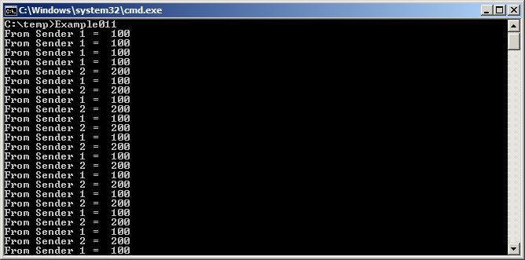

# 5 队列管理

## 5.1 简介

'队列' 提供了一种任务到任务、任务到中断以及中断到任务的通信机制。

### 5.1.1 范围

本章涵盖：

- 如何创建队列。
- 队列如何管理其包含的数据。
- 如何向队列发送数据。
- 如何从队列接收数据。
- 何为在队列上阻塞。
- 如何在多个队列上阻塞。
- 如何覆盖队列中的数据。
- 如何清空队列。
- 写入和读取队列时任务优先级的影响。

本章仅涵盖任务到任务的通信。第7章涵盖任务到中断和中断到任务的通信。

## 5.2 队列的特性

### 5.2.1 数据存储

队列可以容纳一定数量的固定大小的数据项[^8]。队列可以容纳的最大项目数称为其“长度”。创建队列时会设置队列的长度和每个数据项的大小。

[^8]: FreeRTOS消息缓冲区，在第TBD章中描述，为存储可变长度消息的队列提供了一种更轻量级的替代方案。

队列通常用作先进先出 (FIFO) 缓冲区，其中数据被写入队列的末尾（尾部），并从队列的前部（头部）移除。图 5.1 演示了数据被写入和读取到用作 FIFO 的队列中。 也可以将数据写入队列的前部，并覆盖队列前端已有的数据。

<a name="fig5.1" title="图 5.1 向队列写入和读取的示例序列"></a>

* * *
   
***图 5.1*** *向队列写入和读取的示例序列*
* * *

队列的行为可以通过两种方式实现：

1. 复制队列

   复制队列意味着发送到队列的数据被逐字节复制到队列中。

2. 引用队列

   引用队列意味着队列仅存储发送到队列的数据的指针，而不是数据本身。

FreeRTOS 使用复制队列的方法，因为它比引用队列更强大且更易于使用，原因如下：

- 复制队列不会阻止队列也被用于引用队列。 例如，当要排队的数据的大小使得将其复制到队列中变得不切实际时，可以将指向数据的指针复制到队列中。

- 可以直接将堆栈变量发送到队列，即使该变量在声明它的函数退出后将不再存在。

- 可以在不首先分配缓冲区来存储数据的情况下将数据发送到队列——然后将数据复制到已分配的缓冲区中，并排队指向该缓冲区的引用。

- 发送任务可以立即重用发送到队列的变量或缓冲区。

- 发送任务和接收任务完全解耦；应用程序设计者无需关心哪个任务“拥有”数据，或哪个任务负责释放数据。

- RTOS 负责分配用于存储数据的内存。

- 内存保护系统限制对 RAM 的访问，在这种情况下，引用队列只能在发送任务和接收任务都可以访问引用的数据时才能实现。 复制队列允许数据跨越内存保护边界。


### 5.2.2 多任务访问

队列本身就是独立的对象，并且可以被任何知道其存在性的任务或中断服务例程（ISR）访问。 任意数量的任务可以写入同一个队列，并且任意数量的任务可以从同一个队列读取。 在实践中，一个队列拥有多个写入者是很常见的，但拥有多个读取者的情况则不太常见。

### 5.2.3 队列读取阻塞

当任务尝试从队列读取数据时，可以选择指定一个“阻塞”时间。 这是任务为了等待队列中的数据可用而被置于阻塞状态的时间，如果队列当前为空的话。 当另一个任务或中断将数据放入队列时，处于阻塞状态等待数据可用的任务将自动移动到就绪状态。 如果指定阻塞时间在数据可用之前到期，任务也将自动从阻塞状态移动到就绪状态。

队列可以有多个读取器，因此一个队列可以有多个任务阻塞在其上等待数据。 在这种情况下，当数据可用时，只有一个任务会被唤醒。 被唤醒的任务始终是等待数据的最高优先级任务。 如果有两个或多个阻塞任务具有相同的优先级，则被唤醒的任务是等待时间最长的任务。


### 5.2.4 队列写入阻塞

与从队列读取时一样，任务在写入队列时可以选择指定一个阻塞时间。 在这种情况下，阻塞时间是任务为了等待队列中出现可用空间而被置于阻塞状态的最大时间，如果队列已经满的话。

队列可以有多个写入者，因此一个已满的队列可以有多个任务阻塞在其上等待完成发送操作。 在这种情况下，当队列中出现可用空间时，只有一个任务会被唤醒。 被唤醒的任务始终是等待空间的最高优先级任务。 如果有两个或多个阻塞任务具有相同的优先级，则被唤醒的任务是等待时间最长的任务。

### 5.2.5 在多个队列上阻塞

可以将队列分组到集合中，允许任务进入阻塞状态，等待集合中任何队列中的数据可用。 第5.6节，从多个队列接收，演示了队列集合。


### 5.2.6 创建队列：静态分配和动态分配队列

队列由句柄引用，句柄是 `QueueHandle_t` 类型的变量。 在使用队列之前，必须显式创建它。

有两个 API 函数可以创建队列：`xQueueCreate()` 和 `xQueueCreateStatic()`。

每个队列需要两个 RAM 块，第一个用于存储其数据结构，第二个用于存储排队的（queued）数据。 `xQueueCreate()` 从堆（动态地）分配所需的 RAM。 `xQueueCreateStatic()` 使用作为参数传递到函数中的预分配的 RAM。

## 5.3 使用队列

### 5.3.1 xQueueCreate() API 函数

列表 5.1 显示了 `xQueueCreate()` 函数原型。
`xQueueCreateStatic()` 有两个额外的参数，分别指向预分配的用于存储队列的数据结构和数据存储区域的内存。

<a name="list5.1" title="列表 5.1 xQueueCreate() API 函数原型"></a>

```c
QueueHandle_t xQueueCreate( UBaseType_t uxQueueLength, UBaseType_t uxItemSize );
```
***列表 5.1*** *xQueueCreate() API 函数原型*

**xQueueCreate() 参数和返回值：**

- `uxQueueLength`

  在任何给定时间，正在创建的队列可以容纳的最大项目数。

- `uxItemSize`

  存储在队列中的每个数据项的大小（以字节为单位）。

- 返回值

  如果返回 NULL，则无法创建队列，因为 FreeRTOS 无法为队列的数据结构和存储区域分配足够的堆内存。 第 2 章提供了有关 FreeRTOS 堆的更多信息。

  如果返回非 NULL 值，则队列已成功创建，并且返回的值是创建的队列的句柄。

`xQueueReset()` 是一个 API 函数，可以将先前创建的队列恢复为其原始的空状态。


### 5.3.2 xQueueSendToBack() 和 xQueueSendToFront() API 函数

正如预期的那样，`xQueueSendToBack()` 将数据发送到队列的尾部（尾部），而 `xQueueSendToFront()` 将数据发送到队列的前部（头部）。

`xQueueSend()` 等效于，并且完全相同于 `xQueueSendToBack()`。

> *注意：切勿从中断服务例程中调用 `xQueueSendToFront()` 或 `xQueueSendToBack()`。 应该使用中断安全版本 `xQueueSendToFrontFromISR()` 和 `xQueueSendToBackFromISR()` 代替。 这些内容在第 7 章中进行了描述。*

<a name="list5.2" title="列表 5.2 xQueueSendToFront() API 函数原型"></a>

```c
BaseType_t xQueueSendToFront( QueueHandle_t xQueue,
                              const void * pvItemToQueue,
                              TickType_t xTicksToWait );
```
***列表 5.2*** *xQueueSendToFront() API 函数原型*

<a name="list5.3" title="列表 5.3 xQueueSendToBack() API 函数原型"></a>

```c
BaseType_t xQueueSendToBack( QueueHandle_t xQueue,
                             const void * pvItemToQueue,
                             TickType_t xTicksToWait );
```
***列表 5.3*** *xQueueSendToBack() API 函数原型*

**xQueueSendToFront() 和 xQueueSendToBack() 函数参数和返回值**

- `xQueue`

  要向其发送（写入）数据的队列的句柄。 队列句柄将由对 `xQueueCreate()` 或 `xQueueCreateStatic()` 的调用返回，这些调用用于创建队列。

- `pvItemToQueue`

  指向要复制到队列中的数据的指针。

  队列可以容纳的每个项目的尺寸是在创建队列时设置的，因此将从 `pvItemToQueue` 复制指定字节数到队列存储区域。

- `xTicksToWait`

  任务应保持在 Blocked 状态中等待队列上出现可用空间的最大时间，如果队列已经满。

  如果 `xTicksToWait` 为零且队列已满，则 `xQueueSendToFront()` 和 `xQueueSendToBack()` 将立即返回。

  阻塞时间以滴答周期指定，因此它所代表的绝对时间取决于滴答频率。 可以使用宏 `pdMS_TO_TICKS()` 将以毫秒为单位指定的时间转换为以滴答为单位的时间。

  将 `xTicksToWait` 设置为 `portMAX_DELAY` 将导致任务无限期地等待（没有超时），前提是 `INCLUDE_vTaskSuspend` 在 FreeRTOSConfig.h 中设置为 1。

- 返回值

  有两种可能的返回值：

  - `pdPASS`

    当数据成功发送到队列时，将返回 `pdPASS`。

如果指定了阻塞时间（`xTicksToWait` 不为零），则有可能调用任务被置于 Blocked 状态，等待队列中出现可用空间，但在函数返回之前，数据已成功写入队列。

  - `errQUEUE_FULL` (与 `pdFAIL` 相同的值)

    如果由于队列已满而无法将数据写入队列，则返回 `errQUEUE_FULL`。

    如果指定了阻塞时间（`xTicksToWait` 不为零），则调用任务将被置于 Blocked 状态，等待另一个任务或中断在队列中腾出空间，但指定的阻塞时间在发生这种情况之前已过期。


### 5.3.3 xQueueReceive() API 函数

`xQueueReceive()` 函数接收（读取）队列中的一个项。接收到的项将从队列中移除。

> *注意：切勿从中断服务例程中调用 `xQueueReceive()`。中断安全函数 `xQueueReceiveFromISR()` 的 API 函数在第 7 章中进行了描述。*

<a name="list5.4" title="列表 5.4 xQueueReceive() API 函数原型"></a>

```c
BaseType_t xQueueReceive( QueueHandle_t xQueue,
                          void * const pvBuffer,
                          TickType_t xTicksToWait );
```
***列表 5.4*** *xQueueReceive() API 函数原型*


**xQueueReceive() 函数参数和返回值**

- `xQueue`

  从中接收（读取）数据的队列的句柄。该队列句柄将由用于创建队列的 `xQueueCreate()` 或 `xQueueCreateStatic()` 函数调用返回。

- `pvBuffer`

  指向将复制接收到的数据的内存区域的指针。

  队列中每个数据项的大小是在创建队列时设置的。`pvBuffer` 指向的内存必须至少足够大，以容纳那么多字节。

- `xTicksToWait`

  任务应在 Blocked 状态中等待数据在队列中可用时，允许的最大时间，如果队列已经为空。

  如果 `xTicksToWait` 为零，则如果队列已经为空，`xQueueReceive()` 将立即返回。

  阻塞时间以滴答周期为单位指定，因此它所代表的绝对时间取决于滴答频率。可以使用宏 `pdMS_TO_TICKS()` 将以毫秒为单位指定的时间转换为以滴答为单位的时间。

  将 `xTicksToWait` 设置为 `portMAX_DELAY` 将导致任务无限期地（在不超时的情况下）等待，前提是 `INCLUDE_vTaskSuspend` 在 FreeRTOSConfig.h 中设置为 1。

- 返回值

  有两种可能的返回值：

  - `pdPASS`

    当成功从队列中读取数据时，将返回 `pdPASS`。

    如果指定了阻塞时间（`xTicksToWait` 不为零），则有可能调用任务被置于 Blocked 状态，等待队列中出现数据，但在阻塞时间到期之前，数据已成功从队列中读取。

  - `errQUEUE_EMPTY` (与 `pdFAIL` 相同的值)

    如果由于队列为空而无法从队列中读取数据，则返回 `errQUEUE_EMPTY`。

    如果指定了阻塞时间（`xTicksToWait` 不为零），则调用任务将被置于 Blocked 状态，等待另一个任务或中断向队列发送数据，但在发生这种情况之前，阻塞时间已过期。


### 5.3.4 uxQueueMessagesWaiting() API 函数

`uxQueueMessagesWaiting()` 函数查询队列中当前的项目数量。

> *注意：切勿从中断服务例程中调用 `uxQueueMessagesWaiting()`。应使用中断安全函数 `uxQueueMessagesWaitingFromISR()` 来替代。*

<a name="list5.5" title="列表 5.5 uxQueueMessagesWaiting() API 函数原型"></a>

```c
UBaseType_t uxQueueMessagesWaiting( QueueHandle_t xQueue );
```
***列表 5.5*** *uxQueueMessagesWaiting() API 函数原型*


**uxQueueMessagesWaiting() 函数参数和返回值**

- `xQueue`

  正在查询的队列的句柄。该队列句柄将由用于创建队列的 `xQueueCreate()` 或 `xQueueCreateStatic()` 函数调用返回。

- 返回值

  正在查询的队列中当前的项目数量。如果返回零，则队列为空。


<a name="example5.1" title="示例 5.1 从队列接收时阻塞"></a>
---
***示例 5.1*** *从队列接收时阻塞*

---

此示例演示了创建队列、从多个任务向队列发送数据以及从队列接收数据。队列被创建以容纳 `int32_t` 类型的项目。向队列发送任务不指定阻塞时间，而从队列接收任务则指定了阻塞时间。

发送到队列的任务优先级低于从队列接收任务的优先级。这意味着队列中永远不应包含超过一个项目，因为一旦数据发送到队列，接收任务将解除阻塞，抢占发送任务（因为它具有更高的优先级），并移除数据，使队列再次变为空。

该示例创建了任务的两个实例，一个持续将值 100 发送到队列，另一个持续将值 200 发送到同一个队列。任务参数用于将这些值传递到每个任务实例。

<a name="list5.6" title="列表 5.6 示例 5.1 中使用的发送任务的实现"></a>

```c
static void vSenderTask( void *pvParameters )
{

    int32_t lValueToSend;

    BaseType_t xStatus;

    /* 创建了两个此任务的实例，因此发送到
       队列的值通过任务参数传递 - 这样每个实例都可以使用不同的值。队列被创建以容纳 int32_t 类型的数值，因此将参数转换为所需的类型。 */
    lValueToSend = ( int32_t ) pvParameters;

    /* 与大多数任务一样，此任务在无限循环中实现。 */
    for( ;; )
    {

        /* 将值发送到队列。

           第一个参数是要发送数据的队列。队列在调度器启动之前创建，因此在此
           任务开始执行之前。

           第二个参数是要发送的数据的地址，在本例中是 lValueToSend 的地址。

           第三个参数是阻塞时间 - 任务应保持在阻塞状态的时间，以等待队列中出现可用空间，如果队列已经满，则队列可能已经满。在本例中，未指定阻塞时间，因为队列永远不应包含超过一个项目，因此永远不应已满。 */
        xStatus = xQueueSendToBack( xQueue, &lValueToSend, 0 );

        if( xStatus != pdPASS )
        {
            /* 发送操作无法完成，因为队列已满-
               这必须是一个错误，因为队列永远不应包含超过一个项目！ */
            vPrintString( "Could not send to the queue.\r\n" );
        }
    }
}
```
***列表 5.6*** *Implementation of the sending task used in Example 5.1*


列表 5.7 显示了从队列接收数据的任务的实现。接收任务指定一个 100 毫秒的阻塞时间，然后进入阻塞状态以等待数据可用。当队列中有数据可用或 100 毫秒过去而没有数据可用时，它将离开阻塞状态。在此示例中，有两个任务持续写入队列，因此 100 毫秒的超时时间永远不会过期。

<a name="list5.7" title="列表 5.7 示例 5.1 的接收任务实现"></a>

```c
static void vReceiverTask( void *pvParameters )
{
    /* 声明一个变量，用于存储从
       队列接收到的值。 */
    int32_t lReceivedValue;
    BaseType_t xStatus;
    const TickType_t xTicksToWait = pdMS_TO_TICKS( 100 );

    /* 此任务也定义在无限循环中。 */
    for( ;; )
    {
        /* 由于此任务将立即删除写入队列的任何数据，因此此调用应该始终找到队列为空。 */
        if( uxQueueMessagesWaiting( xQueue ) != 0 )
        {
            vPrintString( "Queue should have been empty!\r\n" );
        }

        /* 从队列接收数据。

           第一个参数是要从中接收数据的队列。
           队列在调度器启动之前创建，因此
           此任务第一次运行之前。

           第二个参数是接收到的数据将要放置的缓冲区。在本例中，缓冲区只是一个变量的地址，该变量的大小足以容纳接收到的数据。

           最后一个参数是阻塞时间 - 任务将保持在阻塞状态的最长时间，以等待数据可用，如果队列已经为空，则需要等待数据可用。 */
        xStatus = xQueueReceive( xQueue, &lReceivedValue, xTicksToWait );

        if( xStatus == pdPASS )
        {
            /* 成功从队列接收到数据，打印接收到的值。 */
            vPrintStringAndNumber( "Received = ", lReceivedValue );
        }
        else
        {
            /* 即使等待了 100 毫秒，也无法从队列接收到数据。这必须是一个错误，因为发送任务正在自由运行并将持续写入队列。 */
            vPrintString( "Could not receive from the queue.\r\n" );
        }
    }
}
```
***列表 5.7***  *Implementation of the receiver task for Example 5.1*


列表 5.8 包含 `main()` 函数的定义。它只是
创建队列和三个任务，然后再启动调度器。队列被创建以容纳最多五个 `int32_t` 值，即使
相对任务优先级意味着队列一次永远不会容纳超过一个项目。

<a name="list5.8" title="列表 5.8 示例 5.1 中 main() 的实现"></a>

```c
/* 声明一个 QueueHandle_t 类型的变量。这用于存储所有三个任务访问的队列的句柄。 */
QueueHandle_t xQueue;

int main( void )
{
    /* 队列被创建以容纳最多 5 个值，每个值都足以容纳 int32_t 类型的变量。 */
    xQueue = xQueueCreate( 5, sizeof( int32_t ) );

    if( xQueue != NULL )
    {
        /* 创建两个将向队列发送任务的实例。任务参数用于传递任务将写入队列的值，因此一个任务将持续将 100 写入队列，而另一个任务将持续将 200 写入队列。这两个任务都以优先级 1 创建。 */
        xTaskCreate( vSenderTask, "Sender1", 1000, ( void * ) 100, 1, NULL );
        xTaskCreate( vSenderTask, "Sender2", 1000, ( void * ) 200, 1, NULL );

        /* 创建将从队列读取任务的任务。该任务以优先级 2 创建，高于发送任务的优先级。 */
        xTaskCreate( vReceiverTask, "Receiver", 1000, NULL, 2, NULL );

        /* 启动调度器，以便创建的任务开始执行。 */
        vTaskStartScheduler();
    }
    else
    {
        /* 无法创建队列。 */
    }

    /* 如果一切顺利，则 main() 将永远不会到达此处，因为调度器将运行任务。如果 main() 到达此处，则可能是由于空闲任务创建所需的 FreeRTOS 堆内存不足。第 3 章提供了有关堆内存管理的更多信息。 */
    for( ;; );
}
```
***列表 5.8*** *The implementation of main() in Example 5.1*

图 5.2 显示了示例 5.1 产生的输出。

<a name="fig5.2" title="图 5.2 执行示例 5.1 产生的输出"></a>

* * *
   
***图 5.2*** *执行示例 5.1 产生的输出*
* * *


图 5.3 演示了执行顺序。

<a name="fig5.3" title="图 5.3 示例 5.1 产生的执行顺序"></a>

* * *
   
***图 5.3*** *示例 5.1 产生的执行顺序*
* * *


## 5.4 从多个来源接收数据

在 FreeRTOS 设计中，任务从多个来源接收数据是很常见的。接收任务需要知道数据来自哪里，以便确定如何处理它。一种简单的设计模式是使用单个队列来传输包含数据值和数据源的结构，如图 5.4 所示。

<a name="fig5.4" title="图 5.4 结构通过队列发送的示例场景"></a>

* * *
   
***图 5.4*** *结构通过队列发送的示例场景*
* * *

参考图 5.4：

- 创建的队列包含 `Data_t` 类型的结构。该结构允许将数据值和枚举类型（指示数据含义）以一个消息的方式发送到队列。

- 一个中心控制器任务执行主要的系统功能。它必须对输入和系统状态的变化做出反应，这些变化通过队列传达给它。

- 一个 CAN 总线任务用于封装 CAN 总线接口功能。当 CAN 总线任务接收并解码了一条消息时，它将已解码的消息作为 `Data_t` 结构发送给控制器任务。传输结构的 `eDataID` 成员告诉控制器任务数据是什么。在本例中，它是一个电机速度值。传输结构的 `lDataValue` 成员告诉控制器任务实际的电机速度值。

- 一个人机界面 (HMI) 任务用于封装所有的人机界面功能。操作员可能可以通过多种方式输入命令和查询值，这些方式需要在 HMI 任务中检测和解释。当输入新的命令时，HMI 任务将命令作为 `Data_t` 结构发送给控制器任务。传输结构的 `eDataID` 成员告诉控制器任务数据是什么。在本例中，它是一个新的设定点值。传输结构的 `lDataValue` 成员告诉控制器任务实际的设定点值。

第 (RB-TBD) 章介绍了如何扩展此设计模式，以便控制器任务可以直接回复将结构排入队列的任务。

<a name="example5.2" title="Example 5.2 Blocking when sending to a queue, and sending structures on a queue"></a>
---
***示例 5.2*** *向队列发送时阻塞，以及在队列上发送结构*

---

示例 5.2 类似于示例 5.1，但任务优先级相反，因此接收任务的优先级低于发送任务。此外，创建的队列包含结构而不是整数。

清单 5.9 显示了示例 5.2 使用的结构的定义。

<a name="list5.9" title="Listing 5.9 The definition of the structure that is to be passed on a queue, plus the declaration of two variables for use by the example"></a>

```c
/* 定义一个枚举类型，用于标识数据的来源。 */
typedef enum
{
    eSender1,
    eSender2
} DataSource_t;

/* 定义将在队列上传递的结构类型。 */
typedef struct
{
    uint8_t ucValue;
    DataSource_t eDataSource;
} Data_t;

/* 声明两个类型为 Data_t 的变量，将在队列上传递。 */
static const Data_t xStructsToSend[ 2 ] =
{
    { 100, eSender1 }, /* 由 Sender1 使用。 */
    { 200, eSender2 }  /* 由 Sender2 使用。 */
};
```
***清单 5.9*** *将在队列上传递的结构的定义，以及用于示例的两个变量的声明*

在示例 5.1 中，接收任务具有最高优先级，因此队列中最多只有一个项目。这是因为接收任务在将数据放入队列中的第一时间抢占发送任务。在示例 5.2 中，发送任务具有更高的优先级，因此队列通常会满。这是因为，一旦接收任务从队列中删除一个项目，它就会被其中一个发送任务抢占，该发送任务立即重新填充队列。然后，发送任务重新进入阻塞状态，等待队列中出现可用空间。

清单 5.10 显示了发送任务的实现。发送任务指定阻塞时间为 100 毫秒，因此每次队列已满时，它都会进入阻塞状态，等待出现可用空间。当队列中出现可用空间或 100 毫秒过去而没有可用空间时，它会离开阻塞状态。在此示例中，接收任务会持续在队列中腾出空间，因此 100 毫秒超时永远不会过期。

<a name="list5.10" title="Listing 5.10 The implementation of the sending task for Example 5.2"></a>

```c
static void vSenderTask( void *pvParameters )
{
    BaseType_t xStatus;
    const TickType_t xTicksToWait = pdMS_TO_TICKS( 100 );

    /* 像大多数任务一样，此任务在无限循环中实现。 */
    for( ;; )
    {
        /* 发送到队列。

           第二个参数是发送结构的地址。地址作为任务参数传递，因此直接使用 pvParameters。

           第三个参数是阻塞时间 - 任务应在阻塞状态中等待，以在队列已满时等待队列中出现可用空间。指定阻塞时间是因为发送任务的优先级高于接收任务，因此预计队列会满。当两个发送任务都处于阻塞状态时，接收任务将从队列中删除项目。 */
        xStatus = xQueueSendToBack( xQueue, pvParameters, xTicksToWait );

        if( xStatus != pdPASS )
        {
            /* 发送操作无法完成，即使等待了 100 毫秒。这必须是一个错误，因为接收任务应该在两个发送任务都处于阻塞状态时在队列中腾出空间。 */
            vPrintString( "Could not send to the queue.\r\n" );
        }
    }
}
```
***清单 5.10*** *The implementation of the sending task for Example 5.2*


接收任务具有最低优先级，因此只有当两个发送任务都处于阻塞状态时才会运行。发送任务只有在队列已满时才会进入阻塞状态，因此接收任务只有在队列已满时才会执行。因此，它总是期望接收数据，即使它没有指定阻塞时间。

清单 5.11 显示了接收任务的实现。

<a name="list5.11" title="Listing 5.11 The definition of the receiving task for Example 5.2"></a>

```c
static void vReceiverTask( void *pvParameters )
{
    /* 声明一个结构体，用于存储从队列接收到的值。 */
    Data_t xReceivedStructure;
    BaseType_t xStatus;

    /* 此任务也定义在无限循环中。 */
    for( ;; )
    {
        /* 由于它具有最低优先级，此任务只有在发送任务处于阻塞状态时才会运行。发送任务只有在队列已满时才会进入阻塞状态，因此此任务总是期望队列中的项目数量等于队列长度，在本例中为 3。 */
        if( uxQueueMessagesWaiting( xQueue ) != 3 )
        {
            vPrintString( "Queue should have been full!\r\n" );
        }

        /* 从队列接收。

           第二个参数是接收到的数据将要放置的缓冲区。在本例中，缓冲区只是一个变量的地址，该变量的大小足以容纳接收到的结构体。

           最后一个参数是阻塞时间 - 任务将保持在阻塞状态的最长时间，以等待数据在队列为空时可用。在本例中，不需要阻塞时间，因为此任务只有在队列已满时才会运行。 */
        xStatus = xQueueReceive( xQueue, &xReceivedStructure, 0 );

        if( xStatus == pdPASS )
        {
            /* 成功从队列接收到数据，打印接收到的值和值的来源。 */
            if( xReceivedStructure.eDataSource == eSender1 )
            {
                vPrintStringAndNumber( "From Sender 1 = ", 
                                       xReceivedStructure.ucValue );
            }
            else
            {
                vPrintStringAndNumber( "From Sender 2 = ", 
                                       xReceivedStructure.ucValue );
            }
        }
        else
        {
            /* 没有从队列接收到任何数据。这必须是一个错误，因为此任务应该只有在队列已满时才会运行。 */
            vPrintString( "Could not receive from the queue.\r\n" );
        }
    }
}
```
***清单 5.11*** *The definition of the receiving task for Example 5.2*

`main()` 的更改仅略有不同。创建队列以容纳三个 `Data_t` 结构体，并且发送任务和接收任务的优先级被反转。清单 5.12 显示了 `main()` 的实现。

<a name="list5.12" title="Listing 5.12 The implementation of main() for Example 5.2"></a>

```c
int main( void )
{
    /* 创建一个队列，用于存储最多 3 个 Data_t 类型的结构体。 */
    xQueue = xQueueCreate( 3, sizeof( Data_t ) );

    if( xQueue != NULL )
    {
        /* 创建两个将向队列写入任务的实例。参数用于传递任务将要写入队列的结构体，因此一个任务将持续将 xStructsToSend[ 0 ] 发送到队列，而另一个任务将持续将 xStructsToSend[ 1 ] 发送到队列。这两个任务都以优先级 2 创建，高于接收器的优先级。 */
        xTaskCreate( vSenderTask, "Sender1", 1000, &( xStructsToSend[ 0 ] ),
                     2, NULL );
        xTaskCreate( vSenderTask, "Sender2", 1000, &( xStructsToSend[ 1 ] ),
                     2, NULL );

        /* 创建将从队列读取任务的任务。该任务以优先级 1 创建，低于发送任务的优先级。 */
        xTaskCreate( vReceiverTask, "Receiver", 1000, NULL, 1, NULL );

        /* 启动调度器，以便创建的任务开始执行。 */
        vTaskStartScheduler();
    }
    else
    {
        /* 无法创建队列。 */
    }

    /* 如果一切顺利，则 main() 将永远不会到达此处，因为调度器将运行任务。如果 main() 到达此处，则很可能没有足够的堆内存来创建空闲任务。第 3 章提供了有关堆内存管理的更多信息。 */
    for( ;; );
}
```
***清单 5.12*** *The implementation of main() for Example 5.2*

图 5.5 显示了示例 5.2 产生的输出。

<a name="fig5.5" title="Figure 5.5 The output produced by Example 5.2"></a>

* * *
   
***图 5.5*** *The output produced by Example 5.2*
* * *

图 5.6 演示了由于发送任务的优先级高于接收任务的优先级而产生的执行序列。以下是对图 5.6 的进一步解释，以及描述为什么最初的四个消息都来自同一个任务。

<a name="fig5.6" title="Figure 5.6 The sequence of execution produced by Example 5.2"></a>

* * *
   
***图 5.6*** *The sequence of execution produced by Example 5.2*
* * *

**图 5.6 关键**

- t1

  任务 Sender 1 执行并将 3 个数据项发送到队列。

- t2

  队列已满，因此 Sender 1 进入 Blocked 状态，等待其下一个发送完成。任务 Sender 2 现在是能够运行的最高优先级任务，因此它进入 Running 状态。

- t3

  任务 Sender 2 发现队列已经满了，因此它进入 Blocked 状态，等待其第一个发送完成。任务 Receiver 现在是能够运行的最高优先级任务，因此它进入 Running 状态。

- t4

  两个优先级高于接收任务的优先级任务正在等待队列空间可用，导致接收任务在从队列中移除一个项目后立即被抢占。任务 Sender 1 和 Sender 2 具有相同的优先级，因此调度器选择等待时间最长的任务进入 Running 状态——在本例中是任务 Sender 1。

- t5

  任务 Sender 1 将另一个数据项发送到队列。队列中只有一个空间，因此任务 Sender 1 进入 Blocked 状态，等待其下一个发送完成。任务 Receiver 再次是能够运行的最高优先级任务，因此它进入 Running 状态。

  任务 Sender 1 现在已经向队列发送了四个项目，而任务 Sender 2 仍在等待发送其第一个项目到队列。

- t6

  两个优先级高于接收任务的优先级任务正在等待队列空间可用，因此接收任务在从队列中移除一个项目后立即被抢占。这次 Sender 2 等待的时间比 Sender 1 长，因此 Sender 2 进入 Running 状态。

- t7

  任务 Sender 2 将一个数据项发送到队列。队列中只有一个空间，因此 Sender 2 进入 Blocked 状态，等待其下一个发送完成。任务 Sender 1 和 Sender 2 都正在等待队列空间可用，因此任务 Receiver 是唯一可以进入 Running 状态的任务。

## 5.5 处理大型或可变大小的数据

### 5.5.1 队列指针

如果存储在队列中的数据量很大，那么最好使用队列来传输指向数据的指针，而不是将数据本身逐字节地复制进出队列。传输指针在处理时间和创建队列所需的 RAM 方面都更有效。但是，在队列指针时，必须格外小心以确保：

- 指针指向的 RAM 的所有者是明确定义的。

  当通过指针在任务之间共享内存时，务必确保两个任务都不同时修改内存内容，或采取任何可能导致内存内容无效或不一致的任何其他操作。理想情况下，只有发送任务才能在指针发送到队列之前访问内存，只有接收任务才能在从队列接收到指针后访问内存。

- 指针指向的 RAM 保持有效。

  如果指针指向的内存是动态分配的，或者从预分配的缓冲区池中获取的，那么应该只有一个任务负责释放内存。任何任务都不应该尝试在内存释放后访问该内存。

  指针绝不应该用于访问在任务栈上分配的数据。当栈帧发生变化后，数据将不再有效。

  例如，清单 5.13、5.14 和 5.15 演示了如何使用队列将缓冲区指针从一个任务发送到另一个任务：

- 清单 5.13 创建了一个可以容纳多达 5 个指针的队列。

- 清单 5.14 分配一个缓冲区，将字符串写入缓冲区，然后将指向缓冲区的指针发送到队列。

- 清单 5.15 从队列接收指向缓冲区的指针，然后打印缓冲区中包含的字符串。

<a name="list5.13" title="清单 5.13 创建一个持有指针的队列"></a>

```c
/* 声明一个类型为 QueueHandle_t 的变量来保存正在创建的队列的句柄。 */
QueueHandle_t xPointerQueue;

/* 创建一个可以容纳最多 5 个指针的队列，在本例中为字符指针。 */
xPointerQueue = xQueueCreate( 5, sizeof( char * ) );
```
***清单 5.13*** *创建持有指针的队列*

<a name="list5.14" title="清单 5.14 使用队列发送指向缓冲区的指针"></a>

```c
/* 一个任务，它获取一个缓冲区，将字符串写入缓冲区，然后将缓冲区的地址发送到清单 5.13 中创建的队列。 */
void vStringSendingTask( void *pvParameters )
{
    char *pcStringToSend;
    const size_t xMaxStringLength = 50;
    BaseType_t xStringNumber = 0;

    for( ;; )
    {
        /* 获取一个至少有 xMaxStringLength 个字符大的缓冲区。
           prvGetBuffer() 的实现未显示 - 它可能从预分配的缓冲区池中获取
           缓冲区，或者只是动态分配缓冲区。 */
        pcStringToSend = ( char * ) prvGetBuffer( xMaxStringLength );

        /* 将字符串写入缓冲区。 */
        snprintf( pcStringToSend, xMaxStringLength, "String number %d\r\n",
                  xStringNumber );

        /* 递增计数器，以便在任务的每次迭代中字符串不同。 */
        xStringNumber++;

        /* 将缓冲区的地址发送到清单 5.13 中创建的队列。 缓冲区的地址存储在
           pcStringToSend 变量中。*/
        xQueueSend( xPointerQueue,   /* 队列的句柄。 */
                    &pcStringToSend, /* 指向缓冲区的指针的地址。 */
                    portMAX_DELAY );
    }
}
```
***清单 5.14*** *使用队列发送指向缓冲区的指针*

<a name="list5.15" title="清单 5.15 使用队列接收指向缓冲区的指针"></a>

```c
/* 一个任务，它从清单 5.13 中创建的队列接收缓冲区的地址，并在清单 5.14 中写入。 缓冲区包含一个
   字符串，该字符串被打印出来。 */

void vStringReceivingTask( void *pvParameters )
{
    char *pcReceivedString;

    for( ;; )
    {
        /* 接收缓冲区的地址。 */
        xQueueReceive( xPointerQueue,     /* 队列的句柄。 */
                       &pcReceivedString, /* 将缓冲区的地址存储在
                                             pcReceivedString 中。 */
                       portMAX_DELAY );

        /* 缓冲区包含一个字符串，打印它出来。 */
        vPrintString( pcReceivedString );

        /* 缓冲区不再需要 - 释放它，以便它可以被释放或重新使用。 */
        prvReleaseBuffer( pcReceivedString );
    }
}
```
***清单 5.15*** *使用队列接收指向缓冲区的指针*


### 5.5.2 使用队列发送不同类型和长度的数据[^9]

[^9]: FreeRTOS 消息缓冲区是队列的更轻量级替代方案，用于存储可变长度的数据。

本书前面的章节演示了两种强大的设计模式：将结构体发送到队列，以及将指针发送到队列。 结合这些技术，允许一个任务使用单个队列接收来自任何数据源的任何数据类型。 FreeRTOS+TCP TCP/IP 堆栈的实现提供了一个实际的例子，说明如何实现这一点。

TCP/IP 堆栈，它在自己的任务中运行，必须处理来自许多不同来源的事件。 不同类型的事件与不同类型和长度的数据相关联。 `IPStackEvent_t` 结构体描述了 TCP/IP 任务外部发生的所有事件，并将其发送到 TCP/IP 任务的队列中。 清单 5.16 显示了 `IPStackEvent_t` 结构体。 `pvData` 成员是 `IPStackEvent_t` 结构体中的一个指针，可以用于直接保存一个值，也可以指向一个缓冲区。

<a name="list5.16" title="清单 5.16 在 FreeRTOS+TCP 中用于向 TCP/IP 堆栈任务发送事件的结构"></a>

```c
/* TCP/IP 堆栈中用于标识事件的枚举类型的一个子集。 */
typedef enum
{
    eNetworkDownEvent = 0, /* 网络接口已丢失，或需要 (重新) 连接。 */
    eNetworkRxEvent,       /* 从网络接收到数据包。 */
    eTCPAcceptEvent,       /* 调用 FreeRTOS_accept() 以接受或等待新的客户端。 */

/* 其他事件类型会在此处出现，但未在此清单中显示。 */

} eIPEvent_t;

/* 描述事件并将其作为队列发送到 TCP/IP 任务的结构。 */
typedef struct IP_TASK_COMMANDS
{
    /* 一个枚举类型，用于标识事件。请参阅上面的 eIPEvent_t 定义。 */
    eIPEvent_t eEventType;

    /* 一个通用指针，可以保存一个值，或指向一个缓冲区。 */
    void *pvData;

} IPStackEvent_t;
```
***清单 5.16*** *在 FreeRTOS+TCP 中用于向 TCP/IP 堆栈任务发送事件的结构*

示例 TCP/IP 事件及其关联的数据包括：

- `eNetworkRxEvent`: 从网络接收到数据包。

网络接口使用 `IPStackEvent_t` 类型的结构向 TCP/IP 任务发送接收到的数据事件。该结构的 `eEventType` 成员设置为 `eNetworkRxEvent`，该结构的 `pvData` 成员用于指向包含接收到的数据的缓冲区。清单 59 显示了一个伪代码示例。

<a name="list5.17" title="清单 5.17 伪代码展示如何使用 IPStackEvent_t 结构将从网络接收到的数据发送到 TCP/IP 任务"></a>

```c
void vSendRxDataToTheTCPTask( NetworkBufferDescriptor_t *pxRxedData )
{
    IPStackEvent_t xEventStruct;

    /* 完成 IPStackEvent_t 结构。接收到的数据存储在 pxRxedData 中。 */
    xEventStruct.eEventType = eNetworkRxEvent;
    xEventStruct.pvData = ( void * ) pxRxedData;

    /* 将 IPStackEvent_t 结构发送到 TCP/IP 任务。 */
    xSendEventStructToIPTask( &xEventStruct );
}
```
***清单 5.17*** *伪代码展示如何使用 IPStackEvent_t 结构将从网络接收到的数据发送到 TCP/IP 任务*

- `eTCPAcceptEvent`: 一个套接字需要接受或等待来自客户端的连接。

调用 `FreeRTOS_accept()` 的任务使用 `IPStackEvent_t` 类型的结构向 TCP/IP 任务发送接受事件。该结构的 `eEventType` 成员设置为 `eTCPAcceptEvent`，该结构的 `pvData` 成员设置为正在接受连接的套接字的句柄。清单 5.18 显示了一个伪代码示例。

<a name="list5.18" title="清单 5.18 伪代码展示如何使用 IPStackEvent_t 结构将正在接受连接的套接字的句柄发送到 TCP/IP 任务"></a>

```c
void vSendAcceptRequestToTheTCPTask( Socket_t xSocket )
{
    IPStackEvent_t xEventStruct;

    /* 完成 IPStackEvent_t 结构。 */
    xEventStruct.eEventType = eTCPAcceptEvent;
    xEventStruct.pvData = ( void * ) xSocket;

    /* 将 IPStackEvent_t 结构发送到 TCP/IP 任务。 */
    xSendEventStructToIPTask( &xEventStruct );
}
```
***清单 5.18*** *伪代码展示如何使用 IPStackEvent_t 结构将正在接受连接的套接字的句柄发送到 TCP/IP 任务*

- `eNetworkDownEvent`: 网络需要连接或重新连接。

网络接口使用 `IPStackEvent_t` 类型的结构向 TCP/IP 任务发送网络关闭事件。该结构的 `eEventType` 成员设置为 `eNetworkDownEvent`。网络关闭事件不与任何数据关联，因此该结构的 `pvData` 成员未使用。清单 5.19 显示了一个伪代码示例。

<a name="list5.19" title="清单 5.19 伪代码展示如何使用 IPStackEvent_t 结构将网络关闭事件发送到 TCP/IP 任务"></a>

```c
void vSendNetworkDownEventToTheTCPTask( Socket_t xSocket )
{
    IPStackEvent_t xEventStruct;

    /* 完成 IPStackEvent_t 结构。 */
    xEventStruct.eEventType = eNetworkDownEvent;

    xEventStruct.pvData = NULL; /* 未使用，但设置为 NULL 以供 */

    /* 将 IPStackEvent_t 结构发送到 TCP/IP 任务。 */
    xSendEventStructToIPTask( &xEventStruct );
}
```
***清单 5.19*** *伪代码展示如何使用 IPStackEvent_t 结构将网络关闭事件发送到 TCP/IP 任务*

清单 5.20 显示了 TCP/IP 任务中接收和处理这些事件的代码。可以发现，从队列接收到的 `IPStackEvent_t` 结构中的 `eEventType` 成员用于确定如何解释 `pvData` 成员。

<a name="list5.20" title="清单 5.20 伪代码展示如何接收和处理 IPStackEvent_t 结构"></a>

  ```c
  IPStackEvent_t xReceivedEvent;

  /* 在网络事件队列上阻塞，直到接收到事件或在未接收到事件的情况下经过 xNextIPSleep 个时钟周期。如果调用 xQueueReceive() 返回是因为超时而不是因为接收到事件，则将 eEventType 设置为 eNoEvent。 */
  xReceivedEvent.eEventType = eNoEvent;
  xQueueReceive( xNetworkEventQueue, &xReceivedEvent, xNextIPSleep );

  /* 接收到哪个事件，如果有的话？ */
  switch( xReceivedEvent.eEventType )
  {
      case eNetworkDownEvent :
           /* 尝试重新建立连接。此事件不与任何数据关联。 */
           prvProcessNetworkDownEvent();
           break;

      case eNetworkRxEvent:
           /* 网络接口已接收到一个新数据包。接收到的数据的指针存储在接收到的 IPStackEvent_t 结构的 pvData 成员中。处理接收到的数据。 */
           prvHandleEthernetPacket( ( NetworkBufferDescriptor_t * )
                                    ( xReceivedEvent.pvData ) );
           break;

      case eTCPAcceptEvent:
           /* 调用了 FreeRTOS_accept() API 函数。正在接受连接的套接字的句柄存储在接收到的 IPStackEvent_t 结构的 pvData 成员中。 */
           xSocket = ( FreeRTOS_Socket_t * ) ( xReceivedEvent.pvData );
           xTCPCheckNewClient( xSocket );
           break;

      /* 其他事件类型以相同的方式进行处理，但此处未显示。 */

  }
  ```
  ***清单 5.20*** *伪代码展示如何接收和处理 IPStackEvent_t 结构*


## 5.6 从多个队列接收数据

### 5.6.1 队列集合

通常，应用程序设计需要单个任务接收不同大小的数据、具有不同含义的数据以及来自不同来源的数据。上一节演示了如何使用接收结构的单个队列以整洁有效的方式实现此目的。然而，有时应用程序的设计者会受到限制，这些限制会限制他们的设计选择，从而需要为某些数据源使用单独的队列。例如，集成到设计中的第三方代码可能假设存在专用的队列。在这种情况下，可以使用“队列集合”。

队列集合允许任务从多个队列接收数据，而无需依次轮询每个队列以确定其中是否包含数据。

使用队列集合从多个来源接收数据的设计，不如使用单个队列接收结构来实现相同功能的单个队列设计整洁且高效。因此，仅在设计约束使使用队列集合绝对必要时才建议使用队列集合。

以下部分描述了如何使用队列集合：

- 创建队列集合。

- 将队列添加到集合中。

  信号量也可以添加到队列集合中。信号量将在本书的后面部分进行描述。

- 从队列集合中读取以确定集合中的哪些队列包含数据。

  当集合中的队列接收到数据时，接收队列的句柄会发送到队列集合，并在任务调用读取队列集合的函数时返回。因此，如果队列集合返回队列句柄，则已知该句柄引用的队列包含数据，任务可以直接从此队列读取数据。

  > *注意：如果队列是队列集合的成员，则必须在从队列集合接收到队列句柄后从该队列读取，并且不得在接收到队列句柄之前从该队列读取。*

队列集合功能由在 FreeRTOSConfig.h 中将编译时配置常量 `configUSE_QUEUE_SETS` 设置为 1 启用。


### 5.6.2 `xQueueCreateSet()` API 函数

在使用队列集合之前，必须显式地创建它。截至目前，没有 `xQueueCreateSetStatic()` 的实现。但是，队列集合本身就是队列，因此可以使用精心设计的对 `xQueueCreateStatic()` 的调用来使用预分配的内存创建集合。

队列集合由句柄引用，句柄是 `QueueSetHandle_t` 类型的变量。`xQueueCreateSet()` API 函数创建一个队列集合并返回一个 `QueueSetHandle_t`，该句柄引用创建的队列集合。

<a name="list5.21" title="列表 5.21 `xQueueCreateSet()` API 函数原型"></a>

```c
QueueSetHandle_t xQueueCreateSet( const UBaseType_t uxEventQueueLength);
```
***列表 5.21*** *`xQueueCreateSet()` API 函数原型*


**`xQueueCreateSet()` 参数和返回值**

- `uxEventQueueLength`

  当队列集合中的队列接收到数据时，接收队列的句柄会发送到队列集合。
  `uxEventQueueLength` 定义了创建的队列集合在任何给定时间可以容纳的最大队列句柄数。

  队列句柄仅在集合中的队列接收到数据时才发送到队列集合。如果队列已满，则队列无法接收数据，因此如果集合中的所有队列都已满，则无法将任何队列句柄发送到队列集合。因此，队列集合在任何给定时间的最大项目数是集合中每个队列的长度之和。

  例如，如果集合中有三个空队列，并且每个队列的长度为五，那么集合中的队列总共可以接收到十五个项目（三个队列乘以每个队列的五个项目）。在此示例中，必须将 `uxEventQueueLength` 设置为十五，以保证队列集合可以接收到发送给它的每个项目。

  信号量也可以添加到队列集合中。信号量将在本书的后面部分进行介绍。在计算必要的 `uxEventQueueLength` 的目的中，二进制信号量的长度为一，互斥锁的长度为一，计数信号量的长度由信号量的最大计数值给出。

  例如，如果队列集合将包含一个长度为三的队列和一个二进制信号量（长度为一），则 `uxEventQueueLength` 必须设置为四（三加一）。

- 返回值

  如果返回 NULL，则无法创建队列集合，因为 FreeRTOS 无法为队列集合的数据结构和存储区域分配足够的堆内存。第 3 章提供了有关 FreeRTOS 堆的更多信息。

  如果返回非 NULL 值，则队列集合已成功创建，并且返回的值是创建的队列集合的句柄。


### 5.6.3 `xQueueAddToSet()` API 函数

`xQueueAddToSet()` 将队列或信号量添加到队列集合中。信号量将在本书的后面部分进行描述。

<a name="list5.22" title="列表 5.22 `xQueueAddToSet()` API 函数原型"></a>

```c
BaseType_t xQueueAddToSet( QueueSetMemberHandle_t xQueueOrSemaphore,
                           QueueSetHandle_t xQueueSet );
```
***列表 5.22*** *`xQueueAddToSet()` API 函数原型*

**`xQueueAddToSet()` 参数和返回值**

- `xQueueOrSemaphore`

  正在添加到队列集合中的队列或信号量的句柄。

  队列句柄和信号量句柄都可以转换为 `QueueSetMemberHandle_t` 类型。

- `xQueueSet`

  正在将队列或信号量添加到的队列集合的句柄。

- 返回值

  有两种可能的返回值：

  1. `pdPASS`

      这表示队列集合创建成功。

  1. `pdFAIL`

     这表示无法将队列或信号量添加到队列集合中。

  队列和二进制信号量只能在它们为空时添加到集合中。计数信号量只能在其计数为零时添加到集合中。队列和信号量一次只能是其中一个集合的成员。


### 5.6.4 `xQueueSelectFromSet()` API 函数

`xQueueSelectFromSet()` 从队列集合中读取队列句柄。

当队列集合中的队列或信号量接收到数据时，接收到的队列或信号量的句柄会发送到队列集合中，并在任务调用 `xQueueSelectFromSet()` 时返回。如果从 `xQueueSelectFromSet()` 的调用中返回了句柄，则表示由该句柄引用的队列或信号量包含数据，并且调用任务必须直接从队列或信号量中读取数据。

> *注意：除非队列或信号量的句柄首先从 `xQueueSelectFromSet()` 的调用中返回，否则不要从队列集合中的队列或信号量中读取数据。每次队列句柄或信号量句柄从 `xQueueSelectFromSet()` 的调用中返回时，只从队列或信号量中读取一个项目。*

<a name="list5.23" title="列表 5.23 `xQueueSelectFromSet()` API 函数原型"></a>

```c
QueueSetMemberHandle_t xQueueSelectFromSet( QueueSetHandle_t xQueueSet,
                                            const TickType_t xTicksToWait );
```
***列表 5.23*** *The xQueueSelectFromSet() API function prototype*

**`xQueueSelectFromSet()` 参数和返回值**

- `xQueueSet`

  正在从中接收（读取）队列句柄或信号量句柄的队列集合的句柄。该队列集合句柄将由用于创建队列集合的 `xQueueCreateSet()` 的调用返回。

- `xTicksToWait`

  调用任务应保持在阻塞状态等待从队列集合中接收队列或信号量句柄的最大时间，如果队列集合中的所有队列和信号量都为空。

  如果 `xTicksToWait` 为零，则当队列集合中的所有队列和信号量都为空时，`xQueueSelectFromSet()` 将立即返回。

  阻塞时间以滴答周期为单位指定，因此它所代表的绝对时间取决于滴答频率。可以使用宏 `pdMS_TO_TICKS()` 将以毫秒为单位指定的时间转换为以滴答为单位指定的时间。

  将 `xTicksToWait` 设置为 `portMAX_DELAY` 会导致任务无限期等待（没有超时），前提是 `INCLUDE_vTaskSuspend` 在 FreeRTOSConfig.h 中设置为 1。

- 返回值

  非 NULL 的返回值将是已知包含数据的队列或信号量的句柄。如果指定了阻塞时间（`xTicksToWait` 不是零），则有可能调用任务被置于阻塞状态以等待集合中队列或信号量中的数据可用，但在阻塞时间到期之前，已成功从队列集合中读取了句柄。句柄作为 `QueueSetMemberHandle_t` 类型返回，可以将其转换为 `QueueHandle_t` 类型或 `SemaphoreHandle_t` 类型。

如果返回值是 NULL，则无法从队列集合中读取句柄。如果指定了阻塞时间（`xTicksToWait` 不是零），则调用任务被置于阻塞状态，等待另一个任务或中断向集合中的队列或信号量发送数据，但阻塞时间在发生这种情况之前已过期。


<a name="example5.3" title="Example 5.3 Using a Queue Set"></a>
---
***示例 5.3*** *使用队列集合</i></h3>

---

此示例创建两个发送任务和一个接收任务。发送任务将数据发送到接收任务的两个单独队列，每个任务一个队列。这两个队列被添加到队列集合中，接收任务从队列集合中读取以确定哪个队列包含数据。

任务、队列和队列集合都在 `main()` 中创建——请参阅清单 5.24 了解其实现。

<a name="list5.24" title="清单 5.24 示例 5.3 的 main() 实现"></a>

```c
/* 声明两个 QueueHandle_t 类型的变量。这两个队列都添加到同一个队列集合中。 */
static QueueHandle_t xQueue1 = NULL, xQueue2 = NULL;

/* 声明一个 QueueSetHandle_t 类型的变量。这是将两个队列添加到的队列集合。 */
static QueueSetHandle_t xQueueSet = NULL;

int main( void )
{
    /* 创建两个队列，它们都发送字符指针。接收任务的优先级高于发送任务的优先级，因此队列中任何时候最多只有一个项目*/
    xQueue1 = xQueueCreate( 1, sizeof( char * ) );
    xQueue2 = xQueueCreate( 1, sizeof( char * ) );

    /* 创建队列集合。将两个队列添加到集合中，每个队列可以包含 1 个项目，因此队列集合在任何时候最多需要容纳 2 个队列句柄（2 个队列乘以每个队列 1 个项目）。 */
    xQueueSet = xQueueCreateSet( 1 * 2 );

    /* 将两个队列添加到集合中。 */
    xQueueAddToSet( xQueue1, xQueueSet );
    xQueueAddToSet( xQueue2, xQueueSet );

    /* 创建发送到队列的任务。 */
    xTaskCreate( vSenderTask1, "Sender1", 1000, NULL, 1, NULL );
    xTaskCreate( vSenderTask2, "Sender2", 1000, NULL, 1, NULL );

    /* 创建一个任务，该任务从队列集合中读取以确定哪个队列包含数据。 */
    xTaskCreate( vReceiverTask, "Receiver", 1000, NULL, 2, NULL );

    /* 启动调度器，以便创建的任务开始执行。 */
    vTaskStartScheduler();

    /* 通常，vTaskStartScheduler() 不会返回，因此以下行将永远不会执行。 */
    for( ;; );
    return 0;
}
```
***清单 5.24*** *示例 5.3 的 main() 实现*

第一个发送任务每 100 毫秒使用 `xQueue1` 向接收任务发送一个字符指针。第二个发送任务每 200 毫秒使用 `xQueue2` 向接收任务发送一个字符指针。字符指针指向标识发送任务的字符串。清单 5.25 显示了这两个任务的实现。

<a name="list5.25" title="示例 5.3 中使用的发送任务"></a>

```c
void vSenderTask1( void *pvParameters )
{
    const TickType_t xBlockTime = pdMS_TO_TICKS( 100 );
    const char * const pcMessage = "Message from vSenderTask1\r\n";

    /* 像大多数任务一样，此任务在无限循环中实现。 */

    for( ;; )
    {

        /* 阻塞 100 毫秒。 */
        vTaskDelay( xBlockTime );

        /* 将此任务的字符串发送到 xQueue1。即使队列只能容纳一个项目，也不需要使用阻塞时间。这是因为读取队列的任务的优先级高于此任务的优先级；一旦此任务写入队列，它就会被读取队列的任务抢占，因此在 xQueueSend() 调用返回之前，队列将再次为空。阻塞时间设置为 0。 */
        xQueueSend( xQueue1, &pcMessage, 0 );
    }
}

/*-----------------------------------------------------------*/

void vSenderTask2( void *pvParameters )
{
    const TickType_t xBlockTime = pdMS_TO_TICKS( 200 );
    const char * const pcMessage = "Message from vSenderTask2\r\n";

    /* 像大多数任务一样，此任务在无限循环中实现。 */
    for( ;; )
    {
        /* 阻塞 200 毫秒。 */
        vTaskDelay( xBlockTime );

        /* 将此任务的字符串发送到 xQueue2。即使队列只能容纳一个项目，也不需要使用阻塞时间。这是因为读取队列的任务的优先级高于此任务的优先级；一旦此任务写入队列，它就会被读取队列的任务抢占，因此在 xQueueSend() 调用返回之前，队列将再次为空。阻塞时间设置为 0。 */
        xQueueSend( xQueue2, &pcMessage, 0 );
    }
}
```
***清单 5.25*** *示例 5.3 中使用的发送任务*

发送任务写入的队列是同一队列集合的成员。每次任务发送到其中一个队列时，队列句柄都会发送到队列集合。接收任务调用 `xQueueSelectFromSet()` 从队列集合中读取队列句柄。接收任务从集合中接收到队列句柄后，它就知道由接收到的句柄引用的队列包含数据，因此它直接从队列中读取数据。它从队列中读取的数据是指向字符串的指针，接收任务将其打印出来。

如果 `xQueueSelectFromSet()` 调用超时，则返回 NULL。在示例 5.3 中，`xQueueSelectFromSet()` 使用无限阻塞时间调用，因此它永远不会超时，只能返回有效的队列句柄。因此，接收任务不需要检查 `xQueueSelectFromSet()` 是否返回 NULL，然后再使用返回的值。

`xQueueSelectFromSet()` 仅当由句柄引用的队列包含数据时才返回队列句柄，因此在从队列读取时不需要使用阻塞时间。

清单 5.26 显示了接收任务的实现。

<a name="list5.26" title="清单 5.26 示例 5.3 中使用的接收任务"></a>

```c
void vReceiverTask( void *pvParameters )
{
    QueueHandle_t xQueueThatContainsData;
    char *pcReceivedString;

    /* 像大多数任务一样，此任务在无限循环中实现。 */
    for( ;; )
    {
        /* 在队列集合上阻塞，等待集合中的一个队列包含数据。将从 xQueueSelectFromSet() 返回的 QueueSetMemberHandle_t 值转换为 QueueHandle_t，因为已知集合的所有成员都是队列（队列集合不包含任何信号量）。 */
        xQueueThatContainsData = ( QueueHandle_t ) xQueueSelectFromSet(
                                                     xQueueSet, portMAX_DELAY );

        /* 使用无限阻塞时间从队列集合读取，因此 xQueueSelectFromSet() 只有在集合中的一个队列包含数据时才会返回，并且 xQueueThatContainsData 不可能为 NULL。从队列读取。由于已知队列包含数据，因此不需要指定阻塞时间。阻塞时间设置为 0。 */
        xQueueReceive( xQueueThatContainsData, &pcReceivedString, 0 );

        /* 打印从队列接收到的字符串。 */
        vPrintString( pcReceivedString );
    }
}
```
***清单 5.26*** *示例 5.3 中使用的接收任务*

图 5.7 显示了示例 5.3 产生的输出。可以观察到，接收任务从两个发送任务接收到字符串。`vSenderTask1()` 使用的阻塞时间是 `vSenderTask2()` 使用的阻塞时间的一半，这导致 `vSenderTask1()` 发送的字符串的打印频率是 `vSenderTask2()` 发送的字符串的两倍。

<a name="fig5.7" title="图 5.7 执行示例 5.3 时产生的输出"></a>

* * *
   
***图 5.7*** *执行示例 5.3 时产生的输出*
* * *


### 5.6.5 更真实的队列集合用例

示例 5.3 演示了一个非常简单的用例；队列集合仅包含队列，并且它包含的两个队列都用于发送字符指针。在实际应用中，队列集合可能包含队列和信号量，并且队列可能不都持有相同的数据类型。在这种情况下，在使用返回的值之前，必须测试 `xQueueSelectFromSet()` 返回的值。清单 5.27 演示了如何使用从 `xQueueSelectFromSet()` 返回的值，当集合具有以下成员时：

- 一个二进制信号量。
- 一个从中读取字符指针的队列。
- 一个从中读取 `uint32_t` 值的队列。

清单 5.27 假设队列和信号量已经创建并添加到队列集合中。

<a name="list5.27" title="清单 5.27 使用包含队列和信号量的队列集合"></a>

```c
/* 从其中接收字符指针的队列的句柄。*/
QueueHandle_t xCharPointerQueue;

/* 从其中接收 uint32_t 值的队列的句柄。*/
QueueHandle_t xUint32tQueue;

/* 二进制信号量的句柄。*/
SemaphoreHandle_t xBinarySemaphore;

/* 包含两个队列和二进制信号量的队列集合的句柄。*/
QueueSetHandle_t xQueueSet;

void vAMoreRealisticReceiverTask( void *pvParameters )
{
    QueueSetMemberHandle_t xHandle;
    char *pcReceivedString;
    uint32_t ulRecievedValue;
    const TickType_t xDelay100ms = pdMS_TO_TICKS( 100 );

    for( ;; )
    {
        /* 在队列集合上阻塞，最长等待 100 毫秒，以等待集合中的一个成员包含数据。*/
        xHandle = xQueueSelectFromSet( xQueueSet, xDelay100ms );

        /* 测试 xQueueSelectFromSet() 返回的值。如果返回的值为 NULL，则表示 xQueueSelectFromSet() 调用超时。如果返回的值不是 NULL，则返回的值将是集合中一个成员的句柄。QueueSetMemberHandle_t 值可以转换为 QueueHandle_t 或 SemaphoreHandle_t。是否需要显式转换取决于编译器。*/

        if( xHandle == NULL )
        {
            /* xQueueSelectFromSet() 调用超时。*/
        }
        else if( xHandle == ( QueueSetMemberHandle_t ) xCharPointerQueue )
        {
            /* xQueueSelectFromSet() 调用返回接收字符指针的队列的句柄。从队列读取。已知队列包含数据，因此使用 0 的阻塞时间。*/
            xQueueReceive( xCharPointerQueue, &pcReceivedString, 0 );

            /* 可以在此处处理接收到的字符指针...*/
        }
        else if( xHandle == ( QueueSetMemberHandle_t ) xUint32tQueue )
        {
            /* xQueueSelectFromSet() 调用返回接收 uint32_t 类型的队列的句柄。从队列读取。已知队列包含数据，因此使用 0 的阻塞时间。*/
            xQueueReceive(xUint32tQueue, &ulRecievedValue, 0 );

            /* 可以在此处处理接收到的值...*/
        }
        else if( xHandle == ( QueueSetMemberHandle_t ) xBinarySemaphore )
        {
            /* xQueueSelectFromSet() 调用返回二进制信号量的句柄。现在获取信号量。已知信号量可用，因此使用 0 的阻塞时间。*/
            xSemaphoreTake( xBinarySemaphore, 0 );

            /* 在获取信号量时需要执行的任何处理都可以在此处执行...*/
        }
    }
}
```
***清单 5.27*** *使用包含队列和信号量的队列集合*

## 5.7 使用队列创建邮箱

嵌入式社区内术语缺乏统一，在不同的实时操作系统（RTOS）中，“邮箱”可能指代不同的含义。 在本书中，术语“邮箱”用于指代长度为一的队列。 队列可以被描述为邮箱，是因为它在应用程序中的使用方式，而不是因为它与普通队列在功能上存在差异：

- 队列用于在任务之间或从中断服务例程到任务之间发送数据。 发送者将项目放入队列，接收者从队列中移除项目。 数据通过队列从发送者传递到接收者。

- 邮箱用于存储可以被任何任务或任何中断服务例程读取的数据。 数据不会通过邮箱传递，而是保留在邮箱中直到被覆盖。 发送者覆盖邮箱中的值。 接收者从邮箱中读取值，但不从邮箱中移除该值。

本章描述了两个队列 API 函数，这些函数允许将队列用作邮箱。

清单 5.28 展示了如何创建一个用于用作邮箱的队列。

<a name="list5.28" title="清单 5.28 创建用于用作邮箱的队列"></a>

```c
/* 邮箱可以容纳固定大小的数据项。 数据项的大小在
   创建邮箱（队列）时设置。 在此示例中，邮箱被创建为容纳一个 Example_t 结构。 Example_t 包含一个时间戳，以便记录邮箱上次更新的时间。
   在此示例中使用的时间戳仅用于演示目的 - 邮箱可以容纳应用程序编写者想要的任何数据，并且数据不需要包含时间戳。 */
typedef struct xExampleStructure
{
    TickType_t xTimeStamp;
    uint32_t ulValue;
} Example_t;

/* 邮箱是一个队列，因此其句柄存储在一个类型为
   QueueHandle_t 的变量中。 */
QueueHandle_t xMailbox;

void vAFunction( void )
{
    /* 创建将用作邮箱的队列。 队列的长度为 1，以便可以使用 xQueueOverwrite() API
       函数，该函数将在下面描述。 */
    xMailbox = xQueueCreate( 1, sizeof( Example_t ) );
}
```
***清单 5.28*** *创建用于用作邮箱的队列*


### 5.7.1 xQueueOverwrite() API 函数

与 `xQueueSendToBack()` API 函数类似，`xQueueOverwrite()` API 函数将数据发送到队列。 与 `xQueueSendToBack()` 不同，如果队列已满，则 `xQueueOverwrite()` 会覆盖队列中已有的数据。

`xQueueOverwrite()` 只能与长度为一的队列一起使用。 覆盖模式将始终写入队列的前端并更新队列前端指针，但它不会更新等待中的消息。 如果定义了 `configASSERT`，则当队列的长度 > 1 时，将发生断言。

> *注意：切勿从中断服务例程调用 `xQueueOverwrite()`。 应使用中断安全版本 `xQueueOverwriteFromISR()` 来替代它。*

<a name="list5.29" title="清单 5.29 xQueueOverwrite() API 函数原型"></a>

```c
BaseType_t xQueueOverwrite( QueueHandle_t xQueue, const void * pvItemToQueue );
```
***清单 5.29*** *The xQueueOverwrite() API 函数原型*

**xQueueOverwrite() 参数和返回值**

- `xQueue`

  要发送（写入）数据的队列的句柄。 队列句柄将由用于创建队列的 `xQueueCreate()` 或 `xQueueCreateStatic()` 的调用返回。

- `pvItemToQueue`

   指向要复制到队列中的数据的指针。

   每个队列可以容纳的项目的大小是在创建队列时设置的，因此将从 `pvItemToQueue` 复制这么多字节到队列存储区域。

- 返回值

  `xQueueOverwrite()` 即使在队列已满时也会写入队列，因此 `pdPASS` 是唯一的可能返回值。

清单 5.30 展示了如何使用 `xQueueOverwrite()` 写入在清单 5.28 中创建的邮箱（队列）。

<a name="list5.30" title="清单 5.30 使用 xQueueOverwrite() API 函数"></a>

```c
void vUpdateMailbox( uint32_t ulNewValue )
{
    /* Example_t 在清单 5.28 中定义。 */
    Example_t xData;

    /* 将新数据写入 Example_t 结构体。*/
    xData.ulValue = ulNewValue;

    /* 使用 RTOS 滴答计数作为存储在 Example_t 结构体中的时间戳。 */
    xData.xTimeStamp = xTaskGetTickCount();

    /* 将结构体发送到邮箱 - 覆盖邮箱中已有的任何数据。 */
    xQueueOverwrite( xMailbox, &xData );
}
```
***清单 5.30*** *Using the xQueueOverwrite() API function*


### 5.7.2 xQueuePeek() API 函数

`xQueuePeek()` 从队列中接收（读取）项目*而不*将其从队列中移除。 `xQueuePeek()` 从队列头部接收数据，而不会修改队列中存储的数据，或队列中数据存储的顺序。

> *注意：切勿从中断服务例程调用 `xQueuePeek()`。 应使用中断安全版本 `xQueuePeekFromISR()` 来替代它。*

*`xQueuePeek()` 的函数参数和返回值与 `xQueueReceive()` 相同。*

<a name="list5.31" title="清单 5.31 xQueuePeek() API 函数原型"></a>

```c
BaseType_t xQueuePeek( QueueHandle_t xQueue,
                       void * const pvBuffer,
                       TickType_t xTicksToWait );
```
***清单 5.31*** *The xQueuePeek() API function prototype*


清单 5.32 展示了 `xQueuePeek()` 如何被用来接收发布到清单 5.30 中的邮箱（队列）中的项目。

<a name="list5.32" title="清单 5.32 使用 xQueuePeek() API 函数"></a>

```c
BaseType_t vReadMailbox( Example_t *pxData )
{
    TickType_t xPreviousTimeStamp;
    BaseType_t xDataUpdated;

    /* 此函数使用从邮箱接收到的最新值更新 Example_t 结构体。 在新数据覆盖它之前，记录 *pxData 中已包含的时间戳。 */
    xPreviousTimeStamp = pxData->xTimeStamp;

    /* 使用包含在邮箱中的数据更新 pxData 指向的 Example_t 结构体。 如果在此处使用 xQueueReceive()，则邮箱将被清空，并且其他任务将无法读取数据。 使用 xQueuePeek() 而不是 xQueueReceive() 可确保数据保留在邮箱中。

       指定了一个阻塞时间，因此如果邮箱为空，则调用任务将被置于阻塞状态以等待邮箱包含数据。 使用无限阻塞时间，因此无需检查从 xQueuePeek() 返回的值，因为 xQueuePeek() 仅在数据可用时才会返回。 */
    xQueuePeek( xMailbox, pxData, portMAX_DELAY );

    /* 如果自上次调用此函数以来从邮箱读取的值已更新，则返回 pdTRUE。 否则返回 pdFALSE。 */
    if( pxData->xTimeStamp > xPreviousTimeStamp )
    {
        xDataUpdated = pdTRUE;
    }
    else
    {
        xDataUpdated = pdFALSE;
    }

    return xDataUpdated;
}
```
***清单 5.32*** *Using the xQueuePeek() API function*

