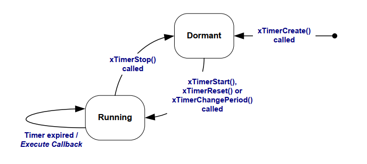
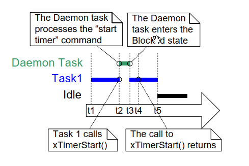

# 6 软件定时器管理

## 6.1 章节介绍与范围

软件定时器用于在未来某个时间点或以固定频率定期调度函数的执行。软件定时器执行的函数称为软件定时器的回调函数。

软件定时器由FreeRTOS内核实现并控制，不需要硬件支持，与硬件定时器或硬件计数器无关。

请注意，与FreeRTOS使用创新设计以确保最大效率的理念一致，软件定时器在没有实际执行软件定时器回调函数时不会使用任何处理时间。

软件定时器功能是可选的。要包含软件定时器功能：

1. 将FreeRTOS源文件FreeRTOS/Source/timers.c作为项目的一部分进行构建。

2. 在应用程序的FreeRTOSConfig.h头文件中定义以下常量：

- `configUSE_TIMERS`

  在FreeRTOSConfig.h中将`configUSE_TIMERS`设置为1。

- `configTIMER_TASK_PRIORITY`

  设置定时器服务任务的优先级，范围在0到(`configMAX_PRIORITIES` - 1)之间。

- `configTIMER_QUEUE_LENGTH`

  设置定时器命令队列在任何时候可以保持的未处理命令的最大数量。

- `configTIMER_TASK_STACK_DEPTH`

  设置分配给定时器服务任务的堆栈大小（以字数计，而不是字节数）。

### 6.1.1 范围

本章涵盖以下内容：

- 软件定时器的特性与任务特性的比较。
- RTOS 守护任务。
- 定时器命令队列。
- 一次性软件定时器与周期性软件定时器的区别。
- 如何创建、启动、重置和更改软件定时器的周期。

## 6.2 软件定时器回调函数

软件定时器回调函数实现为C函数。它们唯一特殊之处在于其原型，必须返回void，并以软件定时器的句柄作为唯一参数。回调函数原型如清单6.1所示。

<a name="list" title="清单 6.1 软件定时器回调函数原型"></a>

```c
void ATimerCallback( TimerHandle_t xTimer );
```
***清单 6.1*** *软件定时器回调函数原型*

软件定时器回调函数从头到尾执行，并以正常方式退出。它们应该保持简短，并且不得进入阻塞状态。

> *注意：如下所述，软件定时器回调函数在FreeRTOS调度器启动时自动创建的任务上下文中执行。因此，软件定时器回调函数绝不能调用会导致调用任务进入阻塞状态的FreeRTOS API函数。可以调用诸如`xQueueReceive()`之类的函数，但仅当函数的`xTicksToWait`参数（指定函数的阻塞时间）设置为0时才可以。不能调用诸如`vTaskDelay()`之类的函数，因为调用`vTaskDelay()`将始终将调用任务置于阻塞状态。*


## 6.3 软件定时器的属性和状态

### 6.3.1 软件定时器的周期

软件定时器的“周期”是从软件定时器启动到其回调函数执行之间的时间。

### 6.3.2 单次和自动重载定时器

有两种类型的软件定时器：

1. 单次定时器

   启动后，单次定时器将只执行一次其回调函数。单次定时器可以手动重新启动，但不会自行重新启动。

1. 自动重载定时器

   启动后，自动重载定时器在每次到期时都会重新启动自己，从而定期执行其回调函数。

图6.1展示了单次定时器和自动重载定时器行为的区别。虚线垂直线标记了时钟中断发生的时间。

<a name="fig6.1" title="图6.1 单次和自动重载软件定时器行为的区别"></a>

* * *

***图6.1*** *单次和自动重载软件定时器行为的区别*
* * *

参考图6.1：

- 定时器1

  定时器1是一个周期为6个时钟周期的单次定时器。它在时间t1启动，因此其回调函数在6个时钟周期后，即时间t7执行。由于定时器1是单次定时器，其回调函数不会再次执行。

- 定时器2

  定时器2是一个周期为5个时钟周期的自动重载定时器。它在时间t1启动，因此其回调函数在时间t1之后的每5个时钟周期执行。在图6.1中，这发生在时间t6、t11和t16。


### 6.3.3 软件定时器状态

软件定时器可以处于以下两种状态之一：

- 休眠

  休眠的软件定时器存在，并且可以通过其句柄引用，但没有运行，因此其回调函数不会执行。

- 运行

  运行中的软件定时器在进入运行状态或上次重置后，经过与其周期相等的时间后，将执行其回调函数。

图6.2和图6.3分别显示了自动重载定时器和一次性定时器在休眠和运行状态之间的可能转换。两个图表的关键区别在于定时器过期后进入的状态；自动重载定时器执行其回调函数后重新进入运行状态，一次性定时器执行其回调函数后进入休眠状态。

<a name="fig6.2" title="图6.2 自动重载软件定时器状态和转换"></a>
<a name="fig6.3" title="图6.3 一次性软件定时器状态和转换"></a>

* * *

***图6.2*** *自动重载软件定时器状态和转换*


***图6.3*** *一次性软件定时器状态和转换*
* * *

`xTimerDelete()` API函数删除一个定时器。定时器可以在任何时候删除。函数原型由清单6.2演示。

<a name="list6.2" title="清单6.2 xTimerDelete() API函数原型"></a>

```c
BaseType_t xTimerDelete( TimerHandle_t xTimer, TickType_t xTicksToWait );
```
***清单6.2*** *xTimerDelete() API函数原型*

**xTimerDelete() 参数和返回值**

- `xTimer`

  正在删除的定时器的句柄。

- `xTicksToWait`

  指定调用任务在阻塞状态下等待删除命令成功发送到定时器命令队列的时间（以滴答为单位），如果在调用xTimerDelete()时队列已经满了。如果在调度器启动之前调用xTimerDelete()，则忽略xTicksToWait。

- 返回值

  有两种可能的返回值：

  - `pdPASS`

    如果命令成功发送到定时器命令队列，则返回`pdPASS`。

  - `pdFAIL`

    如果删除命令在经过xBlockTime滴答后仍然无法发送到定时器命令队列，则返回`pdFAIL`。


## 6.4 软件定时器的上下文

### 6.4.1 RTOS 守护进程（定时器服务）任务

所有软件定时器回调函数都在同一个RTOS守护进程（或“定时器服务”）任务的上下文中执行[^10]。

[^10]: 该任务曾被称为“定时器服务任务”，因为最初它只用于执行软件定时器回调函数。现在，同一个任务还用于其他目的，因此它以更通用的名称“RTOS守护进程任务”而闻名。

守护进程任务是一个标准的FreeRTOS任务，当调度程序启动时会自动创建。其优先级和堆栈大小分别由`configTIMER_TASK_PRIORITY`和`configTIMER_TASK_STACK_DEPTH`编译时配置常量设置。这两个常量都在FreeRTOSConfig.h中定义。

软件定时器回调函数不应调用会导致调用任务进入阻塞状态的FreeRTOS API函数，因为这样会导致守护进程任务进入阻塞状态。

### 6.4.2 定时器命令队列

软件定时器API函数通过称为“定时器命令队列”的队列将命令从调用任务发送到守护进程任务。这在图6.4中有所示。命令示例包括“启动定时器”、“停止定时器”和“重置定时器”。

定时器命令队列是一个标准的FreeRTOS队列，当调度程序启动时会自动创建。定时器命令队列的长度由FreeRTOSConfig.h中的`configTIMER_QUEUE_LENGTH`编译时配置常量设置。

<a name="fig6.4" title="图6.4 软件定时器API函数通过定时器命令队列与RTOS守护进程任务通信"></a>

* * *

***图6.4*** *软件定时器API函数通过定时器命令队列与RTOS守护进程任务通信*
* * *


### 6.4.3 守护任务调度

守护任务的调度方式与其他FreeRTOS任务相同；它只会在成为最高优先级可运行任务时处理命令或执行定时器回调函数。图6.5和图6.6展示了`configTIMER_TASK_PRIORITY`设置如何影响执行模式。

图6.5展示了当守护任务的优先级低于调用`xTimerStart()` API函数的任务的优先级时的执行模式。

<a name="fig6.5" title="图6.5 当调用xTimerStart()的任务优先级高于守护任务优先级时的执行模式"></a>

* * *

***图6.5*** *当调用xTimerStart()的任务优先级高于守护任务优先级时的执行模式*
* * *

参考图6.5，其中任务1的优先级高于守护任务的优先级，而守护任务的优先级又高于空闲任务的优先级：

1.  在时间t1

    任务1处于运行状态，而守护任务处于阻塞状态。

守护任务将离开阻塞状态，如果向定时器命令队列发送命令，在这种情况下，它将处理命令，或者如果软件定时器过期，在这种情况下，它将执行软件定时器的回调函数。

1. 在时间 t2

   任务 1 调用 `xTimerStart()`。

   `xTimerStart()` 向定时器命令队列发送命令，导致守护任务离开阻塞状态。任务 1 的优先级高于守护任务的优先级，因此守护任务不会抢占任务 1。

   任务 1 仍处于运行状态，守护任务已经离开阻塞状态并进入就绪状态。

1. 在时间 t3

   任务 1 完成执行 `xTimerStart()` API 函数。任务 1 从函数开始到函数结束执行了 `xTimerStart()`，没有离开运行状态。

1. 在时间 t4

   任务 1 调用一个导致其进入阻塞状态的 API 函数。守护任务现在是就绪状态中优先级最高的任务，因此调度程序选择守护任务作为进入运行状态的任务。守护任务然后开始处理任务 1 发送到定时器命令队列的命令。

> *注意：软件定时器开始时的到期时间是从发送“启动定时器”命令到定时器命令队列的时间计算的——它不是从守护进程任务从定时器命令队列接收到“启动定时器”命令的时间计算的。*

1. 在时间t5

   守护进程任务已经完成了由任务1发送给它的命令的处理，并尝试从定时器命令队列接收更多数据。定时器命令队列为空，因此守护进程任务重新进入阻塞状态。如果向定时器命令队列发送命令，或者软件定时器到期，守护进程任务将再次离开阻塞状态。

   空闲任务现在是就绪状态中优先级最高的任务，因此调度程序选择空闲任务作为进入运行状态的任务。

图6.6显示了与图6.5所示的类似场景，但这次守护进程任务的优先级高于调用`xTimerStart()`的任务的优先级。

<a name="fig6.6" title="图6.6 当调用 xTimerStart() 的任务优先级低于守护任务优先级时的执行模式"></a>

* * *

***图6.6*** *当调用 xTimerStart() 的任务优先级低于守护任务优先级时的执行模式*
* * *

参考图6.6，其中守护任务的优先级高于任务1的优先级，而任务1的优先级高于空闲任务的优先级：

1. 在时间 t1

   与之前一样，任务1处于运行状态，而守护任务处于阻塞状态。

1. 在时间 t2

   任务1调用 `xTimerStart()`。

   `xTimerStart()` 向定时器命令队列发送一个命令，导致守护任务离开阻塞状态。守护任务的优先级高于任务1的优先级，因此调度程序选择守护任务作为进入运行状态的任务。

   任务1在完成执行 `xTimerStart()` 函数之前被守护任务抢占，现在处于就绪状态。

守护进程任务开始处理由任务1发送到定时器命令队列的命令。

1. 在时间t3

   守护进程任务已经完成了由任务1发送给它的命令的处理，并尝试从定时器命令队列接收更多数据。定时器命令队列为空，因此守护进程任务重新进入阻塞状态。

   任务1现在是就绪状态中优先级最高的任务，因此调度程序选择任务1作为进入运行状态的任务。

1. 在时间t4

   任务1在完成执行`xTimerStart()`函数之前被守护进程任务抢占，只有在重新进入运行状态后才退出（返回）`xTimerStart()`。

1. 在时间t5

   任务1调用一个API函数，导致它进入阻塞状态。空闲任务现在是就绪状态中优先级最高的任务，因此调度程序选择空闲任务作为进入运行状态的任务。

在图6.5所示的情景中，任务1发送命令到定时器命令队列，并守护进程任务接收和处理命令之间经过了一段时间。在图6.6所示的情景中，守护进程任务在任务1从发送命令的函数返回之前已经接收并处理了任务1发送给它的命令。

命令发送到定时器命令队列中包含一个时间戳。时间戳用于计算应用程序任务发送命令与守护程序任务处理相同命令之间经过的任何时间。例如，如果发送一个“启动定时器”命令来启动一个周期为10个时钟周期的定时器，时间戳用于确保启动的定时器在命令发送后的10个时钟周期后到期，而不是在守护程序任务处理命令后的10个时钟周期后到期。

##  6.5 创建和启动软件定时器

### 6.5.1 xTimerCreate() API 函数

FreeRTOS 还包括 `xTimerCreateStatic()` 函数，该函数在编译时静态分配创建定时器所需的内存：在使用之前，必须显式创建软件定时器。

软件定时器由 `TimerHandle_t` 类型的变量引用。`xTimerCreate()` 用于创建软件定时器并返回一个 `TimerHandle_t` 来引用它创建的软件定时器。软件定时器处于休眠状态创建。

软件定时器可以在调度程序运行之前创建，也可以在调度程序启动后从任务中创建。

[第2.5节：数据类型和编码风格指南](ch02.md#25-data-types-and-coding-style-guide)描述了使用的数据类型和命名约定。

<a name="list6.3" title="清单 6.3 xTimerCreate() API 函数原型"></a>

```c
TimerHandle_t xTimerCreate( const char * const pcTimerName,
                            const TickType_t xTimerPeriodInTicks,
                            const BaseType_t xAutoReload,
                            void * const pvTimerID,
                            TimerCallbackFunction_t pxCallbackFunction );
```
***清单 6.3*** *xTimerCreate() API 函数原型*

**xTimerCreate() 参数和返回值**

- `pcTimerName`

  定时器的描述性名称。FreeRTOS 并不会以任何方式使用它。它纯粹是作为调试辅助工具包含的。通过人类可读的名称标识定时器要比尝试通过其句柄标识它简单得多。

- `xTimerPeriodInTicks`

  以刻度为单位指定定时器的周期。可以使用 `pdMS_TO_TICKS()` 宏将以毫秒为单位指定的时间转换为以刻度为单位的时间。不能为 0。

- `xAutoReload`

  将 `xAutoReload` 设置为 `pdTRUE` 以创建自动重载定时器。将 `xAutoReload` 设置为 `pdFALSE` 以创建一次性定时器。

- `pvTimerID`

  每个软件定时器都有一个 ID 值。ID 是一个空指针，可以由应用程序编写者用于任何目的。ID 特别有用，当同一个回调函数被多个软件定时器使用时，可以用来提供特定于定时器的存储。本章中的一个示例演示了如何使用定时器的 ID。

  `pvTimerID` 为正在创建的任务的 ID 设置一个初始值。

- `pxCallbackFunction`

  软件定时器回调函数只是符合列表 6.1 中所示原型的简单 C 函数。`pxCallbackFunction` 参数是指向要用作软件定时器回调函数的函数的指针（实际上只是函数名称）。

- 返回值

  如果返回值为NULL，则表示无法创建软件定时器，因为FreeRTOS无法分配必要的数据结构，因为堆内存不足。

  如果返回非NULL值，则表示软件定时器已成功创建。返回值是创建的定时器的句柄。

  第3章提供了更多关于堆内存管理的信息。

### 6.5.2 xTimerStart() API 函数

`xTimerStart()` 用于启动处于休眠状态的软件定时器，或者重置（重新启动）处于运行状态的软件定时器。`xTimerStop()` 用于停止处于运行状态的软件定时器。停止软件定时器与将定时器转换为休眠状态相同。

在调度程序启动之前可以调用 `xTimerStart()`，但在这种情况下，软件定时器将不会在调度程序启动时实际启动。

> *注意：永远不要从中断服务例程中调用 `xTimerStart()`。应该使用其替代品 `xTimerStartFromISR()`。*


<a name="list6.4" title="清单 6.4 xTimerStart() API 函数原型"></a>

```c
BaseType_t xTimerStart( TimerHandle_t xTimer, TickType_t xTicksToWait );
```
***清单 6.4*** *xTimerStart() API 函数原型*


**xTimerStart() 参数和返回值**

- `xTimer`

  正在启动或重置的软件定时器的句柄。句柄将从用于创建软件定时器的 `xTimerCreate()` 调用中返回。

- `xTicksToWait`

  `xTimerStart()` 使用定时器命令队列将“启动定时器”命令发送到守护任务。`xTicksToWait` 指定调用任务在定时器命令队列已满的情况下，最多可以保持在阻塞状态的时间，以等待队列中有空间可用。

  如果 `xTicksToWait` 为零且定时器命令队列已满，`xTimerStart()` 将立即返回。

  阻塞时间以时钟节拍周期为单位指定，因此它所代表的绝对时间取决于时钟频率。可以使用宏 `pdMS_TO_TICKS()` 将以毫秒为单位指定的时间转换为以时钟节拍为单位的时间。

  如果在 `FreeRTOSConfig.h` 中将 `INCLUDE_vTaskSuspend` 设置为 1，则将 `xTicksToWait` 设置为 `portMAX_DELAY` 将导致调用任务无限期（无超时）保持在阻塞状态，以等待定时器命令队列中有空间可用。

  如果在调度器启动之前调用 `xTimerStart()`，则忽略 `xTicksToWait` 的值，`xTimerStart()` 将表现为 `xTicksToWait` 已设置为零。

- 返回值

  有两种可能的返回值：

  - `pdPASS`

    只有在成功将“启动定时器”命令发送到定时器命令队列时，才会返回 `pdPASS`。

    如果守护进程任务的优先级高于调用 `xTimerStart()` 的任务的优先级，则调度程序将确保在 `xTimerStart()` 返回之前处理启动命令。这是因为守护进程任务会在定时器命令队列中有数据时立即抢占调用 `xTimerStart()` 的任务。

    如果指定了阻塞时间（`xTicksToWait` 不为零），则可能在函数返回之前，调用任务被放置到阻塞状态，以等待定时器命令队列中有空间可用，但在阻塞时间到期之前，数据已经成功写入定时器命令队列。

  - `pdFAIL`

    如果无法将“启动定时器”命令写入定时器命令队列，因为队列已经满了，则会返回 `pdFAIL`。

如果指定了一个阻塞时间（`xTicksToWait` 不为零），那么调用任务将被放置到阻塞状态，以等待守护任务在定时器命令队列中腾出空间，但指定的阻塞时间在发生之前就过期了。

<a name="example6.1" title="示例 6.1 创建一次性和自动重载定时器"></a>
---
***示例 6.1*** *创建一次性和自动重载定时器*

---

这个示例创建并启动一个一次性定时器和一个自动重载定时器，如清单 6.5 所示。

<a name="list6.5" title="清单 6.5 创建和启动示例 6.1 中使用的定时器"></a>

```c
/* 分配给一次性和自动重载定时器的周期分别为3.333秒和半秒。 */
#define mainONE_SHOT_TIMER_PERIOD pdMS_TO_TICKS( 3333 )
#define mainAUTO_RELOAD_TIMER_PERIOD pdMS_TO_TICKS( 500 )

int main( void )
{
    TimerHandle_t xAutoReloadTimer, xOneShotTimer;
    BaseType_t xTimer1Started, xTimer2Started;

    /* 创建一次性定时器，并将创建的定时器的句柄存储在xOneShotTimer中。 */
    xOneShotTimer = xTimerCreate(
        /* 软件定时器的文本名称 - FreeRTOS不使用。 */
                                  "OneShot",
        /* 软件定时器的周期（以滴答为单位）。 */
                                   mainONE_SHOT_TIMER_PERIOD,
        /* 将uxAutoRealod设置为pdFALSE创建一次性软件定时器。 */
                                   pdFALSE,
        /* 此示例不使用定时器ID。 */
                                   0,
        /* 由正在创建的软件定时器使用的回调函数。 */
                                   prvOneShotTimerCallback );

    /* 创建自动重载定时器，并将创建的定时器的句柄存储在xAutoReloadTimer中。 */
    xAutoReloadTimer = xTimerCreate(
        /* 软件定时器的文本名称 - FreeRTOS不使用。 */
                                     "AutoReload",
        /* 软件定时器的周期（以滴答为单位）。 */
                                     mainAUTO_RELOAD_TIMER_PERIOD,
        /* 将uxAutoRealod设置为pdTRUE创建自动重载定时器。 */
                                     pdTRUE,
        /* 此示例不使用定时器ID。 */
                                     0,
        /* 由正在创建的软件定时器使用的回调函数。 */
                                     prvAutoReloadTimerCallback );

    /* 检查是否创建了软件定时器。 */
    if( ( xOneShotTimer != NULL ) && ( xAutoReloadTimer != NULL ) )
    {
        /* 使用0（无阻塞时间）启动软件定时器。调度程序尚未启动，因此这里指定的任何阻塞时间都会被忽略。 */
        xTimer1Started = xTimerStart( xOneShotTimer, 0 );
        xTimer2Started = xTimerStart( xAutoReloadTimer, 0 );

        /* xTimerStart()的实现使用定时器命令队列，如果定时器命令队列满了，xTimerStart()将失败。定时器服务任务在调度程序启动之前不会被创建，因此发送到命令队列的所有命令都将保留在队列中，直到调度程序启动后。检查对xTimerStart()的两次调用是否成功。 */
        if( ( xTimer1Started == pdPASS ) && ( xTimer2Started == pdPASS ) )
        {
            /* 启动调度程序。 */
            vTaskStartScheduler();
        }
    }

    /* 如往常一样，这行代码不应该被执行到。 */
    for( ;; );
}
```
***清单 6.5*** *创建和启动示例 6.1 中使用的定时器*

定时器的回调函数每次被调用时只打印一条消息。一次性定时器回调函数的实现如清单 6.6 所示。自动重装定时器回调函数的实现如清单 6.7 所示。

<a name="list6.5" title="清单 6.6 示例 6.1 中一次性定时器使用的回调函数"></a>

```c
static void prvOneShotTimerCallback( TimerHandle_t xTimer )
{
    TickType_t xTimeNow;

    /* 获取当前的滴答计数。 */
    xTimeNow = xTaskGetTickCount();

    /* 输出一个字符串，显示回调函数执行的时间。 */
    vPrintStringAndNumber( "One-shot timer callback executing", xTimeNow );

    /* 文件作用域变量。 */
    ulCallCount++;
}
```
***清单 6.6*** *示例 6.1 中一次性定时器使用的回调函数*

<a name="list6.7" title="清单 6.7 示例 6.1 中自动重装定时器使用的回调函数"></a>

```c
static void prvAutoReloadTimerCallback( TimerHandle_t xTimer )
{
    TickType_t xTimeNow;

    /* 获取当前的滴答计数。 */
    xTimeNow = xTaskGetTickCount();

    /* 输出一个字符串，显示回调函数执行的时间。 */
    vPrintStringAndNumber( "Auto-reload timer callback executing", xTimeNow);

    ulCallCount++;
}
```
***清单 6.7*** *示例 6.1 中自动重装定时器使用的回调函数*

执行此示例将产生图 6.7 所示的输出。图 6.7 显示了自动重装定时器的回调函数以固定的 500 个滴答周期执行（`mainAUTO_RELOAD_TIMER_PERIOD` 在清单 6.5 中设置为 500），以及一次性定时器的回调函数仅在滴答计数为 3333 时执行一次（`mainONE_SHOT_TIMER_PERIOD` 在清单 6.5 中设置为 3333）。

<a name="fig6.7" title="图 6.7 执行示例 6.1 时生成的输出"></a>

* * *

***图 6.7*** *执行示例 6.1 时生成的输出*
* * *

## 6.6 定时器ID

每个软件定时器都有一个ID，这是一个标签值，可以由应用程序编写者用于任何目的。ID存储在一个void指针（`void *`）中，因此它可以直接存储一个整数值，指向任何其他对象，或者用作函数指针。

在创建软件定时器时，ID被分配一个初始值，之后可以使用`vTimerSetTimerID()`API函数更新ID，并使用`pvTimerGetTimerID()`API函数查询。

与其他软件定时器API函数不同，`vTimerSetTimerID()`和`pvTimerGetTimerID()`直接访问软件定时器——它们不会向定时器命令队列发送命令。

### 6.6.1 vTimerSetTimerID() API函数

<a name="list6.8" title="清单 6.8 vTimerSetTimerID() API函数原型"></a>

```c
void vTimerSetTimerID( const TimerHandle_t xTimer, void *pvNewID );
```
***清单 6.8*** *vTimerSetTimerID() API函数原型*

**vTimerSetTimerID() 参数**

- `xTimer`

  正在使用新ID值更新的软件定时器的句柄。句柄将从用于创建软件定时器的`xTimerCreate()`调用中返回。

- `pvNewID`

  软件定时器的ID将被设置为的值。


### 6.6.2 pvTimerGetTimerID() API 函数

<a name="list6.9" title="Listing 6.9 The pvTimerGetTimerID() API function prototype"></a>

```c
void *pvTimerGetTimerID( const TimerHandle_t xTimer );
```
***Listing 6.9*** *pvTimerGetTimerID() API 函数原型*

**pvTimerGetTimerID() 参数和返回值**

- `xTimer`

  正在查询的软件定时器的句柄。该句柄将由用于创建软件定时器的 `xTimerCreate()` 调用返回。

- 返回值

  正在查询的软件定时器的ID。

<a name="example6.2" title="Example 6.2 Using the callback function parameter and the software timer ID"></a>
---
***Example 6.2*** *使用回调函数参数和软件定时器ID*

---

相同的回调函数可以分配给多个软件定时器。当这样做时，回调函数参数用于确定哪个软件定时器过期。

示例 6.1 使用了两个单独的回调函数；一个回调函数由一次性定时器使用，另一个回调函数由自动重载定时器使用。示例 6.2 创建了与示例 6.1 类似的功能，但将单个回调函数分配给两个软件定时器。

`main()` 函数与示例 6.1 中使用的 `main()` 函数几乎相同。唯一的区别是软件定时器的创建位置。这个区别在清单 6.10 中显示，其中 `prvTimerCallback()` 作为两个定时器的回调函数。

<a name="list6.10" title="清单 6.10 创建示例 6.2 中使用的定时器"></a>

```c
/* 创建一次性定时器软件定时器，并将句柄存储在 xOneShotTimer 中。 */
xOneShotTimer = xTimerCreate( "OneShot",
                              mainONE_SHOT_TIMER_PERIOD,
                              pdFALSE,
                              /* 定时器的 ID 初始化为 NULL。 */
                              NULL,
                              /* prvTimerCallback() 由两个定时器使用。 */
                              prvTimerCallback );

/* 创建自动重载软件定时器，并将句柄存储在 xAutoReloadTimer 中 */
xAutoReloadTimer = xTimerCreate( "AutoReload",
                                 mainAUTO_RELOAD_TIMER_PERIOD,
                                 pdTRUE,
                                 /* 定时器的 ID 初始化为 NULL。 */
                                 NULL,
                                 /* prvTimerCallback() 由两个定时器使用。 */
                                 prvTimerCallback );
```
***清单 6.10*** *创建示例 6.2 中使用的定时器*

`prvTimerCallback()` 将在任何一个定时器到期时执行。`prvTimerCallback()` 的实现使用函数的参数来确定它是因为一次性定时器到期而被调用，还是因为自动重载定时器到期而被调用。

`prvTimerCallback()` 还演示了如何使用软件定时器ID作为定时器特定的存储；每个软件定时器在其ID中保存其过期次数，自动重载定时器使用计数在执行第五次时停止自己。

`prvTimerCallback()` 的实现如清单 6.9 所示。

<a name="list6.11" title="清单 6.11 示例 6.2 中使用的定时器回调函数"></a>

```c
static void prvTimerCallback( TimerHandle_t xTimer )
{
    TickType_t xTimeNow;
    uint32_t ulExecutionCount;

    /* 该软件定时器过期的次数存储在定时器的ID中。获取ID，递增它，然后将其保存为新的ID值。ID是一个void指针，因此转换为uint32_t。 */
    ulExecutionCount = ( uint32_t ) pvTimerGetTimerID( xTimer );
    ulExecutionCount++;
    vTimerSetTimerID( xTimer, ( void * ) ulExecutionCount );

    /* 获取当前的tick计数。 */
    xTimeNow = xTaskGetTickCount();

    /* 创建定时器时，一次性定时器的句柄存储在xOneShotTimer中。将传递给该函数的句柄与xOneShotTimer进行比较，以确定是一次性定时器还是自动重载定时器过期，然后输出一个字符串以显示回调函数执行的时间。 */
    if( xTimer == xOneShotTimer )
    {
        vPrintStringAndNumber( "一次性定时器回调函数执行", xTimeNow );
    }
    else
    {
        /* xTimer 与 xOneShotTimer 不相等，因此一定是自动重载定时器过期。 */
        vPrintStringAndNumber( "自动重载定时器回调函数执行", xTimeNow);

        if( ulExecutionCount == 5 )
        {
            /* 在执行5次后停止自动重载定时器。此回调函数在RTOS守护任务的上下文中执行，因此不能调用可能将守护任务置于阻塞状态的任何函数。因此使用0的阻塞时间。 */
            xTimerStop( xTimer, 0 );
        }
    }
}
```
***清单 6.11*** *示例 6.2 中使用的定时器回调函数*

示例 6.2 生成的输出如图 6.8 所示。可以看到，自动重载定时器只执行五次。

<a name="fig6.8" title="图 6.8 执行示例 6.2 时生成的输出"></a>

* * *

***图 6.8*** *执行示例 6.2 时生成的输出*
* * *

## 6.7 更改定时器的周期

每个官方的FreeRTOS端口都提供一个或多个示例项目。大多数示例项目都是自检的，并且使用LED来提供项目状态的视觉反馈；如果自检始终通过，则LED会缓慢切换，如果自检失败，则LED会快速切换。

一些示例项目在任务中执行自检，并使用`vTaskDelay()`函数来控制LED切换的速率。其他示例项目在软件定时器回调函数中执行自检，并使用定时器的周期来控制LED切换的速率。

### 6.7.1 xTimerChangePeriod() API 函数

使用`xTimerChangePeriod()`函数更改软件定时器的周期。

如果`xTimerChangePeriod()`用于更改已经运行的定时器的周期，则定时器将使用新的周期值重新计算其到期时间。重新计算的到期时间是相对于调用`xTimerChangePeriod()`的时间，而不是相对于定时器最初启动的时间。

如果使用 `xTimerChangePeriod()` 来改变一个处于休眠状态（未运行的定时器）的定时器的周期，那么定时器将计算一个到期时间，并转换到运行状态（定时器将开始运行）。

> *注意：永远不要在中断服务例程中调用 `xTimerChangePeriod()`。应该使用其替代品 `xTimerChangePeriodFromISR()`。*

<a name="list6.12" title="Listing 6.12 The xTimerChangePeriod() API function prototype"></a>

```c
BaseType_t xTimerChangePeriod( TimerHandle_t xTimer,
                               TickType_t xNewPeriod,
                               TickType_t xTicksToWait );
```
***Listing 6.12*** *The xTimerChangePeriod() API function prototype*

**xTimerChangePeriod() 参数和返回值**

- `xTimer`

  正在使用新周期值更新的软件定时器的句柄。句柄将从用于创建软件定时器的 `xTimerCreate()` 调用中返回。

- `xTimerPeriodInTicks`

  软件定时器的新周期，以滴答数指定。可以使用 `pdMS_TO_TICKS()` 宏将以毫秒指定的时间转换为以滴答数指定的时间。

- `xTicksToWait`

  `xTimerChangePeriod()` 使用定时器命令队列将“更改周期”命令发送到守护任务。`xTicksToWait` 指定调用任务在定时器命令队列已满的情况下，最多可以保持在阻塞状态的时间，以等待队列中有空间可用。

  如果 `xTicksToWait` 为零且定时器命令队列已满，则 `xTimerChangePeriod()` 将立即返回。

  可以使用 `pdMS_TO_TICKS()` 宏将以毫秒指定的时间转换为以滴答数指定的时间。

  如果在 FreeRTOSConfig.h 中将 `INCLUDE_vTaskSuspend` 设置为 1，则将 `xTicksToWait` 设置为 `portMAX_DELAY` 将导致调用任务无限期（无超时）保持在阻塞状态，以等待定时器命令队列中有空间可用。

如果在调度器启动之前调用了 `xTimerChangePeriod()`，那么 `xTicksToWait` 的值将被忽略，`xTimerChangePeriod()` 将表现为 `xTicksToWait` 被设置为零。

- 返回值

  有两种可能的返回值：

  - `pdPASS`

    只有在数据成功发送到定时器命令队列时，才会返回 `pdPASS`。

    如果指定了阻塞时间（`xTicksToWait` 不为零），那么在函数返回之前，调用任务可能会被放置到阻塞状态，以等待定时器命令队列中有空间可用，但在阻塞时间到期之前，数据已经成功写入定时器命令队列。

  - `pdFAIL`

    如果由于队列已经满了，无法将“更改周期”命令写入定时器命令队列，则会返回 `pdFAIL`。

    如果指定了阻塞时间（`xTicksToWait` 不为零），那么调用任务将被放置到阻塞状态，以等待守护任务在队列中腾出空间，但在发生之前，指定的阻塞时间已经过期。

Listing 6.13展示了FreeRTOS示例中如何在软件定时器回调函数中包含自检功能，使用`xTimerChangePeriod()`来增加LED切换速率，如果自检失败。执行自检的软件定时器称为“检查定时器”。

<a name="list6.13" title="Listing 6.13 使用 xTimerChangePeriod()"></a>

```c
/* 检查定时器创建时的周期为3000毫秒，导致LED每3秒切换一次。如果自检功能检测到意外状态，则将检查定时器的周期更改为仅200毫秒，导致更快的切换速率。 */
const TickType_t xHealthyTimerPeriod = pdMS_TO_TICKS( 3000 );
const TickType_t xErrorTimerPeriod = pdMS_TO_TICKS( 200 );

/* 检查定时器使用的回调函数。 */
static void prvCheckTimerCallbackFunction( TimerHandle_t xTimer )
{
    static BaseType_t xErrorDetected = pdFALSE;

    if( xErrorDetected == pdFALSE )
    {
        /* 尚未检测到错误。再次运行自检函数。该函数要求示例创建的每个任务报告其自身状态，并检查所有任务是否仍在运行（因此能够正确报告其状态）。 */
        if( CheckTasksAreRunningWithoutError() == pdFAIL )
        {
            /* 一个或多个任务报告了意外状态。可能发生了错误。减少检查定时器的周期以增加此回调函数的执行速率，从而也增加LED的切换速率。此回调函数在RTOS守护任务的上下文中执行，因此使用0的阻塞时间以确保守护任务永远不会进入阻塞状态。 */
            xTimerChangePeriod(
                  xTimer,            /* 正在更新的定时器 */
                  xErrorTimerPeriod, /* 定时器的新周期 */
                  0 );               /* 发送此命令时不阻塞 */

            /* 记录已检测到错误。 */
            xErrorDetected = pdTRUE;
        }
    }

    /* 切换LED。LED的切换速率将取决于此函数的调用频率，这由检查定时器的周期决定。如果CheckTasksAreRunningWithoutError()曾返回pdFAIL，则定时器的周期将从3000毫秒减少到仅200毫秒。 */
    ToggleLED();
}
```
***Listing 6.13*** *使用 xTimerChangePeriod()*


## 6.8 重置软件定时器

重置软件定时器意味着重新启动定时器；定时器的到期时间将相对于定时器被重置的时间重新计算，而不是相对于定时器最初启动的时间。这在图6.9中有所展示，图中显示了一个周期为6的定时器被启动，然后重置两次，最终到期并执行其回调函数。

<a name="fig6.9" title="图6.9 启动和重置一个周期为6个时钟周期的软件定时器"></a>

* * *

***图6.9*** *启动和重置一个周期为6个时钟周期的软件定时器*
* * *

参考图6.9：

- 定时器1在时间t1启动。它的周期为6，因此最初计算的执行其回调函数的时间是t7，即启动后的6个时钟周期。

- 在达到时间t7之前，定时器1被重置，因此在其到期并执行回调函数之前被重置。定时器1在时间t5被重置，因此执行其回调函数的时间重新计算为t11，即重置后的6个时钟周期。

- 在达到时间t11之前，定时器1再次被重置，因此在其到期并执行回调函数之前再次被重置。定时器1在时间t9被重置，因此执行其回调函数的时间重新计算为t15，即最后一次重置后的6个时钟周期。

- 定时器1没有再次被重置，因此在时间t15到期，并相应地执行其回调函数。


### 6.8.1 xTimerReset() API 函数

使用 `xTimerReset()` API 函数可以重置定时器。

`xTimerReset()` 也可以用于启动处于休眠状态的定时器。

> *注意：永远不要在中断服务例程中调用 `xTimerReset()`。应该使用其安全版本 `xTimerResetFromISR()`。*


<a name="list6.14" title="Listing 6.14 The xTimerReset() API function prototype"></a>

```c
BaseType_t xTimerReset( TimerHandle_t xTimer, TickType_t xTicksToWait );
```
***Listing 6.14*** *The xTimerReset() API function prototype*


**xTimerReset() 参数和返回值**

- `xTimer`

  正在重置或启动的软件定时器的句柄。句柄将从用于创建软件定时器的 `xTimerCreate()` 调用中返回。

- `xTicksToWait`

  `xTimerReset()` 使用定时器命令队列将 'reset' 命令发送到守护进程任务。`xTicksToWait` 指定调用任务在定时器命令队列已满的情况下，最多可以保持在阻塞状态等待队列中有空间可用的时间。

`xTimerReset()` 如果 `xTicksToWait` 为零且定时器命令队列已满，则会立即返回。

  如果在 `FreeRTOSConfig.h` 中将 `INCLUDE_vTaskSuspend` 设置为 1，则将 `xTicksToWait` 设置为 `portMAX_DELAY` 将导致调用任务保持在阻塞状态，直到定时器命令队列中有空间可用（没有超时）。

- 返回值

  有两种可能的返回值：

  - `pdPASS`

    只有在数据成功发送到定时器命令队列时，才会返回 `pdPASS`。

    如果指定了阻塞时间（`xTicksToWait` 不为零），则可能在函数返回之前，调用任务被放置到阻塞状态，以等待定时器命令队列中有空间可用，但在阻塞时间到期之前，数据已经成功写入定时器命令队列。

    `pdFAIL`

    如果由于队列已满而无法将 'reset' 命令写入定时器命令队列，则会返回 `pdFAIL`。

如果指定了阻塞时间（`xTicksToWait` 不为零），则调用任务将被放置到阻塞状态，以等待守护任务在队列中腾出空间，但指定的阻塞时间在发生之前就过期了。

<a name="example6.3" title="示例 6.3 重置软件定时器"></a>
---
***示例 6.3*** *重置软件定时器*

---

这个示例模拟了手机背光的行为。背光：

- 当按下键时打开。

- 在一定时间内继续按下键时保持打开状态。

- 如果在一定时间内没有按下键，则自动关闭。

使用一次性软件定时器来实现这种行为：

- \[模拟\]背光在按下键时打开，并在软件定时器的回调函数中关闭。

- 每次按下键时都会重置软件定时器。

- 因此，必须在一定时间内按下键以防止背光关闭的时间段等于软件定时器的周期；如果在定时器过期之前没有通过按键重置软件定时器，则定时器的回调函数将执行，背光将关闭。

`xSimulatedBacklightOn` 变量保存背光状态。
`xSimulatedBacklightOn` 设置为 `pdTRUE` 表示背光打开，
设置为 `pdFALSE` 表示背光关闭。

软件定时器回调函数如清单 6.15 所示。

<a name="list6.15" title="清单 6.15 用于示例 6.3 的一次性定时器的回调函数"></a>

```c
static void prvBacklightTimerCallback( TimerHandle_t xTimer )
{
    TickType_t xTimeNow = xTaskGetTickCount();

    /* 定时器到期，关闭背光。 */
    xSimulatedBacklightOn = pdFALSE;

    /* 打印背光关闭的时间。 */
    vPrintStringAndNumber(
            "定时器到期，在时间\t\t关闭背光", xTimeNow );
}
```
***清单 6.15*** *用于示例 6.3 的一次性定时器的回调函数*

示例 6.3 创建一个任务来轮询键盘[^11]。任务如清单 6.16 所示，但由于下一段落中描述的原因，清单 6.16 不打算代表最佳设计。

[^11]: 打印到Windows控制台以及从Windows控制台读取键盘输入都会导致执行Windows系统调用。Windows系统调用，包括使用Windows控制台、磁盘或TCP/IP堆栈，可能会对FreeRTOS Windows端口的行为产生不利影响，因此通常应避免使用。

使用FreeRTOS可以使您的应用程序变为事件驱动。事件驱动设计非常高效地使用处理时间，因为只有在发生事件时才会使用处理时间，而不会浪费时间轮询未发生的事件。示例6.3无法实现事件驱动，因为在使用FreeRTOS Windows端口时，处理键盘中断并不实际，因此不得不使用效率较低的轮询技术。如果清单6.16是一个中断服务程序，那么将使用`xTimerResetFromISR()`代替`xTimerReset()`。

<a name="list6.16" title="清单 6.16 示例 6.3 中用于重置软件定时器的任务"></a>

```c
static void vKeyHitTask( void *pvParameters )
{
    const TickType_t xShortDelay = pdMS_TO_TICKS( 50 );
    TickType_t xTimeNow;

    vPrintString( "Press a key to turn the backlight on.\r\n" );

    /* Ideally an application would be event driven, and use an interrupt to
       process key presses. It is not practical to use keyboard interrupts
       when using the FreeRTOS Windows port, so this task is used to poll for
       a key press. */
    for( ;; )
    {
        /* Has a key been pressed? */
        if( _kbhit() != 0 )
        {
            /* A key has been pressed. Record the time. */
            xTimeNow = xTaskGetTickCount();

            if( xSimulatedBacklightOn == pdFALSE )
            {

                /* The backlight was off, so turn it on and print the time at
                   which it was turned on. */
                xSimulatedBacklightOn = pdTRUE;
                vPrintStringAndNumber(
                    "Key pressed, turning backlight ON at time\t\t",
                    xTimeNow );
            }
            else
            {
                /* The backlight was already on, so print a message to say the
                   timer is about to be reset and the time at which it was
                   reset. */
                vPrintStringAndNumber(
                    "Key pressed, resetting software timer at time\t\t",
                    xTimeNow );
            }

            /* Reset the software timer. If the backlight was previously off,
               then this call will start the timer. If the backlight was
               previously on, then this call will restart the timer. A real
               application may read key presses in an interrupt. If this
               function was an interrupt service routine then
               xTimerResetFromISR() must be used instead of xTimerReset(). */
            xTimerReset( xBacklightTimer, xShortDelay );

            /* Read and discard the key that was pressed – it is not required
               by this simple example. */
            ( void ) _getch();
        }
    }
}
```
***清单 6.16*** *示例 6.3 中用于重置软件定时器的任务*

执行示例 6.3 时生成的输出如图 6.10 所示。参考图 6.10：

- 第一次按键按下时，计数器为 812。此时打开了背光，并启动了单次定时器。

- 当计数器为1813、3114、4015和5016时，发生了进一步的按键按压。所有这些按键按压都导致定时器在定时器过期之前被重置。

- 当计数器为10016时，定时器过期。此时，背光被关闭。

<a name="fig6.10" title="图6.10 执行示例6.3时生成的输出"></a>

* * *

***图6.10*** *执行示例6.3时生成的输出*
* * *

可以从图6.10中看出，定时器的周期为5000个计数；背光在最后一次按键按压后的5000个计数后被关闭，即定时器最后一次被重置后的5000个计数。


