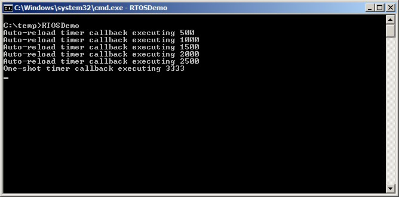

# 6 软件定时器管理

## 6.1 章节介绍和范围

软件定时器用于在将来某个设定的时间执行函数，或以固定的频率定期执行。由软件定时器执行的函数称为软件定时器的回调函数。

软件定时器由 FreeRTOS 内核控制，并受其影响。它们不需要硬件支持，也不与硬件定时器或硬件计数器相关。

需要注意的是，与 FreeRTOS 的创新设计理念一致，以确保最大效率，软件定时器只有在实际执行软件定时器回调函数时才会消耗处理时间。

软件定时器功能是可选的。要包含软件定时器功能：

1. 将 FreeRTOS 源代码文件 FreeRTOS/Source/timers.c 作为项目的一部分进行构建。

2. 在应用程序的 FreeRTOSConfig.h 头文件中定义以下常量：

- `configUSE_TIMERS`

  在 FreeRTOSConfig.h 中将 `configUSE_TIMERS` 设置为 1。

- `configTIMER_TASK_PRIORITY`

  设置定时器服务任务的优先级，范围在 0 到 ( `configMAX_PRIORITIES` - 1 ) 之间。

- `configTIMER_QUEUE_LENGTH`

  设置定时器命令队列可以同时容纳的最大未处理命令数。

- `configTIMER_TASK_STACK_DEPTH`

  设置分配给定时器服务任务的堆栈大小（以字为单位，而不是字节）。

### 6.1.1 范围

本章节涵盖：

- 软件定时器与任务的特性对比。
- RTOS 守护任务。
- 定时器命令队列。
- 单次软件定时器与周期性软件定时器的区别。
- 如何创建、启动、重置和更改软件定时器的周期。

## 6.2 软件定时器回调函数

软件定时器回调函数以 C 函数的形式实现。它们的特殊之处在于原型，必须返回 void，并且仅接受一个软件定时器句柄作为其唯一参数。回调函数的原型由列表 6.1 所示。

<a name="list" title="列表 6.1 软件定时器回调函数原型"></a>

```c
void ATimerCallback( TimerHandle_t xTimer );
```
***列表 6.1*** *软件定时器回调函数原型*

软件定时器回调函数从开始到结束执行，并以正常方式退出。 它们应该保持简短，并且不能进入 Blocked 状态。

> *注意：如将要看到的，软件定时器回调函数在 FreeRTOS 调度程序启动时自动创建的任务的上下文中执行。 因此，至关重要的是，软件定时器回调函数切勿调用将导致调用任务进入 Blocked 状态的 FreeRTOS API 函数。 调用诸如 `xQueueReceive()` 之类的函数是可以的，但仅当该函数的 `xTicksToWait` 参数（指定函数的阻塞时间）设置为 0 时。 调用诸如 `vTaskDelay()` 之类的函数是不可以的，因为调用 `vTaskDelay()` 会始终将调用任务置于 Blocked 状态。*


## 6.3 软件定时器的属性和状态

### 6.3.1 软件定时器的周期

软件定时器的“周期”是指软件定时器启动到软件定时器的回调函数执行之间的时间。

### 6.3.2 单次触发和自动重载定时器

有两种类型的软件定时器：

1. 单次触发定时器

   启动后，单次触发定时器仅执行其回调函数一次。 单次触发定时器可以手动重启，但不会自动重启。

2. 自动重载定时器

   启动后，自动重载定时器在每次到期时都会重新启动自身，从而导致其回调函数周期性执行。

图 6.1 描述了单次触发定时器和自动重载定时器之间的行为差异。 虚线垂直线标记了发生时钟中断的时间。

<a name="fig6.1" title="图 6.1 单次触发和自动重载软件定时器之间的行为差异"></a>

* * *

***图 6.1*** *单次触发和自动重载软件定时器之间的行为差异*
* * *

参考图 6.1：

- 定时器 1

  定时器 1 是一个周期为 6 个时钟节拍的单次触发定时器。 它在时间 t1 处启动，因此其回调函数在时间 t7 时执行。 由于定时器 1 是一个单次触发定时器，因此其回调函数不会再次执行。

- 定时器 2

  定时器 2 是一个周期为 5 个时钟节拍的自动重载定时器。 它在时间 t1 处启动，因此其回调函数在时间 t1 之后的每 5 个时钟节拍时执行。 在图 6.1 中，这发生在时间 t6、t11 和 t16。


### 6.3.3 软件定时器状态

软件定时器可以处于以下两种状态之一：

- 休眠 (Dormant)

  休眠的软件定时器存在，可以通过其句柄引用，但它没有运行，因此其回调函数将不会执行。

- 运行 (Running)

  运行中的软件定时器将在经过等于其周期的时间后执行其回调函数，自软件定时器进入运行状态以来，或者自软件定时器上次重置以来。

图 6.2 和图 6.3 分别显示了自动重载定时器和单次触发定时器之间的可能状态转换。 这两个图之间的主要区别在于定时器到期后进入的状态；自动重载定时器执行其回调函数然后重新进入运行状态，单次触发定时器执行其回调函数然后进入休眠状态。

<a name="fig6.2" title="图 6.2 自动重载软件定时器的状态和转换"></a>
<a name="fig6.3" title="图 6.3 单次触发软件定时器的状态和转换"></a>

* * *

***图 6.2*** *自动重载软件定时器的状态和转换*


***图 6.3*** *单次触发软件定时器的状态和转换*
* * *

`xTimerDelete()` API 函数删除定时器。 定时器可以随时删除。 函数原型由清单 6.2 演示。

<a name="list6.2" title="清单 6.2 xTimerDelete() API 函数原型"></a>

```c
BaseType_t xTimerDelete( TimerHandle_t xTimer, TickType_t xTicksToWait );
```
***清单 6.2*** *xTimerDelete() API 函数原型*

**xTimerDelete() 参数和返回值**

- `xTimer`

  要删除的定时器的句柄。

- `xTicksToWait`

  指定调用任务应在 Blocked 状态下等待多长时间（以时钟节拍为单位），以等待删除命令成功发送到定时器命令队列，如果当调用 xTimerDelete() 时队列已满。 如果在调度器启动之前调用 xTimerDelete()，则忽略 xTicksToWait。

- 返回值

  有两种可能的返回值：

  - `pdPASS`

    如果命令已成功发送到定时器命令队列，则返回 `pdPASS`。

  - `pdFAIL`

    如果在 xBlockTime 个时钟节拍过去后，仍然无法将删除命令发送到定时器命令队列，则返回 `pdFAIL`。


## 6.4 软件定时器的上下文

### 6.4.1 RTOS 守护进程（定时器服务）任务

所有软件定时器回调函数都在同一个 RTOS 守护进程（或“定时器服务”）任务的上下文中执行[^10]。

[^10]: 该任务最初被称为“定时器服务任务”，因为它最初仅用于执行软件定时器回调函数。 现在，相同的任务也用于其他目的，因此它被称为更通用的“RTOS 守护进程任务”。

守护进程任务是一个标准的 FreeRTOS 任务，在启动调度器时自动创建。 它的优先级和堆栈大小分别由编译时配置常量 `configTIMER_TASK_PRIORITY` 和 `configTIMER_TASK_STACK_DEPTH` 设置。 这两个常量都定义在 FreeRTOSConfig.h 中。

软件定时器回调函数不得调用会导致调用任务进入 Blocked 状态的 FreeRTOS API 函数，否则守护进程任务将进入 Blocked 状态。

### 6.4.2 定时器命令队列

软件定时器 API 函数将命令从调用任务发送到守护进程任务，通过一个名为“定时器命令队列”的队列。 这如图 6.4 所示。 命令示例包括“启动定时器”、“停止定时器”和“重置定时器”。

定时器命令队列是一个标准的 FreeRTOS 队列，在启动调度器时自动创建。 定时器命令队列的长度由 FreeRTOSConfig.h 中的编译时配置常量 `configTIMER_QUEUE_LENGTH` 设置。

<a name="fig6.4" title="图 6.4 软件定时器 API 函数使用定时器命令队列与 RTOS 守护进程任务进行通信"></a>

* * *

***图 6.4*** *软件定时器 API 函数使用定时器命令队列与 RTOS 守护进程任务进行通信*
* * *


### 6.4.3 守护进程任务调度

守护进程任务的调度方式与其他 FreeRTOS 任务相同；它仅在它是能够运行的最高优先级任务时才会处理命令或执行定时器回调函数。 图 6.5 和图 6.6 演示了 `configTIMER_TASK_PRIORITY` 设置如何影响执行模式。

图 6.5 显示了当任务的优先级高于调用 `xTimerStart()` API 函数的守护进程任务的优先级时，执行模式。

<a name="fig6.5" title="图 6.5 当调用 xTimerStart() 函数的任务的优先级高于守护进程任务的优先级时的执行模式"></a>

* * *

***图 6.5*** *当调用 xTimerStart() 函数的任务的优先级高于守护进程任务的优先级时的执行模式*
* * *

参考图 6.5，其中任务 1 的优先级高于守护进程任务的优先级，并且守护进程任务的优先级高于空闲任务的优先级：

1.  在时间 t1

    任务 1 处于运行状态，守护进程任务处于阻塞状态。

守护进程任务将在定时器命令队列发送命令或软件定时器到期时离开阻塞状态，此时它将处理命令或执行软件定时器的回调函数。

1. 在时间 t2

   任务 1 调用 `xTimerStart()`。

   `xTimerStart()` 向定时器命令队列发送命令，导致守护进程任务离开阻塞状态。任务 1 的优先级高于守护进程任务的优先级，因此守护进程任务不会抢占任务 1。

   任务 1 仍然处于运行状态，守护进程任务已离开阻塞状态并进入就绪状态。

1. 在时间 t3

   任务 1 完成执行 `xTimerStart()` API 函数。任务 1 从函数的开始到函数的结束执行了 `xTimerStart()`，而没有离开运行状态。

1. 在时间 t4

   任务 1 调用一个导致其进入阻塞状态的 API 函数。守护进程任务现在是就绪状态下最高优先级的任务，因此调度器选择守护进程任务进入运行状态。守护进程任务然后开始处理任务 1 发送到定时器命令队列的命令。

> *注意：软件定时器开始后到期时间是从“开始定时器”命令发送到定时器命令队列的时间计算得出的，而不是从守护进程任务从定时器命令队列接收到“开始定时器”命令的时间计算得出的。*

1. 在时间 t5

   守护进程任务已完成处理任务 1 发送给它的命令，并尝试从定时器命令队列接收更多数据。定时器命令队列为空，因此守护进程任务重新进入阻塞状态。如果定时器命令队列发送命令或软件定时器到期，守护进程任务将再次离开阻塞状态。

   空闲任务现在是就绪状态下最高优先级的任务，因此调度器选择空闲任务进入运行状态。

图 6.6 显示了一个与图 6.5 类似的情景，但这次守护进程任务的优先级高于调用 `xTimerStart()` 的任务的优先级。

<a name="fig6.6" title="图 6.6 当调用 xTimerStart() 的任务优先级低于守护进程任务的优先级时的执行模式"></a>

* * *

***图 6.6*** *当调用 xTimerStart() 的任务优先级低于守护进程任务的优先级时的执行模式*
* * *

参考图 6.6，其中守护进程任务的优先级高于任务 1 的优先级，任务 1 的优先级高于空闲任务的优先级：

1. 在时间 t1

   如前所述，任务 1 处于运行状态，守护进程任务处于阻塞状态。

1. 在时间 t2

   任务 1 调用 `xTimerStart()`。

   `xTimerStart()` 将命令发送到定时器命令队列，导致守护进程任务离开阻塞状态。守护进程任务的优先级高于任务 1 的优先级，因此调度器选择守护进程任务进入运行状态。

   任务 1 在完成 `xTimerStart()` 函数的执行之前就被守护进程任务抢占，现在处于就绪状态。

守护进程任务开始处理任务 1 发送到定时器命令队列的命令。

1. 在时间 t3

   守护进程任务已完成处理任务 1 发送给它的命令，并尝试从定时器命令队列接收更多数据。定时器命令队列为空，因此守护进程任务重新进入阻塞状态。

   任务 1 现在是就绪状态下最高优先级的任务，因此调度器选择任务 1 进入运行状态。

1. 在时间 t4

   任务 1 在完成 `xTimerStart()` 函数的执行之前就被守护进程任务抢占，并且只有在重新进入运行状态后才会退出（从）`xTimerStart()`。

1. 在时间 t5

   任务 1 调用一个API函数，导致它进入阻塞状态。空闲任务现在是就绪状态下最高优先级的任务，因此调度器选择空闲任务进入运行状态。

在图 6.5 所示的场景中，任务 1 将命令发送到定时器命令队列，以及守护进程任务接收和处理命令之间经过了时间。在图 6.6 所示的场景中，守护进程任务在任务 1 从发送命令的函数返回之前，就已经接收并处理了任务 1 发送给它的命令。

发送到定时器命令队列的命令包含一个时间戳。时间戳用于补偿应用程序任务发送命令和守护进程任务处理同一命令之间经过的任何时间。例如，如果发送一个“启动定时器”命令来启动一个周期为 10 个滴度的定时器，则时间戳用于确保启动的定时器在命令发送后 10 个滴度后到期，而不是在守护进程任务处理命令后 10 个滴度后到期。

## 6.5 创建和启动软件定时器

### 6.5.1 xTimerCreate() API 函数

FreeRTOS 还包括 `xTimerCreateStatic()` 函数，该函数在编译时静态分配创建定时器所需的内存：必须在可以使用定时器之前显式创建软件定时器。

软件定时器由 `TimerHandle_t` 类型的变量引用。`xTimerCreate()` 用于创建软件定时器，并返回一个 `TimerHandle_t` 以引用它创建的软件定时器。软件定时器以休眠状态创建。

软件定时器可以在调度器开始运行之前创建，也可以在调度器启动后从任务中创建。

[第 2.5 节：数据类型和编码风格指南](ch02.md#25-data-types-and-coding-style-guide) 描述了使用的数据类型和命名约定。


<a name="list6.3" title="列表 6.3 xTimerCreate() API 函数原型"></a>

```c
TimerHandle_t xTimerCreate( const char * const pcTimerName,
                            const TickType_t xTimerPeriodInTicks,
                            const BaseType_t xAutoReload,
                            void * const pvTimerID,
                            TimerCallbackFunction_t pxCallbackFunction );
```
***列表 6.3*** *xTimerCreate() API 函数原型*

**xTimerCreate() 参数和返回值**

- `pcTimerName`

  定时器的描述性名称。 FreeRTOS 不会以任何方式使用它。 它纯粹是为了调试辅助。 通过人类可读的名称识别定时器比尝试通过其句柄识别它要简单得多。

- `xTimerPeriodInTicks`

  定时器的周期，以滴答数指定。可以使用 `pdMS_TO_TICKS()` 宏将以毫秒指定的时间转换为以滴答数指定的时间。不能为 0。

- `xAutoReload`

  将 `xAutoReload` 设置为 `pdTRUE` 以创建自动重载定时器。将 `xAutoReload` 设置为 `pdFALSE` 以创建单次触发定时器。

- `pvTimerID`

  每个软件定时器都有一个 ID 值。ID 是一个 void 指针，可以由应用程序编写者用于任何目的。当同一个回调函数被多个软件定时器使用时，ID 尤其有用，因为它可以用于提供定时器特定的存储。 在本章节的示例中演示了使用定时器 ID 的方法。

  `pvTimerID` 设置要创建的任务的 ID 的初始值。

- `pxCallbackFunction`

  软件定时器回调函数只是符合 Listing 6.1 中所示原型 C 函数。`pxCallbackFunction` 参数是指向用作正在创建的软件定时器回调函数的函数（实际上，只是函数名称）的指针。

- 返回值

  如果返回 NULL，则由于 FreeRTOS 无法为必要的结构分配足够的堆内存，因此无法创建软件定时器。

  如果返回非 NULL 值，则表示软件定时器已成功创建。返回值为创建的定时器的句柄。

  第 3 章提供了有关堆内存管理的更多信息。

### 6.5.2 `xTimerStart()` API 函数

`xTimerStart()` 用于启动处于休眠状态的软件定时器，或重置（重新启动）处于运行状态的软件定时器。`xTimerStop()` 用于停止处于运行状态的软件定时器。停止软件定时器等同于将定时器过渡到休眠状态。

`xTimerStart()` 可以在调度器启动之前调用，但如果这样做，则软件定时器将不会实际启动，直到调度器启动的时间。

> *注意：切勿从中断服务例程中调用 `xTimerStart()`。应使用中断安全版本 `xTimerStartFromISR()` 代替。*

<a name="list6.4" title="Listing 6.4 The xTimerStart() API function prototype"></a>

```c
BaseType_t xTimerStart( TimerHandle_t xTimer, TickType_t xTicksToWait );
```
***Listing 6.4*** *The xTimerStart() API function prototype*


**`xTimerStart()` 参数和返回值**

- `xTimer`

  要启动或重置的软件定时器的句柄。该句柄将从用于创建软件定时器的 `xTimerCreate()` 的调用中返回。

- `xTicksToWait`

  `xTimerStart()` 使用定时器命令队列将“启动定时器”命令发送到守护任务。`xTicksToWait` 指定了调用任务在等待定时器命令队列中出现可用空间时，应该保持在阻塞状态的最大时间。如果队列已满，则会发生这种情况。

  如果 `xTicksToWait` 为零且定时器命令队列已满，`xTimerStart()` 将立即返回。

  阻塞时间以滴答周期为单位指定，因此它所代表的绝对时间取决于滴答频率。可以使用宏 `pdMS_TO_TICKS()` 将以毫秒为单位指定的时间转换为以滴答为单位指定的时间。

  如果在 `FreeRTOSConfig.h` 中将 `INCLUDE_vTaskSuspend` 设置为 1，则将 `xTicksToWait` 设置为 `portMAX_DELAY` 将导致调用任务无限期地（没有超时）保持在阻塞状态，以等待定时器命令队列中出现可用空间。

  如果在调度器启动之前调用 `xTimerStart()`，则忽略 `xTicksToWait` 的值，并且 `xTimerStart()` 的行为就像 `xTicksToWait` 被设置为零一样。

- 返回值

  有两种可能的返回值：

  - `pdPASS`

    只有当“启动定时器”命令已成功发送到定时器命令队列时，才会返回 `pdPASS`。

    如果守护任务的优先级高于调用 `xTimerStart()` 的任务的优先级，则调度器将确保在 `xTimerStart()` 返回之前处理启动命令。这是因为一旦定时器命令队列中有数据，守护任务将抢占调用 `xTimerStart()` 的任务。

    如果指定了阻塞时间（`xTicksToWait` 不是零），则在函数返回之前，调用任务可能已被置于阻塞状态，等待定时器命令队列中出现可用空间，但数据已在阻塞时间到期之前成功写入到定时器命令队列中。

  - `pdFAIL`

    如果由于队列已满，无法将“启动定时器”命令写入定时器命令队列，则会返回 `pdFAIL`。

如果指定了阻塞时间（`xTicksToWait` 不是零），则调用任务将被置于阻塞状态，等待守护任务在定时器命令队列中腾出空间，但在此之前，指定的阻塞时间已到期。


<a name="example6.1" title="示例 6.1 创建一次性定时器和自动重载定时器"></a>
---
***示例 6.1*** *创建一次性定时器和自动重载定时器*

---

此示例创建并启动一个一次性定时器和一个自动重载定时器，如清单 6.5 所示。


<a name="list6.5" title="清单 6.5 创建和启动示例 6.1 中使用的定时器"></a>

```c
/* 分配给一次性定时器和自动重载定时器的周期分别为 3.333
   秒和半秒。*/
#define mainONE_SHOT_TIMER_PERIOD pdMS_TO_TICKS( 3333 )
#define mainAUTO_RELOAD_TIMER_PERIOD pdMS_TO_TICKS( 500 )

int main( void )
{
    TimerHandle_t xAutoReloadTimer, xOneShotTimer;
    BaseType_t xTimer1Started, xTimer2Started;

    /* 创建一次性定时器，并将创建的定时器的句柄存储在
       xOneShotTimer 中。*/
    xOneShotTimer = xTimerCreate(
        /* 软件定时器的文本名称 - FreeRTOS 不使用。*/
                                  "OneShot",
        /* 软件定时器的周期，以滴答为单位。*/
                                   mainONE_SHOT_TIMER_PERIOD,
        /* 将 uxAutoRealod 设置为 pdFALSE 创建一次性软件定时器。*/
                                   pdFALSE,
        /* 此示例未使用定时器 ID。*/
                                   0,
        /* 用于创建软件定时器的回调函数。*/
                                   prvOneShotTimerCallback );

    /* 创建自动重载定时器，并将创建的定时器的句柄存储在
       xAutoReloadTimer 中。*/
    xAutoReloadTimer = xTimerCreate(
        /* 软件定时器的文本名称 - FreeRTOS 不使用。*/
                                     "AutoReload",
        /* 软件定时器的周期，以滴答为单位。*/
                                     mainAUTO_RELOAD_TIMER_PERIOD,
        /* 将 uxAutoRealod 设置为 pdTRUE 创建自动重载定时器。*/
                                     pdTRUE,
        /* 此示例未使用定时器 ID。*/
                                     0,
        /* 用于创建软件定时器的回调函数。*/
                                     prvAutoReloadTimerCallback );

    /* 检查软件定时器是否已创建。*/
    if( ( xOneShotTimer != NULL ) && ( xAutoReloadTimer != NULL ) )
    {
        /* 启动软件定时器，使用 0 的阻塞时间（无阻塞时间）。
           调度器尚未启动，因此在此处指定的任何阻塞时间都将被忽略。*/
        xTimer1Started = xTimerStart( xOneShotTimer, 0 );
        xTimer2Started = xTimerStart( xAutoReloadTimer, 0 );

        /* xTimerStart() 的实现使用定时器命令队列，
           并且如果定时器命令队列已满，xTimerStart() 将失败。
           定时器服务任务直到调度器启动后才创建，因此
           所有发送到队列的命令都将保留在队列中，直到调度器启动。
           检查 xTimerStart() 的两次调用是否通过。*/
        if( ( xTimer1Started == pdPASS ) && ( xTimer2Started == pdPASS ) )
        {
            /* 启动调度器。*/
            vTaskStartScheduler();
        }
    }

    /* 始终如此，此行不应被访问。*/
    for( ;; );
}
```
***列表 6.5*** *创建和启动示例 6.1 中使用的定时器*

定时器的回调函数每次被调用时都只是打印一条消息。一次性定时器的回调函数实现如列表 6.6 所示。自动重载定时器的回调函数实现如列表 6.7 所示。

<a name="list6.5" title="列表 6.6 示例 6.1 中一次性定时器使用的回调函数"></a>

```c
static void prvOneShotTimerCallback( TimerHandle_t xTimer )
{
    TickType_t xTimeNow;

    /* 获取当前的滴答计数。*/
    xTimeNow = xTaskGetTickCount();

    /* 输出一条字符串以显示回调函数执行的时间。*/
    vPrintStringAndNumber( "One-shot timer callback executing", xTimeNow );

    /* 文件范围变量。*/
    ulCallCount++;
}
```
***列表 6.6*** *示例 6.1 中一次性定时器使用的回调函数*

<a name="list6.7" title="列表 6.7 示例 6.1 中自动重载定时器使用的回调函数"></a>

```c
static void prvAutoReloadTimerCallback( TimerHandle_t xTimer )
{
    TickType_t xTimeNow;

    /* 获取当前的滴答计数。*/
    xTimeNow = xTaskGetTickCount();

    /* 输出一条字符串以显示回调函数执行的时间。*/
    vPrintStringAndNumber( "Auto-reload timer callback executing", xTimeNow);

    ulCallCount++;
}
```
***列表 6.7*** *示例 6.1 中自动重载定时器使用的回调函数*

执行此示例会产生图 6.7 中所示的输出。图 6.7 显示了自动重载定时器的回调函数以固定的周期 500 滴答（`mainAUTO_RELOAD_TIMER_PERIOD` 在列表 6.5 中设置为 500）执行，以及一次性定时器的回调函数仅执行一次，当滴答计数为 3333 时（`mainONE_SHOT_TIMER_PERIOD` 在列表 6.5 中设置为 3333）。

<a name="fig6.7" title="图 6.7 执行示例 6.1 产生的输出"></a>

* * *

***图 6.7*** *执行示例 6.1 产生的输出*
* * *

## 6.6 定时器 ID

每个软件定时器都有一个 ID，这是一个标签值，可以由应用程序编写者用于任何目的。ID 存储在 void 指针 (`void *`) 中，因此它可以存储整数值，指向任何其他对象，或用作函数指针。

在软件定时器创建时，会为其分配一个初始值，之后可以使用 `vTimerSetTimerID()` API 函数更新 ID，并使用 `pvTimerGetTimerID()` API 函数查询 ID。

与其它软件定时器 API 函数不同，`vTimerSetTimerID()` 和 `pvTimerGetTimerID()` 直接访问软件定时器——它们不向定时器命令队列发送命令。

### 6.6.1 vTimerSetTimerID() API 函数

<a name="list6.8" title="列表 6.8 vTimerSetTimerID() API 函数原型"></a>

```c
void vTimerSetTimerID( const TimerHandle_t xTimer, void *pvNewID );
```
***列表 6.8*** *vTimerSetTimerID() API 函数原型*

**vTimerSetTimerID() 参数**

- `xTimer`

  要使用新 ID 值更新的软件定时器的句柄。
  该句柄将由用于创建软件定时器的 `xTimerCreate()` 函数调用返回。

- `pvNewID`

  要设置为软件定时器 ID 的值。


### 6.6.2 pvTimerGetTimerID() API 函数

<a name="list6.9" title="列表 6.9 pvTimerGetTimerID() API 函数原型"></a>

```c
void *pvTimerGetTimerID( const TimerHandle_t xTimer );
```
***列表 6.9*** *pvTimerGetTimerID() API 函数原型*

**pvTimerGetTimerID() 参数和返回值**

- `xTimer`

  要查询的软件定时器的句柄。该句柄将由用于创建软件定时器的 `xTimerCreate()` 函数调用返回。

- 返回值

  被查询的软件定时器的 ID。

<a name="example6.2" title="示例 6.2 使用回调函数参数和软件定时器 ID"></a>
---
***示例 6.2*** *使用回调函数参数和软件定时器 ID*

---

同一个回调函数可以分配给多个软件定时器。当这样做时，回调函数参数用于确定哪个软件定时器已过期。

示例 6.1 使用了两个单独的回调函数；一个回调函数由单次定时器使用，另一个回调函数由自动重新加载定时器使用。示例 6.2 创建了与示例 6.1 类似的功能，但将单个回调函数分配给两个软件定时器。

`main()` 函数在示例 6.2 中使用与示例 6.1 中使用的 `main()` 函数几乎相同。唯一的区别在于软件定时器创建的位置。此差异在列表 6.10 中显示，其中 `prvTimerCallback()` 用作两个定时器的回调函数。

<a name="list6.10" title="列表 6.10 创建示例 6.2 中使用的定时器"></a>

```c
/* 创建单次定时器软件定时器，并将句柄存储在 xOneShotTimer 中。 */
xOneShotTimer = xTimerCreate( "OneShot",
                              mainONE_SHOT_TIMER_PERIOD,
                              pdFALSE,
                              /* 定时器的 ID 初始化为 NULL。 */
                              NULL,
                              /* prvTimerCallback() 由两个定时器使用。 */
                              prvTimerCallback );

/* 创建自动重新加载软件定时器，并将句柄存储在 xAutoReloadTimer 中 */
xAutoReloadTimer = xTimerCreate( "AutoReload",
                                 mainAUTO_RELOAD_TIMER_PERIOD,
                                 pdTRUE,
                                 /* 定时器的 ID 初始化为 NULL。 */
                                 NULL,
                                 /* prvTimerCallback() 由两个定时器使用。 */
                                 prvTimerCallback );
```
***列表 6.10*** *创建示例 6.2 中使用的定时器*

当任一定时器到期时，将执行 `prvTimerCallback()`。`prvTimerCallback()` 的实现使用该函数的参数来确定它是因为单次定时器到期还是因为自动重新加载定时器到期而被调用。

`prvTimerCallback()` 还演示了如何使用软件定时器 ID 作为定时器特定的存储；每个软件定时器在其自身的 ID 中保存了到期次数，并且自动重新加载定时器使用该计数在执行第五次时停止自身。

`prvTimerCallback()` 的实现如列表 6.9 所示。

<a name="list6.11" title="列表 6.11 示例 6.2 中使用的定时器回调函数"></a>

```c
static void prvTimerCallback( TimerHandle_t xTimer )
{
    TickType_t xTimeNow;
    uint32_t ulExecutionCount;

    /* 存储在定时器 ID 中，该软件定时器到期的次数计数。获取 ID，递增它，然后将其保存为新的 ID 值。ID 是一个 void 指针，因此将其转换为 uint32_t。 */
    ulExecutionCount = ( uint32_t ) pvTimerGetTimerID( xTimer );
    ulExecutionCount++;
    vTimerSetTimerID( xTimer, ( void * ) ulExecutionCount );

    /* 获取当前滴答计数。 */
    xTimeNow = xTaskGetTickCount();

    /* 当创建定时器时，单次定时器的句柄存储在 xOneShotTimer 中。将传递到此函数的句柄与 xOneShotTimer 进行比较，以确定是单次定时器还是自动重新加载定时器到期，然后输出字符串以显示回调函数执行的时间。 */
    if( xTimer == xOneShotTimer )
    {
        vPrintStringAndNumber( "单次定时器回调函数正在执行", xTimeNow );
    }
    else
    {
        /* xTimer 不等于 xOneShotTimer，因此必须是自动重新加载定时器到期。 */
        vPrintStringAndNumber( "自动重新加载定时器回调函数正在执行", xTimeNow);

        if( ulExecutionCount == 5 )
        {
            /* 在自动重新加载定时器执行 5 次后停止它。此回调函数在 RTOS 守护进程任务的上下文中执行，因此必须不要调用可能将守护进程任务置于 Blocked 状态的任何函数。因此，使用 0 的阻塞时间。 */
            xTimerStop( xTimer, 0 );
        }
    }
}
```
***列表 6.11*** *示例 6.2 中使用的定时器回调函数*

示例 6.2 产生的输出如图 6.8 所示。可以清楚地看到，自动重新加载定时器仅执行五次。

<a name="fig6.8" title="图 6.8 当执行示例 6.2 时产生的输出"></a>

* * *

***图 6.8*** *当执行示例 6.2 时产生的输出*
* * *


## 6.7 更改定时器的周期

每个官方的 FreeRTOS 移植都提供一个或多个示例项目。大多数示例项目都是自检的，并且使用 LED 来提供项目状态的视觉反馈；如果自检始终通过，则 LED 将缓慢闪烁，如果自检曾经失败，则 LED 将快速闪烁。

某些示例项目在任务中执行自检，并使用 `vTaskDelay()` 函数来控制 LED 闪烁的速率。其他示例项目在软件定时器回调函数中执行自检，并使用定时器的周期来控制 LED 闪烁的速率。


### 6.7.1 `xTimerChangePeriod()` API 函数

使用 `xTimerChangePeriod()` 函数来更改软件定时器的周期。

如果使用 `xTimerChangePeriod()` 更改已运行的定时器的周期，则定时器将使用新的周期值来重新计算其到期时间。重新计算的到期时间是相对于 `xTimerChangePeriod()` 被调用的时间，而不是相对于定时器最初启动的时间。

如果使用 `xTimerChangePeriod()` 更改处于休眠状态（一个未运行的定时器）的定时器的周期，则定时器将计算一个到期时间，并过渡到运行状态（定时器将开始运行）。

> *注意：切勿从中断服务例程中调用 `xTimerChangePeriod()`。应使用中断安全版本 `xTimerChangePeriodFromISR()` 代替。*


<a name="list6.12" title="清单 6.12 `xTimerChangePeriod()` API 函数原型"></a>

```c
BaseType_t xTimerChangePeriod( TimerHandle_t xTimer,
                               TickType_t xNewPeriod,
                               TickType_t xTicksToWait );
```
***清单 6.12*** *`xTimerChangePeriod()` API 函数原型*


**`xTimerChangePeriod()` 参数和返回值**

- `xTimer`

  正在使用新周期值更新的软件定时器的句柄。该句柄将由用于创建软件定时器的 `xTimerCreate()` 函数调用返回。

- `xTimerPeriodInTicks`

  软件定时器的新的周期，以滴答（ticks）为单位指定。可以使用宏 `pdMS_TO_TICKS()` 将以毫秒为单位指定的时间转换为以滴答（ticks）为单位的时间。

- `xTicksToWait`

  `xTimerChangePeriod()` 使用定时器命令队列将“更改周期”命令发送到守护任务。`xTicksToWait` 指定了调用任务在等待定时器命令队列可用空间时，应保持在阻塞状态的最大时间，如果队列已经满。

  如果 `xTicksToWait` 为零且定时器命令队列已经满，`xTimerChangePeriod()` 将立即返回。

  可以使用宏 `pdMS_TO_TICKS()` 将以毫秒为单位指定的时间转换为以滴答（ticks）为单位的时间。

  如果 `INCLUDE_vTaskSuspend` 在 FreeRTOSConfig.h 中设置为 1，则将 `xTicksToWait` 设置为 `portMAX_DELAY` 将导致调用任务无限期地（没有超时）保持在阻塞状态，以等待定时器命令队列中可用空间。

如果在调度器启动之前调用 `xTimerChangePeriod()`，则忽略 `xTicksToWait` 的值，并且 `xTimerChangePeriod()` 的行为就像 `xTicksToWait` 被设置为零一样。

- 返回值

  有两种可能的返回值：

  - `pdPASS`

    只有当数据成功发送到定时器命令队列时，才会返回 `pdPASS`。

    如果指定了阻塞时间（`xTicksToWait` 不为零），则调用任务可能已被置于阻塞状态，以等待定时器命令队列中可用空间，然后再返回，但数据已在阻塞时间到期之前成功写入到定时器命令队列。

  - `pdFAIL`

    如果由于队列已满，无法将“更改周期”命令写入定时器命令队列，则返回 `pdFAIL`。

    如果指定了阻塞时间（`xTicksToWait` 不为零），则调用任务将被置于阻塞状态，以等待守护任务在队列中腾出空间，但指定的阻塞时间在发生这种情况之前已到期。

清单 6.13 演示了包含自检功能的 FreeRTOS 示例如何使用 `xTimerChangePeriod()` 在软件定时器回调函数中增加 LED 闪烁的速率，如果自检失败。执行自检的软件定时器被称为“检查定时器”。

<a name="list6.13" title="清单 6.13 使用 xTimerChangePeriod()"></a>

```c
/* 检查定时器以 3000 毫秒的周期创建，导致 LED 每 3 秒闪烁一次。如果自检功能检测到意外状态，则检查定时器的周期更改为仅 200 毫秒，从而实现更快的闪烁速率。 */
const TickType_t xHealthyTimerPeriod = pdMS_TO_TICKS( 3000 );
const TickType_t xErrorTimerPeriod = pdMS_TO_TICKS( 200 );

/* 检查定时器使用的回调函数。 */
static void prvCheckTimerCallbackFunction( TimerHandle_t xTimer )
{
    static BaseType_t xErrorDetected = pdFALSE;

    if( xErrorDetected == pdFALSE )
    {
        /* 尚未检测到任何错误。再次运行自检函数。该函数要求示例创建的每个任务报告其自身的状态，并检查所有任务是否实际仍在运行（并且能够正确报告其状态）。 */
        if( CheckTasksAreRunningWithoutError() == pdFAIL )
        {
            /* 出现一个或多个任务报告了意外状态。可能发生错误。将检查定时器的周期减少到增加此回调函数执行速率，从而增加 LED 闪烁速率。此回调函数在 RTOS 守护任务的上下文中执行，因此使用 0 的阻塞时间以确保守护任务永远不会进入阻塞状态。 */
            xTimerChangePeriod(
                  xTimer,            /* 要更新的定时器 */
                  xErrorTimerPeriod, /* 定时器的新周期 */
                  0 );               /* 发送此命令时不阻塞 */

            /* 锁定已检测到错误。 */
            xErrorDetected = pdTRUE;
        }
    }

    /* 切换 LED。LED 闪烁的速率取决于此函数被调用的频率，这由检查定时器的周期确定。如果 CheckTasksAreRunningWithoutError() 曾经返回 pdFAIL，则定时器的周期将从 3000 毫秒减少到仅 200 毫秒。 */
    ToggleLED();
}
```
***清单 6.13*** *使用 xTimerChangePeriod()*


## 6.8 重置软件定时器

重置软件定时器意味着重新启动定时器；定时器的到期时间会被重新计算，相对于定时器被重置的时间，而不是定时器最初启动的时间。这由图 6.9 演示，该图显示了一个周期为 6 的定时器启动，然后被重置两次，最终到期并执行其回调函数。

<a name="fig6.9" title="图 6.9 启动和重置一个周期为 6 个滴度的软件定时器"></a>

* * *

***图 6.9*** *启动和重置一个周期为 6 个滴度的软件定时器*
* * *

参考图 6.9：

- 定时器 1 在时间 t1 处启动。它的周期为 6，因此它最初的执行回调函数的时间被计算为 t7，即从启动后 6 个滴度。

- 定时器 1 在时间 t7 到来之前被重置，即在到期并执行其回调函数之前。定时器 1 在时间 t5 处被重置，因此它执行回调函数的时间被重新计算为 t11，即从重置后 6 个滴度。

- 定时器 1 在时间 t11 到来之前再次被重置，同样是在到期并执行其回调函数之前。定时器 1 在时间 t9 处被重置，因此它执行回调函数的时间被重新计算为 t15，即从上次重置后 6 个滴度。

- 定时器 1 再次没有被重置，因此它在时间 t15 到期，并相应地执行其回调函数。


### 6.8.1 `xTimerReset()` API 函数

使用 `xTimerReset()` API 函数重置定时器。

`xTimerReset()` 也可以用来启动处于 Dormant（休眠）状态的定时器。

> *注意：切勿从中断服务例程中调用 `xTimerReset()`。应使用中断安全版本 `xTimerResetFromISR()` 来替代。*

<a name="list6.14" title="列表 6.14 `xTimerReset()` API 函数原型"></a>

```c
BaseType_t xTimerReset( TimerHandle_t xTimer, TickType_t xTicksToWait );
```
***列表 6.14*** *`xTimerReset()` API 函数原型*

**`xTimerReset()` 参数和返回值**

- `xTimer`

  正在重置或启动的软件定时器的句柄。该句柄将由用于创建软件定时器的 `xTimerCreate()` 函数调用返回。

- `xTicksToWait`

  `xTimerReset()` 使用定时器命令队列将“重置”命令发送到守护任务。`xTicksToWait` 指定调用任务应在 Blocked（阻塞）状态中等待多长时间，以等待定时器命令队列上出现可用空间，如果队列已满。

如果 `xTicksToWait` 为零且定时器命令队列已满，`xTimerReset()` 将立即返回。

  如果 `INCLUDE_vTaskSuspend` 在 `FreeRTOSConfig.h` 中设置为 1，则将 `xTicksToWait` 设置为 `portMAX_DELAY` 将导致调用任务无限期地保持在 Blocked（阻塞）状态中（没有超时），等待定时器命令队列上出现可用空间。

- 返回值

  有两种可能的返回值：

  - `pdPASS`

    只有当数据成功发送到定时器命令队列时，才会返回 `pdPASS`。

    如果指定了阻塞时间（`xTicksToWait` 不是零），则在函数返回之前，调用任务可能被置于 Blocked 状态，等待定时器命令队列上出现可用空间，但数据在阻塞时间到期之前已成功写入到定时器命令队列。

    - `pdFAIL`

      如果由于队列已满，无法将“重置”命令写入定时器命令队列，则返回 `pdFAIL`。

如果指定了阻塞时间（`xTicksToWait` 不是零），则调用任务将被置于 Blocked（阻塞）状态，等待守护任务在队列中腾出空间，但在此之前阻塞时间已到。

<a name="example6.3" title="Example 6.3 Resetting a software timer"></a>
---
***示例 6.3*** *重置软件定时器*

---

此示例模拟了手机背光的行为。背光：

- 当按下按键时，背光会打开。

- 在一定时间内持续按下其他按键时，背光保持开启状态。

- 如果在一定时间内没有按下任何按键，背光将自动关闭。

使用单次软件定时器来实现此行为：

- 当按下按键时，[模拟的] 背光会打开，并在软件定时器的回调函数中关闭。

- 每次按下按键时，都会重置软件定时器。

- 防止背光关闭的时间段等于软件定时器的周期；如果软件定时器在定时器到期之前没有被按键重置，则定时器的回调函数执行，背光关闭。

`xSimulatedBacklightOn` 变量保存背光状态。
`xSimulatedBacklightOn` 被设置为 `pdTRUE` 表示背光开启，
以及 `pdFALSE` 表示背光关闭。

软件定时器回调函数如列表 6.15 所示。

<a name="list6.15" title="Listing 6.15 The callback function for the one-shot timer used in Example 6.3"></a>

```c
static void prvBacklightTimerCallback( TimerHandle_t xTimer )
{
    TickType_t xTimeNow = xTaskGetTickCount();

    /* 定时器到期，关闭背光。 */
    xSimulatedBacklightOn = pdFALSE;

    /* 打印背光关闭的时间。 */
    vPrintStringAndNumber(
            "Timer expired, turning backlight OFF at time\t\t", xTimeNow );
}
```
***列表 6.15*** *用于示例 6.3 的单次定时器的回调函数*

示例 6.3 创建一个任务来轮询键盘[^11]。该任务如列表 6.16 所示，但由于下一段中描述的原因，列表 6.16 不旨在代表最佳设计。

[^11]: 向 Windows 控制台打印以及从 Windows 控制台读取按键，都会导致执行 Windows 系统调用。Windows 系统调用，包括使用 Windows 控制台、磁盘或 TCP/IP 协议栈，都可能对 FreeRTOS Windows 端口的行为产生不利影响，通常应避免使用。*

使用 FreeRTOS 允许您的应用程序采用事件驱动的方式。事件驱动的设计非常高效地利用处理时间，因为只有在发生事件时才会使用处理时间，而不会浪费时间轮询尚未发生的事件。由于在 FreeRTOS Windows 端口中使用键盘中断处理不切实际，因此示例 6.3 无法采用事件驱动的方式，而是不得不使用效率较低的轮询技术。如果列表 6.16 是一个中断服务例程，那么将使用 `xTimerResetFromISR()` 代替 `xTimerReset()`。

<a name="list6.16" title="列表 6.16 在示例 6.3 中用于重置软件定时器的任务"></a>

```c
static void vKeyHitTask( void *pvParameters )
{
    const TickType_t xShortDelay = pdMS_TO_TICKS( 50 );
    TickType_t xTimeNow;

    vPrintString( "按下任意键以打开背光。\r\n" );

    /* 理想情况下，应用程序应采用事件驱动的方式，并使用中断来处理按键。
       在 FreeRTOS Windows 端口中使用键盘中断处理不切实际，因此此任务用于轮询按键。 */
    for( ;; )
    {
        /* 是否按下了键？ */
        if( _kbhit() != 0 )
        {
            /* 按下了一个键。记录时间。 */
            xTimeNow = xTaskGetTickCount();

            if( xSimulatedBacklightOn == pdFALSE )
            {

                /* 背光之前是关闭的，因此将其打开并打印背光打开的时间。 */
                xSimulatedBacklightOn = pdTRUE;
                vPrintStringAndNumber(
                    "按下按键，在时间\t\t打开背光",
                    xTimeNow );
            }
            else
            {
                /* 背光已经打开，因此打印一条消息，说明软件定时器即将被重置以及重置的时间。 */
                vPrintStringAndNumber(
                    "按下按键，在时间\t\t重置软件定时器",
                    xTimeNow );
            }

            /* 重置软件定时器。如果背光之前是关闭的，则此调用将启动定时器。如果背光之前是打开的，则此调用将重新启动定时器。一个真正的应用程序可能会在中断中读取按键。如果此函数是中断服务例程，则必须使用 xTimerResetFromISR() 代替 xTimerReset()。 */
            xTimerReset( xBacklightTimer, xShortDelay );

            /* 读取并丢弃按下的键 - 此简单示例不需要它。 */
            ( void ) _getch();
        }
    }
}
```
***列表 6.16*** *在示例 6.3 中用于重置软件定时器的任务*

当执行示例 6.3 时，会产生图 6.10 中所示的输出。

参考图 6.10：

- 第一个按键是在滴答计数为 812 时发生的。此时，背光被打开，单次定时器被启动。

- 滴答计数为 1813、3114、4015 和 5016 时，又发生了后续按键事件。所有这些按键事件都导致定时器在定时器到期之前被重置。

- 当滴答计数为 10016 时，定时器到期。此时，背光被关闭。

<a name="fig6.10" title="图 6.10 执行示例 6.3 时产生的输出"></a>

* * *

***图 6.10*** *执行示例 6.3 时产生的输出*
* * *

从图 6.10 可以看出，定时器的周期为 5000 个滴答数；背光在最后一次按下按键后准确地 5000 个滴答数后关闭，也就是最后一次重置定时器后 5000 个滴答数。


