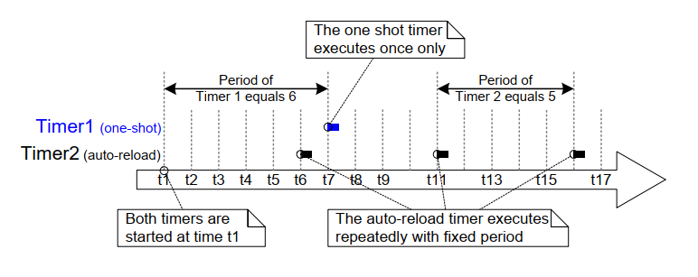
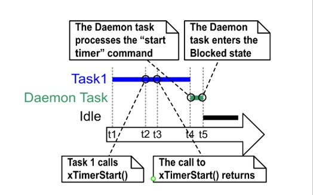
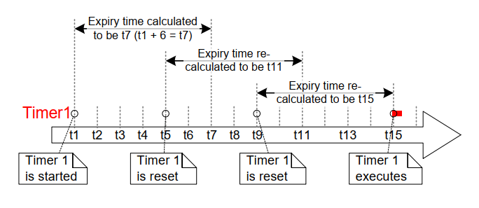

# 6 软件定时器管理

## 6.1 章节介绍与范围

软件定时器用于在未来某个设定的时间点执行函数，或者以固定频率定期执行函数。由软件定时器执行的函数称为该软件定时器的回调函数。

软件定时器由FreeRTOS内核实现并控制。它们不需要硬件支持，且与硬件定时器或硬件计数器无关。

需要注意的是，根据FreeRTOS通过创新设计确保最高效率的理念，软件定时器在实际执行回调函数时才占用处理时间。

软件定时器功能是可选的。要包含软件定时器功能：

1. 将FreeRTOS源文件 `FreeRTOS/Source/timers.c` 作为项目的一部分进行编译。

2. 在应用程序的 `FreeRTOSConfig.h` 头文件中定义以下详细说明的常量：

- `configUSE_TIMERS`

  在 `FreeRTOSConfig.h` 中将 `configUSE_TIMERS` 设置为1。

- `configTIMER_TASK_PRIORITY`

  设置定时器服务任务的优先级，范围为0到（`configMAX_PRIORITIES` - 1）。

- `configTIMER_QUEUE_LENGTH`

  设置定时器命令队列在任意时刻能够容纳的最大未处理命令数量。

- `configTIMER_TASK_STACK_DEPTH`

  设置分配给定时器服务任务的堆栈大小（以字为单位，非字节）。

### 6.1.1 范围

本章涵盖以下内容：

- 软件定时器与任务特性的比较。
- RTOS守护任务。
- 定时器命令队列。
- 单次触发软件定时器和周期性软件定时器的区别。
- 如何创建、启动、重置以及更改软件定时器的周期。


## 6.2 软件定时器回调函数

软件定时器回调函数以C语言函数的形式实现。它们的唯一特殊之处在于其函数原型，必须返回 `void` 类型，并接受一个指向软件定时器的句柄作为其唯一参数。清单6.1展示了回调函数的原型。


<a name="list" title="清单6.1 软件定时器回调函数原型"></a>

```c
void ATimerCallback( TimerHandle_t xTimer );
```
***清单6.1*** *软件定时器回调函数原型*

软件定时器回调函数从开始到结束完整执行，并以正常方式退出。这些函数应保持简短，且不得进入阻塞状态。

> *注意：如后文所述，软件定时器回调函数在任务的上下文中执行，该任务是在启动FreeRTOS调度器时自动创建的。因此，必须确保软件定时器回调函数永远不会调用导致调用任务进入阻塞状态的FreeRTOS API函数。可以调用诸如 `xQueueReceive()` 的函数，但前提是函数的 `xTicksToWait` 参数（指定函数的阻塞时间）设置为0。不允许调用诸如 `vTaskDelay()` 的函数，因为调用 `vTaskDelay()` 总是会将调用任务置于阻塞状态。*


## 6.3 软件定时器的属性与状态

### 6.3.1 软件定时器的周期

软件定时器的“周期”是指从启动软件定时器到其回调函数执行之间的时间间隔。

### 6.3.2 单次触发定时器和自动重载定时器

软件定时器分为两种类型：

1. 单次触发定时器

   一旦启动，单次触发定时器只会执行其回调函数一次。单次触发定时器可以手动重新启动，但不会自动重启。

2. 自动重载定时器

   一旦启动，自动重载定时器每次到期后会自动重新启动自身，从而导致其回调函数周期性执行。

图6.1展示了单次触发定时器和自动重载定时器在行为上的差异。虚线垂直线标记了滴答中断发生的时间点。


<a name="fig6.1" title="图6.1 单次触发定时器和自动重载定时器的行为差异"></a>

* * *

***图6.1*** *单次触发定时器和自动重载定时器的行为差异*
* * *

参考图6.1：

- 定时器1

  定时器1是一个周期为6个滴答的单次触发定时器。它在时间t1启动，因此其回调函数在6个滴答之后（即时间t7）执行。由于定时器1是单次触发定时器，其回调函数不会再次执行。

- 定时器2

  定时器2是一个周期为5个滴答的自动重载定时器。它在时间t1启动，因此其回调函数在t1之后每5个滴答执行一次。在图6.1中，这分别发生在时间t6、t11和t16。


### 6.3.3 软件定时器的状态

软件定时器可以处于以下两种状态之一：

- 休眠状态

  处于休眠状态的软件定时器存在，并且可以通过其句柄引用，但它并未运行，因此其回调函数不会执行。

- 运行状态

  处于运行状态的软件定时器将在进入运行状态或上次重置后经过等于其周期的时间后执行其回调函数。

图6.2和图6.3分别展示了自动重载定时器和单次触发定时器在休眠状态和运行状态之间的可能转换。两个图之间的关键区别在于定时器到期后的状态：自动重载定时器执行其回调函数后重新进入运行状态，而单次触发定时器执行其回调函数后进入休眠状态。


<a name="fig6.2" title="图6.2 自动重载软件定时器的状态和转换"></a>
<a name="fig6.3" title="图6.3 单次触发软件定时器的状态和转换"></a>

* * *

***图6.2*** *自动重载软件定时器的状态和转换*


***图6.3*** *单次触发软件定时器的状态和转换*
* * *

`xTimerDelete()` API函数用于删除定时器。定时器可以在任何时候被删除。函数原型如清单6.2所示。


<a name="list6.2" title="清单6.2 xTimerDelete() API函数原型"></a>

```c
BaseType_t xTimerDelete( TimerHandle_t xTimer, TickType_t xTicksToWait );
```
***清单6.2*** *xTimerDelete() API函数原型*


**xTimerDelete() 参数与返回值**

- `xTimer`

  正在删除的定时器的句柄。

- `xTicksToWait`

  指定调用任务在阻塞状态下等待删除命令成功发送到定时器命令队列的时间（以滴答为单位），前提是当调用 `xTimerDelete()` 时队列已满。如果在调度器启动之前调用 `xTimerDelete()`，则忽略 `xTicksToWait`。

- 返回值

  可能的返回值有两种：

  - `pdPASS`

    如果命令成功发送到定时器命令队列，则返回 `pdPASS`。

  - `pdFAIL`

    如果即使经过 `xBlockTime` 滴答后仍无法将删除命令发送到定时器命令队列，则返回 `pdFAIL`。


## 6.4 软件定时器的上下文

### 6.4.1 RTOS守护任务（定时器服务任务）

所有软件定时器的回调函数都在同一个RTOS守护任务（或称为“定时器服务任务”）的上下文中执行[^10]。

[^10]: 该任务以前被称为“定时器服务任务”，因为最初它仅用于执行软件定时器的回调函数。现在，该任务也被用于其他用途，因此被赋予了更通用的名称“RTOS守护任务”。

守护任务是一个标准的FreeRTOS任务，在调度器启动时会自动创建。其优先级和堆栈大小分别由编译时配置常量 `configTIMER_TASK_PRIORITY` 和 `configTIMER_TASK_STACK_DEPTH` 设置。这两个常量均在FreeRTOSConfig.h中定义。

软件定时器的回调函数不得调用会导致调用任务进入阻塞状态的FreeRTOS API函数，因为这样做会使守护任务进入阻塞状态。


### 6.4.2 定时器命令队列

软件定时器API函数通过一个名为“定时器命令队列”的队列将命令从调用任务发送到守护任务。这在图6.4中展示。命令的示例包括“启动定时器”、“停止定时器”和“重置定时器”。

定时器命令队列是一个标准的FreeRTOS队列，在调度器启动时会自动创建。定时器命令队列的长度由FreeRTOSConfig.h中的编译时配置常量 `configTIMER_QUEUE_LENGTH` 设置。


<a name="fig6.4" title="图6.4 软件定时器API函数使用定时器命令队列与RTOS守护任务通信"></a>

* * *

***图6.4*** *软件定时器API函数使用定时器命令队列与RTOS守护任务通信*
* * *


### 6.4.3 守护任务调度

守护任务与其他FreeRTOS任务一样进行调度；只有在其是能够运行的最高优先级任务时，才会处理命令或执行定时器回调函数。图6.5和图6.6展示了 `configTIMER_TASK_PRIORITY` 设置如何影响执行模式。

图6.5展示了当守护任务的优先级低于调用 `xTimerStart()` API函数的任务优先级时的执行模式。


<a name="fig6.5" title="图6.5 调用xTimerStart()的任务优先级高于守护任务优先级时的执行模式"></a>

* * *

***图6.5*** *调用xTimerStart()的任务优先级高于守护任务优先级时的执行模式*
* * *

参考图6.5，其中任务1的优先级高于守护任务的优先级，而守护任务的优先级高于空闲任务的优先级：

1. 时间t1时

   任务1处于运行状态，而守护任务处于阻塞状态。

   如果向定时器命令队列发送命令，守护任务将离开阻塞状态，在这种情况下它将处理该命令；或者如果软件定时器到期，在这种情况下它将执行软件定时器的回调函数。

1. 时间t2时

   任务1调用 `xTimerStart()`。

   `xTimerStart()` 向定时器命令队列发送一条命令，导致守护任务离开阻塞状态。任务1的优先级高于守护任务的优先级，因此守护任务不会抢占任务1。

   任务1仍然处于运行状态，而守护任务已离开阻塞状态并进入就绪状态。

1. 时间t3时

   任务1完成了 `xTimerStart()` API函数的执行。任务1从函数的开头到结尾执行了 `xTimerStart()`，且始终未离开运行状态。

1. 时间t4时

   任务1调用了一个API函数，导致其进入阻塞状态。此时，守护任务是就绪状态中优先级最高的任务，因此调度器选择守护任务作为进入运行状态的任务。随后，守护任务开始处理任务1发送到定时器命令队列的命令。

   > *注意：启动的软件定时器的到期时间是从“启动定时器”命令发送到定时器命令队列的时间开始计算的——而不是从守护任务从定时器命令队列接收到“启动定时器”命令的时间开始计算的。*

1. 时间t5时

   守护任务已完成任务1发送的命令的处理，并尝试从定时器命令队列接收更多数据。定时器命令队列为空，因此守护任务再次进入阻塞状态。如果向定时器命令队列发送命令或软件定时器到期，守护任务将再次离开阻塞状态。

   空闲任务现在是就绪状态中优先级最高的任务，因此调度器选择空闲任务作为进入运行状态的任务。

图6.6展示了与图6.5类似的情景，但这次守护任务的优先级高于调用 `xTimerStart()` 的任务优先级。


<a name="fig6.6" title="图6.6 调用xTimerStart()的任务优先级低于守护任务优先级时的执行模式"></a>

* * *

***图6.6*** *调用xTimerStart()的任务优先级低于守护任务优先级时的执行模式*
* * *

参考图6.6，其中守护任务的优先级高于任务1的优先级，而任务1的优先级高于空闲任务的优先级：

1. 时间t1时

   和之前一样，任务1处于运行状态，而守护任务处于阻塞状态。

1. 时间t2时

   任务1调用 `xTimerStart()`。

   `xTimerStart()` 向定时器命令队列发送一条命令，导致守护任务离开阻塞状态。守护任务的优先级高于任务1，因此调度器选择守护任务作为进入运行状态的任务。

   在任务1完成 `xTimerStart()` 函数的执行之前，它被守护任务抢占，现在处于就绪状态。

守护任务开始处理任务1发送到定时器命令队列的命令。

1. 时间t3时

   守护任务已完成任务1发送的命令的处理，并尝试从定时器命令队列接收更多数据。定时器命令队列为空，因此守护任务再次进入阻塞状态。

   任务1现在是就绪状态中优先级最高的任务，因此调度器选择任务1作为进入运行状态的任务。

1. 时间t4时

   在任务1完成 `xTimerStart()` 函数的执行之前，它被守护任务抢占，并在重新进入运行状态后才退出（返回自）`xTimerStart()`。

1. 时间t5时

   任务1调用了一个API函数，导致其进入阻塞状态。空闲任务现在是就绪状态中优先级最高的任务，因此调度器选择空闲任务作为进入运行状态的任务。

在图6.5所示的情景中，任务1向定时器命令队列发送命令和守护任务接收并处理该命令之间有一段时间差。而在图6.6所示的情景中，守护任务在任务1返回发送命令的函数之前，已经接收并处理了任务1发送的命令。

发送到定时器命令队列的命令包含时间戳。时间戳用于补偿应用程序任务发送命令和守护任务处理该命令之间经过的任何时间。例如，如果发送“启动定时器”命令以启动一个周期为10个时钟节拍的定时器，则时间戳用于确保启动的定时器在发送命令后的10个时钟节拍到期，而不是在守护任务处理命令后的10个时钟节拍到期。


## 6.5 创建和启动软件定时器

### 6.5.1 `xTimerCreate()` API函数

FreeRTOS还包括 `xTimerCreateStatic()` 函数，该函数在编译时静态分配创建定时器所需的内存：软件定时器在使用前必须显式创建。

软件定时器通过类型为 `TimerHandle_t` 的变量引用。`xTimerCreate()` 用于创建软件定时器，并返回一个 `TimerHandle_t` 来引用所创建的软件定时器。软件定时器在创建时处于休眠状态。

软件定时器可以在调度器运行之前创建，也可以在调度器启动后由任务创建。

[第2.5节：数据类型和编码风格指南](ch02.md#25-data-types-and-coding-style-guide) 描述了使用的数据类型和命名约定。


<a name="list6.3" title="清单6.3 xTimerCreate() API函数原型"></a>

```c
TimerHandle_t xTimerCreate( const char * const pcTimerName,
                            const TickType_t xTimerPeriodInTicks,
                            const BaseType_t xAutoReload,
                            void * const pvTimerID,
                            TimerCallbackFunction_t pxCallbackFunction );
```
***清单6.3*** *xTimerCreate() API函数原型*

**xTimerCreate() 参数和返回值**

- `pcTimerName`

  定时器的描述性名称。FreeRTOS不会以任何方式使用此名称。它纯粹作为一种调试辅助工具包含在内。通过人类可读的名称识别定时器比通过句柄识别要简单得多。

- `xTimerPeriodInTicks`

  以时钟节拍指定的定时器周期。可以使用 `pdMS_TO_TICKS()` 宏将毫秒单位的时间转换为时钟节拍单位的时间。不能为0。

- `xAutoReload`

  将 `xAutoReload` 设置为 `pdTRUE` 可创建自动重载定时器。将 `xAutoReload` 设置为 `pdFALSE` 可创建一次性定时器。

- `pvTimerID`

  每个软件定时器都有一个ID值。ID是一个void指针，应用程序编写者可以将其用于任何目的。当多个软件定时器使用相同的回调函数时，ID特别有用，因为它可以提供特定于定时器的存储。本章中的示例演示了如何使用定时器的ID。

  `pvTimerID` 为正在创建的任务设置ID的初始值。

- `pxCallbackFunction`

  软件定时器回调函数只是符合清单6.1所示原型的C函数。`pxCallbackFunction` 参数是指向函数的指针（实际上只是函数名），用于作为正在创建的软件定时器的回调函数。

- 返回值

  如果返回NULL，则表示由于堆内存不足，FreeRTOS无法分配必要的数据结构，因此无法创建软件定时器。

  如果返回非NULL值，则表示软件定时器已成功创建。返回的值是所创建定时器的句柄。

  第3章提供了有关堆内存管理的更多信息。


### 6.5.2 `xTimerStart()` API函数

`xTimerStart()` 用于启动处于休眠状态的软件定时器，或重置（重新启动）处于运行状态的软件定时器。`xTimerStop()` 用于停止处于运行状态的软件定时器。停止软件定时器等同于将定时器转换为休眠状态。

可以在调度器启动之前调用 `xTimerStart()`，但这样做的情况下，软件定时器实际上不会启动，直到调度器启动时才会开始运行。

> *注意：切勿从中断服务例程中调用 `xTimerStart()`。应使用中断安全版本的 `xTimerStartFromISR()` 来替代。*


<a name="list6.4" title="清单6.4 xTimerStart() API函数原型"></a>

```c
BaseType_t xTimerStart( TimerHandle_t xTimer, TickType_t xTicksToWait );
```
***清单6.4*** *xTimerStart() API函数原型*


**xTimerStart() 参数和返回值**

- `xTimer`

  要启动或重置的软件定时器的句柄。该句柄是从用于创建软件定时器的 `xTimerCreate()` 调用返回的。

- `xTicksToWait`

  `xTimerStart()` 使用定时器命令队列向守护任务发送“启动定时器”命令。如果队列已满，`xTicksToWait` 指定调用任务应保持在阻塞状态以等待定时器命令队列有可用空间的最大时间。

  如果 `xTicksToWait` 为零且定时器命令队列已满，则 `xTimerStart()` 将立即返回。

  阻塞时间以时钟节拍周期指定，因此它所代表的绝对时间取决于时钟节拍频率。可以使用宏 `pdMS_TO_TICKS()` 将以毫秒为单位的时间转换为以时钟节拍为单位的时间。

  如果在 `FreeRTOSConfig.h` 中将 `INCLUDE_vTaskSuspend` 设置为1，则将 `xTicksToWait` 设置为 `portMAX_DELAY` 会导致调用任务无限期地保持在阻塞状态（无超时），以等待定时器命令队列中有可用空间。

  如果在调度器启动之前调用了 `xTimerStart()`，则 `xTicksToWait` 的值将被忽略，并且 `xTimerStart()` 的行为就像 `xTicksToWait` 被设置为零一样。

- 返回值

  有两种可能的返回值：

  - `pdPASS`

    只有在“启动定时器”命令成功发送到定时器命令队列时，才会返回 `pdPASS`。

    如果守护任务的优先级高于调用 `xTimerStart()` 的任务的优先级，则调度器将确保在 `xTimerStart()` 返回之前处理启动命令。这是因为一旦定时器命令队列中有数据，守护任务就会抢占调用 `xTimerStart()` 的任务。

    如果指定了阻塞时间（`xTicksToWait` 不为零），则有可能调用任务在函数返回之前被置于阻塞状态以等待定时器命令队列中的空间，但在阻塞时间到期之前已成功将数据写入定时器命令队列。

- `pdFAIL`

    如果由于队列已满而无法将“启动定时器”命令写入定时器命令队列，则会返回 `pdFAIL`。

    如果指定了阻塞时间（`xTicksToWait` 不为零），则调用任务会被置于阻塞状态以等待守护任务在定时器命令队列中腾出空间，但在指定的阻塞时间到期之前未发生这种情况。


<a name="example6.1" title="示例6.1 创建单次触发和自动重载定时器"></a>
---
***示例6.1*** *创建单次触发和自动重载定时器*

---

本示例创建并启动了一个单次触发定时器和一个自动重载定时器，如清单6.5所示。


<a name="list6.5" title="清单6.5 创建并启动示例6.1中使用的定时器"></a>

```c
/* 单次触发定时器和自动重载定时器的周期分别为3.333秒和0.5秒。 */
#define mainONE_SHOT_TIMER_PERIOD pdMS_TO_TICKS( 3333 )
#define mainAUTO_RELOAD_TIMER_PERIOD pdMS_TO_TICKS( 500 )

int main( void )
{
    TimerHandle_t xAutoReloadTimer, xOneShotTimer;
    BaseType_t xTimer1Started, xTimer2Started;

    /* 创建单次触发定时器，并将创建的定时器句柄存储到xOneShotTimer中。 */
    xOneShotTimer = xTimerCreate(
        /* 软件定时器的文本名称 - FreeRTOS不使用。 */
                                  "OneShot",
        /* 软件定时器的周期（以时钟节拍为单位）。 */
                                   mainONE_SHOT_TIMER_PERIOD,
        /* 将uxAutoRealod设置为pdFALSE以创建单次触发软件定时器。 */
                                   pdFALSE,
        /* 本示例未使用定时器ID。 */
                                   0,
        /* 要由正在创建的软件定时器使用的回调函数。 */
                                   prvOneShotTimerCallback );

    /* 创建自动重载定时器，并将创建的定时器句柄存储到xAutoReloadTimer中。 */
    xAutoReloadTimer = xTimerCreate(
        /* 软件定时器的文本名称 - FreeRTOS不使用。 */
                                     "AutoReload",
        /* 软件定时器的周期（以时钟节拍为单位）。 */
                                     mainAUTO_RELOAD_TIMER_PERIOD,
        /* 将uxAutoRealod设置为pdTRUE以创建自动重载定时器。 */
                                     pdTRUE,
        /* 本示例未使用定时器ID。 */
                                     0,
        /* 要由正在创建的软件定时器使用的回调函数。 */
                                     prvAutoReloadTimerCallback );

    /* 检查软件定时器是否成功创建。 */
    if( ( xOneShotTimer != NULL ) && ( xAutoReloadTimer != NULL ) )
    {
        /* 启动软件定时器，使用阻塞时间为0（无阻塞时间）。
           调度器尚未启动，因此此处指定的任何阻塞时间都会被忽略。 */
        xTimer1Started = xTimerStart( xOneShotTimer, 0 );
        xTimer2Started = xTimerStart( xAutoReloadTimer, 0 );

        /* xTimerStart() 的实现使用了定时器命令队列，
           如果定时器命令队列满了，则 xTimerStart() 会失败。
           定时器服务任务在调度器启动之前不会被创建，
           因此发送到命令队列的所有命令都将在调度器启动后留在队列中。
           检查两次调用 xTimerStart() 是否均成功。 */
        if( ( xTimer1Started == pdPASS ) && ( xTimer2Started == pdPASS ) )
        {
            /* 启动调度器。 */
            vTaskStartScheduler();
        }
    }

    /* 始终不应到达此行。 */
    for( ;; );
}
```
***清单6.5*** *创建并启动示例6.1中使用的定时器*


这些定时器的回调函数每次被调用时都会打印一条消息。单次触发定时器回调函数的实现如清单6.6所示。自动重载定时器回调函数的实现如清单6.7所示。

<a name="list6.5" title="清单6.6 示例6.1中单次触发定时器使用的回调函数"></a>

```c
static void prvOneShotTimerCallback( TimerHandle_t xTimer )
{
    TickType_t xTimeNow;

    /* 获取当前的时钟节拍计数。 */
    xTimeNow = xTaskGetTickCount();

    /* 输出一条字符串以显示回调函数执行的时间。 */
    vPrintStringAndNumber( "单次触发定时器回调函数正在执行", xTimeNow );

    /* 文件作用域变量。 */
    ulCallCount++;
}
```
***清单6.6*** *示例6.1中单次触发定时器使用的回调函数*


<a name="list6.7" title="清单6.7 示例6.1中自动重载定时器使用的回调函数"></a>

```c
static void prvAutoReloadTimerCallback( TimerHandle_t xTimer )
{
    TickType_t xTimeNow;

    /* 获取当前的时钟节拍计数。 */
    xTimeNow = xTaskGetTickCount();

    /* 输出一条字符串以显示回调函数执行的时间。 */
    vPrintStringAndNumber( "自动重载定时器回调函数正在执行", xTimeNow);

    ulCallCount++;
}
```
***清单6.7*** *示例6.1中自动重载定时器使用的回调函数*

执行此示例会产生如图6.7所示的输出。图6.7显示了自动重载定时器的回调函数以固定的周期（500个时钟节拍）执行（`mainAUTO_RELOAD_TIMER_PERIOD`在清单6.5中设置为500），而单次触发定时器的回调函数仅在时钟节拍计数为3333时执行一次（`mainONE_SHOT_TIMER_PERIOD`在清单6.5中设置为3333）。


<a name="fig6.7" title="图6.7 执行示例6.1时产生的输出"></a>

* * *

***图6.7*** *执行示例6.1时产生的输出*
* * *


## 6.6 定时器ID

每个软件定时器都有一个ID，这是一个标记值，应用程序编写者可以将其用于任何目的。ID存储在一个`void`指针（`void *`）中，因此它可以存储整数值、指向其他对象或用作函数指针。

在创建软件定时器时会为其分配一个初始值，之后可以使用`vTimerSetTimerID()` API函数更新ID，并通过`pvTimerGetTimerID()` API函数查询ID。

与其他软件定时器API函数不同的是，`vTimerSetTimerID()`和`pvTimerGetTimerID()`直接访问软件定时器——它们不会向定时器命令队列发送命令。


### 6.6.1 `vTimerSetTimerID()` API函数


<a name="list6.8" title="清单6.8 `vTimerSetTimerID()` API函数原型"></a>

```c
void vTimerSetTimerID( const TimerHandle_t xTimer, void *pvNewID );
```
***清单6.8*** *`vTimerSetTimerID()` API函数原型*


**`vTimerSetTimerID()`参数**

- `xTimer`

  正在更新新ID值的软件定时器的句柄。该句柄将从用于创建软件定时器的`xTimerCreate()`调用返回。

- `pvNewID`

  软件定时器ID将被设置为的值。


### 6.6.2 `pvTimerGetTimerID()` API函数


<a name="list6.9" title="清单6.9 `pvTimerGetTimerID()` API函数原型"></a>

```c
void *pvTimerGetTimerID( const TimerHandle_t xTimer );
```
***清单6.9*** *`pvTimerGetTimerID()` API函数原型*


**`pvTimerGetTimerID()`参数和返回值**

- `xTimer`

  正在查询的软件定时器的句柄。该句柄将从用于创建软件定时器的`xTimerCreate()`调用返回。

- 返回值

  被查询的软件定时器的ID。


<a name="example6.2" title="示例6.2 使用回调函数参数和软件定时器ID"></a>
---
***示例6.2*** *使用回调函数参数和软件定时器ID*

---

同一个回调函数可以分配给多个软件定时器。在这种情况下，回调函数参数用于确定哪个软件定时器到期。

示例6.1使用了两个独立的回调函数；一个回调函数被单次触发定时器使用，另一个回调函数被自动重载定时器使用。示例6.2实现了与示例6.1类似的功能，但为两个软件定时器分配了同一个回调函数。

示例6.2中的`main()`函数几乎与示例6.1中的`main()`函数完全相同。唯一的区别在于创建软件定时器的地方。这一区别如清单6.10所示，其中`prvTimerCallback()`被用作两个定时器的回调函数。


<a name="list6.10" title="清单6.10 创建示例6.2中使用的定时器"></a>

```c
/* 创建单次触发软件定时器，并将句柄存储在xOneShotTimer中。 */
xOneShotTimer = xTimerCreate( "OneShot",
                              mainONE_SHOT_TIMER_PERIOD,
                              pdFALSE,
                              /* 定时器的ID初始化为NULL。 */
                              NULL,
                              /* prvTimerCallback()被两个定时器使用。 */
                              prvTimerCallback );

/* 创建自动重载软件定时器，并将句柄存储在xAutoReloadTimer中。 */
xAutoReloadTimer = xTimerCreate( "AutoReload",
                                 mainAUTO_RELOAD_TIMER_PERIOD,
                                 pdTRUE,
                                 /* 定时器的ID初始化为NULL。 */
                                 NULL,
                                 /* prvTimerCallback()被两个定时器使用。 */
                                 prvTimerCallback );
```
***清单6.10*** *创建示例6.2中使用的定时器*

当任一定时器到期时，`prvTimerCallback()`将执行。`prvTimerCallback()`的实现使用函数的参数来确定它是因为单次触发定时器到期而被调用，还是因为自动重载定时器到期而被调用。

`prvTimerCallback()`还演示了如何将软件定时器ID用作定时器特定的存储；每个软件定时器都会在其自己的ID中记录其到期次数，而自动重载定时器使用该计数在第五次执行时停止自身。

`prvTimerCallback()`的实现如清单6.9所示。


<a name="list6.11" title="清单6.11 示例6.2中使用的定时器回调函数"></a>

```c
static void prvTimerCallback( TimerHandle_t xTimer )
{
    TickType_t xTimeNow;
    uint32_t ulExecutionCount;

    /* 此软件定时器到期次数的计数存储在定时器的ID中。获取ID，递增它，然后将其保存为新的ID值。ID是一个void指针，因此需要转换为uint32_t类型。 */
    ulExecutionCount = ( uint32_t ) pvTimerGetTimerID( xTimer );
    ulExecutionCount++;
    vTimerSetTimerID( xTimer, ( void * ) ulExecutionCount );

    /* 获取当前的时钟节拍计数。 */
    xTimeNow = xTaskGetTickCount();

    /* 单次触发定时器的句柄在创建定时器时存储在xOneShotTimer中。将传递给此函数的句柄与xOneShotTimer进行比较，以确定是单次触发定时器还是自动重载定时器到期，然后输出一条字符串以显示回调函数执行的时间。 */
    if( xTimer == xOneShotTimer )
    {
        vPrintStringAndNumber( "单次触发定时器回调函数正在执行", xTimeNow );
    }
    else
    {
        /* xTimer不等于xOneShotTimer，因此肯定是自动重载定时器到期了。 */
        vPrintStringAndNumber( "自动重载定时器回调函数正在执行", xTimeNow);

        if( ulExecutionCount == 5 )
        {
            /* 在自动重载定时器执行5次后停止它。此回调函数在RTOS守护任务的上下文中执行，因此不能调用任何可能导致守护任务进入阻塞状态的函数。因此使用0作为阻塞时间。 */
            xTimerStop( xTimer, 0 );
        }
    }
}
```
***清单6.11*** *示例6.2中使用的定时器回调函数*


示例6.2产生的输出如图6.8所示。可以看出，自动重载定时器只执行了五次。


<a name="fig6.8" title="图6.8 执行示例6.2时产生的输出"></a>

* * *

***图6.8*** *执行示例6.2时产生的输出*
* * *


## 6.7 修改定时器的周期

每个官方的FreeRTOS移植版本都附带了一个或多个示例项目。大多数示例项目具有自我检查功能，并使用LED来提供项目状态的视觉反馈；如果所有自我检查都通过，则LED缓慢闪烁；如果某个自我检查失败，则LED快速闪烁。

一些示例项目在任务中执行自我检查，并使用`vTaskDelay()`函数控制LED切换的频率。其他示例项目则在软件定时器的回调函数中执行自我检查，并使用定时器的周期来控制LED切换的频率。


### 6.7.1 `xTimerChangePeriod()` API函数

可以使用`xTimerChangePeriod()`函数更改软件定时器的周期。

如果使用`xTimerChangePeriod()`更改正在运行的定时器的周期，则该定时器将使用新的周期值重新计算其到期时间。重新计算的到期时间是相对于调用`xTimerChangePeriod()`的时间，而不是相对于定时器最初启动的时间。

如果使用`xTimerChangePeriod()`更改处于休眠状态（Dormant状态）的定时器的周期（即当前未运行的定时器），则定时器将计算一个到期时间，并转换为运行状态（定时器将开始运行）。

> *注意：切勿从中断服务例程中调用`xTimerChangePeriod()`。应使用中断安全版本的`xTimerChangePeriodFromISR()`来代替。*


<a name="list6.12" title="清单6.12 `xTimerChangePeriod()` API函数原型"></a>

```c
BaseType_t xTimerChangePeriod( TimerHandle_t xTimer,
                               TickType_t xNewPeriod,
                               TickType_t xTicksToWait );
```
***清单6.12*** *`xTimerChangePeriod()` API函数原型*


**`xTimerChangePeriod()`参数和返回值**

- `xTimer`

  正在更新为新周期值的软件定时器的句柄。该句柄将从用于创建软件定时器的`xTimerCreate()`调用返回。

- `xTimerPeriodInTicks`

  软件定时器的新周期，以时钟节拍（ticks）为单位指定。可以使用`pdMS_TO_TICKS()`宏将毫秒为单位的时间转换为以时钟节拍为单位的时间。

- `xTicksToWait`

  `xTimerChangePeriod()`使用定时器命令队列将“更改周期”命令发送到守护任务。如果队列已满，`xTicksToWait`指定了调用任务应保持阻塞状态以等待定时器命令队列有空间可用的最大时间。

  如果`xTicksToWait`为零且定时器命令队列已满，`xTimerChangePeriod()`将立即返回。

  可以使用`pdMS_TO_TICKS()`宏将毫秒为单位的时间转换为以时钟节拍为单位的时间。

  如果在FreeRTOSConfig.h中将`INCLUDE_vTaskSuspend`设置为1，则将`xTicksToWait`设置为`portMAX_DELAY`将导致调用任务无限期保持在阻塞状态（无超时），以等待定时器命令队列中有空间可用。

如果在调度器启动之前调用了`xTimerChangePeriod()`，则`xTicksToWait`的值将被忽略，并且`xTimerChangePeriod()`的行为就像`xTicksToWait`被设置为零一样。

- 返回值

  可能有两种返回值：

  - `pdPASS`

    只有当数据成功发送到定时器命令队列时，才会返回`pdPASS`。

    如果指定了阻塞时间（`xTicksToWait`不为零），则可能调用任务会被置于阻塞状态，以等待定时器命令队列中有空间可用，但在阻塞时间到期之前，数据已成功写入定时器命令队列。

  - `pdFAIL`

    如果由于队列已满而无法将“更改周期”命令写入定时器命令队列，则会返回`pdFAIL`。

    如果指定了阻塞时间（`xTicksToWait`不为零），则调用任务将被置于阻塞状态，以等待守护任务在队列中腾出空间，但指定的阻塞时间在发生这种情况之前已过期。

清单6.13展示了包含自我检查功能的FreeRTOS示例如何使用`xTimerChangePeriod()`来增加LED切换的频率（如果自我检查失败）。执行自我检查的软件定时器被称为“检查定时器”。


<a name="list6.13" title="清单6.13 使用xTimerChangePeriod()"></a>

```c
/* 检查定时器创建时的周期为3000毫秒，导致LED每3秒切换一次。
   如果自我检查功能检测到意外状态，则检查定时器的周期更改为仅200毫秒，
   从而显著加快切换频率。 */
const TickType_t xHealthyTimerPeriod = pdMS_TO_TICKS( 3000 );
const TickType_t xErrorTimerPeriod = pdMS_TO_TICKS( 200 );

/* 检查定时器使用的回调函数。 */
static void prvCheckTimerCallbackFunction( TimerHandle_t xTimer )
{
    static BaseType_t xErrorDetected = pdFALSE;

    if( xErrorDetected == pdFALSE )
    {
        /* 尚未检测到任何错误。再次运行自我检查功能。
           该功能要求示例中创建的每个任务报告其自身状态，
           并检查所有任务是否仍在运行（以便能够正确报告其状态）。 */
        if( CheckTasksAreRunningWithoutError() == pdFAIL )
        {
            /* 一个或多个任务报告了意外状态。可能发生了错误。
               减少检查定时器的周期以增加此回调函数的执行频率，
               从而也增加LED的切换频率。
               此回调函数在RTOS守护任务的上下文中执行，
               因此使用0作为阻塞时间，以确保守护任务永远不会进入阻塞状态。 */
            xTimerChangePeriod(
                  xTimer,            /* 被更新的定时器 */
                  xErrorTimerPeriod, /* 定时器的新周期 */
                  0 );               /* 发送此命令时不阻塞 */

            /* 标记已检测到错误。 */
            xErrorDetected = pdTRUE;
        }
    }

    /* 切换LED。LED切换的频率取决于此函数被调用的频率，
       这由检查定时器的周期决定。
       如果CheckTasksAreRunningWithoutError()曾经返回pdFAIL，
       定时器的周期将从3000毫秒减少到仅200毫秒。 */
    ToggleLED();
}
```
***清单6.13*** *使用xTimerChangePeriod()*


## 6.8 重置软件定时器

重置软件定时器意味着重新启动定时器；定时器的到期时间会重新计算为相对于重置时的时间，而不是最初启动时的时间。图6.9对此进行了演示，该图展示了一个周期为6的定时器被启动后，在最终到期并执行其回调函数之前被重置了两次。


<a name="fig6.9" title="图6.9 启动和重置一个周期为6个滴答的软件定时器"></a>

* * *

***图6.9*** *启动和重置一个周期为6个滴答的软件定时器*
* * *

参考图6.9：

- 定时器1在时间t1时启动。它的周期为6，因此它执行回调函数的时间最初计算为t7，即启动后的6个滴答。

- 在到达时间t7之前（即在定时器到期并执行其回调函数之前），定时器1在时间t5被重置。因此，它执行回调函数的时间被重新计算为t11，这是重置后的6个滴答。

- 在到达时间t11之前（即再次在定时器到期并执行其回调函数之前），定时器1在时间t9再次被重置。因此，它执行回调函数的时间被重新计算为t15，这是最后一次重置后的6个滴答。

- 定时器1没有再次被重置，因此它在时间t15到期，并且其回调函数被相应地执行。


### 6.8.1 xTimerReset() API函数

使用`xTimerReset()` API函数来重置定时器。

`xTimerReset()`还可以用于启动处于休眠状态的定时器。

> *注意：切勿从中断服务例程中调用`xTimerReset()`。应使用中断安全版本`xTimerResetFromISR()`来代替。*


<a name="list6.14" title="清单6.14 xTimerReset() API函数原型"></a>

```c
BaseType_t xTimerReset( TimerHandle_t xTimer, TickType_t xTicksToWait );
```
***清单6.14*** *xTimerReset() API函数原型*


**xTimerReset()参数和返回值**

- `xTimer`

  被重置或启动的软件定时器的句柄。该句柄是从用于创建软件定时器的`xTimerCreate()`调用中返回的。

- `xTicksToWait`

  `xTimerReset()`使用定时器命令队列将“重置”命令发送到守护任务。如果队列已满，`xTicksToWait`指定调用任务应保持在阻塞状态的最大时间，以等待定时器命令队列中有空间可用。

  如果`xTicksToWait`为零并且定时器命令队列已满，则`xTimerReset()`将立即返回。

  如果在`FreeRTOSConfig.h`中将`INCLUDE_vTaskSuspend`设置为1，那么将`xTicksToWait`设置为`portMAX_DELAY`将导致调用任务无限期保持在阻塞状态（无超时），以等待定时器命令队列中有空间可用。

- 返回值

  可能的返回值有两种：

  - `pdPASS`

    仅当数据成功发送到定时器命令队列时，才会返回`pdPASS`。

    如果指定了阻塞时间（`xTicksToWait`不为零），则调用任务可能被置于阻塞状态，以等待定时器命令队列中有空间可用，但在阻塞时间到期之前，数据已成功写入定时器命令队列。

  - `pdFAIL`

    如果由于队列已满而无法将“重置”命令写入定时器命令队列，则会返回`pdFAIL`。

    如果指定了阻塞时间（`xTicksToWait`不为零），则调用任务会被置于阻塞状态，以等待守护任务在队列中腾出空间，但在指定的阻塞时间到期之前仍未发生这种情况。


<a name="example6.3" title="示例6.3 重置软件定时器"></a>
---
***示例6.3*** *重置软件定时器*

---

本示例模拟了手机背光的行为。背光：

- 当按键被按下时打开。

- 在特定时间段内如果有按键继续被按下，则保持开启。

- 如果在特定时间段内没有按键被按下，则自动关闭。

使用一次性软件定时器来实现此行为：

- 当按键被按下时，\[模拟的\]背光打开，并在软件定时器的回调函数中关闭。

- 每次按键被按下时，软件定时器都会被重置。

- 因此，在定时器到期之前必须按键以防止背光关闭的时间段等于软件定时器的周期；如果在定时器到期之前未通过按键重置软件定时器，则定时器的回调函数执行并关闭背光。

变量`xSimulatedBacklightOn`保存背光的状态。`xSimulatedBacklightOn`设置为`pdTRUE`表示背光打开，设置为`pdFALSE`表示背光关闭。

软件定时器的回调函数如清单6.15所示。


<a name="list6.15" title="清单6.15 示例6.3中使用的单次定时器的回调函数"></a>

```c
static void prvBacklightTimerCallback( TimerHandle_t xTimer )
{
    TickType_t xTimeNow = xTaskGetTickCount();

    /* 背光定时器到期，关闭背光。 */
    xSimulatedBacklightOn = pdFALSE;

    /* 打印背光关闭的时间。 */
    vPrintStringAndNumber(
            "定时器到期，背光在时间\t\t关闭", xTimeNow );
}
```
***清单6.15*** *示例6.3中使用的单次定时器的回调函数*


示例6.3创建了一个任务来轮询键盘[^11]。该任务如清单6.16所示，但由于下一段所述的原因，清单6.16并不旨在代表一种最佳设计。

[^11]: 打印到Windows控制台以及从Windows控制台读取按键都会导致执行Windows系统调用。Windows系统调用（包括使用Windows控制台、磁盘或TCP/IP堆栈）可能会对FreeRTOS Windows端口的行为产生不利影响，因此通常应避免使用。

使用FreeRTOS可以使您的应用程序采用事件驱动的设计。事件驱动设计非常高效地利用处理时间，因为仅在事件发生时才使用处理时间，而不会浪费时间轮询尚未发生的事件。示例6.3无法实现事件驱动设计，因为在使用FreeRTOS Windows端口时处理键盘中断并不实际，因此不得不使用效率较低的轮询技术。如果清单6.16是一个中断服务例程，则会使用`xTimerResetFromISR()`代替`xTimerReset()`。

<a name="list6.16" title="清单6.16 示例6.3中用于重置软件定时器的任务"></a>

```c
static void vKeyHitTask( void *pvParameters )
{
    const TickType_t xShortDelay = pdMS_TO_TICKS( 50 );
    TickType_t xTimeNow;

    vPrintString( "按下任意键以打开背光。\r\n" );

    /* 理想情况下，应用程序应采用事件驱动的方式，并使用中断来处理按键。
       在使用FreeRTOS Windows端口时，使用键盘中断并不实际，因此此任务用于轮询按键。 */
    for( ;; )
    {
        /* 是否有按键被按下？ */
        if( _kbhit() != 0 )
        {
            /* 按键已被按下。记录时间。 */
            xTimeNow = xTaskGetTickCount();

            if( xSimulatedBacklightOn == pdFALSE )
            {

                /* 背光之前是关闭的，因此打开背光并打印开启的时间。 */
                xSimulatedBacklightOn = pdTRUE;
                vPrintStringAndNumber(
                    "按键已按下，背光在时间\t\t打开",
                    xTimeNow );
            }
            else
            {
                /* 背光已经处于开启状态，因此打印一条消息说明定时器即将被重置以及重置的时间。 */
                vPrintStringAndNumber(
                    "按键已按下，在时间\t\t重置软件定时器",
                    xTimeNow );
            }

            /* 重置软件定时器。如果背光之前是关闭的，则此调用将启动定时器。
               如果背光之前是开启的，则此调用将重新启动定时器。 
               在实际应用中，可能会在中断中读取按键。如果这是中断服务例程，
               则必须使用xTimerResetFromISR()代替xTimerReset()。 */
            xTimerReset( xBacklightTimer, xShortDelay );

            /* 读取并丢弃按下的按键——这个简单示例不需要它。 */
            ( void ) _getch();
        }
    }
}
```
***清单6.16*** *示例6.3中用于重置软件定时器的任务*

执行示例6.3时产生的输出如图6.10所示。参考图6.10：

- 第一次按键发生在滴答计数值为812时。此时背光被打开，并且一次性定时器被启动。

- 后续按键分别发生在滴答计数值为1813、3114、4015和5016时。所有这些按键都导致定时器在到期前被重置。

- 定时器在滴答计数值为10016时到期。此时背光被关闭。


<a name="fig6.10" title="图6.10 执行示例6.3时产生的输出"></a>

* * *

***图6.10*** *执行示例6.3时产生的输出*
* * *

从图6.10可以看出，定时器的周期为5000个滴答；背光在最后一次按键后恰好5000个滴答被关闭，也就是定时器最后一次重置后的5000个滴答。


