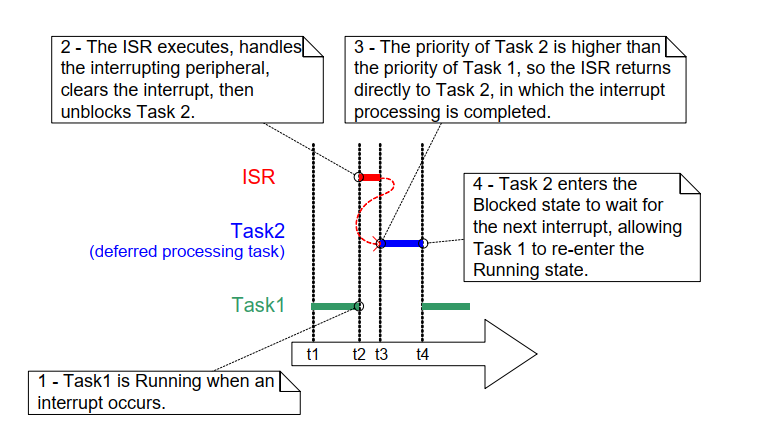
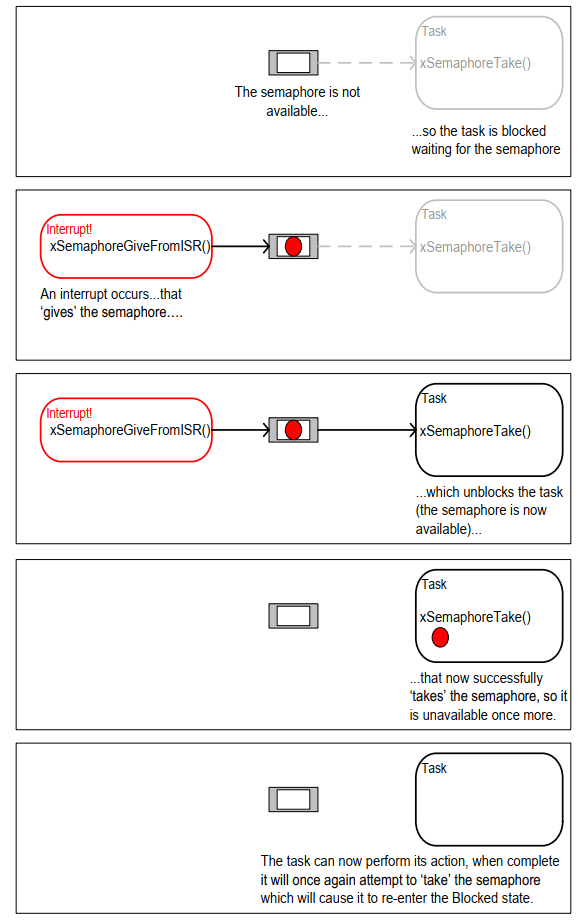
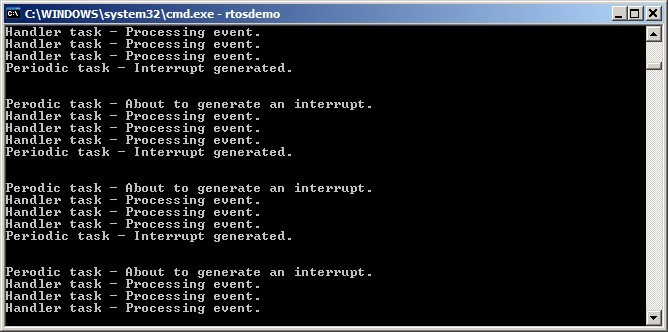

# 7 中断管理

## 7.1 简介

### 7.1.1 事件

嵌入式实时系统必须对来自环境的事件做出反应。例如，以太网外设上的数据包到达（事件）可能需要将其传递给 TCP/IP 堆栈进行处理（操作）。非简单的系统需要服务来自多个来源的事件，这些事件将具有不同的处理开销和响应时间要求。在每种情况下，都需要做出判断，以确定最佳的事件处理实现策略：

- 如何检测事件？通常使用中断，但也可以轮询输入。

- 当使用中断时，应该在中断服务例程 (ISR) 中执行多少处理，以及在 ISR 之外执行多少？通常希望将每个 ISR 保持尽可能短。

- 如何将事件传递给主（非 ISR）代码，以及如何构建此代码以最好地适应潜在的异步事件处理？

FreeRTOS 不对应用程序设计者施加任何特定的事件处理策略，但提供了允许以简单且可维护的方式实现所选策略的功能。

重要的是要区分任务的优先级和中断的优先级：

- 任务是与 FreeRTOS 运行的硬件无关的软件功能。任务的优先级由应用程序编写者在软件中分配，并且一个软件算法（调度器）决定将哪个任务置于运行状态。

- 尽管编写在软件中，中断服务例程是一个硬件功能，因为硬件控制哪个中断服务例程将运行以及何时运行。任务只有在没有 ISR 运行时才会运行，因此最低优先级的中断将中断最高优先级任务，并且任务无法抢占 ISR。

FreeRTOS 将运行的所有架构都能够处理中断，但中断进入和中断优先级分配的细节因架构而异。


### 7.1.2 范围

本章涵盖：

- 哪些 FreeRTOS API 函数可以从中断服务例程 (ISR) 中使用。
- 延迟中断处理到任务中的方法。
- 如何创建和使用二进制信号量和计数信号量。
- 二进制信号量和计数信号量的区别。
- 如何使用队列将数据传递到中断服务例程和从中传递数据。
- 一些 FreeRTOS 端口提供的中断嵌套模型。

## 7.2 从 ISR 使用 FreeRTOS API

### 7.2.1 线程安全 API

通常需要在中断服务例程 (ISR) 中使用 FreeRTOS API 函数提供的功能，但许多 FreeRTOS API 函数执行在 ISR 中无效的操作。 最显著的是将调用 API 函数的任务置于 Blocked 状态——如果 API 函数是从 ISR 中调用的，那么它不是从任务中调用的，因此没有可以置于 Blocked 状态的调用任务。 FreeRTOS 通过提供一些 API 函数的两个版本来解决这个问题；一个版本用于任务，另一个版本用于 ISR。 适用于 ISR 的函数会在其名称后附加 "FromISR"。

> *注意：切勿从 ISR 中调用名称中不包含 "FromISR" 的 FreeRTOS API 函数。*


### 7.2.2 使用单独的线程安全 API 的优势

为 ISR 提供单独的 API 允许任务代码更高效，ISR 代码更高效，并且中断入口更简单。 为了理解原因，请考虑替代方案，即为每个 API 函数提供一个版本，该版本可以从任务和 ISR 中调用。 如果 API 函数的相同版本可以从任务和 ISR 中调用，那么：

- API 函数需要额外的逻辑来确定它们是否从任务或 ISR 中被调用。 额外的逻辑会引入函数中的新路径，使函数更长、更复杂、更难测试。

- 当函数从任务中调用时，某些 API 函数参数将失效，而当函数从 ISR 中调用时，其他参数将失效。

- 每个 FreeRTOS 端口都需要提供一种机制来确定执行上下文（任务或 ISR）。

- 在确定执行上下文（任务或 ISR）并不容易的架构上，需要额外的、浪费的、更复杂的使用方式、非标准的的中断入口代码，允许通过软件提供执行上下文。


### 7.2.3 使用单独的线程安全 API 的缺点

拥有某些 API 函数的两个版本允许任务和 ISR 都更高效，但引入了一个新问题；有时需要调用一个不属于 FreeRTOS API，但使用 FreeRTOS API 的函数，既从任务中调用，又从 ISR 中调用。

这通常只在集成第三方代码时才会成为问题，因为这是应用程序编写者无法控制软件设计的情况。 如果确实出现这种情况，可以使用以下技术来克服这个问题：

- 将中断处理推迟到任务[^12]，以便 API 函数仅从任务的上下文中调用。

- 如果您正在使用支持中断嵌套的 FreeRTOS 端口，则使用以“FromISR”结尾的 API 函数版本，因为该版本可以从任务和 ISR 中调用。（反之则不然，不以“FromISR”结尾的 API 函数不得从 ISR 中调用。）

- 第三方代码通常包含一个 RTOS 抽象层，可以实现该层来测试函数被调用的上下文（任务或中断），然后调用适合该上下文的 API 函数。

[^12]: 推迟中断处理将在本书的下一节中介绍。


### 7.2.4 xHigherPriorityTaskWoken 参数

本节介绍了 `xHigherPriorityTaskWoken` 参数的概念。 如果您现在还没有完全理解本节内容，请不要担心，因为后续章节提供了实际示例。

如果中断执行了上下文切换，那么中断退出时运行的任务可能与中断进入时运行的任务不同——中断会中断一个任务，但返回到另一个任务。

FreeRTOS API 的一些函数可以将任务从 Blocked 状态移动到 Ready 状态。 这已经通过诸如 `xQueueSendToBack()` 之类的函数中看到，如果队列中存在等待数据可用的任务，则该函数将取消阻塞该任务。

如果通过 FreeRTOS API 函数取消阻塞的任务的优先级高于当前运行任务的优先级，那么根据 FreeRTOS 调度策略，应切换到更高优先级的任务。 切换到更高优先级任务的时间取决于调用 API 函数的上下文：

- 如果 API 函数是从任务中调用的：

  如果 `configUSE_PREEMPTION` 在 FreeRTOSConfig.h 中设置为 1，则在 API 函数内部（换句话说，在 API 函数退出之前）会自动发生切换到更高优先级任务。 这已经在图 6.6 中看到，其中对计时器命令队列的写入导致在写入命令队列的函数退出之前切换到 RTOS 守护进程任务。

- 如果 API 函数是从中断中调用的：

  不会在中断内部自动发生切换到更高优先级任务。 相反，会设置一个变量来通知应用程序编写者应该执行上下文切换。 中断安全 API 函数（以“FromISR”结尾的函数）有一个指针参数，称为 `pxHigherPriorityTaskWoken`，用于此目的。

  如果应该执行上下文切换，则中断安全 API 函数会将 `*pxHigherPriorityTaskWoken` 设置为 `pdTRUE`。 为了能够检测到这种情况已经发生，在第一次使用之前，`pxHigherPriorityTaskWoken` 指向的变量必须初始化为 `pdFALSE`。

  如果应用程序编写者选择不从 ISR 请求上下文切换，则更高优先级的任务将保持在 Ready 状态，直到下一次调度器运行，在最坏的情况下，将在下一个滴答中断期间发生。

  FreeRTOS API 函数只能将 `*pxHighPriorityTaskWoken` 设置为 `pdTRUE`。 如果 ISR 调用多个 FreeRTOS API 函数，则可以将同一个变量作为 `pxHigherPriorityTaskWoken` 参数传递给每个 API 函数调用，并且只需要在第一次使用之前将该变量初始化为 `pdFALSE`。

有几个原因导致上下文切换不会在中断安全版本的 API 函数内部自动发生：

- 避免不必要的上下文切换

  中断可能会在任务需要执行任何处理之前执行多次。 例如，考虑一个任务处理由中断驱动的 UART 接收到的字符串的场景；每次接收到字符时，UART ISR 切换到任务将是浪费，因为只有在接收到整个字符串后，任务才需要执行处理。

- 控制执行顺序

  中断可能会零星地、在不可预测的时间发生。 经验丰富的 FreeRTOS 用户可能希望在应用程序的特定点暂时避免切换到不同的任务，尽管这也可以使用 FreeRTOS 调度器锁定机制来实现。

- 可移植性

  这是可以在所有 FreeRTOS 端口上使用的最简单的机制。

- 效率

  针对较小处理器架构的端口仅允许在ISR的最后请求上下文切换，移除此限制将需要额外的、更复杂的代码。 它还允许在同一个ISR中调用FreeRTOS API函数不止一次，而不会在同一个ISR中生成超过一次的上下文切换请求。

- 在RTOS滴答中断中执行

  如本书稍后将看到的，可以将应用程序代码添加到RTOS滴答中断中。 在滴答中断中尝试上下文切换的结果取决于所使用的FreeRTOS端口。 在最好的情况下，它将导致对调度器的不必要调用。

使用`pxHigherPriorityTaskWoken`参数是可选的。 如果不需要，则将`pxHigherPriorityTaskWoken`设置为NULL。


### 7.2.5 portYIELD_FROM_ISR() 和 portEND_SWITCHING_ISR() 宏

本节介绍了用于从ISR请求上下文切换的宏。 如果您现在完全不理解此部分也没关系，因为后面的章节提供了实际示例。

`taskYIELD()` 是一个可以在任务中调用的宏，用于请求上下文切换。 `portYIELD_FROM_ISR()` 和 `portEND_SWITCHING_ISR()` 都是 `taskYIELD()` 的中断安全版本。 `portYIELD_FROM_ISR()` 和 `portEND_SWITCHING_ISR()` 都以相同的方式使用，并且执行相同的操作[^13]。 某些 FreeRTOS 端口仅提供这两个宏中的一个。 新版本的 FreeRTOS 端口提供了这两个宏。 本书中的示例使用 `portYIELD_FROM_ISR()`。

[^13]: 历史上，`portEND_SWITCHING_ISR()` 是在需要中断处理程序使用汇编代码包装器的 FreeRTOS 端口中使用的名称，而 `portYIELD_FROM_ISR()` 是在允许整个中断处理程序用 C 编写的 FreeRTOS 端口中使用的名称。

<a name="list7.1" title="列表 7.1 portEND_SWITCHING_ISR() 宏"></a>

```c
portEND_SWITCHING_ISR( xHigherPriorityTaskWoken );
```
***列表 7.1*** *portEND_SWITCHING_ISR() 宏*

<a name="list7.2" title="列表 7.2 portYIELD_FROM_ISR() 宏"></a>

```c
portYIELD_FROM_ISR( xHigherPriorityTaskWoken );
```
***列表 7.2*** *portYIELD_FROM_ISR() 宏*

从中断安全 API 函数传递出去的 `xHigherPriorityTaskWoken` 参数可以直接用作对 `portYIELD_FROM_ISR()` 调用的参数。

如果 `portYIELD_FROM_ISR()` 的 `xHigherPriorityTaskWoken` 参数是 `pdFALSE` (零)，则不会请求上下文切换，宏没有效果。 如果 `portYIELD_FROM_ISR()` 的 `xHigherPriorityTaskWoken` 参数不是 `pdFALSE`，则会请求上下文切换，并且运行状态中的任务可能会发生变化。 中断始终会返回到运行状态中的任务，即使在中断执行期间，运行状态中的任务发生了变化。

大多数 FreeRTOS 端口允许在 ISR 中的任何位置调用 `portYIELD_FROM_ISR()`。 少数 FreeRTOS 端口（主要是在较小的架构上），仅允许在 ISR 的末尾调用 `portYIELD_FROM_ISR()`。


## 7.3 延迟中断处理

通常认为，保持 ISR 尽可能短是最佳实践。 原因包括：

- 即使任务被分配了非常高的优先级，它们也只有在硬件未服务任何中断时才会运行。

- ISR 会扰乱（增加“抖动”）任务的开始时间和执行时间。

- 根据 FreeRTOS 运行的架构，在 ISR 执行期间可能无法接受任何新的中断，或者至少是新中断的一个子集。

- 应用程序编写者需要考虑资源（例如变量、外设和内存缓冲区）同时被任务和 ISR 访问的后果，并加以防护。

- 一些 FreeRTOS 端口允许中断嵌套，但中断嵌套会增加复杂性和降低可预测性。 ISR 越短，嵌套的可能性就越小。

一个中断服务例程必须记录中断的原因，并清除中断。 中断所必需的任何其他处理通常可以在任务中执行，从而允许中断服务例程尽快退出。 这被称为“延迟中断处理”，因为中断所必需的处理被“延迟”从 ISR 到任务。

将中断处理延迟到任务中，还允许应用程序编写者相对于应用程序中的其他任务确定处理的优先级，并使用所有 FreeRTOS API 函数。

如果延迟中断处理的任务的优先级高于任何其他任务的优先级，那么处理将立即执行，就好像处理已经在 ISR 中执行一样。 这种情况如图 7.1 所示，其中任务 1 是一个正常的应用程序任务，任务 2 是延迟中断处理的任务。

<a name="fig7.1" title="图 7.1 在高优先级任务中完成中断处理"></a>

* * *

***图 7.1*** *在高优先级任务中完成中断处理*
* * *

在图 7.1 中，中断处理从时间 t2 开始，实际上在时间 t4 结束，但只有在时间 t2 和 t3 之间的时间段是在 ISR 中花费的。 如果没有使用延迟中断处理，那么在时间 t2 和 t4 之间的时间段将全部在 ISR 中花费。

没有绝对的规则来确定何时最好在中断服务例程（ISR）中执行所有由中断触发的处理，以及何时最好将部分处理延迟到任务中。将处理延迟到任务中最有用的情况是：

- 由中断触发的处理不是简单的。例如，如果中断只是存储模数转换的结果，那么几乎可以肯定这是在ISR内部执行的最佳选择，但如果转换结果还需要通过软件滤波器，那么最好在任务中执行该滤波器。

- 方便中断处理执行一个无法在ISR中执行的操作，例如写入控制台或分配内存。

- 中断处理不是确定的——这意味着无法提前知道处理需要多长时间。

以下部分描述并演示了本章迄今为止介绍的概念，包括可用于实现延迟中断处理的 FreeRTOS 功能。

## 7.4 用于同步的二进制信号量

中断安全版本的二进制信号量 API 可用于在每次特定中断发生时唤醒任务，从而有效地将任务与中断同步。这允许将中断事件处理的大部分内容实现于同步任务中，而仅将非常快速和简短的部分保留在 ISR 中。如上一节所述，二进制信号量用于“延迟”中断处理到任务[^14]。

[^14]: 使用直接到任务通知唤醒任务比使用二进制信号量更有效。直接到任务通知将在第 10 章“任务通知”中介绍。

如在图 7.1 中先前演示的那样，如果中断处理特别关键，则可以设置延迟处理任务的优先级，以确保该任务始终抢占系统中的其他任务。然后，ISR 可以实现包含对 `portYIELD_FROM_ISR()` 的调用，从而确保 ISR 直接返回到中断处理正在延迟的任务。这会确保整个事件处理在时间上连续执行（没有中断），就好像它全部都已实现于 ISR 本身一样。图 7.2 重复了图 7.1 中显示的场景，但文本已更新为描述如何使用信号量控制延迟处理任务的执行。

<a name="fig7.2" title="图 7.2 使用二进制信号量实现延迟中断处理"></a>

* * *

***图 7.2*** *使用二进制信号量实现延迟中断处理*
* * *

延迟处理任务使用阻塞的“take”信号量调用作为进入Blocked状态并等待事件发生的手段。当事件发生时，ISR 使用对同一信号量的“give”操作来唤醒任务，以便可以继续所需的事件处理。

“获取信号量”和“释放信号量”是概念，其含义取决于其使用场景。在此中断同步场景中，二进制信号量可以被概念化为长度为一的队列。队列在任何时候最多只能包含一个项目，因此始终为空或满（因此是二进制的）。通过调用 `xSemaphoreTake()`，中断处理被延迟的任务实际上尝试从队列中读取，并带有超时时间，如果队列为空，则导致任务进入 Blocked 状态。当事件发生时，ISR 使用 `xSemaphoreGiveFromISR()` 函数将令牌（信号量）放入队列中，使队列满。这会导致任务退出 Blocked 状态并删除令牌，使队列再次为空。当任务完成其处理后，它再次尝试从队列中读取，发现队列为空，重新进入 Blocked 状态以等待下一个事件。此序列在图 7.3 中演示。

图 7.3 显示了中断“给予”信号量，即使它没有首先“获取”它，以及任务“获取”信号量，但从未将其返回。这就是为什么将此场景描述为概念上类似于向队列写入和从中读取的原因。它常常引起困惑，因为它不遵循其他信号量使用场景的相同规则，在这些场景中，获取信号量的任务必须始终将其返回——例如章节 8 中描述的资源管理场景。

<a name="fig7.3" title="图 7.3 使用二进制信号量与中断同步"></a>

* * *

***图 7.3*** *使用二进制信号量与中断同步*
* * *

### 7.4.1 `xSemaphoreCreateBinary()` API 函数

FreeRTOS 还包括 `xSemaphoreCreateBinaryStatic()` 函数，该函数在编译时静态分配创建二进制信号量所需的内存：所有类型的 FreeRTOS 信号量的句柄都存储在 `SemaphoreHandle_t` 类型的变量中。

在信号量可以使用之前，必须先创建它。要创建二进制信号量，请使用 `xSemaphoreCreateBinary()` API 函数[^15]。

[^15]: 一些信号量 API 函数实际上是宏，而不是函数。为了简单起见，本书中将它们全部称为函数。

<a name="list7.3" title="列表 7.3 `xSemaphoreCreateBinary()` API 函数原型"></a>

```c
SemaphoreHandle_t xSemaphoreCreateBinary( void );
```
***列表 7.3*** *`xSemaphoreCreateBinary()` API 函数原型*

**`xSemaphoreCreateBinary()` 返回值**

- 返回值

  如果返回 NULL，则表示无法创建信号量，因为 FreeRTOS 无法分配信号量数据结构所需的堆内存。

  如果返回非 NULL 值，则表示信号量已成功创建。返回的值应存储为创建的信号量的句柄。


### 7.4.2 `xSemaphoreTake()` API 函数

“获取”信号量意味着“获取”或“接收”信号量。 信号量只能在可用时才能获取。

除了递归互斥锁之外，所有类型的 FreeRTOS 信号量都可以使用 `xSemaphoreTake()` 函数来“获取”。

`xSemaphoreTake()` 不应从中断服务例程中使用。

<a name="list7.4" title="列表 7.4 `xSemaphoreTake()` API 函数原型"></a>

```c
BaseType_t xSemaphoreTake( SemaphoreHandle_t xSemaphore, TickType_t xTicksToWait );
```
***列表 7.4*** *`xSemaphoreTake()` API 函数原型*

**`xSemaphoreTake()` 参数和返回值**

- `xSemaphore`

  要“获取”的信号量。

  信号量由 `SemaphoreHandle_t` 类型的变量引用。 在使用之前，必须显式创建它。

- `xTicksToWait`

  如果信号量当前不可用，任务应在 Blocked 状态中等待信号量的最长时间。

  如果 `xTicksToWait` 为零，则如果信号量不可用，`xSemaphoreTake()` 将立即返回。

  阻塞时间以滴答周期为单位指定，因此它所代表的绝对时间取决于滴答频率。 可以使用宏 `pdMS_TO_TICKS()` 将以毫秒为单位指定的时间转换为以滴答为单位指定的时间。

  将 `xTicksToWait` 设置为 `portMAX_DELAY` 会导致任务在 `FreeRTOSConfig.h` 中将 `INCLUDE_vTaskSuspend` 设置为 1 时，如果信号量不可用，则无限期地等待（没有超时）。

- 返回值

  有两种可能的返回值：

  - `pdPASS`

    只有当 `xSemaphoreTake()` 的调用成功获取信号量时，才会返回 `pdPASS`。

    如果指定了阻塞时间（`xTicksToWait` 不是零），则在阻塞时间到期之前，调用任务可能已被置于 Blocked 状态以等待信号量。

  - `pdFALSE`

    信号量不可用。

    如果指定了阻塞时间（`xTicksToWait` 不是零），则调用任务将被置于 Blocked 状态以等待信号量可用，但在发生这种情况之前，阻塞时间已到期。


### 7.4.3 `xSemaphoreGiveFromISR()` API 函数

二进制和计数信号量[^16] 可以使用 `xSemaphoreGiveFromISR()` 函数来“给出”。

[^16]: 计数信号量在本书的后续部分中进行描述。

`xSemaphoreGiveFromISR()` 是 `xSemaphoreGive()` 的中断安全版本，因此具有本章开头描述的 `pxHigherPriorityTaskWoken` 参数。

<a name="list" title="列表 7.5 `xSemaphoreGiveFromISR()` API 函数原型"></a>

```c
BaseType_t xSemaphoreGiveFromISR( SemaphoreHandle_t xSemaphore,
                                  BaseType_t *pxHigherPriorityTaskWoken );
```
***列表 7.5*** *`xSemaphoreGiveFromISR()` API 函数原型*

**`xSemaphoreGiveFromISR()` 参数和返回值**

- `xSemaphore`

  要“给出”的信号量。

  信号量由 `SemaphoreHandle_t` 类型的变量引用，并在使用之前必须显式创建。

- `pxHigherPriorityTaskWoken`

  可能一个信号量将有一个或多个任务在其上阻塞，等待信号量可用。 调用 `xSemaphoreGiveFromISR()` 可以使信号量可用，并因此导致等待信号量的任务离开 Blocked 状态。 如果调用 `xSemaphoreGiveFromISR()` 导致任务离开 Blocked 状态，并且该未阻塞任务的优先级高于当前正在执行的任务（中断的任务），那么，在内部，`xSemaphoreGiveFromISR()` 将将 `*pxHigherPriorityTaskWoken` 设置为 `pdTRUE`。

如果 `xSemaphoreGiveFromISR()` 将此值设置为 `pdTRUE`，那么通常应该在退出中断之前执行上下文切换。 这将确保中断直接返回到最高优先级就绪状态任务。

- 返回值

  有两种可能的返回值：

  - `pdPASS`

    只有当 `xSemaphoreGiveFromISR()` 的调用成功时，才会返回 `pdPASS`。

  - `pdFAIL`

    如果信号量已经可用，则无法给出，并且 `xSemaphoreGiveFromISR()` 将返回 `pdFAIL`。

<a name="example7.1" title="示例 7.1 使用二进制信号量与中断同步任务"></a>
---
***示例 7.1*** *使用二进制信号量与中断同步任务*

---

此示例使用二进制信号量从中断服务例程中唤醒任务，从而有效地将任务与中断同步。

一个简单的周期性任务用于每 500 毫秒生成一个软件中断。 由于在某些目标环境中钩入真实中断的复杂性，因此使用软件中断是为了方便。 列表 7.6 显示了周期性任务的实现。 请注意，任务在生成中断之前和之后都会打印出一个字符串。 这使得在执行示例时产生的输出中可以观察到执行顺序。

<a name="list7.6" title="列表 7.6 示例 7.1 中周期性生成软件中断的任务实现"></a>

```c
/* 在此示例中使用的软件中断编号。
   此处显示的代码来自 Windows 项目，其中 0 到 2 的数字由
   FreeRTOS Windows 端口本身使用，因此 3 是应用程序可用的第一个数字。 */
#define mainINTERRUPT_NUMBER 3

static void vPeriodicTask( void *pvParameters )
{
    const TickType_t xDelay500ms = pdMS_TO_TICKS( 500UL );

    /* 与大多数任务一样，此任务在无限循环中实现。 */
    for( ;; )
    {
        /* 阻塞，直到再次生成软件中断的时间。 */
        vTaskDelay( xDelay500ms );

        /* 生成中断，在生成中断之前和之后打印一条消息，
           以便从输出中可以明显看出执行顺序。

           生成软件中断的语法取决于
           使用的 FreeRTOS 端口。 下面使用的语法只能
           与 FreeRTOS Windows 端口一起使用，在该端口中此类中断仅被
           模拟。 */
        vPrintString( "周期性任务 - 即将生成一个中断。\r\n" );
        vPortGenerateSimulatedInterrupt( mainINTERRUPT_NUMBER );
        vPrintString( "周期性任务 - 中断已生成。\r\n\r\n\r\n" );
    }
}
```
***列表 7.6*** *示例 7.1 中周期性生成软件中断的任务实现*


列表 7.7 显示了中断处理延迟的任务的实现——通过使用二进制信号量与软件中断同步的任务。 同样，在任务的每次迭代中打印一条字符串，因此可以从执行示例时产生的输出中明显看出任务和中断的执行顺序。

需要注意的是，虽然列表 7.7 中显示的代码对于示例 7.1 来说足够了，在该示例中中断由软件生成，但对于中断由硬件外设生成的情况，它是不够的。以下子节描述了如何更改代码结构使其适用于硬件生成的的中断。


<a name="list7.7." title="列表 7.7 延迟中断处理的任务的实现（与中断同步的任务）"></a>

```c
static void vHandlerTask( void *pvParameters )
{
    /* 与大多数任务一样，此任务在无限循环中实现。 */
    for( ;; )
    {
        /* 使用信号量等待事件。信号量是在调度器启动之前创建的，因此在
           此任务第一次运行之前。任务无限期地阻塞，这意味着此函数
           只有在信号量成功获取后才会返回——因此无需检查
           xSemaphoreTake() 返回的值。 */
        xSemaphoreTake( xBinarySemaphore, portMAX_DELAY );

        /* 要到达此处，事件必须已经发生。处理事件（在此
           情况下，只需打印一条消息）。 */
        vPrintString( "处理任务 - 处理事件。\r\n" );
    }
}
```
***列表 7.7*** *示例 7.1 中延迟中断处理的任务的实现（与中断同步的任务）*


列表 7.8 显示了 ISR。它除了“给予”信号量以释放延迟中断处理的任务之外，几乎不做任何其他事情。

注意 `xHigherPriorityTaskWoken` 变量的使用方式。在调用 `xSemaphoreGiveFromISR()` 之前，它被设置为 `pdFALSE`，然后用作参数，当调用 `portYIELD_FROM_ISR()` 时。如果 `xHigherPriorityTaskWoken` 等于 `pdTRUE`，则 `portYIELD_FROM_ISR()` 宏会在内部请求上下文切换。

ISR 的原型以及用于强制上下文切换的宏，都适用于 FreeRTOS Windows 端口，可能与其他 FreeRTOS 端口不同。请参考 FreeRTOS.org 网站上的特定于端口的文档页面以及 FreeRTOS 下载中提供的示例，以找到适用于您所使用的端口所需的语法。

与 FreeRTOS 运行的大多数架构不同，FreeRTOS Windows 端口要求 ISR 返回一个值。Windows 端口提供的 `portYIELD_FROM_ISR()` 宏的实现包含了返回值语句，因此列表 7.8 没有显式地显示返回值。

<a name="list7.8" title="列表 7.8 示例 7.1 中使用的软件中断的 ISR"></a>

```c
static uint32_t ulExampleInterruptHandler( void )
{
    BaseType_t xHigherPriorityTaskWoken;

    /* xHigherPriorityTaskWoken 参数必须初始化为
       pdFALSE，因为它将在中断安全 API 函数内部设置为 pdTRUE，如果需要上下文切换。 */
    xHigherPriorityTaskWoken = pdFALSE;

    /* '给予' 信号量以释放任务，并将 xHigherPriorityTaskWoken 的地址作为
       中断安全 API 函数的 pxHigherPriorityTaskWoken 参数传递。 */
    xSemaphoreGiveFromISR( xBinarySemaphore, &xHigherPriorityTaskWoken );

    /* 将 xHigherPriorityTaskWoken 值传递到 portYIELD_FROM_ISR()。
       如果 xHigherPriorityTaskWoken 在
       xSemaphoreGiveFromISR() 内部被设置为 pdTRUE，则调用 portYIELD_FROM_ISR() 将请求
       上下文切换。如果 xHigherPriorityTaskWoken 仍然是 pdFALSE，则
       调用 portYIELD_FROM_ISR() 将无效。与大多数 FreeRTOS
       端口不同，Windows 端口要求 ISR 返回一个值——返回值语句在 Windows 版本的 portYIELD_FROM_ISR() 内部。 */
    portYIELD_FROM_ISR( xHigherPriorityTaskWoken );
}
```
***列表 7.8*** *示例 7.1 中使用的软件中断的 ISR*

`main()` 函数创建二进制信号量、创建任务、安装中断处理程序并启动调度器。实现方式如列表 7.9 所示。

安装中断处理程序的函数的语法
特定于 FreeRTOS Windows 端口，可能与其他 FreeRTOS 端口不同。请参考 FreeRTOS.org 网站上的特定于端口的文档页面以及 FreeRTOS 下载中提供的示例，以找到适用于您所使用的端口所需的语法。

<a name="list7.9" title="列表 7.9 示例 7.1 的 main() 实现"></a>

```c
int main( void )
{
    /* 在使用信号量之前，必须显式地创建它。在此示例中，创建了一个二进制信号量。 */
    xBinarySemaphore = xSemaphoreCreateBinary();

    /* 检查信号量是否创建成功。 */
    if( xBinarySemaphore != NULL )
    {
        /* 创建 'handler' 任务，这是中断处理被推迟到的任务。这是与中断同步的任务。handler 任务以高优先级创建，以确保在中断退出后立即运行。在本例中，选择优先级 3。 */
        xTaskCreate( vHandlerTask, "Handler", 1000, NULL, 3, NULL );

        /* 创建周期性生成软件中断的任务。此任务的优先级低于 handler 任务，以确保每次 handler 任务退出 Blocked 状态时都会被抢占。 */
        xTaskCreate( vPeriodicTask, "Periodic", 1000, NULL, 1, NULL );

        /* 安装软件中断的处理程序。执行此操作所需的语法取决于所使用的 FreeRTOS 端口。此处显示的语法只能与 FreeRTOS windows 端口一起使用，在该端口中，此类中断仅被模拟。 */
        vPortSetInterruptHandler( mainINTERRUPT_NUMBER,
                                  ulExampleInterruptHandler );

        /* 启动调度器，以便创建的任务开始执行。 */
        vTaskStartScheduler();
    }

    /* 正常情况下，永远不会到达以下行。 */
    for( ;; );
}
```
***列表 7.9*** *示例 7.1 的 main() 实现*

示例 7.1 产生图 7.4 中所示的输出。正如预期的那样，`vHandlerTask()` 在中断生成后立即进入 Running 状态，因此任务的输出分割了周期性任务产生的输出。图 7.5 提供了进一步的解释。

<a name="fig7.4" title="图 7.4 执行示例 7.1 时产生的输出"></a>
<a name="fig7.5" title="图 7.5 执行示例 7.1 时的执行顺序"></a>

* * *

***图 7.4*** *执行示例 7.1 时产生的输出*


***图 7.5*** *执行示例 7.1 时的执行顺序*
* * *


### 7.4.4 改进示例 7.1 中使用的任务的实现

示例 7.1 使用二进制信号量来同步任务与中断。执行顺序如下：

1. 中断发生。

1. 中断服务程序 (ISR) 执行并“给予”信号量以释放任务。

1. 任务在 ISR 之后立即执行，并“获取”信号量。

1. 任务处理事件，然后尝试再次“获取”信号量——由于信号量尚未可用（尚未发生另一个中断），因此进入 Blocked 状态。

示例 7.1 中使用的任务结构仅在中断发生频率相对较低时才适用。要理解原因，请考虑如果第二个和第三个中断在任务完成第一个中断的处理之前发生会发生什么：

- 当第二个 ISR 执行时，信号量将为空，因此 ISR 将给予信号量，任务将在完成处理第一个事件后立即处理第二个事件。该场景如图 7.6 所示。

- 当第三个 ISR 执行时，信号量将已经可用，从而阻止 ISR 再次给予信号量，因此任务将不知道第三个事件已经发生。该场景如图 7.7 所示。

<a name="fig7.6" title="图 7.6 在任务完成第一个事件处理之前发生一个中断的场景"></a>
<a name="fig7.7" title="图 7.7 在任务完成第一个事件处理之前发生两个中断的场景"></a>

* * *

***图 7.6*** *在任务完成第一个事件处理之前发生一个中断的场景*


***图 7.7*** *在任务完成第一个事件处理之前发生两个中断的场景*
* * *

示例 7.1 中使用的延迟中断处理任务，如清单 7.7 所示，结构设计为在每次调用 `xSemaphoreTake()` 之间仅处理一个事件。这对于示例 7.1 来说是足够的，因为生成这些事件的中断是由软件触发的，并且发生在可预测的时间。在实际应用中，中断是由硬件生成的，并且发生在不可预测的时间。因此，为了最大限度地减少错过中断的机会，延迟中断处理任务必须设计为在每次调用 `xSemaphoreTake()` 之间处理所有已有的事件[^17]。清单 7.10 演示了这一点，它展示了 UART 延迟中断处理程序如何进行结构化。在清单 7.10 中，假设 UART 在每次接收到字符时都会生成一个接收中断，并且 UART 将接收到的字符放入硬件 FIFO（硬件缓冲区）中。

[^17]: 另一种方法是使用计数信号量或直接任务通知来计数事件。计数信号量在下一节中进行描述。直接任务通知在第 10 章“任务通知”中进行描述。由于它们在运行时和 RAM 使用方面都最高效，因此直接任务通知是首选方法。

示例 7.1 中使用的延迟中断处理任务还有另一个弱点；它在调用 `xSemaphoreTake()` 时没有使用超时。相反，任务将 `portMAX_DELAY` 作为 `xSemaphoreTake()` 的 `xTicksToWait` 参数传递，这会导致任务无限期地（没有超时）等待信号量可用。无限超时通常在示例代码中使用，因为它们的使用简化了示例的结构，因此使示例更容易理解。但是，在实际应用中，无限超时通常是不好的做法，因为它们使得从错误中恢复变得困难。例如，考虑以下场景：一个任务正在等待中断给予信号量，但硬件中的错误状态阻止了中断的生成：

- 如果任务没有超时等待，它将不知道错误状态，并且将永远等待。

- 如果任务带有超时等待，那么 `xSemaphoreTake()` 在超时时将返回 `pdFAIL`，任务可以检测并清除下一次执行时出现的错误。此场景也演示在列表 7.10 中。

<a name="list7.10" title="列表 7.10 使用 UART 接收... 的延迟中断处理任务的推荐结构"></a>

```c
static void vUARTReceiveHandlerTask( void *pvParameters )
{
    /* xMaxExpectedBlockTime 保持两个中断之间预期的最大时间。 */
    const TickType_t xMaxExpectedBlockTime = pdMS_TO_TICKS( 500 );

    /* 像大多数任务一样，此任务在无限循环中实现。 */
    for( ;; )
    {
        /* 信号量由 UART 的接收 (Rx) 中断给出。
           等待最长 xMaxExpectedBlockTime 个滴答时钟周期以获取下一个
           中断。 */
        if( xSemaphoreTake( xBinarySemaphore, xMaxExpectedBlockTime ) == pdPASS)
        {
            /* 成功获取了信号量。在再次调用 xSemaphoreTake() 之前，处理所有挂起的 Rx 事件。
               每个 Rx 事件会将一个字符放置在 UART 的接收 FIFO 中，并且 UART_RxCount()
               假定返回 FIFO 中字符的数量。 */
            while( UART_RxCount() > 0 )
            {
                /* UART_ProcessNextRxEvent() 假定处理一个 Rx
                   字符，将 FIFO 中的字符数减少 1。 */
                UART_ProcessNextRxEvent();
            }

            /* 没有更多 Rx 事件挂起（FIFO 中没有更多字符），因此循环返回并调用 xSemaphoreTake() 以等待
               下一个中断。在此代码中的此点和调用 xSemaphoreTake() 之间发生的任何中断将被延迟在
               信号量中，因此不会丢失。 */
        }
        else
        {
            /* 在预期的时间内没有收到事件。检查并，如果必要，清除 UART 中可能阻止 UART 生成任何更多
               中断的任何错误条件。 */
            UART_ClearErrors();
        }
    }
}
```
***列表 7.10*** *使用 UART 接收处理程序作为示例，延迟中断处理任务的推荐结构*


## 7.5 计数信号量

就像二进制信号量可以被认为是长度为一的队列一样，计数信号量可以被认为是长度大于一的队列。任务不关心存储在队列中的数据——只关心队列中的项目数量。
要使计数信号量可用，必须在 FreeRTOSConfig.h 中将 `configUSE_COUNTING_SEMAPHORES` 设置为 1。

每次计数信号量被“给出”时，队列中的另一个空间会被使用。队列中的项目数量是信号量的“计数”值。

计数信号量通常用于以下两种情况：

1. 计数事件[^18]

   在这种情况下，事件处理程序每次发生事件时都会“给出”信号量，从而在每次“给出”时递增信号量的计数值。任务在每次处理事件时都会“获取”信号量，从而在每次“获取”时递减信号量的计数值。计数值是已发生的事件数量与已处理的事件数量之间的差值。此机制如图 7.8 所示。

   用于计数事件的计数信号量使用零的初始计数值创建。

   [^18]: 使用直接到任务的通知来计数事件比使用计数信号量更有效。直接到任务的通知将在第 10 章中介绍。

2. 资源管理。

   在这种情况下，计数值指示可用的资源数量。要获得对资源的控制权，任务首先必须获取信号量，这会递减信号量的计数值。当计数值达到零时，没有空闲资源。当任务完成对资源的控制时，它会将信号量“给出”回去，这会递增信号量的计数值。

   用于管理资源的计数信号量被创建，使其初始计数值等于可用资源的数量。第 7 章涵盖使用信号量来管理资源。

<a name="fig7.8" title="图 7.8 使用计数信号量来“计数”事件"></a>

* * *

***图 7.8*** *使用计数信号量来“计数”事件*
* * *

### 7.5.1 `xSemaphoreCreateCounting()` API 函数

FreeRTOS 还包括 `xSemaphoreCreateCountingStatic()` 函数，该函数在编译时静态分配创建计数信号量所需的内存：所有类型的 FreeRTOS 信号量的句柄都存储在 `SemaphoreHandle_t` 类型的变量中。

在信号量可以使用之前，必须先创建它。要创建计数信号量，请使用 `xSemaphoreCreateCounting()` API 函数。

<a name="list7.11" title="列表 7.11 `xSemaphoreCreateCounting()` API 函数原型"></a>

```c
SemaphoreHandle_t xSemaphoreCreateCounting( UBaseType_t uxMaxCount,
                                            UBaseType_t uxInitialCount );
```
***列表 7.11*** *`xSemaphoreCreateCounting()` API 函数原型*

**`xSemaphoreCreateCounting()` 参数和返回值**

- `uxMaxCount`

   信号量计数的最大值。继续队列类比，`uxMaxCount` 值实际上是队列的长度。

当信号量用于计数或锁存事件时，`uxMaxCount` 是可以锁存的事件的最大数量。

   当信号量用于管理对资源集合的访问时，`uxMaxCount` 应设置为可用资源的总数。

- `uxInitialCount`

  信号量创建后，信号量的初始计数值。

  当信号量用于计数或锁存事件时，
  `uxInitialCount` 应设置为零（因为在创建信号量时，我们假设尚未发生任何事件）。

  当信号量用于管理对资源集合的访问时，`uxInitialCount` 应设置为等于 `uxMaxCount`（因为
  在创建信号量时，我们假设所有资源都可用）。

- 返回值

  如果返回 NULL，则无法创建信号量，因为 FreeRTOS 无法分配足够的堆内存来分配信号量数据结构。第 3 章提供了有关堆内存管理的更多信息。

如果返回非 NULL 值，则表示信号量已成功创建。返回的值应存储为创建的信号量的句柄。

<a name="example7.2" title="示例 7.2 使用计数信号量同步任务与中断"></a>
---
***示例 7.2*** *使用计数信号量同步任务与中断*

---

示例 7.2 通过使用计数信号量代替二进制信号量来改进示例 7.1 的实现。`main()` 函数被修改为使用 `xSemaphoreCreateCounting()` 函数调用代替 `xSemaphoreCreateBinary()` 函数调用。新的 API 调用见清单 7.12。

<a name="list7.12" title="清单 7.12 用于在示例 7.2 中创建计数信号量的 xSemaphoreCreateCounting() 函数调用"></a>

```c
/* 在使用信号量之前，必须显式地创建它。在此示例中，创建了一个计数信号量。信号量被创建为具有最大计数值 10 和初始计数值 0。 */
xCountingSemaphore = xSemaphoreCreateCounting( 10, 0 );
```
***清单 7.12*** *用于在示例 7.2 中创建计数信号量的 xSemaphoreCreateCounting() 函数调用*

为了模拟多个事件以高频率发生，中断服务例程被修改为在每个中断中“释放”信号量多次。每个事件都保存在信号量的计数值中。修改后的中断服务例程见清单 7.13。

<a name="list7.13" title="清单 7.13 示例 7.2 使用的中断服务例程的实现"></a>

```c
static uint32_t ulExampleInterruptHandler( void )
{
    BaseType_t xHigherPriorityTaskWoken;

    /* xHigherPriorityTaskWoken 参数必须初始化为 pdFALSE，
       因为它将在需要上下文切换时在中断安全 API 函数内部设置为 pdTRUE。 */
    xHigherPriorityTaskWoken = pdFALSE;

    /* '释放'信号量多次。第一次将取消阻塞延迟中断处理任务，
       后续的'释放'是为了演示信号量捕获事件，以便将中断延迟的任务
       能够依次处理这些事件，而不会丢失事件。这模拟了处理器接收到多个中断的情况，
       即使在本例中，事件是在单个中断发生期间模拟的。 */
    xSemaphoreGiveFromISR( xCountingSemaphore, &xHigherPriorityTaskWoken );
    xSemaphoreGiveFromISR( xCountingSemaphore, &xHigherPriorityTaskWoken );
    xSemaphoreGiveFromISR( xCountingSemaphore, &xHigherPriorityTaskWoken );

    /* 将 xHigherPriorityTaskWoken 值传递给 portYIELD_FROM_ISR()。
       如果在 xSemaphoreGiveFromISR() 内部将 xHigherPriorityTaskWoken 设置为 pdTRUE，
       则调用 portYIELD_FROM_ISR() 将请求上下文切换。如果 xHigherPriorityTaskWoken 仍然是 pdFALSE，
       则调用 portYIELD_FROM_ISR() 将无效。与大多数 FreeRTOS 端口不同，
       Windows 端口要求 ISR 返回一个值 - 返回语句位于 Windows 版本的 portYIELD_FROM_ISR() 中。 */
    portYIELD_FROM_ISR( xHigherPriorityTaskWoken );
}
```
***清单 7.13*** *示例 7.2 使用的中断服务例程的实现*

所有其他函数与示例 7.1 中使用的函数保持不变。

当执行示例 7.2 时，产生的输出如图 7.9 所示。
如可以观察到的，延迟中断处理的任务每次生成中断时都会处理所有三个（模拟的）事件。事件被捕获到信号量的计数值中，允许任务依次处理它们。


<a name="fig7.9" title="图 7.9 当执行示例 7.2 时产生的输出"></a>

* * *

***图 7.9*** *当执行示例 7.2 时产生的输出*
* * *


## 7.6 将工作推迟给 RTOS 守护任务

到目前为止，所呈现的延迟中断处理示例要求应用程序编写者为每个使用延迟处理技术的的中断创建一个任务。 也可以使用 `xTimerPendFunctionCallFromISR()`[^19] API 函数将中断处理推迟到 RTOS 守护任务，从而无需为每个中断创建单独的任务。 将中断处理推迟到守护任务被称为“集中式延迟中断处理”。

[^19]: 守护任务最初
被称为定时器服务任务，因为它最初仅用于执行软件定时器回调函数。 因此，
`xTimerPendFunctionCall()` 实现了在 timers.c 中，并且，
遵循将函数名称前缀为函数实现所在文件名的方式，该函数名称被前缀为 'Timer'。

第 6 章描述了与软件定时器相关的 FreeRTOS API 函数如何将命令发送到定时器命令队列中的守护任务。
`xTimerPendFunctionCall()` 和 `xTimerPendFunctionCallFromISR()` API 函数使用相同的定时器命令队列来发送一个“执行函数”命令到守护任务。 发送到守护任务的函数将在守护任务的上下文中执行。

集中式延迟中断处理的优点包括：

- 更低的资源使用量

  它消除了为每个延迟中断创建单独任务的需要。

- 简化的用户模型

  延迟中断处理函数是一个标准的 C 函数。

集中式延迟中断处理的缺点包括：

- 灵活性较低

  无法单独设置每个延迟中断处理任务的优先级。 每个延迟中断处理函数都以守护任务的优先级执行。 如第 6 章所述，守护任务的优先级由
  FreeRTOSConfig.h 中的编译时常量 `configTIMER_TASK_PRIORITY` 设置。

- 确定性较低

  `xTimerPendFunctionCallFromISR()` 将命令发送到定时器命令队列的末尾。 队列中已经存在的命令将在守护任务处理 `xTimerPendFunctionCallFromISR()` 发送到队列的“执行函数”命令之前被处理。

不同的中断具有不同的时间约束，因此在同一应用程序中使用这两种延迟中断处理的方法是很常见的。


### 7.6.1 `xTimerPendFunctionCallFromISR()` API 函数

`xTimerPendFunctionCallFromISR()` 是 `xTimerPendFunctionCall()` 的中断安全版本。 这两个 API 函数允许应用程序编写者提供的一个函数由 RTOS 守护任务执行，并因此在守护任务的上下文中执行。 要执行的函数及其输入参数的值都通过定时器命令队列发送到守护任务。 函数实际执行的时间取决于守护任务相对于应用程序中其他任务的优先级。

<a name="list7.14" title="列表 7.14 `xTimerPendFunctionCallFromISR()` API 函数原型"></a>

```c
BaseType_t xTimerPendFunctionCallFromISR( PendedFunction_t
                                          xFunctionToPend,
                                          void *pvParameter1,
                                          uint32_t ulParameter2,
                                          BaseType_t *pxHigherPriorityTaskWoken );
```
***列表 7.14*** *`xTimerPendFunctionCallFromISR()` API 函数原型*

<a name="list7.15" title="列表 7.15 `xTimerPendFunctionCallFromISR()` 中 `xFunctionToPend` 参数传递的函数的原型..."></a>

```c
void vPendableFunction( void *pvParameter1, uint32_t ulParameter2 );
```
***列表 7.15*** *`xTimerPendFunctionCallFromISR()` 中 `xFunctionToPend` 参数传递的函数必须符合的原型*

**`xTimerPendFunctionCallFromISR()` 参数和返回值**

- `xFunctionToPend`

  指向将在守护任务中执行的函数的指针（实际上，只是函数名称）。 该函数的原型必须与列表 7.15 中所示的原型相同。

- `pvParameter1`

  将传递到由守护任务执行的函数中，作为该函数的 `pvParameter1` 参数的值。 该参数具有 `void *` 类型，允许它用于传递任何数据类型。 例如，整数类型可以直接转换为 `void *`，或者可以使用 `void *` 指向结构体。

- `ulParameter2`

  将传递到由守护任务执行的函数中，作为该函数的 `ulParameter2` 参数的值。

- `pxHigherPriorityTaskWoken`

  `xTimerPendFunctionCallFromISR()` 将写入定时器命令队列。 如果 RTOS 守护任务正处于阻塞状态，等待定时器命令队列中的数据可用，那么写入定时器命令队列将导致守护任务离开阻塞状态。 如果守护任务的优先级高于当前正在执行的任务（中断任务）的优先级，那么，内部地，`xTimerPendFunctionCallFromISR()` 将将 `*pxHigherPriorityTaskWoken` 设置为 `pdTRUE`。

如果 `xTimerPendFunctionCallFromISR()` 将此值设置为 `pdTRUE`，则必须在退出中断之前执行上下文切换。 这将确保中断直接返回到守护任务，因为守护任务将是最高优先级就绪状态的任务。

- 返回值

  有两种可能的返回值：

  - `pdPASS`

    如果将“执行函数”命令写入了定时器命令队列，则将返回 `pdPASS`。

  - `pdFAIL`

    如果由于定时器命令队列已满，无法将“执行函数”命令写入定时器命令队列，则将返回 `pdFAIL`。 第 6 章描述了如何设置定时器命令队列的长度。


<a name="example7.3" title="Example 7.3 Centralized deferred interrupt processing"></a>
---
***示例 7.3*** *集中式延迟中断处理*

---

示例 7.3 提供了与示例 7.1 类似的功能，但未使用信号量，也没有创建专门的任务来执行中断所必需的处理。 相反，处理由 RTOS 守护任务执行。

示例 7.3 中使用的中断服务例程在列表 7.16 中所示。
它调用 `xTimerPendFunctionCallFromISR()` 将指向名为 `vDeferredHandlingFunction()` 的函数的指针传递给守护任务。延迟中断处理由 `vDeferredHandlingFunction()` 函数执行。

中断服务例程每次执行时都会递增一个名为 `ulParameterValue` 的变量。`ulParameterValue` 用作 `xTimerPendFunctionCallFromISR()` 调用中的 `ulParameter2` 值，因此它也将用作守护任务执行 `vDeferredHandlingFunction()` 时 `ulParameter2` 的值。该函数的另一个参数 `pvParameter1` 在此示例中未使用。

<a name="list7.16" title="Listing 7.16 The software interrupt handler used in Example 7.3"></a>

```c
static uint32_t ulExampleInterruptHandler( void )
{
    static uint32_t ulParameterValue = 0;
    BaseType_t xHigherPriorityTaskWoken;

    /* The xHigherPriorityTaskWoken parameter must be initialized to pdFALSE
       as it will get set to pdTRUE inside the interrupt safe API function if
       a context switch is required. */
    xHigherPriorityTaskWoken = pdFALSE;

    /* Send a pointer to the interrupt's deferred handling function to the
       daemon task. The deferred handling function's pvParameter1 parameter
       is not used so just set to NULL. The deferred handling function's
       ulParameter2 parameter is used to pass a number that is incremented by
       one each time this interrupt handler executes. */
    xTimerPendFunctionCallFromISR( vDeferredHandlingFunction, /* Function to execute */
                                   NULL, /* Not used */
                                   ulParameterValue, /* Incrementing value. */
                                   &xHigherPriorityTaskWoken );
    ulParameterValue++;

    /* Pass the xHigherPriorityTaskWoken value into portYIELD_FROM_ISR(). If
       xHigherPriorityTaskWoken was set to pdTRUE inside
       xTimerPendFunctionCallFromISR() then calling portYIELD_FROM_ISR() will
       request a context switch. If xHigherPriorityTaskWoken is still pdFALSE
       then calling portYIELD_FROM_ISR() will have no effect. Unlike most
       FreeRTOS ports, the Windows port requires the ISR to return a value -
       the return statement is inside the Windows version
       of portYIELD_FROM_ISR(). */
    portYIELD_FROM_ISR( xHigherPriorityTaskWoken );
}
```
***列表 7.16*** *示例 7.3 中使用的软件中断处理程序*

`vDeferredHandlingFunction()` 的实现在列表 7.17 中所示。它打印出一个固定的字符串，以及其 `ulParameter2` 参数的值。

`vDeferredHandlingFunction()` 必须具有列表 7.15 中所示的原型，尽管在此示例中，仅使用其一个参数。

<a name="list7.17" title="Listing 7.17 The function that performs the processing necessitated by the interrupt in Example 7.3"></a>

```c
static void vDeferredHandlingFunction( void *pvParameter1, uint32_t ulParameter2 )
{
    /* Process the event - in this case just print out a message and the value
       of ulParameter2. pvParameter1 is not used in this example. */
    vPrintStringAndNumber( "Handler function - Processing event ", ulParameter2 );
}
```
***列表 7.17*** *The function that performs the processing necessitated by the interrupt in Example 7.3*

示例 7.3 中使用的 `main()` 函数在列表 7.18 中所示。它比示例 7.1 中使用的 `main()` 函数更简单，因为它没有创建信号量或任务来执行延迟中断处理。

`vPeriodicTask()` 是周期性生成软件中断的任务。它使用低于守护任务优先级的方式创建，以确保在守护任务离开阻塞状态后，守护任务可以抢占它。

<a name="list7.18" title="Listing 7.18 The implementation of main() for Example 7.3"></a>

```c
int main( void )
{
    /* The task that generates the software interrupt is created at a priority
       below the priority of the daemon task. The priority of the daemon task
       is set by the configTIMER_TASK_PRIORITY compile time configuration
       constant in FreeRTOSConfig.h. */
    const UBaseType_t ulPeriodicTaskPriority = configTIMER_TASK_PRIORITY - 1;

    /* Create the task that will periodically generate a software interrupt. */
    xTaskCreate( vPeriodicTask, "Periodic", 1000, NULL, ulPeriodicTaskPriority,
                 NULL );

    /* Install the handler for the software interrupt. The syntax necessary to
       do this is dependent on the FreeRTOS port being used. The syntax shown
       here can only be used with the FreeRTOS windows port, where such
       interrupts are only simulated. */
    vPortSetInterruptHandler( mainINTERRUPT_NUMBER, ulExampleInterruptHandler );

    /* Start the scheduler so the created task starts executing. */
    vTaskStartScheduler();

    /* As normal, the following line should never be reached. */
    for( ;; );
}
```
***列表 7.18*** *The implementation of main() for Example 7.3*

示例 7.3 产生如图 7.10 所示的输出。守护任务的优先级高于生成软件中断的任务的优先级，因此 `vDeferredHandlingFunction()` 在中断生成后立即由守护任务执行。这使得 `vDeferredHandlingFunction()` 输出的消息出现在周期性任务输出的两个消息之间，就像使用信号量来解除阻塞专用延迟中断处理任务时一样。 更多解释见图 7.11。

<a name="fig7.10" title="Figure 7.10 The output produced when Example 7.3 is executed"></a>
<a name="fig7.11" title="Figure 7.11 The sequence of execution when Example 7.3 is executed"></a>

* * *

***图 7.10*** *The output produced when Example 7.3 is executed*


***图 7.11*** *The sequence of execution when Example 7.3 is executed*
* * *


## 7.7 在中断服务例程中使用队列

二进制和计数信号量用于通信事件。队列用于通信事件和传输数据。

`xQueueSendToFrontFromISR()` 是 `xQueueSendToFront()` 在中断服务例程中安全使用的版本，`xQueueSendToBackFromISR()` 是 `xQueueSendToBack()` 在中断服务例程中安全使用的版本，`xQueueReceiveFromISR()` 是 `xQueueReceive()` 在中断服务例程中安全使用的版本。


### 7.7.1 xQueueSendToFrontFromISR() 和 xQueueSendToBackFromISR() API 函数

<a name="list7.19" title="Listing 7.19 The xQueueSendToFrontFromISR() API function prototype"></a>

```c
BaseType_t xQueueSendToFrontFromISR( QueueHandle_t xQueue,
                                     const void *pvItemToQueue
                                     BaseType_t *pxHigherPriorityTaskWoken );
```
***清单 7.19*** *The xQueueSendToFrontFromISR() API function prototype*

<a name="list7.20" title="Listing 7.20 The xQueueSendToBackFromISR() API function prototype"></a>

```c
BaseType_t xQueueSendToBackFromISR( QueueHandle_t xQueue,
                                    const void *pvItemToQueue
                                    BaseType_t *pxHigherPriorityTaskWoken );
```
***清单 7.20*** *The xQueueSendToBackFromISR() API function prototype*

`xQueueSendFromISR()` 和 `xQueueSendToBackFromISR()` 在功能上是等效的。

**xQueueSendToFrontFromISR() 和 xQueueSendToBackFromISR() 参数和返回值**

- `xQueue`

  要向其发送（写入）数据的队列的句柄。
  该队列句柄将从用于创建队列的 `xQueueCreate()` 调用返回。

- `pvItemToQueue`

  指向要放置在队列中的项的指针。

  队列将容纳的每个项的大小是在创建队列时定义的，因此将从 `pvItemToQueue` 复制这么多字节到队列存储区域。

- `pxHigherPriorityTaskWoken`

  可能一个队列将有一个或多个任务被阻塞在上面，等待数据可用。调用 `xQueueSendToFrontFromISR()` 或 `xQueueSendToBackFromISR()` 可以使数据可用，从而导致此类任务离开 Blocked 状态。如果调用 API 函数导致任务离开 Blocked 状态，并且未解除阻塞的任务的优先级高于当前执行任务（中断任务），则 API 函数将在内部将 `*pxHigherPriorityTaskWoken` 设置为 `pdTRUE`。

  如果 `xQueueSendToFrontFromISR()` 或 `xQueueSendToBackFromISR()` 将此值设置为 `pdTRUE`，则应在退出中断之前执行上下文切换。这将确保中断直接返回到最高优先级就绪状态任务。

- 返回值

  有两种可能的返回值：

  - `pdPASS`

    只有当数据已成功发送到队列时，才会返回 `pdPASS`。

  - `errQUEUE_FULL`

    如果由于队列已满而无法将数据发送到队列，则返回 `errQUEUE_FULL`。


### 7.7.2 在ISR中使用队列时的注意事项

队列提供了一种简单方便的方法，可以将数据从中断传递到任务，但如果数据以高频率到达，则使用队列效率不高。

FreeRTOS下载中的许多演示应用程序都包含一个简单的UART驱动程序，该驱动程序使用队列将字符从UART的接收ISR中传递出去。在这些演示中，使用队列的原因有两个：演示队列在ISR中使用的情况，以及故意加载系统以测试FreeRTOS端口。以这种方式使用队列的ISR绝对不是旨在代表高效设计，除非数据到达速度缓慢，否则不建议在生产代码中使用此技术。更有效的方法，适用于生产代码，包括：

- 使用直接内存访问（DMA）硬件接收和缓冲字符。这种方法几乎没有软件开销。然后可以使用直接到任务通知[^20]来解除阻塞将处理缓冲区的任务，仅在检测到传输中断后才解除阻塞。

[^20]: 直接到任务的通知提供从ISR解除任务阻塞的最有效方法。直接到任务的通知在第10章，任务通知中有所介绍。

- 将每个接收到的字符复制到线程安全的RAM缓冲区[^21]。同样，可以使用直接到任务的通知来解除阻塞将处理缓冲区的任务，在接收到完整消息后，或在检测到传输中断后。

[^21]: FreeRTOS+TCP ([https://www.FreeRTOS.org/tcp](http://www.FreeRTOS.org/tcp)) 中提供的“流缓冲区”可以用于此目的。

- 直接在ISR中处理接收到的字符，然后使用队列将处理结果（而不是原始数据）发送到任务。这之前由图5.4演示过。

<a name="example7.4" title="示例7.4 在中断内部发送和接收队列"></a>
---
***示例7.4*** *在中断内部发送和接收队列*

---

此示例演示了`xQueueSendToBackFromISR()`和`xQueueReceiveFromISR()`在同一个中断中使用。和之前一样，为了方便起见，中断由软件生成。

一个周期性任务被创建，它每200毫秒向队列发送五个数字。它仅在所有五个值都发送完毕后才生成软件中断。任务的实现方式如清单7.21所示。

<a name="list7.21" title="清单7.21 示例7.4中向队列写入任务的实现"></a>

```c
static void vIntegerGenerator( void *pvParameters )
{
    TickType_t xLastExecutionTime;
    uint32_t ulValueToSend = 0;
    int i;

    /* 初始化 vTaskDelayUntil() 调用使用的变量。 */
    xLastExecutionTime = xTaskGetTickCount();

    for( ;; )
    {
        /* 这是一个周期性任务。 阻塞直到再次执行的时间。 任务每 200 毫秒执行一次。 */
        vTaskDelayUntil( &xLastExecutionTime, pdMS_TO_TICKS( 200 ) );

        /* 向队列发送五个数字，每个值比前一个值高一个。 这些数字由中断服务例程读取。 中断服务例程始终清空队列，因此此任务可以保证在无需指定阻塞时间的情况下写入所有五个值。 */
        for( i = 0; i < 5; i++ )
        {
            xQueueSendToBack( xIntegerQueue, &ulValueToSend, 0 );
            ulValueToSend++;
        }

        /* 生成中断，以便中断服务例程可以从队列中读取值。 生成软件中断的语法取决于所使用的 FreeRTOS 端口。 下面使用的语法只能与 FreeRTOS Windows 端口一起使用，在该端口中，此类中断仅被模拟。 */
        vPrintString( "Generator task - About to generate an interrupt.\r\n" );
        vPortGenerateSimulatedInterrupt( mainINTERRUPT_NUMBER );
        vPrintString( "Generator task - Interrupt generated.\r\n\r\n\r\n" );
    }
}
```
***清单7.21*** *示例7.4中向队列写入任务的实现*

中断服务例程重复调用 `xQueueReceiveFromISR()`，直到周期性任务写入到队列中的所有值都被读取出来，并且队列为空。每个接收到的值的最后两位用作字符串数组的索引。然后，使用对字符串数组中相应索引位置的指针，通过调用 `xQueueSendFromISR()` 发送到不同的队列。中断服务例程的实现方式如清单7.22所示。

<a name="list7.22" title="清单7.22 示例7.4中使用的中断服务例程的实现"></a>

```c
static uint32_t ulExampleInterruptHandler( void )
{
    BaseType_t xHigherPriorityTaskWoken;
    uint32_t ulReceivedNumber;

    /* 字符串声明为 static const 以确保它们不在中断服务例程的堆栈上分配，
       并且即使中断服务例程未执行，它们也存在。 */

    static const char *pcStrings[] =
    {
        "字符串 0\r\n",
        "字符串 1\r\n",
        "字符串 2\r\n",
        "字符串 3\r\n"
    };

    /* 始终一样，xHigherPriorityTaskWoken 初始化为 pdFALSE 以
       能够检测到它在中断安全 API 函数内部被设置为 pdTRUE。注意，由于中断安全 API 函数只能将
       xHigherPriorityTaskWoken 设置为 pdTRUE，因此在调用
       xQueueReceiveFromISR() 和 xQueueSendToBackFromISR() 时可以使用相同的
       xHigherPriorityTaskWoken 变量。 */
    xHigherPriorityTaskWoken = pdFALSE;

    /* 从队列读取直到队列为空。 */
    while( xQueueReceiveFromISR( xIntegerQueue,
                                 &ulReceivedNumber,
                                 &xHigherPriorityTaskWoken ) != errQUEUE_EMPTY )
    {
        /* 将接收到的值截断为最后两位（值 0 到 3 包含），然后使用截断后的值作为索引到
           pcStrings[] 数组，以选择一个字符串 (char *) 发送到另一个
           队列。 */
        ulReceivedNumber &= 0x03;
        xQueueSendToBackFromISR( xStringQueue,
                                 &pcStrings[ ulReceivedNumber ],
                                 &xHigherPriorityTaskWoken );
    }

    /* 如果从 xIntegerQueue 接收导致任务离开 Blocked 状态，并且如果离开 Blocked 状态的任务的优先级高于
       运行状态任务的优先级，那么 xHigherPriorityTaskWoken 将在
       xQueueReceiveFromISR() 内部被设置为 pdTRUE。

       如果向 xStringQueue 发送导致任务离开 Blocked 状态，并且如果离开 Blocked 状态的任务的优先级高于
       运行状态任务的优先级，那么 xHigherPriorityTaskWoken 将在
       xQueueSendToBackFromISR() 内部被设置为 pdTRUE。

       xHigherPriorityTaskWoken 用作 portYIELD_FROM_ISR() 的参数。如果 xHigherPriorityTaskWoken 等于 pdTRUE，则调用 portYIELD_FROM_ISR()
       将请求上下文切换。如果 xHigherPriorityTaskWoken 仍然
       pdFALSE，则调用 portYIELD_FROM_ISR() 将无效。

       portYIELD_FROM_ISR() 的实现由 Windows 端口使用包含一条 return 语句，这就是为什么这个函数没有
       显式返回一个值。 */
    portYIELD_FROM_ISR( xHigherPriorityTaskWoken );
}
```
***清单7.22*** *示例7.4中使用的中断服务例程的实现*

接收字符指针的中断服务例程的任务将在队列上阻塞，直到收到消息，然后打印出接收到的每个字符串。其实现如图7.23所示。

<a name="list7.23" title="清单7.23 示例7.4中接收到来自中断服务例程的字符串的任务"></a>

```c
static void vStringPrinter( void *pvParameters )
{
    char *pcString;

    for( ;; )
    {
        /* 在队列上阻塞以等待数据到达。 */
        xQueueReceive( xStringQueue, &pcString, portMAX_DELAY );

        /* 打印接收到的字符串。 */
        vPrintString( pcString );
    }
}
```
***清单7.23*** *示例7.4中接收到来自中断服务例程的字符串的任务*

如常，`main()` 在启动调度器之前创建所需的队列和任务。其实现如图7.24所示。

<a name="list7.24" title="清单7.24 示例7.4的main()函数"></a>

```c
int main( void )
{
    /* 在队列可以使用之前，必须先创建它。创建此示例中使用的两个队列。一个队列可以容纳uint32_t类型的变量，另一个队列可以容纳char*类型的变量。这两个队列都可以容纳最多10个项目。实际应用中应检查返回值以确保队列已成功创建。 */
    xIntegerQueue = xQueueCreate( 10, sizeof( uint32_t ) );
    xStringQueue = xQueueCreate( 10, sizeof( char * ) );

    /* 创建使用队列将整数传递给中断服务例程的任务。该任务以优先级1创建。 */
    xTaskCreate( vIntegerGenerator, "IntGen", 1000, NULL, 1, NULL );

    /* 创建打印来自中断服务例程发送的字符串的任务。该任务以更高的优先级2创建。 */
    xTaskCreate( vStringPrinter, "String", 1000, NULL, 2, NULL );

    /* 安装软件中断的处理程序。执行此操作所需的语法取决于所使用的FreeRTOS端口。此处显示语法只能与FreeRTOS Windows端口一起使用，在该端口中此类中断仅被模拟。 */
    vPortSetInterruptHandler( mainINTERRUPT_NUMBER, ulExampleInterruptHandler );

    /* 启动调度器，以便创建的任务开始执行。 */
    vTaskStartScheduler();

    /* 如果一切顺利，则main()永远不会到达此处，因为调度器将运行任务。如果main()到达此处，则可能是由于空闲任务创建所需的堆内存不足。第2章提供了有关堆内存管理的更多信息。 */
    for( ;; );
}
```
***清单7.24*** *示例7.4的main()函数*

当执行示例7.4时产生的输出如图7.12所示。
如可以所见，中断接收到所有五个整数，并相应地产生五个字符串。更多说明如图7.13所示。

<a name="fig7.12" title="图7.12 示例7.4执行时产生的输出"></a>
<a name="fig7.13" title="图7.13 示例7.4产生的执行序列"></a>

* * *

***图7.12*** *示例7.4执行时产生的输出*


***图7.13*** *示例7.4产生的执行序列*
* * *


## 7.8 中断嵌套

任务优先级和中断优先级之间的混淆很常见。本节讨论中断优先级，即中断服务例程（ISR）相对于彼此执行的优先级。分配给任务的优先级与分配给中断的优先级没有任何关系。硬件决定ISR何时执行，而软件决定任务何时执行。对硬件中断做出响应的ISR会中断任务，但任务不能抢占ISR。

支持中断嵌套的端口需要定义FreeRTOSConfig.h中的一个或两个以下常量：
`configMAX_SYSCALL_INTERRUPT_PRIORITY` 和
`configMAX_API_CALL_INTERRUPT_PRIORITY` 都定义了相同的属性。较旧的FreeRTOS端口使用 `configMAX_SYSCALL_INTERRUPT_PRIORITY`，而较新的FreeRTOS端口使用 `configMAX_API_CALL_INTERRUPT_PRIORITY`。

**控制中断嵌套的常量**

- `configMAX_SYSCALL_INTERRUPT_PRIORITY` 或 `configMAX_API_CALL_INTERRUPT_PRIORITY`

  设置可以调用中断安全FreeRTOS API函数的最高中断优先级。

- `configKERNEL_INTERRUPT_PRIORITY`

  设置滴答中断使用的中断优先级，并且必须始终设置为最低可能的优先级。

  如果正在使用的FreeRTOS端口不使用
  `configMAX_SYSCALL_INTERRUPT_PRIORITY`常量，那么任何使用中断安全FreeRTOS API函数的都必须也以`configKERNEL_INTERRUPT_PRIORITY`定义的优先级执行。

每个中断源都有一个数值优先级和一个逻辑优先级：

- 数值优先级

  数值优先级只是分配给中断优先级的数字。例如，如果中断被分配优先级7，
  那么它的数值优先级就是7。同样，如果中断被分配优先级200，那么它的数值优先级就是200。

- 逻辑优先级

  中断的逻辑优先级描述了该中断相对于其他中断的优先级。

  如果两个优先级不同的中断同时发生，那么处理器将首先执行具有较高逻辑优先级的中断的ISR，然后再执行具有较低逻辑优先级的中断的ISR。

  一个中断可以中断（嵌套）任何具有较低逻辑优先级的中断，但一个中断不能中断（嵌套）任何具有相等或更高的逻辑优先级的中断。

  中断的数值优先级和逻辑优先级之间的关系取决于处理器架构；在某些处理器上，分配给中断的数值优先级越高，该中断的逻辑优先级就*越高*；而在其他处理器架构上，分配给中断的数值优先级越高，该中断的逻辑优先级就*越低*。

完整的中断嵌套模型是通过将`configMAX_SYSCALL_INTERRUPT_PRIORITY`设置为高于`configKERNEL_INTERRUPT_PRIORITY`的逻辑中断优先级来实现的。这在图7.14中有所体现，该图展示了一个场景：

- 处理器具有七个唯一的优先级。
- 分配了数值优先级为7的中断具有比分配了数值优先级为1的中断更高的逻辑优先级。
- `configKERNEL_INTERRUPT_PRIORITY`设置为一。
- `configMAX_SYSCALL_INTERRUPT_PRIORITY`设置为三。

<a name="fig7.14" title="图 7.14 影响中断嵌套行为的常量"></a>

* * *

***图 7.14*** *影响中断嵌套行为的常量*
* * *

参考图7.14：

- 使用优先级1到3（包括）的中断被阻止在内核或应用程序在临界区内运行时执行。 在这些优先级运行的ISR可以使用中断安全的FreeRTOS API函数。 临界区在第8章中描述。

- 使用优先级4或更高的中断不受临界区的影响，因此调度器所做的任何操作都无法阻止这些中断立即执行——在硬件本身的限制范围内。 在这些优先级运行的ISR不能使用任何FreeRTOS API函数。

- 通常，需要非常严格的定时精度（例如，电机控制）的功能会使用高于`configMAX_SYSCALL_INTERRUPT_PRIORITY`的优先级，以确保调度器不会在中断响应时间中引入抖动。

### 7.8.1 注意事项：ARM Cortex-M[^22] 和 ARM GIC 用户

[^22]: 本节仅部分适用于Cortex-M0和Cortex-M0+核心。

Cortex-M处理器的中断配置令人困惑，并且容易出错。 为了协助您的开发，FreeRTOS Cortex-M端口会自动检查中断配置，但前提是定义了`configASSERT()`。 `configASSERT()`在第11.2节中描述。

ARM Cortex核心和ARM通用中断控制器（GIC）使用数值*低*优先级编号来表示逻辑*高*优先级中断。 这可能看起来违反直觉，并且很容易忘记。 如果您希望将中断分配为逻辑低优先级，则必须将其分配为数值高值。 如果您希望将中断分配为逻辑高优先级，则必须将其分配为数值低值。

Cortex-M中断控制器允许使用最多八位来指定每个中断的优先级，使得255成为最低优先级。零是最高优先级。然而，Cortex-M微控制器通常仅实现八个可能位中的一个子集。实际实现的位数取决于微控制器系列。

当仅实现八个可能位的一个子集时，只有字节中最有意义的位才能使用——留下最不重要的位未实现。未实现的位可以取任意值，但通常将其设置为1。图7.15演示了这一点，它显示了如何在实现四个优先级位的Cortex-M微控制器中存储二进制优先级101。

<a name="fig7.15" title="图7.15 如何在一个实现四个优先级位的Cortex-M微控制器中存储二进制优先级101"></a>

* * *

***图7.15*** *如何在实现四个优先级位的Cortex-M微控制器中存储二进制优先级101*
* * *

在图7.15中，二进制值101被移位到最重要的四个位，因为最不重要的四个位未实现。未实现的位被设置为1。

某些库函数期望优先级值在被移位到已实现的（最高有效）位之后进行指定。当使用此类函数时，图7.15中所示的优先级可以指定为十进制95。十进制95是二进制101向上移动四个位，变为二进制101nnnn（其中'n'是未实现的位），并将未实现的位设置为1，变为二进制1011111。

某些库函数期望优先级值在被移位到已实现的（最高有效）位之前进行指定。当使用此类函数时，图7.15中所示的优先级必须指定为十进制5。十进制5是二进制101，没有任何移位。

`configMAX_SYSCALL_INTERRUPT_PRIORITY` 和 `configKERNEL_INTERRUPT_PRIORITY` 必须以允许它们直接写入Cortex-M寄存器的形式指定，因此在优先级值被移位到已实现的位之后。

`configKERNEL_INTERRUPT_PRIORITY` 必须始终设置为最低可能的优先级。未实现的优先级位可以设置为1，因此该常量始终可以设置为255，无论实际实现了多少优先级位。

Cortex-M中断将默认优先级为零——最高的可能优先级。Cortex-M硬件的实现不允许`configMAX_SYSCALL_INTERRUPT_PRIORITY`设置为0，因此使用FreeRTOS API的中断的优先级绝不能保持在其默认值。


