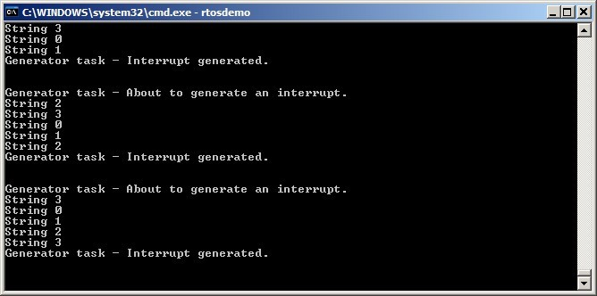

# 7 中断管理

## 7.1 引言

### 7.1.1 事件

嵌入式实时系统必须对来自环境的事件采取行动。例如，以太网外围设备上的数据包到达（事件）可能需要将其传递给TCP/IP堆栈进行处理（操作）。非平凡的系统必须处理来自多个来源的事件，所有这些事件都有不同的处理开销和响应时间要求。在每种情况下，都必须对最佳事件处理实现策略做出判断：

- 如何检测事件？通常使用中断，但也可以轮询输入。
- 使用中断时，中断服务例程（ISR）内部应执行多少处理，外部应执行多少？通常希望每个ISR尽可能短。
- 如何将事件传递给主（非ISR）代码，以及如何构建此代码以最好地适应潜在的异步事件？

FreeRTOS并不强加任何特定的事件处理策略给应用程序设计者，但提供了允许以简单和可维护的方式实现所选策略的功能。

任务的优先级与中断的优先级之间的区别很重要：

- 任务是与FreeRTOS运行的硬件无关的软件功能。任务的优先级由应用程序编写者在软件中分配，软件算法（调度程序）决定哪个任务将被放置在运行状态。
- 虽然是用软件编写的，但中断服务例程是硬件功能，因为硬件控制哪个中断服务例程将运行以及何时运行。任务只在没有ISR运行时才会运行，因此最低优先级的中断将中断最高优先级的任务，任务无法抢占ISR。

FreeRTOS将运行的所有架构都能够处理中断，但与中断进入和中断优先级分配相关的详细信息在架构之间有所不同。


### 7.1.2 作用域

本章涵盖以下内容：

- 可以在中断服务例程（ISR）中使用哪些FreeRTOS API函数。
- 如何将中断处理推迟到任务。
- 如何创建和使用二进制信号量和计数信号量。
- 二进制信号量和计数信号量的区别。
- 如何使用队列将数据传递到和从中断服务例程。
- 一些FreeRTOS端口提供的中断嵌套模型。

## 7.2 在ISR中使用FreeRTOS API

### 7.2.1 中断安全的API

通常需要在中断服务例程（ISR）中使用FreeRTOS API函数提供的功能，但许多FreeRTOS API函数执行的操作在ISR内部无效。其中最显著的是将调用API函数的任务置于阻塞状态——如果从ISR调用API函数，那么它不是从任务调用的，因此没有调用任务可以被置于阻塞状态。FreeRTOS通过提供某些API函数的两个版本来解决这个问题；一个版本用于从任务调用，另一个版本用于从ISR调用。用于从ISR调用的函数名称后面附加了"FromISR"。

> *注意：永远不要从ISR调用没有"FromISR"的FreeRTOS API函数。*


### 7.2.2 使用单独的中断安全API的好处

为中断提供单独的API可以使任务代码更高效，ISR代码更高效，并且中断入口更简单。为了理解这一点，考虑一下替代方案，即提供一个可以从任务和ISR调用的每个API函数的单一版本。如果同一个API函数可以从任务和ISR调用，那么：

- API函数需要额外的逻辑来确定它们是从任务还是从ISR调用的。额外的逻辑将引入函数的新路径，使函数变得更长、更复杂，更难以测试。

- 当函数从任务调用时，某些API函数参数将过时，而当函数从ISR调用时，其他参数将过时。

- 每个FreeRTOS端口都需要提供一种机制来确定执行上下文（任务或ISR）。

- 在无法轻松确定执行上下文（任务或ISR）的架构上，需要额外的、浪费的、更复杂的、使用更不方便的、非标准的中断入口代码，以便由软件提供执行上下文。


### 7.2.3 使用单独的中断安全API的缺点

拥有某些API函数的两个版本，可以使任务和中断服务程序（ISR）更高效，但也引入了一个新问题：有时需要从任务和ISR中调用一个不属于FreeRTOS API的函数，但该函数使用了FreeRTOS API。

这通常只在集成第三方代码时才会成为问题，因为只有在那时，软件的设计才会超出应用程序编写者的控制。如果这确实成为一个问题，那么可以使用以下技术之一来解决问题：

- 将中断处理推迟到任务中，以便API函数只能从任务的上下文中调用。

- 如果使用的是支持中断嵌套的FreeRTOS端口，则使用以“FromISR”结尾的API函数版本，因为该版本可以从任务和ISR中调用。（反之则不成立，不以“FromISR”结尾的API函数不能从ISR中调用。）

- 第三方代码通常包括一个RTOS抽象层，可以实现以测试函数被调用的上下文（任务或中断），然后调用适合该上下文的API函数。

[^12]: 推迟的中断处理将在本书的下一节中介绍。


### 7.2.4 xHigherPriorityTaskWoken 参数

本节介绍 `xHigherPriorityTaskWoken` 参数的概念。如果你还不完全理解这个部分，不要担心，后续章节将提供实际示例。

如果中断执行了上下文切换，那么中断退出时正在运行的任务可能与中断进入时正在运行的任务不同——中断会中断一个任务，但返回到不同的任务。

一些 FreeRTOS API 函数可以将任务从阻塞状态移动到就绪状态。这已经在 `xQueueSendToBack()` 等函数中看到，如果有任务在阻塞状态等待队列上的数据可用，则会解除任务的阻塞。

如果由 FreeRTOS API 函数解除阻塞的任务的优先级高于正在运行的任务的优先级，那么根据 FreeRTOS 调度策略，应该切换到优先级更高的任务。切换到优先级更高的任务的实际发生时间取决于调用 API 函数的上下文：

- 如果 API 函数是从任务调用的：

  如果在 FreeRTOSConfig.h 中将 `configUSE_PREEMPTION` 设置为 1，则在 API 函数内部自动发生切换到优先级更高的任务，换句话说，在 API 函数退出之前。这已经在图 6.6 中看到，写入定时器命令队列导致在写入命令队列的函数退出之前切换到 RTOS 守护任务。

- 如果API函数是从中断中调用的：

  在中断内部不会自动发生切换到更高优先级的任务。相反，会设置一个变量来通知应用程序编写者应执行上下文切换。中断安全的API函数（以“FromISR”结尾的函数）有一个指针参数，称为`pxHigherPriorityTaskWoken`，用于此目的。

  如果应执行上下文切换，则中断安全的API函数将`*pxHigherPriorityTaskWoken`设置为`pdTRUE`。为了能够检测到这一点，`pxHigherPriorityTaskWoken`指向的变量必须在首次使用之前初始化为`pdFALSE`。

  如果应用程序编写者选择不从ISR请求上下文切换，则更高优先级的任务将保持在就绪状态，直到调度程序下次运行，最坏的情况下将是在下一个时钟中断期间。

  FreeRTOS API函数只能将`*pxHighPriorityTaskWoken`设置为`pdTRUE`。如果ISR调用多个FreeRTOS API函数，则可以将相同的变量作为`pxHigherPriorityTaskWoken`参数传递给每个API函数调用，并且只需要在首次使用之前将变量初始化为`pdFALSE`。

有几个原因导致上下文切换不会在API函数的中断安全版本中自动发生：

- 避免不必要的上下文切换

  中断可能会在任务需要执行任何处理之前执行多次。例如，考虑一个任务处理由中断驱动的UART接收的字符串的场景；如果UART ISR在每次接收到一个字符时都切换到任务，那么在接收到完整字符串之前，任务将没有任何处理要执行，这将是浪费的。

- 控制执行顺序

  中断可以偶尔发生，并且在不可预测的时间发生。专家FreeRTOS用户可能希望在应用程序的特定点临时避免切换到不同的任务，尽管这也可以通过使用FreeRTOS调度程序锁定机制来实现。

- 可移植性

  这是可以在所有FreeRTOS端口上使用的最简单机制。

- 效率

  目标较小处理器架构的端口只允许在ISR的末尾请求上下文切换，取消该限制将需要更多和更复杂的代码。它还允许在同一个ISR中多次调用FreeRTOS API函数，而不会在同一个ISR中生成多个上下文切换请求。

- 在RTOS时钟中断中执行

  如本书后面将看到的，可以将应用程序代码添加到RTOS时钟中断中。在时钟中断内尝试上下文切换的结果取决于使用的FreeRTOS端口。最好的情况是，它将导致对调度程序的不必要调用。

使用`pxHigherPriorityTaskWoken`参数是可选的。如果不需要，则将`pxHigherPriorityTaskWoken`设置为NULL。


### 7.2.5 portYIELD_FROM_ISR() 和 portEND_SWITCHING_ISR() 宏

本节介绍了用于从中断服务程序（ISR）请求上下文切换的宏。如果你还不完全理解本节内容，不要担心，后续章节将提供实际示例。

`taskYIELD()` 是一个可以在任务中调用以请求上下文切换的宏。`portYIELD_FROM_ISR()` 和 `portEND_SWITCHING_ISR()` 都是 `taskYIELD()` 的中断安全版本。`portYIELD_FROM_ISR()` 和 `portEND_SWITCHING_ISR()` 的用法相同，功能也相同[^13]。某些 FreeRTOS 端口只提供这两个宏中的一个。较新的 FreeRTOS 端口提供这两个宏。本书中的示例使用 `portYIELD_FROM_ISR()`。

[^13]: 历史上，`portEND_SWITCHING_ISR()` 是 FreeRTOS 端口中需要中断处理程序使用汇编代码包装器的名称，而 `portYIELD_FROM_ISR()` 是 FreeRTOS 端口中允许整个中断处理程序用 C 语言编写的名称。

<a name="list7.1" title="Listing 7.1 The portEND_SWITCHING_ISR() macros"></a>

```c
portEND_SWITCHING_ISR( xHigherPriorityTaskWoken );
```
***Listing 7.1*** *The portEND_SWITCHING_ISR() macros*

<a name="list7.2" title="Listing 7.2 The portYIELD_FROM_ISR() macros"></a>

```c
portYIELD_FROM_ISR( xHigherPriorityTaskWoken );
```
***Listing 7.2*** *The portYIELD_FROM_ISR() macros*

从中断安全 API 函数中传出的 `xHigherPriorityTaskWoken` 参数可以直接作为参数传递给 `portYIELD_FROM_ISR()` 的调用。

如果 `portYIELD_FROM_ISR()` 的 `xHigherPriorityTaskWoken` 参数为 `pdFALSE`（零），则不会请求上下文切换，宏也不会产生任何效果。如果 `portYIELD_FROM_ISR()` 的 `xHigherPriorityTaskWoken` 参数不是 `pdFALSE`，则会请求上下文切换，可能会改变正在运行的任务。中断将始终返回到正在运行的任务，即使在中断执行期间任务发生了变化。

大多数 FreeRTOS 端口允许在 ISR 的任何位置调用 `portYIELD_FROM_ISR()`。少数 FreeRTOS 端口（主要是针对较小架构的端口），只允许在 ISR 的末尾调用 `portYIELD_FROM_ISR()`。


## 7.3 延迟中断处理

通常认为将中断服务程序（ISR）保持尽可能短是最佳实践。原因包括：

- 即使任务被分配了非常高的优先级，它们也只会在硬件没有服务中断时运行。

- ISR 可以干扰（添加“抖动”）任务的启动时间和执行时间。

- 根据 FreeRTOS 运行的架构，在 ISR 执行时可能无法接受任何新的中断，或者至少无法接受新中断的一部分。

- 应用程序编写者需要考虑并防止资源（如变量、外围设备和内存缓冲区）同时被任务和 ISR 访问的后果。

- 一些 FreeRTOS 端口允许中断嵌套，但中断嵌套会增加复杂性并降低可预测性。中断越短，嵌套的可能性就越小。

中断服务程序必须记录中断的原因并清除中断。中断引起的任何其他处理通常可以在任务中执行，从而使中断服务程序尽快退出。这称为“延迟中断处理”，因为中断引起的处理从 ISR 延迟到任务。

将中断处理推迟到任务中，还允许应用程序编写者相对于应用程序中的其他任务优先处理处理，并使用所有FreeRTOS API函数。

如果将中断处理推迟到的任务的优先级高于任何其他任务的优先级，那么处理将立即执行，就像处理在ISR本身中执行一样。这种情况如图7.1所示，其中任务1是普通应用程序任务，任务2是将中断处理推迟到的任务。

<a name="fig7.1" title="图7.1 在高优先级任务中完成中断处理"></a>

* * *

***图7.1*** *在高优先级任务中完成中断处理*
* * *

在图7.1中，中断处理从时间t2开始，有效地在时间t4结束，但只有时间t2和t3之间的时间段在ISR中度过。如果没有使用推迟的中断处理，那么时间t2和t4之间的整个时间段都将在ISR中度过。

没有绝对的规则可以确定何时在中断服务程序（ISR）中执行所有由中断引起的处理，何时将部分处理推迟到任务中。将处理推迟到任务中最有用的情况是：

- 中断引起的处理并不简单。例如，如果中断只是存储模拟到数字转换的结果，那么几乎可以肯定这是在ISR内部执行的最佳方式，但如果转换的结果还必须通过软件滤波器传递，那么在任务中执行滤波器可能是最好的选择。

- 中断处理方便地执行某些在ISR内部无法执行的操作，例如写入控制台或分配内存。

- 中断处理不是确定性的，即无法提前知道处理需要多长时间。

接下来的部分将描述和演示本章迄今为止介绍的概念，包括可以用来实现推迟中断处理的FreeRTOS功能。

## 7.4 用于同步的二进制信号量

二进制信号量API的中断安全版本可以用于在特定中断发生时解锁一个任务，从而有效地将任务与中断同步。这使得大部分中断事件处理可以在同步任务中实现，只剩下一个非常快且短的部分直接在ISR中。如前一节所述，二进制信号量用于将中断处理“推迟”到任务中[^14]。

[^14]: 使用直接到任务的通知从中断中解锁任务比使用二进制信号量更高效。直接到任务的通知将在第十章“任务通知”中介绍。

如图7.1所示，如果中断处理特别关键，则可以设置推迟处理任务的优先级，以确保该任务始终抢占系统中的其他任务。ISR可以实现以包含对`portYIELD_FROM_ISR()`的调用，确保ISR直接返回到中断处理被推迟的任务。这确保了整个事件处理在时间上连续执行（没有中断），就像它全部在ISR中实现一样。图7.2重复了图7.1中显示的场景，但文本已更新，以描述如何使用信号量控制推迟处理任务的执行。

<a name="fig7.2" title="图 7.2 使用二进制信号量实现延迟中断处理"></a>

* * *

***图 7.2*** *使用二进制信号量实现延迟中断处理*
* * *

延迟处理任务使用对信号量的阻塞 'take' 调用作为进入阻塞状态以等待事件发生的手段。当事件发生时，ISR 使用对同一信号量的 'give' 操作来解除任务的阻塞，以便所需的事件处理可以继续进行。

“获取信号量”和“释放信号量”是根据其使用场景具有不同含义的概念。在这个中断同步场景中，二进制信号量可以被概念化为一个长度为一的队列。队列最多可以包含一个项目，因此总是要么为空要么为满（因此是二进制的）。通过调用 `xSemaphoreTake()`，将中断处理延迟到的任务有效地尝试从队列中阻塞读取，如果队列为空，则导致任务进入阻塞状态。当事件发生时，ISR 使用 `xSemaphoreGiveFromISR()` 函数将令牌（信号量）放入队列中，使队列变满。这导致任务退出阻塞状态并移除令牌，使队列再次变空。当任务完成其处理时，它再次尝试从队列中读取，发现队列为空，重新进入阻塞状态以等待下一个事件。这个序列在图 7.3 中有所演示。

图 7.3 显示了中断“给出”信号量，即使它没有首先“取得”它，以及任务“取得”信号量，但从未归还它。这就是为什么这种情况被描述为在概念上类似于向队列写入和读取。它经常引起混淆，因为它不遵循其他信号量使用场景的相同规则，例如在 Chapter 8, Resource Management 中描述的场景，其中取得信号量的任务必须始终归还它。

<a name="fig7.3" title="图 7.3 使用二进制信号量同步任务与中断"></a>

* * *

***图 7.3*** *使用二进制信号量同步任务与中断*
* * *

### 7.4.1 The xSemaphoreCreateBinary() API Function

FreeRTOS 还包括 `xSemaphoreCreateBinaryStatic()` 函数，它在编译时静态分配创建二进制信号量所需的内存：所有各种类型的 FreeRTOS 信号量句柄都存储在 `SemaphoreHandle_t` 类型的变量中。

在使用信号量之前，必须创建它。要创建二进制信号量，请使用 `xSemaphoreCreateBinary()` API 函数[^15]。

[^15]: 有些信号量 API 函数实际上是宏，而不是函数。为了简单起见，本书中将它们全部称为函数。

<a name="list7.3" title="清单 7.3 The xSemaphoreCreateBinary() API 函数原型"></a>

```c
SemaphoreHandle_t xSemaphoreCreateBinary( void );
```
***清单 7.3*** *The xSemaphoreCreateBinary() API 函数原型*

**xSemaphoreCreateBinary() 返回值**

- 返回值

  如果返回 NULL，则无法创建信号量，因为没有足够的堆内存可供 FreeRTOS 分配信号量数据结构。

  如果返回非 NULL 值，则表示信号量已成功创建。返回的值应存储为创建的信号量的句柄。


### 7.4.2 xSemaphoreTake() API 函数

“获取”信号量意味着“获得”或“接收”信号量。只有在信号量可用时才能获取。

除了递归互斥锁之外，所有各种类型的FreeRTOS信号量都可以使用`xSemaphoreTake()`函数来“获取”。

`xSemaphoreTake()` 不能从中断服务例程中使用。

<a name="list7.4" title="Listing 7.4 The xSemaphoreTake() API function prototype"></a>

```c
BaseType_t xSemaphoreTake( SemaphoreHandle_t xSemaphore, TickType_t xTicksToWait );
```
***Listing 7.4*** *The xSemaphoreTake() API function prototype*

**xSemaphoreTake() 参数和返回值**

- `xSemaphore`

  正在“获取”的信号量。

  信号量由类型为 `SemaphoreHandle_t` 的变量引用。在使用之前必须显式创建。

- `xTicksToWait`

  任务在阻塞状态下等待信号量的最大时间，如果信号量尚不可用。

  如果 `xTicksToWait` 为零，则 `xSemaphoreTake()` 如果信号量不可用，将立即返回。

  阻塞时间以滴答周期指定，因此它所代表的绝对时间取决于滴答频率。可以使用宏 `pdMS_TO_TICKS()` 将以毫秒为单位指定的时间转换为以滴答为单位的时间。

  将 `xTicksToWait` 设置为 `portMAX_DELAY` 将导致任务无限期等待（没有超时），如果在 FreeRTOSConfig.h 中将 `INCLUDE_vTaskSuspend` 设置为 1。

- 返回值

  有两种可能的返回值：

  - `pdPASS`

    只有在调用 `xSemaphoreTake()` 成功获取信号量时，才会返回 `pdPASS`。

    如果指定了阻塞时间（`xTicksToWait` 不为零），则可能会将调用任务放入阻塞状态以等待信号量（如果信号量立即不可用），但信号量在阻塞时间到期之前变为可用。

  - `pdFALSE`

    信号量不可用。

    如果指定了阻塞时间（`xTicksToWait` 不为零），则调用任务将被放入阻塞状态以等待信号量变为可用，但阻塞时间在发生之前到期。


### 7.4.3 xSemaphoreGiveFromISR() API 函数

二进制信号量和计数信号量[^16]可以使用 `xSemaphoreGiveFromISR()` 函数来“给出”。

[^16]: 计数信号量在本书的后续章节中有描述。

`xSemaphoreGiveFromISR()` 是 `xSemaphoreGive()` 的中断安全版本，因此具有在本章开头描述的 `pxHigherPriorityTaskWoken` 参数。

<a name="list" title="清单 7.5 xSemaphoreGiveFromISR() API 函数原型"></a>

```c
BaseType_t xSemaphoreGiveFromISR( SemaphoreHandle_t xSemaphore,
                                  BaseType_t *pxHigherPriorityTaskWoken );
```
***清单 7.5*** *xSemaphoreGiveFromISR() API 函数原型*

**xSemaphoreGiveFromISR() 参数和返回值**

- `xSemaphore`

  正在“给出”的信号量。

  信号量由 `SemaphoreHandle_t` 类型的变量引用，并在使用之前必须显式创建。

- `pxHigherPriorityTaskWoken`

  可能会有一个或多个任务在信号量上阻塞，等待信号量可用。调用 `xSemaphoreGiveFromISR()` 可以使信号量可用，从而导致等待信号量的任务离开阻塞状态。如果调用 `xSemaphoreGiveFromISR()` 导致任务离开阻塞状态，并且解除阻塞的任务的优先级高于当前正在执行的任务（被中断的任务），那么在内部，`xSemaphoreGiveFromISR()` 将 `*pxHigherPriorityTaskWoken` 设置为 `pdTRUE`。

如果 `xSemaphoreGiveFromISR()` 将此值设置为 `pdTRUE`，那么通常在退出中断之前应该执行上下文切换。这将确保中断直接返回到优先级最高的就绪状态任务。

- 返回值

  有两种可能的返回值：

  - `pdPASS`

    只有在对 `xSemaphoreGiveFromISR()` 的调用成功时，才会返回 `pdPASS`。

  - `pdFAIL`

    如果信号量已经可用，则无法给出，`xSemaphoreGiveFromISR()` 将返回 `pdFAIL`。

<a name="example7.1" title="使用二进制信号量将任务与中断同步"></a>
---
***示例 7.1*** *使用二进制信号量将任务与中断同步*

---

这个示例使用二进制信号量从中断服务例程中解锁任务，从而有效地将任务与中断同步。

使用一个简单的周期性任务每 500 毫秒生成一个软件中断。为了方便，使用软件中断，因为在某些目标环境中挂钩到真实中断的复杂性。清单 7.6 显示了周期性任务的实现。请注意，任务在生成中断之前和之后都打印出一个字符串。这使得在执行示例时生成的输出中可以观察到执行序列。

<a name="list7.6" title="Listing 7.6 Implementation of the task that periodically generates a software interrupt in Example 7.1"></a>

```c
/* The number of the software interrupt used in this example. The code
   shown is from the Windows project, where numbers 0 to 2 are used by the
   FreeRTOS Windows port itself, so 3 is the first number available to the
   application. */
#define mainINTERRUPT_NUMBER 3

static void vPeriodicTask( void *pvParameters )
{
    const TickType_t xDelay500ms = pdMS_TO_TICKS( 500UL );

    /* As per most tasks, this task is implemented within an infinite loop. */
    for( ;; )
    {
        /* Block until it is time to generate the software interrupt again. */
        vTaskDelay( xDelay500ms );

        /* Generate the interrupt, printing a message both before and after
           the interrupt has been generated, so the sequence of execution is
           evident from the output.

           The syntax used to generate a software interrupt is dependent on
           the FreeRTOS port being used. The syntax used below can only be
           used with the FreeRTOS Windows port, in which such interrupts are
           only simulated. */
        vPrintString( "Periodic task - About to generate an interrupt.\r\n" );
        vPortGenerateSimulatedInterrupt( mainINTERRUPT_NUMBER );
        vPrintString( "Periodic task - Interrupt generated.\r\n\r\n\r\n" );
    }
}
```
***Listing 7.6*** *Implementation of the task that periodically generates a software interrupt in Example 7.1*

Listing 7.7 shows the implementation of the task to which the interrupt
processing is deferred—the task that is synchronized with the software
interrupt through the use of a binary semaphore. Again, a string is
printed out on each iteration of the task, so the sequence in which the
task and the interrupt execute is evident from the output produced when
the example is executed.

需要注意的是，虽然列表7.7中显示的代码对于示例7.1（其中中断由软件生成）是足够的，但对于硬件外围设备生成中断的场景并不适用。接下来的小节将描述如何改变代码结构，以使其适用于硬件生成的中断。

<a name="list7.7." title="Listing 7.7 The implementation of the task to which the interrupt processing is deferred (the task that..."></a>

```c
static void vHandlerTask( void *pvParameters )
{
    /* 与大多数任务一样，这个任务在一个无限循环中实现。 */
    for( ;; )
    {
        /* 使用信号量等待事件。信号量是在调度器启动之前创建的，因此在该任务第一次运行之前。任务会无限期阻塞，这意味着这个函数调用只会在成功获取信号量后返回，因此没有必要检查xSemaphoreTake()返回的值。 */
        xSemaphoreTake( xBinarySemaphore, portMAX_DELAY );

        /* 要到达这里，事件必须已经发生。处理事件（在这种情况下，只是打印一条消息）。 */
        vPrintString( "Handler task - Processing event.\r\n" );
    }
}
```
***Listing 7.7*** *将中断处理推迟到的任务的实现（与中断同步的任务）在示例7.1中*

列表7.8显示了中断服务程序（ISR）。它除了“给出”信号量以解除阻塞推迟中断处理的任务外，几乎什么都不做。

注意 `xHigherPriorityTaskWoken` 变量的使用方式。在调用 `xSemaphoreGiveFromISR()` 之前，它被设置为 `pdFALSE`，然后在调用 `portYIELD_FROM_ISR()` 时作为参数使用。如果 `xHigherPriorityTaskWoken` 等于 `pdTRUE`，则在 `portYIELD_FROM_ISR()` 宏内部将请求上下文切换。

ISR 的原型以及用于强制上下文切换的宏，对于 FreeRTOS Windows 端口都是正确的，对于其他 FreeRTOS 端口可能会有所不同。请参考 FreeRTOS.org 网站上的特定端口文档页面，以及 FreeRTOS 下载中提供的示例，以找到所使用端口所需的语法。

与 FreeRTOS 运行的大多数架构不同，FreeRTOS Windows 端口要求 ISR 返回一个值。Windows 端口提供的 `portYIELD_FROM_ISR()` 宏的实现包括返回语句，因此列表 7.8 中没有显式地返回值。

<a name="list7.8" title="列表 7.8 示例 7.1 中使用的软件中断的 ISR"></a>

```c
static uint32_t ulExampleInterruptHandler( void )
{
    BaseType_t xHigherPriorityTaskWoken;

    /* xHigherPriorityTaskWoken 参数必须初始化为 pdFALSE，因为如果需要上下文切换，它将在中断安全的 API 函数内部设置为 pdTRUE。 */
    xHigherPriorityTaskWoken = pdFALSE;

    /* 'Give' 信号量以解锁任务，将 xHigherPriorityTaskWoken 的地址作为中断安全 API 函数的 pxHigherPriorityTaskWoken 参数传入。 */
    xSemaphoreGiveFromISR( xBinarySemaphore, &xHigherPriorityTaskWoken );

    /* 将 xHigherPriorityTaskWoken 值传递给 portYIELD_FROM_ISR()。如果在 xSemaphoreGiveFromISR() 内部将 xHigherPriorityTaskWoken 设置为 pdTRUE，则调用 portYIELD_FROM_ISR() 将请求上下文切换。如果 xHigherPriorityTaskWoken 仍然为 pdFALSE，则调用 portYIELD_FROM_ISR() 将没有任何效果。与大多数 FreeRTOS 端口不同，Windows 端口要求 ISR 返回一个值 - 返回语句在 Windows 版本的 portYIELD_FROM_ISR() 内部。 */
    portYIELD_FROM_ISR( xHigherPriorityTaskWoken );
}
```
***列表 7.8*** *示例 7.1 中使用的软件中断的 ISR*

`main()` 函数创建二进制信号量，创建任务，安装中断处理程序，并启动调度程序。实现如列表 7.9 所示。

调用安装中断处理程序的函数的语法特定于FreeRTOS Windows端口，对于其他FreeRTOS端口可能不同。请参考FreeRTOS.org网站上的特定于端口的文档页面，以及FreeRTOS下载中提供的示例，以找到所使用端口所需的语法。

<a name="list7.9" title="Listing 7.9 The implementation of main() for Example 7.1"></a>

```c
int main( void )
{
    /* 在使用信号量之前，必须显式创建它。在这个例子中创建了一个二进制信号量。 */
    xBinarySemaphore = xSemaphoreCreateBinary();

    /* 检查信号量是否成功创建。 */
    if( xBinarySemaphore != NULL )
    {
        /* 创建 'handler' 任务，这是将中断处理推迟到的任务。这是将与中断同步的任务。处理程序任务创建时具有高优先级，以确保在中断退出后立即运行。在这种情况下，选择优先级为3。 */
        xTaskCreate( vHandlerTask, "Handler", 1000, NULL, 3, NULL );

        /* 创建将定期生成软件中断的任务。它的优先级低于处理程序任务，以确保每次处理程序任务退出阻塞状态时都会被抢占。 */
        xTaskCreate( vPeriodicTask, "Periodic", 1000, NULL, 1, NULL );

        /* 安装软件中断的处理程序。执行此操作所需的语法取决于所使用的FreeRTOS端口。这里显示的语法只能与FreeRTOS Windows端口一起使用，其中此类中断仅模拟。 */
        vPortSetInterruptHandler( mainINTERRUPT_NUMBER,
                                  ulExampleInterruptHandler );

        /* 启动调度程序，以便创建的任务开始执行。 */
        vTaskStartScheduler();
    }

    /* 与往常一样，下面这行代码不应该被到达。 */
    for( ;; );
}
```
***Listing 7.9*** *Example 7.1 的 main() 实现*

Example 7.1 生成图 7.4 中显示的输出。如预期的那样，`vHandlerTask()` 在生成中断后立即进入运行状态，因此任务的输出分割了周期性任务产生的输出。图 7.5 中提供了进一步的解释。

<a name="fig7.4" title="图 7.4 执行示例 7.1 时生成的输出"></a>
<a name="fig7.5" title="图 7.5 执行示例 7.1 时的执行序列"></a>

* * *

***图 7.4*** *执行示例 7.1 时生成的输出*


***图 7.5*** *执行示例 7.1 时的执行序列*
* * *

### 7.4.4 改进示例 7.1 中使用的任务的实现

示例 7.1 使用二进制信号量来同步任务与中断。执行序列如下：

1. 中断发生。

1. 中断服务程序（ISR）执行并“给出”信号量以解除任务的阻塞。

1. 任务在 ISR 之后立即执行并“取得”信号量。

1. 任务处理事件后，尝试再次“取得”信号量——进入阻塞状态，因为信号量尚未可用（另一个中断尚未发生）。

示例 7.1 中使用的任务结构仅在中断发生频率相对较低时才是适当的。为了理解原因，考虑一下如果在任务完成对第一个中断的处理之前发生了第二个和第三个中断会发生什么：

- 当第二个 ISR 执行时，信号量将为空，因此 ISR 将给出信号量，任务将在完成对第一个事件的处理后立即处理第二个事件。该场景如图 7.6 所示。

- 当第三个ISR执行时，信号量已经可用，防止ISR再次给出信号量，因此任务将不知道第三个事件已经发生。该场景如图7.7所示。

<a name="fig7.6" title="图7.6 当任务在处理第一个事件之前发生一个中断时的场景"></a>
<a name="fig7.7" title="图7.7 当任务在处理第一个事件之前发生两个中断时的场景"></a>

* * *

***图7.6*** *当任务在处理第一个事件之前发生一个中断时的场景*


***图7.7*** *当任务在处理第一个事件之前发生两个中断时的场景*
* * *

示例7.1中使用的延迟中断处理任务，如清单7.7所示，结构设计为在每次调用`xSemaphoreTake()`之间只处理一个事件。这对于示例7.1是足够的，因为生成事件的中断是由软件触发的，并且发生在可预测的时间。在实际应用中，中断是由硬件生成的，并且发生在不可预测的时间。因此，为了最小化中断被遗漏的机会，延迟中断处理任务必须结构设计为在每次调用`xSemaphoreTake()`之间处理所有已经可用的事件[^17]。这由清单7.10演示，展示了如何为UART结构化延迟中断处理程序。在清单7.10中，假设UART在每次接收到一个字符时生成一个接收中断，并且UART将接收到的字符放入硬件FIFO（硬件缓冲区）。

[^17]: 或者，可以使用计数信号量或直接任务通知来计数事件。计数信号量在下一节中有描述。直接任务通知在第十章“任务通知”中有描述。直接任务通知是首选方法，因为它们在运行时和RAM使用方面最高效。

示例7.1中使用的延迟中断处理任务还有另一个弱点；它在调用`xSemaphoreTake()`时没有使用超时。相反，任务将`portMAX_DELAY`作为`xSemaphoreTake()`的`xTicksToWait`参数传递，这导致任务无限期地等待信号量可用。无限期超时在示例代码中常常使用，因为它们简化了示例的结构，从而使示例更易于理解。然而，在实际应用中，无限期超时通常是不良做法，因为它们使得从错误中恢复变得困难。例如，考虑以下情景，任务正在等待中断给出信号量，但硬件中的错误状态阻止了中断的生成：

- 如果任务没有超时等待，它将不知道错误状态，并且将永远等待。

- 如果任务在等待超时，那么当超时到期时，`xSemaphoreTake()` 将返回 `pdFAIL`，任务可以在下次执行时检测并清除错误。这种情况也在清单 7.10 中有所演示。

<a name="list7.10" title="清单 7.10 延迟中断处理任务的推荐结构，使用 UART 接收..."></a>

```c
static void vUARTReceiveHandlerTask( void *pvParameters )
{
    /* xMaxExpectedBlockTime 保存两次中断之间预期的最大时间。 */
    const TickType_t xMaxExpectedBlockTime = pdMS_TO_TICKS( 500 );

    /* 与大多数任务一样，此任务在无限循环中实现。 */
    for( ;; )
    {
        /* 信号量由 UART 的接收（Rx）中断“给出”。等待最多 xMaxExpectedBlockTime 个时钟节拍的下一个中断。 */
        if( xSemaphoreTake( xBinarySemaphore, xMaxExpectedBlockTime ) == pdPASS)
        {
            /* 获得了信号量。在再次调用 xSemaphoreTake() 之前处理所有待处理的 Rx 事件。每个 Rx 事件都会在 UART 的接收 FIFO 中放置一个字符，并且假设 UART_RxCount() 返回 FIFO 中的字符数。 */
            while( UART_RxCount() > 0 )
            {
                /* 假设 UART_ProcessNextRxEvent() 处理一个 Rx 字符，将 FIFO 中的字符数减少 1。 */
                UART_ProcessNextRxEvent();
            }

            /* 没有更多的 Rx 事件待处理（FIFO 中没有更多字符），因此循环回并调用 xSemaphoreTake() 以等待下一个中断。在此代码点和调用 xSemaphoreTake() 之间发生的任何中断都将被信号量捕获，因此不会丢失。 */
        }
        else
        {
            /* 在预期时间内未收到事件。检查并清除任何可能阻止 UART 生成更多中断的 UART 错误条件。 */
            UART_ClearErrors();
        }
    }
}
```
***清单 7.10*** *使用 UART 接收处理程序作为示例的延迟中断处理任务的推荐结构*


## 7.5 计数信号量

与二进制信号量可以被视为长度为一的队列一样，计数信号量可以被视为长度大于一的队列。任务对队列中存储的数据不感兴趣，只关心队列中的项目数量。`configUSE_COUNTING_SEMAPHORES` 必须在 FreeRTOSConfig.h 中设置为 1，以便使用计数信号量。

每次给定一个计数信号量时，其队列中都会使用一个空间。队列中的项目数量是信号量的“计数”值。

计数信号量通常用于以下两种情况：

1. 计数事件[^18]

   在这种情况下，事件处理程序每次发生事件时都会“给”一个信号量，导致信号量的计数值在每次“给”操作时递增。任务每次处理事件时都会“取”一个信号量，导致信号量的计数值在每次“取”操作时递减。计数值是发生的事件数量与已处理的事件数量之差。这种机制如图 7.8 所示。

   用于计数事件的计数信号量创建时的初始计数值为零。

   [^18]: 使用直接到任务的通知计数事件比使用计数信号量更高效。直接到任务的通知将在第 10 章中介绍。

1. 资源管理。

   在这种情况下，计数值表示可用资源的数量。为了获得对资源的控制，任务必须首先获取一个信号量，这会减少信号量的计数值。当计数值达到零时，没有可用的资源。当任务完成资源使用时，它会“给”回信号量，这会增加信号量的计数值。

   用于管理资源的计数信号量创建时的初始计数值等于可用资源的数量。第 7 章介绍了使用信号量管理资源。

<a name="fig7.8" title="图 7.8 使用计数信号量 '计数' 事件"></a>

* * *

***图 7.8*** *使用计数信号量 '计数' 事件*
* * *

### 7.5.1 xSemaphoreCreateCounting() API 函数

FreeRTOS 还包括 `xSemaphoreCreateCountingStatic()` 函数，该函数在编译时静态分配创建计数信号量所需的内存：所有各种类型的 FreeRTOS 信号量句柄都存储在 `SemaphoreHandle_t` 类型的变量中。

在使用信号量之前，必须先创建它。要创建计数信号量，请使用 `xSemaphoreCreateCounting()` API 函数。

<a name="list7.11" title="Listing 7.11 The xSemaphoreCreateCounting() API function prototype"></a>

```c
SemaphoreHandle_t xSemaphoreCreateCounting( UBaseType_t uxMaxCount,
                                            UBaseType_t uxInitialCount );
```
***Listing 7.11*** *The xSemaphoreCreateCounting() API function prototype*

**xSemaphoreCreateCounting() 参数和返回值**

- `uxMaxCount`

   信号量将计数的最大值。继续队列类比，`uxMaxCount` 值实际上是队列的长度。

当信号量用于计数或触发事件时，`uxMaxCount` 是可以触发的事件的最大数量。

   当信号量用于管理资源集合的访问时，`uxMaxCount` 应设置为可用资源的总数。

- `uxInitialCount`

  信号量创建后的初始计数值。

  当信号量用于计数或触发事件时，`uxInitialCount` 应设置为零（因为在创建信号量时，我们假设尚未发生任何事件）。

  当信号量用于管理资源集合的访问时，`uxInitialCount` 应设置为等于 `uxMaxCount`（因为在创建信号量时，我们假设所有资源都可用）。

- 返回值

  如果返回 NULL，则无法创建信号量，因为 FreeRTOS 无法分配信号量数据结构所需的堆内存。第 3 章提供了有关堆内存管理的更多信息。

如果返回的值不是NULL，则表示信号量已成功创建。返回的值应存储为创建的信号量的句柄。

<a name="example7.2" title="Example 7.2 Using a counting semaphore to synchronize a task with an interrupt"></a>
---
***示例 7.2*** *使用计数信号量同步任务与中断*

---

示例 7.2通过使用计数信号量代替二进制信号量，改进了示例 7.1 的实现。`main()` 被修改为包括对 `xSemaphoreCreateCounting()` 的调用，而不是对 `xSemaphoreCreateBinary()` 的调用。新的API调用显示在清单 7.12 中。

<a name="list7.12" title="Listing 7.12 The call to xSemaphoreCreateCounting() used to create the counting semaphore in Example 7.2"></a>

```c
/* 在使用信号量之前，必须显式创建它。在这个示例中创建了一个计数信号量。信号量被创建为具有最大计数值为10，初始计数值为0。 */
xCountingSemaphore = xSemaphoreCreateCounting( 10, 0 );
```
***清单 7.12*** *用于在示例 7.2 中创建计数信号量的对 xSemaphoreCreateCounting() 的调用*


为了模拟高频发生的多个事件，中断服务例程被修改为每次中断时多次“给予”信号量。每个事件都被捕获在信号量的计数值中。修改后的中断服务例程显示在清单 7.13 中。

<a name="list7.13" title="Listing 7.13 示例 7.2 中使用的中断服务例程的实现"></a>

```c
static uint32_t ulExampleInterruptHandler( void )
{
    BaseType_t xHigherPriorityTaskWoken;

    /* xHigherPriorityTaskWoken 参数必须初始化为 pdFALSE，因为它将在中断安全的 API 函数内部设置为 pdTRUE，如果需要上下文切换。 */
    xHigherPriorityTaskWoken = pdFALSE;

    /* 'Give' 信号量多次。第一次将解除延迟中断处理任务的阻塞，接下来的 'give' 是为了演示信号量如何捕获事件，以便任务可以按顺序处理它们，而不会丢失事件。这模拟了处理器接收到多个中断，即使在这种情况下，事件是在单个中断发生时模拟的。 */
    xSemaphoreGiveFromISR( xCountingSemaphore, &xHigherPriorityTaskWoken );
    xSemaphoreGiveFromISR( xCountingSemaphore, &xHigherPriorityTaskWoken );
    xSemaphoreGiveFromISR( xCountingSemaphore, &xHigherPriorityTaskWoken );

    /* 将 xHigherPriorityTaskWoken 值传递给 portYIELD_FROM_ISR()。如果 xHigherPriorityTaskWoken 在 xSemaphoreGiveFromISR() 内部设置为 pdTRUE，则调用 portYIELD_FROM_ISR() 将请求上下文切换。如果 xHigherPriorityTaskWoken 仍然为 pdFALSE，则调用 portYIELD_FROM_ISR() 将没有效果。与大多数 FreeRTOS 端口不同，Windows 端口要求 ISR 返回一个值 - 返回语句在 Windows 版本的 portYIELD_FROM_ISR() 内部。 */
    portYIELD_FROM_ISR( xHigherPriorityTaskWoken );
}
```
***Listing 7.13*** *示例 7.2 中使用的中断服务例程的实现*

所有其他函数与示例 7.1 中使用的函数相同。

当执行示例 7.2 时生成的输出如图 7.9 所示。
可以看到，将中断处理推迟到的任务在每次生成中断时处理所有三个（模拟的）事件。事件被锁定到信号量的计数值中，使任务能够依次处理它们。

<a name="fig7.9" title="图 7.9 执行示例 7.2 时生成的输出"></a>

* * *

***图 7.9*** *执行示例 7.2 时生成的输出*
* * *


## 7.6 将工作推迟到RTOS守护任务

到目前为止，已经展示了推迟中断处理的示例，这些示例要求应用程序编写者为每个使用推迟处理技术的中断创建一个任务。也可以使用`xTimerPendFunctionCallFromISR()`[^19] API函数将中断处理推迟到RTOS守护任务，从而消除了为每个中断创建单独任务的需求。将中断处理推迟到守护任务称为“集中式推迟中断处理”。

[^19]: 守护任务最初被称为定时器服务任务，因为它最初只用于执行软件定时器回调函数。因此，`xTimerPendFunctionCall()`在timers.c中实现，并且根据将函数名称前缀为函数所在文件名称的惯例，函数名称前缀为“Timer”。

第六章描述了软件定时器相关的FreeRTOS API函数如何通过定时器命令队列向守护任务发送命令。`xTimerPendFunctionCall()`和`xTimerPendFunctionCallFromISR()` API函数使用相同的定时器命令队列向守护任务发送“执行函数”命令。然后，发送到守护任务的函数在守护任务的上下文中执行。

集中式推迟中断处理的优点包括：

- 资源使用较低

  它消除了为每个推迟中断创建单独任务的需求。

- 用户模型简化

  推迟中断处理函数是一个标准的C函数。

集中式推迟中断处理的缺点包括：

- 灵活性较低

  无法单独设置每个推迟中断处理任务的优先级。每个推迟中断处理函数都在守护任务的优先级下执行。如第六章所述，守护任务的优先级由FreeRTOSConfig.h中的`configTIMER_TASK_PRIORITY`编译时配置常量设置。

- 确定性较低

  `xTimerPendFunctionCallFromISR()`将命令发送到定时器命令队列的末尾。定时器命令队列中已经存在的命令将在`xTimerPendFunctionCallFromISR()`发送到队列的“执行函数”命令之前由守护任务处理。

不同的中断有不同的时间约束，因此在同一个应用程序中常常使用这两种推迟中断处理的方法。


### 7.6.1 xTimerPendFunctionCallFromISR() API 函数

`xTimerPendFunctionCallFromISR()` 是 `xTimerPendFunctionCall()` 的中断安全版本。这两个API函数都允许应用程序编写器提供的函数由RTOS守护进程任务执行，因此在其上下文中执行。要执行的函数及其输入参数的值都通过定时器命令队列发送到守护进程任务。因此，函数实际执行的时间取决于守护进程任务相对于应用程序中的其他任务的优先级。

<a name="list7.14" title="Listing 7.14 The xTimerPendFunctionCallFromISR() API function prototype"></a>

```c
BaseType_t xTimerPendFunctionCallFromISR( PendedFunction_t
                                          xFunctionToPend,
                                          void *pvParameter1,
                                          uint32_t ulParameter2,
                                          BaseType_t *pxHigherPriorityTaskWoken );
```
***Listing 7.14*** *xTimerPendFunctionCallFromISR() API 函数原型*

<a name="list7.15" title="Listing 7.15 The prototype to which a function passed in the xFunctionToPend parameter of xTimerPendFunctionCallFromISR()..."></a>

```c
void vPendableFunction( void *pvParameter1, uint32_t ulParameter2 );
```
***Listing 7.15*** *xTimerPendFunctionCallFromISR() 中 xFunctionToPend 参数传递的函数必须符合的原型*

**xTimerPendFunctionCallFromISR() 参数和返回值**

- `xFunctionToPend`

  指向将在守护进程任务中执行的函数的指针（实际上只是函数名）。函数的原型必须与列表7.15中所示的原型相同。

- `pvParameter1`

  将传递给守护进程任务执行的函数的 `pvParameter1` 参数的值。该参数的类型为 `void *`，以允许其用于传递任何数据类型。例如，整数类型可以直接强制转换为 `void *`，或者 `void *` 可以用于指向一个结构。

- `ulParameter2`

  将传递给守护进程任务执行的函数的 `ulParameter2` 参数的值。

- `pxHigherPriorityTaskWoken`

  `xTimerPendFunctionCallFromISR()` 向定时器命令队列写入数据。如果RTOS守护进程任务处于阻塞状态以等待定时器命令队列上的数据变得可用，那么向定时器命令队列写入数据将导致守护进程任务离开阻塞状态。如果守护进程任务的优先级高于当前正在执行的任务（被中断的任务）的优先级，那么在内部，`xTimerPendFunctionCallFromISR()` 将设置 `*pxHigherPriorityTaskWoken` 为 `pdTRUE`。

如果 `xTimerPendFunctionCallFromISR()` 将此值设置为 `pdTRUE`，则在退出中断之前必须执行上下文切换。这将确保中断直接返回到守护进程任务，因为守护进程任务将是优先级最高的就绪状态任务。

- 返回值

  有两种可能的返回值：

  - `pdPASS`

    如果 '执行函数' 命令已写入定时器命令队列，则返回 `pdPASS`。

  - `pdFAIL`

    如果由于定时器命令队列已满而无法将 '执行函数' 命令写入定时器命令队列，则返回 `pdFAIL`。第六章描述了如何设置定时器命令队列的长度。

<a name="example7.3" title="示例 7.3 集中化延迟中断处理"></a>
---
***示例 7.3*** *集中化延迟中断处理*

---

示例 7.3 提供了与示例 7.1 类似的功能，但不使用信号量，也不创建专门用于执行中断所需处理的任务。相反，处理由 RTOS 守护进程任务执行。

示例 7.3 使用的中断服务例程如清单 7.16 所示。它调用 `xTimerPendFunctionCallFromISR()` 将一个指向名为 `vDeferredHandlingFunction()` 的函数的指针传递给守护任务。延迟的中断处理由 `vDeferredHandlingFunction()` 函数执行。

中断服务例程每次执行时都会递增一个名为 `ulParameterValue` 的变量。`ulParameterValue` 用作 `xTimerPendFunctionCallFromISR()` 调用中的 `ulParameter2` 的值，因此当 `vDeferredHandlingFunction()` 由守护任务执行时，它也将用作 `vDeferredHandlingFunction()` 调用中的 `ulParameter2` 的值。该函数的另一个参数 `pvParameter1` 在本示例中未使用。

<a name="list7.16" title="清单 7.16 示例 7.3 中使用的软件中断处理程序"></a>

```c
static uint32_t ulExampleInterruptHandler( void )
{
    static uint32_t ulParameterValue = 0;
    BaseType_t xHigherPriorityTaskWoken;

    /* xHigherPriorityTaskWoken 参数必须初始化为 pdFALSE，因为如果需要上下文切换，它将在中断安全的 API 函数内部设置为 pdTRUE。 */
    xHigherPriorityTaskWoken = pdFALSE;

    /* 将中断的延迟处理函数的指针发送到守护任务。延迟处理函数的 pvParameter1 参数未使用，因此设置为 NULL。延迟处理函数的 ulParameter2 参数用于传递一个数字，该数字在每次执行此中断处理程序时递增。 */
    xTimerPendFunctionCallFromISR( vDeferredHandlingFunction, /* 要执行的函数 */
                                   NULL, /* 未使用 */
                                   ulParameterValue, /* 递增的值。 */
                                   &xHigherPriorityTaskWoken );
    ulParameterValue++;

    /* 将 xHigherPriorityTaskWoken 值传递给 portYIELD_FROM_ISR()。如果 xHigherPriorityTaskWoken 在 xTimerPendFunctionCallFromISR() 内部设置为 pdTRUE，则调用 portYIELD_FROM_ISR() 将请求上下文切换。如果 xHigherPriorityTaskWoken 仍为 pdFALSE，则调用 portYIELD_FROM_ISR() 将没有效果。与大多数 FreeRTOS 端口不同，Windows 端口要求中断返回一个值 - 返回语句在 Windows 版本的 portYIELD_FROM_ISR() 内部。 */
    portYIELD_FROM_ISR( xHigherPriorityTaskWoken );
}
```
***清单 7.16*** *示例 7.3 中使用的软件中断处理程序*

`vDeferredHandlingFunction()` 的实现如清单 7.17 所示。它打印出一个固定的字符串和其 `ulParameter2` 参数的值。

`vDeferredHandlingFunction()` 必须具有列表 7.15 中显示的原型，尽管在这个示例中，它的参数中只有一个参数实际上被使用。

<a name="list7.17" title="Listing 7.17 The function that performs the processing necessitated by the interrupt in Example 7.3"></a>

```c
static void vDeferredHandlingFunction( void *pvParameter1, uint32_t ulParameter2 )
{
    /* Process the event - in this case just print out a message and the value
       of ulParameter2. pvParameter1 is not used in this example. */
    vPrintStringAndNumber( "Handler function - Processing event ", ulParameter2 );
}
```
***Listing 7.17*** *The function that performs the processing necessitated by the interrupt in Example 7.3*


示例 7.3 使用的 `main()` 函数如列表 7.18 所示。它比示例 7.1 使用的 `main()` 函数更简单，因为它没有创建信号量或任务来执行延迟中断处理。

`vPeriodicTask()` 是定期生成软件中断的任务。它的优先级低于守护任务的优先级，以确保它在守护任务离开阻塞状态后立即被守护任务抢占。

<a name="list7.18" title="Listing 7.18 The implementation of main() for Example 7.3"></a>

```c
int main( void )
{
    /* The task that generates the software interrupt is created at a priority
       below the priority of the daemon task. The priority of the daemon task
       is set by the configTIMER_TASK_PRIORITY compile time configuration
       constant in FreeRTOSConfig.h. */
    const UBaseType_t ulPeriodicTaskPriority = configTIMER_TASK_PRIORITY - 1;

    /* Create the task that will periodically generate a software interrupt. */
    xTaskCreate( vPeriodicTask, "Periodic", 1000, NULL, ulPeriodicTaskPriority,
                 NULL );

    /* Install the handler for the software interrupt. The syntax necessary to
       do this is dependent on the FreeRTOS port being used. The syntax shown
       here can only be used with the FreeRTOS windows port, where such
       interrupts are only simulated. */
    vPortSetInterruptHandler( mainINTERRUPT_NUMBER, ulExampleInterruptHandler );

    /* Start the scheduler so the created task starts executing. */
    vTaskStartScheduler();

    /* As normal, the following line should never be reached. */
    for( ;; );
}
```
***Listing 7.18*** *The implementation of main() for Example 7.3*

Example 7.3 produces the output shown in Figure 7.10. The priority of the
daemon task is higher than the priority of the task that generates the
software interrupt, so `vDeferredHandlingFunction()` is executed by the
daemon task as soon as the interrupt is generated. That results in the
message output by `vDeferredHandlingFunction()` appear in between the
two messages output by the periodic task, just as it did when a
semaphore was used to unblock a dedicated deferred interrupt processing
task. Further explanation is provided in Figure 7.11.

<a name="fig7.10" title="图 7.10 执行示例 7.3 时生成的输出"></a>
<a name="fig7.11" title="图 7.11 执行示例 7.3 时的执行顺序"></a>

* * *

***图 7.10*** *执行示例 7.3 时生成的输出*


***图 7.11*** *执行示例 7.3 时的执行顺序*
* * *

## 7.7 在中断服务例程中使用队列

二进制信号量和计数信号量用于通信事件。队列用于通信事件和传输数据。

`xQueueSendToFrontFromISR()` 是 `xQueueSendToFront()` 的版本，可以安全地在中断服务例程中使用，`xQueueSendToBackFromISR()` 是 `xQueueSendToBack()` 的版本，可以安全地在中断服务例程中使用，`xQueueReceiveFromISR()` 是 `xQueueReceive()` 的版本，可以安全地在中断服务例程中使用。


### 7.7.1 xQueueSendToFrontFromISR() 和 xQueueSendToBackFromISR() API 函数

<a name="list7.19" title="Listing 7.19 The xQueueSendToFrontFromISR() API function prototype"></a>

```c
BaseType_t xQueueSendToFrontFromISR( QueueHandle_t xQueue,
                                     const void *pvItemToQueue
                                     BaseType_t *pxHigherPriorityTaskWoken );
```
***Listing 7.19*** *The xQueueSendToFrontFromISR() API function prototype*

<a name="list7.20" title="Listing 7.20 The xQueueSendToBackFromISR() API function prototype"></a>

```c
BaseType_t xQueueSendToBackFromISR( QueueHandle_t xQueue,
                                    const void *pvItemToQueue
                                    BaseType_t *pxHigherPriorityTaskWoken );
```
***Listing 7.20*** *The xQueueSendToBackFromISR() API function prototype*

`xQueueSendFromISR()` 和 `xQueueSendToBackFromISR()` 在功能上是等价的。

**xQueueSendToFrontFromISR() 和 xQueueSendToBackFromISR() 参数和返回值**

- `xQueue`

  将数据发送（写入）到的队列的句柄。队列句柄将在调用 `xQueueCreate()` 创建队列时返回。

- `pvItemToQueue`

  指向要放置在队列中的项的指针。

  当创建队列时，队列将保存的每个项的大小已定义，因此将从 `pvItemToQueue` 复制这么多字节到队列存储区。

- `pxHigherPriorityTaskWoken`

  可能会有一个或多个任务在队列上阻塞，等待数据可用。调用 `xQueueSendToFrontFromISR()` 或 `xQueueSendToBackFromISR()` 可以使数据可用，从而导致这样的任务离开阻塞状态。如果调用 API 函数导致任务离开阻塞状态，并且解除阻塞的任务的优先级高于当前正在执行的任务（被中断的任务），那么在内部，API 函数将 `*pxHigherPriorityTaskWoken` 设置为 `pdTRUE`。

  如果 `xQueueSendToFrontFromISR()` 或 `xQueueSendToBackFromISR()` 将此值设置为 `pdTRUE`，则在退出中断之前应执行上下文切换。这将确保中断直接返回到优先级最高的就绪状态任务。

- 返回值

  有两种可能的返回值：

  - `pdPASS`

    仅当数据成功发送到队列时返回 `pdPASS`。

  - `errQUEUE_FULL`

    如果由于队列已满而无法将数据发送到队列，则返回 `errQUEUE_FULL`。


### 7.7.2 从中断服务程序（ISR）使用队列时的注意事项

队列提供了一种简单且方便的方法，用于从中断传递数据到任务，但如果数据以高频率到达，使用队列并不高效。

FreeRTOS下载中的许多演示应用程序都包括一个简单的UART驱动程序，该驱动程序使用队列将字符从UART的接收ISR传递出去。在这些演示中，使用队列有两个原因：演示从ISR使用队列，以及故意加载系统以测试FreeRTOS端口。以这种方式使用队列的ISR绝对不是高效设计的代表，除非数据到达速度较慢，否则建议生产代码不要复制这种技术。更高效的技术，适用于生产代码，包括：

- 使用直接内存访问（DMA）硬件接收和缓冲字符。这种方法几乎没有软件开销。然后可以使用直接到任务的通知[^20]来解除阻塞处理缓冲区的任务，只有在检测到传输中断后才能进行。

[^20]: 直接任务通知提供了从中断服务程序（ISR）中解锁任务的最有效方法。直接任务通知在第十章“任务通知”中有详细介绍。

- 将每个接收到的字符复制到线程安全的RAM缓冲区[^21]。同样，可以使用直接任务通知来解锁在接收到完整消息后或检测到传输中断后将处理缓冲区的任务。

  [^21]: FreeRTOS+TCP 提供的 'Stream Buffer' ([https://www.FreeRTOS.org/tcp](http://www.FreeRTOS.org/tcp)) 可以用于此目的。

- 在ISR中直接处理接收到的字符，然后使用队列将数据处理的结果（而不是原始数据）发送到任务。这在图5.4中已经演示过。

<a name="example7.4" title="示例 7.4 在中断中通过队列发送和接收"></a>
---
***示例 7.4*** *在中断中通过队列发送和接收*

---

这个示例演示了在同一个中断中使用 `xQueueSendToBackFromISR()` 和 `xQueueReceiveFromISR()`。与之前一样，为了方便，中断是由软件生成的。

一个周期性任务被创建，每200毫秒向队列发送五个数字。只有在所有五个值都发送完毕后，才会生成一个软件中断。任务的实现如清单7.21所示。

<a name="list7.21" title="清单7.21 示例7.4中向队列写入的任务实现"></a>

```c
static void vIntegerGenerator( void *pvParameters )
{
    TickType_t xLastExecutionTime;
    uint32_t ulValueToSend = 0;
    int i;

    /* Initialize the variable used by the call to vTaskDelayUntil(). */
    xLastExecutionTime = xTaskGetTickCount();

    for( ;; )
    {
        /* This is a periodic task. Block until it is time to run again. The
           task will execute every 200ms. */
        vTaskDelayUntil( &xLastExecutionTime, pdMS_TO_TICKS( 200 ) );

        /* Send five numbers to the queue, each value one higher than the
           previous value. The numbers are read from the queue by the interrupt
           service routine. The interrupt service routine always empties the
           queue, so this task is guaranteed to be able to write all five
           values without needing to specify a block time. */
        for( i = 0; i < 5; i++ )
        {
            xQueueSendToBack( xIntegerQueue, &ulValueToSend, 0 );
            ulValueToSend++;
        }

        /* Generate the interrupt so the interrupt service routine can read the
           values from the queue. The syntax used to generate a software
           interrupt is dependent on the FreeRTOS port being used. The syntax
           used below can only be used with the FreeRTOS Windows port, in which
           such interrupts are only simulated. */
        vPrintString( "Generator task - About to generate an interrupt.\r\n" );
        vPortGenerateSimulatedInterrupt( mainINTERRUPT_NUMBER );
        vPrintString( "Generator task - Interrupt generated.\r\n\r\n\r\n" );
    }
}
```
***清单7.21*** *示例7.4中向队列写入的任务实现*

中断服务程序调用 `xQueueReceiveFromISR()`，直到周期性任务写入队列的所有值都被读取出来，队列被清空。每个接收到的值的最后两位用作数组字符串的索引。然后，指向相应索引位置的字符串的指针通过调用 `xQueueSendFromISR()` 发送到不同的队列。中断服务程序的实现如清单7.22所示。

<a name="list7.22" title="Listing 7.22 示例 7.4 使用的中断服务例程的实现"></a>

```c
static uint32_t ulExampleInterruptHandler( void )
{
    BaseType_t xHigherPriorityTaskWoken;
    uint32_t ulReceivedNumber;

    /* 字符串被声明为 static const，以确保它们不会在中断服务例程的堆栈上分配，
       并且即使中断服务例程没有执行时也存在。 */

    static const char *pcStrings[] =
    {
        "String 0\r\n",
        "String 1\r\n",
        "String 2\r\n",
        "String 3\r\n"
    };

    /* 如往常一样，xHigherPriorityTaskWoken 被初始化为 pdFALSE，以便能够检测到
       在中断安全的 API 函数内部将其设置为 pdTRUE。请注意，中断安全的 API 函数
       只能将 xHigherPriorityTaskWoken 设置为 pdTRUE，因此可以安全地在对
       xQueueReceiveFromISR() 的调用和对 xQueueSendToBackFromISR() 的调用中
       使用相同的 xHigherPriorityTaskWoken 变量。 */
    xHigherPriorityTaskWoken = pdFALSE;

    /* 从队列读取，直到队列为空。 */
    while( xQueueReceiveFromISR( xIntegerQueue,
                                 &ulReceivedNumber,
                                 &xHigherPriorityTaskWoken ) != errQUEUE_EMPTY )
    {
        /* 将接收到的值截断为最后两位（值 0 到 3 之间），然后使用截断后的值作为
           pcStrings[] 数组的索引，选择一个字符串（char *）发送到另一个队列。 */
        ulReceivedNumber &= 0x03;
        xQueueSendToBackFromISR( xStringQueue,
                                 &pcStrings[ ulReceivedNumber ],
                                 &xHigherPriorityTaskWoken );
    }

    /* 如果从 xIntegerQueue 接收导致一个任务离开阻塞状态，并且如果离开阻塞状态的任务的优先级高于正在运行的任务的优先级，那么
       xHigherPriorityTaskWoken 将在 xQueueReceiveFromISR() 内部被设置为 pdTRUE。

       如果向 xStringQueue 发送导致一个任务离开阻塞状态，并且如果离开阻塞状态的任务的优先级高于正在运行的任务的优先级，那么
       xHigherPriorityTaskWoken 将在 xQueueSendToBackFromISR() 内部被设置为 pdTRUE。

       xHigherPriorityTaskWoken 被用作 portYIELD_FROM_ISR() 的参数。如果 xHigherPriorityTaskWoken 等于 pdTRUE，那么调用 portYIELD_FROM_ISR()
       将请求上下文切换。如果 xHigherPriorityTaskWoken 仍然是 pdFALSE，那么调用 portYIELD_FROM_ISR() 将没有任何效果。

       Windows 端口使用的 portYIELD_FROM_ISR() 的实现包括一个返回语句，这就是为什么这个函数没有显式返回值的原因。 */
    portYIELD_FROM_ISR( xHigherPriorityTaskWoken );
}
```
***Listing 7.22*** *示例 7.4 使用的中断服务例程的实现*

从中断服务例程接收字符指针的任务会在队列中阻塞，直到消息到达，然后打印每个字符串。其实现如清单 7.23 所示。

<a name="list7.23" title="清单 7.23 从中断服务例程接收字符串并打印的任务，如示例 7.4 所示"></a>

```c
static void vStringPrinter( void *pvParameters )
{
    char *pcString;

    for( ;; )
    {
        /* 阻塞在队列上等待数据到达。 */
        xQueueReceive( xStringQueue, &pcString, portMAX_DELAY );

        /* 打印接收到的字符串。 */
        vPrintString( pcString );
    }
}
```
***清单 7.23*** *从中断服务例程接收字符串并打印的任务，如示例 7.4 所示*

与往常一样，`main()` 在启动调度程序之前创建所需的队列和任务。其实现如清单 7.24 所示。

<a name="list7.24" title="Listing 7.24 The main() function for Example 7.4"></a>

```c
int main( void )
{
    /* 在使用队列之前，必须先创建它。创建此示例中使用的两个队列。
       一个队列可以容纳类型为uint32_t的变量，另一个队列可以容纳类型为char*的变量。
       两个队列最多可以容纳10个项目。实际应用程序应该检查返回值，以确保队列已成功创建。 */
    xIntegerQueue = xQueueCreate( 10, sizeof( uint32_t ) );
    xStringQueue = xQueueCreate( 10, sizeof( char * ) );

    /* 创建使用队列将整数传递给中断服务例程的任务。该任务的优先级为1。 */
    xTaskCreate( vIntegerGenerator, "IntGen", 1000, NULL, 1, NULL );

    /* 创建打印从中断服务例程发送的字符串的任务。该任务的优先级较高，为2。 */
    xTaskCreate( vStringPrinter, "String", 1000, NULL, 2, NULL );

    /* 安装软件中断的处理程序。所需的语法取决于使用的FreeRTOS端口。这里显示的语法只能与FreeRTOS Windows端口一起使用，其中此类中断仅模拟。 */
    vPortSetInterruptHandler( mainINTERRUPT_NUMBER, ulExampleInterruptHandler );

    /* 启动调度程序，以便创建的任务开始执行。 */
    vTaskStartScheduler();

    /* 如果一切正常，main()将永远不会到达这里，因为调度程序现在正在运行任务。如果main()到达这里，那么很可能是因为没有足够的堆内存来创建空闲任务。第2章提供了更多关于堆内存管理的信息。 */
    for( ;; );
}
```
***Listing 7.24*** *Example 7.4的main()函数*

在执行示例7.4时生成的输出如图7.12所示。可以看到，中断接收了所有五个整数，并产生了五个字符串作为响应。图7.13中给出了更多解释。

<a name="fig7.12" title="图 7.12 执行示例 7.4 时生成的输出"></a>
<a name="fig7.13" title="图 7.13 示例 7.4 生成的执行序列"></a>

* * *

***图 7.12*** *执行示例 7.4 时生成的输出*


***图 7.13*** *示例 7.4 生成的执行序列*
* * *

## 7.8 中断嵌套

任务优先级和中断优先级之间常常会引起混淆。本节讨论的是中断优先级，即中断服务例程（ISR）相对于彼此执行的优先级。分配给任务的优先级与分配给中断的优先级毫无关系。硬件决定了ISR何时执行，而软件决定了任务何时执行。响应硬件中断执行的ISR将中断任务，但任务不能抢占ISR。

支持中断嵌套的端口需要在FreeRTOSConfig.h中定义以下一个或两个常量之一：`configMAX_SYSCALL_INTERRUPT_PRIORITY` 和 `configMAX_API_CALL_INTERRUPT_PRIORITY`。这两个常量定义了相同的属性。较旧的FreeRTOS端口使用 `configMAX_SYSCALL_INTERRUPT_PRIORITY`，而较新的FreeRTOS端口使用 `configMAX_API_CALL_INTERRUPT_PRIORITY`。

**控制中断嵌套的常量**

- `configMAX_SYSCALL_INTERRUPT_PRIORITY` 或 `configMAX_API_CALL_INTERRUPT_PRIORITY`

  设置可以调用中断安全的FreeRTOS API函数的最高中断优先级。

- `configKERNEL_INTERRUPT_PRIORITY`

  设置时钟中断使用的中断优先级，必须始终设置为最低可能的中断优先级。

  如果使用的FreeRTOS端口没有使用`configMAX_SYSCALL_INTERRUPT_PRIORITY`常量，那么任何使用中断安全的FreeRTOS API函数的中断也必须在`configKERNEL_INTERRUPT_PRIORITY`定义的优先级下执行。

每个中断源都有一个数值优先级和一个逻辑优先级：

- 数值优先级

  数值优先级只是分配给中断优先级的数字。例如，如果一个中断被分配了7的优先级，那么它的数值优先级就是7。同样，如果一个中断被分配了200的优先级，那么它的数值优先级就是200。

- 逻辑优先级

  中断的逻辑优先级描述了该中断相对于其他中断的优先级。

  如果两个优先级不同的中断同时发生，处理器将首先执行具有较高逻辑优先级的中断的中断服务程序（ISR），然后再执行具有较低逻辑优先级的中断的中断服务程序（ISR）。

  一个中断可以中断（嵌套）任何具有较低逻辑优先级的中断，但一个中断不能中断（嵌套）任何具有相等或更高逻辑优先级的中断。

中断的数值优先级与逻辑优先级之间的关系取决于处理器架构；在某些处理器上，分配给中断的数值优先级越高，该中断的逻辑优先级就越高，而在其他处理器架构上，分配给中断的数值优先级越高，该中断的逻辑优先级就越低。

通过将 `configMAX_SYSCALL_INTERRUPT_PRIORITY` 设置为高于 `configKERNEL_INTERRUPT_PRIORITY` 的逻辑中断优先级，创建了一个完整的中断嵌套模型。这在图 7.14 中有所展示，该图展示了以下情景：

- 处理器有七个唯一的中断优先级。
- 将数字优先级设置为 7 的中断具有高于将数字优先级设置为 1 的中断的逻辑优先级。
- `configKERNEL_INTERRUPT_PRIORITY` 设置为 1。
- `configMAX_SYSCALL_INTERRUPT_PRIORITY` 设置为 3。

<a name="fig7.14" title="图 7.14 影响中断嵌套行为的常量"></a>

* * *

***图 7.14*** *影响中断嵌套行为的常量*
* * *

参考图 7.14：

- 使用优先级 1 到 3（包括）的中断在内核或应用程序在关键部分内时被阻止执行。在这些优先级下运行的 ISR 可以使用中断安全的 FreeRTOS API 函数。关键部分在第 8 章中有描述。

- 使用优先级4或更高的中断不会受到关键部分的影响，因此调度程序的任何操作都不会阻止这些中断立即执行——在硬件本身的限制范围内。在这些优先级下执行的ISR不能使用任何FreeRTOS API函数。

- 通常，需要非常严格的时间精度的功能（例如电机控制）会使用高于`configMAX_SYSCALL_INTERRUPT_PRIORITY`的优先级，以确保调度程序不会在中断响应时间中引入抖动。

### 7.8.1 ARM Cortex-M[^22] 和 ARM GIC 用户注意事项

[^22]: 此部分仅部分适用于Cortex-M0和Cortex-M0+核心。

Cortex-M处理器的中断配置令人困惑，容易出错。为了帮助开发，FreeRTOS Cortex-M端口会自动检查中断配置，但仅在定义了`configASSERT()`时。`configASSERT()`在11.2节中有描述。

ARM Cortex核心和ARM通用中断控制器（GIC）使用数值*低*的优先级数字来表示逻辑*高*优先级的中断。这可能显得反直觉，容易忘记。如果希望为中断分配逻辑低优先级，则必须分配一个数值高的值。如果希望为中断分配逻辑高优先级，则必须分配一个数值低的值。

Cortex-M中断控制器允许使用最多八位来指定每个中断的优先级，使得255成为可能的最低优先级。零是最高优先级。然而，Cortex-M微控制器通常只实现八个可能位中的一部分。实际实现的位数取决于微控制器家族。

当只实现了八个可能位中的一部分时，只能使用字节的最有效位——留下最不重要的位未实现。未实现的位可以取任何值，但通常将它们设置为1。这由图7.15所示，图中展示了一个实现四个优先级位的Cortex-M微控制器如何存储二进制优先级101。

<a name="fig7.15" title="图7.15 实现四个优先级位的Cortex-M微控制器如何存储二进制优先级101"></a>

* * *

***图7.15*** *实现四个优先级位的Cortex-M微控制器如何存储二进制优先级101*
* * *

在图7.15中，二进制值101被移入最有效的四位，因为最不重要的四位未实现。未实现的位被设置为1。

一些库函数期望在将优先级值向上移位到实现的（最有意义的）位后指定优先级值。使用此类函数时，可以将图7.15中显示的优先级指定为十进制95。十进制95是二进制101向上移位四位变成二进制101nnnn（其中'n'是未实现的位），并将未实现的位设置为1，变成二进制1011111。

一些库函数期望在将优先级值向上移位到实现的（最有意义的）位之前指定优先级值。使用此类函数时，必须将图7.15中显示的优先级指定为十进制5。十进制5是二进制101，没有任何移位。

`configMAX_SYSCALL_INTERRUPT_PRIORITY` 和 `configKERNEL_INTERRUPT_PRIORITY` 必须以允许它们直接写入Cortex-M寄存器的方式指定，因此在优先级值向上移位到实现的位后。

`configKERNEL_INTERRUPT_PRIORITY` 必须始终设置为最低可能的中断优先级。未实现的优先级位可以设置为1，因此常量可以始终设置为255，无论实际实现了多少优先级位。

Cortex-M中断默认优先级为零，即最高优先级。Cortex-M硬件的实现不允许将`configMAX_SYSCALL_INTERRUPT_PRIORITY`设置为0，因此使用FreeRTOS API的中断优先级绝不能保持其默认值。


