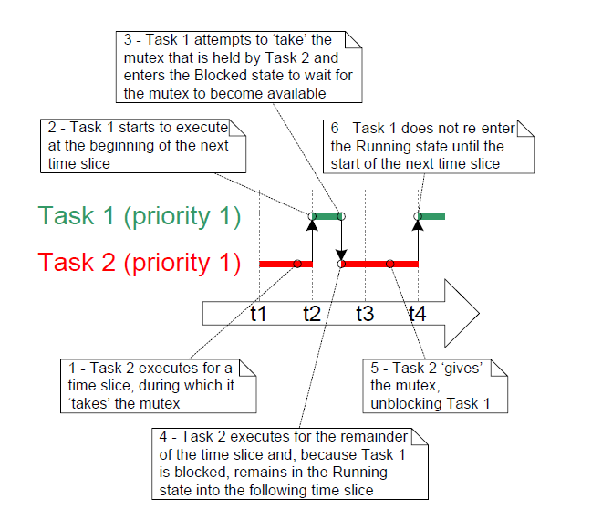

# 8 资源管理

## 8.1 章节介绍与范围

在多任务系统中，如果一个任务开始访问资源，但在进入非运行状态之前未能完成访问，则有可能出现错误。如果该任务使资源处于不一致的状态，那么任何其他任务或中断对该资源的访问都可能导致数据损坏或其他类似问题。

以下是一些示例：

* 访问外设

  考虑以下场景，其中两个任务尝试向液晶显示器（Liquid Crystal Display，LCD）写入内容。

  1. 任务A执行并开始向LCD写入字符串“Hello world”。

  2. 在仅输出字符串开头部分——“Hello w”后，任务A被任务B抢占。

  3. 任务B向LCD写入“Abort, Retry, Fail?”，然后进入阻塞状态。

  4. 任务A从被抢占的点继续执行，并完成其字符串剩余部分的输出——“orld”。

  此时，LCD上显示的字符串被破坏为“Hello wAbort, Retry, Fail?orld”。

* 读取、修改、写入操作

  清单8.1展示了一行C代码以及这行C代码通常会被编译成的汇编代码示例。可以看出，PORTA的值首先从内存读取到寄存器中，在寄存器内进行修改，然后写回内存。这被称为读取、修改、写入操作。


   <a name="list8.1" title="清单8.1 读取、修改、写入序列示例"></a>

   ```c
   /* 被编译的C代码 */
   PORTA |= 0x01;

   /* 编译C代码时生成的汇编代码 */
   LOAD  R1,[#PORTA] ; 从PORTA读取值到R1
   MOVE  R2,#0x01    ; 将绝对常量1移入R2
   OR    R1,R2       ; 对R1（PORTA）和R2（常量1）进行按位或操作
   STORE R1,[#PORTA] ; 将新值存储回PORTA
   ```
   ***清单8.1*** *读取、修改、写入序列示例*
 
   这是一个“非原子”操作，因为它需要多条指令才能完成，并且可能会被中断。考虑以下场景，其中两个任务尝试更新一个名为PORTA的内存映射寄存器。

   1. 任务A将PORTA的值加载到寄存器中——这是操作的读取部分。

   2. 在完成同一操作的修改和写入部分之前，任务A被任务B抢占。

   3. 任务B更新PORTA的值，然后进入阻塞状态。

   4. 任务A从被抢占的点继续执行。它修改已经保存在寄存器中的PORTA值副本，然后将更新后的值写回PORTA。

   在此场景中，任务A更新并写回了一个过时的PORTA值。任务B在任务A复制PORTA值之后、任务A将其修改后的值写回PORTA寄存器之前修改了PORTA。当任务A写入PORTA时，它覆盖了任务B已经执行的修改，实际上破坏了PORTA寄存器的值。

此示例使用了一个外设寄存器，但在对变量执行读取、修改、写入操作时同样适用相同的原则。

- 对变量的非原子访问

  更新结构体中的多个成员或更新一个大于架构自然字长的变量（例如，在16位机器上更新32位变量），都是非原子操作的示例。如果它们被中断，则可能导致数据丢失或损坏。

- 函数的可重入性

  如果一个函数可以安全地从多个任务调用，或者从任务和中断中调用，那么该函数是“可重入”的。可重入函数被称为“线程安全”，因为它们可以从多个执行线程访问而不会导致数据或逻辑操作被破坏。

  每个任务都维护自己的堆栈和自己的一组处理器（硬件）寄存器值。如果一个函数不访问任何除存储在堆栈上的数据或保存在寄存器中的数据之外的数据，那么该函数是可重入的，并且是线程安全的。清单8.2是一个可重入函数的示例。清单8.3是一个不可重入函数的示例。
  
  如果应用程序使用newlib C库，则必须在FreeRTOSConfig.h中将`configUSE_NEWLIB_REENTRANT`设置为1，以确保newlib所需的线程本地存储（Thread Local Storage，TLS）能够正确分配。

  如果应用程序使用picolibc C库，则必须在FreeRTOSConfig.h中将`configUSE_PICOLIBC_TLS`设置为1，以确保picolibc所需的线程本地存储能够正确分配。

  如果应用程序使用其他需要线程本地存储（TLS）的C库，则必须在FreeRTOSConfig.h中将`configUSE_C_RUNTIME_TLS_SUPPORT`设置为1，并实现以下宏：
  - `configTLS_BLOCK_TYPE` - 每个任务TLS块的类型。
  - `configINIT_TLS_BLOCK` - 初始化每个任务的TLS块。
  - `configSET_TLS_BLOCK` - 更新当前TLS块。在上下文切换期间调用，以确保使用正确的TLS块。
  - `configDEINIT_TLS_BLOCK` - 释放TLS块。


  <a name="list8.2" title="清单8.2 可重入函数的示例"></a>

  ```c
  /* 将参数传递给函数。参数将通过堆栈或处理器寄存器传递。无论哪种方式都是安全的，
     因为每个调用该函数的任务或中断都维护其自己的堆栈及其自己的一组寄存器值，
     因此每个调用该函数的任务或中断都会拥有lVar1的独立副本。 */
  long lAddOneHundred( long lVar1 )
  {
      /* 这个函数作用域变量也会根据编译器和优化级别分配到堆栈或寄存器中。
         每个调用此函数的任务或中断都会拥有lVar2的独立副本。 */
      long lVar2;

      lVar2 = lVar1 + 100;
      return lVar2;
  }
  ```
  ***清单8.2*** *可重入函数的示例*


  <a name="list8.3" title="清单8.3 不可重入函数的示例"></a>

  ```c
  /* 在这种情况下，lVar1是一个全局变量，因此每个调用lNonsenseFunction的任务
     都会访问该变量的唯一单个副本。 */
  long lVar1;

  long lNonsenseFunction( void )
  {
      /* lState是静态的，因此不会分配在堆栈上。每个调用此函数的任务
         都会访问该变量的唯一单个副本。 */
      static long lState = 0;
      long lReturn;

      switch( lState )
      {
          case 0 : lReturn = lVar1 + 10;
                   lState = 1;
                   break;

          case 1 : lReturn = lVar1 + 20;
                   lState = 0;
                   break;
      }
  }
  ```
  ***清单8.3*** *不可重入函数的示例*


### 8.1.1 互斥

为了确保数据一致性始终得到维护，必须通过“互斥”技术管理对在任务之间共享的资源或任务与中断之间共享的资源的访问。目标是确保一旦某个任务开始访问一个不可重入且非线程安全的共享资源，该任务对该资源拥有独占访问权限，直到资源恢复到一致状态为止。

FreeRTOS 提供了多种可用于实现互斥的功能，但最佳的互斥方法是（只要可能，尽管通常并不实际）设计应用程序，使得资源不被共享，并且每个资源仅由单个任务访问。


### 8.1.2 范围

本章涵盖以下内容：

- 何时以及为何需要进行资源管理和控制。
- 什么是临界区。
- 互斥的含义。
- 暂停调度器的意义。
- 如何使用互斥锁。
- 如何创建和使用看门人任务。
- 什么是优先级反转，以及优先级继承如何减少（但不能消除）其影响。


## 8.2 临界区与暂停调度器

### 8.2.1 基本临界区

基本临界区是指被宏 `taskENTER_CRITICAL()` 和 `taskEXIT_CRITICAL()` 包裹的代码区域。临界区也被称为临界区域。

`taskENTER_CRITICAL()` 和 `taskEXIT_CRITICAL()` 不接受任何参数，也不返回值[^23]。它们的用法如清单8.4所示。

[^23]: 类函数宏实际上并不像真实函数那样“返回值”。本书在最简单地将宏视为函数时，会使用“返回值”这一术语。


<a name="list8.4" title="清单8.4 使用临界区保护寄存器访问"></a>

```c
/* 确保对PORTA寄存器的访问不会被中断，将其置于临界区中。进入临界区。 */
taskENTER_CRITICAL();

/* 在调用taskENTER_CRITICAL()和taskEXIT_CRITICAL()之间无法切换到其他任务。
   对于允许中断嵌套的FreeRTOS端口，中断仍可能执行，但仅限于逻辑优先级高于
   configMAX_SYSCALL_INTERRUPT_PRIORITY常量所赋值的中断——并且这些中断不允许调用FreeRTOS API函数。 */
PORTA |= 0x01;

/* 对PORTA的访问已完成，因此可以安全退出临界区。 */
taskEXIT_CRITICAL();
```
***清单8.4*** *使用临界区保护寄存器访问*


本书附带的示例项目使用了一个名为 `vPrintString()` 的函数将字符串写入标准输出，在使用 FreeRTOS Windows 端口时，标准输出即为终端窗口。`vPrintString()` 从多个不同的任务中调用；因此，理论上它的实现可以使用临界区来保护对标准输出的访问，如清单8.5所示。

<a name="list8.5" title="清单8.5 vPrintString() 的一种可能实现"></a>

```c
void vPrintString( const char *pcString )
{
    /* 使用临界区作为提供互斥的粗略方法，将字符串写入标准输出。 */
    taskENTER_CRITICAL();
    {
        printf( "%s", pcString );
        fflush( stdout );
    }
    taskEXIT_CRITICAL();
}
```
***清单8.5*** *vPrintString() 的一种可能实现*


以这种方式实现的临界区是一种非常粗略的互斥方法。它们通过完全禁用中断或根据 `configMAX_SYSCALL_INTERRUPT_PRIORITY` 设置的中断优先级来禁用中断（具体取决于所使用的 FreeRTOS 端口）。抢占式上下文切换只能在中断中发生，因此只要中断保持禁用状态，调用 `taskENTER_CRITICAL()` 的任务就能保证在退出临界区之前始终保持运行状态。

基本临界区必须非常短，否则会影响中断响应时间。每次调用 `taskENTER_CRITICAL()` 都必须与一次 `taskEXIT_CRITICAL()` 紧密配对。因此，标准输出（stdout 或计算机写入其输出数据的流）不应使用临界区进行保护（如清单8.5所示），因为向终端写入可能是一个相对较长的操作。本章中的示例将探讨其他替代方案。

临界区可以嵌套是安全的，因为内核会记录嵌套深度。只有当嵌套深度返回到零时，即每调用一次 `taskENTER_CRITICAL()` 就对应调用一次 `taskEXIT_CRITICAL()` 时，才会退出临界区。

调用 `taskENTER_CRITICAL()` 和 `taskEXIT_CRITICAL()` 是任务更改运行 FreeRTOS 处理器的中断使能状态的唯一合法方式。通过任何其他方式更改中断使能状态会使宏的嵌套计数无效。

`taskENTER_CRITICAL()` 和 `taskEXIT_CRITICAL()` 不以 'FromISR' 结尾，因此不得从中断服务例程调用。`taskENTER_CRITICAL_FROM_ISR()` 是 `taskENTER_CRITICAL()` 的中断安全版本，而 `taskEXIT_CRITICAL_FROM_ISR()` 是 `taskEXIT_CRITICAL()` 的中断安全版本。这些中断安全版本仅适用于允许中断嵌套的 FreeRTOS 端口——在不允许中断嵌套的端口中它们将是多余的。

`taskENTER_CRITICAL_FROM_ISR()` 返回一个值，该值必须传递给匹配的 `taskEXIT_CRITICAL_FROM_ISR()` 调用。这在清单8.6中进行了演示。


<a name="list8.6" title="清单8.6 在中断服务例程中使用临界区"></a>

```c
void vAnInterruptServiceRoutine( void )
{
    /* 声明一个变量，用于保存从 taskENTER_CRITICAL_FROM_ISR() 返回的值。 */
    UBaseType_t uxSavedInterruptStatus;

    /* 中断服务例程的这一部分可以被任何更高优先级的中断打断。 */

    /* 使用 taskENTER_CRITICAL_FROM_ISR() 保护中断服务例程的一部分。
       保存从 taskENTER_CRITICAL_FROM_ISR() 返回的值，以便它可以传递给匹配的 
       taskEXIT_CRITICAL_FROM_ISR() 调用。 */
    uxSavedInterruptStatus = taskENTER_CRITICAL_FROM_ISR();

    /* 中断服务例程的这一部分位于调用 taskENTER_CRITICAL_FROM_ISR() 和 
       taskEXIT_CRITICAL_FROM_ISR() 之间，因此只能被优先级高于 
       configMAX_SYSCALL_INTERRUPT_PRIORITY 常量设置的中断打断。 */

    /* 再次通过调用 taskEXIT_CRITICAL_FROM_ISR() 退出临界区，
       并传入与 taskENTER_CRITICAL_FROM_ISR() 匹配调用返回的值。 */
    taskEXIT_CRITICAL_FROM_ISR( uxSavedInterruptStatus );

    /* 中断服务例程的这一部分可以被任何更高优先级的中断打断。 */
}
```
***清单8.6*** *在中断服务例程中使用临界区*


执行进入和随后退出临界区的代码所花费的处理时间比实际受临界区保护的代码还要多，这是一种浪费。基本临界区进入速度非常快，退出速度也非常快，并且总是确定性的，因此当需要保护的代码区域非常短时，使用它们是非常理想的。

### 8.2.2 挂起（或锁定）调度器

临界区也可以通过挂起调度器来创建。挂起调度器有时也被称为“锁定”调度器。

基本临界区保护一段代码免受其他任务和中断的访问，但通过挂起调度器实现的临界区仅保护一段代码免受其他任务的访问，因为中断仍然保持启用状态。

如果一段代码太长而无法通过简单禁用中断来实现临界区，则可以通过挂起调度器来实现。然而，在调度器被挂起期间发生的中断活动可能会使恢复（或“取消挂起”）调度器成为一个相对较长的操作，因此需要考虑在每种情况下使用哪种方法最为合适。


### 8.2.3 vTaskSuspendAll() API 函数


<a name="list8.7" title="清单8.7 vTaskSuspendAll() API 函数原型"></a>

```c
void vTaskSuspendAll( void );
```
***清单8.7*** *vTaskSuspendAll() API 函数原型*


通过调用 `vTaskSuspendAll()` 来挂起调度器。挂起调度器会阻止上下文切换的发生，但会保持中断启用。如果在调度器挂起期间发生中断请求上下文切换，则该请求会被挂起，并仅在调度器恢复（取消挂起）时执行。

在调度器挂起期间不得调用 FreeRTOS API 函数。


### 8.2.4 xTaskResumeAll() API 函数


<a name="list8.8" title="清单8.8 xTaskResumeAll() API 函数原型"></a>

```c
BaseType_t xTaskResumeAll( void );
```
***清单8.8*** *xTaskResumeAll() API 函数原型*


通过调用 `xTaskResumeAll()` 来恢复（取消挂起）调度器。

**xTaskResumeAll() 返回值**

- 返回值

  在调度器挂起期间请求的上下文切换会被挂起，并仅在调度器恢复时执行。如果在 `xTaskResumeAll()` 返回之前执行了挂起的上下文切换，则返回 `pdTRUE`。否则返回 `pdFALSE`。

调用 `vTaskSuspendAll()` 和 `xTaskResumeAll()` 是安全的，因为内核会记录嵌套深度。只有当嵌套深度返回到零时——即每次调用 `vTaskSuspendAll()` 都对应一次 `xTaskResumeAll()` 调用时——调度器才会被恢复。

清单8.9 显示了 `vPrintString()` 的实际实现，它通过挂起调度器来保护对终端输出的访问。


<a name="list8.9" title="清单8.9 vPrintString() 的实现"></a>

```c
void vPrintString( const char *pcString )
{
    /* 将字符串写入标准输出，通过挂起调度器作为互斥的方法。 */
    vTaskSuspendScheduler();
    {
        printf( "%s", pcString );
        fflush( stdout );
    }
    xTaskResumeScheduler();
}
```
***清单8.9*** *vPrintString() 的实现*


## 8.3 互斥量（和二进制信号量）

互斥量是一种特殊的二进制信号量，用于控制两个或多个任务之间共享资源的访问。MUTEX 一词源自“MUTual EXclusion”（互斥）。在 FreeRTOSConfig.h 中必须将 `configUSE_MUTEXES` 设置为 1 才能使用互斥量。

在互斥场景中使用时，可以将互斥量视为与共享资源相关联的一个令牌。为了合法访问资源，任务必须首先成功“获取”该令牌（成为令牌持有者）。当令牌持有者完成对资源的使用后，必须“释放”该令牌。只有在令牌被归还后，另一个任务才能成功获取令牌，并安全地访问相同的共享资源。任务不允许在未持有令牌的情况下访问共享资源。这种机制如图 8.1 所示。

尽管互斥量和二进制信号量有许多共同特性，但图 8.1 所示的场景（使用互斥量实现互斥）与图 7.6 所示的场景（使用二进制信号量实现同步）完全不同。主要区别在于获取信号量后发生的情况：

- 用于互斥的信号量必须始终归还。
- 用于同步的信号量通常会被丢弃而不会归还。


<a name="fig8.1" title="图8.1 使用互斥量实现互斥"></a>

* * *
   
***图8.1*** *使用互斥量实现互斥*
* * *

该机制纯粹依赖于应用程序开发者的纪律性。没有任何技术限制阻止任务随时访问资源，但每个任务都“约定”不这样做，除非它能够成为互斥量的持有者。


### 8.3.1 xSemaphoreCreateMutex() API 函数

FreeRTOS 还包括 `xSemaphoreCreateMutexStatic()` 函数，该函数会在编译时静态分配创建互斥量所需的内存：互斥量是一种信号量。所有各种类型的 FreeRTOS 信号量句柄都存储在类型为 `SemaphoreHandle_t` 的变量中。

在使用互斥量之前，必须先创建它。要创建互斥量类型的信号量，请使用 `xSemaphoreCreateMutex()` API 函数。


<a name="list8.10" title="清单8.10 xSemaphoreCreateMutex() API 函数原型"></a>

```c
SemaphoreHandle_t xSemaphoreCreateMutex( void );
```
***清单8.10*** *xSemaphoreCreateMutex() API 函数原型*


**xSemaphoreCreateMutex() 返回值**

- 返回值

  如果返回 NULL，则表示由于 FreeRTOS 堆内存不足，无法分配互斥量数据结构，因此未能创建互斥量。第 3 章提供了有关堆内存管理的更多信息。

  非 NULL 返回值表示互斥量已成功创建。返回的值应保存为所创建互斥量的句柄。


<a name="example8.1" title="示例8.1 重写 vPrintString() 以使用信号量"></a>
---
***示例8.1*** *重写 vPrintString() 以使用信号量*

---

本示例创建了一个名为 `prvNewPrintString()` 的新版本 `vPrintString()`，然后从多个任务中调用该新函数。`prvNewPrintString()` 在功能上与 `vPrintString()` 完全相同，但通过互斥量（而不是通过锁定调度器）来控制标准输出的访问。`prvNewPrintString()` 的实现如清单 8.11 所示。

<a name="list8.11" title="清单8.11 prvNewPrintString() 的实现"></a>

```c
static void prvNewPrintString( const char *pcString )
{
    /* 互斥量在调度器启动之前已创建，因此在该任务执行时互斥量已经存在。

       尝试获取互斥量，如果无法立即获得，则无限期阻塞以等待互斥量。
       调用 xSemaphoreTake() 只有在成功获取互斥量后才会返回，因此无需检查函数的返回值。
       如果使用了其他延迟时间，则代码必须检查 xSemaphoreTake() 返回 pdTRUE 后才能访问共享资源（在此情况下为标准输出）。
       正如此书前面所述，生产代码中不建议使用无限期超时。 */
    xSemaphoreTake( xMutex, portMAX_DELAY );
    {
        /* 以下行只有在成功获取互斥量后才会执行。
           现在可以自由访问标准输出，因为一次只有一个任务可以持有互斥量。 */
        printf( "%s", pcString );
        fflush( stdout );

        /* 必须归还互斥量！ */
    }
    xSemaphoreGive( xMutex );
}
```
***清单8.11*** *prvNewPrintString() 的实现*


`prvNewPrintTask()` 实现的任务的两个实例反复调用 `prvNewPrintString()`。每次调用之间使用随机延迟时间。任务参数用于向每个任务实例传递唯一的字符串。`prvPrintTask()` 的实现如清单 8.12 所示。


<a name="list8.12" title="清单8.12 示例8.1 的 prvPrintTask() 实现"></a>

```c
static void prvPrintTask( void *pvParameters )
{
    char *pcStringToPrint;
    const TickType_t xMaxBlockTimeTicks = 0x20;

    /* 创建了此任务的两个实例。任务打印的字符串通过任务参数传入。
       参数被转换为所需的类型。 */
    pcStringToPrint = ( char * ) pvParameters;

    for( ;; )
    {
        /* 使用新定义的函数打印字符串。 */
        prvNewPrintString( pcStringToPrint );

        /* 等待一个伪随机时间。注意，rand() 不一定是可重入的，
           但在这种情况下并不重要，因为代码并不关心返回的是什么值。
           在更安全的应用程序中，应使用已知可重入版本的 rand()，
           或者使用临界区保护对 rand() 的调用。 */
        vTaskDelay( ( rand() % xMaxBlockTimeTicks ) );
    }
}
```
***清单8.12*** *示例8.1 的 prvPrintTask() 实现*


像往常一样，`main()` 只需创建互斥量、创建任务，然后启动调度器。其实现如清单 8.13 所示。

两个 `prvPrintTask()` 实例以不同的优先级创建，因此较低优先级的任务有时会被较高优先级的任务抢占。由于使用了互斥量来确保每个任务对终端的独占访问，即使发生抢占，显示的字符串也会是正确的且不会被破坏。通过减少任务处于阻塞状态的最大时间（由 `xMaxBlockTimeTicks` 常量设置），可以增加抢占的频率。

使用 FreeRTOS Windows 移植版运行示例 8.1 的注意事项：

- 调用 `printf()` 会生成 Windows 系统调用。Windows 系统调用不在 FreeRTOS 的控制范围内，可能会引入不稳定性。

- Windows 系统调用的执行方式意味着即使没有使用互斥量，也很少会看到字符串损坏的情况。


<a name="list8.13" title="清单8.13 示例8.1 的 main() 实现"></a>

```c
int main( void )
{
    /* 在使用信号量之前，必须显式创建它。在此示例中，创建了一个互斥量类型的信号量。 */
    xMutex = xSemaphoreCreateMutex();

    /* 在创建任务之前，检查信号量是否成功创建。 */
    if( xMutex != NULL )
    {
        /* 创建两个写入标准输出的任务实例。
           它们写入的字符串通过任务参数传入任务。
           这些任务以不同的优先级创建，因此会发生一些抢占。 */
        xTaskCreate( prvPrintTask, "Print1", 1000,
                     "任务 1 ***************************************\r\n",
                     1, NULL );

        xTaskCreate( prvPrintTask, "Print2", 1000,
                     "任务 2 ---------------------------------------\r\n", 
                     2, NULL );

        /* 启动调度器，使创建的任务开始执行。 */
        vTaskStartScheduler();
    }

    /* 如果一切正常，main() 将永远不会到达此处，因为调度器现在正在运行任务。
       如果 main() 到达此处，则很可能是由于堆内存不足，无法创建空闲任务。
       第 3 章提供了有关堆内存管理的更多信息。 */
    for( ;; );
}
```
***清单8.13*** *示例8.1 的 main() 实现*


运行示例 8.1 时产生的输出如图 8.2 所示。图 8.3 描述了一种可能的执行顺序。

<a name="fig8.2" title="图8.2 运行示例8.1 时产生的输出"></a>

* * *
   
***图8.2*** *运行示例8.1 时产生的输出*
* * *

图 8.2 显示了预期的结果，即终端上显示的字符串没有任何损坏。随机排序是由于任务使用的随机延迟时间造成的。


<a name="fig8.3" title="图8.3 示例8.1 的一种可能执行顺序"></a>

* * *
   
***图8.3*** *示例8.1 的一种可能执行顺序*
* * *


### 8.3.2 优先级反转

图 8.3 展示了使用互斥量提供互斥时的一个潜在问题。所描绘的执行顺序显示，较高优先级的任务 2 必须等待较低优先级的任务 1 释放互斥量的控制权。高优先级任务以这种方式被低优先级任务延迟称为“优先级反转”。如果在高优先级任务等待信号量时一个中优先级任务开始执行，这种不良行为会进一步加剧——结果将是高优先级任务等待低优先级任务，而低优先级任务甚至无法执行。这通常被称为_无界优先级反转_，因为中优先级任务可能会无限期地阻塞低优先级和高优先级任务。
最坏的情况如图 8.4 所示。


<a name="fig8.4" title="图8.4 最坏情况下的优先级反转场景"></a>

* * *
   
***图8.4*** *最坏情况下的优先级反转场景*
* * *

优先级反转可能是一个重大问题，但在小型嵌入式系统中，通常可以通过在系统设计时考虑如何访问资源来避免。


### 8.3.3 优先级继承

FreeRTOS 的互斥量和二进制信号量非常相似，区别在于互斥量包含一个基本的“优先级继承”机制，而二进制信号量则没有。优先级继承是一种最小化优先级反转负面影响的方案。它并不能“修复”优先级反转，而是通过确保反转始终具有时间限制来减轻其影响。然而，优先级继承使系统时序分析变得复杂，并且依赖它来实现系统的正确运行并不是良好的实践。

优先级继承通过临时将互斥量持有者的优先级提升到尝试获取同一互斥量的最高优先级任务的优先级来工作。持有互斥量的低优先级任务会“继承”等待该互斥量的任务的优先级。这在图 8.5 中有所展示。当互斥量持有者释放互斥量时，其优先级会自动重置为原始值。


<a name="fig8.5" title="图8.5 优先级继承减少优先级反转的影响"></a>

* * *
   
***图8.5*** *优先级继承减少优先级反转的影响*
* * *

正如刚刚所见，优先级继承功能会影响使用互斥量的任务的优先级。因此，互斥量不得从中断服务例程（ISR）中使用。

FreeRTOS 实现了一种基本的优先级继承机制，该机制在设计时考虑了对空间和执行周期的优化。完整的优先级继承机制需要更多的数据和处理器周期来确定任何时刻的继承优先级，尤其是当一个任务同时持有多个互斥量时。

需要注意优先级继承机制的一些特定行为：
* 如果任务在未先释放已持有的互斥量的情况下又获取了另一个互斥量，则其继承优先级可能会进一步提升。
* 任务会保持在其最高的继承优先级，直到它释放了所有持有的互斥量为止。这与释放互斥量的顺序无关。
* 如果任务同时持有多把互斥量，则即使等待这些互斥量的任务完成等待（超时），该任务仍会保持在最高继承优先级。


### 8.3.4 死锁（或致命拥抱）

“死锁”是使用互斥量进行互斥时的另一个潜在问题。死锁有时也被称为更具戏剧性的名称“致命拥抱”。

当两个任务无法继续执行，因为它们都在等待对方持有的资源时，就会发生死锁。考虑以下情景，任务 A 和任务 B 都需要获取互斥量 X *和*互斥量 Y 才能执行某操作：

1. 任务 A 执行并成功获取互斥量 X。

2. 任务 A 被任务 B 抢占。

3. 任务 B 在尝试获取互斥量 X 之前成功获取了互斥量 Y——但互斥量 X 被任务 A 持有，因此对任务 B 不可用。任务 B 选择进入阻塞状态以等待任务 A 释放互斥量 X。

4. 任务 A 继续执行。它尝试获取互斥量 Y——但互斥量 Y 被任务 B 持有，因此对任务 A 不可用。任务 A 选择进入阻塞状态以等待任务 B 释放互斥量 Y。

在这个场景的最后，任务 A 等待任务 B 持有的互斥量，而任务 B 则等待任务 A 持有的互斥量。由于两个任务都无法继续执行，死锁已经发生。

与优先级反转类似，避免死锁的最佳方法是在设计阶段考虑其可能性，并设计系统以确保死锁不会发生。特别是，正如本书前面所述，任务无限期等待（无超时）获取互斥量通常是一个糟糕的做法。相反，应该设置一个略长于预期等待时间的超时时间——这样，在该时间内未能获取互斥量将成为设计错误的征兆，可能是死锁。

实际上，在小型嵌入式系统中，死锁并不是一个大问题，因为系统设计人员可以全面了解整个应用程序，从而能够识别并消除可能发生死锁的区域。


### 8.3.5 递归互斥量

任务还可能与自身发生死锁。如果一个任务在未先释放互斥量的情况下尝试多次获取同一个互斥量，就会发生这种情况。考虑以下情景：

1. 一个任务成功获取了一个互斥量。

2. 在持有该互斥量的同时，该任务调用了一个库函数。

3. 库函数的实现尝试获取同一个互斥量，并进入阻塞状态以等待互斥量可用。

在这个场景的最后，任务处于阻塞状态以等待互斥量被释放，但任务本身已经是该互斥量的持有者。由于任务在等待自身，因此发生了死锁。

通过使用递归互斥量代替标准互斥量，可以避免这种类型的死锁。递归互斥量可以被同一个任务“获取”多次，只有在每次“获取”操作后都执行一次对应的“释放”操作时，互斥量才会被真正释放。

标准互斥量和递归互斥量的创建和使用方式类似：

- 标准互斥量通过 `xSemaphoreCreateMutex()` 创建。
  递归互斥量通过 `xSemaphoreCreateRecursiveMutex()` 创建。这两个 API 函数具有相同的原型。

- 标准互斥量通过 `xSemaphoreTake()` “获取”。递归互斥量通过 `xSemaphoreTakeRecursive()` “获取”。这两个 API 函数具有相同的原型。

- 标准互斥量通过 `xSemaphoreGive()` “释放”。递归互斥量通过 `xSemaphoreGiveRecursive()` “释放”。这两个 API 函数具有相同的原型。

清单 8.14 展示了如何创建和使用递归互斥量。


<a name="list8.14" title="清单8.14 创建和使用递归互斥量"></a>

```c
/* 递归互斥量是类型为 SemaphoreHandle_t 的变量。 */
SemaphoreHandle_t xRecursiveMutex;

/* 实现一个创建并使用递归互斥量的任务。 */
void vTaskFunction( void *pvParameters )
{
    const TickType_t xMaxBlock20ms = pdMS_TO_TICKS( 20 );

    /* 在使用递归互斥量之前，必须显式创建它。 */
    xRecursiveMutex = xSemaphoreCreateRecursiveMutex();

    /* 检查信号量是否成功创建。configASSERT() 在第 11.2 节中描述。 */
    configASSERT( xRecursiveMutex );

    /* 与大多数任务一样，此任务被实现为一个无限循环。 */
    for( ;; )
    {
        /* ... */

        /* 获取递归互斥量。 */
        if( xSemaphoreTakeRecursive( xRecursiveMutex, xMaxBlock20ms ) == pdPASS )
        {
            /* 递归互斥量成功获取。任务现在可以访问互斥量所保护的资源。此时，
               递归调用计数（即嵌套调用 xSemaphoreTakeRecursive() 的次数）为 1，
               因为递归互斥量只被获取了一次。 */

            /* 在已经持有递归互斥量的情况下，任务再次获取该互斥量。在实际应用中，
               这种情况通常只会出现在由此任务调用的子函数中，因为没有实际理由明知
               故犯地多次获取同一个互斥量。调用任务已经是互斥量的持有者，因此第二次
               调用 xSemaphoreTakeRecursive() 只会将递归调用计数增加到 2。 */
            xSemaphoreTakeRecursive( xRecursiveMutex, xMaxBlock20ms );

            /* ... */

            /* 任务在完成对互斥量保护的资源的访问后释放互斥量。此时，递归调用计数为 2，
               因此第一次调用 xSemaphoreGiveRecursive() 不会释放互斥量，而是简单地将
               递归调用计数减回到 1。 */
            xSemaphoreGiveRecursive( xRecursiveMutex );

            /* 下一次调用 xSemaphoreGiveRecursive() 将递归调用计数减至 0，因此这次
               递归互斥量会被释放。 */
            xSemaphoreGiveRecursive( xRecursiveMutex );

            /* 此时，已为每一次先前的 xSemaphoreTakeRecursive() 调用执行了一次
               xSemaphoreGiveRecursive() 调用，因此任务不再是互斥量的持有者。 */
        }
    }
}
```
***清单 8.14*** *创建和使用递归互斥量*


### 8.3.6 互斥量与任务调度

如果两个不同优先级的任务使用同一个互斥量，那么 FreeRTOS 的调度策略会明确任务的执行顺序；能够运行的最高优先级任务将被选为进入运行状态的任务。例如，如果一个高优先级任务处于阻塞状态以等待由低优先级任务持有的互斥量，那么一旦低优先级任务释放该互斥量，高优先级任务将抢占低优先级任务。随后，高优先级任务将成为互斥量的持有者。这一场景已在图 8.5 中展示。

然而，当任务具有相同优先级时，关于任务执行顺序的假设常常是错误的。如果任务 1 和任务 2 具有相同的优先级，并且任务 1 处于阻塞状态以等待由任务 2 持有的互斥量，那么当任务 2 “释放”互斥量时，任务 1 不会抢占任务 2。相反，任务 2 将继续保持在运行状态，而任务 1 则简单地从阻塞状态转换到就绪状态。这一场景如图 8.6 所示，其中垂直线标记了滴答中断发生的时间点。


<a name="fig8.6" title="图8.6 相同优先级任务使用同一互斥量时可能的执行顺序"></a>

* * *
   
***图8.6*** *相同优先级任务使用同一互斥量时可能的执行顺序*
* * *

在图 8.6 所示的场景中，FreeRTOS 调度器并不会在互斥量可用时立即将任务 1 设置为运行状态任务，原因如下：

- 任务 1 和任务 2 具有相同的优先级，因此除非任务 2 进入阻塞状态，否则在下一个滴答中断之前（假设 `configUSE_TIME_SLICING` 在 FreeRTOSConfig.h 中设置为 1），不会切换到任务 1。

- 如果一个任务在紧密循环中使用互斥量，并且每次任务“释放”互斥量时都发生上下文切换，那么该任务只会短暂地保持在运行状态。如果有两个或更多任务在紧密循环中使用同一个互斥量，那么处理时间将会因快速切换任务而被浪费。

如果多个任务在紧密循环中使用同一个互斥量，并且这些任务具有相同的优先级，则必须小心确保任务获得大致相等的处理时间。任务可能无法获得相等处理时间的原因如图 8.7 所示，该图展示了如果创建清单 8.15 所示任务的两个实例并设置为相同优先级，可能会发生的执行顺序。


<a name="list8.15" title="清单8.15 在紧密循环中使用互斥量的任务"></a>

```c
/* 实现一个在紧密循环中使用互斥量的任务。该任务在本地缓冲区中创建文本字符串，
   然后将字符串写入显示屏。对显示屏的访问受互斥量保护。 */

void vATask( void *pvParameter )
{
    extern SemaphoreHandle_t xMutex;
    char cTextBuffer[ 128 ];

    for( ;; )
    {
        /* 生成文本字符串——这是一个快速操作。 */
        vGenerateTextInALocalBuffer( cTextBuffer );

        /* 获取保护显示屏访问的互斥量。 */
        xSemaphoreTake( xMutex, portMAX_DELAY );

        /* 将生成的文本写入显示屏——这是一个缓慢操作。 */
        vCopyTextToFrameBuffer( cTextBuffer );

        /* 文本已写入显示屏，因此释放互斥量。 */
        xSemaphoreGive( xMutex );
    }
}
```
***清单8.15*** *在紧密循环中使用互斥量的任务*


清单 8.15 中的注释指出，创建字符串是一个快速操作，而更新显示屏是一个缓慢操作。因此，由于在更新显示屏时持有互斥量，任务将在其大部分运行时间内持有互斥量。

在图 8.7 中，垂直线标记了滴答中断发生的时间点。


<a name="fig8.7" title="图8.7 如果创建清单8.15所示任务的两个实例并设置为相同优先级时可能发生的执行顺序"></a>

* * *
   
***图8.7*** *如果创建清单8.15所示任务的两个实例并设置为相同优先级时可能发生的执行顺序*
* * *

图 8.7 的步骤 7 显示了任务 1 重新进入阻塞状态——这发生在 `xSemaphoreTake()` API 函数内部。

图 8.7 表明，任务 1 在时间片的开始与任务 2 不持有互斥量的短暂时间段之一重合之前，将无法获取互斥量。

通过在调用 `xSemaphoreGive()` 后添加对 `taskYIELD()` 的调用来避免图 8.7 所示的场景。清单 8.16 展示了这一点，其中如果任务持有互斥量期间滴答计数值发生变化，则会调用 `taskYIELD()`。


<a name="list8.16" title="清单8.16 确保在循环中使用互斥量的任务获得更均衡的处理时间..."></a>

```c
void vFunction( void *pvParameter )
{
    extern SemaphoreHandle_t xMutex;
    char cTextBuffer[ 128 ];
    TickType_t xTimeAtWhichMutexWasTaken;

    for( ;; )
    {
        /* 生成文本字符串——这是一个快速操作。 */
        vGenerateTextInALocalBuffer( cTextBuffer );

        /* 获取保护显示屏访问的互斥量。 */
        xSemaphoreTake( xMutex, portMAX_DELAY );

        /* 记录获取互斥量的时间。 */
        xTimeAtWhichMutexWasTaken = xTaskGetTickCount();

        /* 将生成的文本写入显示屏——这是一个缓慢操作。 */
        vCopyTextToFrameBuffer( cTextBuffer );

        /* 文本已写入显示屏，因此释放互斥量。 */
        xSemaphoreGive( xMutex );

        /* 如果每次迭代都调用 taskYIELD()，那么此任务只会短暂地保持在运行状态，
           并且由于任务之间的快速切换而浪费处理时间。因此，只有在持有互斥量
           期间滴答计数值发生变化时才调用 taskYIELD()。 */
        if( xTaskGetTickCount() != xTimeAtWhichMutexWasTaken )
        {
            taskYIELD();
        }
    }
}
```
***清单8.16*** *确保在循环中使用互斥量的任务获得更均衡的处理时间，同时避免因任务之间切换过快而浪费处理时间*


## 8.4 网关任务

网关任务提供了一种实现互斥的干净方法，无需担心优先级反转或死锁的风险。

网关任务是指对某个资源拥有独占所有权的任务。只有网关任务可以直接访问该资源——任何其他需要访问该资源的任务只能通过使用网关任务的服务间接访问。


### 8.4.1 使用网关任务重写 vPrintString()

示例 8.2 提供了 `vPrintString()` 的另一种替代实现。这一次，使用了一个网关任务来管理标准输出的访问。当一个任务想要向标准输出写入消息时，它不会直接调用打印函数，而是将消息发送给网关任务。

网关任务使用 FreeRTOS 队列来序列化对标准输出的访问。任务的内部实现无需考虑互斥问题，因为它是唯一允许直接访问标准输出的任务。

网关任务大部分时间都处于阻塞状态，等待队列中的消息到达。当消息到达时，网关任务只需将消息写入标准输出，然后返回到阻塞状态以等待下一条消息。网关任务的实现如清单 8.18 所示。

中断可以向队列发送消息，因此中断服务例程也可以安全地使用网关任务的服务来向终端写入消息。在此示例中，使用了一个滴答钩子函数每 200 次滴答写入一条消息。

滴答钩子（或滴答回调）是内核在每次滴答中断期间调用的一个函数。要使用滴答钩子函数，请遵循以下步骤：

1. 在 FreeRTOSConfig.h 中将 `configUSE_TICK_HOOK` 设置为 1。
2. 使用清单 8.17 中显示的确切函数名称和原型提供钩子函数的实现。


<a name="list8.17" title="清单8.17 滴答钩子函数的名称和原型"></a>

```c
void vApplicationTickHook( void );
```
***清单8.17*** *滴答钩子函数的名称和原型*


滴答钩子函数在滴答中断的上下文中执行，因此必须保持非常简短，只能使用适量的堆栈空间，并且不得调用任何不以 'FromISR()' 结尾的 FreeRTOS API 函数。

调度器总是在滴答钩子函数之后立即执行，因此从滴答钩子调用的中断安全 FreeRTOS API 函数无需使用其 `pxHigherPriorityTaskWoken` 参数，并且该参数可以设置为 NULL。


<a name="list8.18" title="清单8.18 网关任务"></a>

```c
static void prvStdioGatekeeperTask( void *pvParameters )
{
    char *pcMessageToPrint;

    /* 这是唯一允许写入标准输出的任务。任何其他想要写字符串到输出的任务
       不会直接访问标准输出，而是将字符串发送给此任务。由于只有此任务访问
       标准输出，因此在任务本身的实现中无需考虑互斥或序列化问题。 */
    for( ;; )
    {
        /* 等待消息到达。指定了无限期的阻塞时间，因此无需检查返回值——
           只有在成功接收到消息时函数才会返回。 */
        xQueueReceive( xPrintQueue, &pcMessageToPrint, portMAX_DELAY );

        /* 输出接收到的字符串。 */
        printf( "%s", pcMessageToPrint );
        fflush( stdout );

        /* 返回循环以等待下一条消息。 */
    }
}
```
***清单8.18*** *网关任务*


<a name="example8.2" title="示例8.2 打印任务的替代实现"></a>
---
***示例8.2*** *打印任务的替代实现*

---

写入队列的任务如清单 8.19 所示。与之前一样，创建了该任务的两个独立实例，并且任务写入队列的字符串通过任务参数传递给任务。

<a name="list8.19" title="示例8.2的打印任务实现"></a>


```c
static void prvPrintTask( void *pvParameters )
{
    int iIndexToString;
    const TickType_t xMaxBlockTimeTicks = 0x20;

    /* 创建了该任务的两个实例。任务参数用于传递一个指向字符串数组的索引。
       将其转换为所需类型。 */
    iIndexToString = ( int ) pvParameters;

    for( ;; )
    {
        /* 打印字符串，但不是直接打印，而是通过队列将指向字符串的指针传递给
           网关任务。队列在调度器启动之前已创建，因此在该任务首次执行时队列
           已经存在。未指定阻塞时间，因为队列中应该始终有空间。 */
        xQueueSendToBack( xPrintQueue, &( pcStringsToPrint[ iIndexToString ]), 0 );

        /* 等待一段伪随机时间。注意，rand() 不一定是可重入的，但在这种情况下
           并不重要，因为代码并不关心返回的值是什么。在更安全的应用程序中，
           应使用已知可重入版本的 rand()，或者使用临界区保护对 rand() 的调用。 */
        vTaskDelay( ( rand() % xMaxBlockTimeTicks ) );
    }
}
```

***清单8.19*** *示例8.2的打印任务实现*


滴答钩子函数计算其被调用的次数，并在计数达到 200 时将其消息发送到网关任务。仅用于演示目的，滴答钩子向队列的前端写入，而任务向队列的后端写入。滴答钩子的实现如清单 8.20 所示。


<a name="list8.20" title="清单8.20 滴答钩子的实现"></a>

```c
void vApplicationTickHook( void )
{
    static int iCount = 0;

    /* 每 200 次滴答打印一条消息。消息不是直接写入，而是发送到网关任务。 */
    iCount++;

    if( iCount >= 200 )
    {
        /* 由于 xQueueSendToFrontFromISR() 是从滴答钩子调用的，因此无需使用
           xHigherPriorityTaskWoken 参数（第三个参数），并将该参数设置为 NULL。 */
        xQueueSendToFrontFromISR( xPrintQueue, 
                                  &( pcStringsToPrint[ 2 ] ), 
                                  NULL );

        /* 重置计数，以便在 200 次滴答后再次打印字符串。 */
        iCount = 0;
    }
}
```
***清单8.20*** *滴答钩子的实现*


与往常一样，`main()` 创建运行示例所需的队列和任务，然后启动调度器。`main()` 的实现如清单 8.21 所示。

```c
/* 定义任务和中断通过网关打印出的字符串。 */
static char *pcStringsToPrint[] =
{
    "任务 1 ****************************************************\r\n",
    "任务 2 ----------------------------------------------------\r\n",
    "从滴答钩子中断打印的消息 ##############\r\n"
};

/*-----------------------------------------------------------*/

/* 声明一个类型为 QueueHandle_t 的变量。该队列用于将消息从打印任务和滴答中断发送到网关任务。 */
QueueHandle_t xPrintQueue;

/*-----------------------------------------------------------*/

int main( void )
{
    /* 在使用队列之前，必须显式创建它。队列被创建为最多容纳 5 个字符指针。 */
    xPrintQueue = xQueueCreate( 5, sizeof( char * ) );

    /* 检查队列是否成功创建。 */
    if( xPrintQueue != NULL )
    {
        /* 创建两个向网关发送消息的任务实例。任务使用的字符串索引通过任务参数传递
           （xTaskCreate() 的第四个参数）。任务以不同的优先级创建，因此高优先级任务
           会偶尔抢占低优先级任务。 */
        xTaskCreate( prvPrintTask, "Print1", 1000, ( void * ) 0, 1, NULL );
        xTaskCreate( prvPrintTask, "Print2", 1000, ( void * ) 1, 2, NULL );

        /* 创建网关任务。这是唯一允许直接访问标准输出的任务。 */
        xTaskCreate( prvStdioGatekeeperTask, "Gatekeeper", 1000, NULL, 0, NULL );

        /* 启动调度器以使创建的任务开始执行。 */
        vTaskStartScheduler();
    }

    /* 如果一切正常，main() 将永远不会到达这里，因为调度器现在正在运行任务。
       如果 main() 确实到达这里，则可能是由于堆内存不足，无法创建空闲任务。
       第 3 章提供了有关堆内存管理的更多信息。 */
    for( ;; );
}
```
<a name="list8.21" title="清单8.21 示例8.2的main()实现"></a>

***清单8.21*** *示例8.2的main()实现*


执行示例 8.2 时产生的输出如图 8.8 所示。可以看出，来自任务的字符串和来自中断的字符串都正确打印出来，没有任何损坏。

<a name="fig8.8" title="图8.8 执行示例8.2时产生的输出"></a>

* * *
   
***图8.8*** *执行示例8.2时产生的输出*
* * *

网关任务被分配了比打印任务更低的优先级——因此发送到网关的消息会保留在队列中，直到两个打印任务都进入阻塞状态。在某些情况下，将网关任务分配更高的优先级是合适的，这样消息可以立即得到处理——但这样做的代价是，网关任务在完成对受保护资源的访问之前可能会延迟其他低优先级任务。


