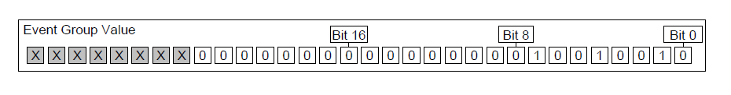
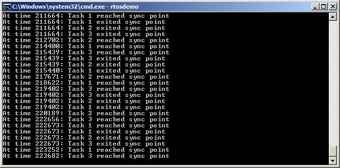

# 9 事件组

## 9.1 章节介绍与范围

已经提到过，实时嵌入式系统必须对事件作出响应。前面的章节描述了 FreeRTOS 中用于将事件传递给任务的功能。这些功能的例子包括信号量和队列，它们都具有以下特性：

- 它们允许一个任务在阻塞状态中等待单个事件的发生。

- 当事件发生时，它们会解除阻塞一个任务。被解除阻塞的任务是等待该事件的最高优先级任务。

事件组是 FreeRTOS 的另一项功能，它允许将事件传递给任务。与队列和信号量不同的是：

- 事件组允许一个任务在阻塞状态中等待一个或多个事件的组合发生。

- 当事件发生时，事件组会解除所有等待相同事件或事件组合的任务。

事件组的这些独特特性使其在同步多个任务、向多个任务广播事件、允许任务在阻塞状态下等待一组事件中的任意一个发生以及允许多个操作完成时非常有用。

事件组还可以减少应用程序使用的 RAM，因为通常可以用一个事件组替换许多二进制信号量。

事件组功能是可选的。要包含事件组功能，请将 FreeRTOS 源文件 event\_groups.c 作为项目的一部分进行编译。


### 9.1.1 范围

本章旨在帮助读者深入理解：

- 事件组的实际用途。
- 与其他 FreeRTOS 功能相比，事件组的优势和劣势。
- 如何在事件组中设置位。
- 如何在阻塞状态下等待事件组中的某些位被设置。
- 如何使用事件组来同步一组任务。


## 9.2 事件组的特性

### 9.2.1 事件组、事件标志和事件位

事件“标志”是一个布尔值（1 或 0），用于指示事件是否已发生。事件“组”是一组事件标志。

事件标志只能是 1 或 0，因此可以将事件标志的状态存储在一个单独的位中，而事件组中所有事件标志的状态可以存储在一个变量中；事件组中每个事件标志的状态由 `EventBits_t` 类型变量中的一个单独位表示。因此，事件标志也被称为事件“位”。如果 `EventBits_t` 变量中的某一位被设置为 1，则该位所代表的事件已发生。如果 `EventBits_t` 变量中的某一位被设置为 0，则该位所代表的事件尚未发生。

图 9.1 显示了如何将单个事件标志映射到 `EventBits_t` 类型变量中的各个位。


<a name="fig9.1" title="图 9.1 EventBits\_t 类型变量中的事件标志到位号的映射"></a>

* * *

***图 9.1*** *EventBits\_t 类型变量中的事件标志到位号的映射*
* * *

例如，如果事件组的值为 0x92（二进制 1001 0010），则只有事件位 1、4 和 7 被设置，这意味着只有由位 1、4 和 7 表示的事件已发生。图 9.2 显示了一个 `EventBits_t` 类型的变量，其中设置了事件位 1、4 和 7，其他事件位均被清除，从而使事件组的值为 0x92。


<a name="fig9.2" title="图 9.2 仅设置了位 1、4 和 7，且所有其他事件标志均被清除，使事件组的值为 0x92 的事件组"></a>

* * *

***图 9.2*** *仅设置了位 1、4 和 7，且所有其他事件标志均被清除，使事件组的值为 0x92 的事件组*
* * *

应用程序编写者需要为事件组中的各个位分配含义。例如，应用程序编写者可能会创建一个事件组，然后：

- 定义事件组中的第 0 位表示“已从网络接收到消息”。

- 定义事件组中的第 1 位表示“有一条消息准备发送到网络上”。

- 定义事件组中的第 2 位表示“终止当前的网络连接”。


### 9.2.2 更多关于 `EventBits_t` 数据类型的内容

事件组中事件位的数量取决于 FreeRTOSConfig.h 中的 `configTICK_TYPE_WIDTH_IN_BITS` 编译时配置常量[^24]：

[^24]: `configTICK_TYPE_WIDTH_IN_BITS` 配置用于保存 RTOS 滴答计数的类型，因此看似与事件组功能无关。它对 `EventBits_t` 类型的影响是 FreeRTOS 内部实现的结果。虽然将 `configTICK_TYPE_WIDTH_IN_BITS` 设置为 `TICK_TYPE_WIDTH_16_BITS` 是可取的，但这仅应在 FreeRTOS 运行在能更高效处理 16 位类型而非 32 位类型的架构上时进行。

- 如果 `configTICK_TYPE_WIDTH_IN_BITS` 为 `TICK_TYPE_WIDTH_16_BITS`，则每个事件组包含 8 个可用的事件位。

- 如果 `configTICK_TYPE_WIDTH_IN_BITS` 为 `TICK_TYPE_WIDTH_32_BITS`，则每个事件组包含 24 个可用的事件位。

- 如果 `configTICK_TYPE_WIDTH_IN_BITS` 为 `TICK_TYPE_WIDTH_64_BITS`，则每个事件组包含 56 个可用的事件位。


### 9.2.3 多任务访问

事件组是独立的对象，任何知道其存在的任务或中断服务例程（ISR）都可以访问它们。任意数量的任务可以在同一个事件组中设置位，任意数量的任务可以从同一个事件组中读取位。


### 9.2.4 使用事件组的实际示例

FreeRTOS+TCP TCP/IP 协议栈的实现提供了一个实际示例，展示了如何使用事件组来同时简化设计并最小化资源使用。

TCP 套接字必须响应许多不同的事件。事件的例子包括接受事件、绑定事件、读取事件和关闭事件。套接字在任何给定时间可以预期的事件取决于套接字的状态。例如，如果一个套接字已被创建但尚未绑定到地址，则它可以预期接收绑定事件，但不会预期接收读取事件（如果没有地址，它无法读取数据）。

FreeRTOS+TCP 套接字的状态存储在一个名为 `FreeRTOS_Socket_t` 的结构体中。该结构体包含一个事件组，其中为套接字必须处理的每个事件定义了一个事件位。阻塞以等待某个事件或一组事件的 FreeRTOS+TCP API 调用只需在事件组上阻塞即可。

事件组还包含一个“中止”位，允许无论套接字当前正在等待哪个事件，都能中止 TCP 连接。


## 9.3 使用事件组进行事件管理

### 9.3.1 `xEventGroupCreate()` API 函数

FreeRTOS 还包括 `xEventGroupCreateStatic()` 函数，该函数在编译时静态分配创建事件组所需的内存：事件组在使用前必须显式创建。

事件组通过 `EventGroupHandle_t` 类型的变量引用。`xEventGroupCreate()` API 函数用于创建事件组，并返回一个 `EventGroupHandle_t` 来引用所创建的事件组。


<a name="list9.1" title="清单 9.1 xEventGroupCreate() API 函数原型"></a>

```c
EventGroupHandle_t xEventGroupCreate( void );
```
***清单 9.1*** *xEventGroupCreate() API 函数原型*


**xEventGroupCreate() 返回值**

- 返回值

  如果返回 NULL，则表示由于堆内存不足，FreeRTOS 无法分配事件组数据结构，因此事件组无法创建。第 3 章提供了有关堆内存管理的更多信息。

  返回非 NULL 值表示事件组已成功创建。返回的值应存储为所创建事件组的句柄。


### 9.3.2 `xEventGroupSetBits()` API 函数

`xEventGroupSetBits()` API 函数用于在事件组中设置一个或多个位，通常用来通知任务某一事件（由被设置的位或多位表示）已发生。

> *注意：切勿从中断服务例程中调用 `xEventGroupSetBits()`。应使用中断安全版本的函数 `xEventGroupSetBitsFromISR()` 来替代它。*


<a name="list9.2" title="清单 9.2 xEventGroupSetBits() API 函数原型"></a>

```c
EventBits_t xEventGroupSetBits( EventGroupHandle_t xEventGroup,

const EventBits_t uxBitsToSet );
```
***清单 9.2*** *xEventGroupSetBits() API 函数原型*


**xEventGroupSetBits() 参数和返回值**

- `xEventGroup`

  正在设置位的事件组的句柄。该事件组句柄将由用于创建事件组的 `xEventGroupCreate()` 调用返回。

- `uxBitsToSet`

  一个位掩码，用于指定要在事件组中设置为 1 的事件位或多位。事件组的值通过将事件组的现有值与传入 `uxBitsToSet` 的值进行按位 OR 操作来更新。

  例如，将 `uxBitsToSet` 设置为 0x04（二进制 0100）将导致事件组中的第 3 个事件位被设置（如果尚未设置），同时保持事件组中的其他所有事件位不变。

- 返回值

  调用 `xEventGroupSetBits()` 时事件组的值。请注意，返回的值不一定包含由 `uxBitsToSet` 指定的位，因为这些位可能已被其他任务再次清除。


### 9.3.3 `xEventGroupSetBitsFromISR()` API 函数

`xEventGroupSetBitsFromISR()` 是 `xEventGroupSetBits()` 的中断安全版本。

释放信号量是一种确定性操作，因为事先已知释放信号量最多会导致一个任务离开阻塞状态。然而，在事件组中设置位时，无法提前知道有多少任务会离开阻塞状态，因此在事件组中设置位不是一种确定性操作。

FreeRTOS 的设计和实现标准不允许在中断服务例程内或中断被禁用时执行非确定性操作。因此，`xEventGroupSetBitsFromISR()` 不会在中断服务例程中直接设置事件位，而是将该操作推迟到 RTOS 守护任务中执行。


<a name="list9.3" title="清单 9.3 xEventGroupSetBitsFromISR() API 函数原型"></a>

```c
BaseType_t xEventGroupSetBitsFromISR( EventGroupHandle_t xEventGroup,
                                      const EventBits_t uxBitsToSet,
                                      BaseType_t *pxHigherPriorityTaskWoken );
```
***清单 9.3*** *xEventGroupSetBitsFromISR() API 函数原型*


**xEventGroupSetBitsFromISR() 参数和返回值**

- `xEventGroup`

  正在设置位的事件组的句柄。该事件组句柄将由用于创建事件组的 `xEventGroupCreate()` 调用返回。

- `uxBitsToSet`

  一个位掩码，用于指定要在事件组中设置为 1 的事件位或多位。事件组的值通过将事件组的现有值与传入 `uxBitsToSet` 的值进行按位 OR 操作来更新。

  例如，将 `uxBitsToSet` 设置为 0x05（二进制 0101）将导致事件组中的第 2 个事件位和第 0 个事件位被设置（如果尚未设置），同时保持事件组中的其他所有事件位不变。

- `pxHigherPriorityTaskWoken`

  `xEventGroupSetBitsFromISR()` 不会在中断服务例程中直接设置事件位，而是通过向定时器命令队列发送命令，将该操作推迟到 RTOS 守护任务中执行。如果守护任务处于阻塞状态以等待定时器命令队列上的数据变为可用，则写入定时器命令队列将使守护任务离开阻塞状态。如果守护任务的优先级高于当前正在执行的任务（被中断的任务），那么在内部，`xEventGroupSetBitsFromISR()` 将设置 `*pxHigherPriorityTaskWoken` 为 `pdTRUE`。

  如果 `xEventGroupSetBitsFromISR()` 将此值设置为 `pdTRUE`，则应在退出中断之前执行上下文切换。这将确保中断直接返回到守护任务，因为守护任务将是最高优先级的就绪状态任务。

- 返回值

  可能有两种返回值：

  - 仅当成功将数据发送到定时器命令队列时，返回 `pdPASS`。

  - 如果由于队列已满而无法将“设置位”命令写入定时器命令队列，则返回 `pdFALSE`。


### 9.3.4 `xEventGroupWaitBits()` API 函数

`xEventGroupWaitBits()` API 函数允许任务读取事件组的值，并在事件位尚未设置的情况下，选择性地以阻塞状态等待事件组中的一个或多个事件位被设置。


<a name="list9.4" title="清单 9.4 xEventGroupWaitBits() API 函数原型"></a>

```c
EventBits_t xEventGroupWaitBits( EventGroupHandle_t xEventGroup,
                                 const EventBits_t uxBitsToWaitFor,
                                 const BaseType_t xClearOnExit,
                                 const BaseType_t xWaitForAllBits,
                                 TickType_t xTicksToWait );
```
***清单 9.4*** *xEventGroupWaitBits() API 函数原型*

调度器用来确定任务是否进入阻塞状态以及何时离开阻塞状态的条件称为“解除阻塞条件”。解除阻塞条件由 `uxBitsToWaitFor` 和 `xWaitForAllBits` 参数值的组合指定：

- `uxBitsToWaitFor` 指定要测试的事件组中的哪些位。

- `xWaitForAllBits` 指定是使用按位 OR 测试还是按位 AND 测试。

如果在调用 `xEventGroupWaitBits()` 时已满足其解除阻塞条件，则任务不会进入阻塞状态。

表 6 提供了导致任务进入或退出阻塞状态的条件示例。表 6 仅显示事件组和 `uxBitsToWaitFor` 值的最低有效四位二进制位——假定这两个值的其他位均为零。

<a name="tbl6" title="表 6 uxBitsToWaitFor 和 xWaitForAllBits 参数的影响"></a>

* * *
| 现有事件组值 | uxBitsToWaitFor 值 | xWaitForAllBits 值 | 结果行为 |
| -------------------------- | --------------------- | --------------------- | ------------------ |
| 0000 | 0101 | pdFALSE | 调用任务将进入阻塞状态，因为事件组中第 0 位和第 2 位均未设置，并且当事件组中第 0 位或第 2 位被设置时，任务将离开阻塞状态。 |
| 0100 | 0101 | pdTRUE | 调用任务将进入阻塞状态，因为事件组中第 0 位和第 2 位并未同时设置，并且当事件组中第 0 位和第 2 位均被设置时，任务将离开阻塞状态。 |
| 0100 | 0110 | pdFALSE | 调用任务不会进入阻塞状态，因为 `xWaitForAllBits` 为 pdFALSE，并且 `uxBitsToWaitFor` 中指定的两位中已有一位在事件组中被设置。 |
| 0100 | 0110 | pdTRUE | 调用任务将进入阻塞状态，因为 `xWaitForAllBits` 为 pdTRUE，并且 `uxBitsToWaitFor` 中指定的两位中只有一位在事件组中被设置。当事件组中第 1 位和第 2 位均被设置时，任务将离开阻塞状态。 |

***表 6*** *uxBitsToWaitFor 和 xWaitForAllBits 参数的影响*
* * *

调用任务通过 `uxBitsToWaitFor` 参数指定要测试的位，并且在其解除阻塞条件满足后，调用任务可能需要将这些位重新清零。可以使用 `xEventGroupClearBits()` API 函数清除事件位，但如果存在以下情况，手动使用该函数清除事件位会导致应用程序代码中的竞争条件：

- 有多个任务使用同一个事件组。
- 事件组中的位被其他任务或中断服务例程设置。

`xClearOnExit` 参数的提供是为了避免这些潜在的竞争条件。如果将 `xClearOnExit` 设置为 `pdTRUE`，那么对于调用任务来说，事件位的测试和清除操作看起来像是一个原子操作（不会被其他任务或中断打断）。

**xEventGroupWaitBits() 参数和返回值**

- `xEventGroup`

  包含要读取事件位的事件组的句柄。事件组句柄将从用于创建事件组的 `xEventGroupCreate()` 调用中返回。

- `uxBitsToWaitFor`

  一个位掩码，用于指定要在事件组中测试的事件位。

  例如，如果调用任务希望等待事件组中的事件位 0 和/或事件位 2 被设置，则可以将 `uxBitsToWaitFor` 设置为 0x05（二进制 0101）。更多示例请参见表 6。

- `xClearOnExit`

  如果调用任务的解除阻塞条件已满足，并且 `xClearOnExit` 设置为 `pdTRUE`，则在调用任务退出 `xEventGroupWaitBits()` API 函数之前，事件组中由 `uxBitsToWaitFor` 指定的事件位将被清零。

  如果将 `xClearOnExit` 设置为 `pdFALSE`，则事件组中的事件位状态不会被 `xEventGroupWaitBits()` API 函数修改。

- `xWaitForAllBits`

  `uxBitsToWaitFor` 参数指定了事件组中要测试的事件位。`xWaitForAllBits` 指定了调用任务是在 `uxBitsToWaitFor` 参数指定的一个或多个事件位被设置时解除阻塞状态，还是仅在所有由 `uxBitsToWaitFor` 参数指定的事件位都被设置时才解除阻塞状态。

  如果将 `xWaitForAllBits` 设置为 `pdFALSE`，那么进入阻塞状态等待其解除阻塞条件的任务将在 `uxBitsToWaitFor` 指定的任意一位被设置时离开阻塞状态（或者当 `xTicksToWait` 参数指定的超时时间到期时）。

  如果将 `xWaitForAllBits` 设置为 `pdTRUE`，那么进入阻塞状态等待其解除阻塞条件的任务只有在 `uxBitsToWaitFor` 指定的所有位均被设置时才会离开阻塞状态（或者当 `xTicksToWait` 参数指定的超时时间到期时）。

  更多示例请参见表 6。

- `xTicksToWait`

  任务为了等待其解除阻塞条件满足而应保持在阻塞状态的最长时间。

  如果 `xTicksToWait` 为零，或者在调用 `xEventGroupWaitBits()` 时已满足解除阻塞条件，`xEventGroupWaitBits()` 将立即返回。

  阻塞时间以 tick 周期为单位指定，因此它所表示的绝对时间取决于 tick 频率。可以使用宏 `pdMS_TO_TICKS()` 将以毫秒为单位指定的时间转换为以 tick 为单位的时间。

  将 `xTicksToWait` 设置为 `portMAX_DELAY` 将导致任务无限期等待（不会超时），前提是已在 FreeRTOSConfig.h 中将 `INCLUDE_vTaskSuspend` 设置为 1。

- 返回值

  如果 `xEventGroupWaitBits()` 因调用任务的解除阻塞条件已满足而返回，则返回值是调用任务解除阻塞条件满足时事件组的值（如果 `xClearOnExit` 为 `pdTRUE`，则在任何位被自动清除之前）。在这种情况下，返回值也将满足解除阻塞条件。

  如果 `xEventGroupWaitBits()` 因 `xTicksToWait` 参数指定的阻塞时间到期而返回，则返回值是阻塞时间到期时事件组的值。在这种情况下，返回值将不满足解除阻塞条件。


### 9.3.5 xEventGroupGetStaticBuffer() API 函数

`xEventGroupGetStaticBuffer()` API 函数提供了一种方法来检索静态创建的事件组的缓冲区指针。这个缓冲区是在事件组创建时提供的相同缓冲区。

*注意：切勿从中断服务例程调用 `xEventGroupGetStaticBuffer()`。


<a name="list9.5" title="清单 9.5 xEventGroupGetStaticBuffer() API 函数原型"></a>

```c
BaseType_t xEventGroupGetStaticBuffer( EventGroupHandle_t xEventGroup,

StaticEventGroup_t ** ppxEventGroupBuffer );
```
***清单 9.5*** *xEventGroupGetStaticBuffer() API 函数原型*


**xEventGroupGetStaticBuffer() 参数和返回值**

- `xEventGroup`

  要检索其缓冲区的事件组。此事件组必须由 `xEventGroupCreateStatic()` 创建。

- `ppxEventGroupBuffer`

  用于返回指向事件组数据结构缓冲区的指针。这是在创建时提供的相同缓冲区。

- 返回值

  有两种可能的返回值：

  - 如果成功检索到缓冲区，则返回 `pdTRUE`。
  
  - 如果未能成功检索到缓冲区，则返回 `pdFALSE`。

<a name="example9.1" title="示例 9.1 使用事件组进行实验"></a>
---
***示例 9.1*** *使用事件组进行实验*

---

本示例演示了如何：

- 创建一个事件组。
- 从中断服务例程设置事件组中的位。
- 从任务中设置事件组中的位。
- 阻塞等待事件组。

通过首先将 `xEventGroupWaitBits()` 的 `xWaitForAllBits` 参数设置为 `pdFALSE` 执行示例，然后将其设置为 `pdTRUE` 再次执行示例，展示了该参数的效果。

事件位 0 和事件位 1 由任务设置。事件位 2 由中断服务例程设置。这三位通过清单 9.6 中显示的 \#define 语句赋予了描述性名称。


<a name="list9.6" title="清单 9.6 示例 9.1 中使用的事件位定义"></a>

```c
/* 事件组中的事件位定义 */
#define mainFIRST_TASK_BIT ( 1UL << 0UL )  /* 事件位 0，由任务设置 */
#define mainSECOND_TASK_BIT ( 1UL << 1UL ) /* 事件位 1，由任务设置 */
#define mainISR_BIT ( 1UL << 2UL )         /* 事件位 2，由ISR设置 */
```
***清单 9.6*** *示例 9.1 中使用的事件位定义*


清单 9.7 展示了设置事件位 0 和事件位 1 的任务实现。它进入一个循环，反复设置一位，然后设置另一位，每次调用 `xEventGroupSetBits()` 之间有 200 毫秒的延迟。在每次设置位之前都会打印一条字符串，以便在控制台中查看执行顺序。

<a name="list9.7" title="清单 9.7 示例 9.1 中设置事件组中两位的任务"></a>

```c
static void vEventBitSettingTask( void *pvParameters )
{
    const TickType_t xDelay200ms = pdMS_TO_TICKS( 200UL );

    for( ;; )
    {
        /* 在开始下一次循环之前短暂停留。 */
        vTaskDelay( xDelay200ms );

        /* 打印一条消息，说明任务即将设置事件位 0，然后设置事件位 0。 */
        vPrintString( "位设置任务 -\t 即将设置位 0。\r\n" );
        xEventGroupSetBits( xEventGroup, mainFIRST_TASK_BIT );

        /* 在设置另一个位之前短暂停留。 */
        vTaskDelay( xDelay200ms );

        /* 打印一条消息，说明任务即将设置事件位 1，然后设置事件位 1。 */
        vPrintString( "位设置任务 -\t 即将设置位 1。\r\n" );
        xEventGroupSetBits( xEventGroup, mainSECOND_TASK_BIT );
    }
}
```
***清单 9.7*** *示例 9.1 中设置事件组中两位的任务*


清单 9.8 展示了设置事件组中位 2 的中断服务例程的实现。同样，在设置位之前会打印一条字符串，以便在控制台中查看执行顺序。然而，在这种情况下，由于不应直接在中断服务例程中执行控制台输出，因此使用 `xTimerPendFunctionCallFromISR()` 将输出操作推迟到实时操作系统（RTOS）守护任务的上下文中进行。

与之前的示例一样，中断服务例程由一个简单的周期性任务触发，该任务强制产生软件中断。在本示例中，中断每 500 毫秒生成一次。


<a name="list9.8" title="清单 9.8 示例 9.1 中设置事件组中位 2 的中断服务例程"></a>

```c
static uint32_t ulEventBitSettingISR( void )
{
    /* 字符串不会直接在中断服务例程中打印，而是发送到 RTOS 守护任务进行打印。
       因此将其声明为静态变量，以确保编译器不会将字符串分配到 ISR 的栈上，
       因为当字符串从守护任务打印时，ISR 的栈帧将不再存在。 */
    static const char *pcString = "位设置 ISR -\t 即将设置位 2。\r\n";
    BaseType_t xHigherPriorityTaskWoken = pdFALSE;

    /* 打印一条消息，说明即将设置位 2。消息不能直接从中断服务例程打印，
       因此通过挂起函数调用将实际输出推迟到 RTOS 守护任务中执行。 */
    xTimerPendFunctionCallFromISR( vPrintStringFromDaemonTask,
                                   ( void * ) pcString,
                                   0,
                                   &xHigherPriorityTaskWoken );

    /* 在事件组中设置位 2。 */
    xEventGroupSetBitsFromISR( xEventGroup,
                               mainISR_BIT,
                               &xHigherPriorityTaskWoken );

    /* xTimerPendFunctionCallFromISR() 和 xEventGroupSetBitsFromISR() 都会
       写入定时器命令队列，并且都使用了相同的 xHigherPriorityTaskWoken 变量。
       如果写入定时器命令队列导致 RTOS 守护任务离开阻塞状态，并且如果 RTOS 
       守护任务的优先级高于当前正在执行的任务（被此中断打断的任务），则
       xHigherPriorityTaskWoken 将被设置为 pdTRUE。

       xHigherPriorityTaskWoken 用作 portYIELD_FROM_ISR() 的参数。如果
       xHigherPriorityTaskWoken 等于 pdTRUE，则调用 portYIELD_FROM_ISR() 
       将请求上下文切换。如果 xHigherPriorityTaskWoken 仍为 pdFALSE，则调用
       portYIELD_FROM_ISR() 不会产生任何效果。

       Windows 移植版使用的 portYIELD_FROM_ISR() 实现包含 return 语句，
       这就是为什么此函数未显式返回值的原因。 */

    portYIELD_FROM_ISR( xHigherPriorityTaskWoken );
}
```
***清单 9.8*** *示例 9.1 中设置事件组中位 2 的中断服务例程*


清单 9.9 展示了调用 `xEventGroupWaitBits()` 以阻塞等待事件组的任务实现。该任务为事件组中设置的每一位打印一条字符串。

`xEventGroupWaitBits()` 的 `xClearOnExit` 参数被设置为 `pdTRUE`，因此导致 `xEventGroupWaitBits()` 返回的事件位会在 `xEventGroupWaitBits()` 返回之前自动清除。


<a name="list9.9" title="清单 9.9 示例 9.1 中阻塞等待事件位设置的任务"></a>

```c
static void vEventBitReadingTask( void *pvParameters )
{
    EventBits_t xEventGroupValue;
    const EventBits_t xBitsToWaitFor = ( mainFIRST_TASK_BIT  |
                                         mainSECOND_TASK_BIT |
                                         mainISR_BIT );

    for( ;; )
    {
        /* 阻塞等待事件组中的事件位被设置。 */
        xEventGroupValue = xEventGroupWaitBits( /* 要读取的事件组 */
                                                xEventGroup,

                                                /* 要测试的位 */
                                                xBitsToWaitFor,

                                                /* 如果满足解除阻塞条件，则在退出时清除位 */
                                                pdTRUE,

                                                /* 不等待所有位。此参数在第二次执行时设置为 pdTRUE。 */
                                                pdFALSE,

                                                /* 不超时。 */
                                                portMAX_DELAY );

        /* 为每个被设置的位打印一条消息。 */
        if( ( xEventGroupValue & mainFIRST_TASK_BIT ) != 0 )
        {
            vPrintString( "位读取任务 -\t 事件位 0 已被设置\r\n" );
        }

        if( ( xEventGroupValue & mainSECOND_TASK_BIT ) != 0 )
        {
            vPrintString( "位读取任务 -\t 事件位 1 已被设置\r\n" );
        }

        if( ( xEventGroupValue & mainISR_BIT ) != 0 )
        {
            vPrintString( "位读取任务 -\t 事件位 2 已被设置\r\n" );
        }
    }
}
```
***清单 9.9*** *示例 9.1 中阻塞等待事件位设置的任务*


`main()` 函数创建了事件组和任务，然后启动调度器。其具体实现见清单 9.10。从事件组中读取的任务优先级高于向事件组写入的任务优先级，确保每次读取任务的解除阻塞条件满足时，它都会抢占写入任务。


<a name="list9.10" title="清单 9.10 示例 9.1 中创建事件组和任务"></a>

```c
int main( void )
{
    /* 在使用事件组之前，必须先创建它。 */
    xEventGroup = xEventGroupCreate();

    /* 创建设置事件组中事件位的任务。 */
    xTaskCreate( vEventBitSettingTask, "位设置器", 1000, NULL, 1, NULL );

    /* 创建等待事件组中事件位被设置的任务。 */
    xTaskCreate( vEventBitReadingTask, "位读取器", 1000, NULL, 2, NULL );

    /* 创建用于周期性触发软件中断的任务。 */
    xTaskCreate( vInterruptGenerator, "中断生成器", 1000, NULL, 3, NULL );

    /* 安装软件中断的处理程序。完成此操作所需的语法取决于所使用的 FreeRTOS 移植版本。
       此处显示的语法只能与 FreeRTOS Windows 移植版本一起使用，在这种情况下，
       这些中断只是模拟的。 */
    vPortSetInterruptHandler( mainINTERRUPT_NUMBER, ulEventBitSettingISR );

    /* 启动调度器以使创建的任务开始执行。 */
    vTaskStartScheduler();

    /* 以下代码行永远不应被执行到。 */
    for( ;; );
    return 0;
}
```
***清单 9.10*** *示例 9.1 中创建事件组和任务*


当使用 `xEventGroupWaitBits()` 的 `xWaitForAllBits` 参数设置为 `pdFALSE` 执行示例 9.1 时，产生的输出如图 9.3 所示。在图 9.3 中可以看出，由于调用 `xEventGroupWaitBits()` 时将 `xWaitForAllBits` 参数设置为 `pdFALSE`，因此每当任何一个事件位被设置时，从事件组中读取的任务就会立即离开阻塞状态并执行。

<a name="fig9.3" title="图 9.3 示例 9.1 在 xWaitForAllBits 设置为 pdFALSE 时产生的输出"></a>

* * *

***图 9.3*** *示例 9.1 在 xWaitForAllBits 设置为 pdFALSE 时产生的输出*
* * *

当使用 `xEventGroupWaitBits()` 的 `xWaitForAllBits` 参数设置为 `pdTRUE` 执行示例 9.1 时，产生的输出如图 9.4 所示。在图 9.4 中可以看出，由于 `xWaitForAllBits` 参数被设置为 `pdTRUE`，从事件组中读取的任务只有在所有三个事件位都被设置后才会离开阻塞状态。


<a name="fig9.4" title="图 9.4 示例 9.1 在 xWaitForAllBits 设置为 pdTRUE 时产生的输出"></a>

* * *

***图 9.4*** *示例 9.1 在 xWaitForAllBits 设置为 pdTRUE 时产生的输出*
* * *


## 9.4 使用事件组进行任务同步

有时应用程序的设计需要两个或多个任务相互同步。例如，考虑这样一个设计：任务 A 接收到一个事件，然后将由该事件引发的部分处理工作委派给其他三个任务：任务 B、任务 C 和任务 D。如果任务 A 在任务 B、C 和 D 全部完成对前一个事件的处理之前无法接收另一个事件，那么所有四个任务都需要彼此同步。每个任务的同步点将在其完成处理之后，并且在其他任务都完成相同操作之前无法继续。任务 A 只有在所有四个任务都到达它们的同步点后才能接收另一个事件。

这种任务同步需求的一个更具体的例子可以在 FreeRTOS+TCP 演示项目之一中找到。该演示在两个任务之间共享一个 TCP 套接字；一个任务向套接字发送数据，另一个任务从同一个套接字接收数据[^25]。如果任何一个任务无法确保另一个任务不会再次尝试访问套接字，则关闭 TCP 套接字是不安全的。如果两个任务中的任何一个希望关闭套接字，它必须通知另一个任务它的意图，然后等待另一个任务停止使用套接字后再继续。清单 9.10 展示了伪代码，演示了向套接字发送数据的任务希望关闭套接字的场景。

[^25]: 在撰写本文时，这是唯一一种可以将单个 FreeRTOS+TCP 套接字在任务之间共享的方式。

清单 9.10 所展示的场景很简单，因为只有两个任务需要相互同步，但很容易看出，如果有其他任务执行依赖于套接字保持打开状态的处理，这种场景会变得更加复杂，并需要更多的任务加入同步。


<a name="list9.11" title="清单 9.11 两个任务相互同步以确保共享的 TCP 套接字..."></a>

```c
void SocketTxTask( void *pvParameters )
{
    xSocket_t xSocket;
    uint32_t ulTxCount = 0UL;

    for( ;; )
    {
        /* 创建一个新的套接字。此任务将向这个套接字发送数据，另一个任务将从该套接字接收数据。 */
        xSocket = FreeRTOS_socket( ... );

        /* 连接套接字。 */
        FreeRTOS_connect( xSocket, ... );

        /* 使用队列将套接字发送到接收数据的任务。 */
        xQueueSend( xSocketPassingQueue, &xSocket, portMAX_DELAY );

        /* 向套接字发送 1000 条消息，然后再关闭套接字。 */
        for( ulTxCount = 0; ulTxCount < 1000; ulTxCount++ )
        {
            if( FreeRTOS_send( xSocket, ... ) < 0 )
            {
                /* 出现意外错误 - 退出循环，之后套接字将被关闭。 */
                break;
            }
        }

        /* 通知接收任务，发送任务希望关闭套接字。 */
        TxTaskWantsToCloseSocket();

        /* 这是发送任务的同步点。发送任务在此等待接收任务到达其同步点。
           接收任务只有在不再使用套接字时才会到达其同步点，此时可以安全地关闭套接字。 */
        xEventGroupSync( ... );

        /* 两个任务都不再使用套接字。关闭连接，然后关闭套接字。 */
        FreeRTOS_shutdown( xSocket, ... );
        WaitForSocketToDisconnect();
        FreeRTOS_closesocket( xSocket );
    }
}
/*-----------------------------------------------------------*/

void SocketRxTask( void *pvParameters )
{
    xSocket_t xSocket;

    for( ;; )
    {
        /* 等待接收由发送任务创建并连接的套接字。 */
        xQueueReceive( xSocketPassingQueue, &xSocket, portMAX_DELAY );

        /* 继续从套接字接收数据，直到发送任务希望关闭套接字。 */
        while( TxTaskWantsToCloseSocket() == pdFALSE )
        {
           /* 接收并处理数据。 */
           FreeRTOS_recv( xSocket, ... );
           ProcessReceivedData();
        }

        /* 这是接收任务的同步点 - 它仅在不再使用套接字时到达此处，
           此时发送任务可以安全地关闭套接字。 */
        xEventGroupSync( ... );
    }
}
```
***清单 9.11*** *两个任务相互同步的伪代码，以确保在关闭套接字之前，共享的 TCP 套接字不再被任何任务使用*


事件组可用于创建同步点：

- 必须参与同步的每个任务在事件组中分配一个唯一的事件位。

- 每个任务在到达同步点时设置自己的事件位。

- 在设置自己的事件位后，每个任务会阻塞在事件组上，等待代表所有其他同步任务的事件位也被设置。

然而，在这种场景中无法使用 `xEventGroupSetBits()` 和 `xEventGroupWaitBits()` API 函数。如果使用它们，则设置位（以指示任务已到达其同步点）和测试位（以确定其他同步任务是否已到达其同步点）将作为两个单独的操作执行。要了解为什么这会成为问题，请考虑任务 A、任务 B 和任务 C 尝试使用事件组进行同步的场景：

1. 任务 A 和任务 B 已经到达同步点，因此它们的事件位已在事件组中被设置，并且它们处于阻塞状态，等待任务 C 的事件位也被设置。

2. 任务 C 到达同步点，并使用 `xEventGroupSetBits()` 在事件组中设置其位。一旦任务 C 的位被设置，任务 A 和任务 B 离开阻塞状态，并清除所有三个事件位。

3. 任务 C 随后调用 `xEventGroupWaitBits()` 以等待所有三个事件位被设置，但此时，所有三个事件位已经被清除，任务 A 和任务 B 已离开各自的同步点，因此同步失败。

为了成功使用事件组创建同步点，设置事件位以及随后测试事件位的操作必须作为一个不可中断的整体操作执行。为此提供了 `xEventGroupSync()` API 函数。


### 9.4.1 xEventGroupSync() API 函数

`xEventGroupSync()` 提供用于允许两个或多个任务使用事件组相互同步的功能。该函数允许任务在事件组中设置一个或多个事件位，然后在同一事件组中等待一组事件位被设置，作为一个不可中断的整体操作。

`xEventGroupSync()` 的 `uxBitsToWaitFor` 参数指定了调用任务的解除阻塞条件。如果 `xEventGroupSync()` 因为解除阻塞条件得到满足而返回，则由 `uxBitsToWaitFor` 指定的事件位将在 `xEventGroupSync()` 返回之前被清零。


<a name="list9.12" title="清单 9.12 xEventGroupSync() API 函数原型"></a>

```c
EventBits_t xEventGroupSync( EventGroupHandle_t xEventGroup,
                             const EventBits_t uxBitsToSet,
                             const EventBits_t uxBitsToWaitFor,
                             TickType_t xTicksToWait );
```
***清单 9.12*** *xEventGroupSync() API 函数原型*


**xEventGroupSync() 参数和返回值**

- `xEventGroup`

  要设置并随后测试事件位的事件组的句柄。事件组句柄将从用于创建事件组的 `xEventGroupCreate()` 调用中返回。

- `uxBitsToSet`

  一个位掩码，用于指定要在事件组中设置为1的事件位或事件位集合。事件组的值通过将事件组的现有值与传入`uxBitsToSet`中的值进行按位或（OR）操作来更新。

  例如，将`uxBitsToSet`设置为0x04（二进制0100）将导致事件位2被设置（如果尚未设置），同时保持事件组中所有其他事件位不变。

- `uxBitsToWaitFor`

  一个位掩码，用于指定要在事件组中测试的事件位或事件位集合。

  例如，如果调用任务希望等待事件组中的事件位0、1和2被设置，则将`uxBitsToWaitFor`设置为0x07（二进制111）。

- `xTicksToWait`

  任务应保持在阻塞状态以等待其解除阻塞条件的最大时间。

  如果`xTicksToWait`为零，或者在调用`xEventGroupSync()`时解除阻塞条件已经满足，则`xEventGroupSync()`将立即返回。

  阻塞时间以滴答周期为单位指定，因此它表示的绝对时间取决于滴答频率。宏`pdMS_TO_TICKS()`可用于将毫秒为单位的时间转换为滴答为单位的时间。

  将`xTicksToWait`设置为`portMAX_DELAY`将使任务无限期等待（不会超时），前提是已在FreeRTOSConfig.h中将`INCLUDE_vTaskSuspend`设置为1。

- 返回值

  如果`xEventGroupSync()`因为调用任务的解除阻塞条件得到满足而返回，则返回值是调用任务解除阻塞条件满足时事件组的值（在任何位自动清零之前）。在这种情况下，返回值也将满足调用任务的解除阻塞条件。

  如果`xEventGroupSync()`因为`xTicksToWait`参数指定的阻塞时间到期而返回，则返回值是阻塞时间到期时事件组的值。在这种情况下，返回值将不满足调用任务的解除阻塞条件。


<a name="example9.2" title="示例 9.2 同步任务"></a>
---
***示例 9.2*** *同步任务*

---

示例 9.2 使用`xEventGroupSync()`来同步三个相同任务实现的实例。任务参数用于向每个实例传递任务在调用`xEventGroupSync()`时将设置的事件位。

该任务在调用`xEventGroupSync()`之前打印一条消息，并在调用`xEventGroupSync()`返回后再次打印消息。每条消息都包含时间戳。这允许在生成的输出中观察执行顺序。使用伪随机延迟来防止所有任务同时到达同步点。

有关任务实现，请参见清单 9.12。


<a name="list9.13" title="清单 9.13 示例 9.2 中使用的任务实现"></a>

```c
static void vSyncingTask( void *pvParameters )
{
    const TickType_t xMaxDelay = pdMS_TO_TICKS( 4000UL );
    const TickType_t xMinDelay = pdMS_TO_TICKS( 200UL );
    TickType_t xDelayTime;
    EventBits_t uxThisTasksSyncBit;
    const EventBits_t uxAllSyncBits = ( mainFIRST_TASK_BIT  |
                                        mainSECOND_TASK_BIT |
                                        mainTHIRD_TASK_BIT );

    /* 创建了此任务的三个实例 - 每个任务在同步中使用不同的事件位。
       使用任务参数将要使用的事件位传递给每个任务实例。
       将其存储在uxThisTasksSyncBit变量中。 */
    uxThisTasksSyncBit = ( EventBits_t ) pvParameters;

    for( ;; )
    {
        /* 模拟此任务执行某些操作所花费的时间，
           方法是延迟一段伪随机时间。
           这防止了此任务的三个实例同时到达同步点，
           从而更容易观察示例的行为。 */
        xDelayTime = ( rand() % xMaxDelay ) + xMinDelay;
        vTaskDelay( xDelayTime );

        /* 打印一条消息，表明此任务已到达其同步点。
           pcTaskGetTaskName()是一个API函数，返回任务创建时分配的任务名称。 */
        vPrintTwoStrings( pcTaskGetTaskName( NULL ), "reached sync point" );

        /* 等待所有任务到达各自的同步点。 */
        xEventGroupSync( /* 用于同步的事件组。 */
                         xEventGroup,

                         /* 此任务设置的位，用于指示它已到达同步点。 */
                         uxThisTasksSyncBit,

                         /* 要等待的位，每个参与同步的任务对应一位。 */
                         uxAllSyncBits,

                         /* 无限期等待所有三个任务到达同步点。 */
                         portMAX_DELAY );

        /* 打印一条消息，表明此任务已通过其同步点。
           由于使用了无限期延迟，因此只有在所有任务到达各自的同步点后，
           下一行才会被执行。 */
        vPrintTwoStrings( pcTaskGetTaskName( NULL ), "exited sync point" );
    }
}
```
***清单 9.13*** *示例 9.2 中使用的任务实现*

`main()` 函数创建事件组，创建所有三个任务，然后启动调度器。有关实现，请参见清单 9.14。

<a name="list9.14" title="清单 9.14 示例 9.2 中使用的 main() 函数"></a>

```c
/* 定义事件组中的事件位。 */

#define mainFIRST_TASK_BIT ( 1UL << 0UL ) /* 事件位0，由第一个任务设置 */
#define mainSECOND_TASK_BIT( 1UL << 1UL ) /* 事件位1，由第二个任务设置 */
#define mainTHIRD_TASK_BIT ( 1UL << 2UL ) /* 事件位2，由第三个任务设置 */

/* 声明用于同步三个任务的事件组。 */
EventGroupHandle_t xEventGroup;

int main( void )
{
    /* 在使用事件组之前，必须先创建它。 */
    xEventGroup = xEventGroupCreate();

    /* 创建三个任务实例。每个任务被赋予不同的名称，
       随后打印出来以直观显示哪个任务正在执行。
       任务在到达其同步点时使用的事件位通过任务参数传递给任务。 */
    xTaskCreate( vSyncingTask, "任务 1", 1000, mainFIRST_TASK_BIT, 1, NULL );
    xTaskCreate( vSyncingTask, "任务 2", 1000, mainSECOND_TASK_BIT, 1, NULL );
    xTaskCreate( vSyncingTask, "任务 3", 1000, mainTHIRD_TASK_BIT, 1, NULL );

    /* 启动调度器以使创建的任务开始执行。 */
    vTaskStartScheduler();

    /* 和往常一样，以下代码行永远不应被执行到。 */
    for( ;; );
    return 0;
}
```
***清单 9.14*** *示例 9.2 中使用的 main() 函数*

执行示例 9.2 时生成的输出如图 9.5 所示。
可以看出，即使每个任务在不同的（伪随机）时间到达同步点，所有任务都在同一时间退出同步点[^26]（即最后一个任务到达同步点的时间）。

[^26]: 图 9.5 显示了该示例在 FreeRTOS Windows 移植版本中运行的情况，
该移植版本不提供真正的实时行为（尤其是在使用 Windows 系统调用向控制台打印时），
因此会显示出一些时间上的变化。


<a name="fig9.5" title="图 9.5 执行示例 9.2 时生成的输出"></a>

* * *

***图 9.5*** *执行示例 9.2 时生成的输出*
* * *


