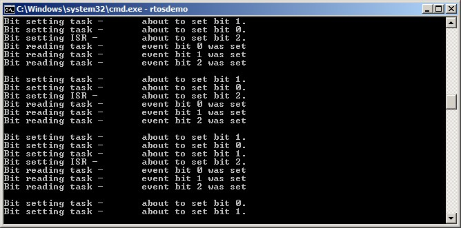

# 9 事件组

## 9.1 章节介绍与范围

已经提到，实时嵌入式系统必须对事件做出响应。前面的章节描述了FreeRTOS的特性，这些特性允许事件被传递给任务。这些特性的例子包括信号量和队列，它们都具有以下属性：

- 它们允许一个任务在阻塞状态下等待单个事件发生。
- 它们在事件发生时解除单个任务的阻塞状态。被解除阻塞的任务是等待该事件的最高优先级任务。

事件组是FreeRTOS的另一个特性，它允许事件被传递给任务。与队列和信号量不同：

- 事件组允许一个任务在阻塞状态下等待一个或多个事件的组合发生。
- 事件组在事件发生时解除所有等待相同事件或事件组合的任务的阻塞状态。

事件组的这些独特属性使它们在同步多个任务、向多个任务广播事件、允许一个任务在阻塞状态下等待一组事件中的任何一个事件发生以及允许一个任务在阻塞状态下等待多个操作完成时非常有用。

事件组还提供了减少应用程序使用的RAM的机会，因为通常可以用单个事件组替换许多二进制信号量。

事件组功能是可选的。要包含事件组功能，请将FreeRTOS源文件event_groups.c作为项目的一部分进行构建。


### 9.1.1 范围

本章旨在让读者对以下内容有良好的理解：

- 事件组的实际用途。
- 事件组相对于其他FreeRTOS功能的优缺点。
- 如何在事件组中设置位。
- 如何在阻塞状态下等待事件组中的位被设置。
- 如何使用事件组同步一组任务。

## 9.2 事件组的特性

### 9.2.1 事件组、事件标志和事件位

事件“标志”是一个布尔值（1或0），用于指示事件是否发生。事件“组”是一组事件标志。

事件标志只能是1或0，允许事件标志的状态存储在一个位中，并且事件组中所有事件标志的状态可以存储在一个变量中；事件组中每个事件标志的状态由`EventBits_t`类型变量中的一个位表示。因此，事件标志也称为事件“位”。如果`EventBits_t`变量中的一个位设置为1，则该位表示的事件已发生。如果`EventBits_t`变量中的一个位设置为0，则该位表示的事件未发生。

图9.1展示了如何将单个事件标志映射到`EventBits_t`类型变量中的单个位。

<a name="fig9.1" title="图9.1 Event flag to bit number mapping in a variable of type EventBits\_t"></a>

* * *

***图9.1*** *Event flag to bit number mapping in a variable of type EventBits\_t*
* * *

例如，如果事件组的值为0x92（二进制1001 0010），则只有事件位1、4和7被设置，因此只有位1、4和7表示的事件已发生。图9.2展示了一个`EventBits_t`类型的变量，其中事件位1、4和7被设置，所有其他事件位清除，使事件组的值为0x92。

<a name="fig9.2" title="图9.2 An event group in which only bits 1, 4 and 7 are set, and all the other event flags are clear, making the event group's value 0x92"></a>

* * *

***图9.2*** *An event group in which only bits 1, 4 and 7 are set, and all the other event flags are clear, making the event group's value 0x92*
* * *

应用程序编写者需要为事件组中的单个位赋予意义。例如，应用程序编写者可以创建一个事件组，然后：

- 定义事件组中的位0表示“从网络接收到消息”。
- 定义事件组中的位1表示“消息准备好发送到网络”。
- 定义事件组中的位2表示“中止当前网络连接”。


### 9.2.2 关于EventBits\_t数据类型的更多信息

事件组中事件位的数量取决于FreeRTOSConfig.h中编译时配置常量`configTICK_TYPE_WIDTH_IN_BITS`[^24]：

[^24]: `configTICK_TYPE_WIDTH_IN_BITS`配置用于保存RTOS时钟计数的类型，因此看起来与事件组功能无关。其对`EventBits_t`类型的影响是FreeRTOS内部实现的结果，尽管希望将`configTICK_TYPE_WIDTH_IN_BITS`设置为`TICK_TYPE_WIDTH_16_BITS`，但这只能在FreeRTOS在能够更高效地处理16位类型而不是32位类型的架构上执行时才能这样做。

- 如果`configTICK_TYPE_WIDTH_IN_BITS`是`TICK_TYPE_WIDTH_16_BITS`，那么每个事件组包含8个可用事件位。
- 如果`configTICK_TYPE_WIDTH_IN_BITS`是`TICK_TYPE_WIDTH_32_BITS`，那么每个事件组包含24个可用事件位。
- 如果`configTICK_TYPE_WIDTH_IN_BITS`是`TICK_TYPE_WIDTH_64_BITS`，那么每个事件组包含56个可用事件位。


### 9.2.3 多任务访问

事件组是独立的对象，可以被任何知道其存在的任务或中断服务程序（ISR）访问。任意数量的任务可以设置同一事件组中的位，任意数量的任务可以从同一事件组中读取位。

### 9.2.4 使用事件组的实际示例

FreeRTOS+TCP TCP/IP 栈的实现提供了一个实际示例，展示了如何使用事件组来同时简化设计并最小化资源使用。

TCP 套接字必须响应许多不同的事件。事件的示例包括接受事件、绑定事件、读取事件和关闭事件。套接字在任何给定时间可以期望的事件取决于套接字的状态。例如，如果一个套接字已经创建但尚未绑定到地址，那么它可以期望接收绑定事件，但不会期望接收读取事件（如果没有地址，它无法读取数据）。

FreeRTOS+TCP 套接字的状态存储在一个名为 `FreeRTOS_Socket_t` 的结构中。该结构包含一个事件组，其中为套接字必须处理的每个事件定义了一个事件位。阻塞以等待事件或事件组的 FreeRTOS+TCP API 调用只是阻塞在事件组上。

事件组还包含一个 'abort' 位，允许在任何时候中止 TCP 连接，无论套接字当时正在等待哪个事件。


## 9.3 使用事件组管理事件

### 9.3.1 xEventGroupCreate() API 函数

FreeRTOS 还包括 `xEventGroupCreateStatic()` 函数，该函数在编译时静态分配创建事件组所需的内存：在使用事件组之前，必须显式创建事件组。

事件组使用 `EventGroupHandle_t` 类型的变量引用。`xEventGroupCreate()` API 函数用于创建事件组，并返回一个 `EventGroupHandle_t` 来引用它创建的事件组。

<a name="list9.1" title="Listing 9.1 The xEventGroupCreate() API function prototype"></a>

```c
EventGroupHandle_t xEventGroupCreate( void );
```
***Listing 9.1*** *The xEventGroupCreate() API function prototype*

**xEventGroupCreate() 返回值**

- 返回值

  如果返回 NULL，则无法创建事件组，因为没有足够的堆内存可供 FreeRTOS 分配事件组数据结构。第 3 章提供了有关堆内存管理的更多信息。

  返回非 NULL 值表示事件组已成功创建。返回的值应存储为创建的事件组的句柄。


### 9.3.2 xEventGroupSetBits() API 函数

`xEventGroupSetBits()` API 函数设置事件组中的一个或多个位，通常用于通知任务表示被设置的位或位发生的事件。

> *注意：永远不要在中断服务例程中调用 `xEventGroupSetBits()`。应该使用其替代品 `xEventGroupSetBitsFromISR()`。*


<a name="list9.2" title="清单 9.2. xEventGroupSetBits() API 函数原型"></a>

```c
EventBits_t xEventGroupSetBits( EventGroupHandle_t xEventGroup,

const EventBits_t uxBitsToSet );
```
***清单 9.2*** *xEventGroupSetBits() API 函数原型*


**xEventGroupSetBits() 参数和返回值**

- `xEventGroup`

  正在设置位的事件组的句柄。事件组句柄将从用于创建事件组的 `xEventGroupCreate()` 调用中返回。

- `uxBitsToSet`

  指定要在事件组中设置为 1 的事件位或事件位的位掩码。通过对事件组的现有值与传递给 `uxBitsToSet` 的值进行按位 OR 运算来更新事件组的值。

  例如，将 `uxBitsToSet` 设置为 0x04（二进制 0100）将导致事件组中的事件位 3 被设置（如果尚未设置），同时保持事件组中的所有其他事件位不变。

- 返回值

  调用 `xEventGroupSetBits()` 返回时事件组的值。请注意，返回的值不一定会设置 `uxBitsToSet` 指定的位，因为位可能会被不同的任务再次清除。


### 9.3.3 xEventGroupSetBitsFromISR() API 函数

`xEventGroupSetBitsFromISR()` 是 `xEventGroupSetBits()` 的中断安全版本。

给信号量是一个确定性操作，因为提前知道给信号量可能导致最多一个任务离开阻塞状态。当在事件组中设置位时，无法提前知道有多少任务将离开阻塞状态，因此设置事件组中的位不是一个确定性操作。

FreeRTOS设计和实现标准不允许在中断服务例程中或禁用中断时执行非确定性操作。因此，`xEventGroupSetBitsFromISR()` 不会直接在中断服务例程中设置事件位，而是将操作推迟到RTOS守护任务。

<a name="list9.3" title="Listing 9.3 The xEventGroupSetBitsFromISR() API function prototype"></a>

```c
BaseType_t xEventGroupSetBitsFromISR( EventGroupHandle_t xEventGroup,
                                      const EventBits_t uxBitsToSet,
                                      BaseType_t *pxHigherPriorityTaskWoken );
```
***Listing 9.3*** *The xEventGroupSetBitsFromISR() API function prototype*

**xEventGroupSetBitsFromISR() 参数和返回值**

- `xEventGroup`

  正在设置位的事件组的句柄。事件组句柄将从用于创建事件组的 `xEventGroupCreate()` 调用中返回。

- `uxBitsToSet`

  一个位掩码，指定要在事件组中设置为1的事件位或事件位。事件组的值通过将事件组的现有值与传递给`uxBitsToSet`的值进行按位OR运算来更新。

  例如，将`uxBitsToSet`设置为0x05（二进制0101）将导致事件组中的事件位2和事件位0被设置（如果它们尚未被设置），同时保持事件组中的所有其他事件位不变。

- `pxHigherPriorityTaskWoken`

  `xEventGroupSetBitsFromISR()`不会直接在中断服务例程内设置事件位，而是通过在定时器命令队列上发送命令将操作推迟到RTOS守护进程任务。如果守护进程任务处于阻塞状态以等待定时器命令队列上的数据变得可用，那么写入定时器命令队列将导致守护进程任务离开阻塞状态。如果守护进程任务的优先级高于当前正在执行的任务（被中断的任务）的优先级，那么在内部，`xEventGroupSetBitsFromISR()`将`*pxHigherPriorityTaskWoken`设置为`pdTRUE`。

如果 `xEventGroupSetBitsFromISR()` 将此值设置为 `pdTRUE`，那么在中断退出之前应执行上下文切换。这将确保中断直接返回到守护任务，因为守护任务将是优先级最高的就绪状态任务。

- 返回值

  有两种可能的返回值：

  - 如果数据成功发送到定时器命令队列，则返回 `pdPASS`。

  - 如果由于队列已满而无法将“设置位”命令写入定时器命令队列，则返回 `pdFALSE`。

### 9.3.4 xEventGroupWaitBits() API 函数

`xEventGroupWaitBits()` API 函数允许任务读取事件组的值，并可选地在阻塞状态下等待事件组中的一个或多个事件位被设置，如果事件位尚未设置。

<a name="list9.4" title="Listing 9.4 The xEventGroupWaitBits() API function prototype"></a>

```c
EventBits_t xEventGroupWaitBits( EventGroupHandle_t xEventGroup,
                                 const EventBits_t uxBitsToWaitFor,
                                 const BaseType_t xClearOnExit,
                                 const BaseType_t xWaitForAllBits,
                                 TickType_t xTicksToWait );
```
***Listing 9.4*** *The xEventGroupWaitBits() API function prototype*

调度程序用于确定任务是否进入阻塞状态以及任务何时离开阻塞状态的条件称为“解阻条件”。解阻条件由 `uxBitsToWaitFor` 和 `xWaitForAllBits` 参数值的组合指定：

- `uxBitsToWaitFor` 指定要测试事件组中的哪些事件位

- `xWaitForAllBits` 指定是使用按位或测试还是按位与测试

如果在调用 `xEventGroupWaitBits()` 时任务的解阻条件已满足，则任务不会进入阻塞状态。

## 示例

导致任务进入阻塞状态或退出阻塞状态的条件示例在表6中提供。表6仅显示事件组和uxBitsToWaitFor值的最低有效四个二进制位；这两个值的其他位假定为零。

<a name="tbl6" title="表6 uxBitsToWaitFor 和 xWaitForAllBits 参数的效果"></a>

* * *
| 现有事件组值 | uxBitsToWaitFor 值 | xWaitForAllBits 值 | 结果行为 |
| -------------------------- | --------------------- | --------------------- | ------------------ |
| 0000 | 0101 | pdFALSE | 调用任务将进入阻塞状态，因为事件组中没有设置位0或位2，并且当事件组中设置位0或位2时将退出阻塞状态。 |
| 0100 | 0101 | pdTRUE | 调用任务将进入阻塞状态，因为事件组中没有同时设置位0和位2，并且当事件组中同时设置位0和位2时将退出阻塞状态。 |
| 0100 | 0110 | pdFALSE | 调用任务不会进入阻塞状态，因为xWaitForAllBits为pdFALSE，并且事件组中已经设置了uxBitsToWaitFor指定的两个位之一。 |
| 0100 | 0110 | pdTRUE | 调用任务将进入阻塞状态，因为xWaitForAllBits为pdTRUE，并且事件组中只有uxBitsToWaitFor指定的两个位之一已经设置。当事件组中同时设置位1和位2时，任务将退出阻塞状态。 |

***表6*** *uxBitsToWaitFor 和 xWaitForAllBits 参数的效果*
* * *

调用任务使用 `uxBitsToWaitFor` 参数指定要测试的位，并且在其解除阻塞条件满足后，调用任务可能需要将这些位清零。可以使用 `xEventGroupClearBits()` API函数清除事件位，但如果：

- 有多个任务使用相同的事件组。
- 事件组中的位由不同的任务或中断服务例程设置。

使用该函数手动清除事件位将导致应用程序代码中的竞争条件。

`xClearOnExit` 参数用于避免这些潜在的竞争条件。如果将 `xClearOnExit` 设置为 `pdTRUE`，那么测试和清除事件位的操作对调用任务来说似乎是一个原子操作（不能被其他任务或中断中断）。

**xEventGroupWaitBits() 参数和返回值**

- `xEventGroup`

  包含要读取的事件位的事件组的句柄。事件组句柄将从用于创建事件组的 `xEventGroupCreate()` 调用中返回。

- `uxBitsToWaitFor`

  指定要在事件组中测试的事件位或事件位的位掩码。

  例如，如果调用任务希望等待事件位 0 和/或事件位 2 在事件组中设置，则将 `uxBitsToWaitFor` 设置为 0x05（二进制 0101）。请参考表 6 以获取更多示例。

- `xClearOnExit`

  如果调用任务的解锁条件已满足，并且 `xClearOnExit` 设置为 `pdTRUE`，那么在调用任务退出 `xEventGroupWaitBits()` API 函数之前，由 `uxBitsToWaitFor` 指定的事件位将被清除回 0 到事件组中。

如果将 `xClearOnExit` 设置为 `pdFALSE`，则 `xEventGroupWaitBits()` API 函数不会修改事件组中的事件位状态。

- `xWaitForAllBits`

  `uxBitsToWaitFor` 参数指定要在事件组中测试的事件位。`xWaitForAllBits` 指定调用任务是否应在 `uxBitsToWaitFor` 参数指定的一个或多个事件位被设置时从阻塞状态中移除，或者仅在 `uxBitsToWaitFor` 参数指定的所有事件位被设置时移除。

  如果将 `xWaitForAllBits` 设置为 `pdFALSE`，则进入阻塞状态以等待其解阻条件满足的任务将在 `uxBitsToWaitFor` 指定的任何位被设置时（或由 `xTicksToWait` 参数指定的超时到期时）离开阻塞状态。

  如果将 `xWaitForAllBits` 设置为 `pdTRUE`，则进入阻塞状态以等待其解阻条件满足的任务仅在 `uxBitsToWaitFor` 指定的所有位被设置时（或由 `xTicksToWait` 参数指定的超时到期时）离开阻塞状态。

参考表 6 以获取示例。

- `xTicksToWait`

  任务在阻塞状态下等待其解除阻塞条件满足的最大时间。

  如果 `xTicksToWait` 为零，`xEventGroupWaitBits()` 将立即返回，或者在调用 `xEventGroupWaitBits()` 时解除阻塞条件已满足。

  阻塞时间以滴答周期指定，因此它所代表的绝对时间取决于滴答频率。可以使用宏 `pdMS_TO_TICKS()` 将以毫秒指定的时间转换为以滴答指定的时间。

  将 `xTicksToWait` 设置为 `portMAX_DELAY` 将导致任务无限期等待（不会超时），前提是 `INCLUDE_vTaskSuspend` 在 FreeRTOSConfig.h 中设置为 1。

- 返回值

  如果 `xEventGroupWaitBits()` 返回是因为调用任务的解除阻塞条件已满足，则返回值是调用任务的解除阻塞条件满足时事件组的值（在任何位被自动清除之前，如果 `xClearOnExit` 为 `pdTRUE`）。在这种情况下，返回值也将满足解除阻塞条件。

如果 `xEventGroupWaitBits()` 返回是因为由 `xTicksToWait` 参数指定的阻塞时间到期，那么返回的值是阻塞时间到期时事件组的值。在这种情况下，返回的值将不满足解除阻塞条件。

### 9.3.5 xEventGroupGetStaticBuffer() API 函数

`xEventGroupGetStaticBuffer()` API 函数提供了一种方法来检索静态创建的事件组的缓冲区指针。这是在创建事件组时提供的相同缓冲区。

*注意：永远不要从中断服务例程中调用 `xEventGroupGetStaticBuffer()`。*

<a name="list9.5" title="Listing 9.5 The xEventGroupGetStaticBuffer() API function prototype"></a>

```c
BaseType_t xEventGroupGetStaticBuffer( EventGroupHandle_t xEventGroup,

StaticEventGroup_t ** ppxEventGroupBuffer );
```
***Listing 9.5*** *The xEventGroupGetStaticBuffer() API function prototype*

**xEventGroupGetStaticBuffer() 参数和返回值**

- `xEventGroup`

  要检索缓冲区的事件组。此事件组必须由 `xEventGroupCreateStatic()` 创建。

- `ppxEventGroupBuffer`

  用于返回指向事件组数据结构缓冲区的指针。这是在创建时提供的相同缓冲区。

- 返回值

  有两种可能的返回值：

  - 如果成功检索到缓冲区，则返回 `pdTRUE`。

  - 如果未成功检索到缓冲区，则返回 `pdFALSE`。

<a name="example9.1" title="Example 9.1 Experimenting with event groups"></a>
---
***示例 9.1*** *实验事件组*

---

这个示例演示了如何：

- 创建一个事件组。
- 从中断服务例程中设置事件组中的位。
- 从任务中设置事件组中的位。
- 在事件组上阻塞。

通过首先将 `xWaitForAllBits` 设置为 `pdFALSE` 执行示例，然后将 `xWaitForAllBits` 设置为 `pdTRUE` 执行示例，演示了 `xEventGroupWaitBits()` 的 `xWaitForAllBits` 参数的效果。

事件位 0 和事件位 1 从任务中设置。事件位 2 从中断服务例程中设置。这三个位使用列表 9.6 中显示的 \#define 语句赋予描述性名称。

<a name="list9.6" title="Listing 9.6 Event bit definitions used in Example 9.1"></a>

```c
/* Definitions for the event bits in the event group. */
#define mainFIRST_TASK_BIT ( 1UL << 0UL )  /* Event bit 0, set by a task */
#define mainSECOND_TASK_BIT ( 1UL << 1UL ) /* Event bit 1, set by a task */
#define mainISR_BIT ( 1UL << 2UL )         /* Event bit 2, set by an ISR */
```
***Listing 9.6*** *Event bit definitions used in Example 9.1*

Listing 9.7 shows the implementation of the task that sets event bit 0 and event bit 1. It sits in a loop, repeatedly setting one bit, then the other, with a delay of 200 milliseconds between each call to `xEventGroupSetBits()`. A string is printed out before each bit is set to allow the sequence of execution to be seen in the console.

<a name="list9.7" title="Listing 9.7 The task that sets two bits in the event group in Example 9.1"></a>

```c
static void vEventBitSettingTask( void *pvParameters )
{
    const TickType_t xDelay200ms = pdMS_TO_TICKS( 200UL );

    for( ;; )
    {
        /* Delay for a short while before starting the next loop. */
        vTaskDelay( xDelay200ms );

        /* Print out a message to say event bit 0 is about to be set by the
           task, then set event bit 0. */
        vPrintString( "Bit setting task -\t about to set bit 0.\r\n" );
        xEventGroupSetBits( xEventGroup, mainFIRST_TASK_BIT );

        /* Delay for a short while before setting the other bit. */
        vTaskDelay( xDelay200ms );

        /* Print out a message to say event bit 1 is about to be set by the
           task, then set event bit 1. */
        vPrintString( "Bit setting task -\t about to set bit 1.\r\n" );
        xEventGroupSetBits( xEventGroup, mainSECOND_TASK_BIT );
    }
}
```
***Listing 9.7*** *The task that sets two bits in the event group in Example 9.1*

Listing 9.8 shows the implementation of the interrupt service routine that sets bit 2 in the event group. Again, a string is printed out before the bit is set to allow the sequence of execution to be seen in the console. In this case however, because console output should not be performed directly in an interrupt service routine, `xTimerPendFunctionCallFromISR()` is used to perform the output in the context of the RTOS daemon task.

与之前的示例类似，中断服务例程由一个简单的周期性任务触发，该任务强制生成软件中断。在这个示例中，中断每500毫秒生成一次。

<a name="list9.8" title="Listing 9.8 The ISR that sets bit 2 in the event group in Example 9.1"></a>

```c
static uint32_t ulEventBitSettingISR( void )
{
    /* The string is not printed within the interrupt service routine, but is
       instead sent to the RTOS daemon task for printing. It is therefore
       declared static to ensure the compiler does not allocate the string on
       the stack of the ISR, as the ISR's stack frame will not exist when the
       string is printed from the daemon task. */
    static const char *pcString = "Bit setting ISR -\t about to set bit 2.\r\n";
    BaseType_t xHigherPriorityTaskWoken = pdFALSE;

    /* Print out a message to say bit 2 is about to be set. Messages cannot
       be printed from an ISR, so defer the actual output to the RTOS daemon
       task by pending a function call to run in the context of the RTOS
       daemon task. */
    xTimerPendFunctionCallFromISR( vPrintStringFromDaemonTask,
                                   ( void * ) pcString,
                                   0,
                                   &xHigherPriorityTaskWoken );

    /* Set bit 2 in the event group. */
    xEventGroupSetBitsFromISR( xEventGroup,
                               mainISR_BIT,
                               &xHigherPriorityTaskWoken );

    /* xTimerPendFunctionCallFromISR() and xEventGroupSetBitsFromISR() both
       write to the timer command queue, and both used the same
       xHigherPriorityTaskWoken variable. If writing to the timer command
       queue resulted in the RTOS daemon task leaving the Blocked state, and
       if the priority of the RTOS daemon task is higher than the priority of
       the currently executing task (the task this interrupt interrupted) then
       xHigherPriorityTaskWoken will have been set to pdTRUE.

       xHigherPriorityTaskWoken is used as the parameter to
       portYIELD_FROM_ISR(). If xHigherPriorityTaskWoken equals pdTRUE, then
       calling portYIELD_FROM_ISR() will request a context switch. If
       xHigherPriorityTaskWoken is still pdFALSE, then calling
       portYIELD_FROM_ISR() will have no effect.

       The implementation of portYIELD_FROM_ISR() used by the Windows port
       includes a return statement, which is why this function does not
       explicitly return a value. */

    portYIELD_FROM_ISR( xHigherPriorityTaskWoken );
}
```
***Listing 9.8*** *The ISR that sets bit 2 in the event group in Example 9.1*

Listing 9.9 显示了调用 `xEventGroupWaitBits()` 以阻塞事件组的任务的实现。该任务为事件组中设置的每个位打印一个字符串。

`xEventGroupWaitBits()` 的 `xClearOnExit` 参数设置为 `pdTRUE`，因此，导致 `xEventGroupWaitBits()` 返回的事件位或位将在 `xEventGroupWaitBits()` 返回之前自动清除。

<a name="list9.9" title="Listing 9.9 The task that blocks to wait for event bits to become set in Example 9.1"></a>

```c
static void vEventBitReadingTask( void *pvParameters )
{
    EventBits_t xEventGroupValue;
    const EventBits_t xBitsToWaitFor = ( mainFIRST_TASK_BIT  |
                                         mainSECOND_TASK_BIT |
                                         mainISR_BIT );

    for( ;; )
    {
        /* Block to wait for event bits to become set within the event
           group. */
        xEventGroupValue = xEventGroupWaitBits( /* The event group to read */
                                                xEventGroup,

                                                /* Bits to test */
                                                xBitsToWaitFor,

                                                /* Clear bits on exit if the
                                                   unblock condition is met */
                                                pdTRUE,

                                                /* Don't wait for all bits. This
                                                   parameter is set to pdTRUE for the
                                                   second execution. */
                                                pdFALSE,

                                                /* Don't time out. */
                                                portMAX_DELAY );

        /* Print a message for each bit that was set. */
        if( ( xEventGroupValue & mainFIRST_TASK_BIT ) != 0 )
        {
            vPrintString( "Bit reading task -\t Event bit 0 was set\r\n" );
        }

        if( ( xEventGroupValue & mainSECOND_TASK_BIT ) != 0 )
        {
            vPrintString( "Bit reading task -\t Event bit 1 was set\r\n" );
        }

        if( ( xEventGroupValue & mainISR_BIT ) != 0 )
        {
            vPrintString( "Bit reading task -\t Event bit 2 was set\r\n" );
        }
    }
}
```
***Listing 9.9*** *The task that blocks to wait for event bits to become set in Example 9.1*

`main()` 函数在启动调度程序之前创建事件组和任务。请参阅清单 9.10 以获取其实现。读取事件组的任务的优先级高于写入事件组的任务的优先级，确保每次满足读取任务的解锁条件时，读取任务都会抢占写入任务。

<a name="list9.10" title="Listing 9.10 Creating the event group and tasks in Example 9.1"></a>

```c
int main( void )
{
    /* 在使用事件组之前，必须先创建它。 */
    xEventGroup = xEventGroupCreate();

    /* 创建在事件组中设置事件位的任务。 */
    xTaskCreate( vEventBitSettingTask, "Bit Setter", 1000, NULL, 1, NULL );

    /* 创建等待事件组中的事件位被设置的任务。 */
    xTaskCreate( vEventBitReadingTask, "Bit Reader", 1000, NULL, 2, NULL );

    /* 创建用于定期生成软件中断的任务。 */
    xTaskCreate( vInterruptGenerator, "Int Gen", 1000, NULL, 3, NULL );

    /* 安装软件中断的处理程序。所需的语法取决于使用的FreeRTOS端口。这里显示的语法只能与FreeRTOS Windows端口一起使用，在那里这样的中断只是模拟的。 */
    vPortSetInterruptHandler( mainINTERRUPT_NUMBER, ulEventBitSettingISR );

    /* 启动调度程序，以便创建的任务开始执行。 */
    vTaskStartScheduler();

    /* 以下行不应该被达到。 */
    for( ;; );
    return 0;
}
```
***Listing 9.10*** *在示例9.1中创建事件组和任务*


在将`xEventGroupWaitBits()`的`xWaitForAllBits`参数设置为`pdFALSE`时执行示例9.1时产生的输出显示在图9.3中。在图9.3中可以看到，因为在调用`xEventGroupWaitBits()`时将`xWaitForAllBits`参数设置为`pdFALSE`，因此从事件组读取的任务每次设置任何事件位时都会立即离开阻塞状态并执行。

<a name="fig9.3" title="图 9.3 当将 xWaitForAllBits 设置为 pdFALSE 时执行示例 9.1 产生的输出"></a>

* * *

***图 9.3*** *当将 xWaitForAllBits 设置为 pdFALSE 时执行示例 9.1 产生的输出*
* * *

当将 `xEventGroupWaitBits()` 的 `xWaitForAllBits` 参数设置为 `pdTRUE` 时，执行示例 9.1 产生的输出如图 9.4 所示。在图 9.4 中可以看到，因为 `xWaitForAllBits` 参数被设置为 `pdTRUE`，因此从事件组读取的任务只有在所有三个事件位都被设置后才会离开阻塞状态。

<a name="fig9.4" title="图 9.4 当将 xWaitForAllBits 设置为 pdTRUE 时执行示例 9.1 产生的输出"></a>

* * *

***图 9.4*** *当将 xWaitForAllBits 设置为 pdTRUE 时执行示例 9.1 产生的输出*
* * *

## 9.4 使用事件组进行任务同步

有时应用程序的设计需要两个或多个任务相互同步。例如，考虑一种设计，其中任务 A 接收到一个事件，然后将事件处理的一部分委托给三个其他任务：任务 B、任务 C 和任务 D。如果任务 A 在任务 B、C 和 D 都完成处理之前不能接收到另一个事件，那么所有四个任务都需要相互同步。每个任务的同步点将在该任务完成其处理之后，并且在其他任务都完成之前不能继续。任务 A 只有在所有四个任务都达到同步点之后才能接收到另一个事件。

一个不太抽象的任务同步需求示例可以在FreeRTOS+TCP演示项目中找到。该演示在两个任务之间共享一个TCP套接字；一个任务向套接字发送数据，另一个任务从同一个套接字接收数据[^25]。在确保另一个任务不会再尝试访问套接字之前，任何任务都不能安全地关闭TCP套接字。如果两个任务中的任何一个希望关闭套接字，那么它必须通知另一个任务其意图，然后等待另一个任务停止使用套接字后再继续。在希望关闭套接字的任务是向套接字发送数据的任务的情况下，该场景由列表9.10中的伪代码演示。

[^25]: 在撰写本文时，这是单个FreeRTOS+TCP套接字可以在任务之间共享的唯一方式。

列表9.10演示的场景是平凡的，因为只有两个任务需要相互同步，但很容易看出，如果其他任务执行依赖于套接字打开的处理，场景将变得更加复杂，并需要更多的任务加入同步。

<a name="list9.11" title="清单 9.11 两个任务之间同步以确保共享的TCP套接字..."></a>

```c
void SocketTxTask( void *pvParameters )
{
    xSocket_t xSocket;
    uint32_t ulTxCount = 0UL;

    for( ;; )
    {
        /* 创建一个新的套接字。这个任务将向这个套接字发送数据，另一个任务将从这个套接字接收数据。 */
        xSocket = FreeRTOS_socket( ... );

        /* 连接套接字。 */
        FreeRTOS_connect( xSocket, ... );

        /* 使用队列将套接字发送给接收数据的任务。 */
        xQueueSend( xSocketPassingQueue, &xSocket, portMAX_DELAY );

        /* 在关闭套接字之前向套接字发送1000条消息。 */
        for( ulTxCount = 0; ulTxCount < 1000; ulTxCount++ )
        {
            if( FreeRTOS_send( xSocket, ... ) < 0 )
            {
                /* 意外错误 - 退出循环，然后关闭套接字。 */
                break;
            }
        }

        /* 通知Rx任务Tx任务想要关闭套接字。 */
        TxTaskWantsToCloseSocket();

        /* 这是Tx任务的同步点。Tx任务在这里等待Rx任务到达其同步点。Rx任务只有在不再使用套接字时才会到达其同步点，此时可以安全地关闭套接字。 */
        xEventGroupSync( ... );

        /* 两个任务都不使用套接字。关闭连接，然后关闭套接字。 */
        FreeRTOS_shutdown( xSocket, ... );
        WaitForSocketToDisconnect();
        FreeRTOS_closesocket( xSocket );
    }
}
/*-----------------------------------------------------------*/

void SocketRxTask( void *pvParameters )
{
    xSocket_t xSocket;

    for( ;; )
    {
        /* 等待接收由Tx任务创建和连接的套接字。 */
        xQueueReceive( xSocketPassingQueue, &xSocket, portMAX_DELAY );

        /* 继续从套接字接收数据，直到Tx任务想要关闭套接字。 */
        while( TxTaskWantsToCloseSocket() == pdFALSE )
        {
           /* 接收然后处理数据。 */
           FreeRTOS_recv( xSocket, ... );
           ProcessReceivedData();
        }

        /* 这是Rx任务的同步点 - 它只会在这里达到，当它不再使用套接字时，因此可以安全地关闭套接字。 */
        xEventGroupSync( ... );
    }
}
```
***清单 9.11*** *两个任务之间同步以确保共享的TCP套接字在关闭之前不再被任何任务使用的伪代码*


事件组可以用来创建同步点：

- 每个必须参与同步的任务都被分配一个唯一的事件位于事件组中。

- 每个任务在到达同步点时设置自己的事件位。

- 设置了自己的事件位后，每个任务都会在事件组上阻塞，等待代表所有其他同步任务的事件位也被设置。

然而，`xEventGroupSetBits()` 和 `xEventGroupWaitBits()` API 函数不能在这种情况下使用。如果使用了它们，那么设置位（以指示任务已到达其同步点）和测试位（以确定其他同步任务是否已到达其同步点）将作为两个单独的操作执行。要了解为什么这会成为问题，请考虑一个任务A、任务B和任务C尝试使用事件组进行同步的场景：

1. 任务A和任务B已经到达了同步点，因此它们的事件位在事件组中被设置，并且它们处于阻塞状态，等待任务C的事件位也被设置。

2. 任务C到达同步点，并使用 `xEventGroupSetBits()` 设置其事件组中的位。一旦任务C的位被设置，任务A和任务B就离开阻塞状态，并清除所有三个事件位。

3. 任务C然后调用`xEventGroupWaitBits()`等待所有三个事件位都被设置，但到那时，所有三个事件位已经被清除，任务A和任务B已经离开了各自的同步点，因此同步失败。

要成功使用事件组创建同步点，设置事件位和随后测试事件位必须作为一个不可中断的操作执行。提供了`xEventGroupSync()` API函数来实现这一目的。

### 9.4.1 xEventGroupSync() API函数

`xEventGroupSync()` 提供了两个或多个任务使用事件组相互同步的功能。该函数允许一个任务在事件组中设置一个或多个事件位，然后等待事件组中相同事件位的组合被设置，作为一个不可中断的操作。

`xEventGroupSync()`的`uxBitsToWaitFor`参数指定了调用任务的解锁条件。如果`xEventGroupSync()`返回是因为解锁条件已满足，则`uxBitsToWaitFor`指定的事件位将在`xEventGroupSync()`返回之前被清零。

<a name="list9.12" title="Listing 9.12 The xEventGroupSync() API function prototype"></a>

```c
EventBits_t xEventGroupSync( EventGroupHandle_t xEventGroup,
                             const EventBits_t uxBitsToSet,
                             const EventBits_t uxBitsToWaitFor,
                             TickType_t xTicksToWait );
```
***Listing 9.12*** *The xEventGroupSync() API function prototype*


**xEventGroupSync() 参数和返回值**

- `xEventGroup`

  事件组的句柄，其中事件位将被设置，然后进行测试。事件组句柄将从用于创建事件组的 `xEventGroupCreate()` 调用中返回。

- `uxBitsToSet`

  一个位掩码，指定要在事件组中设置为1的事件位或事件位。事件组的值通过将事件组的现有值与传递给 `uxBitsToSet` 的值进行按位或运算来更新。

  例如，将 `uxBitsToSet` 设置为 0x04（二进制 0100）将导致事件位 2 被设置（如果尚未设置），同时保持事件组中的所有其他事件位不变。

- `uxBitsToWaitFor`

  一个位掩码，指定要在事件组中测试的事件位或事件位。

  例如，如果调用任务希望等待事件位0、1和2在事件组中设置，则将`uxBitsToWaitFor`设置为0x07（二进制111）。

- `xTicksToWait`

  任务在阻塞状态下等待其解阻条件满足的最大时间。

  如果`xTicksToWait`为零，则`xEventGroupSync()`将立即返回，或者在调用`xEventGroupSync()`时满足解阻条件。

  阻塞时间以滴答周期指定，因此它所代表的绝对时间取决于滴答频率。可以使用宏`pdMS_TO_TICKS()`将以毫秒指定的时间转换为以滴答指定的时间。

  将`xTicksToWait`设置为`portMAX_DELAY`将导致任务无限期等待（不会超时），前提是在FreeRTOSConfig.h中将`INCLUDE_vTaskSuspend`设置为1。

- 返回值

  如果`xEventGroupSync()`返回是因为调用任务的解阻条件满足，则返回值是调用任务的解阻条件满足时（在任何位自动清零之前）事件组的值。在这种情况下，返回值也将满足调用任务的解阻条件。

如果 `xEventGroupSync()` 返回是因为由 `xTicksToWait` 参数指定的阻塞时间到期，那么返回的值是阻塞时间到期时事件组的值。在这种情况下，返回的值将不满足调用任务的解阻塞条件。

<a name="example9.2" title="示例 9.2 同步任务"></a>
---
***示例 9.2*** *同步任务*

---

示例 9.2 使用 `xEventGroupSync()` 来同步三个单一任务实现的实例。任务参数用于将每个实例调用 `xEventGroupSync()` 时将设置的事件位传递给任务。

任务在调用 `xEventGroupSync()` 之前和之后打印一条消息，每条消息都包含一个时间戳。这使得可以在生成的输出中观察执行序列。使用伪随机延迟以防止所有任务同时到达同步点。

请参阅清单 9.12 以获取任务的实现。

<a name="list9.13" title="清单 9.13 示例 9.2 中使用的任务的实现"></a>

```c
static void vSyncingTask( void *pvParameters )
{
    const TickType_t xMaxDelay = pdMS_TO_TICKS( 4000UL );
    const TickType_t xMinDelay = pdMS_TO_TICKS( 200UL );
    TickType_t xDelayTime;
    EventBits_t uxThisTasksSyncBit;
    const EventBits_t uxAllSyncBits = ( mainFIRST_TASK_BIT  |
                                        mainSECOND_TASK_BIT |
                                        mainTHIRD_TASK_BIT );

    /* 创建了三个实例的这个任务 - 每个任务在同步中使用不同的事件位。事件位通过任务参数传递给每个任务实例。将其存储在 uxThisTasksSyncBit 变量中。 */
    uxThisTasksSyncBit = ( EventBits_t ) pvParameters;

    for( ;; )
    {
        /* 通过延迟伪随机时间来模拟这个任务花费一些时间来执行操作。这防止了这个任务的三个实例同时到达同步点，从而使示例的行为更容易观察。 */
        xDelayTime = ( rand() % xMaxDelay ) + xMinDelay;
        vTaskDelay( xDelayTime );

        /* 打印出一条消息，显示这个任务已经到达了它的同步点。pcTaskGetTaskName() 是一个 API 函数，它返回在创建任务时分配给任务的名称。 */
        vPrintTwoStrings( pcTaskGetTaskName( NULL ), "reached sync point" );

        /* 等待所有任务都到达它们各自的同步点。 */
        xEventGroupSync( /* 用于同步的事件组。 */
                         xEventGroup,

                         /* 这个任务设置的位，以指示它已经到达同步点。 */
                         uxThisTasksSyncBit,

                         /* 要等待的位，每个参与同步的任务一个位。 */
                         uxAllSyncBits,

                         /* 无限期等待三个任务都到达同步点。 */
                         portMAX_DELAY );

        /* 打印出一条消息，显示这个任务已经通过了它的同步点。由于使用了无限期延迟，因此下一行只有在所有任务都到达它们各自的同步点后才会执行。 */
        vPrintTwoStrings( pcTaskGetTaskName( NULL ), "exited sync point" );
    }
}
```
***清单 9.13*** *示例 9.2 中使用的任务的实现*

`main()` 函数创建事件组，创建所有三个任务，然后启动调度程序。请参阅清单 9.14 以获取其实现。

<a name="list9.14" title="Listing 9.14 The main() function used in Example 9.2"></a>

```c
/* Definitions for the event bits in the event group. */

#define mainFIRST_TASK_BIT ( 1UL << 0UL ) /* Event bit 0, set by the 1st task */
#define mainSECOND_TASK_BIT( 1UL << 1UL ) /* Event bit 1, set by the 2nd task */
#define mainTHIRD_TASK_BIT ( 1UL << 2UL ) /* Event bit 2, set by the 3rd task */

/* Declare the event group used to synchronize the three tasks. */
EventGroupHandle_t xEventGroup;

int main( void )
{
    /* Before an event group can be used it must first be created. */
    xEventGroup = xEventGroupCreate();

    /* Create three instances of the task. Each task is given a different
       name, which is later printed out to give a visual indication of which
       task is executing. The event bit to use when the task reaches its
       synchronization point is passed into the task using the task parameter. */
    xTaskCreate( vSyncingTask, "Task 1", 1000, mainFIRST_TASK_BIT, 1, NULL );
    xTaskCreate( vSyncingTask, "Task 2", 1000, mainSECOND_TASK_BIT, 1, NULL );
    xTaskCreate( vSyncingTask, "Task 3", 1000, mainTHIRD_TASK_BIT, 1, NULL );

    /* Start the scheduler so the created tasks start executing. */
    vTaskStartScheduler();

    /* As always, the following line should never be reached. */
    for( ;; );
    return 0;
}
```
***Listing 9.14*** *The main() function used in Example 9.2*

The output produced when Example 9.2 is executed is shown in Figure 9.5.
It can be seen that, even though each task reaches the synchronization
point at a different (pseudo random) time, each task exits the
synchronization point at the same time[^26] (which is the time at which
the last task reached the synchronization point).

[^26]: 图 9.5 显示了在 FreeRTOS Windows 端口中运行的示例，该端口在使用 Windows 系统调用打印到控制台时（特别是）不提供真正的实时行为，因此会显示一些时间变化。

<a name="fig9.5" title="图 9.5 执行示例 9.2 时生成的输出"></a>

* * *

***图 9.5*** *执行示例 9.2 时生成的输出*
* * *


