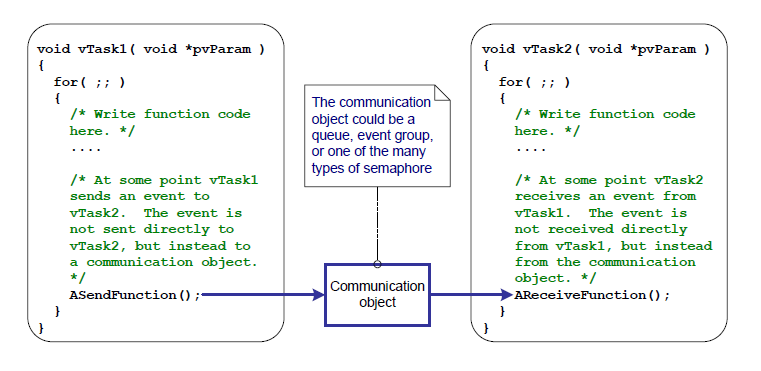

# 10 任务通知

## 10.1 简介

FreeRTOS 应用程序通常被结构化为一系列独立的任务，这些任务通过彼此通信来共同提供系统功能。任务通知是一种高效的机制，允许一个任务直接通知另一个任务。

### 10.1.1 通过中介对象进行通信

本书已经描述了任务之间通信的各种方式。到目前为止所描述的方法都需要创建一个通信对象。通信对象的示例包括队列、事件组和各种类型的信号量。

当使用通信对象时，事件和数据并不是直接发送到接收任务或接收中断服务例程（ISR），而是发送到通信对象。同样，任务和 ISR 从通信对象接收事件和数据，而不是直接从发送事件或数据的任务或 ISR 接收。这一点如图 10.1 所示。


<a name="fig10.1" title="Figure 10.1 A communication object being used to send an event from one task to another"></a>

* * *
    
***图 10.1*** *使用通信对象将事件从一个任务发送到另一个任务*
* * *

### 10.1.2 任务通知——直接任务通信

“任务通知”允许任务与其他任务交互，并与 ISR 同步，而无需单独的通信对象。通过使用任务通知，任务或 ISR 可以直接将事件发送到接收任务。这一点如图 10.2 所示。


<a name="fig10.2" title="Figure 10.2 A task notification used to send an event directly from one task to another"></a>

* * *
    
***图 10.2*** *使用任务通知直接从一个任务向另一个任务发送事件*
* * *

任务通知功能是可选的。要包含任务通知功能，请在 FreeRTOSConfig.h 中将 `configUSE_TASK_NOTIFICATIONS` 设置为 1。

当 `configUSE_TASK_NOTIFICATIONS` 设置为 1 时，每个任务至少有一个“通知状态”，可以是“Pending（待处理）”或“Not-Pending（未待处理）”，以及一个“通知值”，这是一个 32 位无符号整数。当任务接收到通知时，其通知状态被设置为待处理。当任务读取其通知值时，其通知状态被设置为未待处理。如果 `configTASK_NOTIFICATION_ARRAY_ENTRIES` 设置为大于 1 的值，则存在多个由索引标识的通知状态和值。

任务可以在阻塞状态下等待（可选择超时时间），直到其通知状态变为待处理。

### 10.1.3 范围

本章讨论：

- 任务的通知状态和通知值。
- 如何以及何时可以使用任务通知代替通信对象（如信号量）。
- 使用任务通知代替通信对象的优势。

## 10.2 任务通知；优点和局限性

### 10.2.1 任务通知的性能优势

使用任务通知向任务发送事件或数据比使用队列、信号量或事件组执行等效操作要快得多。

### 10.2.2 任务通知的RAM占用优势

同样，使用任务通知向任务发送事件或数据所需的RAM比使用队列、信号量或事件组执行等效操作要少得多。这是因为每个通信对象（队列、信号量或事件组）在使用之前必须先创建，而启用任务通知功能具有固定的开销。任务通知的RAM成本为每个任务 `configTASK_NOTIFICATION_ARRAY_ENTRIES` * 5 字节。`configTASK_NOTIFICATION_ARRAY_ENTRIES` 的默认值为 1，因此任务通知的默认大小为每个任务 5 字节。

### 10.2.3 任务通知的局限性

任务通知比通信对象更快且占用更少的RAM，但任务通知并不能在所有场景中使用。本节记录了无法使用任务通知的场景：

- 向中断服务例程（ISR）发送事件或数据

  通信对象可用于从 ISR 向任务发送事件和数据，以及从任务向 ISR 发送事件和数据。

  任务通知可用于从 ISR 向任务发送事件和数据，但无法用于从任务向 ISR 发送事件或数据。

- 支持多个接收任务

  任何知道其句柄（可能是队列句柄、信号量句柄或事件组句柄）的任务或 ISR 都可以访问通信对象。任意数量的任务和 ISR 可以处理发送到特定通信对象的事件或数据。

  任务通知直接发送到接收任务，因此只能由接收通知的任务处理。然而，这在实际应用中很少成为限制，因为尽管通常会有多个任务和 ISR 向同一个通信对象发送数据，但很少会有多个任务和 ISR 从同一个通信对象接收数据。

- 缓冲多个数据项

  队列是一种通信对象，可以同时保存多个数据项。已发送到队列但尚未从队列接收的数据会在队列对象内部缓冲。

  任务通知通过更新接收任务的通知值来向任务发送数据。任务的通知值一次只能保存一个值。

- 向多个任务广播

  事件组是一种通信对象，可以用来同时向多个任务发送事件。

  任务通知直接发送到接收任务，因此只能由接收任务处理。

- 在阻塞状态下等待发送完成

  如果通信对象暂时处于无法写入更多数据或事件的状态（例如，当队列已满时无法再向队列发送数据），那么尝试写入该对象的任务可以选择进入阻塞状态，以等待其写入操作完成。

  如果任务尝试向已有待处理通知的任务发送任务通知，则发送任务无法在阻塞状态下等待接收任务重置其通知状态。不过，将在后文中看到，这在实际使用任务通知的情况下很少成为限制。

## 10.3 使用任务通知

### 10.3.1 任务通知API选项

任务通知是一个非常强大的功能，通常可以用来替代二进制信号量、计数信号量、事件组，有时甚至可以替代队列。通过使用 `xTaskNotify()` API 函数发送任务通知以及 `xTaskNotifyWait()` API 函数接收任务通知，可以实现这种广泛的应用场景。

然而，在大多数情况下，并不需要 `xTaskNotify()` 和 `xTaskNotifyWait()` API 函数提供的全部灵活性，更简单的函数就足够了。因此，提供了 `xTaskNotifyGive()` API 函数作为 `xTaskNotify()` 的一种更简单但灵活性较低的替代方案，同时提供了 `ulTaskNotifyTake()` API 函数作为 `xTaskNotifyWait()` 的一种更简单但灵活性较低的替代方案。

任务通知系统并不局限于单一的通知事件。配置参数 `configTASK_NOTIFICATION_ARRAY_ENTRIES` 默认设置为 1。如果将其设置为大于 1 的值，则会在每个任务内部创建一个通知数组。这允许通过索引管理通知。每个任务通知 API 函数都有一个带索引的版本。使用非索引版本将访问 notification[0]（数组中的第一个）。每个 API 函数的索引版本通过后缀 `Indexed` 标识，例如函数 `xTaskNotify` 变为 `xTaskNotifyIndexed`。为了简化起见，本书中仅使用非索引版本的每个函数。

任务通知 API 是通过宏实现的，这些宏调用了每种 API 函数类型的底层“通用”版本。为简化起见，本书中将把这些 API 宏称为函数。

#### 10.3.1.1 API 函数的完整列表 <sup>27</sup>

- `xTaskNotifyGive`
- `xTaskNotifyGiveIndexed`
- `vTaskNotifyGiveFromISR`
- `vTaskNotifyGiveIndexedFromISR`
- `vTaskNotifyTake`
- `vTaskNotifyTakeIndexed`
- `xTaskNotify`
- `xTaskNotifyIndexed`
- `xTaskNotifyWait`
- `xTaskNotifyWaitIndexed`
- `xTaskNotifyStateClear`
- `xTaskNotifyStateClearIndexed`
- `ulTaskNotifyValueClear`
- `ulTaskNotifyValueClearIndexed`
- `xTaskNotifyAndQueryIndexedFromISR`
- `xTaskNotifyAndQueryFromISR`
- `xTaskNotifyFromISR`
- `xTaskNotifyIndexedFromISR`
- `xTaskNotifyAndQuery`
- `xTaskNotifyAndQueryIndexed`

*(27): 这些函数实际上是通过宏实现的。*

> 注意：接收通知的 `FromISR` 函数并不存在，因为通知总是发送到任务，而中断不与任何任务关联。

### 10.3.2 xTaskNotifyGive() API 函数

`xTaskNotifyGive()` 直接向任务发送通知，并递增（加一）接收任务的通知值。调用 `xTaskNotifyGive()` 将使接收任务的通知状态变为待处理（如果尚未处于待处理状态）。

提供 `xTaskNotifyGive()` API 函数是为了让任务通知可以用作一种更轻量且更快的替代方案，以替代二进制或计数信号量。


<a name="list10.1" title="清单 10.1 xTaskNotifyGive() API 函数原型"></a>


```c
BaseType_t xTaskNotifyGive( TaskHandle_t xTaskToNotify );
BaseType_t xTaskNotifyGiveIndexed( TaskHandle_t xTaskToNotify, UBaseType_t uxIndexToNotify );
```

***清单 10.1*** *xTaskNotifyGive() API 函数原型*

**xTaskNotifyGive()/xTaskNotifyGiveIndexed() 参数和返回值**

- `xTaskToNotify`

  要发送通知的任务句柄——有关获取任务句柄的信息，请参阅 `xTaskCreate()` API 函数的 `pxCreatedTask` 参数。

- `uxIndexToNotify`

  数组的索引

- 返回值

  `xTaskNotifyGive()` 是一个调用 `xTaskNotify()` 的宏。宏传递给 `xTaskNotify()` 的参数设置为使得 `pdPASS` 是唯一的可能返回值。`xTaskNotify()` 将在本书后面的章节中进行描述。

### 10.3.3 vTaskNotifyGiveFromISR() API 函数

`vTaskNotifyGiveFromISR()` 是 `xTaskNotifyGive()` 的一个版本，可以在中断服务例程中使用。


<a name="list10.2" title="清单 10.2 vTaskNotifyGiveFromISR() API 函数原型"></a>


```c
void vTaskNotifyGiveFromISR( TaskHandle_t xTaskToNotify,
                             BaseType_t *pxHigherPriorityTaskWoken );
```

***清单 10.2*** *vTaskNotifyGiveFromISR() API 函数原型*

**vTaskNotifyGiveFromISR() 参数和返回值**

- `xTaskToNotify`

  要发送通知的任务句柄——有关获取任务句柄的信息，请参阅 `xTaskCreate()` API 函数的 `pxCreatedTask` 参数。

- `pxHigherPriorityTaskWoken`

  如果接收通知的任务正在阻塞状态（Blocked state）中等待接收通知，那么发送通知将导致该任务离开阻塞状态。

  如果调用 `vTaskNotifyGiveFromISR()` 导致某个任务离开阻塞状态，并且该解除阻塞的任务优先级高于当前正在执行的任务（即被中断的任务），那么在内部，`vTaskNotifyGiveFromISR()` 将把 `*pxHigherPriorityTaskWoken` 设置为 `pdTRUE`。

  如果 `vTaskNotifyGiveFromISR()` 将此值设置为 `pdTRUE`，则应在退出中断之前执行上下文切换。这将确保中断直接返回到最高优先级的就绪状态任务。

  与所有中断安全的 API 函数一样，在使用 `pxHigherPriorityTaskWoken` 参数之前，必须将其设置为 `pdFALSE`。

### 10.3.4 ulTaskNotifyTake() API 函数

`ulTaskNotifyTake()` 允许任务在阻塞状态下等待其通知值大于零，并在返回之前递减（减一）或清除任务的通知值。

提供 `ulTaskNotifyTake()` API 函数是为了让任务通知可以用作一种更轻量且更快的替代方案，以替代二进制或计数信号量。


<a name="list10.3" title="清单 10.3 ulTaskNotifyTake() API 函数原型"></a>


```c
uint32_t ulTaskNotifyTake( BaseType_t xClearCountOnExit, TickType_t
xTicksToWait );
```

***清单 10.3*** *ulTaskNotifyTake() API 函数原型*

**ulTaskNotifyTake() 参数和返回值**

- `xClearCountOnExit`

  如果 `xClearCountOnExit` 设置为 `pdTRUE`，则调用任务的通知值将在 `ulTaskNotifyTake()` 返回之前被清零。

  如果 `xClearCountOnExit` 设置为 `pdFALSE`，并且调用任务的通知值大于零，则调用任务的通知值将在 `ulTaskNotifyTake()` 返回之前递减。

- `xTicksToWait`

  调用任务在阻塞状态下等待其通知值大于零的最长时间。

  阻塞时间以时钟周期为单位指定，因此它所代表的绝对时间取决于时钟频率。可以使用宏 `pdMS_TO_TICKS()` 将以毫秒为单位的时间转换为以时钟周期为单位的时间。

将 `xTicksToWait` 设置为 `portMAX_DELAY` 将导致任务无限期等待（不会超时），前提是已在 `FreeRTOSConfig.h` 中将 `INCLUDE_vTaskSuspend` 设置为 1。

- 返回值

  返回的值是调用任务的通知值在被清零或递减*之前*的值，具体行为由 `xClearCountOnExit` 参数的值决定。

  如果指定了阻塞时间（`xTicksToWait` 不为零），并且返回值不为零，则可能调用任务被置于阻塞状态以等待其通知值大于零，并且其通知值在阻塞时间到期之前已更新。

  如果指定了阻塞时间（`xTicksToWait` 不为零），并且返回值为零，则调用任务被置于阻塞状态以等待其通知值大于零，但指定的阻塞时间在该情况发生之前已过期。


<a name="example10.1" title="示例 10.1 使用任务通知替代信号量，方法 1"></a>
---
***示例 10.1*** *使用任务通知替代信号量，方法 1*

---

示例 7.1 使用二进制信号量从中断服务例程中解除任务阻塞——有效地将任务与中断同步。本示例复制了示例 7.1 的功能，但使用直接到任务的通知替代了二进制信号量。

清单 10.4 显示了与中断同步的任务的实现。在示例 7.1 中使用的 `xSemaphoreTake()` 调用已被替换为对 `ulTaskNotifyTake()` 的调用。

`ulTaskNotifyTake()` 的 `xClearCountOnExit` 参数设置为 `pdTRUE`，这会导致接收任务的通知值在 `ulTaskNotifyTake()` 返回之前被清零。因此，有必要在每次调用 `ulTaskNotifyTake()` 之间处理所有可用的事件。在示例 7.1 中，由于使用了二进制信号量，必须从硬件中确定待处理事件的数量，这并不总是实用的。在示例 10.1 中，待处理事件的数量由 `ulTaskNotifyTake()` 返回。

在两次调用 `ulTaskNotifyTake` 之间发生的中断事件会被锁存在任务的通知值中，如果调用任务已经有挂起的通知，则对 `ulTaskNotifyTake()` 的调用将立即返回。


<a name="list10.4" title="清单 10.4 实现将中断处理延迟到的任务（即与中断同步的任务）"></a>


```c
/* 周期性任务生成软件中断的频率。 */
const TickType_t xInterruptFrequency = pdMS_TO_TICKS( 500UL );

static void vHandlerTask( void *pvParameters )
{
    /* xMaxExpectedBlockTime 设置为比事件之间的最大预期时间稍长一些。 */
    const TickType_t xMaxExpectedBlockTime = xInterruptFrequency +
                                             pdMS_TO_TICKS( 10 );
    uint32_t ulEventsToProcess;

    /* 与大多数任务一样，此任务实现在一个无限循环中。 */
    for( ;; )
    {
        /* 等待直接从中断服务例程发送到此任务的通知。 */
        ulEventsToProcess = ulTaskNotifyTake( pdTRUE, xMaxExpectedBlockTime );
        if( ulEventsToProcess != 0 )
        {
            /* 要到达此处，至少有一个事件必须已经发生。在此处循环，直到所有挂起的事件都被处理完毕（在本例中，只需为每个事件打印一条消息）。 */
            while( ulEventsToProcess > 0 )
            {
                vPrintString( "处理任务 - 正在处理事件。\r\n" );
                ulEventsToProcess--;
            }
        }
        else
        {
            /* 如果执行到函数的这一部分，则表示在预期时间内未收到中断，并且（在实际应用中）可能需要执行一些错误恢复操作。 */
        }
    }
}
```

***清单 10.4*** *示例 10.1 中将中断处理延迟到的任务（即与中断同步的任务）的实现*

用于生成软件中断的周期性任务在生成中断之前和之后都会打印一条消息。这允许通过输出观察执行顺序。

清单 10.5 显示了中断处理程序。除了直接向延迟中断处理的任务发送通知外，它几乎不做其他任何事情。


<a name="list10.5" title="清单 10.5 示例 10.1 中使用的中断服务例程的实现"></a>


```c
static uint32_t ulExampleInterruptHandler( void )
{
    BaseType_t xHigherPriorityTaskWoken;

    /* xHigherPriorityTaskWoken 参数必须初始化为 pdFALSE，
       因为如果需要上下文切换，它将在中断安全 API 函数内部被设置为 pdTRUE。 */
    xHigherPriorityTaskWoken = pdFALSE;

    /* 直接向延迟中断处理的任务发送通知。 */
    vTaskNotifyGiveFromISR( /* 要发送通知的任务的句柄。
                               任务创建时保存的句柄。 */
                            xHandlerTask,

                            /* xHigherPriorityTaskWoken 以常规方式使用。 */
                            &xHigherPriorityTaskWoken );

    /* 将 xHigherPriorityTaskWoken 值传递给 portYIELD_FROM_ISR()。
       如果在 vTaskNotifyGiveFromISR() 内部将 xHigherPriorityTaskWoken 设置为 pdTRUE，
       那么调用 portYIELD_FROM_ISR() 将请求上下文切换。
       如果 xHigherPriorityTaskWoken 仍为 pdFALSE，则调用 portYIELD_FROM_ISR() 不会有任何效果。
       Windows 端口使用的 portYIELD_FROM_ISR() 实现包含一个返回语句，
       这就是为什么此函数没有显式返回值的原因。 */
    portYIELD_FROM_ISR( xHigherPriorityTaskWoken );
}
```

***清单 10.5*** *示例 10.1 中使用的中断服务例程的实现*

执行示例 10.1 时生成的输出如图 10.3 所示。  
正如预期的那样，它与执行示例 7.1 时生成的输出相同。`vHandlerTask()` 在中断生成后立即进入运行状态，因此任务的输出将周期性任务生成的输出分隔开。更多解释见图 10.4。


<a name="fig10.3" title="图 10.3 执行示例 7.1 时生成的输出"></a>
<a name="fig10.4" title="图 10.4 执行示例 10.1 时的执行顺序"></a>

* * *
    
***图 10.3*** *执行示例 7.1 时生成的输出*

    
***图 10.4*** *执行示例 10.1 时的执行顺序*
* * *

<a name="example10.2" title="示例 10.2 使用任务通知替代信号量，方法 2"></a>
---
***示例 10.2*** *使用任务通知替代信号量，方法 2*

---

在示例 10.1 中，`ulTaskNotifyTake()` 的 `xClearOnExit` 参数被设置为 `pdTRUE`。  
示例 10.2 对示例 10.1 进行了略微修改，以展示当 `ulTaskNotifyTake()` 的 `xClearOnExit` 参数改为 `pdFALSE` 时的行为。

当 `xClearOnExit` 为 `pdFALSE` 时，调用 `ulTaskNotifyTake()` 将仅减少（减一）调用任务的通知值，而不是将其清零。因此，通知计数是已发生事件数量与已处理事件数量之间的差值。这使得 `vHandlerTask()` 的结构可以简化为以下两种方式：

1. 等待处理的事件数量存储在通知值中，因此不需要使用局部变量来保存。

2. 每次调用 `ulTaskNotifyTake()` 之间只需处理一个事件即可。

示例 10.2 中使用的 `vHandlerTask()` 实现如清单 10.6 所示。


<a name="list10.6" title="清单 10.6 示例 10.2 中延迟中断处理的任务实现（与中断同步的任务..."></a>


```c
static void vHandlerTask( void *pvParameters )
{
    /* xMaxExpectedBlockTime 设置为略长于事件之间最大预期时间。 */
    const TickType_t xMaxExpectedBlockTime = xInterruptFrequency + 
                                             pdMS_TO_TICKS( 10 );

    /* 与大多数任务一样，此任务在一个无限循环中实现。 */
    for( ;; )
    {
        /* 等待从中断服务例程直接发送到此任务的通知。
           xClearCountOnExit 参数现在为 pdFALSE，
           因此任务的通知值将由 ulTaskNotifyTake() 减少，而不是清零。 */
        if( ulTaskNotifyTake( pdFALSE, xMaxExpectedBlockTime ) != 0 )
        {
            /* 如果执行到这里，说明事件已发生。处理事件（在此仅打印一条消息）。 */
            vPrintString( "处理任务 - 正在处理事件。\r\n" );
        }
        else
        {
            /* 如果执行到此部分，则说明在预期时间内未收到中断，
               并且（在实际应用中）可能需要执行一些错误恢复操作。 */
        }
    }
}
```

***清单 10.6*** *示例 10.2 中延迟中断处理的任务实现（与中断同步的任务）*

为了演示目的，中断服务例程也被修改为每次中断发送多个任务通知，从而模拟高频发生的多次中断。  
示例 10.2 中使用的中断服务例程实现如清单 10.7 所示。


<a name="list10.7" title="清单 10.7 示例 10.2 中使用的中断服务例程的实现"></a>


```c
static uint32_t ulExampleInterruptHandler( void )
{
    BaseType_t xHigherPriorityTaskWoken;

    xHigherPriorityTaskWoken = pdFALSE;

    /* 多次向处理任务发送通知。第一次“给予”将解除任务阻塞，
       后续的“给予”用于演示接收任务的通知值被用来计数（锁存）事件，
       从而允许任务依次处理每个事件。 */
    vTaskNotifyGiveFromISR( xHandlerTask, &xHigherPriorityTaskWoken );
    vTaskNotifyGiveFromISR( xHandlerTask, &xHigherPriorityTaskWoken );
    vTaskNotifyGiveFromISR( xHandlerTask, &xHigherPriorityTaskWoken );

    portYIELD_FROM_ISR( xHigherPriorityTaskWoken );
}
```

***清单 10.7*** *示例 10.2 中使用的中断服务例程的实现*

执行示例 10.2 时生成的输出如图 10.5 所示。  
可以看出，每次生成中断时，`vHandlerTask()` 都会处理所有三个事件。

<a name="fig10.5" title="图 10.5 执行示例 10.2 时生成的输出"></a>

* * *
    
***图 10.5*** *执行示例 10.2 时生成的输出*
* * *


### 10.3.5 xTaskNotify() 和 xTaskNotifyFromISR() API 函数

`xTaskNotify()` 是 `xTaskNotifyGive()` 的增强版本，可以以下列方式之一更新接收任务的通知值：

- 增加（加一）接收任务的通知值，在这种情况下，`xTaskNotify()` 等同于 `xTaskNotifyGive()`。

- 在接收任务的通知值中设置一个或多个位。这使得任务的通知值可以用作事件组的更轻量、更快的替代方案。

- 向接收任务的通知值写入一个全新的数字，但前提是接收任务自上次更新以来已读取了其通知值。这使得任务的通知值可以提供类似于长度为 1 的队列功能。

- 向接收任务的通知值写入一个全新的数字，即使接收任务自上次更新以来尚未读取其通知值。这使得任务的通知值可以提供类似于 `xQueueOverwrite()` API 函数的功能。由此产生的行为有时被称为“邮箱”。

`xTaskNotify()` 比 `xTaskNotifyGive()` 更灵活和强大，但由于这种额外的灵活性和能力，使用起来也稍微复杂一些。

`xTaskNotifyFromISR()` 是 `xTaskNotify()` 的一个版本，可以在中断服务例程中使用，因此它有一个额外的 `pxHigherPriorityTaskWoken` 参数。

调用 `xTaskNotify()` 将始终将接收任务的通知状态设置为“待处理”，如果它尚未处于“待处理”状态的话。


<a name="list10.8" title="清单 10.8 xTaskNotify() 和 xTaskNotifyFromISR() API 函数的原型"></a>


```c
BaseType_t xTaskNotify( TaskHandle_t xTaskToNotify,
                        uint32_t ulValue,
                        eNotifyAction eAction );

BaseType_t xTaskNotifyFromISR( TaskHandle_t xTaskToNotify,
                               uint32_t ulValue,
                               eNotifyAction eAction,
                               BaseType_t *pxHigherPriorityTaskWoken );
```

***清单 10.8*** *xTaskNotify() 和 xTaskNotifyFromISR() API 函数的原型*

**xTaskNotify() 参数和返回值**

- `xTaskToNotify`

  正在发送通知的任务句柄——有关获取任务句柄的信息，请参见 `xTaskCreate()` API 函数的 `pxCreatedTask` 参数。

- `ulValue`

  `ulValue` 的使用方式取决于 `eNotifyAction` 值。详见下文。

- `eNotifyAction`

  一种枚举类型，用于指定如何更新接收任务的通知值。详见下文。

- 返回值

  除了下面提到的一种情况外，`xTaskNotify()` 将返回 `pdPASS`。

**有效的 xTaskNotify() eNotifyAction 参数值及其对接收任务通知值的影响**

- `eNoAction`

  接收任务的通知状态被设置为“待处理”，但其通知值未被更新。`xTaskNotify()` 的 `ulValue` 参数未使用。

  `eNoAction` 动作允许任务通知作为二进制信号量的更快、更轻量的替代方案。

- `eSetBits`

  接收任务的通知值将与 `xTaskNotify()` 的 `ulValue` 参数按位 OR 运算。例如，如果 `ulValue` 设置为 0x01，则接收任务的通知值的第 0 位将被设置。再如，如果 `ulValue` 为 0x06（二进制 0110），则接收任务的通知值的第 1 位和第 2 位将被设置。

  `eSetBits` 动作允许任务通知作为事件组的更快、更轻量的替代方案。

- `eIncrement`

  接收任务的通知值递增。`xTaskNotify()` 的 `ulValue` 参数未使用。

  `eIncrement` 动作允许任务通知作为二进制或计数信号量的更快、更轻量的替代方案，并且等同于更简单的 `xTaskNotifyGive()` API 函数。

- `eSetValueWithoutOverwrite`

  如果在调用 `xTaskNotify()` 之前接收任务已有待处理的通知，则不采取任何操作，并且 `xTaskNotify()` 将返回 `pdFAIL`。

  如果在调用 `xTaskNotify()` 之前接收任务没有待处理的通知，则接收任务的通知值将设置为 `xTaskNotify()` 的 `ulValue` 参数传递的值。

- `eSetValueWithOverwrite`

  接收任务的通知值将设置为 `xTaskNotify()` 的 `ulValue` 参数传递的值，无论在调用 `xTaskNotify()` 之前接收任务是否有待处理的通知。

### 10.3.6 xTaskNotifyWait() API 函数

`xTaskNotifyWait()` 是 `ulTaskNotifyTake()` 的增强版本。它允许任务在可选的超时时间内等待，直到调用任务的通知状态变为“待处理”（如果尚未处于“待处理”状态）。`xTaskNotifyWait()` 提供了在进入函数和退出函数时清除调用任务通知值中某些位的选项。


<a name="list10.9" title="清单 10.9 xTaskNotifyWait() API 函数原型"></a>


```c
BaseType_t xTaskNotifyWait( uint32_t   ulBitsToClearOnEntry,
                            uint32_t   ulBitsToClearOnExit,
                            uint32_t   *pulNotificationValue,
                            TickType_t xTicksToWait );
```

***清单 10.9*** *xTaskNotifyWait() API 函数原型*

**xTaskNotifyWait() 参数和返回值**

- `ulBitsToClearOnEntry`

  如果调用任务在调用 `xTaskNotifyWait()` 之前没有待处理的通知，则 `ulBitsToClearOnEntry` 中设置的所有位将在进入函数时被清除。

  例如，如果 `ulBitsToClearOnEntry` 为 0x01，则任务通知值的第 0 位将被清除。再如，将 `ulBitsToClearOnEntry` 设置为 0xffffffff（`ULONG_MAX`）将清除任务通知值中的所有位，实际上将其值清零。

- `ulBitsToClearOnExit`

  如果调用任务因为接收到通知或调用 `xTaskNotifyWait()` 时已有待处理的通知而退出 `xTaskNotifyWait()`，则 `ulBitsToClearOnExit` 中设置的所有位将在任务退出 `xTaskNotifyWait()` 函数之前被清除。

  这些位会在任务通知值保存到 `*pulNotificationValue` 之后被清除（有关 `pulNotificationValue` 的描述见下文）。

  例如，如果 `ulBitsToClearOnExit` 为 0x03，则任务通知值的第 0 位和第 1 位将在函数退出前被清除。

  将 `ulBitsToClearOnExit` 设置为 0xffffffff（`ULONG_MAX`）将清除任务通知值中的所有位，实际上将其值清零。

- `pulNotificationValue`

  用于传出任务的通知值。复制到 `*pulNotificationValue` 的值是任务通知值在因 `ulBitsToClearOnExit` 设置清除任何位之前的状态。

  `pulNotificationValue` 是一个可选参数，如果不需要，可以将其设置为 NULL。

- `xTicksToWait`

  调用任务应保持在阻塞状态以等待其通知状态变为“待处理”的最长时间。

  阻塞时间以 tick 周期为单位指定，因此其所表示的绝对时间取决于 tick 频率。宏 `pdMS_TO_TICKS()` 可用于将以毫秒为单位的时间转换为以 tick 为单位的时间。

  如果将 `xTicksToWait` 设置为 `portMAX_DELAY`，则任务将无限期等待（不会超时），前提是已在 `FreeRTOSConfig.h` 中将 `INCLUDE_vTaskSuspend` 设置为 1。

- 返回值

  有两种可能的返回值：

  - `pdTRUE`

    这表示 `xTaskNotifyWait()` 返回是因为接收到通知，或者因为调用任务在调用 `xTaskNotifyWait()` 时已经有待处理的通知。

    如果指定了阻塞时间（`xTicksToWait` 不为零），则调用任务可能被置于阻塞状态以等待其通知状态变为“待处理”，但在阻塞时间到期之前其通知状态已被设置为“待处理”。

  - `pdFALSE`

    这表示 `xTaskNotifyWait()` 返回时调用任务未接收到任务通知。

    如果 `xTicksToWait` 不为零，则调用任务将被置于阻塞状态以等待其通知状态变为“待处理”，但在发生这种情况之前指定的阻塞时间已到期。

### 10.3.7 在外设设备驱动程序中使用任务通知：UART 示例

外设驱动程序库提供了在硬件接口上执行常见操作的函数。通常提供此类库的外设示例包括通用异步收发器（Universal Asynchronous Receivers and Transmitters，UART）、串行外设接口（Serial Peripheral Interface，SPI）端口、模数转换器（Analog to Digital Converters，ADC）和以太网端口。这类库通常提供的函数示例包括初始化外设、向外设发送数据以及从外设接收数据的函数。

某些外设操作需要相对较长的时间才能完成。例如，高精度 ADC 转换或通过 UART 发送大数据包的操作。在这种情况下，驱动程序库函数可以通过轮询（反复读取）外设的状态寄存器来判断操作是否完成。然而，这种方式几乎总是浪费处理器时间，因为在没有任何生产性处理的情况下占用了 100% 的处理器时间。这种浪费在多任务系统中尤为显著，因为正在轮询外设的任务可能会阻止优先级较低但有生产性处理任务的任务运行。

为了避免浪费处理时间，一个高效的 RTOS 感知设备驱动程序应该是中断驱动的，并为启动长时间操作的任务提供进入阻塞状态等待操作完成的选项。这样，在执行长时间操作的任务处于阻塞状态时，低优先级任务可以运行，只有当任务能够高效利用处理器时间时才会占用它。

RTOS 感知驱动程序库通常使用二进制信号量将任务置于阻塞状态。这种技术由清单 10.10 中的伪代码演示，该代码展示了一个在 UART 端口上传输数据的 RTOS 感知库函数的框架。在清单 10.10 中：

- `xUART` 是一个描述 UART 外设并保存状态信息的结构体。结构体中的 `xTxSemaphore` 成员是一个类型为 `SemaphoreHandle_t` 的变量。假定信号量已经创建。

- `xUART_Send()` 函数不包含任何互斥逻辑。如果多个任务将使用 `xUART_Send()` 函数，则应用程序开发者需要在应用程序中自行管理互斥。例如，任务可能需要在调用 `xUART_Send()` 之前获取一个互斥锁。

- `xSemaphoreTake()` API 函数用于在启动 UART 传输后将调用任务置于阻塞状态。

- `xSemaphoreGiveFromISR()` API 函数用于在传输完成后将任务移出阻塞状态，这发生在 UART 外设的发送结束中断服务例程执行时。

<a name="list10.10" title="清单 10.10 展示如何在驱动程序库的发送函数中使用二进制信号量的伪代码..."></a>


```c
/* 驱动程序库函数，用于向 UART 发送数据。 */

BaseType_t xUART_Send( xUART *pxUARTInstance, 
                       uint8_t *pucDataSource, 
                       size_t uxLength )
{
    BaseType_t xReturn;

    /* 确保 UART 的发送信号量尚未可用，尝试获取信号量而不设置超时时间。 */
    xSemaphoreTake( pxUARTInstance->xTxSemaphore, 0 );

    /* 启动传输。 */
    UART_low_level_send( pxUARTInstance, pucDataSource, uxLength );

    /* 在信号量上阻塞以等待传输完成。如果成功获取信号量，则 xReturn 将被设置为 pdPASS。
       如果信号量获取操作超时，则 xReturn 将被设置为 pdFAIL。
       请注意，如果中断发生在调用 UART_low_level_send() 和 xSemaphoreTake() 之间，
       则事件将被记录在二进制信号量中，并且对 xSemaphoreTake() 的调用将立即返回。 */
    xReturn = xSemaphoreTake( pxUARTInstance->xTxSemaphore, 
                              pxUARTInstance->xTxTimeout );

    return xReturn;
}
/*-----------------------------------------------------------*/

/* UART 的发送结束中断服务例程，在最后一个字节被发送到 UART 后执行。 */
void xUART_TransmitEndISR( xUART *pxUARTInstance )
{
    BaseType_t xHigherPriorityTaskWoken = pdFALSE;

    /* 清除中断。 */
    UART_low_level_interrupt_clear( pxUARTInstance );

    /* 释放 Tx 信号量以标志传输结束。如果有任务因等待该信号量而处于阻塞状态，
       则该任务将从阻塞状态中移除。 */
    xSemaphoreGiveFromISR( pxUARTInstance->xTxSemaphore, 
                           &xHigherPriorityTaskWoken );
    portYIELD_FROM_ISR( xHigherPriorityTaskWoken );
}
```

***清单 10.10*** *展示如何在驱动程序库的发送函数中使用二进制信号量的伪代码*

清单 10.10 中展示的技术是完全可行的，并且确实是一种常见做法，但它存在一些缺点：

- 库使用了多个信号量，这增加了其 RAM 占用。

- 信号量在创建之前无法使用，因此使用信号量的库在显式初始化之前无法使用。

- 信号量是通用对象，适用于多种用例；它们包括允许任意数量的任务在阻塞状态下等待信号量变为可用的逻辑，
  并以确定性方式选择在信号量可用时将哪个任务从阻塞状态中移除。执行这些逻辑需要一定的时间，
  而这种处理开销在清单 10.10 所示的场景中是不必要的，因为在任何给定时间不可能有超过一个任务在等待信号量。

清单 10.11 展示了如何通过使用任务通知代替二进制信号量来避免这些缺点。

> *注意：如果库使用任务通知，则库的文档必须明确说明调用库函数可能会更改调用任务的通知状态和通知值。*

在清单 10.11 中：

- `xUART` 结构中的 `xTxSemaphore` 成员已被 `xTaskToNotify` 成员取代。
  `xTaskToNotify` 是一个类型为 `TaskHandle_t` 的变量，用于保存等待 UART 操作完成的任务句柄。

- 使用 FreeRTOS API 函数 `xTaskGetCurrentTaskHandle()` 获取处于运行状态的任务句柄。

- 该库不创建任何 FreeRTOS 对象，因此不会产生 RAM 开销，也不需要显式初始化。

- 任务通知直接发送到等待 UART 操作完成的任务，因此不会执行不必要的逻辑。

`xUART` 结构中的 `xTaskToNotify` 成员同时被任务和中断服务例程访问，
因此需要考虑处理器如何更新其值：

- 如果 `xTaskToNotify` 通过单次内存写操作进行更新，则可以在临界区之外进行更新，
  如清单 10.11 所示。如果 `xTaskToNotify` 是一个 32 位变量（`TaskHandle_t` 是 32 位类型），
  并且运行 FreeRTOS 的处理器是 32 位处理器，则属于这种情况。

- 如果需要多次内存写操作才能更新 `xTaskToNotify`，则 `xTaskToNotify` 必须仅在临界区内更新——
  否则中断服务例程可能在 `xTaskToNotify` 处于不一致状态时访问它。
  如果 `xTaskToNotify` 是一个 32 位变量，并且运行 FreeRTOS 的处理器是 16 位处理器，
  则需要两次 16 位内存写操作才能更新所有 32 位，属于这种情况。

在 FreeRTOS 实现内部，`TaskHandle_t` 是一个指针，因此 `sizeof( TaskHandle_t )`
始终等于 `sizeof( void * )`。


<a name="list10.11" title="清单 10.11 展示如何在驱动程序库的发送函数中使用任务通知的伪代码..."></a>


```c
/* 驱动程序库函数，用于向 UART 发送数据。 */
BaseType_t xUART_Send( xUART *pxUARTInstance, 
                       uint8_t *pucDataSource, 
                       size_t uxLength )
{
    BaseType_t xReturn;

    /* 保存调用此函数的任务的句柄。书籍文本中包含关于以下行是否需要受临界区保护的注释。 */
    pxUARTInstance->xTaskToNotify = xTaskGetCurrentTaskHandle();

    /* 确保调用任务没有未处理的通知，通过调用 ulTaskNotifyTake() 并将 xClearCountOnExit 参数设置为
       pdTRUE，阻塞时间为 0（不阻塞）。 */
    ulTaskNotifyTake( pdTRUE, 0 );

    /* 启动传输。 */
    UART_low_level_send( pxUARTInstance, pucDataSource, uxLength );

    /* 阻塞直到收到传输完成的通知。如果收到通知，则 xReturn 将被设置为 1，因为 ISR 
       将此任务的通知值递增为 1 (pdTRUE)。如果操作超时，则 xReturn 将为 0 (pdFALSE)，因为此任务的通知值
       自上次清零为 0 后未发生改变。请注意，如果 ISR 在调用 UART_low_level_send()
       和 ulTaskNotifyTake() 之间执行，则事件将记录在此任务的通知值中，对 ulTaskNotifyTake()
       的调用将立即返回。 */
    xReturn = ( BaseType_t ) ulTaskNotifyTake( pdTRUE, 
                                               pxUARTInstance->xTxTimeout );

    return xReturn;
}
/*-----------------------------------------------------------*/

/* 在最后一个字节发送到 UART 后执行的 ISR。 */
void xUART_TransmitEndISR( xUART *pxUARTInstance )
{
    BaseType_t xHigherPriorityTaskWoken = pdFALSE;

    /* 只有在有任务等待被通知时才应执行此函数。通过断言测试此条件。
       此步骤并非严格必要，但有助于调试。configASSERT() 在第 12.2 节中描述。 */
    configASSERT( pxUARTInstance->xTaskToNotify != NULL );

    /* 清除中断。 */
    UART_low_level_interrupt_clear( pxUARTInstance );

    /* 直接向调用 xUART_Send() 的任务发送通知。如果任务因等待通知而处于阻塞状态，
       则任务将从阻塞状态移除。 */
    vTaskNotifyGiveFromISR( pxUARTInstance->xTaskToNotify,
                            &xHigherPriorityTaskWoken );

    /* 现在没有任务等待被通知。将 xUART 结构的 xTaskToNotify 成员重置为 NULL。
       此步骤并非严格必要，但有助于调试。 */
    pxUARTInstance->xTaskToNotify = NULL;
    portYIELD_FROM_ISR( xHigherPriorityTaskWoken );
}
```

***清单 10.11*** *展示如何在驱动程序库的发送函数中使用任务通知的伪代码*

任务通知还可以替代接收函数中的信号量，如伪代码清单 10.12 所示，该代码提供了在 UART 端口上接收数据的 RTOS 感知库函数的概要。
参考清单 10.12：

- `xUART_Receive()` 函数不包含任何互斥逻辑。如果有多个任务将使用 `xUART_Receive()` 函数，
  则应用程序编写者需要在应用程序本身中管理互斥。例如，可能要求任务在调用 `xUART_Receive()` 之前获取一个互斥锁。

- UART 的接收中断服务例程将 UART 接收到的字符放入 RAM 缓冲区。
  `xUART_Receive()` 函数从 RAM 缓冲区返回字符。

- `xUART_Receive()` 的 `uxWantedBytes` 参数用于指定要接收的字符数。
  如果 RAM 缓冲区尚未包含请求的字符数，则调用任务将被置于阻塞状态，
  等待通知缓冲区中的字符数量已增加。使用 `while()` 循环重复此过程，
  直到接收缓冲区包含请求的字符数或发生超时。

- 调用任务可能会多次进入阻塞状态。因此，阻塞时间会进行调整，以考虑自调用
  `xUART_Receive()` 以来已经过的时间。这些调整确保在 `xUART_Receive()` 中花费的总时间不会超过
  `xUART` 结构的 `xRxTimeout` 成员指定的阻塞时间。阻塞时间通过 FreeRTOS 的
  `vTaskSetTimeOutState()` 和 `xTaskCheckForTimeOut()` 辅助函数进行调整。


<a name="list10.12" title="清单 10.12 展示如何在驱动程序库的接收函数中使用任务通知的伪代码..."></a>


```c
/* 驱动程序库函数，用于从 UART 接收数据。 */

size_t xUART_Receive( xUART *pxUARTInstance, 
                      uint8_t *pucBuffer,
                      size_t uxWantedBytes )
{
    size_t uxReceived = 0;
    TickType_t xTicksToWait;
    TimeOut_t xTimeOut;

    /* 记录进入此函数的时间。 */
    vTaskSetTimeOutState( &xTimeOut );

    /* xTicksToWait 是超时值——初始设置为此 UART 实例的最大接收超时值。 */
    xTicksToWait = pxUARTInstance->xRxTimeout;

    /* 保存调用此函数的任务句柄。书籍文本中包含关于以下行是否需要受临界区保护的注释。 */
    pxUARTInstance->xTaskToNotify = xTaskGetCurrentTaskHandle();

    /* 循环直到缓冲区包含所需的字节数，或发生超时。 */
    while( UART_bytes_in_rx_buffer( pxUARTInstance ) < uxWantedBytes )
    {
        /* 检查是否超时，并调整 xTicksToWait 以考虑在此函数中已花费的时间。 */
        if( xTaskCheckForTimeOut( &xTimeOut, &xTicksToWait ) != pdFALSE )
        {
            /* 在所需字节数可用之前超时，退出循环。 */
            break;
        }

        /* 接收缓冲区尚未包含所需数量的字节。等待最多 xTicksToWait 滴答时间，
           等待接收中断服务例程通知已将更多数据放入缓冲区。
           如果调用任务在调用此函数时已经有未处理的通知，也不影响，它只是会在
           此 while 循环中多迭代一次。 */
        ulTaskNotifyTake( pdTRUE, xTicksToWait );
    }

    /* 没有任务等待接收通知，因此将 xTaskToNotify 重置为 NULL。
       书籍文本中包含关于以下行是否需要受临界区保护的注释。 */
    pxUARTInstance->xTaskToNotify = NULL;

    /* 尝试从接收缓冲区读取 uxWantedBytes 到 pucBuffer。
       返回实际读取的字节数（可能少于 uxWantedBytes）。 */
    uxReceived = UART_read_from_receive_buffer( pxUARTInstance, 
                                                pucBuffer,
                                                uxWantedBytes );
    return uxReceived;
}

/*-----------------------------------------------------------*/

/* UART 接收中断的中断服务例程 */
void xUART_ReceiveISR( xUART *pxUARTInstance )
{
    BaseType_t xHigherPriorityTaskWoken = pdFALSE;

    /* 将接收到的数据复制到此 UART 的接收缓冲区并清除中断。 */
    UART_low_level_receive( pxUARTInstance );

    /* 如果有任务正在等待新数据的通知，则立即通知它。 */
    if( pxUARTInstance->xTaskToNotify != NULL )
    {
        vTaskNotifyGiveFromISR( pxUARTInstance->xTaskToNotify,
                                &xHigherPriorityTaskWoken );
        portYIELD_FROM_ISR( xHigherPriorityTaskWoken );
    }
}
```

***清单 10.12*** *展示如何在驱动程序库的接收函数中使用任务通知的伪代码*


### 10.3.8 外设设备驱动程序中使用任务通知：ADC 示例

上一节演示了如何使用 `vTaskNotifyGiveFromISR()` 从中断向任务发送任务通知。
`vTaskNotifyGiveFromISR()` 是一个易于使用的函数，但其功能有限；它只能将任务通知作为无值事件发送，无法传递数据。
本节演示如何使用 `xTaskNotifyFromISR()` 在任务通知事件中传递数据。
该技术通过清单 10.13 中的伪代码进行展示，该代码提供了模拟到数字转换器（Analog to Digital Converter，ADC）
的 RTOS 感知中断服务例程的框架。在清单 10.13 中：

- 假设 ADC 转换至少每 50 毫秒启动一次。

- `ADC_ConversionEndISR()` 是 ADC 转换结束中断的中断服务例程，
  它会在每次有新的 ADC 值可用时执行。

- `vADCTask()` 实现的任务会处理由 ADC 生成的每个值。假设任务句柄在创建任务时已存储在 `xADCTaskToNotify` 中。

- `ADC_ConversionEndISR()` 使用 `xTaskNotifyFromISR()` 并将 `eAction` 参数设置为
  `eSetValueWithoutOverwrite`，以向 `vADCTask()` 任务发送任务通知，并将 ADC 转换结果写入任务的通知值。

- `vADCTask()` 任务使用 `xTaskNotifyWait()` 等待通知新 ADC 值是否可用，并从其通知值中检索 ADC 转换结果。


<a name="list10.13" title="清单 10.13 展示如何使用任务通知将值传递给任务的伪代码"></a>


```c
/* 使用 ADC 的任务 */
void vADCTask( void *pvParameters )
{
    uint32_t ulADCValue;
    BaseType_t xResult;

    /* 触发 ADC 转换的频率 */
    const TickType_t xADCConversionFrequency = pdMS_TO_TICKS( 50 );

    for( ;; )
    {
        /* 等待下一个 ADC 转换结果 */
        xResult = xTaskNotifyWait(
                    /* 新的 ADC 值将覆盖旧值，因此在等待新通知值之前无需清除任何位 */
                    0,
                    /* 未来的 ADC 值将覆盖现有值，因此在退出 xTaskNotifyWait() 之前无需清除任何位 */
                    0,
                    /* 将保存最新 ADC 转换结果的任务通知值复制到的变量地址 */
                    &ulADCValue,
                    /* 应每隔 xADCConversionFrequency 滴答时间接收到一个新的 ADC 值 */
                    xADCConversionFrequency * 2 );

        if( xResult == pdPASS )
        {
            /* 接收到新的 ADC 值，现在处理它 */
            ProcessADCResult( ulADCValue );
        }
        else
        {
            /* 调用 xTaskNotifyWait() 未在预期时间内返回，可能是触发 ADC 转换的输入或 ADC 本身存在问题。
               在此处处理错误 */
        }
    }
}

/*-----------------------------------------------------------*/

/* 每次 ADC 转换完成时执行的中断服务例程 */
void ADC_ConversionEndISR( xADC *pxADCInstance )
{
    uint32_t ulConversionResult;
    BaseType_t xHigherPriorityTaskWoken = pdFALSE, xResult;

    /* 读取新的 ADC 值并清除中断 */
    ulConversionResult = ADC_low_level_read( pxADCInstance );

    /* 直接向 vADCTask() 发送通知和 ADC 转换结果 */
    xResult = xTaskNotifyFromISR( xADCTaskToNotify, /* xTaskToNotify 参数 */
                                  ulConversionResult, /* ulValue 参数 */
                                  eSetValueWithoutOverwrite, /* eAction 参数 */
                                  &xHigherPriorityTaskWoken );

    /* 如果调用 xTaskNotifyFromISR() 返回 pdFAIL，则表示任务无法跟上 ADC 值生成的速度。
       configASSERT() 在第 11.2 节中有描述 */
    configASSERT( xResult == pdPASS );
    portYIELD_FROM_ISR( xHigherPriorityTaskWoken );
}
```

***清单 10.13*** *展示如何使用任务通知将值传递给任务的伪代码*

### 10.3.9 在应用程序中直接使用任务通知

本节通过一个假设的应用程序演示任务通知的使用，进一步强化任务通知的强大功能。该应用程序包含以下功能：

- 应用程序通过一个缓慢的互联网连接与远程数据服务器通信，以发送数据并请求数据。从现在开始，远程数据服务器被称为*云服务器*。

- 在向云服务器请求数据后，请求任务必须在阻塞状态中等待，直到接收到请求的数据。

- 在向云服务器发送数据后，发送任务必须在阻塞状态中等待，直到接收到云服务器正确接收数据的确认。

软件设计的示意图如图 10.6 所示。在图 10.6 中：

- 处理多个互联网连接到云服务器的复杂性被封装在一个 FreeRTOS 任务中。该任务在 FreeRTOS 应用程序中充当代理服务器的角色，并被称为*服务器任务*。

- 应用程序任务通过调用 `CloudRead()` 从云服务器读取数据。`CloudRead()` 不会直接与云服务器通信，而是将读取请求发送到服务器任务的队列中，并通过任务通知从服务器任务接收请求的数据。

- 应用程序任务通过调用 `CloudWrite()` 向云服务器写入数据。`CloudWrite()` 不会直接与云服务器通信，而是将写入请求发送到服务器任务的队列中，并通过任务通知从服务器任务接收写操作的结果。

`CloudRead()` 和 `CloudWrite()` 函数发送到服务器任务的结构体如清单 10.14 所示。


<a name="fig10.6" title="图 10.6 应用程序任务与云服务器之间的通信路径及其返回"></a>

* * *
    
***图 10.6*** *应用程序任务与云服务器之间的通信路径及其返回*
* * *


<a name="list10.14" title="清单 10.14 发送到服务器任务队列中的结构体和数据类型"></a>


```c
typedef enum CloudOperations
{
    eRead, /* 向云服务器发送数据 */
    eWrite /* 从云服务器接收数据 */
} Operation_t;

typedef struct CloudCommand
{
    Operation_t eOperation; /* 要执行的操作（读或写） */
    uint32_t ulDataID; /* 标识正在读取或写入的数据 */
    uint32_t ulDataValue; /* 仅在向云服务器写入数据时使用 */
    TaskHandle_t xTaskToNotify;/* 执行操作的任务句柄 */
} CloudCommand_t;
```

***清单 10.14*** *发送到服务器任务队列中的结构体和数据类型*

`CloudRead()` 的伪代码如清单 10.15 所示。该函数将其请求发送到服务器任务，然后调用 `xTaskNotifyWait()` 进入阻塞状态，直到它被通知请求的数据可用为止。

清单 10.16 显示了服务器任务如何管理读取请求的伪代码。当从云服务器接收到数据后，服务器任务通过调用 `xTaskNotify()` 并将 `eAction` 参数设置为 `eSetValueWithOverwrite` 来解除应用程序任务的阻塞，并将接收到的数据发送到应用程序任务。

清单 10.16 展示了一个简化的场景，因为它假设 `GetCloudData()` 不需要等待从云服务器获取值。


<a name="list10.15" title="清单 10.15 Cloud Read API 函数的实现"></a>


```c
/* ulDataID 标识要读取的数据。pulValue 持有从云服务器接收到的数据写入变量的地址。 */
BaseType_t CloudRead( uint32_t ulDataID, uint32_t *pulValue )
{
    CloudCommand_t xRequest;
    BaseType_t xReturn;

    /* 设置 CloudCommand_t 结构体成员以适用于此读取请求。 */
    xRequest.eOperation = eRead; /* 这是一个读取数据的请求。 */
    xRequest.ulDataID = ulDataID; /* 标识要读取数据的代码。 */
    xRequest.xTaskToNotify = xTaskGetCurrentTaskHandle(); /* 调用任务的句柄。 */

    /* 确保没有待处理的通知，通过使用 0 的阻塞时间读取通知值，然后将结构体发送到服务器任务。 */
    xTaskNotifyWait( 0, 0, NULL, 0 );
    xQueueSend( xServerTaskQueue, &xRequest, portMAX_DELAY );

    /* 等待来自服务器任务的通知。服务器任务直接将从云服务器接收到的值写入该任务的通知值中，
       因此在进入或退出 xTaskNotifyWait() 函数时不需要清除通知值中的任何位。
       接收到的值被写入 *pulValue，因此 pulValue 作为通知值写入的地址传递。 */
    xReturn = xTaskNotifyWait( 0, /* 入口时不清除任何位 */
                               0, /* 出口时不清除任何位 */
                               pulValue, /* 通知值写入 *pulValue */
                               pdMS_TO_TICKS( 250 ) ); /* 最长等待 250 毫秒 */

    /* 如果 xReturn 是 pdPASS，则成功获取值。如果 xReturn 是 pdFAIL，则请求超时。 */
    return xReturn;
}
```

***清单 10.15*** *Cloud Read API 函数的实现*


<a name="list10.16" title="清单 10.16 服务器任务处理读取请求"></a>


```c
void ServerTask( void *pvParameters )
{
    CloudCommand_t xCommand;
    uint32_t ulReceivedValue;

    for( ;; )
    {
        /* 等待从任务接收到下一个 CloudCommand_t 结构体 */
        xQueueReceive( xServerTaskQueue, &xCommand, portMAX_DELAY );

        switch( xCommand.eOperation ) /* 是读请求还是写请求？ */
        {
            case eRead:

                /* 从远程云服务器获取请求的数据项 */
                ulReceivedValue = GetCloudData( xCommand.ulDataID );

                /* 调用 xTaskNotify() 向发出请求的任务发送通知和从云服务器接收到的值。
                   任务的句柄从 CloudCommand_t 结构体中获取。 */
                xTaskNotify( xCommand.xTaskToNotify, /* 任务句柄在结构体中 */
                             ulReceivedValue, /* 云数据作为通知值发送 */
                             eSetValueWithOverwrite );
                break;

                /* 其他 switch 分支放在这里。 */
        }
    }
}
```

***清单 10.16*** *服务器任务处理读取请求*

`CloudWrite()` 的伪代码如清单 10.17 所示。出于演示目的，`CloudWrite()` 返回一个按位状态码，其中状态码中的每个位都被赋予了独特的含义。清单 10.17 顶部的 \#define 语句展示了四个示例状态位。

任务清除四个状态位，向服务器任务发送请求，然后调用 `xTaskNotifyWait()` 以阻塞状态等待状态通知。


<a name="list10.17" title="清单 10.17 Cloud Write API 函数的实现"></a>


```c
/* 云写操作使用的状态位。 */
#define SEND_SUCCESSFUL_BIT ( 0x01 << 0 )
#define OPERATION_TIMED_OUT_BIT ( 0x01 << 1 )
#define NO_INTERNET_CONNECTION_BIT ( 0x01 << 2 )
#define CANNOT_LOCATE_CLOUD_SERVER_BIT ( 0x01 << 3 )

/* 设置了四个状态位的掩码。 */
#define CLOUD_WRITE_STATUS_BIT_MASK ( SEND_SUCCESSFUL_BIT |
                                      OPERATION_TIMED_OUT_BIT |
                                      NO_INTERNET_CONNECTION_BIT |
                                      CANNOT_LOCATE_CLOUD_SERVER_BIT )

uint32_t CloudWrite( uint32_t ulDataID, uint32_t ulDataValue )
{
    CloudCommand_t xRequest;
    uint32_t ulNotificationValue;

    /* 设置 CloudCommand_t 结构体成员以适用于此写请求。 */
    xRequest.eOperation = eWrite; /* 这是一个写数据的请求 */
    xRequest.ulDataID = ulDataID; /* 标识被写入数据的代码 */
    xRequest.ulDataValue = ulDataValue; /* 写入云服务器的数据值。 */
    xRequest.xTaskToNotify = xTaskGetCurrentTaskHandle(); /* 调用任务的句柄。 */

    /* 通过调用 xTaskNotifyWait() 并将 ulBitsToClearOnExit 参数设置为
       CLOUD_WRITE_STATUS_BIT_MASK 和阻塞时间为 0 来清除与写操作相关的三个状态位。
       当前的通知值不需要，因此 pulNotificationValue 参数设置为 NULL。 */
    xTaskNotifyWait( 0, CLOUD_WRITE_STATUS_BIT_MASK, NULL, 0 );

    /* 将请求发送到服务器任务。 */
    xQueueSend( xServerTaskQueue, &xRequest, portMAX_DELAY );

    /* 等待来自服务器任务的通知。服务器任务将按位状态码写入该任务的通知值中，
       并将其写入 ulNotificationValue。 */
    xTaskNotifyWait( 0, /* 入口时不清除任何位。 */
                     CLOUD_WRITE_STATUS_BIT_MASK, /* 在出口将相关位清零。 */
                     &ulNotificationValue, /* 通知值。 */
                     pdMS_TO_TICKS( 250 ) ); /* 最长等待 250 毫秒。 */

    /* 将状态码返回给调用任务。 */
    return ( ulNotificationValue & CLOUD_WRITE_STATUS_BIT_MASK );
}
```

***清单 10.17*** *Cloud Write API 函数的实现*

清单 10.18 显示了演示服务器任务如何管理写请求的伪代码。当数据已发送到云服务器后，服务器任务通过调用 `xTaskNotify()` 并将 `eAction` 参数设置为 `eSetBits` 来解除应用程序任务的阻塞，并将按位状态码发送到应用程序任务。只有由 `CLOUD_WRITE_STATUS_BIT_MASK` 常量定义的位可以在接收任务的通知值中被更改，因此接收任务可以将其通知值中的其他位用于其他目的。

清单 10.18 展示了一个简化的场景，因为它假设 `SetCloudData()` 不需要等待来自远程云服务器的确认。


<a name="list10.18" title="清单 10.18 服务器任务处理发送请求"></a>


```c
void ServerTask( void *pvParameters )
{
    CloudCommand_t xCommand;
    uint32_t ulBitwiseStatusCode;

    for( ;; )
    {
        /* 等待下一条消息。 */
        xQueueReceive( xServerTaskQueue, &xCommand, portMAX_DELAY );

        /* 是读取请求还是写入请求？ */
        switch( xCommand.eOperation )
        {
            case eWrite:

            /* 将数据发送到远程云服务器。SetCloudData() 返回一个按位状态码，
               该状态码仅使用由 CLOUD_WRITE_STATUS_BIT_MASK 定义的位
               （如清单 10.17 所示）。 */
            ulBitwiseStatusCode = SetCloudData( xCommand.ulDataID,
                                                xCommand.ulDataValue );

            /* 向发起写请求的任务发送通知。
               使用 eSetBits 操作，因此 ulBitwiseStatusCode 中设置的状态位
               将在被通知任务的通知值中设置。所有其他位保持不变。
               任务的句柄从 CloudCommand_t 结构体中获取。 */
            xTaskNotify( xCommand.xTaskToNotify, /* 任务的句柄在结构体中。 */
                         ulBitwiseStatusCode,    /* 云数据作为通知值发送。 */
                         eSetBits );
            break;

            /* 其他 switch 分支放在这里。 */
        }
    }
}
```

***清单 10.18*** *服务器任务处理发送请求*


