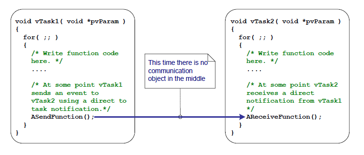
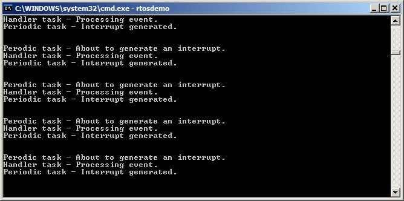
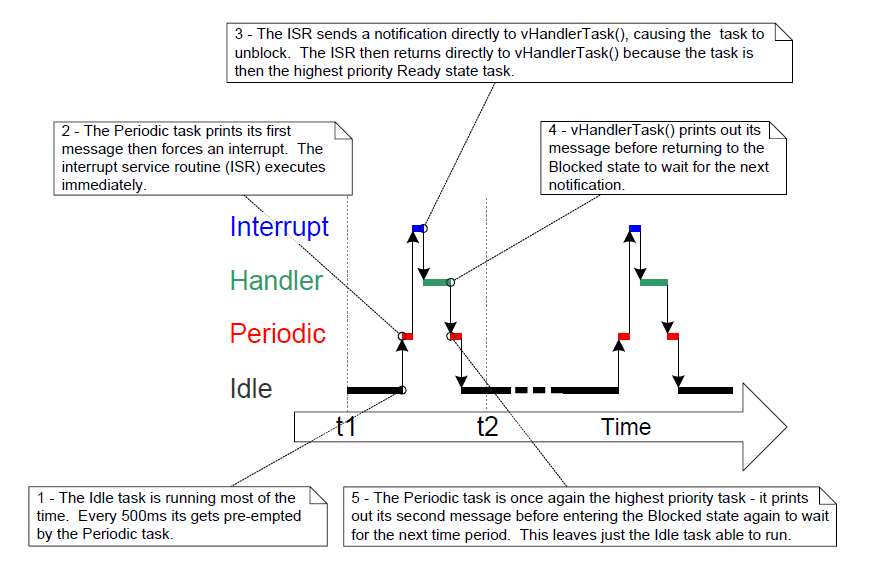
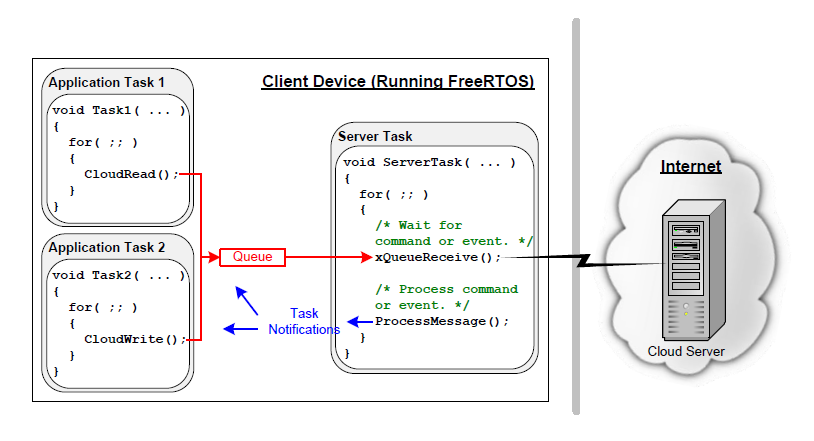

# 10 任务通知

## 10.1 简介

FreeRTOS 应用程序通常被构造为一系列独立的任务，这些任务相互通信以共同提供系统功能。任务通知是一种高效的机制，允许一个任务直接通知另一个任务。

### 10.1.1 通过中介对象进行通信

本书已经描述了任务之间进行通信的各种方式。到目前为止，所描述的方法都需要创建一个通信对象。通信对象的示例包括队列、事件组以及各种不同类型的信号量。

当使用通信对象时，事件和数据不会直接发送到接收任务或接收 ISR，而是发送到通信对象。同样，任务和 ISR 从通信对象接收事件和数据，而不是直接从发送事件或数据的任务或 ISR 接收。这一点如图 10.1 所示。

<a name="fig10.1" title="图 10.1 使用通信对象将事件从一个任务发送到另一个任务"></a>

* * *
    
***图 10.1*** *使用通信对象将事件从一个任务发送到另一个任务*
* * *

### 10.1.2 任务通知——任务间直接通信

“任务通知”允许任务与其他任务交互，并与中断服务例程（ISR）同步，而无需使用单独的通信对象。通过使用任务通知，任务或ISR可以直接向接收任务发送事件。如图10.2所示。


<a name="fig10.2" title="Figure 10.2 任务通知用于从一个任务直接向另一个任务发送事件"></a>

* * *
    
**图10.2** *任务通知用于从一个任务直接向另一个任务发送事件*
* * *

任务通知功能是可选的。要在FreeRTOSConfig.h中包含任务通知功能，需将`configUSE_TASK_NOTIFICATIONS`设置为1。

当`configUSE_TASK_NOTIFICATIONS`设置为1时，每个任务至少有一个“通知状态”，可以是“挂起”或“未挂起”，以及一个“通知值”，它是一个32位无符号整数。当任务接收到通知时，其通知状态被设置为挂起。当任务读取其通知值时，其通知状态被设置为未挂起。如果`configTASK_NOTIFICATION_ARRAY_ENTRIES`设置为大于1的值，则存在多个通知状态和值，并通过索引标识。

任务可以在阻塞状态下等待其通知状态变为挂起，并可选择设置超时时间。

### 10.1.3 范围

本章讨论以下内容：

- 任务的通知状态和通知值
- 如何以及何时可以使用任务通知替代通信对象（如信号量）
- 使用任务通知替代通信对象的优势

## 10.2 任务通知：优势与限制

### 10.2.1 任务通知的性能优势

使用任务通知向任务发送事件或数据，比使用队列、信号量或事件组执行相同操作要快得多。

### 10.2.2 任务通知的内存占用优势

同样，使用任务通知向任务发送事件或数据所需的内存远少于使用队列、信号量或事件组执行相同操作。这是因为每个通信对象（队列、信号量或事件组）在使用前都必须创建，而启用任务通知功能则有固定的开销。任务通知的内存开销为每个任务 `configTASK_NOTIFICATION_ARRAY_ENTRIES` * 5 字节。`configTASK_NOTIFICATION_ARRAY_ENTRIES` 的默认值为 1，因此任务通知的默认大小为每个任务 5 字节。

### 10.2.3 任务通知的限制

任务通知比通信对象更快且占用更少的内存，但任务通知并非适用于所有场景。本节记录了不能使用任务通知的场景：

- **向中断服务程序（ISR）发送事件或数据**

  通信对象可用于从ISR向任务以及从任务向ISR发送事件和数据。

  任务通知可用于从ISR向任务发送事件和数据，但不能用于从任务向ISR发送事件或数据。

- **支持多个接收任务**

  任何知道其句柄（可能是队列句柄、信号量句柄或事件组句柄）的任务或ISR都可以访问通信对象。任何数量的任务和ISR都可以处理发送到给定通信对象的事件或数据。

  任务通知直接发送给接收任务，因此只能由接收通知的任务处理。然而，这在实际应用中很少成为限制，因为虽然通常会有多个任务和ISR向同一个通信对象发送数据，但很少有多个任务和ISR从同一个通信对象接收数据。

- **缓冲多个数据项**

  队列是一种可以同时保存多个数据项的通信对象。发送到队列但尚未从队列中接收的数据会缓冲在队列对象中。

  任务通知通过更新接收任务的通知值来发送数据。任务的通知值一次只能保存一个值。

- **向多个任务广播**

  事件组是一种通信对象，可用于同时向多个任务发送事件。

  任务通知直接发送给接收任务，因此只能由接收任务处理。

- **在阻塞状态下等待发送完成**

  如果通信对象暂时处于无法写入更多数据或事件的状态（例如，当队列已满时无法再向队列发送数据），则尝试写入该对象的任务可以选择进入阻塞状态，以等待其写入操作完成。

  如果任务尝试向已挂起通知的任务发送任务通知，则发送任务无法在阻塞状态下等待接收任务重置其通知状态。正如所见，这在任务通知的实际应用场景中很少成为限制。

## 10.3 使用任务通知

### 10.3.1 任务通知 API 选项

任务通知是一项非常强大的功能，通常可以替代二进制信号量、计数信号量、事件组，有时甚至队列。通过使用 `xTaskNotify()` API 函数发送任务通知，以及使用 `xTaskNotifyWait()` API 函数接收任务通知，可以覆盖广泛的使用场景。

然而，在大多数情况下，`xTaskNotify()` 和 `xTaskNotifyWait()` API 函数提供的全部灵活性并非必需，更简单的函数即可满足需求。因此，`xTaskNotifyGive()` API 函数作为 `xTaskNotify()` 的简化但灵活性较低的替代方案提供，而 `ulTaskNotifyTake()` API 函数则作为 `xTaskNotifyWait()` 的简化但灵活性较低的替代方案提供。

任务通知系统并不局限于单一的通知事件。默认情况下，配置参数 `configTASK_NOTIFICATION_ARRAY_ENTRIES` 设置为 1。如果将其设置为大于 1 的值，则会在每个任务内部创建一个通知数组。这使得通知可以通过索引进行管理。每个任务通知 API 函数都有一个带索引的版本。使用不带索引的版本将访问 `notification[0]`（数组中的第一个通知）。每个 API 函数的带索引版本通过后缀 `Indexed` 标识，因此函数 `xTaskNotify` 变为 `xTaskNotifyIndexed`。为了简洁起见，本书中仅使用每个函数的不带索引版本。

任务通知 API 作为宏实现，这些宏会调用底层 `Generic` 版本的每个 API 函数类型。为了简洁起见，本书中将 API 宏称为函数。

#### 10.3.1.1 API 函数的完整列表 <sup>27</sup>

- `xTaskNotifyGive`
- `xTaskNotifyGiveIndexed`
- `vTaskNotifyGiveFromISR`
- `vTaskNotifyGiveIndexedFromISR`
- `vTaskNotifyTake`
- `vTaskNotifyTakeIndexed`
- `xTaskNotify`
- `xTaskNotifyIndexed`
- `xTaskNotifyWait`
- `xTaskNotifyWaitIndexed`
- `xTaskNotifyStateClear`
- `xTaskNotifyStateClearIndexed`
- `ulTaskNotifyValueClear`
- `ulTaskNotifyValueClearIndexed`
- `xTaskNotifyAndQueryIndexedFromISR`
- `xTaskNotifyAndQueryFromISR`
- `xTaskNotifyFromISR`
- `xTaskNotifyIndexedFromISR`
- `xTaskNotifyAndQuery`
- `xTaskNotifyAndQueryIndexed`

*(27): 这些函数实际上是作为宏实现的。*

>注意：`FromISR` 函数不用于接收通知，因为通知始终发送给任务，而中断不与任何任务关联。

### 10.3.2 xTaskNotifyGive() API 函数

`xTaskNotifyGive()` 直接向任务发送通知，并递增（加一）接收任务的通知值。调用 `xTaskNotifyGive()` 会将接收任务的通知状态设置为挂起（如果它尚未挂起）。

提供 `xTaskNotifyGive()` API 函数是为了允许将任务通知用作二进制信号量或计数信号量的更轻量、更快的替代方案。


<a name="list10.1" title="代码清单 10.1 xTaskNotifyGive() API 函数原型"></a>


```c
BaseType_t xTaskNotifyGive( TaskHandle_t xTaskToNotify );
BaseType_t xTaskNotifyGiveIndexed( TaskHandle_t xTaskToNotify, UBaseType_t uxIndexToNotify );
```

***代码清单 10.1*** *xTaskNotifyGive() API 函数原型*

**xTaskNotifyGive()/xTaskNotifyGiveIndexed() 参数和返回值**

- `xTaskToNotify`

  要发送通知的任务的句柄——有关获取任务句柄的信息，请参阅 `xTaskCreate()` API 函数的 `pxCreatedTask` 参数。

- `uxIndexToNotify`

  数组中的索引

- 返回值

  `xTaskNotifyGive()` 是一个调用 `xTaskNotify()` 的宏。传递给 `xTaskNotify()` 的参数由宏设置，使得 `pdPASS` 是唯一可能的返回值。`xTaskNotify()` 将在本书后面进行描述。

### 10.3.3 vTaskNotifyGiveFromISR() API 函数

`vTaskNotifyGiveFromISR()` 是 `xTaskNotifyGive()` 的一个版本，可以在中断服务例程中使用。


<a name="list10.2" title="Listing 10.2 The vTaskNotifyGiveFromISR() API function prototype"></a>


```c
void vTaskNotifyGiveFromISR( TaskHandle_t xTaskToNotify,
                             BaseType_t *pxHigherPriorityTaskWoken );
```

***代码清单 10.2*** *vTaskNotifyGiveFromISR() API 函数原型*

**vTaskNotifyGiveFromISR() 参数和返回值**

- `xTaskToNotify`

  要接收通知的任务的句柄——有关如何获取任务句柄的信息，请参阅 `xTaskCreate()` API 函数的 `pxCreatedTask` 参数。

- `pxHigherPriorityTaskWoken`

  如果接收通知的任务正在阻塞状态中等待接收通知，那么发送通知将导致该任务退出阻塞状态。

  如果调用 `vTaskNotifyGiveFromISR()` 导致任务退出阻塞状态，并且该解除阻塞的任务的优先级高于当前正在执行的任务（被中断的任务）的优先级，那么 `vTaskNotifyGiveFromISR()` 会在内部将 `*pxHigherPriorityTaskWoken` 设置为 `pdTRUE`。

  如果 `vTaskNotifyGiveFromISR()` 将此值设置为 `pdTRUE`，则应在退出中断之前执行上下文切换。这将确保中断直接返回到最高优先级的就绪状态任务。

  与所有中断安全的 API 函数一样，`pxHigherPriorityTaskWoken` 参数在使用前必须设置为 `pdFALSE`。

### 10.3.4 ulTaskNotifyTake() API 函数

`ulTaskNotifyTake()` 允许任务在阻塞状态下等待其通知值大于零，并在返回之前递减（减一）或清除任务的通知值。

`ulTaskNotifyTake()` API 函数的提供是为了允许任务通知作为一种更轻量级、更快速的替代方案，用于替代二进制信号量或计数信号量。

<a name="list10.3" title="Listing 10.3 The ulTaskNotifyTake() API function prototype"></a>

```c
uint32_t ulTaskNotifyTake( BaseType_t xClearCountOnExit, TickType_t
xTicksToWait );
```

***清单 10.3*** *ulTaskNotifyTake() API 函数原型*

**ulTaskNotifyTake() 参数和返回值**

- `xClearCountOnExit`

  如果 `xClearCountOnExit` 设置为 `pdTRUE`，则在 `ulTaskNotifyTake()` 返回之前，调用任务的通知值将被清零。

  如果 `xClearCountOnExit` 设置为 `pdFALSE`，且调用任务的通知值大于零，则在 `ulTaskNotifyTake()` 返回之前，调用任务的通知值将被递减。

- `xTicksToWait`

  调用任务在阻塞状态下等待其通知值大于零的最长时间。

  阻塞时间以滴答周期为单位指定，因此其表示的绝对时间取决于滴答频率。可以使用宏 `pdMS_TO_TICKS()` 将以毫秒为单位的时间转换为以滴答为单位的时间。

  如果将 `xTicksToWait` 设置为 `portMAX_DELAY`，且 `FreeRTOSConfig.h` 中的 `INCLUDE_vTaskSuspend` 设置为 1，则任务将无限期等待（不会超时）。

- 返回值

  返回值是调用任务的通知值在被清零或递减 *之前* 的值，具体取决于 `xClearCountOnExit` 参数的值。

  如果指定了阻塞时间（`xTicksToWait` 不为零），且返回值不为零，则可能是调用任务被置于阻塞状态以等待其通知值大于零，并且其通知值在阻塞时间到期之前已被更新。

如果指定了阻塞时间（`xTicksToWait`不为零），并且返回值为零，则表示调用任务被置于阻塞状态以等待其通知值大于零，但在该情况发生之前指定的阻塞时间已到期。

<a name="example10.1" title="示例10.1 使用任务通知替代信号量，方法1"></a>
---
***示例10.1*** *使用任务通知替代信号量，方法1*

---

示例7.1使用了一个二值信号量来从中断服务例程中解除任务的阻塞——有效地实现了任务与中断的同步。本示例复制了示例7.1的功能，但使用了直接任务通知来替代二值信号量。

清单10.4展示了与中断同步的任务的实现。示例7.1中使用的`xSemaphoreTake()`调用已被替换为`ulTaskNotifyTake()`调用。

`ulTaskNotifyTake()`的`xClearCountOnExit`参数设置为`pdTRUE`，这导致在`ulTaskNotifyTake()`返回之前，接收任务的通知值被清零。因此，有必要在每次调用`ulTaskNotifyTake()`之间处理所有已经可用的事件。在示例7.1中，由于使用了二值信号量，必须从硬件中确定待处理事件的数量，这并不总是可行的。在示例10.1中，待处理事件的数量由`ulTaskNotifyTake()`返回。

在`ulTaskNotifyTake`调用之间发生的中断事件会被锁存在任务的通知值中，如果调用任务已经有待处理的通知，则`ulTaskNotifyTake()`调用会立即返回。

<a name="list10.4" title="Listing 10.4 实现中断处理延迟的任务（该任务..."></a>

```c
/* 周期性任务生成软件中断的频率。 */
const TickType_t xInterruptFrequency = pdMS_TO_TICKS( 500UL );

static void vHandlerTask( void *pvParameters )
{
    /* xMaxExpectedBlockTime设置为比预期事件之间的最大时间稍长。 */
    const TickType_t xMaxExpectedBlockTime = xInterruptFrequency +
                                             pdMS_TO_TICKS( 10 );
    uint32_t ulEventsToProcess;

    /* 与大多数任务一样，此任务在一个无限循环中实现。 */
    for( ;; )
    {
        /* 等待从中断服务例程直接发送给此任务的通知。 */
        ulEventsToProcess = ulTaskNotifyTake( pdTRUE, xMaxExpectedBlockTime );
        if( ulEventsToProcess != 0 )
        {
            /* 到达这里意味着至少发生了一个事件。在此循环直到处理完所有待处理的事件（在本例中，只需为每个事件打印一条消息）。 */
            while( ulEventsToProcess > 0 )
            {
                vPrintString( "Handler task - Processing event.\r\n" );
                ulEventsToProcess--;
            }
        }
        else
        {
            /* 如果执行到这里，则说明在预期时间内没有发生中断，（在真实应用中）可能需要进行一些错误恢复操作。 */
        }
    }
}
```

***清单 10.4*** *示例10.1中实现中断处理延迟的任务（与中断同步的任务）*

用于生成软件中断的周期性任务会在中断生成前打印一条消息，并在中断生成后再打印一条消息。这允许在生成的输出中观察执行顺序。

<a name="list10.5" title="列表10.5 示例10.1中使用的中断服务例程的实现"></a>

```c
static uint32_t ulExampleInterruptHandler( void )
{
    BaseType_t xHigherPriorityTaskWoken;

    /* xHigherPriorityTaskWoken参数必须初始化为pdFALSE，因为如果在中断安全的API函数中需要上下文切换，
       它将被设置为pdTRUE。 */
    xHigherPriorityTaskWoken = pdFALSE;

    /* 直接向中断处理被延迟的任务发送通知。 */
    vTaskNotifyGiveFromISR( /* 用于接收通知的任务句柄。任务创建时保存了该句柄。 */
                            xHandlerTask,

                            /* xHigherPriorityTaskWoken按常规方式使用。 */
                            &xHigherPriorityTaskWoken );

    /* 将xHigherPriorityTaskWoken值传递给portYIELD_FROM_ISR()。如果vTaskNotifyGiveFromISR()中
       xHigherPriorityTaskWoken被设置为pdTRUE，那么调用portYIELD_FROM_ISR()将请求上下文切换。如果
       xHigherPriorityTaskWoken仍为pdFALSE，则调用portYIELD_FROM_ISR()将不会产生任何效果。Windows端口
       使用的portYIELD_FROM_ISR()实现包含一个返回语句，这就是为什么此函数没有显式返回值的原因。 */
    portYIELD_FROM_ISR( xHigherPriorityTaskWoken );
}
```

***列表10.5*** *示例10.1中使用的中断服务例程的实现*

示例10.1执行时产生的输出如图10.3所示。正如预期的那样，它与示例7.1执行时产生的输出完全相同。`vHandlerTask()`在中断生成时立即进入运行状态，因此该任务的输出会分割周期性任务的输出。图10.4中提供了进一步的解释。

<a name="fig10.3" title="Figure 10.3 The output produced when Example 7.1 is executed"></a>
<a name="fig10.4" title="Figure 10.4 The sequence of execution when Example 10.1 is executed"></a>

* * *
    
***图 10.3*** *执行示例7.1时生成的输出*

    
***图 10.4*** *执行示例10.1时的执行顺序*
* * *

<a name="example10.2" title="Example 10.2 Using a task notification in place of a semaphore, method 2"></a>
---
***示例 10.2*** *使用任务通知代替信号量的方法2*

---

在示例10.1中，`ulTaskNotifyTake()`的`xClearOnExit`参数被设置为`pdTRUE`。示例10.2对示例10.1稍作修改，以展示当`ulTaskNotifyTake()`的`xClearOnExit`参数设置为`pdFALSE`时的行为。

当`xClearOnExit`为`pdFALSE`时，调用`ulTaskNotifyTake()`只会将调用任务的通知值减一（减少一个），而不是将其清零。因此，通知计数是已发生事件数量与已处理事件数量之间的差值。这使得`vHandlerTask()`的结构可以在以下两个方面得到简化：

1. 等待处理的事件数量保存在通知值中，因此不需要保存在局部变量中。

2. 每次调用 `ulTaskNotifyTake()` 之间只需处理一个事件。

示例 10.2 中使用的 `vHandlerTask()` 的实现如代码清单 10.6 所示。


<a name="list10.6" title="Listing 10.6 The implementation of the task to which the interrupt processing is deferred (the task..."></a>


```c
static void vHandlerTask( void *pvParameters )
{
    /* xMaxExpectedBlockTime 设置为比事件之间的最大预期时间稍长一点。 */
    const TickType_t xMaxExpectedBlockTime = xInterruptFrequency + 
                                             pdMS_TO_TICKS( 10 );

    /* 与大多数任务一样，此任务在一个无限循环中实现。 */
    for( ;; )
    {
        /* 等待从中断服务例程直接发送到此任务的通知。xClearCountOnExit 参数现在为 
           pdFALSE，因此任务的计数值将由 ulTaskNotifyTake() 递减，而不会被清零。 */
        if( ulTaskNotifyTake( pdFALSE, xMaxExpectedBlockTime ) != 0 )
        {
            /* 执行到这里表示事件已发生。处理事件（在本例中仅打印一条消息）。 */
            vPrintString( "Handler task - Processing event.\r\n" );
        }
        else
        {
            /* 如果执行到函数的这一部分，则表示中断未在预期时间内到达，
               在真实应用中，可能需要执行一些错误恢复操作。 */
        }
    }
}
```

***代码清单 10.6*** *示例 10.2 中用于延迟中断处理的任务（与中断同步的任务）的实现*

为了演示目的，中断服务例程也进行了修改，以便每次中断发送多个任务通知，从而模拟高频发生的多个中断。示例 10.2 中使用的中断服务例程的实现如代码清单 10.7 所示。

<a name="list10.7" title="代码清单 10.7 示例 10.2 中使用的中断服务例程的实现"></a>


```c
static uint32_t ulExampleInterruptHandler( void )
{
    BaseType_t xHigherPriorityTaskWoken;

    xHigherPriorityTaskWoken = pdFALSE;

    /* 向处理任务发送多次通知。第一次 'give' 会解除任务的阻塞状态，
       随后的 'give' 用于演示接收任务的通知值被用于计数（锁存）事件——
       这样任务就可以依次处理每个事件。 */
    vTaskNotifyGiveFromISR( xHandlerTask, &xHigherPriorityTaskWoken );
    vTaskNotifyGiveFromISR( xHandlerTask, &xHigherPriorityTaskWoken );
    vTaskNotifyGiveFromISR( xHandlerTask, &xHigherPriorityTaskWoken );

    portYIELD_FROM_ISR( xHigherPriorityTaskWoken );
}
```

***代码清单 10.7*** *示例 10.2 中使用的中断服务例程的实现*

执行示例 10.2 时产生的输出如图 10.5 所示。可以看出，`vHandlerTask()` 在每次中断发生时都会处理所有三个事件。

<a name="fig10.5" title="图 10.5 执行示例 10.2 时产生的输出"></a>

* * *
    
***图 10.5*** *执行示例 10.2 时产生的输出*
* * *


### 10.3.5 xTaskNotify() 和 xTaskNotifyFromISR() API 函数

`xTaskNotify()` 是 `xTaskNotifyGive()` 的一个功能更强大的版本，可用于通过以下任意方式更新接收任务的通知值：

- **递增**（加一）：将接收任务的通知值加一，此时 `xTaskNotify()` 等同于 `xTaskNotifyGive()`。

- **设置位**：在接收任务的通知值中设置一个或多个位。这使得任务的通知值可以作为一种更轻量级、更快速的事件组替代方案。

- **无覆盖写入**：将一个全新的数值写入接收任务的通知值，但仅当接收任务自上次更新后已读取其通知值时。这使得任务的通知值可以提供类似于长度为 1 的队列的功能。

- **覆盖写入**：将一个全新的数值写入接收任务的通知值，即使接收任务自上次更新后尚未读取其通知值。这使得任务的通知值可以提供类似于 `xQueueOverwrite()` API 函数的功能。这种结果行为有时被称为“邮箱”。

`xTaskNotify()` 比 `xTaskNotifyGive()` 更灵活、更强大，但正是由于其额外的灵活性和功能，使用起来也稍微复杂一些。

`xTaskNotifyFromISR()` 是 `xTaskNotify()` 的一个版本，可以在中断服务例程中使用，因此多了一个 `pxHigherPriorityTaskWoken` 参数。

调用 `xTaskNotify()` 将始终将接收任务的通知状态设置为挂起（如果之前未挂起）。

<a name="list10.8" title="Listing 10.8 xTaskNotify() 和 xTaskNotifyFromISR() API 函数的原型"></a>

```c
BaseType_t xTaskNotify( TaskHandle_t xTaskToNotify,
                        uint32_t ulValue,
                        eNotifyAction eAction );

BaseType_t xTaskNotifyFromISR( TaskHandle_t xTaskToNotify,
                               uint32_t ulValue,
                               eNotifyAction eAction,
                               BaseType_t *pxHigherPriorityTaskWoken );
```

***Listing 10.8*** *xTaskNotify() 和 xTaskNotifyFromISR() API 函数的原型*

**xTaskNotify() 参数和返回值**

- `xTaskToNotify`  
  接收通知的任务句柄——有关如何获取任务句柄的信息，请参阅 `xTaskCreate()` API 函数的 `pxCreatedTask` 参数。

- `ulValue`  
  `ulValue` 的使用方式取决于 `eNotifyAction` 的值。详见下文。

- `eNotifyAction`  
  一个枚举类型，指定如何更新接收任务的通知值。详见下文。

- **返回值**  
  `xTaskNotify()` 将返回 `pdPASS`，除非在下面提到的一种情况下。

**xTaskNotify() 的 eNotifyAction 参数有效值及其对接收任务通知值的影响**

- `eNoAction`  
  接收任务的通知状态被设置为挂起，但其通知值不会被更新。`xTaskNotify()` 的 `ulValue` 参数不会被使用。  
  `eNoAction` 操作允许任务通知用作二进制信号量的更快、更轻量级的替代方案。

- `eSetBits`  
  接收任务的通知值与 `xTaskNotify()` 的 `ulValue` 参数传递的值进行按位或操作。例如，如果 `ulValue` 设置为 0x01，则接收任务通知值的第 0 位将被设置。再例如，如果 `ulValue` 为 0x06（二进制 0110），则接收任务通知值的第 1 位和第 2 位将被设置。  
  `eSetBits` 操作允许任务通知用作事件组的更快、更轻量级的替代方案。

- `eIncrement`  
  接收任务的通知值递增。`xTaskNotify()` 的 `ulValue` 参数不会被使用。  
  `eIncrement` 操作允许任务通知用作二进制或计数信号量的更快、更轻量级的替代方案，并且等同于更简单的 `xTaskNotifyGive()` API 函数。

- `eSetValueWithoutOverwrite`  
  如果接收任务在 `xTaskNotify()` 调用之前已有通知挂起，则不执行任何操作，且 `xTaskNotify()` 将返回 `pdFAIL`。  
  如果接收任务在 `xTaskNotify()` 调用之前没有通知挂起，则接收任务的通知值将被设置为 `xTaskNotify()` 的 `ulValue` 参数传递的值。

- `eSetValueWithOverwrite`  
  接收任务的通知值将被设置为 `xTaskNotify()` 的 `ulValue` 参数传递的值，无论接收任务在 `xTaskNotify()` 调用之前是否有通知挂起。

### 10.3.6 xTaskNotifyWait() API 函数

`xTaskNotifyWait()` 是 `ulTaskNotifyTake()` 的一个功能更强大的版本。它允许任务等待调用任务的通知状态变为挂起状态（如果尚未挂起），并可以设置可选的超时时间。`xTaskNotifyWait()` 提供了在进入函数时和退出函数时清除调用任务通知值中特定位的选项。


<a name="list10.9" title="Listing 10.9 The xTaskNotifyWait() API function prototype"></a>


```c
BaseType_t xTaskNotifyWait( uint32_t   ulBitsToClearOnEntry,
                            uint32_t   ulBitsToClearOnExit,
                            uint32_t   *pulNotificationValue,
                            TickType_t xTicksToWait );
```

***代码清单 10.9*** *xTaskNotifyWait() API 函数原型*

**xTaskNotifyWait() 参数和返回值**

- `ulBitsToClearOnEntry`

  如果调用任务在调用 `xTaskNotifyWait()` 之前没有挂起的通知，那么在进入函数时，`ulBitsToClearOnEntry` 中设置的任何位将在任务的通知值中被清除。

  例如，如果 `ulBitsToClearOnEntry` 为 0x01，则任务通知值的第 0 位将被清除。再比如，将 `ulBitsToClearOnEntry` 设置为 0xffffffff (`ULONG_MAX`) 将清除任务通知值中的所有位，实际上将值清零。

- `ulBitsToClearOnExit`

  如果调用任务因为接收到通知或在调用 `xTaskNotifyWait()` 时已经有挂起的通知而退出 `xTaskNotifyWait()`，那么在任务退出 `xTaskNotifyWait()` 函数之前，`ulBitsToClearOnExit` 中设置的任何位将在任务的通知值中被清除。

  这些位在任务的通知值被保存到 `*pulNotificationValue` 之后被清除（见下文关于 `pulNotificationValue` 的描述）。

  例如，如果 `ulBitsToClearOnExit` 为 0x03，则任务通知值的第 0 位和第 1 位将在函数退出前被清除。

  将 `ulBitsToClearOnExit` 设置为 0xffffffff (`ULONG_MAX`) 将清除任务通知值中的所有位，实际上将值清零。

- `pulNotificationValue`

  用于传递任务的通知值。复制到 `*pulNotificationValue` 的值是任务的通知值，该值是在由于 `ulBitsToClearOnExit` 设置而清除任何位之前的值。

  `pulNotificationValue` 是一个可选参数，如果不需要可以设置为 NULL。

- `xTicksToWait`

  调用任务在等待其通知状态变为挂起状态时，应保持在阻塞状态的最长时间。

  阻塞时间以 tick 周期为单位指定，因此它所代表的绝对时间取决于 tick 频率。可以使用宏 `pdMS_TO_TICKS()` 将以毫秒为单位的时间转换为以 tick 为单位的时间。

  将 `xTicksToWait` 设置为 `portMAX_DELAY` 将使任务无限期等待（不会超时），前提是 `FreeRTOSConfig.h` 中 `INCLUDE_vTaskSuspend` 设置为 1。

- 返回值

  有两种可能的返回值：

  - `pdTRUE`

    这表示 `xTaskNotifyWait()` 返回是因为接收到了通知，或者是因为调用任务在调用 `xTaskNotifyWait()` 时已经有挂起的通知。

    如果指定了阻塞时间（`xTicksToWait` 不为零），则调用任务可能被置入阻塞状态以等待其通知状态变为挂起状态，但在阻塞时间到期之前其通知状态已被设置为挂起状态。

  - `pdFALSE`

    这表示 `xTaskNotifyWait()` 返回时调用任务没有接收到任务通知。

    如果 `xTicksToWait` 不为零，则调用任务将被保持在阻塞状态以等待其通知状态变为挂起状态，但在指定的阻塞时间到期之前并未发生这种情况。

### 10.3.7 外设驱动中的任务通知：UART示例

外设驱动库提供了执行硬件接口常见操作的函数。通常会为以下外设提供此类库：通用异步收发器（UART）、串行外设接口（SPI）端口、模数转换器（ADC）以及以太网端口。这些库通常提供的函数示例包括：初始化外设、向外设发送数据以及从外设接收数据的函数。

某些外设操作需要相对较长的时间才能完成。例如，高精度ADC转换和在UART上传输大量数据包。在这些情况下，驱动库函数可以通过轮询（反复读取）外设的状态寄存器来确定操作何时完成。然而，这种轮询方式几乎总是浪费资源，因为它会占用处理器100%的时间，而在此期间并未执行任何有意义的处理。这种浪费在多任务系统中尤为昂贵，因为轮询外设的任务可能会阻止具有实际处理需求的低优先级任务的执行。

为了避免潜在的处理器时间浪费，一个高效的RTOS感知设备驱动程序应该是中断驱动的，并为启动长时间操作的任务提供在阻塞状态等待操作完成的选项。这样，当执行长时间操作的任务处于阻塞状态时，较低优先级的任务可以执行，确保没有任务会不必要地占用处理器时间，除非它们能够高效地利用它。

RTOS感知的驱动程序库通常使用二进制信号量将任务置于阻塞状态。这种技术可以通过如列表10.10所示的伪代码来演示，该代码提供了一个RTOS感知库函数的框架，该函数用于在UART端口上传输数据。在列表10.10中：

- `xUART` 是一个描述UART外设并保存状态信息的结构体。结构体的 `xTxSemaphore` 成员是一个类型为 `SemaphoreHandle_t` 的变量。假设信号量已经被创建。

- `xUART_Send()` 函数不包含任何互斥逻辑。如果多个任务将使用 `xUART_Send()` 函数，那么应用程序编写者必须在应用程序本身中管理互斥。例如，任务在调用 `xUART_Send()` 之前可能需要获得一个互斥量。

- `xSemaphoreTake()` API 函数用于在 UART 传输启动后将调用任务置于阻塞状态。

- `xSemaphoreGiveFromISR()` API 函数用于在传输完成后（即 UART 外设的传输结束中断服务程序执行时）将任务从阻塞状态中移除。


<a name="list10.10" title="Listing 10.10 演示如何在驱动库传输函数中使用二进制信号量的伪代码"></a>


```c
/* 用于将数据发送到 UART 的驱动库函数。 */

BaseType_t xUART_Send( xUART *pxUARTInstance, 
                       uint8_t *pucDataSource, 
                       size_t uxLength )
{
    BaseType_t xReturn;

    /* 通过尝试获取信号量而不设置超时，确保 UART 的传输信号量尚未可用。 */
    xSemaphoreTake( pxUARTInstance->xTxSemaphore, 0 );

    /* 启动传输。 */
    UART_low_level_send( pxUARTInstance, pucDataSource, uxLength );

    /* 阻塞在信号量上以等待传输完成。如果获取到信号量，则 xReturn 将被设置为 pdPASS。如果信号量获取操作超时，则 xReturn 将被设置为 pdFAIL。请注意，如果在调用 UART_low_level_send() 和 xSemaphoreTake() 之间发生中断，则事件将被锁存在二进制信号量中，并且对 xSemaphoreTake() 的调用将立即返回。 */
    xReturn = xSemaphoreTake( pxUARTInstance->xTxSemaphore, 
                              pxUARTInstance->xTxTimeout );

    return xReturn;
}
/*-----------------------------------------------------------*/

/* UART 传输结束中断的服务程序，在最后一个字节发送到 UART 后执行。 */
void xUART_TransmitEndISR( xUART *pxUARTInstance )
{
    BaseType_t xHigherPriorityTaskWoken = pdFALSE;

    /* 清除中断。 */
    UART_low_level_interrupt_clear( pxUARTInstance );

    /* 给出 Tx 信号量以表示传输结束。如果有任务正在阻塞等待信号量，则该任务将从阻塞状态中移除。 */
    xSemaphoreGiveFromISR( pxUARTInstance->xTxSemaphore, 
                           &xHigherPriorityTaskWoken );
    portYIELD_FROM_ISR( xHigherPriorityTaskWoken );
}
```

***清单 10.10*** *演示如何在驱动库传输函数中使用二进制信号量的伪代码*

清单 10.10 中演示的技术是完全可行的，并且确实是常见做法，但它也有一些缺点：

- 该库使用了多个信号量，这增加了其 RAM 占用。

- 信号量在创建之前无法使用，因此使用信号量的库必须在显式初始化后才能使用。

- 信号量是适用于广泛使用场景的通用对象；它们包含逻辑，允许任意数量的任务在阻塞状态下等待信号量变为可用，并在信号量可用时（以确定性的方式）选择从阻塞状态中移除哪个任务。执行该逻辑需要一定的时间，而在清单10.10所示的场景中，这种处理开销是不必要的，因为任何给定时间最多只有一个任务在等待信号量。

清单10.11展示了如何通过使用任务通知替代二进制信号量来避免这些缺点。

> *注意：如果库使用了任务通知，则库的文档必须明确指出，调用库函数可能会更改调用任务的通知状态和通知值。*

在清单10.11中：

- `xUART`结构体中的`xTxSemaphore`成员已被`xTaskToNotify`成员取代。`xTaskToNotify`是一个类型为`TaskHandle_t`的变量，用于保存等待UART操作完成的任务的句柄。

- `xTaskGetCurrentTaskHandle()` FreeRTOS API 函数用于获取处于运行状态的任务的句柄。

- 该库不会创建任何 FreeRTOS 对象，因此不会产生 RAM 开销，也不需要显式初始化。

- 任务通知会直接发送给等待 UART 操作完成的任务，因此不会执行不必要的逻辑。

`xUART` 结构体中的 `xTaskToNotify` 成员会从任务和中断服务程序中访问，因此需要考虑处理器如何更新其值：

- 如果 `xTaskToNotify` 通过单次内存写操作更新，则可以在临界区外更新，如代码清单 10.11 所示。如果 `xTaskToNotify` 是一个 32 位变量（`TaskHandle_t` 是 32 位类型），并且运行 FreeRTOS 的处理器是 32 位处理器，则属于这种情况。

- 如果需要多次内存写操作才能更新 `xTaskToNotify`，则只能在临界区内更新 `xTaskToNotify`——否则中断服务程序可能会在 `xTaskToNotify` 处于不一致状态时访问它。如果 `xTaskToNotify` 是一个 32 位变量，并且运行 FreeRTOS 的处理器是 16 位处理器，则属于这种情况，因为需要两次 16 位内存写操作才能更新所有 32 位数据。

在FreeRTOS实现内部，`TaskHandle_t`是一个指针，因此`sizeof( TaskHandle_t )`始终等于`sizeof( void * )`。


<a name="list10.11" title="Listing 10.11 Pseudo code demonstrating how a task notification can be used in a driver library transmit..."></a>


```c
/* 驱动库函数，用于向UART发送数据。 */
BaseType_t xUART_Send( xUART *pxUARTInstance, 
                       uint8_t *pucDataSource, 
                       size_t uxLength )
{
    BaseType_t xReturn;

    /* 保存调用此函数的任务句柄。书中的文本说明了是否需要通过临界区保护以下行。 */
    pxUARTInstance->xTaskToNotify = xTaskGetCurrentTaskHandle();

    /* 通过调用ulTaskNotifyTake()确保调用任务没有挂起的通知，其中xClearCountOnExit参数设置为pdTRUE，阻塞时间为0（不阻塞）。 */
    ulTaskNotifyTake( pdTRUE, 0 );

    /* 开始传输。 */
    UART_low_level_send( pxUARTInstance, pucDataSource, uxLength );

    /* 阻塞直到收到传输完成的通知。如果收到通知，则xReturn将被设置为1（pdTRUE），因为ISR会将此任务的通知值递增为1。如果操作超时，则xReturn将为0（pdFALSE），因为此任务的通知值自上次清除为0后未被更改。注意，如果ISR在调用UART_low_level_send()和ulTaskNotifyTake()之间执行，则事件将被锁存在任务的通知值中，并且对ulTaskNotifyTake()的调用将立即返回。 */
    xReturn = ( BaseType_t ) ulTaskNotifyTake( pdTRUE, 
                                               pxUARTInstance->xTxTimeout );

    return xReturn;
}
/*-----------------------------------------------------------*/

/* 在最后一个字节发送到UART后执行的ISR。 */
void xUART_TransmitEndISR( xUART *pxUARTInstance )
{
    BaseType_t xHigherPriorityTaskWoken = pdFALSE;

    /* 除非有任务等待被通知，否则不应执行此函数。使用断言测试此条件。此步骤并非严格必要，但有助于调试。configASSERT()在第12.2节中描述。 */
    configASSERT( pxUARTInstance->xTaskToNotify != NULL );

    /* 清除中断。 */
    UART_low_level_interrupt_clear( pxUARTInstance );

    /* 直接向调用xUART_Send()的任务发送通知。如果任务因等待通知而处于阻塞状态，则任务将被移除阻塞状态。 */
    vTaskNotifyGiveFromISR( pxUARTInstance->xTaskToNotify,
                            &xHigherPriorityTaskWoken );

    /* 现在没有任务等待被通知。将xUART结构中的xTaskToNotify成员重置为NULL。此步骤并非严格必要，但有助于调试。 */
    pxUARTInstance->xTaskToNotify = NULL;
    portYIELD_FROM_ISR( xHigherPriorityTaskWoken );
}
```

***清单 10.11*** *伪代码演示了如何在驱动库传输函数中使用任务通知*

任务通知也可以替代接收函数中的信号量，如伪代码清单10.12所示，该清单提供了一个RTOS感知库函数的概述，该函数在UART端口上接收数据。
参考清单10.12：

- `xUART_Receive()`函数不包含任何互斥逻辑。如果多个任务将使用`xUART_Receive()`函数，则应用程序编写者必须在应用程序本身中管理互斥。例如，任务可能需要在调用`xUART_Receive()`之前获取互斥锁。

- UART 的接收中断服务程序将 UART 接收到的字符放入 RAM 缓冲区中。`xUART_Receive()` 函数从 RAM 缓冲区返回字符。

- `xUART_Receive()` 的 `uxWantedBytes` 参数用于指定要接收的字符数量。如果 RAM 缓冲区中尚未包含请求的字符数量，则调用任务将进入阻塞状态，等待通知缓冲区中的字符数量增加。`while()` 循环用于重复此过程，直到接收缓冲区包含请求的字符数量或发生超时。

- 调用任务可能会多次进入阻塞状态。因此，阻塞时间会根据自 `xUART_Receive()` 调用以来已经过去的时间进行调整。这些调整确保在 `xUART_Receive()` 函数内花费的总时间不超过 `xUART` 结构的 `xRxTimeout` 成员指定的阻塞时间。阻塞时间使用 FreeRTOS 的 `vTaskSetTimeOutState()` 和 `xTaskCheckForTimeOut()` 辅助函数进行调整。

<a name="list10.12" title="代码清单 10.12 伪代码展示了任务通知如何在驱动库接收函数中使用"></a>


```c
/* 驱动库函数，用于从 UART 接收数据。 */

size_t xUART_Receive( xUART *pxUARTInstance, 
                      uint8_t *pucBuffer,
                      size_t uxWantedBytes )
{
    size_t uxReceived = 0;
    TickType_t xTicksToWait;
    TimeOut_t xTimeOut;

    /* 记录此函数进入时的时间。 */
    vTaskSetTimeOutState( &xTimeOut );

    /* xTicksToWait 是超时值——初始设置为该 UART 实例的最大接收超时时间。 */
    xTicksToWait = pxUARTInstance->xRxTimeout;

    /* 保存调用此函数的任务的句柄。书籍正文中包含有关以下行是否需要临界区保护的说明。 */
    pxUARTInstance->xTaskToNotify = xTaskGetCurrentTaskHandle();

    /* 循环直到缓冲区中包含所需数量的字节，或发生超时。 */
    while( UART_bytes_in_rx_buffer( pxUARTInstance ) < uxWantedBytes )
    {
        /* 检查超时，调整 xTicksToWait 以考虑此函数中已经花费的时间。 */
        if( xTaskCheckForTimeOut( &xTimeOut, &xTicksToWait ) != pdFALSE )
        {
            /* 在所需字节可用之前超时，退出循环。 */
            break;
        }

        /* 接收缓冲区中尚未包含所需的字节数。等待最多 xTicksToWait 个 tick，以便接收中断服务程序将更多数据放入缓冲区时通知调用任务。如果调用任务在调用此函数时已经有通知挂起，它只会额外迭代一次此 while 循环。 */
        ulTaskNotifyTake( pdTRUE, xTicksToWait );
    }

    /* 没有任务在等待接收通知，因此将 xTaskToNotify 设置回 NULL。书籍正文中包含有关以下行是否需要临界区保护的说明。 */
    pxUARTInstance->xTaskToNotify = NULL;

    /* 尝试从接收缓冲区读取 uxWantedBytes 到 pucBuffer 中。返回实际读取的字节数（可能少于 uxWantedBytes）。 */
    uxReceived = UART_read_from_receive_buffer( pxUARTInstance, 
                                                pucBuffer,
                                                uxWantedBytes );
    return uxReceived;
}

/*-----------------------------------------------------------*/

/* UART 接收中断的中断服务程序 */
void xUART_ReceiveISR( xUART *pxUARTInstance )
{
    BaseType_t xHigherPriorityTaskWoken = pdFALSE;

    /* 将接收到的数据复制到此 UART 的接收缓冲区并清除中断。 */
    UART_low_level_receive( pxUARTInstance );

    /* 如果有任务在等待新数据的通知，则立即通知它。 */
    if( pxUARTInstance->xTaskToNotify != NULL )
    {
        vTaskNotifyGiveFromISR( pxUARTInstance->xTaskToNotify,
                                &xHigherPriorityTaskWoken );
        portYIELD_FROM_ISR( xHigherPriorityTaskWoken );
    }
}
```

***代码清单 10.12*** *伪代码展示了任务通知如何在驱动库接收函数中使用*


### 10.3.8 任务通知在外设驱动程序中的使用：ADC 示例

上一节演示了如何使用 `vTaskNotifyGiveFromISR()` 从中断向任务发送任务通知。`vTaskNotifyGiveFromISR()` 是一个简单易用的函数，但其功能有限；它只能发送无值的任务通知事件，无法发送数据。本节将演示如何使用 `xTaskNotifyFromISR()` 在发送任务通知事件时附带数据。该技术通过清单 10.13 中的伪代码进行展示，该代码提供了一个 RTOS 感知的模数转换器 (ADC) 中断服务例程的框架。在清单 10.13 中：

- 假设每 50 毫秒至少启动一次 ADC 转换。

- `ADC_ConversionEndISR()` 是 ADC 转换结束中断的中断服务例程，每次有新的 ADC 值可用时都会执行该中断。

- 由 `vADCTask()` 实现的任务处理 ADC 生成的每个值。假设任务创建时，任务句柄已存储在 `xADCTaskToNotify` 中。

- `ADC_ConversionEndISR()` 使用 `xTaskNotifyFromISR()`，并将 `eAction` 参数设置为 `eSetValueWithoutOverwrite`，以向 `vADCTask()` 任务发送任务通知，并将 ADC 转换结果写入任务的通知值中。

- `vADCTask()` 任务使用 `xTaskNotifyWait()` 等待通知，以获取新的 ADC 值，并从其通知值中检索 ADC 转换结果。


<a name="list10.13" title="清单 10.13 演示如何使用任务通知向任务传递值的伪代码"></a>


```c
/* 使用 ADC 的任务。 */
void vADCTask( void *pvParameters )
{
    uint32_t ulADCValue;
    BaseType_t xResult;

    /* ADC 转换的触发频率。 */
    const TickType_t xADCConversionFrequency = pdMS_TO_TICKS( 50 );

    for( ;; )
    {
        /* 等待下一个 ADC 转换结果。 */
        xResult = xTaskNotifyWait(
                    /* 新的 ADC 值将覆盖旧值，因此在等待新通知值之前无需清除任何位。 */
                    0,
                    /* 未来的 ADC 值将覆盖现有值，因此在退出 xTaskNotifyWait() 之前无需清除任何位。 */
                    0,
                    /* 任务通知值（包含最新的 ADC 转换结果）将被复制到的变量的地址。 */
                    &ulADCValue,
                    /* 应每 xADCConversionFrequency 个 tick 收到一个新的 ADC 值。 */
                    xADCConversionFrequency * 2 );

        if( xResult == pdPASS )
        {
            /* 收到了一个新的 ADC 值。立即处理它。 */
            ProcessADCResult( ulADCValue );
        }
        else
        {
            /* xTaskNotifyWait() 调用未在预期时间内返回，触发 ADC 转换的输入或 ADC 本身可能存在问题。在此处理错误。 */
        }
    }
}

/*-----------------------------------------------------------*/

/* 每次 ADC 转换完成时执行的中断服务例程。 */
void ADC_ConversionEndISR( xADC *pxADCInstance )
{
    uint32_t ulConversionResult;
    BaseType_t xHigherPriorityTaskWoken = pdFALSE, xResult;

    /* 读取新的 ADC 值并清除中断。 */
    ulConversionResult = ADC_low_level_read( pxADCInstance );

    /* 向 vADCTask() 直接发送通知和 ADC 转换结果。 */
    xResult = xTaskNotifyFromISR( xADCTaskToNotify, /* xTaskToNotify 参数 */
                                  ulConversionResult, /* ulValue 参数 */
                                  eSetValueWithoutOverwrite, /* eAction 参数。 */
                                  &xHigherPriorityTaskWoken );

    /* 如果 xTaskNotifyFromISR() 返回 pdFAIL，则任务无法跟上生成 ADC 值的速率。configASSERT() 在第 11.2 节中描述。 */
    configASSERT( xResult == pdPASS );
    portYIELD_FROM_ISR( xHigherPriorityTaskWoken );
}
```

***清单 10.13*** *演示如何使用任务通知向任务传递值的伪代码*

### 10.3.9 在应用程序中直接使用任务通知

本节通过演示任务通知在一个假设应用程序中的使用，进一步强调了任务通知的强大功能。该应用程序包含以下功能：

- 应用程序通过缓慢的互联网连接与远程数据服务器通信，发送数据并请求数据。从现在起，远程数据服务器被称为*云服务器*。

- 在向云服务器请求数据后，请求任务必须进入阻塞状态，等待接收所请求的数据。

- 在向云服务器发送数据后，发送任务必须进入阻塞状态，等待云服务器确认数据已正确接收。

图10.6展示了该软件设计的示意图。在图10.6中：

- 处理与云服务器的多个互联网连接的复杂性被封装在一个单一的FreeRTOS任务中。该任务在FreeRTOS应用程序中充当代理服务器，被称为*服务器任务*。

- 应用程序任务通过调用`CloudRead()`从云服务器读取数据。`CloudRead()`并不直接与云服务器通信，而是将读取请求发送到队列中的服务器任务，并通过任务通知从服务器任务接收请求的数据。

- 应用程序任务通过调用`CloudWrite()`向云服务器写入数据。`CloudWrite()`并不直接与云服务器通信，而是将写入请求发送到队列中的服务器任务，并通过任务通知从服务器任务接收写入操作的结果。

`CloudRead()`和`CloudWrite()`函数发送给服务器任务的结构如清单10.14所示。


<a name="fig10.6" title="图10.6 从应用程序任务到云服务器及返回的通信路径"></a>

* * *
    
***图10.6*** *从应用程序任务到云服务器及返回的通信路径*
* * *


<a name="list10.14" title="清单10.14 通过队列发送给服务器任务的结构和数据类型"></a>


```c
typedef enum CloudOperations
{
    eRead, /* 向云服务器发送数据。 */
    eWrite /* 从云服务器接收数据。 */
} Operation_t;

typedef struct CloudCommand
{
    Operation_t eOperation; /* 要执行的操作（读取或写入）。 */
    uint32_t ulDataID; /* 标识正在读取或写入的数据。 */
    uint32_t ulDataValue; /* 仅在向云服务器写入数据时使用。 */
    TaskHandle_t xTaskToNotify;/* 执行操作的任务的句柄。 */
} CloudCommand_t;
```

***清单10.14*** *通过队列发送给服务器任务的结构和数据类型*

`CloudRead()`的伪代码如清单10.15所示。该函数将其请求发送给服务器任务，然后调用`xTaskNotifyWait()`，在阻塞状态下等待，直到收到请求数据可用的通知。

以下展示了服务器任务如何处理读取请求的伪代码，如代码清单10.16所示。当从云服务器接收到数据后，服务器任务会解除应用程序任务的阻塞，并通过调用`xTaskNotify()`（其中`eAction`参数设置为`eSetValueWithOverwrite`）将接收到的数据发送给应用程序任务。

代码清单10.16展示了一个简化场景，假设`GetCloudData()`不需要等待即可从云服务器获取数据。


<a name="list10.15" title="代码清单10.15 云读取API函数的实现"></a>


```c
/* ulDataID标识要读取的数据。pulValue保存用于写入从云服务器接收的数据的变量地址。*/
BaseType_t CloudRead( uint32_t ulDataID, uint32_t *pulValue )
{
    CloudCommand_t xRequest;
    BaseType_t xReturn;

    /* 将CloudCommand_t结构体成员设置为适合此读取请求的值。 */
    xRequest.eOperation = eRead; /* 这是一个读取数据的请求。 */
    xRequest.ulDataID = ulDataID; /* 标识要读取数据的代码。 */
    xRequest.xTaskToNotify = xTaskGetCurrentTaskHandle(); /* 调用任务的任务句柄。 */

    /* 通过以0为阻塞时间读取通知值，确保没有待处理的通知，然后将结构体发送到服务器任务。 */
    xTaskNotifyWait( 0, 0, NULL, 0 );
    xQueueSend( xServerTaskQueue, &xRequest, portMAX_DELAY );

    /* 等待来自服务器任务的通知。服务器任务将从云服务器接收的值直接写入此任务的通知值中，
       因此无需在进入或退出xTaskNotifyWait()函数时清除通知值中的任何位。
       接收到的值将写入*pulValue，因此将pulValue作为写入通知值的地址传递。 */
    xReturn = xTaskNotifyWait( 0, /* 进入时不清除任何位 */
                               0, /* 退出时不清除任何位 */
                               pulValue, /* 通知值写入*pulValue */
                               pdMS_TO_TICKS( 250 ) ); /* 最多等待250ms */

    /* 如果xReturn为pdPASS，则表示成功获取值。如果xReturn为pdFAIL，则表示请求超时。 */
    return xReturn;
}
```

***代码清单10.15*** *云读取API函数的实现*


<a name="list10.16" title="代码清单10.16 服务器任务处理读取请求"></a>


```c
void ServerTask( void *pvParameters )
{
    CloudCommand_t xCommand;
    uint32_t ulReceivedValue;

    for( ;; )
    {
        /* 等待从任务接收下一个CloudCommand_t结构体 */
        xQueueReceive( xServerTaskQueue, &xCommand, portMAX_DELAY );

        switch( xCommand.eOperation ) /* 是读取还是写入请求？ */
        {
            case eRead:

                /* 从远程云服务器获取请求的数据项 */
                ulReceivedValue = GetCloudData( xCommand.ulDataID );

                /* 调用xTaskNotify()向发出请求的任务发送通知以及从云服务器接收的值。
                   任务句柄从CloudCommand_t结构体中获取。 */
                xTaskNotify( xCommand.xTaskToNotify, /* 任务句柄在结构体中 */
                             ulReceivedValue, /* 云数据作为通知值发送 */
                             eSetValueWithOverwrite );
                break;

                /* 其他switch分支在此处添加。 */
        }
    }
}
```

***代码清单10.16*** *服务器任务处理读取请求*

`CloudWrite()`的伪代码如代码清单10.17所示。为了演示目的，`CloudWrite()`返回一个位状态码，其中状态码的每一位都被赋予唯一的含义。代码清单10.17顶部的\#define语句展示了四个示例状态位。

任务会清除四个状态位，将其请求发送到服务器任务，然后调用`xTaskNotifyWait()`在阻塞状态下等待状态通知。


<a name="list10.17" title="Listing 10.17 The Implementation of the Cloud Write API Function"></a>


```c
/* 云写操作使用的状态位。 */
#define SEND_SUCCESSFUL_BIT ( 0x01 << 0 )
#define OPERATION_TIMED_OUT_BIT ( 0x01 << 1 )
#define NO_INTERNET_CONNECTION_BIT ( 0x01 << 2 )
#define CANNOT_LOCATE_CLOUD_SERVER_BIT ( 0x01 << 3 )

/* 一个包含四个状态位的掩码。 */
#define CLOUD_WRITE_STATUS_BIT_MASK ( SEND_SUCCESSFUL_BIT |
                                      OPERATION_TIMED_OUT_BIT |
                                      NO_INTERNET_CONNECTION_BIT |
                                      CANNOT_LOCATE_CLOUD_SERVER_BIT )

uint32_t CloudWrite( uint32_t ulDataID, uint32_t ulDataValue )
{
    CloudCommand_t xRequest;
    uint32_t ulNotificationValue;

    /* 设置CloudCommand_t结构体成员以适合此写请求。 */
    xRequest.eOperation = eWrite; /* 这是一个写数据的请求 */
    xRequest.ulDataID = ulDataID; /* 标识所写数据的代码 */
    xRequest.ulDataValue = ulDataValue; /* 写入云服务器的数据值。 */
    xRequest.xTaskToNotify = xTaskGetCurrentTaskHandle(); /* 调用任务的任务句柄。 */

    /* 通过调用xTaskNotifyWait()清除与写操作相关的三个状态位，ulBitsToClearOnExit参数设置为
       CLOUD_WRITE_STATUS_BIT_MASK，阻塞时间为0。不需要当前通知值，因此pulNotificationValue
       参数设置为NULL。 */
    xTaskNotifyWait( 0, CLOUD_WRITE_STATUS_BIT_MASK, NULL, 0 );

    /* 将请求发送到服务器任务。 */
    xQueueSend( xServerTaskQueue, &xRequest, portMAX_DELAY );

    /* 等待服务器任务的通知。服务器任务将位状态代码写入此任务的通知值，该值将写入ulNotificationValue。 */
    xTaskNotifyWait( 0, /* 进入时不清除任何位。 */
                     CLOUD_WRITE_STATUS_BIT_MASK, /* 退出时将相关位清除为0。 */
                     &ulNotificationValue, /* 通知值。 */
                     pdMS_TO_TICKS( 250 ) ); /* 最多等待250ms。 */

    /* 将状态代码返回给调用任务。 */
    return ( ulNotificationValue & CLOUD_WRITE_STATUS_BIT_MASK );
}
```

***Listing 10.17*** *云写API函数的实现*

清单10.18展示了服务器任务如何处理写请求的伪代码。当数据已发送到云服务器时，服务器任务会解除应用程序任务的阻塞，并通过调用`xTaskNotify()`将位状态代码发送给应用程序任务，`eAction`参数设置为`eSetBits`。只有由`CLOUD_WRITE_STATUS_BIT_MASK`常量定义的位可以在接收任务的通知值中被更改，因此接收任务可以在其通知值中使用其他位用于其他目的。

<a name="list10.18" title="清单 10.18 服务器任务处理发送请求"></a>


```c
void ServerTask( void *pvParameters )
{
    CloudCommand_t xCommand;
    uint32_t ulBitwiseStatusCode;

    for( ;; )
    {
        /* 等待下一条消息 */
        xQueueReceive( xServerTaskQueue, &xCommand, portMAX_DELAY );

        /* 判断是读请求还是写请求 */
        switch( xCommand.eOperation )
        {
            case eWrite:

            /* 将数据发送到远程云服务器。SetCloudData() 返回一个位状态码，
               该状态码仅使用 CLOUD_WRITE_STATUS_BIT_MASK 定义（如清单 10.17 所示）的位 */
            ulBitwiseStatusCode = SetCloudData( xCommand.ulDataID,
                                                xCommand.ulDataValue );

            /* 向发起写请求的任务发送通知。使用 eSetBits 操作，
               以便 ulBitwiseStatusCode 中设置的任何状态位都会在通知值中设置。
               其他位保持不变。任务句柄从 CloudCommand_t 结构中获取 */
            xTaskNotify( xCommand.xTaskToNotify, /* 任务句柄在结构中 */
                         ulBitwiseStatusCode,    /* 云数据作为通知值发送 */
                         eSetBits );
            break;

            /* 其他 switch case 分支 */
        }
    }
}
```

***清单 10.18*** *服务器任务处理发送请求*


