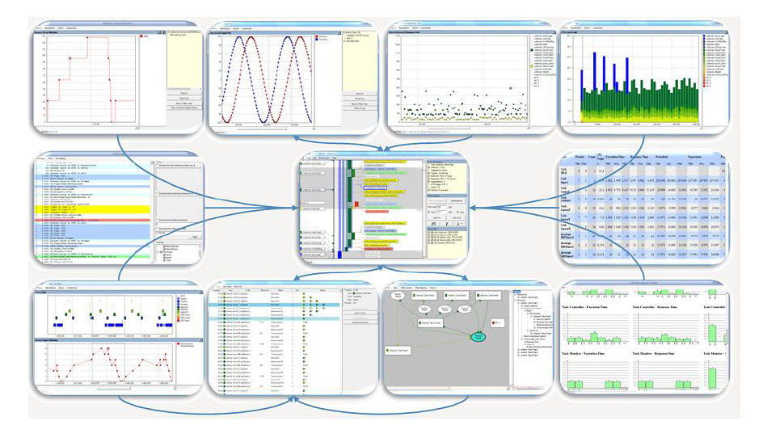
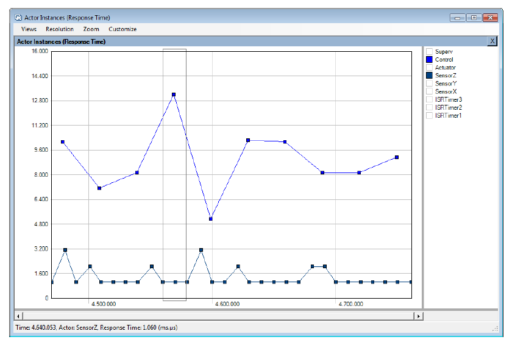
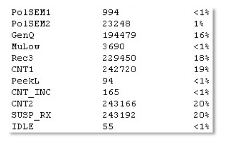
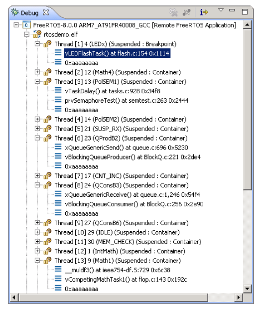

# 12 开发者支持

## 12.1 介绍

本章重点介绍一组旨在最大化开发效率的特性，通过以下方式实现：

- 提供应用程序行为洞察
- 突出优化机会
- 在错误发生时立即捕获

## 12.2 configASSERT()

在C语言中，宏`assert()`用于验证程序中做出的*断言*（假设）。断言以C表达式形式编写，如果表达式评估为假（0），则断言被视为失败。例如，清单12.1测试了指针`pxMyPointer`不为NULL的断言。

<a name="list12.1" title="清单12.1 使用标准C assert()宏检查pxMyPointer不为NULL"></a>

```c
/* 测试断言：pxMyPointer不为NULL */
assert( pxMyPointer != NULL );
```
***清单12.1*** *使用标准C assert()宏检查pxMyPointer不为NULL*

应用程序开发者通过提供`assert()`宏的实现来指定断言失败时应采取的操作。

FreeRTOS源代码不调用`assert()`，因为并非所有编译FreeRTOS的编译器都支持`assert()`。相反，FreeRTOS源代码中包含大量对宏`configASSERT()`的调用，该宏可由应用程序开发者在`FreeRTOSConfig.h`中定义，其行为与标准C的`assert()`完全相同。

失败的断言必须被视为致命错误。不要尝试在断言失败的行之后继续执行。

> *使用`configASSERT()`可以立即捕获并识别许多最常见的错误来源，从而提高开发效率。强烈建议在开发或调试FreeRTOS应用程序时定义`configASSERT()`。*

定义`configASSERT()`将极大地帮助运行时调试，但也会增加应用程序的代码大小，从而降低其执行速度。如果未提供`configASSERT()`的定义，则将使用默认的空定义，并且C预处理器将完全移除所有对`configASSERT()`的调用。


### 12.2.1 configASSERT() 定义示例

清单 12.2 中展示的 `configASSERT()` 定义在应用程序在调试器控制下执行时非常有用。它会在任何断言失败的代码行处暂停执行，因此当调试会话暂停时，调试器将显示断言失败的代码行。


<a name="list12.2" title="清单 12.2 一个简单的 configASSERT() 定义，适用于在调试器控制下执行时使用"></a>

```c
/* 禁用中断以停止 tick 中断执行，然后进入一个循环，以确保执行不会越过断言失败的行。
   如果硬件支持调试断点指令，则可以使用调试断点指令代替 for() 循环。 */

#define configASSERT( x ) if( ( x ) == 0 ) { taskDISABLE_INTERRUPTS(); for(;;); }
```
***清单 12.2*** *一个简单的 configASSERT() 定义，适用于在调试器控制下执行时使用*

清单 12.3 中展示的 `configASSERT()` 定义在应用程序未在调试器控制下执行时非常有用。它会打印或以其他方式记录断言失败的源代码行。断言失败的行通过标准 C 宏 `__FILE__` 获取源文件名，并通过标准 C 宏 `__LINE__` 获取源文件中的行号来标识。


<a name="list12.3" title="清单 12.3 一个记录断言失败源代码行的 configASSERT() 定义"></a>

```c
/* 此函数必须在 C 源文件中定义，而不是在 FreeRTOSConfig.h 头文件中。 */
void vAssertCalled( const char *pcFile, uint32_t ulLine )
{
    /* 在此函数内部，pcFile 保存包含错误检测行的源文件名，ulLine 保存源文件中的行号。
       在进入以下死循环之前，可以打印或以其他方式记录 pcFile 和 ulLine 值。 */
    RecordErrorInformationHere( pcFile, ulLine );

    /* 禁用中断以停止 tick 中断执行，然后进入一个循环，以确保执行不会越过断言失败的行。 */
    taskDISABLE_INTERRUPTS();
    for( ;; );
}
/*-----------------------------------------------------------*/

/* 以下两行必须放在 FreeRTOSConfig.h 中。 */
extern void vAssertCalled( const char *pcFile, unsigned long ulLine );
#define configASSERT( x ) if( ( x ) == 0 ) vAssertCalled( __FILE__, __LINE__ )
```
***清单 12.3*** *一个记录断言失败源代码行的 configASSERT() 定义*


## 12.3 FreeRTOS 的 Tracealyzer

FreeRTOS 的 Tracealyzer 是由我们的合作伙伴 Percepio 提供的一款运行时诊断和优化工具。

Tracealyzer for FreeRTOS 能够捕获有价值的动态行为信息，并以相互关联的图形视图展示这些信息。该工具还能够显示多个同步的视图。

在分析、故障排除或优化 FreeRTOS 应用程序时，捕获的信息具有极高的价值。

Tracealyzer for FreeRTOS 可以与传统的调试器并行使用，并通过更高层次、基于时间的视角来补充调试器的视图。

<a name="fig12.1" title="图 12.1 FreeRTOS+Trace 包含超过 20 个相互关联的视图"></a>
<a name="fig12.2" title="图 12.2 FreeRTOS+Trace 主跟踪视图 - 超过 20 个相互关联的跟踪视图之一"></a>
<a name="fig12.3" title="图 12.3 FreeRTOS+Trace CPU 负载视图 - 超过 20 个相互关联的跟踪视图之一"></a>
<a name="fig12.4" title="图 12.4 FreeRTOS+Trace 响应时间视图 - 超过 20 个相互关联的跟踪视图之一"></a>
<a name="fig12.5" title="图 12.5 FreeRTOS+Trace 用户事件绘图视图 - 超过 20 个相互关联的跟踪视图之一"></a>
<a name="fig12.6" title="图 12.6 FreeRTOS+Trace 内核对象历史视图 - 超过 20 个相互关联的跟踪视图之一"></a>

* * *
   
***图 12.1*** *FreeRTOS+Trace 包含超过 20 个相互关联的视图*

   
***图 12.2*** *FreeRTOS+Trace 主跟踪视图 - 超过 20 个相互关联的跟踪视图之一*

   
***图 12.3*** *FreeRTOS+Trace CPU 负载视图 - 超过 20 个相互关联的跟踪视图之一*

   
***图 12.4*** *FreeRTOS+Trace 响应时间视图 - 超过 20 个相互关联的跟踪视图之一*

   
***图 12.5*** *FreeRTOS+Trace 用户事件绘图视图 - 超过 20 个相互关联的跟踪视图之一*

   
***图 12.6*** *FreeRTOS+Trace 内核对象历史视图 - 超过 20 个相互关联的跟踪视图之一*
* * *


## 12.4 调试相关的钩子（回调）函数

### 12.4.1 Malloc失败钩子

malloc失败钩子（或回调）已在第3章“堆内存管理”中描述。

定义malloc失败钩子可确保在尝试创建任务、队列、信号量或事件组失败时，应用程序开发者能够立即收到通知。

### 12.4.2 栈溢出钩子

栈溢出钩子的详细信息在第13.3节“栈溢出”中提供。

定义栈溢出钩子可确保当任务使用的栈空间超过分配给该任务的栈空间时，应用程序开发者能够收到通知。

## 12.5 查看运行时和任务状态信息

### 12.5.1 任务运行时统计

任务运行时统计提供了每个任务所获得的处理时间信息。任务的*运行时间*是指自应用程序启动以来，任务处于运行状态的总时间。

运行时统计旨在作为项目开发阶段的性能分析和调试辅助工具。它们提供的信息仅在用作运行时统计时钟的计数器溢出之前有效。收集运行时统计会增加任务上下文切换的时间。

要获取二进制格式的运行时统计信息，可调用`uxTaskGetSystemState()` API函数。要获取人类可读的ASCII表格格式的运行时统计信息，可调用`vTaskGetRunTimeStatistics()`辅助函数。


### 12.5.2 运行时统计时钟

运行时统计需要测量小于一个节拍周期的部分时间。因此，RTOS 的节拍计数不用于运行时统计时钟，而是由应用程序代码提供时钟。建议使运行时统计时钟的频率比节拍中断的频率快 10 到 100 倍。运行时统计时钟越快，统计结果就越准确，但时间值溢出的速度也会越快。

理想情况下，时间值应由一个自由运行的 32 位外设定时器/计数器生成，该定时器的值可以无其他处理开销直接读取。如果可用的外设和时钟速度无法实现该技术，则可以使用以下效率较低的替代技术：

- 配置一个外设以按所需的运行时统计时钟频率生成周期性中断，然后使用生成的中断次数作为运行时统计时钟。

  如果周期性中断仅用于提供运行时统计时钟，则此方法效率非常低。然而，如果应用程序已经使用了具有合适频率的周期性中断，则在现有的中断服务例程中添加生成的中断次数计数是简单且高效的。

- 使用自由运行的 16 位外设定时器的当前值作为 32 位值的低 16 位，并使用定时器溢出的次数作为 32 位值的高 16 位来生成 32 位值。

通过适当且稍显复杂的操作，可以结合 RTOS 节拍计数和 ARM Cortex-M SysTick 定时器的当前值来生成运行时统计时钟。FreeRTOS 下载包中的一些演示项目展示了如何实现这一点。


### 12.5.3 配置应用程序以收集运行时统计信息

以下是收集任务运行时统计信息所需的宏的详细信息。最初，这些宏本意是包含在RTOS移植层中，这也是为什么宏的前缀是`port`，但实践证明在`FreeRTOSConfig.h`中定义它们更为实用。

**用于收集运行时统计信息的宏**

- `configGENERATE_RUN_TIME_STATS`

  必须在`FreeRTOSConfig.h`中将此宏设置为1。当此宏设置为1时，调度器将在适当的时间调用本节中详细描述的其他宏。

- `portCONFIGURE_TIMER_FOR_RUN_TIME_STATS()`

  必须提供此宏以初始化用于提供运行时统计时钟的外设。

- `portGET_RUN_TIME_COUNTER_VALUE()` 或 `portALT_GET_RUN_TIME_COUNTER_VALUE(Time)`

  必须提供这两个宏之一以返回当前的运行时统计时钟值。这是自应用程序首次启动以来，应用程序运行的总时间，以运行时统计时钟单位表示。

  如果使用第一个宏，则必须将其定义为评估当前时钟值。如果使用第二个宏，则必须将其定义为其`Time`参数设置为当前时钟值。


### 12.5.4 uxTaskGetSystemState() API 函数

`uxTaskGetSystemState()` 提供了 FreeRTOS 调度器控制下每个任务的状态信息快照。这些信息以 `TaskStatus_t` 结构体数组的形式提供，数组中的每个索引对应一个任务。`TaskStatus_t` 的结构如清单 12.5 及下文所述。

<a name="list12.4" title="清单 12.4 uxTaskGetSystemState() API 函数原型"></a>

```c
UBaseType_t uxTaskGetSystemState( TaskStatus_t * const pxTaskStatusArray,
                                  const UBaseType_t uxArraySize,
                                  configRUN_TIME_COUNTER_TYPE * const pulTotalRunTime );
```
***清单 12.4*** *uxTaskGetSystemState() API 函数原型*

> 注意：`configRUN_TIME_COUNTER_TYPE` 默认为 `uint32_t` 以保持向后兼容性，但如果 `uint32_t` 限制过大，可以在 FreeRTOSConfig.h 中覆盖此定义。

**uxTaskGetSystemState() 参数及返回值**

- `pxTaskStatusArray`

  指向 `TaskStatus_t` 结构体数组的指针。

数组必须为每个任务至少包含一个`TaskStatus_t`结构体。任务的数量可以使用`uxTaskGetNumberOfTasks()` API函数来确定。

`TaskStatus_t`结构体如清单12.5所示，其成员将在下文中描述。

- `uxArraySize`

  由`pxTaskStatusArray`参数指向的数组的大小。大小指定为数组中的索引数量（数组中包含的`TaskStatus_t`结构体的数量），而不是数组中的字节数。

- `pulTotalRunTime`

  如果在`FreeRTOSConfig.h`中将`configGENERATE_RUN_TIME_STATS`设置为1，则`uxTaskGetSystemState()`会将`*pulTotalRunTime`设置为自目标启动以来的总运行时间（由应用程序提供的运行时间统计时钟定义）。

  `pulTotalRunTime`是可选的，如果不需要总运行时间，可以将其设置为NULL。

- 返回值

  返回由`uxTaskGetSystemState()`填充的`TaskStatus_t`结构体的数量。

返回值应等于 `uxTaskGetNumberOfTasks()` API 函数返回的值，但如果传入 `uxArraySize` 参数的值太小，则返回值为零。

<a name="list12.5" title="Listing 12.5 The TaskStatus\_t structure"></a>

```c
typedef struct xTASK_STATUS
{
    TaskHandle_t xHandle;
    const char *pcTaskName;
    UBaseType_t xTaskNumber;
    eTaskState eCurrentState;
    UBaseType_t uxCurrentPriority;
    UBaseType_t uxBasePriority;
    configRUN_TIME_COUNTER_TYPE ulRunTimeCounter;
    StackType_t * pxStackBase;
    #if ( ( portSTACK_GROWTH > 0 ) || ( configRECORD_STACK_HIGH_ADDRESS == 1 ) )
        StackType_t * pxTopOfStack;
        StackType_t * pxEndOfStack;
    #endif
    uint16_t usStackHighWaterMark;
    #if ( ( configUSE_CORE_AFFINITY == 1 ) && ( configNUMBER_OF_CORES > 1 ) )
        UBaseType_t uxCoreAffinityMask;
    #endif
} TaskStatus_t;
```
***Listing 12.5*** *TaskStatus_t 结构体*

**TaskStatus_t 结构体成员**

- `xHandle`

  与该结构体中信息相关的任务句柄。

- `pcTaskName`

  任务的可读文本名称。

- `xTaskNumber`

  每个任务都有一个唯一的 `xTaskNumber` 值。

  如果应用程序在运行时创建和删除任务，那么可能会出现一个任务与之前删除的任务具有相同的句柄。`xTaskNumber` 提供了让应用程序代码和内核感知调试器区分有效任务和已删除任务（该已删除任务与有效任务具有相同的句柄）的方法。

- `eCurrentState`

  一个枚举类型，用于保存任务的状态。  
  `eCurrentState` 可以是以下值之一：

  - `eRunning`（运行中）
  - `eReady`（就绪）
  - `eBlocked`（阻塞）
  - `eSuspended`（挂起）
  - `eDeleted`（已删除）

  任务仅在调用 `vTaskDelete()` 删除任务后，到空闲任务释放分配给已删除任务的内部数据结构和堆栈内存的短暂时间内，会被报告为处于 `eDeleted` 状态。在此之后，任务将不再以任何形式存在，尝试使用其句柄将是无效的。

- `uxCurrentPriority`

  调用`uxTaskGetSystemState()`时任务正在运行的优先级。如果任务根据[8.3 互斥锁（和二进制信号量）](ch08.md#83-mutexes-and-binary-semaphores)一节中描述的优先级继承机制临时被分配了更高的优先级，`uxCurrentPriority`才会高于应用程序编写者分配给任务的优先级。

- `uxBasePriority`

  应用程序编写者分配给任务的优先级。只有在FreeRTOSConfig.h中将`configUSE_MUTEXES`设置为1时，`uxBasePriority`才有效。

- `ulRunTimeCounter`

  自任务创建以来所使用的总运行时间。总运行时间以绝对时间的形式提供，使用的是应用程序编写者提供的用于收集运行时统计信息的时钟。只有在FreeRTOSConfig.h中将`configGENERATE_RUN_TIME_STATS`设置为1时，`ulRunTimeCounter`才有效。

- `pxStackBase`

  指向分配给该任务的栈区域的基地址。

- `pxTopOfStack`

   指向分配给此任务的栈区域的当前顶部地址。  
   仅当栈向上增长（即`portSTACK_GROWTH`大于零）或在FreeRTOSConfig.h中`configRECORD_STACK_HIGH_ADDRESS`设置为1时，字段`pxTopOfStack`才有效。

- `pxEndOfStack`

   指向分配给此任务的栈区域的结束地址。  
   仅当栈向上增长（即`portSTACK_GROWTH`大于零）或在FreeRTOSConfig.h中`configRECORD_STACK_HIGH_ADDRESS`设置为1时，字段`pxEndOfStack`才有效。

- `usStackHighWaterMark`

   任务的栈高水位标记。这是自任务创建以来，任务栈中剩余的最小空间量。  
   它表示任务栈距离溢出的接近程度；该值越接近零，任务栈越接近溢出。`usStackHighWaterMark`以字节为单位指定。

- `uxCoreAffinityMask`

   一个按位表示的值，指示任务可以运行的核心。  
   核心编号从0到`configNUMBER_OF_CORES` - 1。例如，可以在核心0和核心1上运行的任务的`uxCoreAffinityMask`将设置为0x03。  
   仅在FreeRTOSConfig.h中`configUSE_CORE_AFFINITY`设置为1且`configNUMBER_OF_CORES`大于1时，字段`uxCoreAffinityMask`才可用。

### 12.5.5 vTaskListTasks() 辅助函数

`vTaskListTasks()` 提供了与 `uxTaskGetSystemState()` 类似的任务状态信息，但它将信息以人类可读的 ASCII 表格形式呈现，而不是二进制值数组。

`vTaskListTasks()` 是一个处理器密集型函数，会使调度器长时间处于挂起状态。因此，建议仅在调试时使用该函数，而不要在生产实时系统中使用。

如果 FreeRTOSConfig.h 中的 `configUSE_TRACE_FACILITY` 设置为 1 且 `configUSE_STATS_FORMATTING_FUNCTIONS` 设置为大于 0 的值，则 `vTaskListTasks()` 可用。

<a name="list12.6" title="Listing 12.6 The vTaskListTasks() API function prototype"></a>

```c
void vTaskListTasks( char * pcWriteBuffer, size_t uxBufferLength );
```
***代码清单 12.6*** *vTaskListTasks() API 函数原型*

**vTaskListTasks() 参数**

- `pcWriteBuffer`

  指向字符缓冲区的指针，格式化后的人类可读表格将写入该缓冲区。  
  假设该缓冲区足够大以容纳生成的报告。  
  每个任务大约需要 40 字节。

- `uxBufferLength`

  `pcWriteBuffer` 的长度。

图 12.7 展示了 `vTaskListTasks()` 生成的输出示例。在输出中：

- 每一行提供单个任务的信息。

- 第一列是任务的名称。

- 第二列是任务的状态，其中 'X' 表示正在运行，'R' 表示就绪，'B' 表示阻塞，'S' 表示挂起，'D' 表示任务已被删除。  
  任务仅在调用 `vTaskDelete()` 删除任务后，到空闲任务释放分配给被删除任务的内部数据结构和堆栈的内存之前的短时间内，报告为已删除状态。之后，任务将不再以任何形式存在，尝试使用其句柄是无效的。

- 第三列是任务的优先级。

- 第四列是任务的堆栈高水位标记。请参阅 `usStackHighWaterMark` 的描述。

- 第五列是分配给任务的唯一编号。请参阅 `xTaskNumber` 的描述。

<a name="fig12.7" title="Figure 12.7 Example output generated by vTaskListTasks()"></a>

* * *
   
***图 12.7*** *vTaskListTasks() 生成的输出示例*
* * *

> 注意：  
> `vTaskListTasks` 的旧版本是 `vTaskList`。`vTaskList` 假设 `pcWriteBuffer` 的长度为 `configSTATS_BUFFER_MAX_LENGTH`。此函数仅用于向后兼容。建议新应用程序使用 `vTaskListTasks` 并显式提供 `pcWriteBuffer` 的长度。

<a name="list12.7" title="Listing 12.7 The vTaskList() API function prototype"></a>

```c
void vTaskList( signed char *pcWriteBuffer );
```
***代码清单 12.7*** *vTaskList() API 函数原型*

**vTaskList() 参数**

- `pcWriteBuffer`
  
  指向字符缓冲区的指针，格式化后的人类可读表格将写入该缓冲区。  
  缓冲区必须足够大以容纳整个表格，因为不会执行边界检查。


### 12.5.6 vTaskGetRunTimeStatistics() 辅助函数

`vTaskGetRunTimeStatistics()` 将收集到的运行时统计信息格式化为人类可读的 ASCII 表格。

`vTaskGetRunTimeStatistics()` 是一个处理器密集型函数，会长时间挂起调度器。因此，建议仅在调试时使用此函数，而不要在生产实时系统中使用。

当在 FreeRTOSConfig.h 中将 `configGENERATE_RUN_TIME_STATS` 设置为 1，`configUSE_STATS_FORMATTING_FUNCTIONS` 设置为大于 0 的值，并且 `configUSE_TRACE_FACILITY` 设置为 1 时，`vTaskGetRunTimeStatistics()` 可用。

<a name="list12.8" title="Listing 12.8 The vTaskGetRunTimeStatistics() API function prototype"></a>

```c
void vTaskGetRunTimeStatistics( char * pcWriteBuffer, size_t uxBufferLength );
```
***清单 12.8*** *vTaskGetRunTimeStatistics() API 函数原型*

**vTaskGetRunTimeStatistics() 参数**

- `pcWriteBuffer`

  指向字符缓冲区的指针，格式化后的可读表格将写入该缓冲区。假定该缓冲区足够大以容纳生成的报告。每个任务大约需要 40 字节。

- `uxBufferLength`

  `pcWriteBuffer` 的长度。

图 12.8 展示了 `vTaskGetRunTimeStatistics()` 生成的输出示例。在输出中：

- 每行提供单个任务的信息。

- 第一列是任务名称。

- 第二列是任务在运行状态中花费的时间的绝对值。请参阅 `ulRunTimeCounter` 的描述。

- 第三列是任务在运行状态中花费的时间占目标启动以来总时间的百分比。显示的百分比总和通常小于预期的 100%，因为统计信息是使用整数计算收集和计算的，这些计算会向下舍入到最接近的整数值。

<a name="fig12.8" title="Figure 12.8 Example output generated by vTaskGetRunTimeStatistics()"></a>

* * *
   
***图 12.8*** *vTaskGetRunTimeStatistics() 生成的输出示例*
* * *

> 注意：   
> `vTaskGetRunTimeStatistics` 的旧版本是 `vTaskGetRunTimeStats`。 
> `vTaskGetRunTimeStats` 假定 `pcWriteBuffer` 的长度为 `configSTATS_BUFFER_MAX_LENGTH`。此函数仅用于向后兼容。 
> 建议新应用程序使用 `vTaskGetRunTimeStatistics` 并明确提供 `pcWriteBuffer` 的长度。

<a name="list12.9" title="Listing 12.9 The vTaskGetRunTimeStats() API function prototype"></a>

```c
void vTaskGetRunTimeStats( signed char *pcWriteBuffer );
```
***清单 12.9*** *vTaskGetRunTimeStats() API 函数原型*
 
**vTaskGetRunTimeStats() 参数**

- `pcWriteBuffer`

  指向字符缓冲区的指针，格式化后的可读表格将写入该缓冲区。缓冲区必须足够大以容纳整个表格，因为不会执行边界检查。


### 12.5.7 生成和显示运行时统计信息的示例

本示例使用一个假设的16位定时器生成一个32位的运行时统计时钟。定时器配置为在16位值达到最大值时产生中断——实际上创建了一个溢出中断。中断服务程序用于统计溢出发生的次数。

32位值是通过将溢出次数作为32位值的两个最高有效字节，当前16位计数器值作为32位值的两个最低有效字节来创建的。中断服务程序的伪代码如清单12.10所示。


<a name="list12.10" title="清单12.10 用于统计定时器溢出次数的16位定时器溢出中断处理程序"></a>

```c
void TimerOverflowInterruptHandler( void )
{
    /* 仅统计中断次数。 */
    ulOverflowCount++;

    /* 清除中断。 */
    ClearTimerInterrupt();
}
```
***清单12.10*** *用于统计定时器溢出次数的16位定时器溢出中断处理程序*

清单12.11展示了添加到FreeRTOSConfig.h中以启用运行时统计信息收集的代码行。

<a name="list12.11" title="清单 12.11 添加到 FreeRTOSConfig.h 中以启用运行时统计信息收集的宏"></a>

```c
/* 将 configGENERATE_RUN_TIME_STATS 设置为 1 以启用运行时统计信息的收集。
   启用后，还必须定义 portCONFIGURE_TIMER_FOR_RUN_TIME_STATS() 和 
   portGET_RUN_TIME_COUNTER_VALUE() 或 portALT_GET_RUN_TIME_COUNTER_VALUE(x)。 */
#define configGENERATE_RUN_TIME_STATS 1

/* portCONFIGURE_TIMER_FOR_RUN_TIME_STATS() 被定义为调用设置假设的 16 位定时器的函数
   （该函数的实现未显示）。 */
void vSetupTimerForRunTimeStats( void );
#define portCONFIGURE_TIMER_FOR_RUN_TIME_STATS()  vSetupTimerForRunTimeStats()

/* portALT_GET_RUN_TIME_COUNTER_VALUE() 被定义为将其参数设置为当前的运行时计数器/时间值。
   返回的时间值为 32 位长，通过将 16 位定时器溢出计数移位到 32 位数的前两个字节，
   然后与当前的 16 位计数器值进行按位 OR 运算形成。 */
#define portALT_GET_RUN_TIME_COUNTER_VALUE( ulCountValue )                  \
{                                                                           \
    extern volatile unsigned long ulOverflowCount;                          \
                                                                            \
    /* 断开时钟与计数器的连接，以防止在使用其值时发生改变。 */                   \
    PauseTimer();                                                           \
                                                                            \
    /* 将溢出次数移位到返回的 32 位值的前两个字节中。 */                       \
    ulCountValue = ( ulOverflowCount << 16UL );                             \
                                                                            \
    /* 将当前计数器值用作返回的 32 位值的后两个字节。 */                       \
    ulCountValue |= ( unsigned long ) ReadTimerCount();                     \
                                                                            \
    /* 重新连接时钟与计数器。 */                                             \
    ResumeTimer();                                                          \
}
```
***清单 12.11*** *添加到 FreeRTOSConfig.h 中以启用运行时统计信息收集的宏*

清单 12.12 中所示的任务每 5 秒打印一次收集到的运行时统计信息。

<a name="list12.12" title="代码清单 12.12 打印收集到的运行时统计信息的任务"></a>

```c
#define RUN_TIME_STATS_STRING_BUFFER_LENGTH       512

/* 为了清晰起见，此代码清单中省略了对 fflush() 的调用。 */
static void prvStatsTask( void *pvParameters )
{
    TickType_t xLastExecutionTime;

    /* 用于保存格式化后的运行时统计信息文本的缓冲区需要较大空间。因此将其声明为静态变量，
       以确保它不会分配在任务栈上。这使得该函数不可重入。 */
    static signed char cStringBuffer[ RUN_TIME_STATS_STRING_BUFFER_LENGTH ];

    /* 该任务将每 5 秒运行一次。 */
    const TickType_t xBlockPeriod = pdMS_TO_TICKS( 5000 );

    /* 将 xLastExecutionTime 初始化为当前时间。这是唯一需要显式写入该变量的地方。
       之后它会在 vTaskDelayUntil() API 函数内部自动更新。 */
    xLastExecutionTime = xTaskGetTickCount();

    /* 与大多数任务一样，该任务在一个无限循环中实现。 */
    for( ;; )
    {
        /* 等待直到再次运行该任务的时间。 */
        xTaskDelayUntil( &xLastExecutionTime, xBlockPeriod );

        /* 从运行时统计信息生成一个文本表格。该表格必须能够放入 cStringBuffer 数组中。 */
        vTaskGetRunTimeStatistics( cStringBuffer, RUN_TIME_STATS_STRING_BUFFER_LENGTH );

        /* 打印运行时统计信息表格的列标题。 */
        printf( "\nTask\t\tAbs\t\t\t%%\n" );
        printf( "-------------------------------------------------------------\n" );

        /* 打印运行时统计信息本身。数据表格包含多行，因此调用 vPrintMultipleLines() 函数，
           而不是直接调用 printf()。vPrintMultipleLines() 只是逐行调用 printf()，
           以确保行缓冲按预期工作。 */
        vPrintMultipleLines( cStringBuffer );
    }
}
```
***代码清单 12.12*** *打印收集到的运行时统计信息的任务*


## 12.6 跟踪钩子宏

跟踪宏是放置在FreeRTOS源代码关键位置的宏。默认情况下，这些宏为空，因此不会生成任何代码，也不会产生运行时开销。通过覆盖默认的空实现，应用程序开发者可以：

- 在不修改FreeRTOS源文件的情况下将代码插入FreeRTOS。
- 通过目标硬件可用的任何方式输出详细的执行序列信息。跟踪宏在FreeRTOS源代码中出现的次数足够多，可以用于创建完整且详细的调度器活动跟踪和分析日志。

### 12.6.1 可用的跟踪钩子宏

由于篇幅限制，这里无法详细列出每个宏。以下列出了对应用程序开发者最有用的宏子集。

许多描述中提到了一个名为`pxCurrentTCB`的变量。`pxCurrentTCB`是FreeRTOS的一个私有变量，用于保存处于运行状态的任务的句柄，并且可以从FreeRTOS/Source/tasks.c源文件中调用的任何宏中访问。

**常用的跟踪钩子宏**

- `traceTASK_INCREMENT_TICK(xTickCount)`

  在tick中断期间调用，在tick计数递增之前。`xTickCount`参数将新的tick计数值传递给宏。

- `traceTASK_SWITCHED_OUT()`

  在选择新任务运行之前调用。此时，`pxCurrentTCB`包含即将离开运行状态的任务的句柄。

- `traceTASK_SWITCHED_IN()`

  在选择任务运行之后调用。此时，`pxCurrentTCB`包含即将进入运行状态的任务的句柄。

- `traceBLOCKING_ON_QUEUE_RECEIVE(pxQueue)`
  
  在当前执行任务尝试从空队列读取或尝试获取空的信号量或互斥量后进入阻塞状态之前立即调用。`pxQueue`参数将目标队列或信号量的句柄传递给宏。

- `traceBLOCKING_ON_QUEUE_SEND(pxQueue)`
  
  在当前执行任务尝试写入已满的队列后进入阻塞状态之前立即调用。`pxQueue`参数将目标队列的句柄传递给宏。

- `traceQUEUE_SEND(pxQueue)`
  
  在`xQueueSend()`、`xQueueSendToFront()`、`xQueueSendToBack()`或任何信号量“give”函数中调用，当队列发送或信号量“give”成功时。`pxQueue`参数将目标队列或信号量的句柄传递给宏。

- `traceQUEUE_SEND_FAILED(pxQueue)`

  在`xQueueSend()`、`xQueueSendToFront()`、`xQueueSendToBack()`或任何信号量“give”函数中调用，当队列发送或信号量“give”操作失败时。如果队列已满并且在指定的阻塞时间内保持满状态，则队列发送或信号量“give”将失败。`pxQueue`参数将目标队列或信号量的句柄传递给宏。

- `traceQUEUE_RECEIVE(pxQueue)`

  在`xQueueReceive()`或任何信号量“take”函数中调用，当队列接收或信号量“take”成功时。`pxQueue`参数将目标队列或信号量的句柄传递给宏。

- `traceQUEUE_RECEIVE_FAILED(pxQueue)`

  在`xQueueReceive()`或任何信号量“take”函数中调用，当队列或信号量接收操作失败时。如果队列或信号量为空并且在指定的阻塞时间内保持空状态，则队列接收或信号量“take”操作将失败。`pxQueue`参数将目标队列或信号量的句柄传递给宏。

- `traceQUEUE_SEND_FROM_ISR(pxQueue)`

  在`xQueueSendFromISR()`中调用，当发送操作成功时。`pxQueue`参数将目标队列的句柄传递给宏。

- `traceQUEUE_SEND_FROM_ISR_FAILED(pxQueue)`

  在`xQueueSendFromISR()`中调用，当发送操作失败时。如果队列已满，则发送操作将失败。`pxQueue`参数将目标队列的句柄传递给宏。

- `traceQUEUE_RECEIVE_FROM_ISR(pxQueue)`

  在`xQueueReceiveFromISR()`中调用，当接收操作成功时。`pxQueue`参数将目标队列的句柄传递给宏。

- `traceQUEUE_RECEIVE_FROM_ISR_FAILED(pxQueue)`

  在`xQueueReceiveFromISR()`中调用，当由于队列已经为空而导致接收操作失败时。`pxQueue`参数将目标队列的句柄传递给宏。

- `traceTASK_DELAY_UNTIL( xTimeToWake )`

  在`xTaskDelayUntil()`中调用，在调用任务进入阻塞状态之前立即调用。

- `traceTASK_DELAY()`

  在`vTaskDelay()`中调用，在调用任务进入阻塞状态之前立即调用。


### 12.6.2 定义跟踪钩子宏

每个跟踪宏都有一个默认的空定义。通过在 `FreeRTOSConfig.h` 文件中提供新的宏定义，可以覆盖默认定义。如果跟踪宏的定义变得冗长或复杂，则可以在一个新的头文件中实现这些宏，然后将该头文件包含到 `FreeRTOSConfig.h` 中。

根据软件工程的最佳实践，FreeRTOS 维护了严格的数据隐藏策略。跟踪宏允许用户代码添加到 FreeRTOS 源文件中，因此跟踪宏可见的数据类型与应用程序代码可见的数据类型不同：

- 在 `FreeRTOS/Source/tasks.c` 源文件中，任务句柄是指向描述任务的数据结构（任务的 *任务控制块*，即 *TCB*）的指针。而在 `FreeRTOS/Source/tasks.c` 源文件之外，任务句柄是一个指向 `void` 的指针。

- 在 `FreeRTOS/Source/queue.c` 源文件中，队列句柄是指向描述队列的数据结构的指针。而在 `FreeRTOS/Source/queue.c` 源文件之外，队列句柄是一个指向 `void` 的指针。

> *如果跟踪宏直接访问通常为私有的 FreeRTOS 数据结构，则需要极其小心，因为私有数据结构可能会在 FreeRTOS 版本之间发生变化。*


### 12.6.3 支持FreeRTOS的调试器插件

以下IDE提供了一些支持FreeRTOS的插件。此列表可能不完全：



- Eclipse（StateViewer）
- Eclipse（ThreadSpy）
- IAR
- ARM DS-5
- Atollic TrueStudio
- Microchip MPLAB
- iSYSTEM WinIDEA
- STM32CubeIDE

