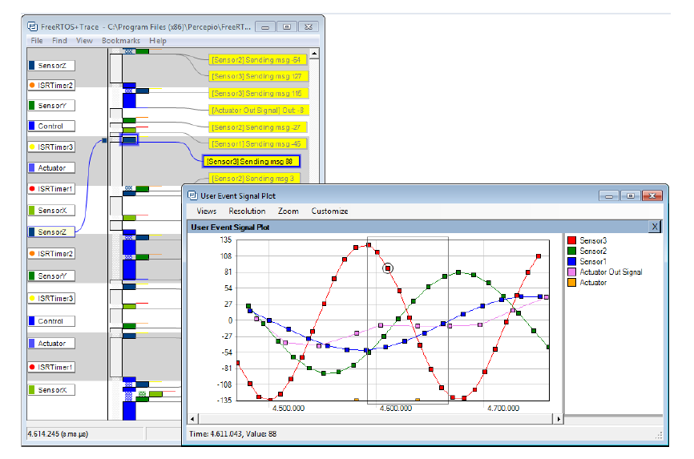

# 12 开发者支持

## 12.1 引言

本章介绍了一组功能，旨在通过以下方式最大化生产力：
- 提供应用程序行为的洞察力。
- 强调优化的机会。
- 在错误发生的地方捕获错误。

## 12.2 configASSERT()

在C语言中，宏 `assert()` 用于验证程序所做的*断言*（假设）。断言以C表达式的形式编写，如果表达式的值为假（0），则认为断言失败。例如，清单12.1测试指针 `pxMyPointer` 不是NULL的断言。

<a name="list12.1" title="清单12.1 使用标准C assert()宏检查pxMyPointer不是NULL"></a>

```c
/* 测试断言pxMyPointer不是NULL */
assert( pxMyPointer != NULL );
```
***清单12.1*** *使用标准C assert()宏检查pxMyPointer不是NULL*

应用程序编写者通过提供 `assert()` 宏的实现来指定断言失败时要采取的操作。

FreeRTOS源代码不调用 `assert()`，因为 `assert()` 并非所有编译FreeRTOS的编译器都可用。相反，FreeRTOS源代码包含大量对名为 `configASSERT()` 的宏的调用，该宏可以在 `FreeRTOSConfig.h` 中由应用程序编写者定义，并且其行为与标准C `assert()` 完全相同。

失败的断言必须被视为致命错误。不要尝试执行超过失败断言的行。

> *使用 `configASSERT()` 可以通过立即捕获和识别许多最常见的错误来源来提高生产力。强烈建议在开发或调试FreeRTOS应用程序时定义 `configASSERT()`。*

定义 `configASSERT()` 将大大帮助运行时调试，但也会增加应用程序代码的大小，从而减慢其执行速度。如果未提供 `configASSERT()` 的定义，则将使用默认的空定义，并且所有对 `configASSERT()` 的调用都将被C预处理器完全删除。


### 12.2.1 configASSERT() 示例定义

Listing 12.2 中显示的 `configASSERT()` 定义在应用程序在调试器的控制下执行时非常有用。它会在任何失败断言的行上停止执行，因此当调试会话暂停时，调试器显示的行将是失败断言的行。

<a name="list12.2" title="Listing 12.2 在调试器控制下执行时有用的简单 configASSERT() 定义"></a>

```c
/* 禁用中断以停止计时中断的执行，然后进入循环，以便执行不会超过失败断言的行。如果硬件支持调试中断指令，则可以使用调试中断指令代替 for() 循环。 */

#define configASSERT( x ) if( ( x ) == 0 ) { taskDISABLE_INTERRUPTS(); for(;;); }
```
***Listing 12.2*** *在调试器控制下执行时有用的简单 configASSERT() 定义*

Listing 12.3 中显示的 `configASSERT()` 定义在应用程序不在调试器的控制下执行时非常有用。它会输出或以其他方式记录失败断言的源代码行。失败断言的行使用标准 C `__FILE__` 宏获取源文件的名称，并使用标准 C `__LINE__` 宏获取源文件中的行号。

<a name="list12.3" title="Listing 12.3 记录失败断言的源代码行的 configASSERT() 定义"></a>

```c
/* 此函数必须在 C 源文件中定义，而不是在 FreeRTOSConfig.h 头文件中。 */
void vAssertCalled( const char *pcFile, uint32_t ulLine )
{
    /* 在此函数中，pcFile 保存包含检测到错误的行的源文件的名称，ulLine 保存源文件中的行号。在进入以下无限循环之前，可以输出或以其他方式记录 pcFile 和 ulLine 值。 */
    RecordErrorInformationHere( pcFile, ulLine );

    /* 禁用中断以停止计时中断的执行，然后进入循环，以便执行不会超过失败断言的行。 */
    taskDISABLE_INTERRUPTS();
    for( ;; );
}
/*-----------------------------------------------------------*/

/* 以下两行必须放在 FreeRTOSConfig.h 中。 */
extern void vAssertCalled( const char *pcFile, unsigned long ulLine );
#define configASSERT( x ) if( ( x ) == 0 ) vAssertCalled( __FILE__, __LINE__ )
```
***Listing 12.3*** *记录失败断言的源代码行的 configASSERT() 定义*


## 12.3 FreeRTOS的Tracealyzer

FreeRTOS的Tracealyzer是由我们的合作伙伴公司Percepio提供的运行时诊断和优化工具。

FreeRTOS的Tracealyzer捕获有价值的动态行为信息，然后以相互连接的图形视图呈现捕获的信息。该工具还能够显示多个同步视图。

在分析、故障排除或简单优化FreeRTOS应用程序时，捕获的信息非常有价值。

FreeRTOS的Tracealyzer可以与传统调试器并行使用，并用基于时间的高层视角补充调试器的视图。

<a name="fig12.1" title="图12.1 FreeRTOS+Trace 包含超过20个相互连接的视图"></a>
<a name="fig12.2" title="图12.2 FreeRTOS+Trace 主跟踪视图 - 多个相互连接的跟踪视图之一"></a>
<a name="fig12.3" title="图12.3 FreeRTOS+Trace CPU负载视图 - 多个相互连接的跟踪视图之一"></a>
<a name="fig12.4" title="图12.4 FreeRTOS+Trace 响应时间视图 - 多个相互连接的跟踪视图之一"></a>
<a name="fig12.5" title="图12.5 FreeRTOS+Trace 用户事件图视图 - 多个相互连接的跟踪视图之一"></a>
<a name="fig12.6" title="图12.6 FreeRTOS+Trace 内核对象历史视图 - 多个相互连接的跟踪视图之一"></a>

* * *

***图12.1*** *FreeRTOS+Trace 包含超过20个相互连接的视图*


***图12.2*** *FreeRTOS+Trace 主跟踪视图 - 多个相互连接的跟踪视图之一*


***图12.3*** *FreeRTOS+Trace CPU负载视图 - 多个相互连接的跟踪视图之一*


***图12.4*** *FreeRTOS+Trace 响应时间视图 - 多个相互连接的跟踪视图之一*


***图12.5*** *FreeRTOS+Trace 用户事件图视图 - 多个相互连接的跟踪视图之一*


***图12.6*** *FreeRTOS+Trace 内核对象历史视图 - 多个相互连接的跟踪视图之一*
* * *


## 12.4 调试相关的钩子（回调）函数

### 12.4.1 内存分配失败钩子

内存分配失败钩子（或回调）在第三章，堆内存管理中有描述。

定义一个内存分配失败钩子可以确保应用程序开发者在尝试创建任务、队列、信号量或事件组失败时立即收到通知。

### 12.4.2 栈溢出钩子

栈溢出钩子的详细信息在13.3节，栈溢出中提供。

定义一个栈溢出钩子可以确保应用程序开发者在任务使用的栈空间超过分配给任务的栈空间时收到通知。

## 12.5 查看运行时和任务状态信息

### 12.5.1 任务运行时统计信息

任务运行时统计信息提供了每个任务获得的处理时间量的信息。任务的*运行时间*是任务自应用程序启动以来处于运行状态的总时间。

运行时统计信息旨在作为项目开发阶段的分析和调试工具。它们提供的信息只有在用作运行时统计信息时钟的计数器溢出之前才有效。收集运行时统计信息将增加任务上下文切换时间。

要获取二进制运行时统计信息，请调用`uxTaskGetSystemState()` API函数。要以人类可读的ASCII表格形式获取运行时统计信息，请调用`vTaskGetRunTimeStatistics()`辅助函数。


### 12.5.2 运行时统计时钟

运行时统计需要测量刻度周期的分数。因此，RTOS刻度计数不作为运行时统计时钟使用，而是由应用程序代码提供时钟。建议将运行时统计时钟的频率设置为刻度中断频率的10到100倍。运行时统计时钟越快，统计数据越准确，但时间值也会更快溢出。

理想情况下，时间值应由一个自由运行的32位外围计时器/计数器生成，其值可以在没有其他处理开销的情况下读取。如果可用的外围设备和时钟速度无法实现该技术，则可以使用以下替代但效率较低的技术：

- 配置外围设备以在所需的运行时统计时钟频率生成周期性中断，然后使用生成的中断数量作为运行时统计时钟。

  如果周期性中断仅用于提供运行时统计时钟，则该方法效率非常低。然而，如果应用程序已经使用具有适当频率的周期性中断，则在现有的中断服务例程中添加生成的中断数量的计数是简单且高效的。

- 通过使用自由运行的16位外围计时器的当前值作为32位值的低16位，以及计时器溢出的次数作为32位值的高16位，生成一个32位值。

  通过适当且相对复杂的操作，可以通过结合RTOS刻度计数和ARM Cortex-M SysTick计时器的当前值来生成运行时统计时钟。FreeRTOS下载中的一些演示项目展示了如何实现这一点。


### 12.5.3 配置应用程序以收集运行时统计信息

以下是收集任务运行时统计信息所需的宏的详细信息。最初，这些宏旨在包含在RTOS端口层中，这就是为什么这些宏前缀为'port'，但事实证明在`FreeRTOSConfig.h`中定义它们更为实际。

**用于收集运行时统计信息的宏**

- `configGENERATE_RUN_TIME_STATS`

  此宏必须在FreeRTOSConfig.h中设置为1。当此宏设置为1时，调度程序将在适当的时间调用本节中详细说明的其他宏。

- `portCONFIGURE_TIMER_FOR_RUN_TIME_STATS()`

  此宏必须提供以初始化用于提供运行时统计信息时钟的外围设备。

- `portGET_RUN_TIME_COUNTER_VALUE()`，或 `portALT_GET_RUN_TIME_COUNTER_VALUE(Time)`

  必须提供这两个宏之一，以返回当前运行时统计信息时钟值。这是自应用程序首次启动以来应用程序运行的总时间，以运行时统计信息时钟单位表示。

  如果使用第一个宏，必须定义为评估为当前时钟值。如果使用第二个宏，必须定义为将其'Time'参数设置为当前时钟值。


### 12.5.4 uxTaskGetSystemState() API 函数

`uxTaskGetSystemState()` 提供了 FreeRTOS 调度器控制下每个任务的状态信息快照。信息以 `TaskStatus_t` 结构数组的形式提供，数组中的每个索引对应一个任务。`TaskStatus_t` 由清单 12.5 和下面的描述。

<a name="list12.4" title="清单 12.4 uxTaskGetSystemState() API 函数原型"></a>

```c
UBaseType_t uxTaskGetSystemState( TaskStatus_t * const pxTaskStatusArray,
                                  const UBaseType_t uxArraySize,
                                  configRUN_TIME_COUNTER_TYPE * const pulTotalRunTime );
```
***清单 12.4*** *uxTaskGetSystemState() API 函数原型*

> 注意：`configRUN_TIME_COUNTER_TYPE` 默认为 `uint32_t` 以保持向后兼容性，但如果 `uint32_t` 过于限制，可以在 FreeRTOSConfig.h 中重写。

**uxTaskGetSystemState() 参数和返回值**

- `pxTaskStatusArray`

  指向 `TaskStatus_t` 结构数组的指针。

数组必须至少包含一个 `TaskStatus_t` 结构体，用于每个任务。任务的数量可以使用 `uxTaskGetNumberOfTasks()` API 函数来确定。

`TaskStatus_t` 结构体如清单 12.5 所示，下面列出了 `TaskStatus_t` 结构体的成员。

- `uxArraySize`

  `pxTaskStatusArray` 参数指向的数组的大小。大小指定为数组中的索引数（数组中包含的 `TaskStatus_t` 结构体的数量），而不是数组中的字节数。

- `pulTotalRunTime`

  如果在 `FreeRTOSConfig.h` 中将 `configGENERATE_RUN_TIME_STATS` 设置为 1，则 `*pulTotalRunTime` 将由 `uxTaskGetSystemState()` 设置为自目标启动以来的总运行时间（由应用程序提供的运行时间统计时钟定义）。

  `pulTotalRunTime` 是可选的，如果不需要总运行时间，可以将其设置为 NULL。

- 返回值

  由 `uxTaskGetSystemState()` 返回的 `TaskStatus_t` 结构体的数量。

返回的值应等于 `uxTaskGetNumberOfTasks()` API 函数返回的数值，但如果传递给 `uxArraySize` 参数的值过小，则返回值将为零。

<a name="list12.5" title="Listing 12.5 The TaskStatus\_t structure"></a>

```c
typedef struct xTASK_STATUS
{
    TaskHandle_t xHandle;
    const char *pcTaskName;
    UBaseType_t xTaskNumber;
    eTaskState eCurrentState;
    UBaseType_t uxCurrentPriority;
    UBaseType_t uxBasePriority;
    configRUN_TIME_COUNTER_TYPE ulRunTimeCounter;
    StackType_t * pxStackBase;
    #if ( ( portSTACK_GROWTH > 0 ) || ( configRECORD_STACK_HIGH_ADDRESS == 1 ) )
        StackType_t * pxTopOfStack;
        StackType_t * pxEndOfStack;
    #endif
    uint16_t usStackHighWaterMark;
    #if ( ( configUSE_CORE_AFFINITY == 1 ) && ( configNUMBER_OF_CORES > 1 ) )
        UBaseType_t uxCoreAffinityMask;
    #endif
} TaskStatus_t;
```
***Listing 12.5*** *The TaskStatus\_t structure*

**TaskStatus_t 结构成员**

- `xHandle`

  与结构中信息相关的任务的句柄。

- `pcTaskName`

  任务的可读文本名称。

- `xTaskNumber`

  每个任务都有一个唯一的 `xTaskNumber` 值。

  如果应用程序在运行时创建和删除任务，那么可能会出现一个任务与之前删除的任务具有相同句柄的情况。`xTaskNumber` 提供了应用程序代码和内核感知调试器区分仍然有效的任务和具有相同句柄的已删除任务的方法。

- `eCurrentState`

  一个枚举类型，保存任务的状态。`eCurrentState` 可以是以下值之一：

  - `eRunning`
  - `eReady`
  - `eBlocked`
  - `eSuspended`
  - `eDeleted`

  任务只会在调用 `vTaskDelete()` 删除任务的短暂时间内被报告为处于 `eDeleted` 状态，直到空闲任务释放分配给已删除任务的内部数据结构和堆栈的内存为止。在那之后，任务将不再以任何方式存在，尝试使用其句柄是无效的。

- `uxCurrentPriority`

  调用 `uxTaskGetSystemState()` 时任务正在运行的优先级。`uxCurrentPriority` 仅在任务根据第 [8.3 互斥锁（和二进制信号量）](ch08.md#83-mutexes-and-binary-semaphores) 部分描述的优先级继承机制临时被分配了更高优先级时，才会高于应用程序编写者分配给任务的优先级。

- `uxBasePriority`

  应用程序编写者分配给任务的优先级。`uxBasePriority` 仅在 `configUSE_MUTEXES` 在 FreeRTOSConfig.h 中设置为 1 时有效。

- `ulRunTimeCounter`

  自任务创建以来任务使用的总运行时间。总运行时间以应用程序编写者为收集运行时间统计信息提供的时钟提供的绝对时间形式给出。`ulRunTimeCounter` 仅在 `configGENERATE_RUN_TIME_STATS` 在 FreeRTOSConfig.h 中设置为 1 时有效。

- `pxStackBase`

  指向分配给该任务的堆栈区域的基地址。

- `pxTopOfStack`

   指向分配给该任务的堆栈区域的当前顶部地址。
   字段 `pxTopOfStack` 仅在堆栈向上增长（即 `portSTACK_GROWTH` 大于零）或在 FreeRTOSConfig.h 中将 `configRECORD_STACK_HIGH_ADDRESS` 设置为 1 时有效。

- `pxEndOfStack`

   指向分配给该任务的堆栈区域的末尾地址。
   字段 `pxEndOfStack` 仅在堆栈向上增长（即 `portSTACK_GROWTH` 大于零）或在 FreeRTOSConfig.h 中将 `configRECORD_STACK_HIGH_ADDRESS` 设置为 1 时有效。

- `usStackHighWaterMark`

  任务的堆栈高水位标记。这是自任务创建以来任务剩余的最小堆栈空间量。
  它是任务堆栈溢出的指示；该值越接近零，任务越接近堆栈溢出。`usStackHighWaterMark` 以字节为单位指定。

- `uxCoreAffinityMask`

   一个位掩码值，指示任务可以在其上运行的核心。
   核心从 0 到 `configNUMBER_OF_CORES` - 1 编号。例如，可以在核心 0 和核心 1 上运行的任务将其 `uxCoreAffinityMask` 设置为 0x03。字段 `uxCoreAffinityMask` 仅在 FreeRTOSConfig.h 中将 `configUSE_CORE_AFFINITY` 设置为 1 且 `configNUMBER_OF_CORES` 设置为大于 1 时可用。

### 12.5.5 vTaskListTasks() 辅助函数

`vTaskListTasks()` 提供与 `uxTaskGetSystemState()` 类似的任务状态信息，但以人类可读的ASCII表格形式呈现，而不是二进制值数组。

`vTaskListTasks()` 是一个非常耗费处理器资源的函数，并且会暂停调度器一段时间。因此，建议仅在调试目的下使用该函数，而不在生产实时系统中使用。

如果在 FreeRTOSConfig.h 中将 `configUSE_TRACE_FACILITY` 设置为 1，并且将 `configUSE_STATS_FORMATTING_FUNCTIONS` 设置为大于 0，则可以使用 `vTaskListTasks()`。

<a name="list12.6" title="Listing 12.6 The vTaskListTasks() API function prototype"></a>

```c
void vTaskListTasks( char * pcWriteBuffer, size_t uxBufferLength );
```
***Listing 12.6*** *The vTaskListTasks() API function prototype*

**vTaskListTasks() 参数**

- `pcWriteBuffer`

  指向一个字符缓冲区的指针，该缓冲区中写入格式化和人类可读的表格。
  假设该缓冲区足够大，可以容纳生成的报告。
  每个任务大约需要 40 个字节。

- `uxBufferLength`

  `pcWriteBuffer` 的长度。

`vTaskListTasks()` 生成的输出示例如图 12.7 所示。
在输出中：

- 每一行提供一个任务的信息。

- 第一个列是任务的名称。

- 第二个列是任务的状态，其中 'X' 表示正在运行，'R' 表示就绪，'B' 表示阻塞，'S' 表示挂起，'D' 表示任务已被删除。任务只会在被 `vTaskDelete()` 调用删除后的短暂时间内被报告为处于已删除状态，直到空闲任务释放分配给已删除任务的内部数据结构和栈的内存为止。在那之后，任务将不再以任何方式存在，尝试使用其句柄将是无效的。

- 第三个列是任务的优先级。

- 第四个列是任务的栈高水位标记。请参阅 `usStackHighWaterMark` 的描述。

- 第五个列是分配给任务的唯一编号。请参阅 `xTaskNumber` 的描述。

<a name="fig12.7" title="图 12.7 vTaskListTasks() 生成的示例输出"></a>

* * *

***图 12.7*** *vTaskListTasks() 生成的示例输出*
* * *

> 注意：
> `vTaskListTasks` 的旧版本是 `vTaskList`。`vTaskList` 假设 `pcWriteBuffer` 的长度为 `configSTATS_BUFFER_MAX_LENGTH`。此函数仅用于向后兼容。新应用程序建议使用 `vTaskListTasks`，并显式提供 `pcWriteBuffer` 的长度。

<a name="list12.7" title="清单 12.7 vTaskList() API 函数原型"></a>

```c
void vTaskList( signed char *pcWriteBuffer );
```
***清单 12.7*** *vTaskList() API 函数原型*

  **vTaskList() 参数**

  - `pcWriteBuffer`

    指向一个字符缓冲区的指针，其中写入格式化和可读的表格。缓冲区必须足够大以容纳整个表格，因为不执行边界检查。

### 12.5.6 vTaskGetRunTimeStatistics() 辅助函数

`vTaskGetRunTimeStatistics()` 将收集的运行时统计信息格式化为人类可读的ASCII表格。

`vTaskGetRunTimeStatistics()` 是一个非常耗费处理器资源的函数，并且会使调度程序暂停一段时间。因此，建议仅在调试目的下使用该函数，而不在生产实时系统中使用。

`vTaskGetRunTimeStatistics()` 可用于 `configGENERATE_RUN_TIME_STATS` 设置为 1、`configUSE_STATS_FORMATTING_FUNCTIONS` 设置为大于 0，并且 `configUSE_TRACE_FACILITY` 设置为 1 时在 FreeRTOSConfig.h 中。

<a name="list12.8" title="Listing 12.8 The vTaskGetRunTimeStatistics() API function prototype"></a>

```c
void vTaskGetRunTimeStatistics( char * pcWriteBuffer, size_t uxBufferLength );
```
***Listing 12.8*** *The vTaskGetRunTimeStatistics() API function prototype*

**vTaskGetRunTimeStatistics() 参数**

- `pcWriteBuffer`

  指向一个字符缓冲区的指针，其中写入格式化和人类可读的表格。假设该缓冲区足够大，以容纳生成的报告。大约每个任务需要 40 字节。

- `uxBufferLength`

  `pcWriteBuffer` 的长度。

`vTaskGetRunTimeStatistics()` 生成的输出示例如图 12.8 所示。在输出中：

- 每一行提供单个任务的信息。
- 第一列是任务名称。
- 第二列是任务在运行状态下花费的时间，作为绝对值。参见 `ulRunTimeCounter` 的描述。
- 第三列是任务在运行状态下花费的时间，作为自目标启动以来的总时间的百分比。显示的百分比总和通常小于预期的 100%，因为统计数据是使用向下舍入到最近整数值的整数计算收集和计算的。

<a name="fig12.8" title="图 12.8 vTaskGetRunTimeStatistics() 生成的输出示例"></a>

* * *

***图 12.8*** *vTaskGetRunTimeStatistics() 生成的输出示例*
* * *

> 注意：
> `vTaskGetRunTimeStatistics` 的旧版本是 `vTaskGetRunTimeStats`。
> `vTaskGetRunTimeStats` 假设 `pcWriteBuffer` 的长度为 `configSTATS_BUFFER_MAX_LENGTH`。此函数仅用于向后兼容。
> 新应用程序建议使用 `vTaskGetRunTimeStatistics`，并显式提供 `pcWriteBuffer` 的长度。

<a name="list12.9" title="Listing 12.9 The vTaskGetRunTimeStats() API function prototype"></a>

```c
void vTaskGetRunTimeStats(signed char *pcWriteBuffer);
```
***Listing 12.9*** *The vTaskGetRunTimeStats() API function prototype*

**vTaskGetRunTimeStats() 参数**

- `pcWriteBuffer`

  指向一个字符缓冲区的指针，格式化和可读的表格将写入该缓冲区。缓冲区必须足够大以容纳整个表格，因为不执行边界检查。

### 12.5.7 生成和显示运行时统计信息，一个工作示例

这个示例使用一个假设的16位定时器来生成一个32位的运行时统计时钟。计数器配置为在16位值达到最大值时生成一个中断，从而有效地创建一个溢出中断。中断服务程序计算溢出发生的次数。

32位值是通过将溢出发生的计数作为32位值的两个最高有效字节，当前16位计数器值作为32位值的两个最低有效字节来创建的。中断服务程序的伪代码如Listing 12.10所示。

<a name="list12.10" title="Listing 12.10 16-bit timer overflow interrupt handler used to count timer overflows"></a>

```c
void TimerOverflowInterruptHandler( void )
{
    /* Just count the number of interrupts. */
    ulOverflowCount++;

    /* Clear the interrupt. */
    ClearTimerInterrupt();
}
```
***Listing 12.10*** *16-bit timer overflow interrupt handler used to count timer overflows*

Listing 12.11 shows the lines added to FreeRTOSConfig.h to enable the
collection of run-time statistics.

<a name="list12.11" title="清单 12.11 在 FreeRTOSConfig.h 中添加的宏以启用运行时统计信息的收集"></a>

```c
/* 将 configGENERATE_RUN_TIME_STATS 设置为 1 以启用运行时统计信息的收集。当这样做时，portCONFIGURE_TIMER_FOR_RUN_TIME_STATS() 和 portGET_RUN_TIME_COUNTER_VALUE() 或 portALT_GET_RUN_TIME_COUNTER_VALUE(x) 也必须定义。 */
#define configGENERATE_RUN_TIME_STATS 1

/* portCONFIGURE_TIMER_FOR_RUN_TIME_STATS() 被定义为调用设置假设的 16 位计时器的函数（函数的实现未显示）。 */
void vSetupTimerForRunTimeStats( void );
#define portCONFIGURE_TIMER_FOR_RUN_TIME_STATS()  vSetupTimerForRunTimeStats()

/* portALT_GET_RUN_TIME_COUNTER_VALUE() 被定义为将其参数设置为当前运行时计数器/时间值。返回的时间值是 32 位长，通过将 16 位计时器溢出的计数移位到 32 位数的高两个字节中，然后与当前 16 位计数器值进行按位 OR 运算来形成。 */
#define portALT_GET_RUN_TIME_COUNTER_VALUE( ulCountValue )                  \
{                                                                           \
    extern volatile unsigned long ulOverflowCount;                          \
                                                                            \
    /* 断开计数器的时钟，以便在使用其值时不会改变。 */                    \
    PauseTimer();                                                           \
                                                                            \
    /* 溢出的数量被移位到返回的 32 位值的最显著的两个字节中。 */           \
    ulCountValue = ( ulOverflowCount << 16UL );                             \
                                                                            \
    /* 当前计数器值用作返回的 32 位值的两个最不显著的字节。 */             \
    ulCountValue |= ( unsigned long ) ReadTimerCount();                     \
                                                                            \
    /* 重新连接计数器的时钟。 */                                           \
    ResumeTimer();                                                          \
}
```
***清单 12.11*** *在 FreeRTOSConfig.h 中添加的宏以启用运行时统计信息的收集*

清单 12.12 中显示的任务每 5 秒打印一次收集到的运行时统计信息。

<a name="list12.12" title="清单 12.12 打印收集的运行时统计信息的任务"></a>

```c
#define RUN_TIME_STATS_STRING_BUFFER_LENGTH       512

/* 为了清晰起见，此代码列表中省略了对 fflush() 的调用。 */
static void prvStatsTask( void *pvParameters )
{
    TickType_t xLastExecutionTime;

    /* 用于保存格式化的运行时统计信息文本的缓冲区需要相当大。因此，它被声明为静态的，以确保它不会在任务堆栈上分配。这使得此函数不可重入。 */
    static signed char cStringBuffer[ RUN_TIME_STATS_STRING_BUFFER_LENGTH ];

    /* 该任务将每5秒运行一次。 */
    const TickType_t xBlockPeriod = pdMS_TO_TICKS( 5000 );

    /* 将 xLastExecutionTime 初始化为当前时间。这是唯一一次需要显式写入此变量的时间。之后，它在 vTaskDelayUntil() API 函数内部更新。 */
    xLastExecutionTime = xTaskGetTickCount();

    /* 与大多数任务一样，此任务在一个无限循环中实现。 */
    for( ;; )
    {
        /* 等待直到再次运行此任务。 */
        xTaskDelayUntil( &xLastExecutionTime, xBlockPeriod );

        /* 从运行时统计信息生成文本表。这必须适合 cStringBuffer 数组。 */
        vTaskGetRunTimeStatistics( cStringBuffer, RUN_TIME_STATS_STRING_BUFFER_LENGTH );

        /* 打印运行时统计信息表的列标题。 */
        printf( "\nTask\t\tAbs\t\t\t%%\n" );
        printf( "-------------------------------------------------------------\n" );

        /* 打印运行时统计信息本身。数据表包含多行，因此调用 vPrintMultipleLines() 函数，而不是直接调用 printf()。vPrintMultipleLines() 只是对每一行单独调用 printf()，以确保行缓冲按预期工作。 */
        vPrintMultipleLines( cStringBuffer );
    }
}
```
***清单 12.12*** *打印收集的运行时统计信息的任务*


## 12.6 跟踪钩子宏

跟踪宏是放置在FreeRTOS源代码关键位置的宏。默认情况下，这些宏为空，因此不会生成任何代码，也没有运行时开销。通过覆盖默认的空实现，应用程序开发者可以：

- 在不修改FreeRTOS源文件的情况下，将代码插入到FreeRTOS中。
- 通过目标硬件上可用的任何手段输出详细的执行顺序信息。跟踪宏在FreeRTOS源代码中出现的位置足够多，可以用来创建一个完整且详细的调度器活动跟踪和分析日志。

### 12.6.1 可用的跟踪钩子宏

详细列出每个宏将占用太多空间。下面的列表详细说明了被认为对应用程序开发者最有用的宏子集。

下面列表中的许多描述都提到了一个名为`pxCurrentTCB`的变量。`pxCurrentTCB`是一个FreeRTOS私有变量，保存处于运行状态的任务的句柄，并且对从FreeRTOS/Source/tasks.c源文件调用的任何宏都可用。

**最常用的跟踪钩子宏**

- `traceTASK_INCREMENT_TICK(xTickCount)`

  在时钟中断期间调用，在时钟计数增加之前。`xTickCount` 参数将新的时钟计数值传递给宏。

- `traceTASK_SWITCHED_OUT()`

  在选择新任务运行之前调用。此时，`pxCurrentTCB` 包含即将离开运行状态的任务的句柄。

- `traceTASK_SWITCHED_IN()`

  在任务被选择运行之后调用。此时，`pxCurrentTCB` 包含即将进入运行状态的任务的句柄。

- `traceBLOCKING_ON_QUEUE_RECEIVE(pxQueue)`

  在当前正在执行的任务尝试从空队列读取或尝试“获取”空信号量或互斥锁时，立即在任务进入阻塞状态之前调用。`pxQueue` 参数将目标队列或信号量的句柄传递给宏。

- `traceBLOCKING_ON_QUEUE_SEND(pxQueue)`

  在当前正在执行的任务尝试向已满的队列写入时，立即在任务进入阻塞状态之前调用。`pxQueue` 参数将目标队列的句柄传递给宏。

- `traceQUEUE_SEND(pxQueue)`

  在 `xQueueSend()`、`xQueueSendToFront()`、`xQueueSendToBack()` 或任何信号量 'give' 函数中调用，当队列发送或信号量 'give' 操作成功时。`pxQueue` 参数将目标队列或信号量的句柄传递给宏。

- `traceQUEUE_SEND_FAILED(pxQueue)`

  在 `xQueueSend()`、`xQueueSendToFront()`、`xQueueSendToBack()` 或任何信号量 'give' 函数中调用，当队列发送或信号量 'give' 操作失败时。队列发送或信号量 'give' 操作将失败，如果队列已满并且在指定的任何阻塞时间内保持满状态。`pxQueue` 参数将目标队列或信号量的句柄传递给宏。

- `traceQUEUE_RECEIVE(pxQueue)`

  在 `xQueueReceive()` 或任何信号量 'take' 函数中调用，当队列接收或信号量 'take' 操作成功时。`pxQueue` 参数将目标队列或信号量的句柄传递给宏。

- `traceQUEUE_RECEIVE_FAILED(pxQueue)`

  从 `xQueueReceive()` 或任何信号量的 'take' 函数中调用，当队列或信号量接收操作失败时。队列接收或信号量 'take' 操作将失败，如果队列或信号量为空并且在指定的任何阻塞时间内保持空状态。`pxQueue` 参数将目标队列或信号量的句柄传递给宏。

- `traceQUEUE_SEND_FROM_ISR(pxQueue)`

  从 `xQueueSendFromISR()` 中调用，当发送操作成功时。`pxQueue` 参数将目标队列的句柄传递给宏。

- `traceQUEUE_SEND_FROM_ISR_FAILED(pxQueue)`

  从 `xQueueSendFromISR()` 中调用，当发送操作失败时。发送操作将失败，如果队列已经满了。`pxQueue` 参数将目标队列的句柄传递给宏。

- `traceQUEUE_RECEIVE_FROM_ISR(pxQueue)`

  从 `xQueueReceiveFromISR()` 中调用，当接收操作成功时。`pxQueue` 参数将目标队列的句柄传递给宏。

- `traceQUEUE_RECEIVE_FROM_ISR_FAILED(pxQueue)`

  在 `xQueueReceiveFromISR()` 中调用，当接收操作由于队列已经为空而失败时。`pxQueue` 参数将目标队列的句柄传递给宏。

- `traceTASK_DELAY_UNTIL( xTimeToWake )`

  在 `xTaskDelayUntil()` 中调用，调用任务进入阻塞状态之前立即调用。

- `traceTASK_DELAY()`

  在 `vTaskDelay()` 中调用，调用任务进入阻塞状态之前立即调用。

### 12.6.2 定义跟踪钩子宏

每个跟踪宏都有一个默认的空定义。可以通过在 FreeRTOSConfig.h 中提供新的宏定义来覆盖默认定义。如果跟踪宏定义变得冗长或复杂，则可以在新的头文件中实现它们，然后从 FreeRTOSConfig.h 中包含该头文件。

根据软件工程最佳实践，FreeRTOS 维护严格的数据隐藏政策。跟踪宏允许将用户代码添加到 FreeRTOS 源文件中，因此跟踪宏可见的数据类型将与应用程序代码可见的数据类型不同：

- 在 FreeRTOS/Source/tasks.c 源文件内部，任务句柄是指向描述任务的数据结构的指针（任务的 *任务控制块*，或 *TCB*）。在 FreeRTOS/Source/tasks.c 源文件之外，任务句柄是指向 void 的指针。

- 在 FreeRTOS/Source/queue.c 源文件内部，队列句柄是指向描述队列的数据结构的指针。在 FreeRTOS/Source/queue.c 源文件之外，队列句柄是指向 void 的指针。

> *如果跟踪宏直接访问通常是私有的 FreeRTOS 数据结构，则需要极度小心，因为私有数据结构可能会在 FreeRTOS 版本之间发生变化。*


### 12.6.3 FreeRTOS 感知调试器插件

以下IDE提供了一些FreeRTOS感知的插件。此列表可能并不完整：


- Eclipse (StateViewer)

- Eclipse (ThreadSpy)

- IAR

- ARM DS-5

- Atollic TrueStudio

- Microchip MPLAB

- iSYSTEM WinIDEA

- STM32CubeIDE

