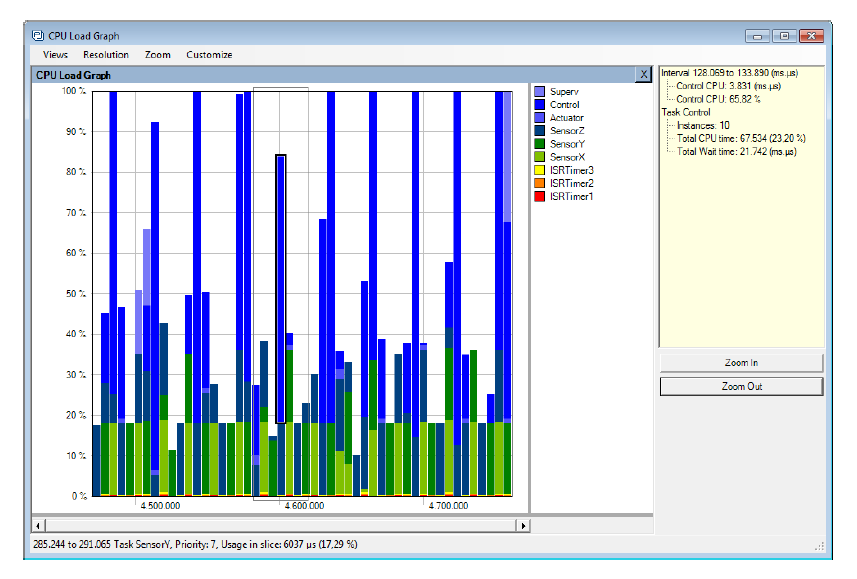

# 12 开发者支持

## 12.1 简介

本章重点介绍了一组功能，这些功能旨在通过以下方式提高生产力：

- 提供对应用程序行为的洞察。
- 指出优化的机会。
- 在错误发生时立即捕获。

## 12.2 configASSERT()

在C语言中，宏`assert()`用于验证程序中的*断言*（假设）。断言以C表达式的形式编写，如果表达式的值为假（0），则认为断言失败。例如，清单12.1测试了指针`pxMyPointer`不为NULL的断言。

<a name="list12.1" title="清单12.1 使用标准C assert()宏检查pxMyPointer是否为NULL"></a>

```c
/* 测试pxMyPointer不为NULL的断言 */
assert( pxMyPointer != NULL );
```
***清单12.1*** *使用标准C assert()宏检查pxMyPointer是否为NULL*

应用程序开发者通过提供`assert()`宏的实现来指定断言失败时应采取的操作。

FreeRTOS源代码不会调用`assert()`，因为并非所有编译器都支持该函数与FreeRTOS一起编译。相反，FreeRTOS源代码中包含许多对名为`configASSERT()`的宏的调用，开发者可以在`FreeRTOSConfig.h`中定义该宏，其行为与标准C `assert()`完全相同。

失败的断言必须被视为致命错误。不要尝试执行断言失败的代码行之后的内容。

> *使用`configASSERT()`可以通过立即捕获并识别最常见的错误来源之一来提高生产力。强烈建议在开发或调试FreeRTOS应用程序时定义`configASSERT()`。*

定义`configASSERT()`将极大地帮助运行时调试，但也会增加应用程序的代码大小，从而减慢其执行速度。如果没有提供`configASSERT()`的定义，则会使用默认的空定义，所有对`configASSERT()`的调用都会被C预处理器完全移除。

### 12.2.1 示例 configASSERT() 定义

清单12.2中显示的`configASSERT()`定义在应用程序在调试器控制下执行时非常有用。它会在任何断言失败的代码行处停止执行，因此当调试会话暂停时，调试器将显示导致断言失败的代码行。

<a name="list12.2" title="清单12.2 一个简单的configASSERT()定义，在调试器控制下执行时非常有用"></a>

```c
/* 禁用中断以使滴答中断停止执行，然后进入循环以确保执行不会越过断言失败的代码行。如果硬件支持调试中断指令，则可以使用调试中断指令代替for()循环。 */

#define configASSERT( x ) if( ( x ) == 0 ) { taskDISABLE_INTERRUPTS(); for(;;); }
```
***清单12.2*** *一个简单的configASSERT()定义，在调试器控制下执行时非常有用*

清单12.3中显示的`configASSERT()`定义在应用程序未在调试器控制下执行时非常有用。它会打印或以其他方式记录导致断言失败的源代码行。导致断言失败的代码行通过标准C宏`__FILE__`获取源文件名，并通过标准C宏`__LINE__`获取源文件中的行号来标识。

<a name="list12.3" title="清单12.3 记录导致断言失败的源代码行的configASSERT()定义"></a>

```c
/* 此函数必须在C源文件中定义，而不是在FreeRTOSConfig.h头文件中定义。 */
void vAssertCalled( const char *pcFile, uint32_t ulLine )
{
    /* 在此函数内部，pcFile保存检测到错误的源文件的名称，ulLine保存源文件中的行号。可以在进入以下无限循环之前打印或记录pcFile和ulLine的值。 */
    RecordErrorInformationHere( pcFile, ulLine );

    /* 禁用中断以使滴答中断停止执行，然后进入循环以确保执行不会越过断言失败的代码行。 */
    taskDISABLE_INTERRUPTS();
    for( ;; );
}
/*-----------------------------------------------------------*/

/* 以下两行必须放置在FreeRTOSConfig.h中。 */
extern void vAssertCalled( const char *pcFile, unsigned long ulLine );
#define configASSERT( x ) if( ( x ) == 0 ) vAssertCalled( __FILE__, __LINE__ )
```
***清单12.3*** *记录导致断言失败的源代码行的configASSERT()定义*


## 12.3 FreeRTOS的Tracealyzer

Tracealyzer for FreeRTOS 是由我们的合作伙伴公司Percepio提供的运行时诊断和优化工具。

Tracealyzer for FreeRTOS 捕获宝贵的动态行为信息，并以相互关联的图形视图呈现捕获的信息。该工具还能够显示多个同步视图。

在分析、排查问题或简单优化FreeRTOS应用程序时，捕获的信息是无价的。

Tracealyzer for FreeRTOS 可以与传统调试器并行使用，并通过更高层次、基于时间的视角补充调试器的视图。


<a name="fig12.1" title="图12.1 FreeRTOS+Trace包含20多个相互关联的视图"></a>
<a name="fig12.2" title="图12.2 FreeRTOS+Trace主跟踪视图 - 20多个相互关联的跟踪视图之一"></a>
<a name="fig12.3" title="图12.3 FreeRTOS+Trace CPU负载视图 - 20多个相互关联的跟踪视图之一"></a>
<a name="fig12.4" title="图12.4 FreeRTOS+Trace响应时间视图 - 20多个相互关联的跟踪视图之一"></a>
<a name="fig12.5" title="图12.5 FreeRTOS+Trace用户事件绘图视图 - 20多个相互关联的跟踪视图之一"></a>
<a name="fig12.6" title="图12.6 FreeRTOS+Trace内核对象历史视图 - 20多个相互关联的跟踪视图之一"></a>

* * *
   
***图12.1*** *FreeRTOS+Trace包含20多个相互关联的视图*

   
***图12.2*** *FreeRTOS+Trace主跟踪视图 - 20多个相互关联的跟踪视图之一*

   
***图12.3*** *FreeRTOS+Trace CPU负载视图 - 20多个相互关联的跟踪视图之一*

   
***图12.4*** *FreeRTOS+Trace响应时间视图 - 20多个相互关联的跟踪视图之一*

   
***图12.5*** *FreeRTOS+Trace用户事件绘图视图 - 20多个相互关联的跟踪视图之一*

   
***图12.6*** *FreeRTOS+Trace内核对象历史视图 - 20多个相互关联的跟踪视图之一*
* * *


## 12.4 调试相关的钩子（回调）函数

### 12.4.1 内存分配失败钩子

内存分配失败钩子（或回调）在第3章“堆内存管理”中有描述。

定义内存分配失败钩子可以确保当尝试创建任务、队列、信号量或事件组失败时，应用程序开发者立即得到通知。

### 12.4.2 堆栈溢出钩子

堆栈溢出钩子的详细信息在第13.3节“堆栈溢出”中提供。

定义堆栈溢出钩子可以确保当任务使用的堆栈量超过分配给该任务的堆栈空间时，应用程序开发者会收到通知。


## 12.5 查看运行时和任务状态信息

### 12.5.1 任务运行时统计信息

任务运行时统计信息提供了每个任务所获得的处理时间信息。任务的*运行时间*是指自应用程序启动以来任务处于运行状态的总时间。

运行时统计信息旨在作为项目开发阶段的性能分析和调试辅助工具。它们提供的信息仅在用作运行时统计时钟的计数器溢出之前有效。收集运行时统计信息将增加任务上下文切换时间。

要获取二进制运行时统计信息，请调用`uxTaskGetSystemState()` API 函数。要以人类可读的ASCII表格形式获取运行时统计信息，请调用`vTaskGetRunTimeStatistics()` 辅助函数。


### 12.5.2 运行时统计时钟

运行时统计需要测量一个tick周期的分数部分。因此，RTOS tick计数不被用作运行时统计时钟，而是由应用程序代码提供时钟。建议将运行时统计时钟的频率设置为比tick中断频率快10到100倍。运行时统计时钟越快，统计信息越精确，但时间值也会越早溢出。

理想情况下，时间值应由一个自由运行的32位外设定时器/计数器生成，其值可以无需其他处理开销即可读取。如果可用的外设和时钟速度无法实现该技术，则可采用其他效率较低的技术，包括：

- 配置一个外设以所需运行时统计时钟频率生成周期性中断，然后使用生成的中断次数作为运行时统计时钟。

  如果周期性中断仅用于提供运行时统计时钟，这种方法非常低效。然而，如果应用程序已经使用了具有合适频率的周期性中断，则只需在现有的中断服务例程中添加中断次数的计数即可，简单且高效。

- 使用当前自由运行的16位外设定时器的值作为32位值的最低有效16位，并使用定时器溢出的次数作为32位值的最高有效16位来生成32位值。

通过适当且稍复杂的操作，可以结合RTOS tick计数和ARM Cortex-M SysTick定时器的当前值生成运行时统计时钟。FreeRTOS下载包中的某些演示项目展示了如何实现这一点。


### 12.5.3 配置应用程序以收集运行时统计信息

以下是收集任务运行时统计信息所需的宏的详细信息。最初，这些宏旨在包含在RTOS端口层中，这就是为什么这些宏以“port”为前缀的原因，但实践证明，在`FreeRTOSConfig.h`中定义它们更为实用。

**用于收集运行时统计信息的宏**

- `configGENERATE_RUN_TIME_STATS`

  此宏必须在FreeRTOSConfig.h中设置为1。当此宏设置为1时，调度程序将在适当的时间调用本节中详述的其他宏。

- `portCONFIGURE_TIMER_FOR_RUN_TIME_STATS()`

  必须提供此宏以初始化用于提供运行时统计时钟的外设。

- `portGET_RUN_TIME_COUNTER_VALUE()` 或 `portALT_GET_RUN_TIME_COUNTER_VALUE(Time)`

  必须提供这两个宏之一以返回当前运行时统计时钟的值。这是自应用程序首次启动以来，应用程序已运行的总时间，单位为运行时统计时钟单位。

  如果使用第一个宏，则必须将其定义为评估为当前时钟值。如果使用第二个宏，则必须将其定义为将其“Time”参数设置为当前时钟值。


### 12.5.4 `uxTaskGetSystemState()` API函数

`uxTaskGetSystemState()` 提供了由FreeRTOS调度程序控制的每个任务的状态信息快照。这些信息以`TaskStatus_t`结构数组的形式提供，数组中的每个索引对应一个任务。`TaskStatus_t`的定义见代码清单12.5及以下内容。


<a name="list12.4" title="代码清单12.4 uxTaskGetSystemState() API函数原型"></a>

```c
UBaseType_t uxTaskGetSystemState( TaskStatus_t * const pxTaskStatusArray,
                                  const UBaseType_t uxArraySize,
                                  configRUN_TIME_COUNTER_TYPE * const pulTotalRunTime );
```
***代码清单12.4*** *`uxTaskGetSystemState()` API函数原型*

> 注意：为了向后兼容，`configRUN_TIME_COUNTER_TYPE`默认为`uint32_t`，但如果`uint32_t`限制过多，可以在FreeRTOSConfig.h中覆盖该定义。


**`uxTaskGetSystemState()` 参数和返回值**

- `pxTaskStatusArray`

  指向`TaskStatus_t`结构数组的指针。

  数组必须至少包含每个任务的一个`TaskStatus_t`结构。可以使用`uxTaskGetNumberOfTasks()` API函数确定任务数量。

  `TaskStatus_t`结构如代码清单12.5所示，其成员将在下一个列表中描述。

- `uxArraySize`

  指向`pxTaskStatusArray`参数所指向数组的大小。
  该大小指定为数组中的索引数量（即数组中包含的`TaskStatus_t`结构的数量），而不是数组中的字节数。

- `pulTotalRunTime`

  如果在`FreeRTOSConfig.h`中将`configGENERATE_RUN_TIME_STATS`设置为1，则`*pulTotalRunTime`将由`uxTaskGetSystemState()`设置为目标设备自启动以来的总运行时间（由应用程序提供的运行时统计时钟定义）。

  `pulTotalRunTime`是可选的，如果不需要总运行时间，可以将其设置为NULL。

- 返回值

  返回由`uxTaskGetSystemState()`填充的`TaskStatus_t`结构的数量。

  返回值应等于`uxTaskGetNumberOfTasks()` API函数返回的数量，但如果`uxArraySize`参数传入的值过小，则返回值将为零。


<a name="list12.5" title="代码清单12.5 TaskStatus\_t结构"></a>

```c
typedef struct xTASK_STATUS
{
    TaskHandle_t xHandle;
    const char *pcTaskName;
    UBaseType_t xTaskNumber;
    eTaskState eCurrentState;
    UBaseType_t uxCurrentPriority;
    UBaseType_t uxBasePriority;
    configRUN_TIME_COUNTER_TYPE ulRunTimeCounter;
    StackType_t * pxStackBase;
    #if ( ( portSTACK_GROWTH > 0 ) || ( configRECORD_STACK_HIGH_ADDRESS == 1 ) )
        StackType_t * pxTopOfStack;
        StackType_t * pxEndOfStack;
    #endif
    uint16_t usStackHighWaterMark;
    #if ( ( configUSE_CORE_AFFINITY == 1 ) && ( configNUMBER_OF_CORES > 1 ) )
        UBaseType_t uxCoreAffinityMask;
    #endif
} TaskStatus_t;
```
***代码清单12.5*** *`TaskStatus_t`结构*

**`TaskStatus_t`结构成员**

- `xHandle`

  与该结构中信息相关的任务句柄。

- `pcTaskName`

  任务的可读文本名称。

- `xTaskNumber`

  每个任务都有一个唯一的`xTaskNumber`值。

  如果应用程序在运行时创建和删除任务，则可能会出现某个任务的句柄与先前已删除的任务相同的情况。提供`xTaskNumber`是为了让应用程序代码和内核感知调试器能够区分当前有效的任务和已删除的任务（尽管它们的句柄相同）。

- `eCurrentState`

  一个枚举类型，表示任务的状态。
  `eCurrentState`可以是以下值之一：
  
  - `eRunning`（运行中）
  - `eReady`（就绪）
  - `eBlocked`（阻塞）
  - `eSuspended`（挂起）
  - `eDeleted`（已删除）

  任务仅会在通过调用`vTaskDelete()`删除任务后，到空闲任务释放分配给该任务内部数据结构和堆栈的内存之前的短暂时间内报告为`eDeleted`状态。在此之后，该任务将完全不存在，尝试使用其句柄将是无效的。

- `uxCurrentPriority`

  调用`uxTaskGetSystemState()`时任务正在运行的优先级。只有在任务根据[8.3 互斥信号量（和二进制信号量）](ch08.md#83-mutexes-and-binary-semaphores)一节中描述的优先级继承机制临时被赋予更高优先级的情况下，`uxCurrentPriority`才会高于应用程序开发者为任务分配的优先级。

- `uxBasePriority`

  应用程序开发者为任务分配的优先级。
  仅当在FreeRTOSConfig.h中将`configUSE_MUTEXES`设置为1时，`uxBasePriority`才有效。

- `ulRunTimeCounter`

  自任务创建以来，任务使用的总运行时间。总运行时间以绝对时间形式提供，使用由应用程序开发者提供的用于收集运行时统计信息的时钟。仅当在FreeRTOSConfig.h中将`configGENERATE_RUN_TIME_STATS`设置为1时，`ulRunTimeCounter`才有效。

- `pxStackBase`

  指向分配给该任务的堆栈区域的基地址。

- `pxTopOfStack`

  指向分配给该任务的堆栈区域的当前顶部地址。
  仅当堆栈向上增长（即`portSTACK_GROWTH`大于零）或在FreeRTOSConfig.h中将`configRECORD_STACK_HIGH_ADDRESS`设置为1时，字段`pxTopOfStack`才有效。

- `pxEndOfStack`

  指向分配给该任务的堆栈区域的结束地址。
  仅当堆栈向上增长（即`portSTACK_GROWTH`大于零）或在FreeRTOSConfig.h中将`configRECORD_STACK_HIGH_ADDRESS`设置为1时，字段`pxEndOfStack`才有效。

- `usStackHighWaterMark`

  任务的堆栈高水位标记。这是自任务创建以来任务剩余堆栈空间的最小值。
  它表明了任务堆栈溢出的接近程度；该值越接近零，任务越接近堆栈溢出。`usStackHighWaterMark`以字节为单位指定。
- `uxCoreAffinityMask`

   一个按位值，指示任务可以运行的核心。
   核心编号从0到`configNUMBER_OF_CORES` - 1。例如，可以在核心0和核心1上运行的任务会将其`uxCoreAffinityMask`设置为0x03。字段`uxCoreAffinityMask`仅在FreeRTOSConfig.h中将`configUSE_CORE_AFFINITY`设置为1且`configNUMBER_OF_CORES`设置为大于1时可用。


### 12.5.5 vTaskListTasks() 辅助函数

`vTaskListTasks()` 提供了与`uxTaskGetSystemState()`类似的任务状态信息，但它以人类可读的ASCII表格形式呈现，而不是二进制值数组。

`vTaskListTasks()` 是一个非常耗费处理器资源的函数，并且会让调度器挂起较长时间。因此，建议仅将此函数用于调试目的，而不应在生产实时系统中使用。

如果在FreeRTOSConfig.h中将`configUSE_TRACE_FACILITY`设置为1且将`configUSE_STATS_FORMATTING_FUNCTIONS`设置为大于0，则`vTaskListTasks()`可用。


<a name="list12.6" title="清单 12.6 vTaskListTasks() API 函数原型"></a>

```c
void vTaskListTasks( char * pcWriteBuffer, size_t uxBufferLength );
```
***清单 12.6*** *vTaskListTasks() API 函数原型*

**vTaskListTasks() 参数**

- `pcWriteBuffer`

  指向字符缓冲区的指针，格式化后的可读表格将写入该缓冲区。
  假定此缓冲区足够大以容纳生成的报告。
  每个任务大约需要40字节。

- `uxBufferLength`

  `pcWriteBuffer` 的长度。

`vTaskListTasks()` 生成的输出示例如图12.7所示。
在输出中：

- 每一行提供有关单个任务的信息。

- 第一列是任务的名称。

- 第二列是任务的状态，其中'X'表示运行中，'R'表示就绪，'B'表示阻塞，'S'表示挂起，'D'表示任务已被删除。任务仅会在通过调用`vTaskDelete()`删除任务后，到空闲任务释放分配给该任务内部数据结构和堆栈的内存之前的短暂时间内报告为已删除状态。在此之后，该任务将完全不存在，尝试使用其句柄将是无效的。

- 第三列是任务的优先级。

- 第四列是任务的堆栈高水位标记。参见`usStackHighWaterMark`的描述。

- 第五列是分配给任务的唯一编号。参见`xTaskNumber`的描述。


<a name="fig12.7" title="图 12.7 vTaskListTasks() 生成的示例输出"></a>

* * *
   
***图 12.7*** *vTaskListTasks() 生成的示例输出*
* * *

> 注意：   
> `vTaskListTasks` 的旧版本是 `vTaskList`。`vTaskList` 假定 `pcWriteBuffer` 的长度为 `configSTATS_BUFFER_MAX_LENGTH`。此函数仅为了向后兼容性而存在。建议新应用程序使用 `vTaskListTasks` 并显式提供 `pcWriteBuffer` 的长度。


<a name="list12.7" title="清单 12.7 vTaskList() API 函数原型"></a>

```c
void vTaskList( signed char *pcWriteBuffer );
```
***清单 12.7*** *vTaskList() API 函数原型*

  **vTaskList() 参数**

  - `pcWriteBuffer`
    
    指向字符缓冲区的指针，格式化后的可读表格将写入该缓冲区。
    缓冲区必须足够大以容纳整个表格，因为不会进行边界检查。


### 12.5.6 vTaskGetRunTimeStatistics() 辅助函数

`vTaskGetRunTimeStatistics()` 将收集到的运行时统计信息格式化为人类可读的ASCII表格。

`vTaskGetRunTimeStatistics()` 是一个非常耗费处理器资源的函数，并且会让调度器挂起较长时间。因此，建议仅将此函数用于调试目的，而不应在生产实时系统中使用。

当在FreeRTOSConfig.h中将 `configGENERATE_RUN_TIME_STATS` 设置为1，将 `configUSE_STATS_FORMATTING_FUNCTIONS` 设置为大于0，且将 `configUSE_TRACE_FACILITY` 设置为1时，`vTaskGetRunTimeStatistics()` 可用。


<a name="list12.8" title="清单 12.8 vTaskGetRunTimeStatistics() API 函数原型"></a>

```c
void vTaskGetRunTimeStatistics( char * pcWriteBuffer, size_t uxBufferLength );
```
***清单 12.8*** *vTaskGetRunTimeStatistics() API 函数原型*

**vTaskGetRunTimeStatistics() 参数**

- `pcWriteBuffer`

  指向字符缓冲区的指针，格式化后的可读表格将写入该缓冲区。
  假定此缓冲区足够大以容纳生成的报告。  
  每个任务大约需要40字节。

- `uxBufferLength` 

  `pcWriteBuffer` 的长度。

`vTaskGetRunTimeStatistics()` 生成的输出示例如图12.8所示。在输出中：

- 每一行提供有关单个任务的信息。

- 第一列是任务名称。

- 第二列是以绝对值形式显示的任务处于运行状态的时间。参见 `ulRunTimeCounter` 的描述。

- 第三列是自目标启动以来，任务处于运行状态的时间占总时间的百分比。显示的百分比总和通常会小于预期的100%，因为统计信息的收集和计算使用的是整数运算，并向下取整到最接近的整数值。


<a name="fig12.8" title="图 12.8 vTaskGetRunTimeStatistics() 生成的示例输出"></a>

* * *
   
***图 12.8*** *vTaskGetRunTimeStatistics() 生成的示例输出*
* * *

> 注意：   
> `vTaskGetRunTimeStatistics` 的旧版本是 `vTaskGetRunTimeStats`。 
> `vTaskGetRunTimeStats` 假定 `pcWriteBuffer` 的长度为 `configSTATS_BUFFER_MAX_LENGTH`。此函数仅为了向后兼容性而存在。
> 建议新应用程序使用 `vTaskGetRunTimeStatistics` 并显式提供 `pcWriteBuffer` 的长度。


 <a name="list12.9" title="清单 12.9 vTaskGetRunTimeStats() API 函数原型"></a>

 ```c
 void vTaskGetRunTimeStats( signed char *pcWriteBuffer );
 ```
 ***清单 12.9*** *vTaskGetRunTimeStats() API 函数原型*
 
  **vTaskGetRunTimeStats() 参数**

  - `pcWriteBuffer`

    指向字符缓冲区的指针，格式化后的可读表格将写入该缓冲区。缓冲区必须足够大以容纳整个表格，因为不会进行边界检查。


### 12.5.7 生成和显示运行时统计信息：一个完整示例

本示例使用一个假设的16位定时器生成32位运行时统计时钟。该计数器被配置为每次16位值达到其最大值时触发中断——实际上创建了一个溢出中断。中断服务程序会记录溢出发生的次数。

32位值通过将溢出次数作为32位值的两个最高有效字节，以及当前16位计数器值作为32位值的两个最低有效字节来生成。中断服务程序的伪代码如清单12.10所示。


<a name="list12.10" title="清单 12.10 用于计数定时器溢出的16位定时器溢出中断处理程序"></a>

```c
void TimerOverflowInterruptHandler( void )
{
    /* 只需记录中断次数。 */
    ulOverflowCount++;

    /* 清除中断。 */
    ClearTimerInterrupt();
}
```
***清单 12.10*** *用于计数定时器溢出的16位定时器溢出中断处理程序*

清单12.11展示了添加到FreeRTOSConfig.h中的行，以启用运行时统计信息的收集。


<a name="list12.11" title="清单 12.11 添加到FreeRTOSConfig.h中以启用运行时统计信息收集的宏"></a>

```c
/* 将 configGENERATE_RUN_TIME_STATS 设置为1以启用运行时统计信息的收集。
   当执行此操作时，还必须定义 portCONFIGURE_TIMER_FOR_RUN_TIME_STATS() 
   和 portGET_RUN_TIME_COUNTER_VALUE() 或 portALT_GET_RUN_TIME_COUNTER_VALUE(x)。 */
#define configGENERATE_RUN_TIME_STATS 1

/* portCONFIGURE_TIMER_FOR_RUN_TIME_STATS() 被定义为调用设置假设的16位定时器的函数
   （该函数的实现未显示）。 */
void vSetupTimerForRunTimeStats( void );
#define portCONFIGURE_TIMER_FOR_RUN_TIME_STATS()  vSetupTimerForRunTimeStats()

/* portALT_GET_RUN_TIME_COUNTER_VALUE() 被定义为其参数设置为当前运行时计数器/时间值。
   返回的时间值是32位长，通过将16位定时器溢出计数移入32位数字的高两位字节，
   然后与当前16位计数器值进行按位或运算形成。 */
#define portALT_GET_RUN_TIME_COUNTER_VALUE( ulCountValue )                  \
{                                                                           \
    extern volatile unsigned long ulOverflowCount;                          \
                                                                            \
    /* 断开时钟与计数器的连接，以便在使用其值时不发生变化。 */              \
    PauseTimer();                                                           \
                                                                            \
    /* 溢出次数被移入返回的32位值的最高两位字节。 */                        \
    ulCountValue = ( ulOverflowCount << 16UL );                             \
                                                                            \
    /* 当前计数器值用作返回的32位值的最低两位字节。 */                      \
    ulCountValue |= ( unsigned long ) ReadTimerCount();                     \
                                                                            \
    /* 重新将时钟连接到计数器。 */                                          \
    ResumeTimer();                                                          \
}
```
***清单 12.11*** *添加到FreeRTOSConfig.h中以启用运行时统计信息收集的宏*

清单12.12中的任务每隔5秒打印一次收集的运行时统计信息。

<a name="list12.12" title="清单 12.12 打印收集的运行时统计信息的任务"></a>

```c
#define RUN_TIME_STATS_STRING_BUFFER_LENGTH       512

/* 为简洁起见，此代码清单中省略了对 fflush() 的调用。 */
static void prvStatsTask( void *pvParameters )
{
    TickType_t xLastExecutionTime;

    /* 用于保存格式化运行时统计文本的缓冲区需要相当大。
       因此将其声明为静态变量，以确保它不会分配在任务堆栈上。
       这使得该函数不可重入。 */
    static signed char cStringBuffer[ RUN_TIME_STATS_STRING_BUFFER_LENGTH ];

    /* 任务将每5秒运行一次。 */
    const TickType_t xBlockPeriod = pdMS_TO_TICKS( 5000 );

    /* 将 xLastExecutionTime 初始化为当前时间。
       这是唯一一次需要显式写入该变量。
       之后它将在 vTaskDelayUntil() API 函数内部更新。 */
    xLastExecutionTime = xTaskGetTickCount();

    /* 与大多数任务一样，此任务在一个无限循环中实现。 */
    for( ;; )
    {
        /* 等待直到再次运行此任务的时间到来。 */
        xTaskDelayUntil( &xLastExecutionTime, xBlockPeriod );

        /* 从运行时统计数据生成一个文本表。
           它必须适合 cStringBuffer 数组。 */
        vTaskGetRunTimeStatistics( cStringBuffer, RUN_TIME_STATS_STRING_BUFFER_LENGTH );

        /* 打印运行时统计表的列标题。 */
        printf( "\n任务\t\t绝对值\t\t\t%%\n" );
        printf( "-------------------------------------------------------------\n" );

        /* 打印运行时统计数据本身。
           数据表包含多行，因此调用 vPrintMultipleLines() 函数，
           而不是直接调用 printf()。
           vPrintMultipleLines() 只是对每一行单独调用 printf()，
           以确保行缓冲按预期工作。 */ 
        vPrintMultipleLines( cStringBuffer );
    }
}
```
***清单 12.12*** *打印收集的运行时统计信息的任务*


## 12.6 跟踪钩子宏

跟踪宏是放置在FreeRTOS源代码关键位置的宏。默认情况下，这些宏为空，因此不会生成任何代码，也没有运行时开销。通过覆盖默认的空实现，应用程序开发者可以：

- 在不修改FreeRTOS源文件的情况下插入代码。

- 使用目标硬件上可用的任何方法输出详细的执行顺序信息。
  FreeRTOS源代码中有足够多的跟踪宏，允许它们用于创建完整且详细的调度器活动跟踪和性能分析日志。


### 12.6.1 可用的跟踪钩子宏

在此详细列出每个宏会占用太多篇幅。以下列表详细说明了被认为对应用程序开发者最有用的宏子集。

以下列表中的许多描述都提到了一个名为`pxCurrentTCB`的变量。`pxCurrentTCB`是FreeRTOS的一个私有变量，保存了处于运行状态的任务的句柄，并且可供从FreeRTOS/Source/tasks.c源文件中调用的任何宏使用。

**一些最常用的跟踪钩子宏**

- `traceTASK_INCREMENT_TICK(xTickCount)`

  在滴答中断期间调用，且在滴答计数递增之前。`xTickCount`参数将新的滴答计数值传递到宏中。

- `traceTASK_SWITCHED_OUT()`

  在选择新任务运行之前调用。此时，`pxCurrentTCB`包含即将离开运行状态的任务的句柄。

- `traceTASK_SWITCHED_IN()`

  在选择任务运行之后调用。此时，`pxCurrentTCB`包含即将进入运行状态的任务的句柄。

- `traceBLOCKING_ON_QUEUE_RECEIVE(pxQueue)`
  
  在当前执行任务尝试从空队列读取、或尝试“获取”空信号量或互斥锁后立即进入阻塞状态前调用。`pxQueue`参数将目标队列或信号量的句柄传递到宏中。

- `traceBLOCKING_ON_QUEUE_SEND(pxQueue)`
  
  在当前执行任务尝试写入已满队列后立即进入阻塞状态前调用。`pxQueue`参数将目标队列的句柄传递到宏中。

- `traceQUEUE_SEND(pxQueue)`
  
  在`xQueueSend()`、`xQueueSendToFront()`、`xQueueSendToBack()`或任何信号量“释放”函数内部调用，当队列发送或信号量“释放”操作成功时触发。`pxQueue`参数将目标队列或信号量的句柄传递到宏中。

- `traceQUEUE_SEND_FAILED(pxQueue)`

  在`xQueueSend()`、`xQueueSendToFront()`、`xQueueSendToBack()`或任何信号量“释放”函数内部调用，当队列发送或信号量“释放”操作失败时触发。如果队列已满并在指定的阻塞时间内保持已满，则队列发送或信号量“释放”将失败。`pxQueue`参数将目标队列或信号量的句柄传递到宏中。

- `traceQUEUE_RECEIVE(pxQueue)`

  在`xQueueReceive()`或任何信号量“获取”函数内部调用，当队列接收或信号量“获取”操作成功时触发。`pxQueue`参数将目标队列或信号量的句柄传递到宏中。

- `traceQUEUE_RECEIVE_FAILED(pxQueue)`

  在`xQueueReceive()`或任何信号量“获取”函数内部调用，当队列或信号量接收操作失败时触发。如果队列或信号量为空并在指定的阻塞时间内保持为空，则队列接收或信号量“获取”操作将失败。`pxQueue`参数将目标队列或信号量的句柄传递到宏中。

- `traceQUEUE_SEND_FROM_ISR(pxQueue)`

  在`xQueueSendFromISR()`内部调用，当发送操作成功时触发。`pxQueue`参数将目标队列的句柄传递到宏中。

- `traceQUEUE_SEND_FROM_ISR_FAILED(pxQueue)`

  在`xQueueSendFromISR()`内部调用，当发送操作失败时触发。如果队列已满，则发送操作将失败。`pxQueue`参数将目标队列的句柄传递到宏中。

- `traceQUEUE_RECEIVE_FROM_ISR(pxQueue)`

  在`xQueueReceiveFromISR()`内部调用，当接收操作成功时触发。`pxQueue`参数将目标队列的句柄传递到宏中。

- `traceQUEUE_RECEIVE_FROM_ISR_FAILED(pxQueue)`

  在`xQueueReceiveFromISR()`内部调用，当接收操作因队列已空而失败时触发。`pxQueue`参数将目标队列的句柄传递到宏中。

- `traceTASK_DELAY_UNTIL( xTimeToWake )`

  在`xTaskDelayUntil()`内部调用，紧接在调用任务进入阻塞状态之前触发。

- `traceTASK_DELAY()`

  在`vTaskDelay()`内部调用，紧接在调用任务进入阻塞状态之前触发。


### 12.6.2 定义跟踪钩子宏

每个跟踪宏都有一个默认的空定义。可以通过在FreeRTOSConfig.h中提供新的宏定义来覆盖默认定义。如果跟踪宏定义变得冗长或复杂，可以将其实施在一个新的头文件中，然后从FreeRTOSConfig.h中包含该头文件。

根据软件工程的最佳实践，FreeRTOS保持严格的封装策略。跟踪宏允许用户代码添加到FreeRTOS源文件中，因此跟踪宏可见的数据类型将与应用程序代码可见的数据类型不同：

- 在FreeRTOS/Source/tasks.c源文件内部，任务句柄是指向描述任务的数据结构（任务的*任务控制块*或*TCB*）的指针。在FreeRTOS/Source/tasks.c源文件外部，任务句柄是一个指向void的指针。

- 在FreeRTOS/Source/queue.c源文件内部，队列句柄是指向描述队列的数据结构的指针。在FreeRTOS/Source/queue.c源文件外部，队列句柄是一个指向void的指针。

> *如果跟踪宏直接访问通常为私有的FreeRTOS数据结构，则需要极其谨慎，因为私有数据结构可能会在不同的FreeRTOS版本之间发生变化。*


### 12.6.3 支持FreeRTOS的调试插件

以下IDE提供了支持部分FreeRTOS功能的插件。此列表可能并不全面：


- Eclipse（StateViewer）

- Eclipse（ThreadSpy）

- IAR

- ARM DS-5

- Atollic TrueStudio

- Microchip MPLAB

- iSYSTEM WinIDEA

- STM32CubeIDE

